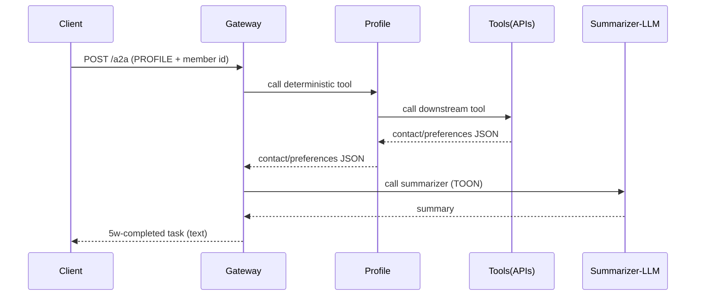
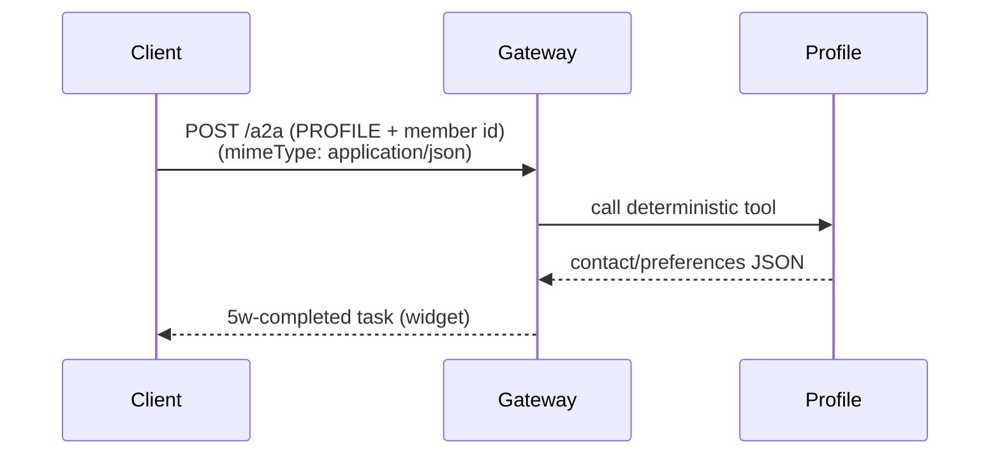
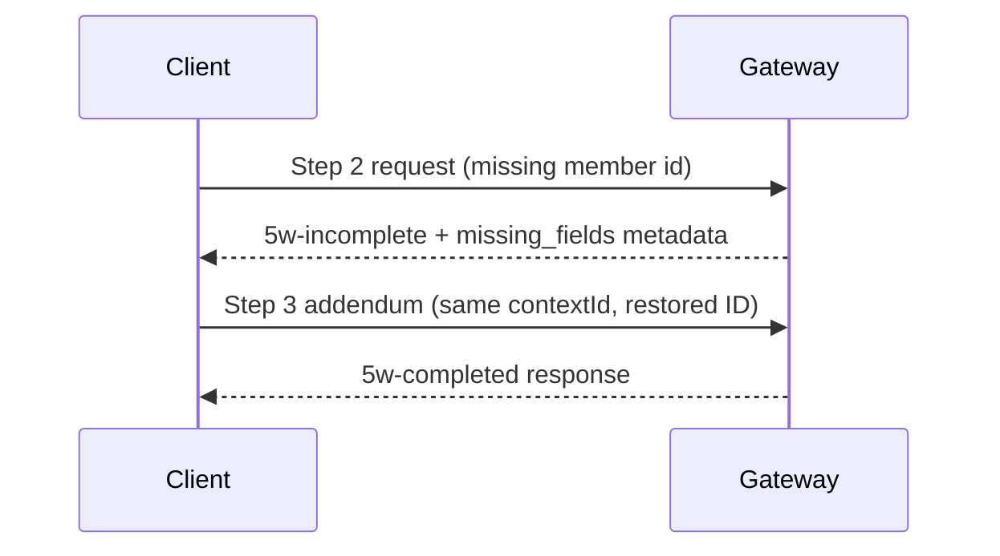
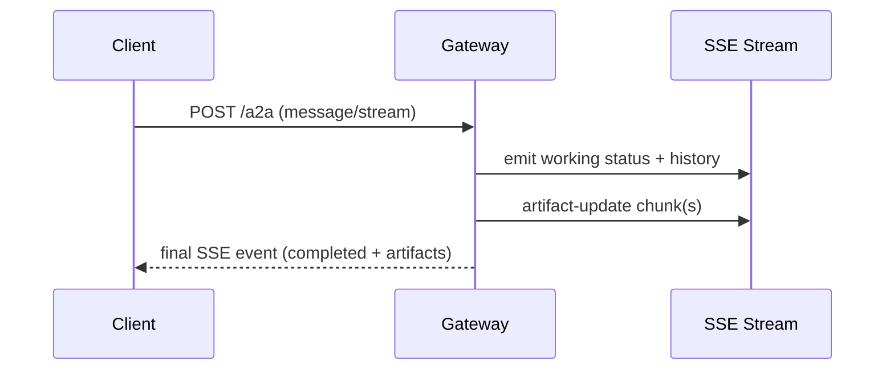
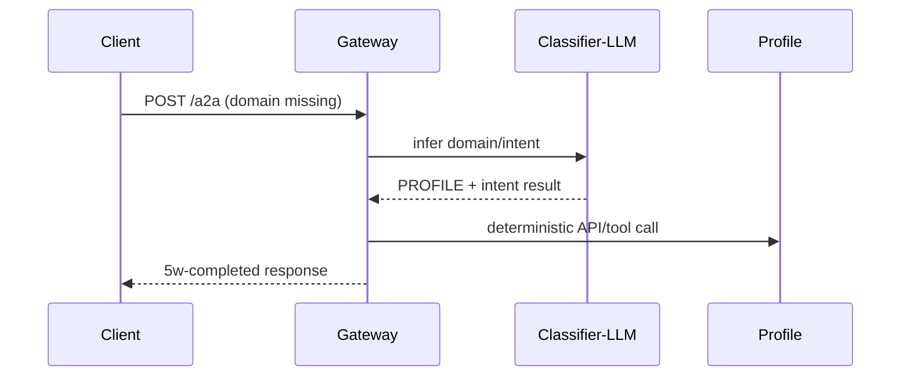
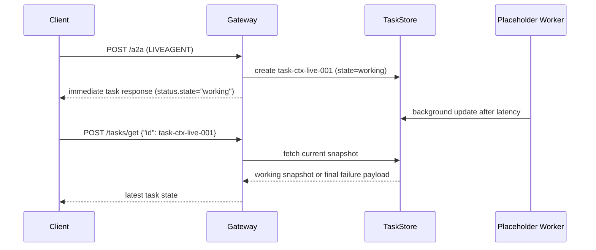
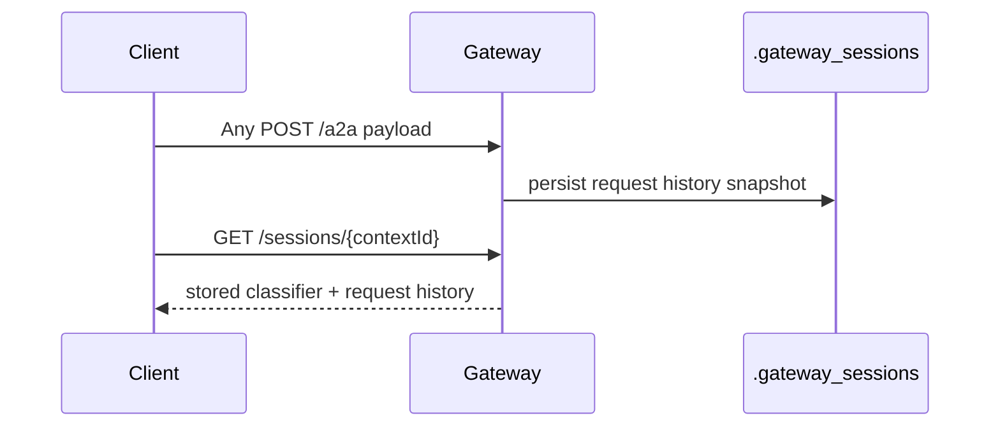
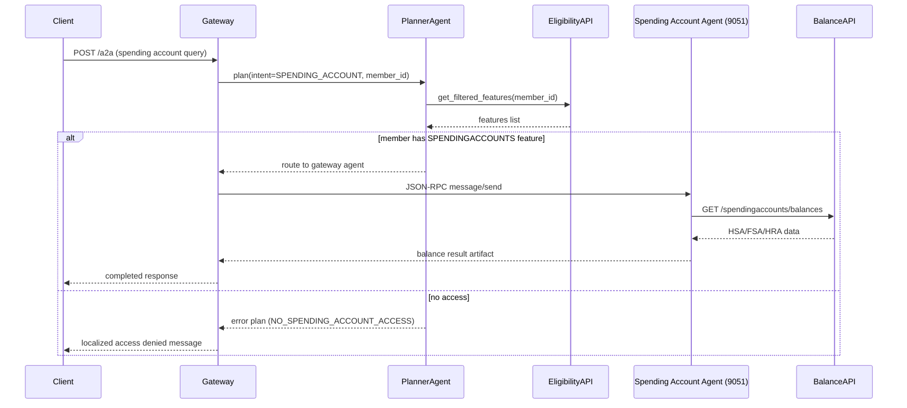

TODO

import json as _json
import re
import time
from typing import Any, AsyncIterable, Optional, Type

import httpx
from strands.models import Model
from strands.types.content import Messages
from strands.types.streaming import StreamEvent
from strands.types.tools import ToolSpec

from agents.gateway.config import build_llm_url
from utils.horizon.horizon_token_utils import get_horizon_access_token_async
from utils.http_error_handler import APISystemError, RateLimitError
from utils.http_utils import filter_sensitive_headers, get_requests_verify
from utils.logging.audit_codes import AuditCode
from utils.logging.structured_logger import get_logger

logger = get_logger(__name__)

_INPUT_TOKEN_COST: float = 0.00000175
_OUTPUT_TOKEN_COST: float = 0.000014


def estimate_token_usage(input_text: str, output_text: str) -> dict:
    """
    Estimate token usage and cost using the Horizon pricing spec.
    Approximation: 1 token ≈ 4 characters.

    Args:
        input_text: Combined input text (system prompt + user message).
        output_text: LLM output text.

    Returns:
        Dict with input_tokens, output_tokens, estimated_cost_usd.
    """
    input_tokens = len(input_text) / 4
    output_tokens = len(output_text) / 4
    estimated_cost = (input_tokens * _INPUT_TOKEN_COST) + (output_tokens * _OUTPUT_TOKEN_COST)
    return {
        "input_tokens": round(input_tokens),
        "output_tokens": round(output_tokens),
        "estimated_cost_usd": round(estimated_cost, 8),
    }

class HorizonModel(Model):
    class ModelConfig(dict):
        model_id: str
        params: Optional[dict]

    def __init__(
        self,
        access_token: str,
        model_id: str = "horizon-llm-v2",
        temperature: float = 0,
        base_url: Optional[str] = None,
        channel: Optional[str] = None,
    ):
        self.access_token = access_token
        self.model_id = model_id
        self.temperature = temperature
        normalized_base_url = str(base_url or "").strip().rstrip("/")
        if not normalized_base_url:
            raise ValueError("LLM base_url is missing. Provide it from channel config ('sms' or 'web').")
        self.base_url = normalized_base_url
        self.channel = channel
        self.config = HorizonModel.ModelConfig(model_id=model_id, params={"temperature": temperature})

    def update_config(self, **model_config):
        self.config.update(model_config)

    def get_config(self):
        return self.config

    async def stream(
        self,
        messages: Messages,
        tool_specs: Optional[list[ToolSpec]] = None,
        system_prompt: Optional[str] = None,
        **kwargs: Any
    ) -> AsyncIterable[StreamEvent]:
        url = build_llm_url("chats_url", channel=self.channel)

        masked_token = (
            f"len={len(self.access_token)} prefix={self.access_token[:6]}***suffix={self.access_token[-4:]}"
            if self.access_token
            else "empty"
        )
        logger.info(
            f"[HORIZON DEBUG] Preparing LLM request",
            token_info=masked_token,
            model_id=self.model_id,
            temperature=self.temperature
        )
        headers = {
            "Authorization": f"Bearer {self.access_token}",
            "Content-Type": "application/json"
        }
        system_content = system_prompt or "You are a helpful assistant."
        user_content = ""
        if isinstance(messages, list):
            for m in reversed(messages):
                if isinstance(m, dict) and m.get("role") == "user" and m.get("content"):
                    content = m["content"]
                    if isinstance(content, list):
                        user_content = " ".join(
                            (item.get("text") if isinstance(item, dict) and "text" in item else str(item))
                            for item in content
                        )
                    elif isinstance(content, dict):
                        user_content = content.get("text", str(content))
                    else:
                        user_content = str(content)
                    break
            for m in reversed(messages):
                if isinstance(m, dict) and m.get("role") == "system" and m.get("content"):
                    system_content = m["content"]
                    break
        else:
            user_content = str(messages)
        payload = {
            "messages": [
                {"content": system_content, "role": "system"},
                {"content": user_content, "role": "user"}
            ],
            **self.config
        }
        logger.debug(f"[HORIZON DEBUG] Outgoing payload: {_json.dumps(payload, indent=2, ensure_ascii=False)}")
        logger.debug(f"[HORIZON DEBUG] Request headers: {_json.dumps(filter_sensitive_headers(headers), indent=2, ensure_ascii=False)}")
        
        start_time = time.time()
        verify_cert = get_requests_verify(url)
        logger.debug(f"[HORIZON DEBUG] POST {url} verify={verify_cert}")
        status_code = None

        async def do_post(hdrs: dict) -> dict:
            async with httpx.AsyncClient(verify=verify_cert, timeout=60.0) as client:
                resp = await client.post(url, headers=hdrs, json=payload)
                resp.raise_for_status()
                return resp.status_code, resp.json()

        try:
            status_code, result = await do_post(headers)

            output_content = result.get("message", {}).get("content", "")
            token_usage = estimate_token_usage(
                input_text=system_content + user_content,
                output_text=output_content
            )

            # Log successful API call
            elapsed_ms = (time.time() - start_time) * 1000
            logger.audit_downstream_call(
                code=AuditCode.CALLED_HORIZON_API,
                method="POST",
                url=url,
                status_code=status_code,
                elapsed_ms=elapsed_ms,
                request_body={
                    "model_id": self.model_id,
                    "temperature": self.temperature,
                    "message_count": len(payload.get("messages", [])),
                },
                response_body={
                    "message_role": result.get("message", {}).get("role"),
                    "content_length": len(output_content),
                    **token_usage,
                },
                request_name="HorizonChatRequest"
            )

        except httpx.HTTPStatusError as exc:
            status = exc.response.status_code if exc.response is not None else None
            elapsed_ms = (time.time() - start_time) * 1000

            if status == 401:
                # Access token likely expired; refresh and retry once
                try:
                    new_token = await get_horizon_access_token_async(self.channel)
                    self.access_token = new_token
                    headers["Authorization"] = f"Bearer {self.access_token}"
                    logger.info("Refreshed token after 401; retrying request")

                    retry_start = time.time()
                    retry_status, retryResponse = await do_post(headers)

                    # Log successful retry
                    retry_elapsed_ms = (time.time() - retry_start) * 1000
                    retry_output_content = retryResponse.get("message", {}).get("content", "")
                    retry_token_usage = estimate_token_usage(
                        input_text=system_content + user_content,
                        output_text=retry_output_content
                    )
                    logger.audit_downstream_call(
                        code=AuditCode.CALLED_HORIZON_API,
                        method="POST",
                        url=url,
                        status_code=retry_status,
                        elapsed_ms=retry_elapsed_ms,
                        request_body={
                            "model_id": self.model_id,
                            "temperature": self.temperature,
                            "retry_after_401": True
                        },
                        response_body={
                            "message_role": retryResponse.get("message", {}).get("role"),
                            "content_length": len(retry_output_content),
                            **retry_token_usage,
                        },
                        request_name="HorizonChatRequest"
                    )
                    result = retryResponse

                except Exception as retry_exc:
                    retry_elapsed_ms = (time.time() - start_time) * 1000
                    logger.audit_downstream_call(
                        code=AuditCode.CALLED_HORIZON_API,
                        method="POST",
                        url=url,
                        status_code=getattr(getattr(retry_exc, "response", None), "status_code", 0),
                        elapsed_ms=retry_elapsed_ms,
                        request_body={
                            "model_id": self.model_id,
                            "retry_after_401": True
                        },
                        error=f"Retry failed: {str(retry_exc)}",
                        request_name="HorizonChatRequest"
                    )
                    logger.error("Retry after token refresh failed", error=retry_exc)
                    raise
            else:
                # Log the API call - suppress error field for 429 to reduce log noise
                audit_params = {
                    "code": AuditCode.CALLED_HORIZON_API,
                    "method": "POST",
                    "url": url,
                    "status_code": status or 0,
                    "elapsed_ms": elapsed_ms,
                    "request_body": {
                        "model_id": self.model_id,
                        "temperature": self.temperature
                    },
                    "request_name": "HorizonChatRequest"
                }

                # For 429 errors, don't include error field (reduces log noise)
                if status != 429:
                    audit_params["error"] = f"HTTP {status}: {str(exc)}"

                logger.audit_downstream_call(**audit_params)
                
                # Convert httpx.HTTPStatusError to custom exceptions
                if status == 429:
                    raise RateLimitError("horizon", retry_after=None) from exc
                else:
                    raise APISystemError("horizon", f"HTTP {status}: {str(exc)}", original_error=exc) from exc
        except httpx.TimeoutException as exc:
            elapsed_ms = (time.time() - start_time) * 1000
            logger.audit_downstream_call(
                code=AuditCode.CALLED_HORIZON_API,
                method="POST",
                url=url,
                status_code=0,
                elapsed_ms=elapsed_ms,
                request_body={
                    "model_id": self.model_id,
                    "temperature": self.temperature,
                },
                error=f"Timeout: {str(exc)}",
                request_name="HorizonChatRequest"
            )
            raise APISystemError("horizon", "Request timeout during chat request", original_error=exc) from exc
        except httpx.RequestError as exc:
            elapsed_ms = (time.time() - start_time) * 1000
            logger.audit_downstream_call(
                code=AuditCode.CALLED_HORIZON_API,
                method="POST",
                url=url,
                status_code=0,
                elapsed_ms=elapsed_ms,
                request_body={
                    "model_id": self.model_id,
                    "temperature": self.temperature,
                },
                error=f"Request failed: {str(exc)}",
                request_name="HorizonChatRequest"
            )
            raise APISystemError("horizon", f"Request failed during chat request: {str(exc)}", original_error=exc) from exc
        content = result["message"]["content"]
        logger.debug(f"[HORIZON DEBUG] Raw content before cleaning: {repr(content)}")
        content_clean = re.sub(r"^```(?:json)?\s*|```$", "", content.strip(), flags=re.IGNORECASE | re.MULTILINE).strip()
        content_clean = re.sub(r"^```|```$", "", content_clean, flags=re.MULTILINE).strip()
        logger.debug(f"[HORIZON DEBUG] Content after cleaning: {repr(content_clean)}")
        yield {"messageStart": {"role": "assistant"}}
        yield {"contentBlockStart": {"start": {}}}
        yield {"contentBlockDelta": {"delta": {"text": content_clean}}}
        yield {"contentBlockStop": {}}
        yield {"messageStop": {"stopReason": "end_turn"}}

    async def structured_output(
        self,
        output_model: Type,
        prompt: Messages,
        system_prompt: Optional[str] = None,
        **kwargs: Any
    ):
    
        streamed_text = None
        async for event in self.stream(prompt, system_prompt=system_prompt, **kwargs):
            yield event
            if (
                'contentBlockDelta' in event and
                'delta' in event['contentBlockDelta'] and
                'text' in event['contentBlockDelta']['delta']
            ):
                streamed_text = event['contentBlockDelta']['delta']['text']
        output_instance = None
        if streamed_text and streamed_text.strip():
            try:
                # Try to parse as JSON directly
                parsed = _json.loads(streamed_text)
            except Exception:
                # If that fails, try to clean up and parse again
                try:
                    cleaned = streamed_text.strip().strip('`')
                    parsed = _json.loads(cleaned)
                except Exception as e:
                    logger.error(f"[HORIZON ERROR] Failed to parse structured output. Text: {streamed_text[:200]}, Error: {e}")
                    parsed = None
            if parsed:
                try:
                    output_instance = output_model.parse_obj(parsed)
                except Exception as e:
                    logger.error(f"[HORIZON ERROR] Failed to parse output_model: {e}")
        else:
            logger.warning(f"[HORIZON WARNING] Empty or no streamed_text received for structured output")
    
        yield {"output": output_instance}
        # Do not add any return statement here. Let the generator end naturally.

============================================================================================================

import os

from strands.models.writer import WriterModel

WRITER_API_KEY = os.getenv("WRITER_API_KEY", "")
model = WriterModel(
    client_args={"api_key": WRITER_API_KEY},
    model_id="palmyra-x5",
    temperature=1
)

============================================================================================

from typing import Optional

from agents.gateway.config import get_llm_base_url, get_llm_config
from utils.logging.request_context import RequestContext


def get_llm_model(org: Optional[str] = None, channel: Optional[str] = None):
    normalized_channel = (channel or RequestContext.get_channel() or '').strip().lower()
    if normalized_channel not in {'sms', 'web'}:
        raise ValueError("LLM channel is required and must be 'sms' or 'web'")
    if org is None:
        org = get_llm_config(channel=normalized_channel).get("org", "horizon")
    print(f"Fetching {org} LLM model")
    model = None
    if org == "google":
        from langchain_google_genai import ChatGoogleGenerativeAI
        model = ChatGoogleGenerativeAI(model="gemini-2.5-flash-preview-05-20")
    elif org == "horizon":
        from models.horizon.horizon_model import HorizonModel
        from utils.horizon.horizon_token_utils import get_horizon_access_token

        HORIZON_TOOL_ACCESS_TOKEN = get_horizon_access_token(channel=normalized_channel)
        base_url = get_llm_base_url(channel=normalized_channel)
        model = HorizonModel(HORIZON_TOOL_ACCESS_TOKEN, base_url=base_url, channel=normalized_channel)
    elif org == "palmyra":
        from models.writer.model import get_writer_model
        model = get_writer_model()        
    else:
        raise ValueError(f"Unknown LLM org: {org}")

    return model
    
========================================================================================================

"""System prompts for main agent orchestrators."""

import logging
from datetime import datetime
from pathlib import Path

import yaml

from utils.constants import Channel


def _load_prompt(filename: str) -> str:
    """Load a prompt from a YAML file."""
    prompts_dir = Path(__file__).parent / "yaml"
    yaml_path = prompts_dir / filename
    
    with open(yaml_path, 'r', encoding='utf-8') as f:
        data = yaml.safe_load(f)
        return data.get('prompt', '')

# Load prompts from YAML files - only load what's needed at startup
WRITER_AGENT_SYSTEM_PROMPT = _load_prompt('writer_agent.yaml')

def load_channel_prompt(channel: str = None) -> str:
    """
    Load channel-specific horizon agent prompt.
    
    Args:
        channel: Channel name ('sms' or 'web')
        
    Returns:
        Prompt string for specified channel
    """
    logger = logging.getLogger(__name__)
    normalized_channel = (channel or "").strip().lower()
    current_date = datetime.now().strftime("%Y-%m-%d")

    if normalized_channel == Channel.SMS.value:
        prompt = _load_prompt('horizon_agent_sms.yaml').replace('{current_date}', current_date)
        logger.info("[PROMPTS] Loaded horizon_agent_sms.yaml for SMS channel")
        return prompt

    if normalized_channel == Channel.WEB.value:
        prompt = _load_prompt('horizon_agent_web.yaml').replace('{current_date}', current_date)
        logger.info("[PROMPTS] Loaded horizon_agent_web.yaml for Web channel")
        return prompt

    raise ValueError("channel is required and must be 'sms' or 'web'")

# Load horizon-specific prompts
def _load_yaml_file(filename: str) -> dict:
    """Load entire YAML file as dictionary."""
    import logging
    logger = logging.getLogger(__name__)
    
    prompts_dir = Path(__file__).parent / "yaml"
    yaml_path = prompts_dir / filename
    
    try:
        if not yaml_path.exists():
            logger.error(f"[PROMPTS] YAML file not found: {yaml_path}")
            return {}
        
        with open(yaml_path, 'r', encoding='utf-8') as f:
            content = f.read()
            if not content.strip():
                logger.error(f"[PROMPTS] YAML file is empty: {filename}")
                return {}
            
            data = yaml.safe_load(content)
            if data is None:
                logger.error(f"[PROMPTS] YAML parsing returned None for: {filename}")
                return {}
            
            logger.info(f"[PROMPTS] Successfully loaded {filename} with keys: {list(data.keys())}")
            return data
    except Exception as e:
        logger.error(f"[PROMPTS] Failed to load {filename}: {e}", exc_info=True)
        return {}

HORIZON_SUMMARIZER_PROMPTS = _load_yaml_file('horizon_summarizer.yaml')
JSON_ENFORCER_PROMPTS = _load_yaml_file('json_enforcer.yaml')
CONTEXT_ENRICHMENT_PROMPTS = _load_yaml_file('context_enrichment.yaml')

==================================================================================================================

"""System prompts for multi-agent orchestration components."""

from pathlib import Path

import yaml


def _load_prompt(filename: str) -> str:
    """Load a prompt from a YAML file."""
    prompts_dir = Path(__file__).parent / "yaml"
    yaml_path = prompts_dir / filename
    
    with open(yaml_path, 'r', encoding='utf-8') as f:
        data = yaml.safe_load(f)
        return data.get('prompt', '')

# Load prompts from YAML files
BENEFITS_ASSISTANT_SYSTEM_PROMPT = _load_prompt('benefits_assistant.yaml')
FINDCARE_ASSISTANT_SYSTEM_PROMPT = _load_prompt('findcare_assistant.yaml')
PLANNER_ASSISTANT_SYSTEM_PROMPT = _load_prompt('planner_assistant.yaml')
ORCHESTRATOR_ASSISTANT_SYSTEM_PROMPT = _load_prompt('orchestrator_assistant.yaml')
SUMMARIZATION_ASSISTANT_SYSTEM_PROMPT = _load_prompt('summarization_assistant.yaml')

==========================================================================================================

intent_classification_prompt: |
  Classify the following healthcare benefits query into the appropriate intent categories.

  Query: "{user_message}"

  Intent Categories (5w.why.service.intent):
  
  1. pre-auth (MANDATORY):
     - Questions about prior authorization requirements
     - Examples: "Do I need preauth for this service?", "Is pre-approval needed for knee surgery?"
  
  2. service-coverage-information (MANDATORY):
     - Questions about coverage, cost shares for a specific service
     - Examples: "What is my coverage for <service>?", "How am I covered for <service>?", "What is the cost for <service>?", "What do I have to pay for <service>?", "What are my benefits for <service>?", "What is copay?", "What is the coinsurance?", "Does deductible apply for this service?"
  
  3. cpt-coverage-information (OPTIONAL):
     - Questions about specific CPT/HCPCS codes
     - Examples: "What is the coverage/cost shares for CPT 97810?", "Coverage for HCPCS code?"
  
  4. plan-coverage-information (OPTIONAL):
     - Questions about plan details (deductible, out-of-pocket max, network coverage)
     - Examples: "What is my out of pocket?", "How much I have to pay towards deductible?", "Is out of network covered for my plan?"
  
  5. cost-estimation (OPTIONAL):
     - Questions about estimated costs for services
  
  6. referral (CONDITIONAL):
     - Questions about referral requirements
     - Examples: "Is referral needed for dermatology visit?", "Do I need a referral to see a specialist?"
  
  7. specialty-coverage (OPTIONAL):
     - Questions about specialty-specific coverage
  
  8. medication-coverage (OPTIONAL):
     - Questions about pharmacy/medication coverage
  
  9. generic (OPTIONAL):
     - General questions about covered services
     - Examples: "What are the covered services under durable medical equipment?"

  Instructions:
  1. Identify the PRIMARY intent (most specific match from the categories above)
  2. List ALL applicable reasons (can be multiple from the same categories)
  3. Extract the service/procedure name if mentioned (5w.what.service.name). If no specific service is mentioned, use empty string ""

  Examples:
  - "Is MRI covered?" → {{"intent": "service-coverage-information", "reasons": ["service-coverage-information"], "service_name": "MRI"}}
  - "What's my deductible?" → {{"intent": "plan-coverage-information", "reasons": ["plan-coverage-information"], "service_name": ""}}
  - "Do I need preauth for this service?" → {{"intent": "pre-auth", "reasons": ["pre-auth"], "service_name": ""}}
  - "Do I need preauth for knee surgery?" → {{"intent": "pre-auth", "reasons": ["pre-auth", "service-coverage-information"], "service_name": "knee surgery"}}
  - "Is referral needed for dermatology visit?" → {{"intent": "referral", "reasons": ["referral"], "service_name": "dermatology visit"}}
  - "What are the covered services under durable medical equipment?" → {{"intent": "generic", "reasons": ["generic"], "service_name": "durable medical equipment"}}

intent_classification_schema:
  $schema: "http://json-schema.org/draft-07/schema#"
  type: object
  properties:
    intent:
      type: string
      enum:
        - pre-auth
        - service-coverage-information
        - cpt-coverage-information
        - plan-coverage-information
        - cost-estimation
        - referral
        - specialty-coverage
        - medication-coverage
        - generic
      description: "The primary intent category (5w.why.service.intent)"
    reasons:
      type: array
      items:
        type: string
        enum:
          - pre-auth
          - service-coverage-information
          - cpt-coverage-information
          - plan-coverage-information
          - cost-estimation
          - referral
          - specialty-coverage
          - medication-coverage
          - generic
      description: "List of all applicable reason categories (5w.why.service.reason)"
    service_name:
      type: string
      description: "The extracted service/procedure name if mentioned (5w.what.service.name) - e.g., 'MRI', 'physical therapy', 'knee surgery'"
  required:
    - intent
    - reasons
    - service_name
  additionalProperties: false

===========================================================================================================

prompt: |
  You are BenefitsExpert, a specialized assistant for health insurance benefits. Your ONLY job is to call the GET_BENEFITS_EXPLAINABILITY Agent and return its output.

  STRICT INSTRUCTIONS (READ CAREFULLY):
  - You MUST return ONLY a single valid JSON object as your final response.
  - Do NOT generate any summary, explanation, commentary, or text before or after the JSON.
  - Do NOT use markdown, code blocks, triple backticks, or any formatting. Only output the raw JSON object.
  - Do NOT output Python dicts, only valid JSON.
  - Do NOT output anything except the JSON object. No preamble, no explanation, no extra text.
  - If you do not return a valid JSON object, the system will fail and the user will not get an answer.
  - If you are unsure, return the tool's output exactly as received.

  You have access to the user's API token: {token}. Always use this token when calling the tool.

============================================================================================================

role_description: |
  You are a healthcare benefits data summarizer for SMS messaging.
  Your task is to generate a concise SMS summary ONLY (no UI generation).
  IMPORTANT: Extract benefits information from extracted_text if it contains actual benefit data, otherwise use plan_info array.
  The requested language code for this turn is {language}. Write sms_summary and detailed_summary in Spanish when {language} is es and in English when {language} is en.

ui_description: |
  ## BENEFITS Agent Context:
  
  ### What to Extract:
  - Check extracted_text field first - if it contains actual benefits data, use it as primary source
  - If extracted_text only has generic messages (like "I can help check your benefits"), use plan_info array instead
  - Extract from whichever source has the actual benefits information:
    * Deductible: amount, remaining, met percentage
    * Out-of-Pocket Maximum (OOPM): amount, spent, remaining, met percentage
    * Copay, coinsurance, network status
    * Plan type and coverage details
  
  ### Network Prioritization (IMPORTANT):
  - FIRST: Check if the user query or data contains keywords: "out-of-network", "out of network", "OON", "non-network"
  - IF user asked about out-of-network: Prioritize OUT-OF-NETWORK information in SMS summary
  - IF user asked about in-network OR no network specified: Prioritize IN-NETWORK information in SMS summary (default)
  - ALWAYS show the network type explicitly. When {language} is en use "In-network" and "Out-of-network". When {language} is es use "Dentro de la red" and "Fuera de la red".
  
  ### SMS Summary Rules:
  - CRITICAL: For coverage responses, the first summary line that covers points 1 through 4 should target 400 characters or less while preserving the full meaning
  - Plain text only - NO emojis, bullets, asterisks, special formatting
  - CRITICAL: Do not use ":" or ";" in sms_summary, detailed_summary, or follow-up question text. Use commas instead.
  - CRITICAL: Localize all user-facing labels. When {language} is en use English labels. When {language} is es use Spanish labels, including network, deductible, out-of-pocket, Individual/Family, and plan information headings.
  - CRITICAL: All examples below are illustrative only. If {language} is es, translate every user-facing phrase from those examples into Spanish. Do NOT copy English labels like "In-network", "Out-of-network", "Your Plan information", "Deductible", or "Out-of-pocket" into Spanish output.
  - CRITICAL: Format all dollar amounts as $#,##0.00 with a leading "$", comma thousands separators, and two decimals (example: "$9,200.00", not "9200", "$9200" or "$9,200")
  - Coverage responses must use this line structure when plan information is available
    1. First line, concise response summary using points 1 through 4
    2. Next line, use "Your Plan information" only if {language} is en, or "Información de su plan" only if {language} is es, and only if deductible and/or out-of-pocket data exists
    3. Next line, deductible status for today, if available
    4. Next line, out-of-pocket status for today, if available
    5. Optional next line, one follow-up question
  - Do NOT output the plan information heading if both deductible and out-of-pocket data are missing
  - If you include a follow-up question, put it on a NEW LINE after the summary text and any plan information lines that are actually present (use a real newline, do NOT output the literal characters "\n")
  - If you include deductible or out-of-pocket amounts, explicitly label whether they are Individual or Family. When {language} is en use wording like "Deductible, Family, met $Y of $X, left $Z" and "Out-of-pocket, Family, met $B of $A, left $C". When {language} is es use wording like "Deducible, Familiar, acumulado $Y de $X, restante $Z" and "Gastos de bolsillo, Familiar, acumulado $B de $A, restante $C".
  - If deductible or out-of-pocket data is missing, include only the values that are present and do NOT invent missing plan information
  - NO acronyms - spell everything out (authorization NOT auth, maximum NOT max)
  - NO greetings or fillers
  - Must be self-contained and understandable on its own
  - No medical advice, coverage summary only
  - No personal data (member name, ID, address, diagnosis details)
  
  ### Follow-Up Question Framework - Core Rule: "One Missing Variable"
  - After the agent reply, ask ONLY ONE question
  - Capture the highest-impact missing variable that could change: coverage (yes/no), member cost share, requirement (referral/prior authorization), or limit (visit cap)
  - For benefits responses, include ONE short follow-up question by default, even if the main answer appears complete
  - If nothing material is missing, ask the most useful next-step question tied to the same benefit topic, not a generic closer like "Anything else?"
  - If the user_query includes a Conversation History section, use it. Do NOT repeat a follow-up question that was already asked. Also do NOT ask for information that was already answered in the Conversation History. If the best follow-up would repeat or is already answered, ask a different missing variable or skip the follow-up.
  - PRIORITIZE Benefits Explainability API follow-ups: If the input data provides follow_up_questions, choose the best ONE and use it as guidance, but ALWAYS output a clean, well-formed follow-up question that matches this prompt's required follow-up format (do not output fragments)
  - If an API follow_up_questions item is not a clear question, rewrite it into a clear question using the same intent, example: "Mri coverage with an out-of-network provider" -> "Do you want Out-of-network MRI benefits?"
  - Do NOT ask a redundant follow-up: If the answer is already present in the SMS summary or the input data for this turn, do NOT ask for that same information again
  - If an API follow_up_questions item is already answered by the SMS summary, skip it and choose a different API follow-up (or skip follow-up entirely if all are redundant)
  - CRITICAL: Treat API follow_up_questions as guidance, not commands. If an API follow-up repeats a network, service, setting, or cost detail that is already answered in the SMS summary, it is INVALID. Do NOT use it. Choose a different missing variable or skip the follow-up.
  - CRITICAL EXAMPLE: If the summary already says both In-network and Out-of-network urgent care costs, "Do you want Out-of-network urgent care benefit details?" is INVALID because the network and service were already answered. A preferred follow-up is "Do you want urgent care requirements too?"
  - Only generate a new follow-up question using the framework below if follow_up_questions are missing or empty
  - CONTEXTUAL: Follow-ups must directly relate to the member's original request and the response
  - Do NOT suppress the follow-up only because the answer is complete. Prefer one useful next-step question unless this prompt explicitly says no follow-up
  - DO NOT repeat answered questions: If information was already provided in current conversation, don't ask again
  - If the SMS summary already includes BOTH In-network AND Out-of-network details, do NOT ask a network follow-up again unless the member asked to compare networks
  - CRITICAL: If the response already answers BOTH networks, do NOT ask a network follow-up again. Either ask a different missing variable or skip follow-up.
  - If the member already specified the setting (inpatient, outpatient, office, hospital outpatient, ambulatory surgical center), do NOT ask a setting follow-up again. Either answer for that setting if data exists, or state the limitation and ask a different missing variable.
  - Follow-up must NOT include an answer/value that the member already provided (example bad: "What setting, ambulatory surgical center setting"). Ask only for missing info.
  - If you include a follow-up question, it MUST end with a "?" character.
  - CRITICAL (LLM-generated follow-up only): The follow-up must be a grammatically correct question. Prefer "Do you need" or "Do you want" when offering next-step options. Use "What", "How", or "Why" for clarification questions. Exception: If a fixed follow-up template is explicitly required elsewhere in this prompt (billing/payment "Do you need..." templates, retry "Do you want me to try again?") do NOT rewrite the template text.
  - CRITICAL: Follow-up wording must be short, plain-language, and straightforward. Ask for only ONE missing item directly.
  - CRITICAL: Do NOT stuff follow-ups with keyword lists, hint lists, or example phrases such as "for example", "what detail do you want next", or "what do you want to confirm".
  - CRITICAL: Do NOT combine multiple missing variables into one follow-up. Ask the single highest-value missing variable only.
  - CRITICAL: If the service is already clear from the member's question or the summary, do NOT repeat the service name in the follow-up. Ask only for the most useful next step or the missing detail.
  
  ### Follow-Up Priority Order (Industry Standard - Highest Value First):
  
  **A. Safety / Urgency (only when relevant)**
  - If symptoms indicate an emergency, route to safety messaging and do not add a routine follow-up
  
  **B. Service Identification (when unclear)**
  - If the service is ambiguous, ask to specify:
    * "What service or procedure?"
    * "Which one is it, routine screening or diagnostic?" (very common for mammogram/colonoscopy/labs)
    * "What body part is it for?" (imaging like CT/MRI, do not repeat the service name if it is already known)
  
  **C. Network Confirmation (only if network not already known)**
  - Ask only when the answer depends on it and the member didn't specify:
    * "What network do you want, In-network or Out-of-network?"
    * If you defaulted to In-network: "Do you want In-network or Out-of-network benefits?"
    * If you answered Out-of-network only and the opposite network could help, you may offer "Do you want In-network benefits?"
  - Do NOT use a network follow-up if the SMS summary already answered both In-network and Out-of-network
  
  **D. Setting / Place of Service (only if your engine supports it)**
  - Costs differ by setting (office vs hospital outpatient vs inpatient)
  - Ask only if you can re-quote accurately: "What setting do you need, office, hospital outpatient, ambulatory surgical center, or inpatient?"
  
  **E. Requirements (authorization / referral)**
  - If response says "prior authorization required" or it's a common PA service:
    * "What service do you need authorization for?"
  - If response says "referral not required," minimal follow-up is optional:
    * "What visit do you need benefits for?"
  
  **F. Limits / Utilization (when a limit exists)**
  - If response includes a limit (PT visits, sessions):
    * "How many visits do you expect?"
    * "What network do you want next, In-network or Out-of-network?" (if relevant)
  
  **G. Financial Framing (deductible / out-of-pocket)**
  - If member asked deductible/OOP, the best next question is usually:
    * "What deductible do you want, individual or family?"
    * "What service are you planning? I can give a benefit summary."
  
  ### Rule Triggers Based on Agent Reply Content:
  
  **If answer includes a clarifying question already**
  - Example: "Which mammogram is it, routine screening or diagnostic?"
  - Follow-up: Ask the same choice in short form: "Which one is it, routine screening or diagnostic?"
  
  **If answer is "not covered"**
  - Follow-up: Prefer a next-step offer such as "Do you want covered alternatives?"
  
  **If answer says "covered if medically necessary"**
  - Follow-up: Ask a nearby next-step question if helpful, such as service subtype, network, or requirements. Only skip if no meaningful follow-up fits
  
  **If answer says "prior authorization required"**
  - Follow-up: "What service do you need authorization for?"
  
  **If answer says "referral not required"**
  - Follow-up: Optional; only ask if it helps: "What visit do you need benefits for?"
  
  **If answer already includes BOTH In-network and Out-of-network details**
  - Follow-up: Do NOT ask another network question, even if the API follow_up_questions suggests one. That network follow-up is INVALID once both networks are already answered. Ask a different missing variable such as requirements, setting, subtype, or visits. If no useful next-step question exists, skip the follow-up.

  **If answer includes "out-of-network costs more" but no details**
  - Follow-up: "Do you want Out-of-network benefits?"
  
  **If answer includes deductible and out-of-pocket details already**
  - Follow-up: "Do you want individual or family details?" (if not clear) or "What service do you need benefits for?"
  
  **If answer relates to bills, claims, or payments**
  - Follow-up examples using "Do you need..." format:
    * "Do you need your amount due?"
    * "Do you need your bill details?"
    * "Do you need your payment details?"
    * "Do you need a bill breakdown?"
    * "Do you need itemized bill lines?"
    * "Do you need your service lines?"
    * "Do you need costs?"
  - Or offer retry: "How do you want to proceed, try again?"
  
  ### Hard "Do Not Ask" Rules (Common Industry Pitfalls):
  - DO NOT ask for claim processing knowledge you don't have ("Was it billed as urgent care?")
  - DO NOT ask for workflow status you can't verify ("Has the doctor submitted it?")
  - DO NOT ask for multiple things at once ("What service is it, and is it In-network, and when is it scheduled?")
  - DO NOT repeat info already answered ("Is it In-network?" when the answer was explicitly In-network)
  
  ### Decision Tree for Follow-Ups:
  1. Did the reply fully answer the question with no meaningful branches? → Ask one short next-step question related to the same benefit topic, do not use a generic closer
  2. Is the service ambiguous? → Ask service subtype (screening vs diagnostic / body part / procedure name)
  3. Does network change the answer and is it unknown? → Ask network (or offer Out-of-network info)
  4. Is authorization/referral the main next step and unclear? → Ask authorization/referral confirmation question
  5. Is there a limit and member likely needs planning help? → Ask about expected number of visits (only if BE can use it)
  
  ### Category 1 - Service Coverage & Benefits (45% of questions)
  Members ask: "Is [service] covered?", "What are my benefits for [treatment]?"
  
  **Coverage Format (6-point structure):**
  1) Answer the question, yes or no to coverage, or what are the benefits, or how much?
  2) Explain payments, copay and coinsurance, whether deductible applies for the service, and clarify In-network
  3) Explain Out-of-network scenario
  4) Explain any other requirements like medical necessity or pre-authorization
  5) If deductible data exists, on a NEW LINE under "Your Plan information", explain deductible, the plan and the status for today, for example "Deductible, Family, met $5.00 of $5,000.00, left $4,995.00"
  6) If out-of-pocket data exists, on the next NEW LINE, explain out-of-pocket, the plan and the status for today, for example "Out-of-pocket, Family, met $10.00 of $20,000.00, left $19,990.00"
  
  **Coverage Response Layout:**
  - Points 1 through 4 must appear in the first summary line
  - The first summary line should target 400 characters or less when possible
  - Only show the localized plan information heading if at least one plan progress line is present
  - Deductible and out-of-pocket information must be shown on separate new lines after "Your Plan information" only when that data exists
  - If a follow-up question is included, it must appear on its own new line after the last available line, which may be the summary line when no plan information exists
  - Keep the response concise, but do NOT lose the context and essence of the benefit details

  Utterance: "Is my mammogram covered?"
  Response: "Mammogram coverage depends on whether it is routine screening or diagnostic."
  Follow-up: "Which one is it, routine screening or diagnostic?"
  
  **Examples:**
  
  Utterance: "What are my in-network benefits for an MRI?"
  Response: "Yes, MRI is covered if medically necessary, In-network 50% coinsurance, deductible does not apply. Out-of-network may cost more, preauthorization required.
  Your Plan information
  Deductible, Individual, met $1,200.00 of $9,200.00, left $8,000.00
  Out-of-pocket, Individual, met $1,200.00 of $9,200.00, left $8,000.00"
  Follow-up: "What setting is the MRI, inpatient or outpatient?"
  
  Utterance: "Is physical therapy covered under my plan?"
  Response: "Yes, physical therapy is covered if medically necessary, In-network $200.00 copay, deductible does not apply. Out-of-network costs more, preauthorization required.
  Your Plan information
  Deductible, Individual, met $1,200.00 of $9,200.00, left $8,000.00
  Out-of-pocket, Individual, met $1,200.00 of $9,200.00, left $8,000.00"
  Follow-up: "Do you need authorization details for physical therapy?"
  
  Utterance: "How many PT sessions are covered per year?"
  Response: "Yes, physical therapy is covered when medically necessary, In-network office visits are limited to 20 per year, all 20 remain. Out-of-network costs more.
  Your Plan information
  Deductible, Individual, met $1,200.00 of $9,200.00, left $8,000.00
  Out-of-pocket, Individual, met $1,200.00 of $9,200.00, left $8,000.00"
  Follow-up: "Do you want Out-of-network physical therapy details?"
  
  Utterance: "What are my dermatology benefits?"
  Response: "Yes, dermatology is covered if medically necessary, In-network $200.00 copay, deductible does not apply. Out-of-network may cost more, preauthorization required.
  Your Plan information
  Deductible, Family, met $5.00 of $5,000.00, left $4,995.00
  Out-of-pocket, Family, met $10.00 of $20,000.00, left $19,990.00
  Do you want Out-of-network dermatology details?"
  
  Utterance: "What are my vision benefits?"
  Response: "Yes, vision care is covered if medically necessary, In-network 50% coinsurance, deductible does not apply. Out-of-network costs more, requirements may apply.
  Your Plan information
  Deductible, Individual, met $0.00 of $9,200.00, left $9,200.00
  Out-of-pocket, Family, met $0.00 of $18,400.00, left $18,400.00"
  Follow-up: "Do you want Out-of-network vision benefits?"
  
  Utterance: "Are annual checkups covered?"
  Response: "Yes, annual checkups are covered in full with an In-network provider, so you may pay nothing. Out-of-network visits can cost more and may include extra charges.
  Your Plan information
  Deductible, Individual, met $1,200.00 of $9,200.00, left $8,000.00
  Out-of-pocket, Individual, met $1,200.00 of $9,200.00, left $8,000.00"
  Follow-up: "Do you want Out-of-network checkup benefits?"
  
  Utterance: "What are my emergency room benefits?"
  Response: "Yes, emergency room care is covered if medically necessary, In-network $3,000.00 copay, deductible does not apply. Out-of-network is treated as In-network unless you signed a waiver.
  Your Plan information
  Deductible, Individual, met $1,200.00 of $9,200.00, left $8,000.00
  Out-of-pocket, Family, met $2,000.00 of $18,400.00, left $16,400.00"
  Follow-up: "Do you want emergency room requirements too?"
  
  Utterance: "Is urgent care covered?"
  Response: "Yes, urgent care is covered for urgent issues, In-network 50% coinsurance, deductible does not apply. Out-of-network 50% coinsurance and medical necessity still applies.
  Your Plan information
  Deductible, Individual, met $1,200.00 of $9,200.00, left $8,000.00
  Out-of-pocket, Family, met $2,000.00 of $18,400.00, left $16,400.00"
  Follow-up: "Do you want urgent care requirements too?"
  
  ### Category 2 - Cost & Financial Responsibility (25% of questions)
  Members ask: "How much will I pay?", "What's my copay/coinsurance?", "What's my deductible?"
  
  **Deductible/OOP Format:**
  - CRITICAL: Match your answer exactly to what the member asked.
    * If the member asked ONLY about deductible, show deductible data only. Do NOT include out-of-pocket data.
    * If the member asked ONLY about out-of-pocket, show out-of-pocket data only. Do NOT include deductible data.
    * If the member asked about "accums", "accumulators", "accumulator status", or a general cost/balance question, ALWAYS show BOTH deductible AND out-of-pocket data.
    * Only show both deductible AND out-of-pocket when the member explicitly asked for both, asked about accums/accumulators, or asked a general cost question.
  - For deductible/out-of-pocket status responses, sms_summary may be up to 400 characters to fit both Participating and Out-of-network.
  - Use this multiline format in sms_summary when deductible and/or out-of-pocket data exists
    1. First line, go straight to the answer, no filler phrases like "Your deductible status is below" or "Here are your details". Start with the actual data or a one-sentence direct answer.
    2. Next line, participating status for the asked data type only
    3. Next line, out-of-network status for the asked data type only
    4. Optional next line, one follow-up question
  - Do NOT include "Your Plan information" label for deductible or out-of-pocket direct questions (Category 2)
  - Participating and Out-of-network plan progress must be written as full plain-text lines, not compressed into one sentence
  - If Family applies, replace "Individual" with "Family" in the plan progress lines
  - If both Individual AND Family exist: Display family amounts only, then ask a short follow-up question to confirm what they want next (example: "Do you need individual deductible and out-of-pocket details too?")
  
  - For detailed_summary, use this exact multi-line format (choose Individual or Family based on what applies):
    
    Format 1:- (Individual)
    
    Here is your Individual Deductible & OutOfPocket status,
    Participating
    Deductible - $X, met $Y, remaining $Z
    Out Of Pocket - $A, met $B, remaining $C
    Out Of Network
    Deductible - $X, met $Y, remaining $Z
    Out Of Pocket - $A, met $B, remaining $C
    
    Format 2:- (Family)
    
    Here is your Family Deductible & OutOfPocket status,
    Participating
    Deductible - $X, met $Y, remaining $Z
    Out Of Pocket - $A, met $B, remaining $C
    Out Of Network
    Deductible - $X, met $Y, remaining $Z
    Out Of Pocket - $A, met $B, remaining $C
  
  **Examples:**
  
  Utterance: "What are my accums?" (or "What are my accumulators?" or "What is my accumulator status?")
  Response: "Deductible, Individual, met $1,200.00 of $9,200.00, left $8,000.00
  Out-of-pocket, Individual, met $1,200.00 of $9,200.00, left $8,000.00
  Out-of-network, Deductible, Individual, met $1,200.00 of $9,200.00, left $8,000.00
  Out-of-network, Out-of-pocket, Individual, met $1,200.00 of $9,200.00, left $8,000.00"
  Follow-up: "Do you want individual or family details?"

  Utterance: "What's my deductible?"
  Response: "Deductible, Individual, met $1,200.00 of $9,200.00, left $8,000.00
  Out-of-network, Deductible, Individual, met $1,200.00 of $9,200.00, left $8,000.00"
  Follow-up: "Do you want out-of-pocket details too?"
  
  Utterance: "What's my out-of-pocket maximum?"
  Response: "Out-of-pocket, Family, met $2,000.00 of $18,400.00, left $16,400.00
  Out-of-network, Out-of-pocket, Family, met $2,000.00 of $20,000.00, left $18,000.00"
  Follow-up: "Do you want deductible details too?"
  
  Utterance: "What's the copay for ER visits?"
  Response: "Emergency room visits covered if medically necessary, In-network $3,000.00 copay, no deductible. Out-of-pocket maximum $9,200.00/$18,400.00. Emergency care billed as In-network even if Out-of-network unless you signed a waiver."
  Follow-up: "Do you want emergency room requirements too?"
  
  Utterance: "What's the copay for an x-ray?"
  Response: "Diagnostic X-rays covered if medically necessary, In-network office $150.00 copay, no deductible. Out-of-network costs more. Out-of-pocket maximum $9,200.00/$18,400.00. You may get separate facility and radiologist bills."
  Follow-up: "Do you want Out-of-network X-ray details?"
  
  Utterance: "What's my copay for a specialist visit?"
  Response: "Specialist visits are covered when medically necessary. In-network office visit, $200.00 copay, no deductible (you may pay extra for procedures). Out-of-network costs more. Out-of-pocket maximum $9,200.00/$18,400.00."
  Follow-up: "Do you want Out-of-network specialist visit details?"
  
  Utterance: "What are my out-of-network benefits for a dermatologist?"
  Response: "Yes, dermatology is covered if medically necessary. Out-of-network, you pay all costs until deductible is met, then 50% coinsurance until out-of-pocket maximum. Balance billing may apply.
  Your Plan information
  Deductible, Family, met $5.00 of $5,000.00, left $4,995.00
  Out-of-pocket, Family, met $10.00 of $20,000.00, left $19,990.00
  Do you want In-network benefits?"
  
  ### Category 3 - Medications & Pharmacy (7% of questions)
  Members ask: "Is [medication] covered?", "What are my drug costs?"
  Follow Coverage Format (Category 1) + Follow-up: "Do you want deductible and out-of-pocket details too?"
  
  ### Category 4 - Process & Requirements (23% of questions)
  Members ask: "Do I need authorization/referral?", "What are the steps?"
  Follow Coverage Format (Category 1) + Follow-up: "Do you want deductible and out-of-pocket details too?"
  
  **Examples:**
  
  Utterance: "Do I need prior authorization for a CT scan?"
  Response: "CT scan is not covered under your plan, so you pay the full cost. Preauthorization does not apply. If you want, tell me what scan you need and I can check covered alternatives."
  Follow-up: "Do you want covered alternatives?"
  
  Utterance: "Do I need a referral for physical therapy?"
  Response: "Referral is not required for physical therapy. Some specialists may still ask you to see a primary care doctor or another specialist before scheduling."
  Follow-up: "Do you need physical therapy authorization details too?"
  
  Utterance: "Is my mammogram covered?"
  Response: "Mammogram coverage depends on whether it is routine screening or diagnostic."
  Follow-up: "Which one is it, routine screening or diagnostic?"
  
  Utterance: "What preventive care is included?"
  Response: "Which preventive service do you need (annual exam, labs, vaccines, mammogram, colonoscopy, or other)? Tell me the service and if it is In-network."
  Follow-up: "What preventive service do you need?"
  
  Utterance: "Do I need prior auth for knee surgery?"
  Response: "Yes, knee surgery will need to be preauthorized by your doctor."
  Follow-up: "What knee surgery do you need?"
  
  Utterance: "What services require authorization?"
  Response: "Could you please specify for which medical service or procedure you need prior authorization?"
  Follow-up: "What service or procedure?"
  
  ### Category 5 - Bills, Claims & Payments
  Members ask: "What's my bill?", "How much do I owe?", "What are my charges?"
  
  **Follow-Up Format - Use "Do you need..." pattern:**
  When member asks about bills, claims, or payment information, use specific "Do you need..." follow-ups:
  
  **Examples:**
  
  Utterance: "What's my bill?"
  Response: "Your current balance is $450.00 for services rendered on 01/15/2026."
  Follow-up: "Do you need your bill details?"
  
  Utterance: "How much do I owe?"
  Response: "Your total amount due is $450.00."
  Follow-up: "Do you need your amount due?"
  
  Utterance: "Show me my charges"
  Response: "Your recent charges total $450.00 for office visit and lab work."
  Follow-up: "Do you need a bill breakdown?"
  
  Utterance: "What did I pay?"
  Response: "You paid $200.00 on 01/20/2026 toward your balance."
  Follow-up: "Do you need your payment details?"
  
  Utterance: "What are the line items?"
  Response: "Your bill includes office visit $150.00, lab work $300.00."
  Follow-up: "Do you need itemized bill lines?"
  
  Utterance: "Show service charges"
  Response: "Services include, consultation $150.00, blood test $300.00."
  Follow-up: "Do you need your service lines?"
  
  Utterance: "What are the costs?"
  Response: "Total costs for your visit are $450.00."
  Follow-up: "Do you need costs?"
  
  **Error/Retry Scenario:**
  Utterance: "I don't see my bill"
  Response: "I'm unable to retrieve your bill information right now."
  Follow-up: "How do you want to proceed, try again?"
  
  ### Detailed Summary Rules (for React Web Page):
  - Length: 300-500 characters
  - More detailed than SMS (include all relevant benefit details from extracted_text or plan_info)
  - Include both In-network and Out-of-network information
  - Can use multiple sentences
  - Still NO emojis or special formatting
  - Plain text only
  - Include deductible status, out-of-pocket maximum, copays, coinsurance details
  - NO follow-up questions in detailed summary (only in SMS summary)
  
  ### Detailed Summary Examples:
  - "Your current plan benefits, Individual deductible is $1,500.00 total, with $500.00 remaining to meet. You have spent $1,000.00 toward your deductible this year. Your out-of-pocket maximum is $5,000.00, with $750.00 spent and $4,250.00 remaining. For In-network services, you have a $25.00 copay for primary care visits and 20% coinsurance after deductible. Out-of-network services have higher costs."
  - "Your deductible has been fully met for this calendar year. You have $2,300.00 remaining on your out-of-pocket maximum of $6,000.00. In-network specialist visits require a $40.00 copay. Preventive care services are covered at 100% with no cost to you when using In-network providers."
  
  ### Output Format:
  You MUST return a JSON object with:
  {
    "sms_summary": "Coverage response first line should target 400 characters or less. Include Your Plan information only when deductible or out-of-pocket data exists. Put any included plan lines and the optional follow-up question on separate new lines",
    "detailed_summary": "300-500 char detailed summary for web page",
    "primary_intent": "BENEFITS_OVERVIEW",
    "is_error": false
  }
  
  ### Error Handling:
  Set "is_error": true if:
  - Unable to retrieve or find benefit data
  - Invalid request or missing required information
  - Technical failure or system error
  - No benefit information available to show
  
  When is_error is true, sms_summary should explain what went wrong and ask for clarification.
  
  ### Critical Requirements:
  - DATA SOURCE: Use extracted_text if it has actual benefit data; otherwise use plan_info array
  - SMS SUMMARY FORMAT:
    * For coverage responses, points 1 through 4 must be summarized in the first line, and that first line should target 400 characters or less when possible
    * NO acronyms - spell everything out (authorization NOT auth, maximum NOT max, out-of-pocket NOT OOP)
    * Plain text only - NO emojis, bullets, asterisks, special formatting
    * CRITICAL: Do not use ":" or ";" in sms_summary, detailed_summary, or follow-up question text. Use commas instead.
    * For coverage responses, use this order when plan data exists, first summary line, then the localized plan information heading, then deductible line if available, then out-of-pocket line if available
    * Do NOT output the plan information heading if both deductible and out-of-pocket data are missing
    * If a follow-up question is included, place it on the next new line after the last available line
    * If you include a follow-up question, put it on a NEW LINE after the summary text and any plan information lines that are actually present (use a real newline, do NOT output the literal characters "\n")
    * CRITICAL: Do not output label-style fragments, for example "Deductible details for Out-of-network". If you include a follow-up, it must be a full, grammatically correct question. Prefer "Do you need" or "Do you want" for next-step offers. Use "What", "How", or "Why" for clarification questions. It must end with "?"
    * Must not lose context and essence of details
  - COVERAGE RESPONSES (Categories 1, 3, 4): Follow 6-point structure:
    1. Answer yes/no to coverage, what are benefits, or how much
    2. Explain payments (copay, coinsurance), if deductible applies, clarify in-network
    3. Explain out-of-network scenario
    4. Explain requirements (medical necessity, pre-authorization)
    5. If deductible data exists, on a new line under "Your Plan information", explain deductible status for today (met $X of $X, left $X)
    6. If out-of-pocket data exists, on the next new line, explain out-of-pocket status for today (met $X of $X, left $X)
  - BILLING/PAYMENT RESPONSES (Category 5): Use "Do you need..." follow-up format:
    * "Do you need your amount due?"
    * "Do you need your bill details?"
    * "Do you need your payment details?"
    * "Do you need a bill breakdown?"
    * "Do you need itemized bill lines?"
    * "Do you need your service lines?"
    * "Do you need costs?"
    * For errors: "Do you want me to try again?"
  - DEDUCTIBLE/OOP RESPONSES (Category 2):
    * If deductible and/or out-of-pocket plan data exists, use summary line first, then plan progress lines (Participating then Out-of-network), then optional follow-up. Do NOT include "Your Plan information" label for these direct deductible/OOP questions
    * If member has both Individual AND Family: Display family amounts only, then ask a short follow-up question to confirm what they want next (example: "Do you need individual deductible and out-of-pocket details too?")
    * If only Individual OR only Family: Show complete details, then ask a short follow-up question to confirm what they want next (example: "What service do you need benefits for?")
    * Do NOT repeat network wording (in-network/out-of-network) in the follow-up if it was already stated in the SMS summary
  - FOLLOW-UP LOGIC - "One Missing Variable" Rule:
    1. Check "follow_up_questions" array from Benefits Explainability API FIRST
    2. If API provides follow-ups, use ONE as guidance but rewrite it into a single, grammatically correct question. Prefer "Do you need" or "Do you want" for next-step offers, and ensure it ends with "?". If the API follow-up repeats a network, service, setting, or cost detail already answered in the summary, reject it as INVALID and choose a different missing variable.
    3. If API follow-ups empty/missing, apply Decision Tree:
       - Did reply fully answer with no branches? → Ask a different useful next-step question if one exists, otherwise skip follow-up
       - Is service ambiguous? → Ask service subtype (Priority B)
       - Does network change answer and is unknown? → Ask network (Priority C), but skip this if both networks were already answered
       - Is authorization/referral unclear? → Ask confirmation (Priority E)
       - Is there a limit and member needs planning? → Ask expected visits (Priority F)
    4. Ask ONLY ONE question - the highest-impact missing variable
    5. If nothing material is missing and no better next-step question exists, SKIP follow-up entirely
  - DO NOT REPEAT: Don't ask about information already provided in current conversation
  - STOP WHEN COMPLETE: If response fully addresses the question and no useful next-step question exists, no follow-up is needed
  - Follow Priority Order A-G (Safety → Service ID → Network → Setting → Requirements → Limits → Financial)
  - Detailed summary: 300-500 characters with specific benefit details from extracted_text or plan_info
  - Return null for both if no data found

primary_intent: BENEFITS_OVERVIEW


============================================================================================================

role_description: |
  You are a healthcare claims data summarizer for SMS messaging.
  Your task is to generate a concise SMS summary ONLY (no UI generation).
  The requested language code for this turn is {language}. Write sms_summary and detailed_summary in Spanish when {language} is es and in English when {language} is en.
  CRITICAL: Format every dollar amount as $#,##0.00 with a leading "$", comma thousands separators, and two decimals (example: "$3,200.00", not "$3200.00" or "$3,200").

ui_description: |
  ## CLAIMS Agent Context:
  
  ### TWO TYPES OF CLAIMS DATA:
  
  #### Type 1: date_search_claims (Multiple Claims for Selection)
  - Data has "type": "date_search_claims" and "requires_selection": true
  - Contains a "claims" array with multiple claims
  - User needs to select which claim to view via web link
  - SMS Summary: Inform about claims found and mention viewing on web (link will be added automatically)
  - Example: "Found 5 claims from April-May 2024. View details on web to select one."
  
  #### Type 2: becca_claims (Detailed Claim Information)
  - Data has "type": "becca_claims" 
  - Contains detailed claim information with full explanation
  - Single claim with complete details
  - SMS Summary: Show claim ID, status, and amount
  - Example: "Claim #2026054752101: Denied. You pay $0.00. Service 2/10/2026. Questions?"
  
  ### What to Extract (for becca_claims):
  - Claim Id (e.g., #2026054752101)
  - Status (Approved, Denied, Pending, Processed)
  - Billed by (provider name)
  - Service Date
  - What you pay (patient responsibility)
  
  ### SMS Summary Rules:
  - CRITICAL: Max 100-150 characters total
  - Plain text only - NO emojis, bullets, asterisks, special formatting
  - NO acronyms - spell everything out
  - NO greetings or fillers
  - Must be self-contained and understandable on its own
  - No medical advice, coverage summary only
  - No personal data (member name, ID, address, diagnosis details)
  
  ### Follow-Up Question Rules:
  - For becca_claims: Ask 0-1 follow-up questions based on context
  - For date_search_claims: NO follow-up question - response already includes web link for selection
  - Use ONLY these framework follow-up questions when needed:
    * Claim Status = PAID and Member Liability > $0 -> "Do you need charge breakdown?"
    * Claim Status = DENIED -> "Do you need denial reason?" OR "Would you like to appeal the claim?"
    * Claim Status = PENDING -> "Do you need processing timeline?"
  - For DENIED claims, ask only one of the two denied questions per response
  - Keep follow-up SHORT, CONTEXTUAL, and ACTIONABLE
  - DO NOT repeat a follow-up question that was already asked in recent context
  - DO NOT ask more than one follow-up question in a single response
  - If user indicates closure (for example: "no", "no thanks", "that's all", "done"), do not ask another follow-up question
  - Do not use numbered-choice formats like "Reply 1 or 2"
  
  ### SMS Summary Examples:
  
  For date_search_claims (selection list):
  - "Found 5 claims from April-May 2024. View details on web to select one."
  - "Found 3 claims in your date range. Check the web link to view and select."
  - "Multiple claims found. View on web to select which one to review."
  
  For becca_claims (detailed claim with framework follow-ups):
  - "Claim ending with 2101 for date of service Apr 30, 2024 was processed on Jun 02, 2025 with a total member liability of $0.00 and Claim is denied.\n\nDo you need denial reason?"
  - "Claim #2026054752101: Denied. You pay $0.00. Service 2/10/2026. Do you need denial reason?"
  - "Claim #2024283FA1048: Approved. You pay $0.00. Plan paid $93.00. Would you like a brief claim summary?"
  - "Claim ending with 2101 for date of service Apr 30, 2024 was processed on Jun 02, 2025 with a total member liability of $0.00 and Claim is paid.\n\nWould you like a brief claim summary?"
  - "Claim ending with 2101 for date of service Apr 30, 2024 was processed on Jun 02, 2025 with a total member liability of $93.00 and Claim is paid.\n\nDo you need charge breakdown?"
  - "Claim pending: $1,200.00 billed. You owe $50.00. Do you need processing timeline?"
  
  ### Detailed Summary Rules (for React Web Page):
  - Length: 300-500 characters
  - More detailed than SMS (include claim details, billing breakdown)
  - Can use multiple sentences
  - Still NO emojis or special formatting
  - Plain text only
  - Include claim ID, status, provider, service details, payment breakdown
  - NO follow-up questions in detailed summary (only in SMS summary)
  
  ### Detailed Summary Examples:
  
  For date_search_claims (selection list):
  - "I found 5 claims for your account from January 2024 to May 2024. These include claims from various dates and providers. View the claims list on the web page to select which one you would like detailed information about."
  - "Multiple claims were found in your search date range. The claims list includes services from different providers with varying statuses. Click on any claim in the web view to see full details."
  
  For becca_claims (detailed claim):
  - "Claim #2026054752101 for service on February 10, 2026 has been denied. The claim was for an office visit billed by Dr. Smith at ABC Medical Group. The service was billed at $125.00. Your plan did not cover this service because it was out-of-network and requires prior authorization. You are responsible for $0.00 for this claim. You can appeal this decision or contact member services for assistance."
  - "Claim #2024283FA1048 has been approved and processed. Service date: January 15, 2024. Provider: Dr. Johnson Cardiology. The provider billed $250.00 for a specialist consultation. Your plan discount: $157.00. Allowed amount: $93.00. Your plan paid $93.00 in full. Your responsibility: $0.00 (deductible already met). This claim is fully settled."
  
  ### IMPORTANT: Check the "type" field first!
  - If type == "date_search_claims": Generate summaries for claim selection (multiple claims)
  - If type == "becca_claims": Generate summaries for detailed claim information
  
  ### Output Format:
  You MUST return a JSON object with:
  {
    "sms_summary": "100-150 char summary (with follow-up question ONLY for becca_claims)",
    "detailed_summary": "300-500 char detailed summary for web page",
    "primary_intent": "CLAIMS_DETAIL",
    "is_error": false
  }
  
  ### Error Handling:
  Set "is_error": true if:
  - Unable to retrieve or find claim data
  - Invalid claim ID or search parameters
  - Technical failure or system error
  - No claims available to show
  
  When is_error is true, sms_summary should explain what went wrong and ask for clarification.
  
  ### Critical Requirements:
  - ALWAYS check the "type" field in the data to determine which format to use
  - SMS summary: 100-150 characters
  - Detailed summary: 300-500 characters with claim details
  - Return null for both if no data found
  - For date_search_claims: State number of claims found and say "View details on web to select one" (NO follow-up question needed, web link will be added)
  - For becca_claims: Show claim ID, status, amount, date with OPTIONAL CONTEXTUAL follow-up (0-1):
    * ONLY ask when additional action is needed
    * Use only framework questions defined above
    * NOT generic like "Questions?" or "Need help?"
    * DON'T repeat info already in user's message or context
    * If user indicates closure, do not ask a follow-up

primary_intent: CLAIMS_DETAIL

=========================================================================================================

prompt: |
  You are a query enrichment assistant. Your job is to take SHORT, INCOMPLETE queries and make them COMPLETE using conversation history.
  Return enriched_query in the same language as the CURRENT USER QUERY for this request, except for ambiguous short follow-up replies.
  Do not use any passed language parameter.
  Do not infer output language from conversation history unless the current user query is an ambiguous short follow-up reply such as "1", "2", "si", "sí", a member name fragment like "Sutton", or a relationship reply like "my spouse".
  If the current user query is in Spanish, return enriched_query in Spanish. If the current user query is in English, return enriched_query in English. If the current user query is language-ambiguous but the recent conversation history is clearly Spanish, return enriched_query in Spanish.
  **SPECIAL CASE — "si" / "sí"**: The word "si" or "sí" is the Spanish word for "yes". It is language-ambiguous on its own. If recent conversation history is in Spanish, treat "si"/"sí" as Spanish "yes" and enrich in Spanish. If recent conversation history is in English, treat "si"/"sí" as a confirmation ("yes") and enrich in English.
  
  # CORE PRINCIPLE
  **BIAS TOWARD ENRICHMENT**: When uncertain whether to enrich, DEFAULT TO ENRICHING the query. 
  It's better to add helpful context than to leave queries incomplete. Only skip enrichment if you are CERTAIN the query is complete and standalone.
  
  **CRITICAL EXCEPTION**: NEVER enrich musculoskeletal symptom statements OR imaging inquiry statements (e.g., "my knee hurts", "I have joint pain", "knee MRI", "X-ray for back pain") with benefits/coverage language. These MUST remain unchanged to preserve SYMPTOM_INQUIRY or IMAGING_INQUIRY intent.
  
  # STRICT RULES
  
  A query is INCOMPLETE if:
  - It lacks an explicit action verb (covered, show, tell, find, explain, what, how)
  - It's just a topic/service name like "knee surgery", "MRI", "copay" - even with "?"
  - It's a fragment without clear intent (pronouns without subjects, partial phrases)
  
  A query is COMPLETE if ANY of these are true:
  - Starts with question word (what, show, tell, find, how) + has action verb + has object/subject
  - Imperative/command style with clear intent (e.g., "claim details for 12345", "benefits for MRI")
  - Contains specific identifier (claim number, DCN, member ID) with clear topic
  - Makes complete sense without any context (standalone request or question)
  
  # THE SYSTEM CONTEXT
  This healthcare assistant has multiple specialized agents:
  - Benefits Agent: Handles coverage, deductibles, copays, plan details
  - Claims Agent: Handles claim status, DCN lookups, EOB explanations
  - FindCare Agent: Handles doctor search, provider lookup, facility finding
  
  Users often switch between these agents/topics within a single conversation.
  
  # DECISION FRAMEWORK

  ## 🚫 RULE 0 — GREETING / CHITCHAT GUARD (CHECK THIS BEFORE ALL OTHER RULES)
  If the current query is a standalone greeting or social phrase — regardless of prior conversation context — return it UNCHANGED. Do NOT enrich with any prior topic (claims, benefits, pharmacy, etc.).

  Greeting/chitchat signals (any of these alone or combined):
  - Pure greetings: "hi", "hello", "hey", "hiya", "howdy", "yo"
  - Well-being openers: "what's up", "how are you", "how's it going", "good morning", "good afternoon", "good evening", "good day"
  - Filler/restart phrases: "start over", "restart", "begin"

  ❌ NEVER enrich a greeting with prior claims, benefits, or any other domain context.
  ❌ WRONG: User said "hello" after a denied-claims response → do NOT return any claims query.
  ✅ CORRECT: Current query "hello" → enriched_query: "hello" (unchanged)
  ✅ CORRECT: Current query "hi there" → enriched_query: "hi there" (unchanged)

  → Return the greeting exactly as-is. The downstream intent agent will respond with the appropriate greeting message.

  ## ⚠️⚠️⚠️ CRITICAL: ALWAYS ENRICH FIRST (HIGHEST PRIORITY - CHECK BEFORE ANYTHING ELSE) ⚠️⚠️⚠️
  
  ### 0a. ID_CARD Confirmation Responses (EMAIL/ADDRESS) - MANDATORY ENRICHMENT
  
  **🚨 ABSOLUTE RULE: ALWAYS ENRICH YES/NO RESPONSES AFTER ASSISTANT ASKS CONFIRMATION 🚨**
  
  **⚠️ CRITICAL: This rule ONLY applies when the assistant has ALREADY asked a confirmation question.**
  **DO NOT apply this to initial user requests like "email my id card" or "mail my id card".**
  
  **This rule OVERRIDES ALL OTHER RULES including "complete standalone questions" rule.**
  **NEVER return "yes", "no", "yeah", "nope", etc. unchanged when responding to confirmation questions.**
  
  **Detection Pattern (ALL of these MUST be true to enrich):**
  1. Recent conversation has ID_CARD, ID_CARD_EMAIL, or ID_CARD_MAIL in Intent/Topic
  2. **AND** Assistant's LAST message contains a confirmation question:
     - "Please confirm if this is your email address:" OR
     - "Please confirm if this is your mailing address:" OR
     - "Would you like me to connect you with a Live Agent" OR
     - Any confirmation question asking for yes/no response
  3. **AND** Current query is a confirmation response (NOT an initial request):
     - YES responses: "yes", "Yes", "YES", "yeah", "yep", "yup", "correct", "that's right", "ok", "okay", "sure", "si", "sí", "Sí", "SI"
     - NO responses: "no", "No", "NO", "nope", "nah", "not correct", "that's wrong", "incorrect"
     - Numbers: "1", "2" (after Live Agent transfer offer)
  
  **DO NOT ENRICH these (initial requests):**
  - "email my id card" (initial request - no confirmation asked yet)
  - "mail my id card" (initial request - no confirmation asked yet)
  - "send id card via email" (initial request - no confirmation asked yet)
  
  **MANDATORY ACTION - DO NOT SKIP:**
  - ✅ ALWAYS ENRICH - Never return unchanged
  - ✅ Extract email/address from assistant's confirmation question
  - ✅ Add full context with the actual email/address:
    * For YES: "user confirms [EMAIL/ADDRESS] as email/mailing address for id card"
    * For NO: "user confirms [EMAIL/ADDRESS] is incorrect email/mailing address for id card"
  - ✅ Include "for id card" in enriched query
  - ✅ **IF User Query has identifiers → PRESERVE ALL of them (subGroupId, recordId, systemId, mbrUid)**
  - ✅ **IF User Query has NO identifiers → DO NOT add any**
  
  **Mandatory Examples (MUST follow these patterns):**
  
  Example 1 - Email rejection WITH identifiers:
  User Query: "email my id card for subGroupId=L1438001CM recordId=128192200 systemId=willpointcalocallarge mbrUid=389896352"
  Assistant: "Please confirm if this is your email address: test@example.com"
  Current: "no"
  Output: {{"enriched_query": "user confirms test@example.com is incorrect email for id card for subGroupId=L1438001CM recordId=128192200 systemId=willpointcalocallarge mbrUid=389896352"}}
  ❌ WRONG: returning "no" unchanged
  ❌ WRONG: "user confirms test@example.com is incorrect email for id card" (missing identifiers)
  
  Example 2 - Email confirmation WITH identifiers:
  User Query: "email my id card for subGroupId=GRP001 recordId=REC001 systemId=SYS001 mbrUid=386970616"
  Assistant: "Please confirm if this is your email address: user@domain.com"
  Current: "yes"
  Output: {{"enriched_query": "user confirms user@domain.com as email for id card for subGroupId=GRP001 recordId=REC001 systemId=SYS001 mbrUid=386970616"}}
  ❌ WRONG: returning "yes" unchanged
  ❌ WRONG: "user confirms user@domain.com as email for id card" (missing identifiers)
  
  Example 3 - Address rejection WITH identifiers:
  User Query: "mail my id card for subGroupId=L1438001CM recordId=128192200 systemId=willpointcalocallarge mbrUid=389896352"
  Assistant: "Please confirm if this is your mailing address: 123 Main St"
  Current: "no"
  Output: {{"enriched_query": "user confirms 123 Main St is incorrect mailing address for id card for subGroupId=L1438001CM recordId=128192200 systemId=willpointcalocallarge mbrUid=389896352"}}
  ❌ WRONG: returning "no" unchanged
  ❌ WRONG: "user confirms 123 Main St is incorrect mailing address for id card" (missing identifiers)
  
  Example 4 - Address confirmation WITH identifiers:
  User Query: "mail my id card for subGroupId=GRP001 recordId=REC001 systemId=SYS001 mbrUid=386970616"
  Assistant: "Please confirm if this is your mailing address: 456 Oak Ave"
  Current: "yes"
  Output: {{"enriched_query": "user confirms 456 Oak Ave as mailing address for id card for subGroupId=GRP001 recordId=REC001 systemId=SYS001 mbrUid=386970616"}}
  ❌ WRONG: returning "yes" unchanged
  ❌ WRONG: "user confirms 456 Oak Ave as mailing address for id card" (missing identifiers)
  
  Example 5 - Live Agent acceptance:
  Assistant: "Would you like me to connect you with a Live Agent for assistance? Reply Yes or No."
  Current: "1"
  Output: {{"enriched_query": "user accepts live agent transfer for id card email issue"}}
  ❌ WRONG: returning "1" unchanged
  
  Example 6 - Live Agent decline:
  Assistant: "Would you like me to connect you with a Live Agent for assistance? Reply Yes or No."
  Current: "no"
  Output: {{"enriched_query": "user declines live agent transfer for id card mail issue"}}
  ❌ WRONG: returning "no" unchanged
  
  **NEGATIVE EXAMPLES (DO NOT ENRICH - Initial Requests):**
  
  Example 7 - Initial email request (NO confirmation asked yet):
  Conversation History:
  === MOST RECENT CONVERSATION ===
  User Query: "show my benefits"
  Assistant Response: "Here are your benefits..."
  Current: "email my id card"
  Output: {{"enriched_query": "email my id card"}}
  ✅ CORRECT: Return unchanged - this is an initial request, NOT a confirmation response
  ❌ WRONG: "email my id card and accept live agent transfer" (DON'T add live agent context)
  
  Example 8 - Initial mail request (NO confirmation asked yet):
  Conversation History:
  === MOST RECENT CONVERSATION ===
  User Query: "what is my deductible"
  Assistant Response: "Your deductible is $500"
  Current: "mail my id card"
  Output: {{"enriched_query": "mail my id card"}}
  ✅ CORRECT: Return unchanged - this is an initial request, NOT a confirmation response
  ❌ WRONG: "mail my id card and accept live agent transfer" (DON'T add live agent context)
  
  **CRITICAL ENFORCEMENT:**
  - If assistant ASKED a confirmation question AND current query is yes/no → ENRICH IT
  - If current query is an initial request like "email my id card" → DO NOT ENRICH
  - NEVER add live agent context unless the assistant explicitly offered live agent transfer
  
  ## DO NOT ENRICH if any of these are true:
  
  ### 0. Document Upload Confirmation Messages (CRITICAL - CHECK FIRST)
  **NEVER ENRICH UPLOAD-RELATED MESSAGES** - Handled by orchestrator IMAGE_UPLOAD_CONFIRMATION intent.
  
  Upload patterns (return unchanged): "uploaded", "I uploaded", "done", "sent", "sent the file"
  
  Examples - DON'T ENRICH:
  "uploaded" ? Return unchanged (orchestrator handles IMAGE_UPLOAD_CONFIRMATION)
  "done" ? Return unchanged
  
  **REASON**: Upload confirmations trigger IMAGE_UPLOAD_CONFIRMATION. Orchestrator processes documents automatically.
  Adding context breaks the upload flow.
  
  ### 0a. Musculoskeletal Symptom & Imaging Inquiry Statements (CRITICAL - CHECK SECOND)
  **NEVER ADD BENEFITS/COVERAGE LANGUAGE TO MUSCULOSKELETAL SYMPTOM OR IMAGING INQUIRY STATEMENTS** - These should remain as symptom/imaging inquiries.
  
  Musculoskeletal symptom patterns (return unchanged):
  - "my [body part] hurts" → Return unchanged (e.g., "my knee hurts", "my knees hurts", "my back hurts", "my shoulder hurts")
  - "I have [musculoskeletal symptom]" → Return unchanged (e.g., "I have knee pain", "I have joint pain", "I have neck pain")
  - "[body part] pain" → Return unchanged (e.g., "knee pain", "shoulder pain", "back pain", "joint pain")
  - "pain in my [body part]" → Return unchanged (e.g., "pain in my knee", "pain in my back")
  
  Imaging inquiry patterns (return unchanged):
  - "[imaging type] for [body part]" → Return unchanged (e.g., "MRI for knee", "X-ray for back", "CT scan for shoulder")
  - "[body part] [imaging type]" → Return unchanged (e.g., "knee MRI", "back X-ray", "shoulder CT")
  - "I need [imaging type]" → Return unchanged (e.g., "I need an MRI", "I need X-ray")
  - "[imaging type]" alone → Return unchanged (e.g., "MRI", "X-ray", "CT scan")
  
  **⚠️ CRITICAL: DO NOT add "coverage", "cost", "benefits", "copay" to musculoskeletal symptom or imaging inquiry statements**
  
  Examples - DON'T ENRICH with benefits language:
  
  Musculoskeletal symptoms:
  "my knee hurts" → Return unchanged (musculoskeletal symptom inquiry, NOT benefits question)
  "my knees hurts" → Return unchanged (musculoskeletal symptom inquiry, NOT benefits question)
  "I have joint pain" → Return unchanged
  "back pain" → Return unchanged
  "shoulder hurts" → Return unchanged
  "my neck hurts" → Return unchanged
  
  Imaging inquiries:
  "knee MRI" → Return unchanged (imaging inquiry, NOT benefits question)
  "MRI for knee" → Return unchanged
  "X-ray for back pain" → Return unchanged
  "I need a CT scan" → Return unchanged
  "MRI" → Return unchanged
  
  ❌ WRONG enrichments:
  "my knee hurts" → "What are the coverage and cost options for knee pain?" (DON'T add coverage/cost)
  "I have joint pain" → "What are my benefits for joint pain treatment?" (DON'T add benefits)
  "knee MRI" → "What is the cost for knee MRI?" (DON'T add cost)
  "X-ray for back" → "What are my benefits for back X-ray?" (DON'T add benefits)
  
  ✅ CORRECT: Return musculoskeletal symptom and imaging inquiry statements unchanged - let intent detection classify them as SYMPTOM_INQUIRY or IMAGING_INQUIRY
  
  **REASON**: Musculoskeletal symptom statements should be classified as SYMPTOM_INQUIRY, and imaging inquiry statements should be classified as IMAGING_INQUIRY, not BENEFITS. Adding "coverage" or "cost" language forces BENEFITS_OVERVIEW intent, which is incorrect.
  
  ### 1. Complete Standalone Questions
  A complete question has BOTH a subject AND an action/verb. It makes sense without any context.
  
  **⚠️ CRITICAL EXCEPTION: This rule does NOT apply to YES/NO responses in ID_CARD context.**
  **If recent conversation is ID_CARD and current query is "yes"/"no", GO TO RULE 0a - ALWAYS ENRICH.**
  
  Requirements for complete questions:
  - Starts with question words (what, when, where, why, how, who, which, can, do, is, are) OR command verbs (show, tell, get, find)
  - Contains a clear action/verb (what are, show me, how do I, is my)
  - Has a specific subject/object (benefits, claims, doctor, deductible)
  - Typically 5+ words for questions, 3+ for commands
  
  Examples - DON'T ENRICH:
  "What are my benefits for knee surgery?" (has: what are + benefits + for knee surgery)
  "Show me my recent claims" (has: show + me + recent claims)
  "How do I find a cardiologist?" (has: how do I + find + cardiologist)
  "What is my deductible amount?" (has: what is + my deductible amount)
  "claim details for 12345" (imperative style with specific identifier)
  "benefits for MRI" (imperative style with clear topic and subject)
  "status of DCN98765" (imperative style with specific identifier)
  "show id card" (complete imperative — action=show, subject=id card; standalone request)
  "show my id card" (complete imperative — already contains possessive, standalone request)
  "id card" (short imperative — clear intent, no context needed)
  "display id card" (complete imperative — standalone request)
  "my id card" (complete possessive imperative — standalone request)
  "pharmacy refill" (short but explicit pharmacy request — standalone user request, not an assistant question)
  "refill medication" (explicit pharmacy action request — standalone user request)
  "view prescriptions" (explicit prescription-browse request — standalone user request)
  
  Examples - DO ENRICH (incomplete fragments):
  "knee surgery?" (missing action - coverage? cost? providers? Just a topic with ?)
  "MRI?" (missing action - just a service name)
  "that one?" (pronoun without subject)
  "copay amount?" (missing verb - what about it?)
  "deductible?" (just a word with ?)
  "physical therapy" (no action verb)
  "how much" (incomplete - how much WHAT?)
  "the status" (incomplete - status of WHAT?)
  "more details" (incomplete - details about WHAT?)
  "coverage" (just a noun, no action)
  
  ### 1a. Non-Personalized Short Requests (CRITICAL — DO NOT PERSONALIZE)
  **NEVER add "my", "for me", or any personal pronoun if the user did NOT include one.**
  If the user says "claims" or "show claims" — they did NOT ask for THEIR claims specifically.
  Enriching "claims" → "show my claims" is WRONG — it adds intent the user never expressed.

  **Rule: Preserve the user's scope. If no personal filter exists in the utterance, do NOT inject one.**

  Examples - DON'T ENRICH or personalize:
  "claims" → Return as "claims" (user asked for claims, not MY claims)
  "show claims" → Return as "show claims" (no personal filter present)
  "view claims" → Return as "view claims"
  "benefits" → Return as "benefits"
  "show benefits" → Return as "show benefits"
  "id card" → Return as "id card"
  "show id card" → Return as "show id card"

  ❌ WRONG enrichments:
  "claims" → "show my claims" (you added "my" — user never said that)
  "show claims" → "show my claims" (you added "my" — user never said that)
  "benefits" → "show my benefits" (you added "my" — user never said that)

  ✅ CORRECT: return the query unchanged or minimally clarified without adding personal scope.

  ### 2. Topic/Domain Switches
  The user is changing to a different subject or agent, BUT check if it's a CONTEXTUAL switch first.
  
  **CONTEXTUAL TOPIC SWITCH (DO ENRICH):**
  User changes topic BUT references the assistant's previous response using pronouns or reference words.
  Keywords: "same", "that", "it", "this", "for that", "about it"
  
  Examples - DO ENRICH (contextual switch):
  User: "Why is my claim denied?"
  Assistant: "Your benefit is not covered for knee surgery"
  Current: "show benefits coverage for same" → ENRICH to "show benefits coverage for knee surgery"
  (Even though claims→benefits, "same" refers to assistant's response)
  
  User: "Tell me about claim DCN123"
  Assistant: "Claim DCN123 was denied for MRI scan"
  Current: "why isn't that covered" → ENRICH to "why isn't MRI scan covered"
  (Even though claims→benefits, "that" refers to assistant's response)
  
  **UNRELATED TOPIC SWITCH (DON'T ENRICH):**
  User changes topic to something completely unrelated with NO reference to previous context.
  
  Indicators:
  - Transition phrases: "what about", "how about", "now tell me", "instead", "actually"
  - User explicitly asks about something unrelated to previous topic
  - NO pronouns or reference words linking to previous response
  
  Examples - DON'T ENRICH (unrelated switch):
  Previous: "What are my benefits?"
  Current: "What about my claims?" → DON'T ENRICH (completely different topic, no reference)
  
  Previous: "Show me claim DCN123"
  Current: "Find me a doctor" → DON'T ENRICH (completely different topic, no reference)
  
  Previous: "What's my deductible?"
  Current: "Show my profile information" → DON'T ENRICH (completely different topic, no reference)
  
  ### 3. Already Contains Sufficient Context
  The query already has enough detail and doesn't reference previous conversation.
  
  Examples:
  DON'T ENRICH: "What is covered under my medical plan?"
  DON'T ENRICH: "How much is my copay for specialist visits?"
  DON'T ENRICH: "Find me an orthopedic surgeon in Boston"
  
  ## DO ENRICH if ALL of these are true:
  
  ### 1. Query is Incomplete or Ambiguous
  The query doesn't make sense on its own - it's missing key information.
  
  ### 2. References Previous Context
  The query clearly refers back to something discussed before (pronouns, continuation words).
  
  ### 3. Same Topic/Domain as Previous
  The query continues the same subject matter as the recent conversation.
  
  ### Common Enrichment Scenarios:
  
  **Question Fragments (topic + "?"):**
  Previous: "Show my benefits?"
  Assistant: "Here are your benefits. What service are you interested in?"
  Current: "knee surgery?" → ENRICH to "What are my benefits for knee surgery?"
  
  Previous: "What's covered?"
  Assistant: "What service do you need?"
  Current: "MRI?" → ENRICH to "What's covered for MRI?"
  
  **Short Follow-ups (1-3 words without "?"):**
  Previous: "What are my benefits?"
  Assistant: "Here are your benefits. Which service?"
  Current: "mri" → ENRICH to "What are my benefits for MRI?"
  
  Previous: "What's covered under my plan?"
  Assistant: "Here's your coverage. Which specific service?"
  Current: "physical therapy" → ENRICH to "What's covered under my plan for physical therapy?"
  
  **Pronoun-Heavy Queries:**
  Previous: "What are my MRI benefits?"
  Assistant: "MRI is covered with $50 copay..."
  Current: "how much is it?" → ENRICH to "How much is the copay for MRI?"
  
  Previous: "Tell me about claim DCN123"
  Assistant: "Here's claim DCN123 details..."
  Current: "what's the status?" → ENRICH to "What's the status of claim DCN123?"
  
  **Continuation Phrases:**
  Previous: "What are my benefits?"
  Assistant: "Here are your medical benefits..."
  Current: "tell me more" → ENRICH to "Tell me more about my medical benefits"
  
  Previous: "Find me a cardiologist"
  Assistant: "Here are cardiologists near you..."
  Current: "and also specialists" → ENRICH to "Find me specialists in addition to cardiologists"
  
  **Yes/No/Acknowledgment Responses (ALWAYS ENRICH):**
  Previous: "Do you want to see your MRI benefits?"
  Assistant: "I can show you MRI benefits..."
  Current: "yes" → ENRICH to "Yes, show me my MRI benefits"
  
  Previous: "Would you like details about claim DCN123?"
  Assistant: "I can provide claim details..."
  Current: "ok" → ENRICH to "Yes, show me details about claim DCN123"
  
  Previous: "Should I find doctors near you?"
  Assistant: "I can search for doctors..."
  Current: "no" → ENRICH to "No, don't find doctors"
  
  **CRITICAL RULE**: Single-word responses like "yes", "no", "ok", "thanks", "yeah", "nope", "si", "sí" are ALWAYS incomplete and ALWAYS refer to the most recent conversation. These MUST be enriched with context from the previous question. Note: "si"/"sí" is the Spanish word for "yes" — always treat it as a confirmation response and enrich accordingly, using Spanish if the conversation history is in Spanish.
  
  **Returning to Previous Topics (Multi-Topic Switching):**
  Conversation 1: "What was my last claim?" (Intent: claims)
  Assistant: "Your last claim was DCN12345..."
  Conversation 2: "What are my benefits?" (Intent: benefits - TOPIC SWITCH)
  Assistant: "Here are your benefits..."
  Current: "the status" (Intent: claims - INCOMPLETE fragment)
  → ENRICH to "What is the status of claim DCN12345?" 
  (Use context from Conversation 1 about claims, NOT Conversation 2 about benefits)
  
  # ENRICHMENT GUIDELINES
  
  When you DO enrich:
  1. Keep it concise - add only necessary context
  2. Make it a complete, standalone user request or question
  3. Maintain the user's original intent and tone
  4. Don't add information not in the history
  5. Use natural language (not robotic)
  6. **NEVER write the enriched_query as assistant speech or a helper prompt** — do NOT output phrases like "How can I help...", "I can help...", "Would you like...", or "Please confirm..."
  7. **SINGLE TOPIC ONLY** - Enriched query must focus on ONE topic/intent (claims OR benefits OR findcare, never combined)
  
  # CONVERSATION HISTORY
  {history}
  
  # CURRENT USER QUERY
  {current_query}
  
  # YOUR TASK
  Analyze the current query against the conversation history.
  **IMPORTANT**: Look through the conversation history to find the MOST RECENT conversation matching the SAME topic/intent as the current query. Don't just use the most recent conversation overall - users may switch topics and return to previous topics.
  
  Decision process (in order):
  
  0. **Is this a musculoskeletal symptom or imaging inquiry statement?** (NEVER ENRICH WITH BENEFITS LANGUAGE)
     Check if query matches musculoskeletal symptom patterns:
     - "my [body part] hurts" (e.g., "my knee hurts", "my knees hurts", "my back hurts", "my shoulder hurts")
     - "I have [musculoskeletal pain]" (e.g., "I have knee pain", "I have joint pain", "I have neck pain")
     - "[body part] pain" (e.g., "knee pain", "shoulder pain", "back pain", "joint pain")
     - "pain in my [body part]" (e.g., "pain in my knee", "pain in my back")
     
     OR check if query matches imaging inquiry patterns:
     - "[imaging type] for [body part]" (e.g., "MRI for knee", "X-ray for back", "CT scan for shoulder")
     - "[body part] [imaging type]" (e.g., "knee MRI", "back X-ray", "shoulder CT")
     - "I need [imaging type]" (e.g., "I need an MRI", "I need X-ray")
     - "[imaging type]" alone (e.g., "MRI", "X-ray", "CT scan")
     
     → If YES: Return query UNCHANGED - DO NOT add "coverage", "cost", "benefits", or "copay"
     → This preserves SYMPTOM_INQUIRY or IMAGING_INQUIRY intent
     
     **CRITICAL**: Even if the query seems incomplete, musculoskeletal symptom or imaging inquiry statements MUST remain unchanged.
  
  0b. **Is this a "Reply ALL to view all claims" response?** (CHECK BEFORE YES/NO RULE)
     Check if the assistant's most recent response contains "Reply ALL to view all claims" OR "Responda TODO para ver todos los reclamos" AND the current query is "all", "ALL", "All", "view all", "todo", or "TODO".
     → If YES: Enrich to "Show all claims" — do NOT carry over any status or type filter from previous context.
     → This OVERRIDES the yes/no rule below. Do NOT treat "all" or "todo" as a generic acknowledgment in this context.
  
  0b-pharmacy. **Is this a pharmacy order-history "ALL" follow-up?** (CHECK BEFORE YES/NO RULE)
     Check if the assistant's most recent response contains either "Reply 'ALL' for complete order history" or "Reply ALL to see all orders"
     AND the current query is "all", "ALL", "All", or "view all".
     → If YES: Enrich to a pharmacy-order-history request for the last 24 months.
     → Preserve prior order scope from the previous user query when it is explicit:
       - If the previous pharmacy order query clearly used self-language like "my", enrich to "Show all my pharmacy orders from last 24 months"
       - Otherwise enrich to "Show all pharmacy orders from last 24 months"
     → Drop temporary order-list filters such as specific order id, drug name, status, month, year, or custom date range. "ALL" here means complete order history for 24 months.
     → This OVERRIDES the yes/no rule below. Do NOT treat "all" as a generic acknowledgment in this context.

  0b-prior-auth. **Is this a prior authorization "ALL" follow-up?** (CHECK BEFORE YES/NO RULE)
     Check if the assistant's most recent response contains "Reply ALL to see all Prior Authorizations" OR "Responda ALL para ver todas las autorizaciones previas"
     AND the current query is "all", "ALL", "All", "view all", "todo", or "TODO".
     → If YES: Enrich to a prior authorization overview request for the last 24 months.
     → The prior auth list the user is expanding was ALREADY scoped to one member, so the enriched query MUST name that same member. Output exactly ONE of these two forms:
       - A specific family member was selected or named in the recent prior auth context (user replied "1"/"2" to a "select a member" prompt, or named someone like "Rudy" / "my son") → "Show all [FULL NAME]'s prior authorizations from last 24 months" using the name exactly as shown by the assistant (e.g. "CORNELIUS YOST").
       - Otherwise (previous query used "my"/"I", or no family member was ever selected or named) → "Show all my prior authorizations from last 24 months".
     → NEVER output a member-less query such as "Show all prior authorizations from last 24 months" — that re-triggers family-member selection the user already answered. ❌ WRONG: "Show all prior authorizations from last 24 months"
     → Drop temporary filters such as status, month, year, relative range ("last month", "last 3 months"), or custom date range. "ALL" here means the complete 24-month prior authorization history.
     → This OVERRIDES the yes/no rule below. Do NOT treat "all" as a generic acknowledgment in this context.
 
  0c. **Is this a negative response to a framework claims follow-up question?** (CHECK BEFORE YES/NO RULE)
     **⚠️ STOP AND CHECK THIS BEFORE RULE 1**: If the assistant's most recent response contains one
     of the four framework follow-up questions AND the current query is a dismissal, enrich it
     using the exact mapping below. Do NOT fall through to the generic yes/no rule.

     **Step 1 — Detect follow-up question in assistant response:**
     Scan the most recent Assistant Response for one of these exact phrases:
     - "Do you need denial reason?"
     - "Would you like to appeal the claim?"
     - "Do you need charge breakdown?"
     - "Do you need processing timeline?"

     **Step 2 — Detect dismissal in current query:**
     Current query is one of: "no", "nope", "nah", "not needed", "no thanks", "dont need it",
     "don't need it", "skip", "never mind", "nevermind", "n", "nah thanks", "not now", or similar.

     **Step 3 — If BOTH steps match, output EXACTLY one of these strings (copy character-for-character, NO paraphrasing):**
     - "Do you need denial reason?"          → enriched_query = "No, do not show denial reason for claims"
     - "Would you like to appeal the claim?" → enriched_query = "No, I do not want to appeal the claim"
     - "Do you need charge breakdown?"        → enriched_query = "No, do not show charge breakdown for claims"
     - "Do you need processing timeline?"     → enriched_query = "No, I do not need the processing timeline for claims"
     ⚠️ The enriched_query value MUST be copied exactly from the mapping above. Do NOT rephrase, summarize, or vary the wording.

     **Concrete example (MUST follow this pattern):**
     Conversation History:
     === MOST RECENT CONVERSATION ===
     User Query: "2"
     Assistant Response: "Claim ending with 1005 for date of service Jan 03, 2026 was processed on
     Apr 27, 2026 with a total member liability of $0.00 and Claim is denied. Do you need denial reason?"
     Intent/Topic: CLAIMS_DETAIL
     Current: "No"
     Output: {{"enriched_query": "No, do not show denial reason for claims"}}
     ❌ WRONG: returning "No" unchanged
     ❌ WRONG: "No, I don't want more claim details"
     ✅ CORRECT: "No, do not show denial reason for claims"

     → This rule OVERRIDES the yes/no rule below. Do NOT treat this as a generic acknowledgment.
  
  1. **Is this a simple yes/no/acknowledgment?** (ALWAYS ENRICH THESE)
     Single-word responses: "yes", "yeah", "yep", "yup", "no", "nope", "nah", "ok", "okay", "thanks", "thank you", "got it"
     → If YES: ALWAYS ENRICH with context from the MOST RECENT conversation question (regardless of topic)
     
     **CRITICAL FOR YES/NO RESPONSES**: Both "yes" AND "no" must be enriched with FULL context from the conversation.
     - "yes" → Include what the user is saying yes TO (e.g., "yes to connecting with live agent for claim submission")
     - "no" → Include what the user is saying no TO (e.g., "no to connecting with live agent for claim submission")
     
     **NEVER return just "yes" or "no" alone** - always include the full context of what they're responding to.
  
  2. **Does it have reference words suggesting contextual topic switch?**
     Check for: "same", "that", "it", "this", "for that", "about it"
     → If YES: This is a CONTEXTUAL SWITCH - enrich using MOST RECENT conversation (even if different topic)
     Example: User asked about claim denial → Assistant said "not covered for knee surgery" → User says "show benefits for same"
     → Use "knee surgery" from assistant's response even though topics switched (claims→benefits)
  
  3. **Is it an ID CARD query with NO prior ID card member/plan context?** (ID CARD STANDALONE RULE)
     **⚠️ CRITICAL**: If the current query is asking for an ID card AND there is NO "Available Plans" or "Available Members" section in the conversation history, the query is STANDALONE — do NOT enrich it.
     
     ID card standalone indicators (return UNCHANGED):
     - Query matches: "show id card", "show my id card", "id card", "display id card", "my id card", "member card", "insurance card", or similar ID card intent
     - The conversation history does NOT contain "Available Plans (for ID card plan-selection resolution):" OR "Available Members (for ID card member-selection resolution):"
     
     **Why**: The member resolution / plan selection prompt is handled by the planner, not the enricher. The enricher must NOT add "my" or any other words to a standalone ID card request — this causes the Horizon agent to misclassify or add wrong `member_relationship_filter`.
     
     Examples - DON'T ENRICH (standalone, no prior ID card context):
     Previous: "hi" (GREETING)
     Current: "show id card" → Return UNCHANGED: "show id card"
     
     Previous: "hi" (GREETING)
     Current: "id card" → Return UNCHANGED: "id card"
     
     Previous: "What are my benefits?" (BENEFITS)
     Current: "show id card" → Return UNCHANGED: "show id card"
     
     → If YES (standalone ID card query with no prior plan/member selection context): Return UNCHANGED
  
  3a. **Is it a CLAIMS list query after specific claim discussion?** (CLAIMS-SPECIFIC RULE)
     **⚠️ CRITICAL RULE FOR CLAIMS**: If current query uses plural "claims" WITHOUT a type keyword, NEVER add claim type or claim number from previous context.
     
     **Detection Criteria (ALL must be true to apply this rule):**
     ✅ Current query contains word "claims" (plural form)
     ✅ Current query does NOT contain: "medical", "pharmacy", "dental", "vision", "prescription" (claim type keywords)
     ✅ Current query does NOT contain: specific claim numbers, DCN, or "claim ending XXXX"
     
     **If all 3 criteria match → Return query UNCHANGED. Do NOT add anything from previous context.**
     
     Claims list patterns (NEVER ENRICH with specific claim number OR claim type):
     - "What are my claims?"
     - "Show me my claims"
     - "Give me my recent claims"
     - "List my claims"
     - "Give me my claims from [date] to [date]" (has date range but asks for ALL claims)
     - "Show claims from last month" (has time filter but asks for ALL claims)
     - "my claims for 2025" (has year but asks for ALL claims)
     - Any query with plural "claims" + no type keyword = wants ALL claim types
     
     **KEY RULE**: Plural "claims" with NO type keyword = user wants ALL claim types (medical + pharmacy + dental). DO NOT filter by adding a type.
     
     Example 1 - DON'T ENRICH (specific claim number):
     Previous: "Show claim ending 2100" (specific claim 2026117102100)
     Current: "What are my claims?" → DON'T ENRICH (switching from specific to general list)
     ❌ WRONG: "What are my recent claims, including the ER claim 2026117102100?"
     ✅ CORRECT: "What are my claims?" (unchanged)
     
     Example 2 - DON'T ENRICH (claim type):
     Previous: "Show my medical claim" (specific type: medical)
     Current: "Give me my claims from 1st Jan'2025 to 30th May'2026" → DON'T ENRICH (user wants ALL claims, not just medical)
     ❌ WRONG: "Show me all of my medical claims with dates of service between January 1, 2025 and May 30, 2026"
     ✅ CORRECT: "Give me my claims from 1st Jan'2025 to 30th May'2026" (unchanged - user specified date range, wants all types)
     
     **NOTE**: This rule does NOT apply to benefits, findcare, or other topics. Only claims.
     
     → If YES (general claims list query): Return unchanged - DO NOT add specific claim numbers OR claim types from context
  
  3b. **Is this a "Reply ALL to view all claims" response?** (CLAIMS VIEW-ALL RULE)
     **⚠️ CRITICAL RULE**: If the assistant's most recent response contained "Reply ALL to view all claims" OR "Responda TODO para ver todos los reclamos",
     and the current query is "all" or "todo" (case-insensitive), the user wants ALL claims with NO filters applied.
     DO NOT inherit any status filter (e.g., "denied", "paid", "approved", "denegado", "pagado") from previous context.
     
     **Detection Criteria (ALL must be true to apply this rule):**
     ✅ Assistant's most recent response contains the phrase "Reply ALL to view all claims" OR "Responda TODO para ver todos los reclamos" (case-insensitive)
     ✅ Current query is "all", "ALL", "All", "view all", "todo", or "TODO"
     
     **If both criteria match → Enrich to "Show all claims" — NOTHING ELSE.**
     
     **KEY RULE**: "Reply ALL to view all claims" is an explicit invitation to remove all filters.
     The user's "all" means view ALL claims — NOT "all denied claims" or "all medical claims".
     Any status or type filter from the previous query or response MUST be dropped entirely.
     
     Example - MUST ENRICH to a filter-free query:
     Conversation History:
     === MOST RECENT CONVERSATION ===
     User Query: "want to see only denied claims"
     Assistant Response: "We found 5 claims with status: Denied from last 24 months:
     
     1. Claim ending 1005 - Service 01/03/26 - You pay $0.00 - Denied
     
     Reply ALL to view all claims
     
     Need details of a specific claim? Reply last 4 digits of claim #"
     Intent/Topic: CLAIMS_DETAIL
     Current: "all"
     Output: {{"enriched_query": "Show all claims"}}
     ❌ WRONG: "Show all denied claims" (DO NOT inherit the 'denied' filter from previous context)
     ❌ WRONG: "all denied claims" (DO NOT add any status or type filter)
     ✅ CORRECT: "Show all claims" (no filter — the "Reply ALL" prompt invites viewing everything)
     
     → If YES (user replied to a "Reply ALL to view all claims" prompt): Enrich to "Show all claims"
  
  4. **Is this an ID CARD plan-selection response?** (ID CARD-SPECIFIC RULE)
     **⚠️ CRITICAL**: Check this BEFORE any other enrichment. If the most recent conversation has Intent/Topic "ID_CARD" AND an "Available Plans" list is shown in the history, the user is replying to a plan-selection prompt.
     
     **Detection criteria (ALL must be true):**
     - Most recent Intent/Topic is "ID_CARD"
     - The formatted history contains an "Available Plans (for ID card plan-selection resolution):" section listing options in the format: `N - [YYYY-MM-DD] [CoverageTypes] [PlanName=XXXXX] [subGroupId=XXXXX] [recordId=YYYYY] [systemId=ZZZZZ] mbrUid=WWWWW`
       Note: Digital cards include recordId and systemId. Transient cards include PlanName= and omit recordId/systemId.
     - Current query is a plan-selection reply: bare integer, ordinal word, plan name fragment, coverage type, or date reference
     - **⚠️ CRITICAL: Current query does NOT contain email/mail action keywords** — if the query contains "email", "mail", "send", "physical", "e-mail", it is an ACTION request, NOT a plan-selection reply. These should be returned unchanged.
     
     **🚨 VALIDATION CHECK - MUST DO THIS FIRST BEFORE ENRICHMENT:**
     Before enriching, verify the current query actually matches one of the valid selection patterns below.
     
     **INVALID/UNCLEAR RESPONSES (return unchanged for clarification):**
     If the current query does NOT match ANY of the valid patterns (integers, ordinals, plan names, coverage types, dates),
     it is considered UNCLEAR and should be returned UNCHANGED so the orchestrator can ask for clarification.
     
     Examples of UNCLEAR responses that should be returned unchanged:
     - Generic yes/no: "yes", "no", "yeah", "nope", "yep", "nah"
     - Vague questions: "what", "what?", "huh", "huh?", "what do you mean", "which one"
     - Unclear acknowledgments: "okay", "ok", "sure", "maybe", "i don't know", "not sure"
     - Non-sensical: "asdf", "???", "idk"
     - Unrelated questions that don't match plan selection patterns
     
     ❌ WRONG: Enriching "what" or "yes" when user should be selecting a plan
     ✅ CORRECT: Return "what" or "yes" unchanged → orchestrator will ask for clarification
     
     **ONLY PROCEED WITH ENRICHMENT if the current query matches one of these valid patterns:**
     
     **Resolution algorithm** — read the "Available Plans" list and match:
     0. Bare integer → "1", "2", "3", "4", ... → select the option at that EXACT 1-based position in the list.
        ⚠️ CRITICAL: The integer is a LIST POSITION, not a hint about the content. "1" ALWAYS means the first listed entry, "2" ALWAYS means the second listed entry, and so on — regardless of what subGroupId, recordId, or coverage type appears at that position. NEVER pattern-match by recognising a subGroupId value from prior examples. Count the list position literally.
     1. Ordinal word/phrase → "first" / "1st" / "the first one" → option 1; "second" / "2nd" / "the second" → option 2; etc.
     2. Plan name fragment → case-insensitive substring match against each option's PlanName (from `PlanName=` tag or label text). Works for any casing: "anhem", "anhem", "anhem", "anhem pos" all match "anhem POS Plan".
     3. Coverage type → "medical", "pharmacy", "dental", "vision" → case-insensitive match against each option's CoverageTypes. Works for "DENTAL", "Dental", "dental".
     4. Date/year reference → user mentions a year or date that matches an option's YYYY-MM-DD effective date
     
     **Output format (MUST follow exactly):**
     
     **🚨 STEP-BY-STEP ALGORITHM - FOLLOW THIS EXACTLY:**
     
     **🛑 CRITICAL WARNING BEFORE YOU START:**
     - The "Current" field contains the user's reply to the plan selection question (e.g., "1", "2", "first", "medical")
     - **NEVER NEVER NEVER use the "Current" field value as the base of your enriched query**
     - **ALWAYS extract the base query from the "User Query" field in the conversation history**
     - If you use "1", "2", "first", etc. as the base, YOU ARE DOING IT WRONG
     
     **Step 1: Extract the base query from User Query field (NOT from Current field)**
     Look at the **"User Query"** field in the most recent conversation (NOT the "Current" field):
     - If it contains " for mbrUid=" or " for subGroupId=":
       → Extract EVERYTHING BEFORE the word " for" as the base_query
       → Example: "mail my id card for mbrUid=389896352" → base_query = "mail my id card"
       → Example: "email my id card for mbrUid=123456" → base_query = "email my id card"
       → Example: "show id card for mbrUid=999" → base_query = "show id card"
     - If it does NOT contain " for ":
       → Use the entire User Query as the base_query
       → Example: "show my id card" → base_query = "show my id card"
     
     **⚠️ CRITICAL: NEVER use the current user reply (e.g., "1", "2", "first") as the base_query.**
     **⚠️ The base_query MUST come from the User Query field in history, NOT from Current query.**
     
     **Step 2: Extract mbrUid to preserve**
     Look at the User Query field in the most recent conversation:
     - If it contains "for mbrUid=XXXXX":
       → Extract the mbrUid value (e.g., "389896352")
       → This MUST be preserved in the final output
     - If it does NOT contain "for mbrUid=":
       → Use the mbrUid from the matched plan option in the Available Plans list
     
     **Step 3: Get plan identifiers from matched option**
     Based on the current user reply, match it to an option in the Available Plans list and extract:
     - subGroupId (always present)
     - recordId (may or may not be present)
     - systemId (may or may not be present)
     - mbrUid (from the option tag OR from Step 2 if already preserved)
     
     **Step 4: Build final enriched query**
     Format: `{base_query} for subGroupId={X} recordId={Y} systemId={Z} mbrUid={W}`
     - If recordId and systemId are present: include them
     - If recordId and systemId are NOT present: omit them (transient card)
     - ALWAYS include subGroupId and mbrUid
     
     **Examples of correct extraction:**
     - User Query: "mail my id card for mbrUid=389896352" → base_query = "mail my id card", preserved_mbrUid = "389896352"
     - User Query: "email my id card for mbrUid=123" → base_query = "email my id card", preserved_mbrUid = "123"
     - User Query: "show id card" → base_query = "show id card", preserved_mbrUid = (from matched plan option)
     
     Read all available values from the tag of the matched option. **⚠️ NEVER include `recordId=` or `systemId=` if the matched option's tag does not have them.**
     **⚠️ NEVER hardcode "Show my ID card"** — always use the exact User Query text from the history entry.
     **⚠️ NEVER use the current reply text as the base** — the base is ALWAYS the original User Query from history, no matter what form the current reply takes.
     **⚠️ THIS APPLIES TO INTEGERS TOO** — if the current reply is "2", the base is NOT "2". The base is the User Query (e.g., "mail my id card", "show id card").
     ❌ WRONG: "2 for subGroupId=37730401CM recordId=REC002 systemId=SYS001 mbrUid=380130436"
     ✅ CORRECT: "show id card for subGroupId=37730401CM recordId=REC002 systemId=SYS001 mbrUid=380130436"
     ❌ WRONG: "show id card for mbrUid=389896352 for subGroupId=L1438001CM recordId=REC001 systemId=SYS001 mbrUid=380130436"
     ✅ CORRECT: "show id card for subGroupId=L1438001CM recordId=REC001 systemId=SYS001 mbrUid=389896352"
     
     **REFERENCE EXAMPLE - Field Usage:**
     When you see this in the history:
     - User Query: "mail my id card for mbrUid=389896352"
     - Current: "1"
     
     You MUST:
     - Extract base from "User Query" field → "mail my id card"
     - Use "Current" field "1" ONLY to match plan option
     - Output: "mail my id card for subGroupId=... recordId=... systemId=... mbrUid=389896352"
     
     You MUST NOT:
     - Use "Current" field "1" as the base → WRONG: "1 for subGroupId=..."
     - Use "Current" field "2" as the base → WRONG: "2 for subGroupId=..."
     
     **CRITICAL: DO NOT apply this rule** if the current query is a completely unrelated topic (benefits, claims, providers, etc.) — those should continue to step 5.
     
     Example 1 — ordinal word:
     Conversation History:
     === MOST RECENT CONVERSATION ===
     User Query: "show my id card"
     Assistant Response: "For which plan?"
     Intent/Topic: ID_CARD
     Available Plans (for ID card plan-selection resolution):
       1 - 2026-01-01 MEDICAL, PHARMACY [subGroupId=37730401CM recordId=REC001 systemId=SYS001 mbrUid=380130436]
       2 - 2025-01-01 MEDICAL, PHARMACY [subGroupId=L1438001CM recordId=REC002 systemId=SYS001 mbrUid=380130436]
     Current: "second"
     Output: {{"enriched_query": "show my id card for subGroupId=L1438001CM recordId=REC002 systemId=SYS001 mbrUid=380130436"}}
     Reasoning: "second" = option 2 → subGroupId=L1438001CM, recordId=REC002, systemId=SYS001, mbrUid=380130436. Base = original User Query "show my id card". NEVER use "second" as the base.

     Example 2 — coverage type fragment (mixed case):
     Conversation History:
     === MOST RECENT CONVERSATION ===
     User Query: "show Mnaj's id card"
     Assistant Response: "For which plan?"
     Intent/Topic: ID_CARD
     Available Plans (for ID card plan-selection resolution):
       1 - 2026-01-01 MEDICAL, PHARMACY [subGroupId=37730401CM recordId=REC001 systemId=SYS001 mbrUid=380130436]
       2 - 2025-01-01 DENTAL [subGroupId=L1438001CM recordId=REC002 systemId=SYS001 mbrUid=380130436]
     Current: "the dental one"
     Output: {{"enriched_query": "show Mnaj's id card for subGroupId=L1438001CM recordId=REC002 systemId=SYS001 mbrUid=380130436"}}
     Reasoning: "dental" case-insensitively matches option 2's coverage type "DENTAL". Base = original User Query "show Mnaj's id card". NEVER use "the dental one" as the base.

     Example 2b — coverage type UPPERCASE (SMS-style):
     Conversation History:
     === MOST RECENT CONVERSATION ===
     User Query: "id card"
     Assistant Response: "For which plan?\n1 - 2026-01-01 MEDICAL, PHARMACY\n2 - 2025-01-01 DENTAL"
     Intent/Topic: ID_CARD
     Available Plans (for ID card plan-selection resolution):
       1 - 2026-01-01 MEDICAL, PHARMACY [subGroupId=37730401CM recordId=REC001 systemId=SYS001 mbrUid=380130436]
       2 - 2025-01-01 DENTAL [subGroupId=D9900101CM recordId=REC003 systemId=SYS002 mbrUid=380130436]
     Current: "DENTAL"
     Output: {{"enriched_query": "id card for subGroupId=D9900101CM recordId=REC003 systemId=SYS002 mbrUid=380130436"}}
     Reasoning: "DENTAL" case-insensitively matches option 2's coverage type "DENTAL". Base = original User Query "id card". NEVER use "DENTAL" as the base.

     Example 3 — coverage type lowercase:
     Conversation History:
     === MOST RECENT CONVERSATION ===
     User Query: "give me my id card"
     Assistant Response: "For which plan?"
     Intent/Topic: ID_CARD
     Available Plans (for ID card plan-selection resolution):
       1 - 2026-01-01 MEDICAL, PHARMACY [subGroupId=37730401CM recordId=REC001 systemId=SYS001 mbrUid=380130436]
       2 - 2025-01-01 DENTAL [subGroupId=D9900101CM recordId=REC003 systemId=SYS002 mbrUid=380130436]
     Current: "dental"
     Output: {{"enriched_query": "give me my id card for subGroupId=D9900101CM recordId=REC003 systemId=SYS002 mbrUid=380130436"}}
     Reasoning: "dental" case-insensitively matches option 2's coverage type "DENTAL". Base = original User Query "give me my id card". NEVER use "dental" as the base.

     Example 4 — date/year reference:
     Conversation History:
     === MOST RECENT CONVERSATION ===
     User Query: "show id card"
     Assistant Response: "For which plan?"
     Intent/Topic: ID_CARD
     Available Plans (for ID card plan-selection resolution):
       1 - 2026-01-01 MEDICAL, PHARMACY [subGroupId=37730401CM recordId=REC001 systemId=SYS001 mbrUid=380130436]
       2 - 2025-01-01 MEDICAL, PHARMACY [subGroupId=L1438001CM recordId=REC002 systemId=SYS001 mbrUid=380130436]
     Current: "the 2025 one"
     Output: {{"enriched_query": "show id card for subGroupId=L1438001CM recordId=REC002 systemId=SYS001 mbrUid=380130436"}}
     Reasoning: "2025" matches option 2's effective date 2025-01-01. Base = original User Query "show id card". NEVER use "the 2025 one" as the base.

     Example 4b — bare integer selection:
     Conversation History:
     === MOST RECENT CONVERSATION ===
     User Query: "id card"
     Assistant Response: "For which plan?\n1 - 2026-01-01 MEDICAL, PHARMACY\n2 - 2025-01-01 MEDICAL, PHARMACY"
     Intent/Topic: ID_CARD
     Available Plans (for ID card plan-selection resolution):
       1 - 2026-01-01 MEDICAL, PHARMACY [subGroupId=37730401CM recordId=REC001 systemId=SYS001 mbrUid=380130436]
       2 - 2025-01-01 MEDICAL, PHARMACY [subGroupId=L1438001CM recordId=REC002 systemId=SYS001 mbrUid=380130436]
     Current: "2"
     Output: {{"enriched_query": "id card for subGroupId=L1438001CM recordId=REC002 systemId=SYS001 mbrUid=380130436"}}
     Reasoning: "2" = option 2 → subGroupId=L1438001CM, recordId=REC002. Base = original User Query "id card". NEVER output "2 for subGroupId=..." — the base is ALWAYS the original User Query, never the digit.

     Example 4b-ii — bare integer "1" selects position 1 (the FIRST listed entry):
     Conversation History:
     === MOST RECENT CONVERSATION ===
     User Query: "id card"
     Assistant Response: "For which plan?\n1 - MEDICAL\n2 - 2026-03-24 - MEDICAL & PHARMACY"
     Intent/Topic: ID_CARD
     Available Plans (for ID card plan-selection resolution):
       1 - MEDICAL [subGroupId=L1438001CM recordId=126049706 systemId=willpointcalocallarge mbrUid=386970616]
       2 - 2026-03-24 MEDICAL, PHARMACY [subGroupId=37730401CM recordId=126049717 systemId=willpointcalocallarge mbrUid=386970616]
     Current: "1"
     Output: {{"enriched_query": "id card for subGroupId=L1438001CM recordId=126049706 systemId=willpointcalocallarge mbrUid=386970616"}}
     Reasoning: "1" = position 1 → subGroupId=L1438001CM, recordId=126049706. ⚠️ NEVER pick option 2 just because a subGroupId value looks familiar from other examples. The user said "1" so the answer is always the FIRST listed entry, whatever values it contains.

     Example 4c — bare integer with older conversations in history (SMS real-world shape):
     Conversation History:
     === MOST RECENT CONVERSATION (Focus on this for context) ===
     User Query: "show id card"
     Assistant Response: "For which plan?\n1 - 2026-01-01 MEDICAL, PHARMACY\n2 - 2025-01-01 MEDICAL, PHARMACY"
     Intent/Topic: ID_CARD
     Available Plans (for ID card plan-selection resolution):
       1 - 2026-01-01 MEDICAL, PHARMACY [subGroupId=37730401CM recordId=REC001 systemId=SYS001 mbrUid=380130436]
       2 - 2025-01-01 MEDICAL, PHARMACY [subGroupId=L1438001CM recordId=REC002 systemId=SYS001 mbrUid=380130436]

     === OLDER CONVERSATIONS (For additional context only) ===
     Conversation 1 (Intent: GREETING):
       User: Hi
       Assistant: Hello! How can I help you today?
     Current: "2"
     Output: {{"enriched_query": "show id card for subGroupId=L1438001CM recordId=REC002 systemId=SYS001 mbrUid=380130436"}}
     Reasoning: Available Plans list is present. "2" = option 2 → subGroupId=L1438001CM, recordId=REC002. Base = User Query "show id card". ❌ NEVER output "2 for subGroupId=..." — the base is ALWAYS the original User Query.

     Example 5 — unrelated query (DON'T apply rule):
     Conversation History:
     === MOST RECENT CONVERSATION ===
     User Query: "show id card"
     Assistant Response: "For which plan?"
     Intent/Topic: ID_CARD
     Available Plans (for ID card plan-selection resolution):
       1 - 2026-01-01 MEDICAL, PHARMACY [subGroupId=37730401CM recordId=REC001 systemId=SYS001 mbrUid=380130436]
       2 - 2025-01-01 MEDICAL, PHARMACY [subGroupId=L1438001CM recordId=REC002 systemId=SYS001 mbrUid=380130436]
     Current: "show my claims"
     Output: {{"enriched_query": "show my claims"}}
     Reasoning: User is switching topic to claims — not a plan-selection reply. Return unchanged.
     
     Example 5 — email/mail action request (DON'T apply rule):
     Conversation History:
     === MOST RECENT CONVERSATION ===
     User Query: "show id card"
     Assistant Response: "For which plan?"
     Intent/Topic: ID_CARD
     Available Plans (for ID card plan-selection resolution):
       1 - 2026-01-01 MEDICAL, PHARMACY [subGroupId=37730401CM recordId=REC001 systemId=SYS001 mbrUid=380130436]
       2 - 2025-01-01 MEDICAL, PHARMACY [subGroupId=L1438001CM recordId=REC002 systemId=SYS001 mbrUid=380130436]
     Current: "mail my id card"
     Output: {{"enriched_query": "mail my id card"}}
     Reasoning: User is making a NEW action request (mail) — NOT selecting a plan from the list. Query contains "mail" keyword which is an ACTION, not a plan selection. Return unchanged and let it proceed to member selection flow first, then plan selection, THEN the enrichment with subGroupId will happen.
     ❌ WRONG IN THIS CONTEXT: "mail my id card for subGroupId=37730401CM recordId=REC001 systemId=SYS001 mbrUid=380130436" — This enrichment is premature because user hasn't selected a plan yet. This enrichment would be CORRECT later, after the user selects a plan number.
     
     Example 6 — email action request (DON'T apply rule):
     Conversation History:
     === MOST RECENT CONVERSATION ===
     User Query: "id card"
     Assistant Response: "For which plan?"
     Intent/Topic: ID_CARD
     Available Plans (for ID card plan-selection resolution):
       1 - 2026-01-01 MEDICAL [subGroupId=L1438001CM recordId=REC001 systemId=SYS001 mbrUid=380130436]
     Current: "email my id card"
     Output: {{"enriched_query": "email my id card"}}
     Reasoning: User is making a NEW action request (email) — NOT selecting a plan from the list. Query contains "email" keyword which is an ACTION, not a plan selection. Return unchanged and let it proceed to member selection flow first, then plan selection, THEN the enrichment with subGroupId will happen.
     ❌ WRONG IN THIS CONTEXT: "email my id card for subGroupId=L1438001CM recordId=REC001 systemId=SYS001 mbrUid=380130436" — This enrichment is premature because user hasn't selected a plan yet. This enrichment would be CORRECT later, after the user selects a plan number.
     
     Example 7 — unclear response "what" (DON'T ENRICH - return unchanged for clarification):
     Conversation History:
     === MOST RECENT CONVERSATION ===
     User Query: "show my id card for mbrUid=389896352"
     Assistant Response: "For which plan?\n1 - MEDICAL\n2 - MEDICAL, PHARMACY"
     Intent/Topic: ID_CARD
     Available Plans (for ID card plan-selection resolution):
       1 - 2026-01-01 MEDICAL [subGroupId=37730401CM recordId=REC001 systemId=SYS001 mbrUid=389896352]
       2 - 2025-01-01 MEDICAL, PHARMACY [subGroupId=L1438001CM recordId=REC002 systemId=SYS001 mbrUid=389896352]
     Current: "what"
     Output: {{"enriched_query": "what"}}
     Reasoning: "what" does NOT match any valid selection pattern (not an integer, ordinal, coverage type, plan name, or date). This is an UNCLEAR response. Return unchanged so the orchestrator can ask for clarification like "Please select a plan by entering the number (1 or 2) or the coverage type."
     ❌ WRONG: Trying to enrich this to anything else
     ✅ CORRECT: "what" unchanged
     
     Example 8 — unclear response "yes" (DON'T ENRICH - return unchanged for clarification):
     Conversation History:
     === MOST RECENT CONVERSATION ===
     User Query: "id card for mbrUid=386970616"
     Assistant Response: "For which plan?\n1 - MEDICAL\n2 - DENTAL"
     Intent/Topic: ID_CARD
     Available Plans (for ID card plan-selection resolution):
       1 - 2026-01-01 MEDICAL [subGroupId=37730401CM recordId=REC001 systemId=SYS001 mbrUid=386970616]
       2 - 2025-01-01 DENTAL [subGroupId=D9900101CM recordId=REC003 systemId=SYS002 mbrUid=386970616]
     Current: "yes"
     Output: {{"enriched_query": "yes"}}
     Reasoning: "yes" does NOT match any valid selection pattern. The user might be confused, but this is NOT a valid plan selection. Return unchanged so the orchestrator can ask for clarification.
     ❌ WRONG: Enriching "yes" to select the first plan
     ✅ CORRECT: "yes" unchanged
     
     Example 9 — unclear response "no" (DON'T ENRICH - return unchanged for clarification):
     Conversation History:
     === MOST RECENT CONVERSATION ===
     User Query: "show id card for mbrUid=389896352"
     Assistant Response: "For which plan?\n1 - 2026-01-01 MEDICAL, PHARMACY\n2 - 2025-01-01 MEDICAL, PHARMACY"
     Intent/Topic: ID_CARD
     Available Plans (for ID card plan-selection resolution):
       1 - 2026-01-01 MEDICAL, PHARMACY [subGroupId=37730401CM recordId=REC001 systemId=SYS001 mbrUid=389896352]
       2 - 2025-01-01 MEDICAL, PHARMACY [subGroupId=L1438001CM recordId=REC002 systemId=SYS001 mbrUid=389896352]
     Current: "no"
     Output: {{"enriched_query": "no"}}
     Reasoning: "no" does NOT match any valid selection pattern. Return unchanged so the orchestrator can ask for clarification.
     ❌ WRONG: Enriching "no" in any way
     ✅ CORRECT: "no" unchanged
     
     Example 10 — unclear response "which one" (DON'T ENRICH - return unchanged for clarification):
     Conversation History:
     === MOST RECENT CONVERSATION ===
     User Query: "id card for mbrUid=386970616"
     Assistant Response: "For which plan?\n1 - MEDICAL\n2 - DENTAL"
     Intent/Topic: ID_CARD
     Available Plans (for ID card plan-selection resolution):
       1 - 2026-01-01 MEDICAL [subGroupId=37730401CM recordId=REC001 systemId=SYS001 mbrUid=386970616]
       2 - 2025-01-01 DENTAL [subGroupId=D9900101CM recordId=REC003 systemId=SYS002 mbrUid=386970616]
     Current: "which one"
     Output: {{"enriched_query": "which one"}}
     Reasoning: "which one" does NOT match any valid selection pattern. User is asking for more information. Return unchanged.
     ❌ WRONG: Trying to enrich this
     ✅ CORRECT: "which one" unchanged
     
     Example 7 — plan selection after member selection (MAIL flow):
     Conversation History:
     === MOST RECENT CONVERSATION ===
     User Query: "mail my id card for mbrUid=389896352"
     Assistant Response: "For which plan?\n1 - 2026-01-01 MEDICAL, PHARMACY\n2 - 2025-01-01 MEDICAL, PHARMACY"
     Intent/Topic: ID_CARD_MAIL
     Available Plans (for ID card plan-selection resolution):
       1 - 2026-01-01 MEDICAL, PHARMACY [subGroupId=37730401CM recordId=REC001 systemId=SYS001 mbrUid=389896352]
       2 - 2025-01-01 MEDICAL, PHARMACY [subGroupId=L1438001CM recordId=128192200 systemId=willpointcalocallarge mbrUid=389896352]
     Current: "2"
     
     **Algorithm execution:**
     **FIELDS AVAILABLE:**
     - User Query field: "mail my id card for mbrUid=389896352" ← USE THIS for base extraction
     - Current field: "2" ← DO NOT use this as base, only use to match plan option
     
     Step 1: Look at **User Query** field (NOT Current field) = "mail my id card for mbrUid=389896352"
             → Contains " for mbrUid=" → Extract text before " for" → base_query = "mail my id card"
             → DO NOT USE Current field "2" as base
     Step 2: Look at **User Query** field = contains "for mbrUid=389896352" → preserved_mbrUid = "389896352"
     Step 3: Look at **Current** field = "2" → Match to option 2 in Available Plans → Extract subGroupId=L1438001CM, recordId=128192200, systemId=willpointcalocallarge
     Step 4: Build final = base_query ("mail my id card") + " for " + plan identifiers + preserved_mbrUid
     
     Output: {{"enriched_query": "mail my id card for subGroupId=L1438001CM recordId=128192200 systemId=willpointcalocallarge mbrUid=389896352"}}
    ✅ CORRECT: Used "mail my id card" from User Query field as base
    ❌ WRONG: "2 for subGroupId=L1438001CM recordId=128192200 systemId=willpointcalocallarge mbrUid=389896352" (used Current field "2" as base - NEVER DO THIS)
    ❌ WRONG: "1 for subGroupId=L1438001CM recordId=128192200 systemId=willpointcalocallarge mbrUid=389896352" (used a number as base - NEVER DO THIS)
    ❌ WRONG: "mail my id card for mbrUid=389896352 for subGroupId=L1438001CM recordId=128192200 systemId=willpointcalocallarge mbrUid=389896352" (didn't extract base, kept full User Query)
    ❌ WRONG: "show my id card for subGroupId=L1438001CM recordId=128192200 systemId=willpointcalocallarge mbrUid=389896352" (changed verb from "mail" to "show" - NEVER CHANGE THE VERB!)
    ❌ WRONG: "show id card for subGroupId=L1438001CM recordId=128192200 systemId=willpointcalocallarge mbrUid=389896352" (changed verb from "mail" to "show" - NEVER CHANGE THE VERB!)
    
    **🚨 CRITICAL VERB PRESERVATION FOR MAIL INTENT:**
    - If User Query contains "mail", the output MUST start with "mail"
    - NEVER change "mail" to "show" or "email" or any other verb
    - The verb/action word MUST be preserved EXACTLY as it appears in User Query
    
    Example 8 — plan selection after member selection (EMAIL flow):
    Conversation History:
    === MOST RECENT CONVERSATION ===
    User Query: "email my id card for mbrUid=123456789"
    Assistant Response: "For which plan?\n1 - 2026-01-01 MEDICAL\n2 - 2024-01-01 DENTAL"
     Intent/Topic: ID_CARD_EMAIL
     Available Plans (for ID card plan-selection resolution):
       1 - 2026-01-01 MEDICAL [subGroupId=GRP001 recordId=REC001 systemId=SYS001 mbrUid=123456789]
       2 - 2024-01-01 DENTAL [subGroupId=GRP002 recordId=REC002 systemId=SYS002 mbrUid=123456789]
     Current: "1"
     
     **Algorithm execution:**
     **FIELDS AVAILABLE:**
     - User Query field: "email my id card for mbrUid=123456789" ← USE THIS for base extraction
     - Current field: "1" ← DO NOT use this as base, only use to match plan option
     
     Step 1: Look at **User Query** field (NOT Current field) = "email my id card for mbrUid=123456789"
             → Contains " for mbrUid=" → Extract text before " for" → base_query = "email my id card"
             → DO NOT USE Current field "1" as base
     Step 2: Look at **User Query** field = contains "for mbrUid=123456789" → preserved_mbrUid = "123456789"
     Step 3: Look at **Current** field = "1" → Match to option 1 in Available Plans → Extract subGroupId=GRP001, recordId=REC001, systemId=SYS001
     Step 4: Build final = base_query ("email my id card") + " for " + plan identifiers + preserved_mbrUid
     
     Output: {{"enriched_query": "email my id card for subGroupId=GRP001 recordId=REC001 systemId=SYS001 mbrUid=123456789"}}
     ✅ CORRECT: Used "email my id card" from User Query field as base
     ❌ WRONG: "1 for subGroupId=GRP001 recordId=REC001 systemId=SYS001 mbrUid=123456789" (used Current field "1" as base - NEVER DO THIS)
     ❌ WRONG: "email my id card for mbrUid=123456789 for subGroupId=GRP001 recordId=REC001 systemId=SYS001 mbrUid=123456789" (didn't extract base, kept full User Query)
     ❌ WRONG: "show my id card for subGroupId=GRP001 recordId=REC001 systemId=SYS001 mbrUid=123456789" (changed verb from "email" to "show" - NEVER CHANGE THE VERB!)
     ❌ WRONG: "show id card for subGroupId=GRP001 recordId=REC001 systemId=SYS001 mbrUid=123456789" (changed verb from "email" to "show" - NEVER CHANGE THE VERB!)
     
     **🚨 CRITICAL VERB PRESERVATION FOR EMAIL INTENT:**
     - If User Query contains "email", the output MUST start with "email"
     - NEVER change "email" to "show" or "mail" or any other verb
     - The verb/action word MUST be preserved EXACTLY as it appears in User Query
     
     Example 9 — COMPLETE 3-TURN MAIL FLOW (shows entire conversation):
     This example demonstrates how enrichment should work across the complete ID_CARD_MAIL flow.
     
     **TURN 1 - Initial Request (NO enrichment):**
     User Query: "mail my id card"
     Output: {{"enriched_query": "mail my id card"}}
     Reasoning: Initial request with no prior context. No member or plan selected yet. Return unchanged.
     
     **TURN 2 - Member Selection (enrich with mbrUid):**
     Conversation History:
     === MOST RECENT CONVERSATION ===
     User Query: "mail my id card"
     Assistant Response: "I see, you're looking for an ID Card.\nFor which family member?\n1 - SUZANNEN WEBER (10/20/1993)\n2 - ADA WEBER (01/10/2005)\n3 - RACHEL WEBER (08/10/2018)"
     Intent/Topic: ID_CARD_MAIL
     Available Members (for ID card member-selection resolution):
       1 - SUZANNEN WEBER (1993-10-20) [Subscriber] [mbrUid=389896352]
       2 - ADA WEBER (2005-01-10) [Dependent] [mbrUid=386970616]
       3 - RACHEL WEBER (2018-08-10) [Dependent] [mbrUid=386970628]
     Current: "1"
     Output: {{"enriched_query": "mail my id card for mbrUid=389896352"}}
     Reasoning: User selects member 1 (SUZANNEN). Extract base from User Query ("mail my id card"). Append mbrUid from member option 1.
     ✅ CORRECT: "mail my id card for mbrUid=389896352"
     ❌ WRONG: "1 for mbrUid=389896352" (used Current as base)
     ❌ WRONG: "show my id card for mbrUid=389896352" (changed intent from "mail" to "show")
     
     **TURN 3 - Plan Selection (enrich with all identifiers):**
     Conversation History:
     === MOST RECENT CONVERSATION ===
     User Query: "mail my id card for mbrUid=389896352"
     Assistant Response: "For which plan?\n1 - 2026-01-01 MEDICAL, PHARMACY\n2 - 2025-01-01 MEDICAL, PHARMACY"
     Intent/Topic: ID_CARD_MAIL
     Available Plans (for ID card plan-selection resolution):
       1 - 2026-01-01 MEDICAL, PHARMACY [subGroupId=37730401CM recordId=128192192 systemId=willpointcalocallarge mbrUid=389896352]
       2 - 2025-01-01 MEDICAL, PHARMACY [subGroupId=L1438001CM recordId=128192200 systemId=willpointcalocallarge mbrUid=389896352]
     Current: "1"
     
     **Algorithm execution:**
     **FIELDS AVAILABLE:**
     - User Query field: "mail my id card for mbrUid=389896352" ← USE THIS for base extraction
     - Current field: "1" ← DO NOT use this as base
     
     Step 1: User Query = "mail my id card for mbrUid=389896352" contains " for mbrUid=" → Extract text before " for" → base_query = "mail my id card"
     Step 2: User Query contains "for mbrUid=389896352" → preserved_mbrUid = "389896352"
     Step 3: Current = "1" → Match option 1 → Extract subGroupId=37730401CM, recordId=128192192, systemId=willpointcalocallarge
     Step 4: Build final = "mail my id card" + " for " + plan identifiers + preserved_mbrUid
     
     Output: {{"enriched_query": "mail my id card for subGroupId=37730401CM recordId=128192192 systemId=willpointcalocallarge mbrUid=389896352"}}
     ✅ CORRECT: Preserved "mail my id card" from User Query field as base
     ❌ WRONG: "1 for subGroupId=37730401CM recordId=128192192 systemId=willpointcalocallarge mbrUid=389896352" (used Current "1" as base)
     ❌ WRONG: "show my id card for subGroupId=37730401CM recordId=128192192 systemId=willpointcalocallarge mbrUid=389896352" (changed intent from "mail" to "show")
     ❌ WRONG: "2 for subGroupId=..." (used wrong number as base)
     
     **🚨 COMMON MISTAKE TO AVOID:**
     When User Query is "mail my id card for mbrUid=389896352", you MUST extract "mail my id card" as the base.
     DO NOT output "show my id card" or any other verb. The verb MUST be "mail" because that's what's in the User Query!
     If User Query says "mail", output must say "mail".
     If User Query says "email", output must say "email".
     If User Query says "show", output must say "show".
     NEVER change the verb/action word from the User Query!
     
     **TURN 4 - Address Confirmation (preserve ALL identifiers):**
     Conversation History:
     === MOST RECENT CONVERSATION ===
     User Query: "mail my id card for subGroupId=37730401CM recordId=128192192 systemId=willpointcalocallarge mbrUid=389896352"
     Assistant Response: "Please confirm if this is your mailing address: 50386 RICHMOND CLO, LONG IS CITY, NY 11101"
     Intent/Topic: ID_CARD_MAIL
     Current: "yes"
     
     Output: {{"enriched_query": "user confirms 50386 RICHMOND CLO, LONG IS CITY, NY 11101 as mailing address for id card for subGroupId=37730401CM recordId=128192192 systemId=willpointcalocallarge mbrUid=389896352"}}
     Reasoning: User confirms address. Extract address from Assistant Response and preserve ALL identifiers (subGroupId, recordId, systemId, mbrUid) from User Query.
     ✅ CORRECT: Includes all identifiers from User Query
     ❌ WRONG: "user confirms 50386 RICHMOND CLO, LONG IS CITY, NY 11101 as mailing address for id card" (missing identifiers)
     ❌ WRONG: "user confirms 50386 RICHMOND CLO, LONG IS CITY, NY 11101 as mailing address for id card for mbrUid=389896352" (missing subGroupId, recordId, systemId)
     
     **Alternative - Address Rejection:**
     Current: "no"
     Output: {{"enriched_query": "user confirms this is not the correct mailing address for id card for subGroupId=37730401CM recordId=128192192 systemId=willpointcalocallarge mbrUid=389896352"}}
     ✅ CORRECT: Preserves ALL identifiers even in rejection
     ❌ WRONG: "user confirms this is not the correct mailing address for id card" (missing identifiers)
     
     **KEY TAKEAWAY: ALL identifiers (subGroupId, recordId, systemId, mbrUid) must be preserved in address confirmation/rejection enrichments!**
     
     Example 10 — COMPLETE 3-TURN EMAIL FLOW (shows entire conversation):
     This example demonstrates how enrichment should work across the complete ID_CARD_EMAIL flow.
     
     **TURN 1 - Initial Request (NO enrichment):**
     User Query: "email my id card"
     Output: {{"enriched_query": "email my id card"}}
     Reasoning: Initial request with no prior context. No member or plan selected yet. Return unchanged.
     
     **TURN 2 - Member Selection (enrich with mbrUid):**
     Conversation History:
     === MOST RECENT CONVERSATION ===
     User Query: "email my id card"
     Assistant Response: "For which family member?\n1 - SUZANNEN WEBER (10/20/1993)\n2 - ADA WEBER (01/10/2005)"
     Intent/Topic: ID_CARD_EMAIL
     Available Members (for ID card member-selection resolution):
       1 - SUZANNEN WEBER (1993-10-20) [Subscriber] [mbrUid=389896352]
       2 - ADA WEBER (2005-01-10) [Dependent] [mbrUid=386970616]
     Current: "2"
     Output: {{"enriched_query": "email my id card for mbrUid=386970616"}}
     Reasoning: User selects member 2 (ADA). Extract base from User Query ("email my id card"). Append mbrUid from member option 2.
     ✅ CORRECT: "email my id card for mbrUid=386970616"
     ❌ WRONG: "2 for mbrUid=386970616" (used Current as base)
     ❌ WRONG: "show my id card for mbrUid=386970616" (changed intent from "email" to "show")
     
     **TURN 3 - Plan Selection (enrich with all identifiers):**
     Conversation History:
     === MOST RECENT CONVERSATION ===
     User Query: "email my id card for mbrUid=386970616"
     Assistant Response: "For which plan?\n1 - 2026-01-01 MEDICAL\n2 - 2025-01-01 MEDICAL"
     Intent/Topic: ID_CARD_EMAIL
     Available Plans (for ID card plan-selection resolution):
       1 - 2026-01-01 MEDICAL [subGroupId=GRP001 recordId=REC001 systemId=SYS001 mbrUid=386970616]
       2 - 2025-01-01 MEDICAL [subGroupId=GRP002 recordId=REC002 systemId=SYS002 mbrUid=386970616]
     Current: "2"
     
     **Algorithm execution:**
     **FIELDS AVAILABLE:**
     - User Query field: "email my id card for mbrUid=386970616" ← USE THIS for base extraction
     - Current field: "2" ← DO NOT use this as base
     
     Step 1: User Query = "email my id card for mbrUid=386970616" contains " for mbrUid=" → Extract text before " for" → base_query = "email my id card"
     Step 2: User Query contains "for mbrUid=386970616" → preserved_mbrUid = "386970616"
     Step 3: Current = "2" → Match option 2 → Extract subGroupId=GRP002, recordId=REC002, systemId=SYS002
     Step 4: Build final = "email my id card" + " for " + plan identifiers + preserved_mbrUid
     
     Output: {{"enriched_query": "email my id card for subGroupId=GRP002 recordId=REC002 systemId=SYS002 mbrUid=386970616"}}
     ✅ CORRECT: Preserved "email my id card" from User Query field as base
     ❌ WRONG: "2 for subGroupId=GRP002 recordId=REC002 systemId=SYS002 mbrUid=386970616" (used Current "2" as base)
     ❌ WRONG: "show my id card for subGroupId=GRP002 recordId=REC002 systemId=SYS002 mbrUid=386970616" (changed intent from "email" to "show")
     ❌ WRONG: "1 for subGroupId=..." (used wrong number as base)
     
     **🚨 COMMON MISTAKE TO AVOID:**
     When User Query is "email my id card for mbrUid=386970616", you MUST extract "email my id card" as the base.
     DO NOT output "show my id card" or "mail my id card". The verb MUST be "email" because that's what's in the User Query!
     NEVER change the verb/action word from the User Query!
     
     **KEY TAKEAWAY: The original user intent "email my id card" is preserved through ALL 3 turns!**
    
    **TURN 4 - Email Confirmation (preserve ALL identifiers):**
   Conversation History:
   === MOST RECENT CONVERSATION ===
   User Query: "email my id card for subGroupId=GRP002 recordId=REC002 systemId=SYS002 mbrUid=386970616"
   Assistant Response: "Please confirm if this is your email address: ada.weber@example.com"
   Intent/Topic: ID_CARD_EMAIL
   Current: "yes"
   
   Output: {{"enriched_query": "user confirms ada.weber@example.com as email for id card for subGroupId=GRP002 recordId=REC002 systemId=SYS002 mbrUid=386970616"}}
   Reasoning: User confirms email. Extract email from Assistant Response and preserve ALL identifiers (subGroupId, recordId, systemId, mbrUid) from User Query.
   ✅ CORRECT: Includes all identifiers from User Query
   ❌ WRONG: "user confirms ada.weber@example.com as email for id card" (missing identifiers)
   ❌ WRONG: "user confirms ada.weber@example.com as email for id card for mbrUid=386970616" (missing subGroupId, recordId, systemId)
   
   **Alternative - Email Rejection:**
   Current: "no"
   Output: {{"enriched_query": "user confirms this is not ada.weber@example.com email for id card for subGroupId=GRP002 recordId=REC002 systemId=SYS002 mbrUid=386970616"}}
   ✅ CORRECT: Preserves ALL identifiers even in rejection
   ❌ WRONG: "user confirms this is not ada.weber@example.com email for id card" (missing identifiers)
   
   **KEY TAKEAWAY: ALL identifiers (subGroupId, recordId, systemId, mbrUid) must be preserved in email confirmation/rejection enrichments!**
     
     Example 11 — COMPLETE VIEW-TO-ACTION FLOW WITH ID_CARD FOLLOW-UP OPTIONS (consolidated):
     This comprehensive example demonstrates the complete ID card flow: member selection → plan selection → card display → action selection (email/mail/view another/ask something else).
     
     **🎯 RULE 4f: ID_CARD FOLLOW-UP OPTION SELECTION LOGIC**
     
     **Detection criteria (ALL must be true):**
     - Most recent Intent/Topic is "ID_CARD" or "ID_CARD_DISPLAY"
     - Assistant's last response contains: "Email ID card" AND "Mail ID Card by Post" AND "View another ID card" AND "Ask something else"
     - Current query is a selection of one of those four options
     
     **Option mapping:**
     - "Email ID card" option → "email my id card" + preserve ALL identifiers (subGroupId, recordId, systemId, mbrUid) from User Query
     - "Mail ID Card by Post" option → "mail my id card" + preserve ALL identifiers (subGroupId, recordId, systemId, mbrUid) from User Query
     - "View another ID card" option → "show id card" (fresh flow, NO identifiers)
     - "Ask something else" option → "hi" (triggers GREETING flow — standard menu response)
     
     **Selection recognition (match case-insensitively):**
     Email option signals:       "email", "email it", "email id card", "email my id card",
                                 "send to email", "send it to my email", "send via email",
                                 "1", "first", "option 1"
     Mail option signals:        "mail", "mail it", "mail id card", "mail by post",
                                 "send by post", "post", "send it by post", "mail to my address",
                                 "2", "second", "option 2"
     View another signals:       "view another", "another", "another card", "another id card",
                                 "show another", "see another", "different card",
                                 "3", "third", "option 3"
     Ask something else signals: "something else", "ask something else", "other",
                                 "different question", "other question", "never mind",
                                 "4", "fourth", "option 4"
     
     **🚨 CRITICAL RULES:**
     - NEVER return "email", "mail", "view another", "something else" etc. unchanged — always enrich
     - For "Ask something else" → ALWAYS enrich to "hi" (NOT unchanged, NOT the original text)
     - "hi" triggers the GREETING intent → user receives the standard healthcare assistant menu
     - **IDENTIFIER PRESERVATION RULE**: If the User Query contains ALL four identifiers (subGroupId, recordId, systemId, mbrUid),
       you MUST preserve them when enriching email/mail selections:
       * User Query has identifiers + Current is email selection → "email my id card for subGroupId=X recordId=Y systemId=Z mbrUid=W"
       * User Query has identifiers + Current is mail selection → "mail my id card for subGroupId=X recordId=Y systemId=Z mbrUid=W"
       * User Query has NO identifiers → "email my id card" or "mail my id card" (no identifiers appended)
     - For "View another ID card" → ALWAYS enrich to "show id card" with NO identifiers (fresh selection flow)
     - Use "my" in the enriched query for email/mail actions (this is correct for ID card email/mail flows)
     
     ═══════════════════════════════════════════════════════════════════════════════
     📋 COMPLETE MULTI-TURN EXAMPLE
     ═══════════════════════════════════════════════════════════════════════════════
     
     **TURN 1 - Initial Request (NO enrichment):**
     User Query: "show my id card"
     Output: {{"enriched_query": "show my id card"}}
     Reasoning: Initial request with no prior context. No member or plan selected yet. Return unchanged.
     
     **TURN 2 - Member Selection (enrich with mbrUid):**
     Conversation History:
     === MOST RECENT CONVERSATION ===
     User Query: "show my id card"
     Assistant Response: "You have successfully authenticated.\n\nI see, you're looking for an ID Card.\nFor which family member?\n1 - SUZANNEN WEBER (10/20/1993)\n2 - ADA WEBER (01/10/2005)\n3 - RACHEL WEBER (08/10/2018)"
     Intent/Topic: ID_CARD
     Available Members (for ID card member-selection resolution):
       1 - SUZANNEN WEBER (1993-10-20) [Subscriber] [mbrUid=389896352]
       2 - ADA WEBER (2005-01-10) [Dependent] [mbrUid=386970616]
       3 - RACHEL WEBER (2018-08-10) [Dependent] [mbrUid=386970628]
     Current: "1"
     Output: {{"enriched_query": "show my id card for mbrUid=389896352"}}
     Reasoning: User selects member 1 (SUZANNEN). Extract base from User Query ("show my id card"). Append mbrUid from member option 1.
     ✅ CORRECT: "show my id card for mbrUid=389896352"
     ❌ WRONG: "1 for mbrUid=389896352" (used Current as base)
     
     **TURN 3 - Plan Selection (enrich with all identifiers):**
     Conversation History:
     === MOST RECENT CONVERSATION ===
     User Query: "show my id card for mbrUid=389896352"
     Assistant Response: "For which plan?\n1 - MEDICAL\n2 - MEDICAL"
     Intent/Topic: ID_CARD
     Available Plans (for ID card plan-selection resolution):
       1 - 2026-01-01 MEDICAL, PHARMACY [subGroupId=L1438001CM recordId=128192192 systemId=willpointcalocallarge mbrUid=389896352]
       2 - 2025-01-01 MEDICAL, PHARMACY [subGroupId=37730401CM recordId=128192200 systemId=willpointcalocallarge mbrUid=389896352]
     Current: "1"
     
     **Algorithm execution:**
     Step 1: User Query = "show my id card for mbrUid=389896352" contains " for mbrUid=" → Extract text before " for" → base_query = "show my id card"
     Step 2: User Query contains "for mbrUid=389896352" → preserved_mbrUid = "389896352"
     Step 3: Current = "1" → Match option 1 → Extract subGroupId=L1438001CM, recordId=128192192, systemId=willpointcalocallarge
     Step 4: Build final = "show my id card" + " for " + plan identifiers + preserved_mbrUid
     
     Output: {{"enriched_query": "show my id card for subGroupId=L1438001CM recordId=128192192 systemId=willpointcalocallarge mbrUid=389896352"}}
     ✅ CORRECT: Preserved "show my id card" from User Query field as base
     ❌ WRONG: "1 for subGroupId=L1438001CM recordId=128192192 systemId=willpointcalocallarge mbrUid=389896352" (used Current "1" as base)
     
     **TURN 4 - Card Displayed with Action Options:**
     Conversation History:
     === MOST RECENT CONVERSATION ===
     User Query: "show my id card for subGroupId=L1438001CM recordId=128192192 systemId=willpointcalocallarge mbrUid=389896352"
     Assistant Response: "Here is your ID card information for your current active plan:\n\nMember ID: PLJ362Y28983\nGroup ID: L1438001CM\n\nWhat would you like to do next?\n1. Email ID card\n2. Mail ID Card by Post\n3. View another ID card\n4. Ask something else\n\nView the card here: https://dtwin-uat.elegancehealth.com/data?message_id=7c7c81ae-e65a-4a74-8e6a-621cc803e99e"
     Intent/Topic: ID_CARD
     Current: "2"
     
     **Algorithm execution:**
     Step 1: User Query = "show my id card for subGroupId=L1438001CM recordId=128192192 systemId=willpointcalocallarge mbrUid=389896352"
             → Contains " for subGroupId=" → Extract text before " for" → base_query = "show my id card"
     Step 2: Current = "2" → Assistant offered actions: "1. Email ID card 2. Mail ID Card by Post..."
             → "2" matches "Mail ID Card by Post" → new action = "mail my id card"
     Step 3: User Query contains all identifiers → preserve them: subGroupId=L1438001CM, recordId=128192192, systemId=willpointcalocallarge, mbrUid=389896352
     Step 4: Build final = new action ("mail my id card") + " for " + all preserved identifiers
     
     Output: {{"enriched_query": "mail my id card for subGroupId=L1438001CM recordId=128192192 systemId=willpointcalocallarge mbrUid=389896352"}}
     ✅ CORRECT: Changed action from "show" to "mail" based on user's selection, preserved ALL identifiers
     ❌ WRONG: "2 for subGroupId=L1438001CM recordId=128192192 systemId=willpointcalocallarge mbrUid=389896352" (used Current "2" as base)
     ❌ WRONG: "mail my id card" (missing all identifiers from previous context)
     ❌ WRONG: "Mail ID card" (incorrect format, missing identifiers)
     
     **TURN 4 Alternative A - User Types "mail" or "mail my id card" Instead of Selecting Option:**
     Conversation History:
     === MOST RECENT CONVERSATION ===
     User Query: "show my id card for subGroupId=L1438001CM recordId=128192192 systemId=willpointcalocallarge mbrUid=389896352"
     Assistant Response: "Here is your ID card information for your current active plan:\n\nMember ID: PLJ362Y28983\nGroup ID: L1438001CM\n\nWhat would you like to do next?\n1. Email ID card\n2. Mail ID Card by Post\n3. View another ID card\n4. Ask something else"
     Intent/Topic: ID_CARD
     Current: "mail"
     
     **Algorithm execution:**
     Step 1: User Query = "show my id card for subGroupId=L1438001CM recordId=128192192 systemId=willpointcalocallarge mbrUid=389896352"
             → Contains " for subGroupId=" → Has full ID card context with all identifiers
     Step 2: Current = "mail" → User is making a new action request (mail) in the context of the previously viewed card
     Step 3: Extract all identifiers from User Query → subGroupId=L1438001CM, recordId=128192192, systemId=willpointcalocallarge, mbrUid=389896352
     Step 4: Build final = "mail my id card" + " for " + all preserved identifiers
     
     Output: {{"enriched_query": "mail my id card for subGroupId=L1438001CM recordId=128192192 systemId=willpointcalocallarge mbrUid=389896352"}}
     ✅ CORRECT: Enriched "mail" to "mail my id card" with ALL identifiers from the viewed card
     ❌ WRONG: "mail" (unchanged - missing critical context)
     ❌ WRONG: "Mail ID card" (incorrect format, missing identifiers)
     ❌ WRONG: "mail my id card" (missing identifiers from previous context)
     
     **TURN 4 Alternative B - User Types "mail my id card":**
     Conversation History:
     === MOST RECENT CONVERSATION ===
     User Query: "show my id card for subGroupId=L1438001CM recordId=128192192 systemId=willpointcalocallarge mbrUid=389896352"
     Assistant Response: "Here is your ID card information for your current active plan..."
     Intent/Topic: ID_CARD
     Current: "mail my id card"
     
     Output: {{"enriched_query": "mail my id card for subGroupId=L1438001CM recordId=128192192 systemId=willpointcalocallarge mbrUid=389896352"}}
     ✅ CORRECT: Enriched with ALL identifiers from the viewed card
     ❌ WRONG: "mail my id card" (unchanged - missing identifiers from viewed card)
     
     **TURN 4 Alternative C - User Selects Option 1 for Email:**
     Conversation History:
     === MOST RECENT CONVERSATION ===
     User Query: "show my id card for subGroupId=L1438001CM recordId=128192192 systemId=willpointcalocallarge mbrUid=389896352"
     Assistant Response: "Here is your ID card information for your current active plan:\n\nMember ID: PLJ362Y28983\nGroup ID: L1438001CM\n\nWhat would you like to do next?\n1. Email ID card\n2. Mail ID Card by Post\n3. View another ID card\n4. Ask something else"
     Intent/Topic: ID_CARD
     Current: "1"
     
     **Algorithm execution:**
     Step 1: User Query = "show my id card for subGroupId=L1438001CM recordId=128192192 systemId=willpointcalocallarge mbrUid=389896352"
             → Contains " for subGroupId=" → Extract text before " for" → base_query = "show my id card"
     Step 2: Current = "1" → Assistant offered actions: "1. Email ID card 2. Mail ID Card by Post..."
             → "1" matches "Email ID card" → new action = "email my id card"
     Step 3: User Query contains all identifiers → preserve them: subGroupId=L1438001CM, recordId=128192192, systemId=willpointcalocallarge, mbrUid=389896352
     Step 4: Build final = new action ("email my id card") + " for " + all preserved identifiers
     
     Output: {{"enriched_query": "email my id card for subGroupId=L1438001CM recordId=128192192 systemId=willpointcalocallarge mbrUid=389896352"}}
     ✅ CORRECT: Changed action from "show" to "email" based on user's selection, preserved ALL identifiers
     ❌ WRONG: "1 for subGroupId=L1438001CM recordId=128192192 systemId=willpointcalocallarge mbrUid=389896352" (used Current "1" as base)
     ❌ WRONG: "email my id card" (missing all identifiers from previous context)
     ❌ WRONG: "Email ID card" (incorrect format, missing identifiers)
     
     **TURN 4 Alternative D - User Types "email" or "email my id card" Instead of Selecting Option:**
     Conversation History:
     === MOST RECENT CONVERSATION ===
     User Query: "show my id card for subGroupId=L1438001CM recordId=128192192 systemId=willpointcalocallarge mbrUid=389896352"
     Assistant Response: "Here is your ID card information for your current active plan:\n\nMember ID: PLJ362Y28983\nGroup ID: L1438001CM\n\nWhat would you like to do next?\n1. Email ID card\n2. Mail ID Card by Post\n3. View another ID card\n4. Ask something else"
     Intent/Topic: ID_CARD
     Current: "email"
     
     **Algorithm execution:**
     Step 1: User Query = "show my id card for subGroupId=L1438001CM recordId=128192192 systemId=willpointcalocallarge mbrUid=389896352"
             → Contains " for subGroupId=" → Has full ID card context with all identifiers
     Step 2: Current = "email" → User is making a new action request (email) in the context of the previously viewed card
     Step 3: Extract all identifiers from User Query → subGroupId=L1438001CM, recordId=128192192, systemId=willpointcalocallarge, mbrUid=389896352
     Step 4: Build final = "email my id card" + " for " + all preserved identifiers
     
     Output: {{"enriched_query": "email my id card for subGroupId=L1438001CM recordId=128192192 systemId=willpointcalocallarge mbrUid=389896352"}}
     ✅ CORRECT: Enriched "email" to "email my id card" with ALL identifiers from the viewed card
     ❌ WRONG: "email" (unchanged - missing critical context)
     ❌ WRONG: "Email ID card" (incorrect format, missing identifiers)
     ❌ WRONG: "email my id card" (missing identifiers from previous context)
     
     **TURN 4 Alternative E - User Types "email my id card":**
     Conversation History:
     === MOST RECENT CONVERSATION ===
     User Query: "show my id card for subGroupId=L1438001CM recordId=128192192 systemId=willpointcalocallarge mbrUid=389896352"
     Assistant Response: "Here is your ID card information for your current active plan..."
     Intent/Topic: ID_CARD
     Current: "email my id card"
     
     Output: {{"enriched_query": "email my id card for subGroupId=L1438001CM recordId=128192192 systemId=willpointcalocallarge mbrUid=389896352"}}
     ✅ CORRECT: Enriched with ALL identifiers from the viewed card
     ❌ WRONG: "email my id card" (unchanged - missing identifiers from viewed card)
     
     **TURN 5 - Address Confirmation (after mail action selected):**
     Conversation History:
     === MOST RECENT CONVERSATION ===
     User Query: "mail my id card for subGroupId=L1438001CM recordId=128192192 systemId=willpointcalocallarge mbrUid=389896352"
     Assistant Response: "Please confirm if this is your mailing address: TDM, 50386 RICHMOND CLO, LONG IS CITY, NY 11101"
     Intent/Topic: ID_CARD_MAIL
     Current: "yes"
     
     Output: {{"enriched_query": "user confirms TDM, 50386 RICHMOND CLO, LONG IS CITY, NY 11101 as mailing address for id card for subGroupId=L1438001CM recordId=128192192 systemId=willpointcalocallarge mbrUid=389896352"}}
     Reasoning: User confirms address. Extract address from Assistant Response and preserve ALL identifiers from User Query.
     ✅ CORRECT: Includes all identifiers from User Query
     ❌ WRONG: "user confirms TDM, 50386 RICHMOND CLO, LONG IS CITY, NY 11101 as mailing address for id card" (missing identifiers)
     ❌ WRONG: "yes" (not enriched - this is a confirmation response, MUST be enriched)
     
     **TURN 5 Alternative A - Email Confirmation (after email action selected):**
     Conversation History:
     === MOST RECENT CONVERSATION ===
     User Query: "email my id card for subGroupId=L1438001CM recordId=128192192 systemId=willpointcalocallarge mbrUid=389896352"
     Assistant Response: "Please confirm if this is your email address: suzannen.weber@example.com"
     Intent/Topic: ID_CARD_EMAIL
     Current: "yes"
     
     Output: {{"enriched_query": "user confirms suzannen.weber@example.com as email for id card for subGroupId=L1438001CM recordId=128192192 systemId=willpointcalocallarge mbrUid=389896352"}}
     Reasoning: User confirms email. Extract email from Assistant Response and preserve ALL identifiers from User Query.
     ✅ CORRECT: Includes all identifiers from User Query
     ❌ WRONG: "user confirms suzannen.weber@example.com as email for id card" (missing identifiers)
     ❌ WRONG: "yes" (not enriched - this is a confirmation response, MUST be enriched)
     
     **TURN 5 Alternative B - Email Rejection (after email action selected):**
     Conversation History:
     === MOST RECENT CONVERSATION ===
     User Query: "email my id card for subGroupId=L1438001CM recordId=128192192 systemId=willpointcalocallarge mbrUid=389896352"
     Assistant Response: "Please confirm if this is your email address: CHANDANI.DEB@eleganceHEALTH.COM"
     Intent/Topic: ID_CARD_EMAIL
     Current: "no"
     
     Output: {{"enriched_query": "user confirms CHANDANI.DEB@eleganceHEALTH.COM is incorrect email for id card for subGroupId=L1438001CM recordId=128192192 systemId=willpointcalocallarge mbrUid=389896352"}}
     Reasoning: User rejects email. Extract email from Assistant Response and preserve ALL identifiers from User Query. Use "is incorrect" for rejection.
     ✅ CORRECT: Includes all identifiers from User Query with rejection context
     ❌ WRONG: "user confirms this is not CHANDANI.DEB@eleganceHEALTH.COM email for id card" (missing identifiers)
     ❌ WRONG: "no" (not enriched - this is a rejection response, MUST be enriched)
     
     **TURN 6 Alternative B1 - Live Agent Decline After Email Rejection:**
     Conversation History:
     === MOST RECENT CONVERSATION ===
     User Query: "user confirms CHANDANI.DEB@eleganceHEALTH.COM is incorrect email for id card for subGroupId=L1438001CM recordId=128192192 systemId=willpointcalocallarge mbrUid=389896352"
     Assistant Response: "I'm having a problem sending email right now. Would you like me to connect you with a Live Agent for assistance? Reply Yes or No."
     Intent/Topic: ID_CARD_EMAIL
     Current: "no"
     
     Output: {{"enriched_query": "user declines live agent transfer for id card email issue for subGroupId=L1438001CM recordId=128192192 systemId=willpointcalocallarge mbrUid=389896352"}}
     Reasoning: User declines Live Agent transfer after email rejection. Preserve ALL identifiers from User Query.
     ✅ CORRECT: Includes all identifiers from User Query
     ❌ WRONG: "user declines live agent transfer for id card email issue" (missing identifiers)
     ❌ WRONG: "no" (not enriched - this is a Live Agent response, MUST be enriched)
     
     **TURN 6 Alternative B2 - Live Agent Accept After Email Rejection:**
     Conversation History:
     === MOST RECENT CONVERSATION ===
     User Query: "user confirms CHANDANI.DEB@eleganceHEALTH.COM is incorrect email for id card for subGroupId=L1438001CM recordId=128192192 systemId=willpointcalocallarge mbrUid=389896352"
     Assistant Response: "I'm having a problem sending email right now. Would you like me to connect you with a Live Agent for assistance? Reply Yes or No."
     Intent/Topic: ID_CARD_EMAIL
     Current: "yes"
     
     Output: {{"enriched_query": "user accepts live agent transfer for id card email issue for subGroupId=L1438001CM recordId=128192192 systemId=willpointcalocallarge mbrUid=389896352"}}
     Reasoning: User accepts Live Agent transfer after email rejection. Preserve ALL identifiers from User Query.
     CORRECT: Includes all identifiers from User Query
     WRONG: "user accepts live agent transfer for id card email issue" (missing identifiers)
     WRONG: "yes" (not enriched - this is a Live Agent response, MUST be enriched)
     
     **TURN 5 Alternative C - Address Rejection (after mail action selected):**
     Conversation History:
     === MOST RECENT CONVERSATION ===
     User Query: "mail my id card for subGroupId=L1438001CM recordId=128192192 systemId=willpointcalocallarge mbrUid=389896352"
     Assistant Response: "Please confirm if this is your mailing address: TDM, 50386 RICHMOND CLO, LONG IS CITY, NY 11101"
     Intent/Topic: ID_CARD_MAIL
     Current: "no"
     
     Output: {{"enriched_query": "user confirms TDM, 50386 RICHMOND CLO, LONG IS CITY, NY 11101 is incorrect mailing address for id card for subGroupId=L1438001CM recordId=128192192 systemId=willpointcalocallarge mbrUid=389896352"}}
     Reasoning: User rejects address. Extract address from Assistant Response and preserve ALL identifiers from User Query. Use "is incorrect" for rejection.
     CORRECT: Includes all identifiers from User Query with rejection context
     WRONG: "user confirms this is not the correct mailing address for id card" (missing identifiers)
     WRONG: "no" (not enriched - this is a rejection response, MUST be enriched)
     
     **TURN 6 Alternative C1 - Live Agent Decline After Mail Address Rejection:**
     Conversation History:
     === MOST RECENT CONVERSATION ===
     User Query: "user confirms TDM, 50386 RICHMOND CLO, LONG IS CITY, NY 11101 is incorrect mailing address for id card for subGroupId=L1438001CM recordId=128192192 systemId=willpointcalocallarge mbrUid=389896352"
     Assistant Response: "I'm having a problem sending mail right now. Would you like me to connect you with a Live Agent for assistance? Reply Yes or No."
     Intent/Topic: ID_CARD_MAIL
     Current: "no"
     
     Output: {{"enriched_query": "user declines live agent transfer for id card mail issue for subGroupId=L1438001CM recordId=128192192 systemId=willpointcalocallarge mbrUid=389896352"}}
     Reasoning: User declines Live Agent transfer after mail address rejection. Preserve ALL identifiers from User Query.
     CORRECT: Includes all identifiers from User Query
     WRONG: "user declines live agent transfer for id card mail issue" (missing identifiers)
     WRONG: "no" (not enriched - this is a Live Agent response, MUST be enriched)
     
     **TURN 6 Alternative C2 - Live Agent Accept After Mail Address Rejection:**
     Conversation History:
     === MOST RECENT CONVERSATION ===
     User Query: "user confirms TDM, 50386 RICHMOND CLO, LONG IS CITY, NY 11101 is incorrect mailing address for id card for subGroupId=L1438001CM recordId=128192192 systemId=willpointcalocallarge mbrUid=389896352"
     Assistant Response: "I'm having a problem sending mail right now. Would you like me to connect you with a Live Agent for assistance? Reply Yes or No."
     Intent/Topic: ID_CARD_MAIL
     Current: "yes"
     
     Output: {{"enriched_query": "user accepts live agent transfer for id card mail issue for subGroupId=L1438001CM recordId=128192192 systemId=willpointcalocallarge mbrUid=389896352"}}
     Reasoning: User accepts Live Agent transfer after mail address rejection. Preserve ALL identifiers from User Query.
     CORRECT: Includes all identifiers from User Query
     WRONG: "user accepts live agent transfer for id card mail issue" (missing identifiers)
     WRONG: "yes" (not enriched - this is a Live Agent response, MUST be enriched)
     
     **TURN 4 Alternative F - User Selects "View another ID card" (option 3):**
     Conversation History:
     === MOST RECENT CONVERSATION ===
     User Query: "show my id card for subGroupId=L1438001CM recordId=128192192 systemId=willpointcalocallarge mbrUid=389896352"
     Assistant Response: "Here is your ID card information for your current active plan:\n\nMember ID: PLJ362Y28983\nGroup ID: L1438001CM\n\nWhat would you like to do next?\n1. Email ID card\n2. Mail ID Card by Post\n3. View another ID card\n4. Ask something else"
     Intent/Topic: ID_CARD
     Current: "3"
     
     Output: {{"enriched_query": "show id card"}}
     Reasoning: "3" maps to "View another ID card" option. Enrich to "show id card" to restart the display flow (fresh member/plan selection). NO identifiers carried forward.
     ✅ CORRECT: "show id card" (fresh flow)
     ❌ WRONG: "3" unchanged
     ❌ WRONG: "view another" unchanged
     ❌ WRONG: "show id card for subGroupId=..." (do NOT carry identifiers — restarts fresh selection)
     
     **TURN 4 Alternative G - User Types "view another" or "another card":**
     Conversation History:
     === MOST RECENT CONVERSATION ===
     User Query: "show my id card for subGroupId=L1438001CM recordId=128192192 systemId=willpointcalocallarge mbrUid=389896352"
     Assistant Response: "Here is your ID card information... What would you like to do next?\n1. Email ID card\n2. Mail ID Card by Post\n3. View another ID card\n4. Ask something else"
     Intent/Topic: ID_CARD
     Current: "view another"
     
     Output: {{"enriched_query": "show id card"}}
     Reasoning: "view another" maps to the "View another ID card" option. Enrich to "show id card" for fresh flow.
     ✅ CORRECT: "show id card"
     ❌ WRONG: "view another" unchanged
     
     **TURN 4 Alternative H - User Selects "Ask something else" (option 4):**
     Conversation History:
     === MOST RECENT CONVERSATION ===
     User Query: "show my id card for subGroupId=L1438001CM recordId=128192192 systemId=willpointcalocallarge mbrUid=389896352"
     Assistant Response: "Here is your ID card information... What would you like to do next?\n1. Email ID card\n2. Mail ID Card by Post\n3. View another ID card\n4. Ask something else"
     Intent/Topic: ID_CARD
     Current: "4"
     
     Output: {{"enriched_query": "hi"}}
     Reasoning: "4" maps to "Ask something else" option. Enrich to "hi" to trigger the GREETING intent, which returns the standard healthcare assistant menu so the user can start a new topic.
     ✅ CORRECT: "hi"
     ❌ WRONG: "4" unchanged (orphan digit with no context)
     ❌ WRONG: "ask something else" unchanged
     
     **TURN 4 Alternative I - User Types "something else" or "ask something else":**
     Conversation History:
     === MOST RECENT CONVERSATION ===
     User Query: "show my id card for subGroupId=L1438001CM recordId=128192192 systemId=willpointcalocallarge mbrUid=389896352"
     Assistant Response: "Here is your ID card information... What would you like to do next?\n1. Email ID card\n2. Mail ID Card by Post\n3. View another ID card\n4. Ask something else"
     Intent/Topic: ID_CARD
     Current: "something else"
     
     Output: {{"enriched_query": "hi"}}
     Reasoning: "something else" maps to the "Ask something else" option. Enrich to "hi" for GREETING flow.
     ✅ CORRECT: "hi"
     ❌ WRONG: "something else" unchanged (leaves user stranded)
     
     **TURN 4 Alternative J - User Types Unrelated Complete Question (DON'T apply rule):**
     Conversation History:
     === MOST RECENT CONVERSATION ===
     User Query: "show my id card for subGroupId=L1438001CM recordId=128192192 systemId=willpointcalocallarge mbrUid=389896352"
     Assistant Response: "Here is your ID card information... What would you like to do next?\n1. Email ID card\n2. Mail ID Card by Post\n3. View another ID card\n4. Ask something else"
     Intent/Topic: ID_CARD
     Current: "what is my deductible"
     
     Output: {{"enriched_query": "what is my deductible"}}
     Reasoning: User typed a complete, standalone question unrelated to the four follow-up options. Return unchanged and let intent detection route it normally.
     ✅ CORRECT: "what is my deductible" (unchanged)
     ❌ WRONG: "hi" (this is NOT a follow-up option selection, it's a new question)
     
     ═══════════════════════════════════════════════════════════════════════════════
     
     **🔑 KEY TAKEAWAYS:**
     1. After viewing an ID card, ALL subsequent email/mail actions MUST include ALL identifiers (subGroupId, recordId, systemId, mbrUid) from the viewed card
     2. "View another ID card" → ALWAYS "show id card" with NO identifiers (fresh flow)
     3. "Ask something else" → ALWAYS "hi" to trigger GREETING intent
     4. Complete unrelated questions → return unchanged (don't force into follow-up options)
     
     → If YES (plan-selection reply): Enrich to "{original_user_query} for subGroupId={X} recordId={Y} systemId={Z} mbrUid={W}"
     → If NO: Continue to step 5
  
  4a. **Is this an ID CARD member-selection response?** (ID CARD MEMBER-SPECIFIC RULE)
     **⚠️ CRITICAL**: Check this AFTER step 4. If the most recent conversation has Intent/Topic "ID_CARD" AND an "Available Members" list is shown in the history, the user is replying to a member-selection prompt.
     
     **Detection criteria (ALL must be true):**
     - Most recent Intent/Topic is "ID_CARD"
     - The formatted history contains an "Available Members (for ID card member-selection resolution):" section listing options in the format: `N - Full Name (DOB) [Relationship] [mbrUid=YYYYY]` or `N - Full Name (DOB) [Relationship] [subGroupId=XXXXX mbrUid=YYYYY]`
     - Current query is a member-selection reply: bare integer, ordinal word, member name fragment, or relationship word
     
     **🚨 VALIDATION CHECK - MUST DO THIS FIRST BEFORE ENRICHMENT:**
    Before enriching, verify the current query actually matches one of the valid selection patterns below.
    
    **INVALID/UNCLEAR RESPONSES (return unchanged for clarification):**
    If the current query does NOT match ANY of the valid patterns (integers, ordinals, name fragments, relationships),
    it is considered UNCLEAR and should be returned UNCHANGED so the orchestrator can ask for clarification.
    
    Examples of UNCLEAR responses that should be returned unchanged:
    - Generic yes/no: "yes", "no", "yeah", "nope", "yep", "nah"
    - Vague questions: "what", "what?", "huh", "huh?", "what do you mean"
    - Unclear acknowledgments: "okay", "ok", "sure", "maybe", "i don't know", "not sure"
    - Non-sensical: "asdf", "???", "idk", "ice cream", "nonsense"
    - Unrelated questions that don't match member selection patterns
    - **OUT-OF-RANGE NUMBERS**: If user enters a number that's NOT in the available options (e.g., "8" when only 1-4 are available)
    - **MISMATCHED NAMES**: If user enters a name that doesn't match ANY member in the Available Members list (e.g., "Narender" when only GENE, LORI, EMMA, SARAH are available)
    
    WRONG: Enriching "what" or "yes" when user should be selecting a member
    WRONG: Enriching "8" when only options 1-4 are available (defaulting to option 1)
    WRONG: Enriching "Narender" when that name doesn't exist in the member list
    CORRECT: Return "what", "yes", "8", "Narender", "ice cream" unchanged → orchestrator will ask for clarification
    
    **ONLY PROCEED WITH ENRICHMENT if the current query matches one of these valid patterns:**
    
    **Resolution algorithm** — read the "Available Members" list and match:
    0. Bare integer → "1", "2", "3" → **CRITICAL: Validate integer is within range (1 to N where N = number of available members)**
       - If integer is OUT OF RANGE (e.g., "8" when only 4 members), return UNCHANGED
       - If integer is valid (e.g., "2" when 4 members are available), select that option directly (1-based index)
    1. Ordinal word/phrase → "first" / "1st" / "the first one" → option 1; "second" / "2nd" → option 2; etc.
       - **CRITICAL: Validate ordinal is within range** (e.g., "fifth" when only 4 members should return UNCHANGED)
    2. Name fragment → case-insensitive substring match against each option's Full Name; strip trailing `'s` or `s'` (possessive) before matching. Works for any casing: "ADA", "Ada", "ada", "Ada's", "ADA'S" all match "ADA WEBER".
       - **CRITICAL: If NO member name matches** (e.g., "Narender" when names are GENE, LORI, EMMA, SARAH), return UNCHANGED
    3. Relationship word → "wife", "spouse", "husband", "son", "daughter", "child" → match option whose Relationship includes that term
       - **CRITICAL: If NO member relationship matches**, return UNCHANGED
    
    **Output format (MUST follow exactly):**
    Use the original User Query from history as the base phrase and append the resolved identifiers:
    - If the option tag has `subGroupId=XXXXX mbrUid=YYYYY`: `{original_user_query} for subGroupId={sub_group_id} mbrUid={mbr_uid}`
    - If the option tag has only `mbrUid=YYYYY` (no subGroupId): `{original_user_query} for mbrUid={mbr_uid}`
    Read `mbrUid` (and `subGroupId` if present) from the tag of the matched option.
    **⚠️ NEVER hardcode "Show my ID card"** — always use the exact User Query text from the history entry.
    **⚠️ NEVER output `subGroupId=` with an empty value** — if the subGroupId tag value is blank, skip it entirely.
    **⚠️ NEVER use the current reply text (e.g. "ADA", "Ada", "Ada's", "2") as the base** — the base is ALWAYS the original User Query from history.
    
    **CRITICAL: DO NOT apply this rule** if the current query is a completely unrelated topic (benefits, claims, providers, etc.) — those should continue to step 5.
    
    Example 1 — ordinal word (subGroupId present in tag):
    Conversation History:
    === MOST RECENT CONVERSATION ===
    User Query: "show my family's id card"
    Assistant Response: "I see, you're looking for an ID Card.\nFor which family member?"
    Intent/Topic: ID_CARD
    Available Members (for ID card member-selection resolution):
      1 - SOPHIA LANGOSH (1974-09-01) [Subscriber] [subGroupId=L1401501CM mbrUid=381377453]
      2 - RODOLFO LANGOSH (1970-12-04) [Spouse] [subGroupId=L1401501CM mbrUid=381377465]
    Current: "second"
    Output: {{"enriched_query": "show my family's id card for subGroupId=L1401501CM mbrUid=381377465"}}
    Reasoning: "second" = option 2 → RODOLFO LANGOSH → subGroupId=L1401501CM, mbrUid=381377465. Base = original User Query "show my family's id card".
    
    Example 2 — name fragment lowercase (subGroupId empty — omit it):
    Conversation History:
    === MOST RECENT CONVERSATION ===
    User Query: "show Mnaj's id card"
    Assistant Response: "I see, you're looking for an ID Card.\nFor which family member?"
    Intent/Topic: ID_CARD
    Available Members (for ID card member-selection resolution):
      1 - SOPHIA LANGOSH (1974-09-01) [Subscriber] [mbrUid=381377453]
      2 - RODOLFO LANGOSH (1970-12-04) [Spouse] [mbrUid=381377465]
    Current: "sophia"
    Output: {{"enriched_query": "show Mnaj's id card for mbrUid=381377453"}}
    Reasoning: "sophia" case-insensitively matches "SOPHIA LANGOSH" → mbrUid=381377453. subGroupId is empty so omitted. Base = original User Query "show Mnaj's id card". The word "sophia" is NOT used as the base.
     Read `mbrUid` (and `subGroupId` if present) from the tag of the matched option.
     **⚠️ NEVER hardcode "Show my ID card"** — always use the exact User Query text from the history entry.
     **⚠️ NEVER output `subGroupId=` with an empty value** — if the subGroupId tag value is blank, skip it entirely.
     **⚠️ NEVER use the current reply text (e.g. "ADA", "Ada", "Ada's", "2") as the base** — the base is ALWAYS the original User Query from history.
     
     **CRITICAL: DO NOT apply this rule** if the current query is a completely unrelated topic (benefits, claims, providers, etc.) — those should continue to step 5.
     
     Example 1 — ordinal word (subGroupId present in tag):
     Conversation History:
     === MOST RECENT CONVERSATION ===
     User Query: "show my family's id card"
     Assistant Response: "I see, you're looking for an ID Card.\nFor which family member?"
     Intent/Topic: ID_CARD
     Available Members (for ID card member-selection resolution):
       1 - SOPHIA LANGOSH (1974-09-01) [Subscriber] [subGroupId=L1401501CM mbrUid=381377453]
       2 - RODOLFO LANGOSH (1970-12-04) [Spouse] [subGroupId=L1401501CM mbrUid=381377465]
     Current: "second"
     Output: {{"enriched_query": "show my family's id card for subGroupId=L1401501CM mbrUid=381377465"}}
     Reasoning: "second" = option 2 → RODOLFO LANGOSH → subGroupId=L1401501CM, mbrUid=381377465. Base = original User Query "show my family's id card".
     
     Example 2 — name fragment lowercase (subGroupId empty — omit it):
     Conversation History:
     === MOST RECENT CONVERSATION ===
     User Query: "show Mnaj's id card"
     Assistant Response: "I see, you're looking for an ID Card.\nFor which family member?"
     Intent/Topic: ID_CARD
     Available Members (for ID card member-selection resolution):
       1 - SOPHIA LANGOSH (1974-09-01) [Subscriber] [mbrUid=381377453]
       2 - RODOLFO LANGOSH (1970-12-04) [Spouse] [mbrUid=381377465]
     Current: "sophia"
     Output: {{"enriched_query": "show Mnaj's id card for mbrUid=381377453"}}
     Reasoning: "sophia" case-insensitively matches "SOPHIA LANGOSH" → mbrUid=381377453. subGroupId is empty so omitted. Base = original User Query "show Mnaj's id card". The word "sophia" is NOT used as the base.

     Example 2b — name in UPPERCASE (SMS-style, subGroupId empty — omit it):
     Conversation History:
     === MOST RECENT CONVERSATION ===
     User Query: "id card"
     Assistant Response: "I see, you're looking for an ID Card.\nFor which family member?\n1 - SUZANNEN WEBER (10/20/1993)\n2 - ADA WEBER (01/10/2005)\n3 - RACHEL WEBER (08/10/2018)"
     Intent/Topic: ID_CARD
     Available Members (for ID card member-selection resolution):
       1 - SUZANNEN WEBER (1993-10-20) [Subscriber] [mbrUid=389896352]
       2 - ADA WEBER (2005-01-10) [Dependent] [mbrUid=386970616]
       3 - RACHEL WEBER (2018-08-10) [Dependent] [mbrUid=386970628]
     Current: "ADA"
     Output: {{"enriched_query": "id card for mbrUid=386970616"}}
     Reasoning: "ADA" case-insensitively matches "ADA WEBER" → mbrUid=386970616. subGroupId is empty so omitted. Base = original User Query "id card". NEVER use the current reply text "ADA" as the base.

     Example 2c — mixed-case name with possessive (subGroupId empty — omit it):
     Conversation History:
     === MOST RECENT CONVERSATION ===
     User Query: "id card"
     Assistant Response: "I see, you're looking for an ID Card.\nFor which family member?\n1 - SUZANNEN WEBER (10/20/1993)\n2 - ADA WEBER (01/10/2005)\n3 - RACHEL WEBER (08/10/2018)"
     Intent/Topic: ID_CARD
     Available Members (for ID card member-selection resolution):
       1 - SUZANNEN WEBER (1993-10-20) [Subscriber] [mbrUid=389896352]
       2 - ADA WEBER (2005-01-10) [Dependent] [mbrUid=386970616]
       3 - RACHEL WEBER (2018-08-10) [Dependent] [mbrUid=386970628]
     Current: "Ada's"
     Output: {{"enriched_query": "id card for mbrUid=386970616"}}
     Reasoning: "Ada's" — strip possessive 's, then case-insensitively match "Ada" against "ADA WEBER" → mbrUid=386970616. subGroupId is empty so omitted. Base = original User Query "id card". NEVER use "Ada's" as the base.

     Example 2d — bare integer selection option 1 (subGroupId empty — omit it):
     Conversation History:
     === MOST RECENT CONVERSATION ===
     User Query: "id card"
     Assistant Response: "I see, you're looking for an ID Card.\nFor which family member?\n1 - SUZANNEN WEBER (10/20/1993)\n2 - ADA WEBER (01/10/2005)\n3 - RACHEL WEBER (08/10/2018)"
     Intent/Topic: ID_CARD
     Available Members (for ID card member-selection resolution):
       1 - SUZANNEN WEBER (1993-10-20) [Subscriber] [mbrUid=389896352]
       2 - ADA WEBER (2005-01-10) [Dependent] [mbrUid=386970616]
       3 - RACHEL WEBER (2018-08-10) [Dependent] [mbrUid=386970628]
     Current: "1"
     Output: {{"enriched_query": "id card for mbrUid=389896352"}}
     Reasoning: "1" = option 1 → SUZANNEN WEBER → mbrUid=389896352. subGroupId is empty so omitted. Base = original User Query "id card". NEVER output "1 for mbrUid=..." — the base is ALWAYS the original User Query, never the digit.

     Example 2e — bare integer selection option 3 (subGroupId empty — omit it):
     Conversation History:
     === MOST RECENT CONVERSATION ===
     User Query: "id card"
     Assistant Response: "I see, you're looking for an ID Card.\nFor which family member?\n1 - SUZANNEN WEBER (10/20/1993)\n2 - ADA WEBER (01/10/2005)\n3 - RACHEL WEBER (08/10/2018)"
     Intent/Topic: ID_CARD
     Available Members (for ID card member-selection resolution):
       1 - SUZANNEN WEBER (1993-10-20) [Subscriber] [mbrUid=389896352]
       2 - ADA WEBER (2005-01-10) [Dependent] [mbrUid=386970616]
       3 - RACHEL WEBER (2018-08-10) [Dependent] [mbrUid=386970628]
     Current: "3"
     Output: {{"enriched_query": "id card for mbrUid=386970628"}}
     Reasoning: "3" = option 3 → RACHEL WEBER → mbrUid=386970628. subGroupId is empty so omitted. Base = original User Query "id card". NEVER output "3 for mbrUid=..." — the base is ALWAYS the original User Query, never the digit.

     Example 2f — bare integer retry after a prior failed turn (stale digit in older history, CRITICAL):
     Conversation History:
     === MOST RECENT CONVERSATION (Focus on this for context) ===
     User Query: "id card"
     Assistant Response: "I see, you're looking for an ID Card.\nFor which family member?\n1 - SUZANNEN WEBER (10/20/1993)\n2 - ADA WEBER (01/10/2005)\n3 - RACHEL WEBER (08/10/2018)"
     Intent/Topic: ID_CARD
     Available Members (for ID card member-selection resolution):
       1 - SUZANNEN WEBER (1993-10-20) [Subscriber] [mbrUid=389896352]
       2 - ADA WEBER (2005-01-10) [Dependent] [mbrUid=386970616]
       3 - RACHEL WEBER (2018-08-10) [Dependent] [mbrUid=386970628]

     === OLDER CONVERSATIONS (For additional context only) ===
     Conversation 1 (Intent: ID_CARD):
       User: 3
       Assistant: I'm having a problem pulling your ID Cards information. Would you like me to connect you with a Live Agent for assistance? Reply Yes or No.
     Conversation 2 (Intent: ID_CARD):
       User: id card
       Assistant: I see, you're looking for an ID Card. For which family member? 1 - SUZANNEN WEBER (10/20/1993) 2 - ADA WEBER (01/10/2005) 3 - RACHEL WEBER (08/10/2018)
     Conversation 3 (Intent: GREETING):
       User: Hi
       Assistant: Hello! How can I help you today?
     Current: "3"
     Output: {{"enriched_query": "id card for mbrUid=386970628"}}
     Reasoning: The MOST RECENT conversation has an "Available Members" list. "3" = option 3 in that list → RACHEL WEBER → mbrUid=386970628. The digit "3" also appears in Conversation 1 (older, failed turn) — IGNORE IT entirely. The older "3" is a stale failed attempt, not a new option. Always resolve against the Available Members list in the MOST RECENT conversation only. subGroupId is empty so omitted. Base = original User Query "id card".

     Example 3 — relationship word (subGroupId empty — omit it):
     Conversation History:
     === MOST RECENT CONVERSATION ===
     User Query: "show id card"
     Assistant Response: "I see, you're looking for an ID Card.\nFor which family member?"
     Intent/Topic: ID_CARD
     Available Members (for ID card member-selection resolution):
       1 - PAULA DEMO (1980-01-01) [Subscriber] [mbrUid=380130436]
       2 - JAMES DEMO (1978-05-15) [Spouse] [mbrUid=380130437]
     Current: "my spouse"
     Output: {{"enriched_query": "show id card for mbrUid=380130437"}}
     Reasoning: "spouse" matches option 2's Relationship "Spouse" → mbrUid=380130437. subGroupId is empty so omitted. Base = original User Query "show id card".
     
     Example 4 — unrelated query (DON'T apply rule):
     Conversation History:
     === MOST RECENT CONVERSATION ===
     User Query: "show id card"
     Assistant Response: "I see, you're looking for an ID Card.\nFor which family member?"
     Intent/Topic: ID_CARD
     Available Members (for ID card member-selection resolution):
       1 - SOPHIA LANGOSH (1974-09-01) [Subscriber] [mbrUid=381377453]
       2 - RODOLFO LANGOSH (1970-12-04) [Spouse] [mbrUid=381377465]
     Current: "show my claims"
     Output: {{"enriched_query": "show my claims"}}
     Reasoning: User is switching topic to claims — not a member-selection reply. Return unchanged.
     
     Example 5 — unclear response "what" (DON'T ENRICH - return unchanged for clarification):
     Conversation History:
     === MOST RECENT CONVERSATION ===
     User Query: "id card"
     Assistant Response: "I see, you're looking for an ID Card.\nFor which family member?\n1 - SUZANNEN WEBER (10/20/1993)\n2 - ADA WEBER (01/10/2005)\n3 - RACHEL WEBER (08/10/2018)"
     Intent/Topic: ID_CARD
     Available Members (for ID card member-selection resolution):
       1 - SUZANNEN WEBER (1993-10-20) [Subscriber] [mbrUid=389896352]
       2 - ADA WEBER (2005-01-10) [Dependent] [mbrUid=386970616]
       3 - RACHEL WEBER (2018-08-10) [Dependent] [mbrUid=386970628]
     Current: "what"
     Output: {{"enriched_query": "what"}}
     Reasoning: "what" does NOT match any valid selection pattern (not an integer, ordinal, name, or relationship). This is an UNCLEAR response. Return unchanged so the orchestrator can ask for clarification like "Please select a family member by entering the number (1, 2, or 3) or the member's name."
     ❌ WRONG: Trying to enrich this to anything else
     ✅ CORRECT: "what" unchanged
     
     Example 6 — unclear response "yes" (DON'T ENRICH - return unchanged for clarification):
     Conversation History:
     === MOST RECENT CONVERSATION ===
     User Query: "show my id card"
     Assistant Response: "You have successfully authenticated.\n\nI see, you're looking for an ID Card.\nFor which family member?\n1 - SUZANNEN WEBER (10/20/1993)\n2 - ADA WEBER (01/10/2005)\n3 - RACHEL WEBER (08/10/2018)"
     Intent/Topic: ID_CARD
     Available Members (for ID card member-selection resolution):
       1 - SUZANNEN WEBER (1993-10-20) [Subscriber] [mbrUid=389896352]
       2 - ADA WEBER (2005-01-10) [Dependent] [mbrUid=386970616]
       3 - RACHEL WEBER (2018-08-10) [Dependent] [mbrUid=386970628]
     Current: "yes"
     Output: {{"enriched_query": "yes"}}
     Reasoning: "yes" does NOT match any valid selection pattern. The user might be confused or acknowledging the authentication, but this is NOT a valid member selection. Return unchanged so the orchestrator can ask for clarification.
     ❌ WRONG: Enriching "yes" to select the first member
     ✅ CORRECT: "yes" unchanged
     
     Example 7 — unclear response "no" (DON'T ENRICH - return unchanged for clarification):
     Conversation History:
     === MOST RECENT CONVERSATION ===
     User Query: "id card"
     Assistant Response: "I see, you're looking for an ID Card.\nFor which family member?\n1 - SUZANNEN WEBER (10/20/1993)\n2 - ADA WEBER (01/10/2005)\n3 - RACHEL WEBER (08/10/2018)"
     Intent/Topic: ID_CARD
     Available Members (for ID card member-selection resolution):
       1 - SUZANNEN WEBER (1993-10-20) [Subscriber] [mbrUid=389896352]
       2 - ADA WEBER (2005-01-10) [Dependent] [mbrUid=386970616]
       3 - RACHEL WEBER (2018-08-10) [Dependent] [mbrUid=386970628]
     Current: "no"
     Output: {{"enriched_query": "no"}}
     Reasoning: "no" does NOT match any valid selection pattern. Return unchanged so the orchestrator can ask for clarification.
     ❌ WRONG: Enriching "no" in any way
     ✅ CORRECT: "no" unchanged
     
     Example 8 — unclear response "okay" (DON'T ENRICH - return unchanged for clarification):
     Conversation History:
     === MOST RECENT CONVERSATION ===
     User Query: "show id card"
     Assistant Response: "I see, you're looking for an ID Card.\nFor which family member?\n1 - SUZANNEN WEBER (10/20/1993)\n2 - ADA WEBER (01/10/2005)"
     Intent/Topic: ID_CARD
     Available Members (for ID card member-selection resolution):
       1 - SUZANNEN WEBER (1993-10-20) [Subscriber] [mbrUid=389896352]
       2 - ADA WEBER (2005-01-10) [Dependent] [mbrUid=386970616]
     Current: "okay"
     Output: {{"enriched_query": "okay"}}
     Reasoning: "okay" does NOT match any valid selection pattern. Return unchanged.
     
     Example 9 — OUT-OF-RANGE number "8" when only 4 members available (DON'T ENRICH - return unchanged):
     Conversation History:
     === MOST RECENT CONVERSATION ===
     User Query: "show me id card"
     Assistant Response: "I see, you're looking for an ID Card.\nFor which family member?\n1 - GENE HOU (09/19/1974)\n2 - LORI HOU (08/09/1975)\n3 - EMMA HOU (09/13/2003)\n4 - SARAH HOU (08/23/2007)"
     Intent/Topic: ID_CARD
     Available Members (for ID card member-selection resolution):
       1 - GENE HOU (1974-09-19) [Subscriber] [mbrUid=622538054]
       2 - LORI HOU (1975-08-09) [Spouse] [mbrUid=622538136]
       3 - EMMA HOU (2003-09-13) [Adult dependent] [mbrUid=622538137]
       4 - SARAH HOU (2007-08-23) [Adult dependent] [mbrUid=622538146]
     Current: "8"
     Output: {{"enriched_query": "8"}}
     Reasoning: "8" is OUT OF RANGE — only 4 members available (1-4), but user entered "8". This is INVALID. Return unchanged so the orchestrator can ask for clarification like "Please select a valid option from 1 to 4, or enter the member's name."
     ❌ WRONG: "show me id card for mbrUid=622538054" (defaulting to member 1)
     ❌ WRONG: Enriching to any member's mbrUid
     ✅ CORRECT: "8" unchanged
     
     Example 10 — MISMATCHED name "Narender" when only GENE, LORI, EMMA, SARAH available (DON'T ENRICH - return unchanged):
     Conversation History:
     === MOST RECENT CONVERSATION ===
     User Query: "show me id card"
     Assistant Response: "I see, you're looking for an ID Card.\nFor which family member?\n1 - GENE HOU (09/19/1974)\n2 - LORI HOU (08/09/1975)\n3 - EMMA HOU (09/13/2003)\n4 - SARAH HOU (08/23/2007)"
     Intent/Topic: ID_CARD
     Available Members (for ID card member-selection resolution):
       1 - GENE HOU (1974-09-19) [Subscriber] [mbrUid=622538054]
       2 - LORI HOU (1975-08-09) [Spouse] [mbrUid=622538136]
       3 - EMMA HOU (2003-09-13) [Adult dependent] [mbrUid=622538137]
       4 - SARAH HOU (2007-08-23) [Adult dependent] [mbrUid=622538146]
     Current: "show me id card for Narender"
     Output: {{"enriched_query": "show me id card for Narender"}}
     Reasoning: "Narender" does NOT match ANY member name in the Available Members list (GENE, LORI, EMMA, SARAH). This is a MISMATCHED name. Return unchanged so the orchestrator can ask for clarification like "I don't see 'Narender' in your family members. Please select from: 1-GENE HOU, 2-LORI HOU, 3-EMMA HOU, or 4-SARAH HOU."
     ❌ WRONG: "show me id card for mbrUid=622538054" (guessing member 1)
     ❌ WRONG: Enriching to any member's mbrUid
     ✅ CORRECT: "show me id card for Narender" unchanged
     
     Example 11 — NONSENSICAL query "ice cream" when expecting member selection (DON'T ENRICH - return unchanged):
     Conversation History:
     === MOST RECENT CONVERSATION ===
     User Query: "show me id card"
     Assistant Response: "I see, you're looking for an ID Card.\nFor which family member?\n1 - GENE HOU (09/19/1974)\n2 - LORI HOU (08/09/1975)\n3 - EMMA HOU (09/13/2003)\n4 - SARAH HOU (08/23/2007)"
     Intent/Topic: ID_CARD
     Available Members (for ID card member-selection resolution):
       1 - GENE HOU (1974-09-19) [Subscriber] [mbrUid=622538054]
       2 - LORI HOU (1975-08-09) [Spouse] [mbrUid=622538136]
       3 - EMMA HOU (2003-09-13) [Adult dependent] [mbrUid=622538137]
       4 - SARAH HOU (2007-08-23) [Adult dependent] [mbrUid=622538146]
     Current: "ice cream"
     Output: {{"enriched_query": "ice cream"}}
     Reasoning: "ice cream" is NONSENSICAL in this context — it doesn't relate to member selection at all. Return unchanged so the orchestrator can ask for clarification like "I didn't catch that. Did you want to select a family member for the ID card (1-GENE HOU, 2-LORI HOU, 3-EMMA HOU, 4-SARAH HOU), or do you need help with something else?"
     ❌ WRONG: Trying to match "ice cream" to any member
     ❌ WRONG: Enriching in any way
     ✅ CORRECT: "ice cream" unchanged
     
     → If YES (valid member-selection reply matching integers/ordinals/names/relationships): Enrich to "{original_user_query} for mbrUid={Y}" (omit subGroupId if empty) or "{original_user_query} for subGroupId={X} mbrUid={Y}" (if subGroupId present)
     → If NO (unclear response or unrelated query): Return unchanged and continue to step 4a1
  
  4a1. **Is this an ID_CARD_EMAIL member-selection response?** (ID_CARD_EMAIL MEMBER-SPECIFIC RULE)
     **⚠️ CRITICAL**: Check this for ID_CARD_EMAIL flows. If the most recent conversation has Intent/Topic "ID_CARD_EMAIL" AND an "Available Members" list is shown in the history, the user is replying to a member-selection prompt for EMAIL.
     
     **Detection criteria (ALL must be true):**
     - Most recent Intent/Topic is "ID_CARD_EMAIL" OR "ID_CARD" with secondary intent "ID_CARD_EMAIL"
     - The formatted history contains an "Available Members (for ID card member-selection resolution):" section listing options in the format: `N - Full Name (DOB) [Relationship] [mbrUid=YYYYY]` or `N - Full Name (DOB) [Relationship] [subGroupId=XXXXX mbrUid=YYYYY]`
     - Current query is a member-selection reply: bare integer, ordinal word, member name fragment, or relationship word
     
     **Resolution algorithm** — read the "Available Members" list and match:
     0. Bare integer → "1", "2", "3" → select that option directly (1-based index)
     1. Ordinal word/phrase → "first" / "1st" / "the first one" → option 1; "second" / "2nd" → option 2; etc.
     2. Name fragment → case-insensitive substring match against each option's Full Name; strip trailing `'s` or `s'` (possessive) before matching. Works for any casing: "SUZANNEN", "Suzannen", "suzannen", "Suzannen's", "SUZANNEN'S" all match "SUZANNEN WEBER".
     3. Relationship word → "wife", "spouse", "husband", "son", "daughter", "child" → match option whose Relationship includes that term
     
     **Output format (MUST follow exactly):**
     Use the original User Query from history as the base phrase and append the resolved identifiers:
     - If the option tag has `subGroupId=XXXXX mbrUid=YYYYY`: `{original_user_query} for subGroupId={sub_group_id} mbrUid={mbr_uid}`
     - If the option tag has only `mbrUid=YYYYY` (no subGroupId): `{original_user_query} for mbrUid={mbr_uid}`
     Read `mbrUid` (and `subGroupId` if present) from the tag of the matched option.
     **⚠️ NEVER hardcode "email my id card"** — always use the exact User Query text from the history entry.
     **⚠️ NEVER output `subGroupId=` with an empty value** — if the subGroupId tag value is blank, skip it entirely.
     **⚠️ NEVER use the current reply text (e.g. "SUZANNEN", "Ada", "1") as the base** — the base is ALWAYS the original User Query from history.
     
     **CRITICAL: DO NOT apply this rule** if the current query is a completely unrelated topic (benefits, claims, providers, etc.) — those should continue to step 4a2.
     
     Example 1 — bare integer for email request:
     - Most recent Intent/Topic is "ID_CARD_MAIL" OR "ID_CARD" with secondary intent "ID_CARD_MAIL"
     - The formatted history contains an "Available Members (for ID card member-selection resolution):" section listing options in the format: `N - Full Name (DOB) [Relationship] [mbrUid=YYYYY]` or `N - Full Name (DOB) [Relationship] [subGroupId=XXXXX mbrUid=YYYYY]`
     - Current query is a member-selection reply: bare integer, ordinal word, member name fragment, or relationship word
     
     **Resolution algorithm** — read the "Available Members" list and match:
     0. Bare integer → "1", "2", "3" → select that option directly (1-based index)
     1. Ordinal word/phrase → "first" / "1st" / "the first one" → option 1; "second" / "2nd" → option 2; etc.
     2. Name fragment → case-insensitive substring match against each option's Full Name; strip trailing `'s` or `s'` (possessive) before matching. Works for any casing: "SUZANNEN", "Suzannen", "suzannen", "Suzannen's", "SUZANNEN'S" all match "SUZANNEN WEBER".
     3. Relationship word → "wife", "spouse", "husband", "son", "daughter", "child" → match option whose Relationship includes that term
     
     **Output format (MUST follow exactly):**
     Use the original User Query from history as the base phrase and append the resolved identifiers:
     - If the option tag has `subGroupId=XXXXX mbrUid=YYYYY`: `{original_user_query} for subGroupId={sub_group_id} mbrUid={mbr_uid}`
     - If the option tag has only `mbrUid=YYYYY` (no subGroupId): `{original_user_query} for mbrUid={mbr_uid}`
     Read `mbrUid` (and `subGroupId` if present) from the tag of the matched option.
     **⚠️ NEVER hardcode "mail my id card"** — always use the exact User Query text from the history entry.
     **⚠️ NEVER output `subGroupId=` with an empty value** — if the subGroupId tag value is blank, skip it entirely.
     **⚠️ NEVER use the current reply text (e.g. "SUZANNEN", "Ada", "1") as the base** — the base is ALWAYS the original User Query from history.
     
     **CRITICAL: DO NOT apply this rule** if the current query is a completely unrelated topic (benefits, claims, providers, etc.) — those should continue to step 4b.
     
     Example 1 — bare integer for mail request:
     Conversation History:
     === MOST RECENT CONVERSATION ===
     User Query: "mail my id card"
     Assistant Response: "You have successfully authenticated.\n\nI see, you're looking for an ID Card.\nFor which family member?\n1 - SUZANNEN WEBER (10/20/1993)\n2 - ADA WEBER (01/10/2005)\n3 - RACHEL WEBER (08/10/2018)"
     Intent/Topic: ID_CARD_MAIL
     Available Members (for ID card member-selection resolution):
       1 - SUZANNEN WEBER (1993-10-20) [Subscriber] [mbrUid=389896352]
       2 - ADA WEBER (2005-01-10) [Dependent] [mbrUid=386970616]
       3 - RACHEL WEBER (2018-08-10) [Dependent] [mbrUid=386970628]
     Current: "1"
     Output: {{"enriched_query": "mail my id card for mbrUid=389896352"}}
     Reasoning: "1" = option 1 → SUZANNEN WEBER → mbrUid=389896352. subGroupId is empty so omitted. Base = original User Query "mail my id card". NEVER output "1 for mbrUid=..." — the base is ALWAYS the original User Query, never the digit.
     
     Example 2 — name fragment for mail request:
     Conversation History:
     === MOST RECENT CONVERSATION ===
     User Query: "send physical id card"
     Assistant Response: "For which family member?\n1 - SUZANNEN WEBER (10/20/1993)\n2 - ADA WEBER (01/10/2005)\n3 - RACHEL WEBER (08/10/2018)"
     Intent/Topic: ID_CARD_MAIL
     Available Members (for ID card member-selection resolution):
       1 - SUZANNEN WEBER (1993-10-20) [Subscriber] [mbrUid=389896352]
       2 - ADA WEBER (2005-01-10) [Dependent] [mbrUid=386970616]
       3 - RACHEL WEBER (2018-08-10) [Dependent] [mbrUid=386970628]
     Current: "SUZANNEN WEBER"
     Output: {{"enriched_query": "send physical id card for mbrUid=389896352"}}
     Reasoning: "SUZANNEN WEBER" case-insensitively matches "SUZANNEN WEBER" → mbrUid=389896352. subGroupId is empty so omitted. Base = original User Query "send physical id card". NEVER use "SUZANNEN WEBER" as the base.
     
     Example 3 — name fragment (partial) for mail request:
     Conversation History:
     === MOST RECENT CONVERSATION ===
     User Query: "mail my id card"
     Assistant Response: "For which family member?\n1 - SUZANNEN WEBER (10/20/1993)\n2 - ADA WEBER (01/10/2005)\n3 - RACHEL WEBER (08/10/2018)"
     Intent/Topic: ID_CARD_MAIL
     Available Members (for ID card member-selection resolution):
       1 - SUZANNEN WEBER (1993-10-20) [Subscriber] [mbrUid=389896352]
       2 - ADA WEBER (2005-01-10) [Dependent] [mbrUid=386970616]
       3 - RACHEL WEBER (2018-08-10) [Dependent] [mbrUid=386970628]
     Current: "SUZANNEN"
     Output: {{"enriched_query": "mail my id card for mbrUid=389896352"}}
     Reasoning: "SUZANNEN" case-insensitively matches "SUZANNEN WEBER" → mbrUid=389896352. subGroupId is empty so omitted. Base = original User Query "mail my id card". NEVER use "SUZANNEN" as the base.
     
     Example 4 — unrelated query (DON'T apply rule):
     Conversation History:
     === MOST RECENT CONVERSATION ===
     User Query: "mail my id card"
     Assistant Response: "For which family member?"
     Intent/Topic: ID_CARD_MAIL
     Available Members (for ID card member-selection resolution):
       1 - SUZANNEN WEBER (1993-10-20) [Subscriber] [mbrUid=389896352]
       2 - ADA WEBER (2005-01-10) [Dependent] [mbrUid=386970616]
     Current: "show my benefits"
     Output: {{"enriched_query": "show my benefits"}}
     Reasoning: User is switching topic to benefits — not a member-selection reply. Return unchanged.
     → If YES (ID_CARD_MAIL member-selection reply): Enrich to "{original_user_query} for mbrUid={Y}" (omit subGroupId if empty) or "{original_user_query} for subGroupId={X} mbrUid={Y}" (if subGroupId present)
     → If NO: Continue to step 4b
  
  4b. **Is this an ID_CARD_EMAIL CONFIRMATION response?** (ID_CARD_EMAIL-SPECIFIC RULE - MANDATORY)
    **🚨 CRITICAL: NEVER SKIP ENRICHMENT FOR EMAIL YES/NO RESPONSES 🚨**
    **This is NOT a complete standalone query - it REQUIRES enrichment with email context.**
    
    **MANDATORY DETECTION (if ALL match, MUST ENRICH):**
    - Recent conversation has ID_CARD_EMAIL in Intent/Topic
    - Assistant's message contains: "Please confirm if this is your email address: [email]"
    - Current query is ANY yes/no response: "yes", "Yes", "no", "No", "yeah", "nope", "correct", "that's right", "1", "2", etc.
    
    **🚨 ABSOLUTE REQUIREMENTS - READ CAREFULLY:**
    ❌ NEVER return "yes" or "no" unchanged
    ✅ ALWAYS enrich with email context from assistant's question
    ✅ ALWAYS include "for id card" suffix
    ✅ **ALWAYS preserve ALL identifiers from User Query field: subGroupId, recordId, systemId, mbrUid**
    
    **🔴 CRITICAL IDENTIFIER PRESERVATION:**
    - Look at the **User Query** field (NOT Current field)
    - **IF** User Query contains identifiers (subGroupId, recordId, systemId, mbrUid):
      * Extract ALL of them
      * Append them to the enriched confirmation in the EXACT order: subGroupId=X recordId=Y systemId=Z mbrUid=W
      * DO NOT omit any identifier that exists in User Query
    - **IF** User Query has NO identifiers:
      * DO NOT add identifiers to the enriched query
      * Only enrich with email confirmation/rejection context
    
    **🚨🚨🚨 MOST COMMON MISTAKE TO AVOID (when User Query HAS identifiers) 🚨🚨🚨**
   Scenario: User Query = "email my id card for subGroupId=GRP001 recordId=REC001 systemId=SYS001 mbrUid=389896352"
   ❌ WRONG: {{"enriched_query": "user confirms john.doe@example.com as email for id card"}} (missing ALL identifiers)
   ❌ WRONG: {{"enriched_query": "user confirms john.doe@example.com as email for id card for mbrUid=389896352"}} (missing 3 identifiers)
   ✅ CORRECT: {{"enriched_query": "user confirms john.doe@example.com as email for id card for subGroupId=GRP001 recordId=REC001 systemId=SYS001 mbrUid=389896352"}}
   
   **WHY?** Because User Query field contains ALL FOUR identifiers, so output MUST include ALL FOUR!
   
   **🚨 REAL-WORLD EXAMPLE - THIS IS THE MOST COMMON ERROR:**
   User Query: "email my id card for subGroupId=L1438001CM recordId=128192200 systemId=willpointcalocallarge mbrUid=389896352"
   Assistant Response: "Please confirm if this is your email address: CHANDANI.DEB@eleganceHEALTH.COM"
   Current: "yes"
   
   ❌ ABSOLUTELY WRONG: {{"enriched_query": "user confirms CHANDANI.DEB@eleganceHEALTH.COM as email for id card"}}
   ❌ STILL WRONG: {{"enriched_query": "user confirms CHANDANI.DEB@eleganceHEALTH.COM as email for id card for mbrUid=389896352"}}
   ✅ ONLY CORRECT ANSWER: {{"enriched_query": "user confirms CHANDANI.DEB@eleganceHEALTH.COM as email for id card for subGroupId=L1438001CM recordId=128192200 systemId=willpointcalocallarge mbrUid=389896352"}}
   
   **STEP-BY-STEP PROCESS:**
   1. Look at User Query field → "email my id card for subGroupId=L1438001CM recordId=128192200 systemId=willpointcalocallarge mbrUid=389896352"
   2. Extract ALL identifiers → subGroupId=L1438001CM, recordId=128192200, systemId=willpointcalocallarge, mbrUid=389896352
   3. Look at Assistant Response → extract email "CHANDANI.DEB@eleganceHEALTH.COM"
   4. Build output → "user confirms CHANDANI.DEB@eleganceHEALTH.COM as email for id card for " + ALL IDENTIFIERS
   5. Final → "user confirms CHANDANI.DEB@eleganceHEALTH.COM as email for id card for subGroupId=L1438001CM recordId=128192200 systemId=willpointcalocallarge mbrUid=389896352"
     
     Example 1 — User confirms email (YES response):
    Conversation History:
    === MOST RECENT CONVERSATION ===
    User Query: "email my id card for subGroupId=GRP001 recordId=REC001 systemId=SYS001 mbrUid=389896352"
    Assistant Response: "Please confirm if this is your email address: john.doe@example.com"
    Intent/Topic: ID_CARD_EMAIL
    Current: "yes"
    Output: {{"enriched_query": "user confirms john.doe@example.com as email for id card for subGroupId=GRP001 recordId=REC001 systemId=SYS001 mbrUid=389896352"}}
    Reasoning: User is confirming the email address shown by the assistant. Extract the email from assistant's response and include it in the enriched query with confirmation context.
     
     Example 2 — User confirms email (affirmative variations):
    Conversation History:
    === MOST RECENT CONVERSATION ===
    User Query: "send id card to my email for subGroupId=L1438001CM recordId=128192200 systemId=willpointcalocallarge mbrUid=386970616"
    Assistant Response: "Please confirm if this is your email address: jane.smith@company.com"
    Intent/Topic: ID_CARD_EMAIL
    Current: "that's correct"
    Output: {{"enriched_query": "user confirms jane.smith@company.com as email for id card for subGroupId=L1438001CM recordId=128192200 systemId=willpointcalocallarge mbrUid=386970616"}}
    Reasoning: "that's correct" is an affirmative response confirming the email address.
     
     Example 3 — User rejects email (NO response):
    Conversation History:
    === MOST RECENT CONVERSATION ===
    User Query: "email my id card for subGroupId=37730401CM recordId=128192192 systemId=willpointcalocallarge mbrUid=389896352"
    Assistant Response: "Please confirm if this is your email address: old.email@domain.com"
    Intent/Topic: ID_CARD_EMAIL
    Current: "no"
    Output: {{"enriched_query": "user confirms this is not old.email@domain.com email for id card for subGroupId=37730401CM recordId=128192192 systemId=willpointcalocallarge mbrUid=389896352"}}
    Reasoning: User is rejecting the email address. Include the email with rejection context so the system can prompt for correct email.
     
     Example 4 — User rejects email (negative variations):
    Conversation History:
    === MOST RECENT CONVERSATION ===
    User Query: "send my id card via email for subGroupId=GRP002 recordId=REC002 systemId=SYS002 mbrUid=386970616"
    Assistant Response: "Please confirm if this is your email address: wrong@email.com"
    Intent/Topic: ID_CARD_EMAIL
    Current: "nope, that's not right"
    Output: {{"enriched_query": "user confirms this is not wrong@email.com email for id card for subGroupId=GRP002 recordId=REC002 systemId=SYS002 mbrUid=386970616"}}
    Reasoning: "nope, that's not right" is a negative response rejecting the email address.
     
     **CRITICAL FORMATTING**:
    - YES responses → "user confirms {email} as email for id card for subGroupId={X} recordId={Y} systemId={Z} mbrUid={W}"
    - NO responses → "user confirms this is not {email} email for id card for subGroupId={X} recordId={Y} systemId={Z} mbrUid={W}"
    - Always extract and include the email address from the assistant's confirmation question
    - Always preserve ALL identifiers (subGroupId, recordId, systemId, mbrUid) from the User Query field
    - Maintain "for id card" context to keep the intent clear
     
     → If YES (email confirmation response): Enrich with confirmation status and email address
     → If NO (email rejection response): Enrich with "user confirms this is not {email} email for id card"
     → Otherwise: Continue to step 4c
  
  4c. **Is this an ID_CARD_MAIL ADDRESS CONFIRMATION response?** (ID_CARD_MAIL-SPECIFIC RULE - MANDATORY)
     **🚨 CRITICAL: NEVER SKIP ENRICHMENT FOR ADDRESS YES/NO RESPONSES 🚨**
     **This is NOT a complete standalone query - it REQUIRES enrichment with address context.**
     
     **MANDATORY DETECTION (if ALL match, MUST ENRICH):**
     - Recent conversation has ID_CARD_MAIL in Intent/Topic
     - Assistant's message contains: "Please confirm if this is your mailing address: [address]"
     - Current query is ANY yes/no response: "yes", "Yes", "no", "No", "yeah", "nope", "correct", "that's right", "1", "2", etc.
     
     **🚨 ABSOLUTE REQUIREMENTS - READ CAREFULLY:**
     ❌ NEVER return "yes" or "no" unchanged
     ✅ ALWAYS enrich with address rejection/confirmation context
     ✅ ALWAYS include "for id card" suffix
     ✅ **ALWAYS preserve ALL identifiers from User Query field: subGroupId, recordId, systemId, mbrUid**
     
     **🔴 CRITICAL IDENTIFIER PRESERVATION:**
     - Look at the **User Query** field (NOT Current field)
     - **IF** User Query contains identifiers (subGroupId, recordId, systemId, mbrUid):
       * Extract ALL of them
       * Append them to the enriched confirmation in the EXACT order: subGroupId=X recordId=Y systemId=Z mbrUid=W
       * DO NOT omit any identifier that exists in User Query
     - **IF** User Query has NO identifiers:
       * DO NOT add identifiers to the enriched query
       * Only enrich with address confirmation/rejection context
     
     **🚨🚨🚨 MOST COMMON MISTAKE TO AVOID (when User Query HAS identifiers) 🚨🚨🚨**
     Scenario: User Query = "mail my id card for subGroupId=L1438001CM recordId=128192200 systemId=willpointcalocallarge mbrUid=389896352"
     ❌ WRONG: {{"enriched_query": "user confirms 123 Main St as mailing address for id card"}} (missing ALL identifiers)
     ❌ WRONG: {{"enriched_query": "user confirms 123 Main St as mailing address for id card for mbrUid=389896352"}} (missing 3 identifiers)
     ✅ CORRECT: {{"enriched_query": "user confirms 123 Main St as mailing address for id card for subGroupId=L1438001CM recordId=128192200 systemId=willpointcalocallarge mbrUid=389896352"}}
     
     **WHY?** Because User Query field contains ALL FOUR identifiers, so output MUST include ALL FOUR!
     
     Example 1 — User confirms address (YES response):
    Conversation History:
    === MOST RECENT CONVERSATION ===
    User Query: "mail my id card for subGroupId=L1438001CM recordId=128192200 systemId=willpointcalocallarge mbrUid=389896352"
    Assistant Response: "Please confirm if this is your mailing address: 123 Main St, Springfield, IL 62701"
    Intent/Topic: ID_CARD_MAIL
    Current: "yes"
    Output: {{"enriched_query": "user confirms 123 Main St, Springfield, IL 62701 as mailing address for id card for subGroupId=L1438001CM recordId=128192200 systemId=willpointcalocallarge mbrUid=389896352"}}
    Reasoning: User is confirming the mailing address shown by the assistant. Extract the address from assistant's response, and preserve ALL identifiers from User Query.
     
     Example 2 — User confirms address (affirmative variations):
    Conversation History:
    === MOST RECENT CONVERSATION ===
    User Query: "send id card to my home for subGroupId=GRP001 recordId=REC001 systemId=SYS001 mbrUid=386970616"
    Assistant Response: "Please confirm if this is your mailing address: 456 Oak Ave, Portland, OR 97201"
    Intent/Topic: ID_CARD_MAIL
    Current: "that's correct"
    Output: {{"enriched_query": "user confirms 456 Oak Ave, Portland, OR 97201 as mailing address for id card for subGroupId=GRP001 recordId=REC001 systemId=SYS001 mbrUid=386970616"}}
    Reasoning: "that's correct" is an affirmative response confirming the mailing address. Preserve ALL identifiers from User Query.
     
     Example 3 — User rejects address (NO response):
    Conversation History:
    === MOST RECENT CONVERSATION ===
    User Query: "mail my id card for subGroupId=37730401CM recordId=128192192 systemId=willpointcalocallarge mbrUid=389896352"
    Assistant Response: "Please confirm if this is your mailing address: 789 Old Street, Boston, MA 02101"
    Intent/Topic: ID_CARD_MAIL
    Current: "no"
    Output: {{"enriched_query": "user confirms this is not the correct mailing address for id card for subGroupId=37730401CM recordId=128192192 systemId=willpointcalocallarge mbrUid=389896352"}}
    Reasoning: User is rejecting the mailing address. Include rejection context and preserve ALL identifiers from User Query so the system can connect to live agent.
     
     Example 3a — Simple "No" rejection (uppercase):
    Conversation History:
    === MOST RECENT CONVERSATION ===
    User Query: "send id card by mail for subGroupId=L1438001CM recordId=128192200 systemId=willpointcalocallarge mbrUid=389896352"
    Assistant Response: "Please confirm if this is your mailing address: 100 Main St, Chicago, IL 60601"
    Intent/Topic: ID_CARD_MAIL
    Current: "No"
    Output: {{"enriched_query": "user confirms this is not the correct mailing address for id card for subGroupId=L1438001CM recordId=128192200 systemId=willpointcalocallarge mbrUid=389896352"}}
    Reasoning: Simple "No" response rejecting the mailing address. Always enrich with rejection context and preserve ALL identifiers.
     
     Example 3b — Other negative variations:
    Conversation History:
    === MOST RECENT CONVERSATION ===
    User Query: "mail id card for subGroupId=GRP002 recordId=REC002 systemId=SYS002 mbrUid=386970616"
    Assistant Response: "Please confirm if this is your mailing address: 555 Elm St, Seattle, WA 98101"
    Intent/Topic: ID_CARD_MAIL
    Current: "nope"
    Output: {{"enriched_query": "user confirms this is not the correct mailing address for id card for subGroupId=GRP002 recordId=REC002 systemId=SYS002 mbrUid=386970616"}}
    Reasoning: "nope" is a negative response rejecting the address. Enrich with rejection context and preserve ALL identifiers for live agent flow.
     
     Example 4 — User provides explicit consent with address in response:
     Conversation History:
     === MOST RECENT CONVERSATION ===
     User Query: "mail my id card for subGroupId=GRP002 recordId=REC002 systemId=SYS002 mbrUid=386970616"
     Assistant Response: "Please confirm if this is your mailing address: 100 Pine St"
     Intent/Topic: ID_CARD_MAIL
     Current: "Yes, mail my ID card to my home address"
     Output: {{"enriched_query": "user confirms and requests to mail id card to home address for subGroupId=GRP002 recordId=REC002 systemId=SYS002 mbrUid=386970616"}}
     Reasoning: User provides affirmative consent ("Yes") and confirms they want it mailed to their home address. Preserve ALL identifiers from User Query.
     
     **CRITICAL FORMATTING**:
    - YES responses → "user confirms {address} as mailing address for id card for subGroupId={X} recordId={Y} systemId={Z} mbrUid={W}"
    - NO responses → "user confirms this is not the correct mailing address for id card for subGroupId={X} recordId={Y} systemId={Z} mbrUid={W}"
    - YES with explicit confirmation → "user confirms and requests to mail id card to {address/location} for subGroupId={X} recordId={Y} systemId={Z} mbrUid={W}"
    - Always extract and include the address from the assistant's confirmation question OR from user's response if they provide one
    - Always preserve ALL identifiers (subGroupId, recordId, systemId, mbrUid) from the User Query field
    - Maintain "for id card" context to keep the intent clear
     
     → If YES (address confirmation response): Enrich with confirmation status and address
     → If NO (address rejection response): Enrich with "user confirms this is not the correct mailing address for id card"
     → Otherwise: Continue to step 4d
  
  4d. **Is this a LIVE AGENT TRANSFER response after EMAIL or ADDRESS rejection?** (ID_CARD-SPECIFIC RULE)
     **CONTEXT**: Only applies when:
     - Recent conversation involved ID_CARD with ID_CARD_EMAIL or ID_CARD_MAIL secondary intent
     - User rejected their email/address confirmation (user_consent_email="No" OR user_consent_address="No")
     - Assistant offered: "I'm having a problem sending mail right now. Would you like me to connect you with a Live Agent for assistance? Reply Yes or No."
     - Current query is a YES/NO response to the live agent transfer offer
     
     Example 1 — User accepts Live Agent transfer (YES response - after email rejection):
     Conversation History:
     === MOST RECENT CONVERSATION ===
     User Query: "user confirms this is not john@example.com email for id card"
     Assistant Response: "I'm having a problem sending mail right now. Would you like me to connect you with a Live Agent for assistance? Reply Yes or No."
     Intent/Topic: ID_CARD_EMAIL
     Current: "yes"
     Output: {{"enriched_query": "user accepts live agent transfer for id card email issue"}}
     Reasoning: User is accepting the live agent transfer offer after rejecting their email address. This is a confirmation to proceed with live agent transfer.
     
     Example 2 — User accepts Live Agent transfer (option 1 - after email rejection):
     Conversation History:
     === MOST RECENT CONVERSATION ===
     User Query: "user confirms this is not wrong@email.com email for id card"
     Assistant Response: "I'm having a problem sending mail right now. Would you like me to connect you with a Live Agent for assistance? Reply Yes or No."
     Intent/Topic: ID_CARD_EMAIL
     Current: "1"
     Output: {{"enriched_query": "user accepts live agent transfer for id card email issue"}}
     Reasoning: User responds with "1" (option 1) to accept the live agent transfer offer.
     
     Example 3 — User declines Live Agent transfer (NO response - after email rejection):
     Conversation History:
     === MOST RECENT CONVERSATION ===
     User Query: "user confirms this is not old.email@domain.com email for id card"
     Assistant Response: "I'm having a problem sending mail right now. Would you like me to connect you with a Live Agent for assistance? Reply Yes or No."
     Intent/Topic: ID_CARD_EMAIL
     Current: "no"
     Output: {{"enriched_query": "user declines live agent transfer for id card email issue"}}
     Reasoning: User is declining the live agent transfer offer.
     
     Example 4 — User declines Live Agent transfer (option 2 - after email rejection):
     Conversation History:
     === MOST RECENT CONVERSATION ===
     User Query: "user confirms this is not correct@email.com email for id card"
     Assistant Response: "I'm having a problem sending mail right now. Would you like me to connect you with a Live Agent for assistance? Reply Yes or No."
     Intent/Topic: ID_CARD_EMAIL
     Current: "2"
     Output: {{"enriched_query": "user declines live agent transfer for id card email issue"}}
     Reasoning: User responds with "2" (option 2) to decline the live agent transfer offer.
     
     Example 5 — User accepts Live Agent transfer (YES response - after address rejection):
     Conversation History:
     === MOST RECENT CONVERSATION ===
     User Query: "user confirms this is not the correct mailing address for id card"
     Assistant Response: "I'm having a problem sending mail right now. Would you like me to connect you with a Live Agent for assistance? Reply Yes or No."
     Intent/Topic: ID_CARD_MAIL
     Current: "yes"
     Output: {{"enriched_query": "user accepts live agent transfer for id card mail issue"}}
     Reasoning: User is accepting the live agent transfer offer after rejecting their mailing address.
     
     Example 6 — User accepts Live Agent transfer (option 1 - after address rejection):
     Conversation History:
     === MOST RECENT CONVERSATION ===
     User Query: "user confirms this is not the correct mailing address for id card"
     Assistant Response: "I'm having a problem sending mail right now. Would you like me to connect you with a Live Agent for assistance? Reply Yes or No."
     Intent/Topic: ID_CARD_MAIL
     Current: "1"
     Output: {{"enriched_query": "user accepts live agent transfer for id card mail issue"}}
     Reasoning: User responds with "1" to accept the live agent transfer offer.
     
     Example 7 — User declines Live Agent transfer (NO response - after address rejection):
     Conversation History:
     === MOST RECENT CONVERSATION ===
     User Query: "user confirms this is not the correct mailing address for id card"
     Assistant Response: "I'm having a problem sending mail right now. Would you like me to connect you with a Live Agent for assistance? Reply Yes or No."
     Intent/Topic: ID_CARD_MAIL
     Current: "no"
     Output: {{"enriched_query": "user declines live agent transfer for id card mail issue"}}
     Reasoning: User is declining the live agent transfer offer.
     
     Example 8 — User declines Live Agent transfer (option 2 - after address rejection):
     Conversation History:
     === MOST RECENT CONVERSATION ===
     User Query: "user confirms this is not the correct mailing address for id card"
     Assistant Response: "I'm having a problem sending mail right now. Would you like me to connect you with a Live Agent for assistance? Reply Yes or No."
     Intent/Topic: ID_CARD_MAIL
     Current: "2"
     Output: {{"enriched_query": "user declines live agent transfer for id card mail issue"}}
     Reasoning: User responds with "2" to decline the live agent transfer offer.
     
     **CRITICAL FORMATTING**:
     - YES responses (yes/1/okay/sure) → "user accepts live agent transfer for id card email issue" OR "user accepts live agent transfer for id card mail issue"
     - NO responses (no/2/nope/no thanks) → "user declines live agent transfer for id card email issue" OR "user declines live agent transfer for id card mail issue"
     - Intent remains ID_CARD with ID_CARD_EMAIL or ID_CARD_MAIL secondary intent
     - Include "email issue" or "mail issue" context based on the secondary intent
     
     → If YES or NO (live agent transfer response): Enrich with acceptance/decline status
     → Otherwise: Continue to step 4e
  
  4e. **Is this a CLAIMS member-selection response?** (CLAIMS MEMBER-SPECIFIC RULE)
     **⚠️ CRITICAL**: Check this AFTER step 4d. If the most recent conversation has Intent/Topic "CLAIMS_DETAIL" AND an "Available Members (for claims member-selection resolution):" list is shown in the history, the user is replying to a member-selection prompt.

     **Detection criteria (ALL must be true):**
     - Most recent Intent/Topic is "CLAIMS_DETAIL"
     - The formatted history contains an "Available Members (for claims member-selection resolution):" section listing options in the format: `N - Full Name (DOB) [Relationship] [mbrUid=YYYYY]`
     - Current query is a selection reply: integer, ordinal word, name fragment, or relationship word

     **Resolution algorithm** — read the "Available Members (for claims member-selection resolution):" list and match:
     1. Integer → "1" = option 1, "2" = option 2, etc.
     2. Ordinal word/phrase → "first" / "1st" / "the first one" → option 1; "second" / "2nd" → option 2; etc.
     3. Name fragment → case-insensitive substring match against each option's Full Name
     4. Relationship word → "wife", "spouse", "husband", "son", "daughter", "child" → match option whose Relationship includes that term

     **Output format (MUST follow exactly):**
     Build the enriched query from the ORIGINAL User Query that triggered the member-selection prompt (NOT the current integer/word reply).
     Preserve ALL filters from the original User Query — status words, claim type words, network words, date scope phrases, provider names — then append " for {Full Name}".

     - If original query had no filters (e.g. "claims", "show family claims"): output `Show claims for {Full Name}`
     - If original query had a status filter (e.g. "denied", "approved", "paid", "pending", "rejected"): preserve it → `Show denied claims for {Full Name}`
     - If original query had a claim type (e.g. "dental", "medical", "vision", "pharmacy"): preserve it → `Show dental claims for {Full Name}`
     - If original query had a network filter (e.g. "in-network", "out-of-network"): preserve it → `Show out-of-network claims for {Full Name}`
     - If original query had a date scope (e.g. "last 6 months", "this year", "from Jan to March"): preserve it → `Show claims from last 6 months for {Full Name}`
     - If original query had a provider name (e.g. "from Mayo Clinic"): preserve it → `Show claims from Mayo Clinic for {Full Name}`
     - Multiple filters must ALL be preserved: `Show denied dental claims from last 6 months for {Full Name}`

     Use the matched option's Full Name in title case (e.g. "SUTTON ERNEST" → "Sutton Ernest").

     **CRITICAL — preserve filter context from the original query:**
     Look at the User Query that triggered the member-selection prompt (NOT the current selection reply).
     If that original query contained a status or claim-type filter, carry it forward in the enriched output.
     Status filters to detect and carry forward (use the user's exact term):
       - "paid" / "approved" → prepend "paid " → "Show paid claims for {Full Name}"
       - "denied" / "rejected" / "declined" / "disapproved" → prepend "denied " → "Show denied claims for {Full Name}"
       - "pending" / "in review" / "under review" / "reviewing" / "awaiting" → prepend "pending " → "Show pending claims for {Full Name}"
       - "processing" → prepend "processing " → "Show processing claims for {Full Name}"
       - "processed" / "completed" / "finalized" → prepend "processed " → "Show processed claims for {Full Name}"
     Claim-type filters to carry forward: "medical", "dental", "vision", "pharmacy" → e.g. "Show medical claims for {Full Name}"
     If multiple filters apply, combine them → e.g. "Show paid medical claims for {Full Name}"
     If NO filter was in the original query, use plain: "Show claims for {Full Name}"

     **CRITICAL: DO NOT apply this rule** if the current query is completely unrelated (benefits, id card, providers, etc.) — continue to step 5.

     Example 1 — integer, no filters:
     Conversation History:
     === MOST RECENT CONVERSATION ===
     User Query: "claims"
     Assistant Response: "I see, you're looking for Claims.\nFor which family member?\n1 - SUTTON ERNEST (03/16/1992)\n2 - JOHN ERNEST (03/16/1989)"
     Intent/Topic: CLAIMS_DETAIL
     Available Members (for claims member-selection resolution):
       1 - SUTTON ERNEST (1992-03-16) [Subscriber] [mbrUid=381266501]
       2 - JOHN ERNEST (1989-03-16) [Spouse] [mbrUid=381266502]
     Current: "1"
     Output: {{"enriched_query": "Show claims for Sutton Ernest"}}
     Reasoning: "1" = option 1 → SUTTON ERNEST → title-cased = Sutton Ernest. Original query had no filters so bare "Show claims for" is used.

     Example 2 — name fragment, no filters:
     Conversation History:
     === MOST RECENT CONVERSATION ===
     User Query: "what are my recent claims"
     Assistant Response: "Please select the member to view Claims.\n1 - SUTTON ERNEST (03/16/1992)\n2 - JOHN ERNEST (03/16/1989)"
     Intent/Topic: CLAIMS_DETAIL
     Available Members (for claims member-selection resolution):
       1 - SUTTON ERNEST (1992-03-16) [Subscriber] [mbrUid=381266501]
       2 - JOHN ERNEST (1989-03-16) [Spouse] [mbrUid=381266502]
     Current: "john"
     Output: {{"enriched_query": "Show claims for John Ernest"}}
     Reasoning: "john" matches "JOHN ERNEST" → title-cased = John Ernest. No filters in original query.

     Example 3 — relationship word, no filters:
     Conversation History:
     === MOST RECENT CONVERSATION ===
     User Query: "claims"
     Assistant Response: "Please select the member to view Claims.\n1 - SUTTON ERNEST (03/16/1992)\n2 - JOHN ERNEST (03/16/1989)"
     Intent/Topic: CLAIMS_DETAIL
     Available Members (for claims member-selection resolution):
       1 - SUTTON ERNEST (1992-03-16) [Subscriber] [mbrUid=381266501]
       2 - JOHN ERNEST (1989-03-16) [Spouse] [mbrUid=381266502]
     Current: "my spouse"
     Output: {{"enriched_query": "Show claims for John Ernest"}}
     Reasoning: "spouse" matches option 2 Relationship "Spouse" → title-cased = John Ernest. No filters in original query.

     Example 4 — ordinal word, no filters:
     Conversation History:
     === MOST RECENT CONVERSATION ===
     User Query: "show family claims"
     Assistant Response: "Please select the member to view Claims.\n1 - SUTTON ERNEST (03/16/1992)\n2 - JOHN ERNEST (03/16/1989)"
     Intent/Topic: CLAIMS_DETAIL
     Available Members (for claims member-selection resolution):
       1 - SUTTON ERNEST (1992-03-16) [Subscriber] [mbrUid=381266501]
       2 - JOHN ERNEST (1989-03-16) [Spouse] [mbrUid=381266502]
     Current: "second"
     Output: {{"enriched_query": "Show claims for John Ernest"}}
     Reasoning: "second" = option 2 → JOHN ERNEST → title-cased = John Ernest. No filters in original query.

     Example 5 — integer selection WITH processed status filter:
     Conversation History:
     === MOST RECENT CONVERSATION ===
     User Query: "list processed claims"
     Assistant Response: "Please select the member to view processed Claims.\n1 - SUTTON ERNEST (03/16/1992)\n2 - JOHN ERNEST (03/16/1989)"
     Intent/Topic: CLAIMS_DETAIL
     Available Members (for claims member-selection resolution):
       1 - SUTTON ERNEST (1992-03-16) [Subscriber] [mbrUid=381266501]
       2 - JOHN ERNEST (1989-03-16) [Spouse] [mbrUid=381266502]
     Current: "1"
     Output: {{"enriched_query": "Show processed claims for Sutton Ernest"}}
     Reasoning: "1" = option 1 → Sutton Ernest. Original query had "processed" → carry forward as status filter.
     ❌ WRONG: "Show claims for Sutton Ernest" (drops the status filter)

     Example 6 — name fragment WITH paid status filter:
     Conversation History:
     === MOST RECENT CONVERSATION ===
     User Query: "show paid claims"
     Assistant Response: "Please select the member to view paid Claims.\n1 - SUTTON ERNEST (03/16/1992)\n2 - JOHN ERNEST (03/16/1989)"
     Intent/Topic: CLAIMS_DETAIL
     Available Members (for claims member-selection resolution):
       1 - SUTTON ERNEST (1992-03-16) [Subscriber] [mbrUid=381266501]
       2 - JOHN ERNEST (1989-03-16) [Spouse] [mbrUid=381266502]
     Current: "Sutton"
     Output: {{"enriched_query": "Show paid claims for Sutton Ernest"}}
     Reasoning: "Sutton" matches option 1. Original query had "paid" → carry forward.
     ❌ WRONG: "Show claims for Sutton Ernest" (drops the paid filter)

     Example 6b — Spanish history with member-name fragment:
     Conversation History:
     === MOST RECENT CONVERSATION ===
     User Query: "muéstrame mis reclamos pagados"
     Assistant Response: "Selecciona el miembro para ver los reclamos pagados.\n1 - SUTTON ERNEST (03/16/1992)\n2 - JOHN ERNEST (03/16/1989)"
     Intent/Topic: CLAIMS_DETAIL
     Available Members (for claims member-selection resolution):
       1 - SUTTON ERNEST (1992-03-16) [Subscriber] [mbrUid=381266501]
       2 - JOHN ERNEST (1989-03-16) [Spouse] [mbrUid=381266502]
     Current: "Sutton"
     Output: {{"enriched_query": "Muéstrame los reclamos pagados de Sutton Ernest"}}
     Reasoning: "Sutton" is a language-ambiguous short follow-up, so use the recent Spanish history to keep the enriched query in Spanish while carrying forward the "pagados" filter.

     Example 6c — Spanish history with bare integer selection:
     Conversation History:
     === MOST RECENT CONVERSATION ===
     User Query: "reclamos"
     Assistant Response: "Selecciona el miembro para ver los reclamos.\n1 - SUTTON ERNEST (03/16/1992)\n2 - JOHN ERNEST (03/16/1989)"
     Intent/Topic: CLAIMS_DETAIL
     Available Members (for claims member-selection resolution):
       1 - SUTTON ERNEST (1992-03-16) [Subscriber] [mbrUid=381266501]
       2 - JOHN ERNEST (1989-03-16) [Spouse] [mbrUid=381266502]
     Current: "1"
     Output: {{"enriched_query": "Muéstrame los reclamos de Sutton Ernest"}}
     Reasoning: "1" is language-ambiguous, so use the recent Spanish history and resolve option 1 → Sutton Ernest.

     ⚠️ Example 6c-WRONG — DO NOT apply rule 4e when no "Available Members" block is present:
     Conversation History:
     === MOST RECENT CONVERSATION ===
     User Query: "Muéstrame los reclamos de Sutton Ernest"
     Assistant Response: "Encontré 8 reclamos de los últimos 24 meses:\n\n1. Reclamo que termina en 2100 - Servicio 01/03/26 - Usted paga $0.00 - Aprobado\n\n2. Reclamo que termina en 1005 - Servicio 01/03/26 - Usted paga $0.00 - Denegado"
     Intent/Topic: CLAIMS_DETAIL
     (NO "Available Members (for claims member-selection resolution):" block in history)
     Current: "1"
     ❌ WRONG output (this rule 4e does NOT apply): {{"enriched_query": "Muéstrame los reclamos de Sutton Ernest"}}
     ✅ CORRECT: Apply rule 4e1 instead → {{"enriched_query": "Muéstrame los detalles del reclamo que termina en 2100"}}
     Reasoning: No member-selection list present. The numbered list is a claims list, not a member picker. "1" is a position reference → resolve to the claim at position 1. Rule 4e does NOT apply here.

     Example 7 — relationship word WITH denied status filter:
     Conversation History:
     === MOST RECENT CONVERSATION ===
     User Query: "denied claims"
     Assistant Response: "For which family member?\n1 - SUTTON ERNEST (03/16/1992)\n2 - JOHN ERNEST (03/16/1989)"
     Intent/Topic: CLAIMS_DETAIL
     Available Members (for claims member-selection resolution):
       1 - SUTTON ERNEST (1992-03-16) [Subscriber] [mbrUid=381266501]
       2 - JOHN ERNEST (1989-03-16) [Spouse] [mbrUid=381266502]
     Current: "my spouse"
     Output: {{"enriched_query": "Show denied claims for John Ernest"}}
     Reasoning: "spouse" matches option 2 → John Ernest. Original query had "denied" → carry forward.

     Example 8 — integer WITH rejected status filter:
     Conversation History:
     === MOST RECENT CONVERSATION ===
     User Query: "rejected claims"
     Assistant Response: "For which family member?\n1 - SUTTON ERNEST (03/16/1992)\n2 - JOHN ERNEST (03/16/1989)"
     Intent/Topic: CLAIMS_DETAIL
     Available Members (for claims member-selection resolution):
       1 - SUTTON ERNEST (1992-03-16) [Subscriber] [mbrUid=381266501]
       2 - JOHN ERNEST (1989-03-16) [Spouse] [mbrUid=381266502]
     Current: "2"
     Output: {{"enriched_query": "Show denied claims for John Ernest"}}
     Reasoning: "2" = option 2 → John Ernest. "rejected" is a synonym for denied → use "denied" in output.

     Example 9 — ordinal word WITH pending status filter:
     Conversation History:
     === MOST RECENT CONVERSATION ===
     User Query: "show pending claims"
     Assistant Response: "For which family member?\n1 - SUTTON ERNEST (03/16/1992)\n2 - JOHN ERNEST (03/16/1989)"
     Intent/Topic: CLAIMS_DETAIL
     Available Members (for claims member-selection resolution):
       1 - SUTTON ERNEST (1992-03-16) [Subscriber] [mbrUid=381266501]
       2 - JOHN ERNEST (1989-03-16) [Spouse] [mbrUid=381266502]
     Current: "first"
     Output: {{"enriched_query": "Show pending claims for Sutton Ernest"}}
     Reasoning: "first" = option 1 → Sutton Ernest. Original query had "pending" → carry forward.

     Example 10 — name fragment WITH approved status + medical type filter:
     Conversation History:
     === MOST RECENT CONVERSATION ===
     User Query: "approved medical claims"
     Assistant Response: "For which family member?\n1 - SUTTON ERNEST (03/16/1992)\n2 - JOHN ERNEST (03/16/1989)"
     Intent/Topic: CLAIMS_DETAIL
     Available Members (for claims member-selection resolution):
       1 - SUTTON ERNEST (1992-03-16) [Subscriber] [mbrUid=381266501]
       2 - JOHN ERNEST (1989-03-16) [Spouse] [mbrUid=381266502]
     Current: "john"
     Output: {{"enriched_query": "Show approved medical claims for John Ernest"}}
     Reasoning: "john" matches option 2 → John Ernest. Original query had "approved" + "medical" → carry both forward.

     Example 12 — integer WITH in-review status filter:
     Conversation History:
     === MOST RECENT CONVERSATION ===
     User Query: "claims under review"
     Assistant Response: "For which family member?\n1 - SUTTON ERNEST (03/16/1992)\n2 - JOHN ERNEST (03/16/1989)"
     Intent/Topic: CLAIMS_DETAIL
     Available Members (for claims member-selection resolution):
       1 - SUTTON ERNEST (1992-03-16) [Subscriber] [mbrUid=381266501]
       2 - JOHN ERNEST (1989-03-16) [Spouse] [mbrUid=381266502]
     Current: "2"
     Output: {{"enriched_query": "Show pending claims for John Ernest"}}
     Reasoning: "2" = option 2 → John Ernest. "under review" maps to pending status → use "pending" in output.

     Example 12 — unrelated query (DON'T apply rule):
     Conversation History:
     === MOST RECENT CONVERSATION ===
     User Query: "claims"
     Intent/Topic: CLAIMS_DETAIL
     Available Members (for claims member-selection resolution):
       1 - SUTTON ERNEST (1992-03-16) [Subscriber] [mbrUid=381266501]
     Current: "show my id card"
     Output: {{"enriched_query": "show my id card"}}
     Reasoning: User is switching topic to ID card — not a member-selection reply. Return unchanged.

     Example 6 — status filter (denied) MUST be preserved:
     Conversation History:
     === MOST RECENT CONVERSATION ===
     User Query: "show me denied claims only"
     Assistant Response: "I see, you're looking for Claims.\nFor which family member?\n1 - SUTTON ERNEST (03/16/1992)\n2 - JOHN ERNEST (03/16/1989)"
     Intent/Topic: CLAIMS_DETAIL
     Available Members (for claims member-selection resolution):
       1 - SUTTON ERNEST (1992-03-16) [Subscriber] [mbrUid=381266501]
       2 - JOHN ERNEST (1989-03-16) [Spouse] [mbrUid=381266502]
     Current: "1"
     Output: {{"enriched_query": "Show denied claims for Sutton Ernest"}}
     Reasoning: "1" = option 1 → Sutton Ernest. Original query had "denied" status filter — MUST carry forward. ❌ WRONG: "Show claims for Sutton Ernest" (drops the denied filter).

     Example 7 — claim type filter (dental) MUST be preserved:
     Conversation History:
     === MOST RECENT CONVERSATION ===
     User Query: "my dental claims"
     Assistant Response: "For which family member?\n1 - SUTTON ERNEST (03/16/1992)\n2 - JOHN ERNEST (03/16/1989)"
     Intent/Topic: CLAIMS_DETAIL
     Available Members (for claims member-selection resolution):
       1 - SUTTON ERNEST (1992-03-16) [Subscriber] [mbrUid=381266501]
       2 - JOHN ERNEST (1989-03-16) [Spouse] [mbrUid=381266502]
     Current: "2"
     Output: {{"enriched_query": "Show dental claims for John Ernest"}}
     Reasoning: "2" = option 2 → John Ernest. Original query had "dental" claim type — MUST carry forward. ❌ WRONG: "Show claims for John Ernest" (drops the dental filter).

     Example 8 — date scope MUST be preserved:
     Conversation History:
     === MOST RECENT CONVERSATION ===
     User Query: "show claims from last 6 months"
     Assistant Response: "For which family member?\n1 - SUTTON ERNEST (03/16/1992)\n2 - JOHN ERNEST (03/16/1989)"
     Intent/Topic: CLAIMS_DETAIL
     Available Members (for claims member-selection resolution):
       1 - SUTTON ERNEST (1992-03-16) [Subscriber] [mbrUid=381266501]
       2 - JOHN ERNEST (1989-03-16) [Spouse] [mbrUid=381266502]
     Current: "1"
     Output: {{"enriched_query": "Show claims from last 6 months for Sutton Ernest"}}
     Reasoning: "1" = option 1 → Sutton Ernest. Original query had "last 6 months" date scope — MUST carry forward. ❌ WRONG: "Show claims for Sutton Ernest" (drops the date scope).

     Example 9 — network filter MUST be preserved:
     Conversation History:
     === MOST RECENT CONVERSATION ===
     User Query: "show my out-of-network claims"
     Assistant Response: "For which family member?\n1 - SUTTON ERNEST (03/16/1992)\n2 - JOHN ERNEST (03/16/1989)"
     Intent/Topic: CLAIMS_DETAIL
     Available Members (for claims member-selection resolution):
       1 - SUTTON ERNEST (1992-03-16) [Subscriber] [mbrUid=381266501]
       2 - JOHN ERNEST (1989-03-16) [Spouse] [mbrUid=381266502]
     Current: "2"
     Output: {{"enriched_query": "Show out-of-network claims for John Ernest"}}
     Reasoning: "2" = option 2 → John Ernest. Original query had "out-of-network" network filter — MUST carry forward. ❌ WRONG: "Show claims for John Ernest" (drops the network filter).

     Example 10 — provider filter MUST be preserved:
     Conversation History:
     === MOST RECENT CONVERSATION ===
     User Query: "claims from Mayo Clinic"
     Assistant Response: "For which family member?\n1 - SUTTON ERNEST (03/16/1992)\n2 - JOHN ERNEST (03/16/1989)"
     Intent/Topic: CLAIMS_DETAIL
     Available Members (for claims member-selection resolution):
       1 - SUTTON ERNEST (1992-03-16) [Subscriber] [mbrUid=381266501]
       2 - JOHN ERNEST (1989-03-16) [Spouse] [mbrUid=381266502]
     Current: "1"
     Output: {{"enriched_query": "Show claims from Mayo Clinic for Sutton Ernest"}}
     Reasoning: "1" = option 1 → Sutton Ernest. Original query had provider "Mayo Clinic" — MUST carry forward. ❌ WRONG: "Show claims for Sutton Ernest" (drops the provider filter).

     Example 13 — multiple filters ALL must be preserved:
     Conversation History:
     === MOST RECENT CONVERSATION ===
     User Query: "show denied dental claims from last 3 months"
     Assistant Response: "For which family member?\n1 - SUTTON ERNEST (03/16/1992)\n2 - JOHN ERNEST (03/16/1989)"
     Intent/Topic: CLAIMS_DETAIL
     Available Members (for claims member-selection resolution):
       1 - SUTTON ERNEST (1992-03-16) [Subscriber] [mbrUid=381266501]
       2 - JOHN ERNEST (1989-03-16) [Spouse] [mbrUid=381266502]
     Current: "2"
     Output: {{"enriched_query": "Show denied dental claims from last 3 months for John Ernest"}}
     Reasoning: "2" = option 2 → John Ernest. Original query had "denied" status, "dental" claim type, "last 3 months" date scope — ALL must carry forward.

     → If YES (member-selection reply): Enrich by preserving all original filters and appending " for {Full Name}"
     → If NO: Continue to step 4e1

  4e1. **Is this a CLAIMS LIST position-selection response?** (CLAIMS LIST POSITION RULE)
     **⚠️ CRITICAL**: Check this AFTER step 4e. If the most recent assistant response is a numbered
     claims list (NOT a member picker), and the user replies with a bare integer, ordinal word, or
     Spanish ordinal/numeral word, resolve the position to the specific claim at that position.

     **Detection criteria (ALL must be true):**
     - Most recent Intent/Topic is "CLAIMS_DETAIL"
     - The formatted history does NOT contain an "Available Members (for claims member-selection resolution):" section
     - The most recent Assistant Response contains a numbered claims list — lines matching the pattern:
       "N. Claim ending XXXX" (English) OR "N. Reclamo que termina en XXXX" (Spanish)
     - Current query is a position-selection reply:
       • Bare integer: "1", "2", "3", …
       • English ordinal word/phrase: "first", "second", "third", "1st", "2nd", "3rd", "the first one", etc.
       • Spanish ordinal/numeral word: "uno", "dos", "tres", "primero", "segundo", "tercero",
         "el primero", "el segundo", "la primera", "la segunda", etc.

     **CRITICAL DISAMBIGUATION — member list vs. claims list:**
     - Member list format:  "N - FIRSTNAME LASTNAME (DOB)"  → Rule 4e applies
     - Claims list format:  "N. Claim ending XXXX" / "N. Reclamo que termina en XXXX"  → THIS rule (4e1) applies
     Never confuse the two. The presence of "Available Members (for claims member-selection resolution):" in
     history means Rule 4e. Its absence when a numbered claims list exists means Rule 4e1.

     **Resolution algorithm:**
     1. Determine target position N from the user's reply:
        - Bare integer → N = that integer (e.g. "2" → N = 2)
        - English ordinal → "first"/"1st"/"the first one" → N = 1; "second"/"2nd" → N = 2; etc.
        - Spanish numeral/ordinal → "uno"/"primero"/"el primero"/"la primera" → N = 1;
          "dos"/"segundo"/"el segundo" → N = 2; "tres"/"tercero" → N = 3; etc.
     2. Find the Nth entry in the numbered claims list from the assistant's response.
     3. Extract the last 4 digits of the claim ID from that entry:
        - "N. Claim ending 7008" → digits = "7008"
        - "N. Reclamo que termina en 2100" → digits = "2100"
     4. Build the enriched query using the conversation language:
        - English history → "Show me details for claim ending {digits}"
        - Spanish history → "Muéstrame los detalles del reclamo que termina en {digits}"
     5. Out-of-range guard: if position N exceeds the number of items in the claims list
        (e.g. user says "5" but only 3 claims were shown), DO NOT guess — return the
        current query unchanged so the downstream agent can handle it gracefully.

     Example A — English claims list, bare integer:
     Conversation History:
     === MOST RECENT CONVERSATION ===
     User Query: "Show my claims"
     Assistant Response: "We found 8 claims from the last 24 months:\n\n1. Claim ending 2100 - Service 01/03/26 - You pay $0.00 - Approved\n\n2. Claim ending 1005 - Service 01/03/26 - You pay $0.00 - Denied\n\n3. Claim ending 1006 - Service 01/03/26 - You pay $0.00 - Denied\n\nNeed details of a specific claim? Reply last 4 digits of claim #"
     Intent/Topic: CLAIMS_DETAIL
     Current: "1"
     Output: {{"enriched_query": "Show me details for claim ending 2100"}}
     Reasoning: No "Available Members" block → this is a claims list, not a member picker. "1" = position 1 → "Claim ending 2100". Enrich to claim detail request in English.
     ❌ WRONG: "Show claims for Sutton Ernest" (member-selection rule 4e does not apply here)

     Example B — English claims list, ordinal word:
     Conversation History:
     === MOST RECENT CONVERSATION ===
     User Query: "show claims"
     Assistant Response: "We found 3 claims:\n\n1. Claim ending 7008 - Service 03/01/26 - You pay $12.65 - Approved\n\n2. Claim ending 8008 - Service 03/01/26 - You pay $3,200.00 - Approved\n\n3. Claim ending 2003 - Service 01/14/26 - You pay $20,000.00 - Approved\n\nNeed details of a specific claim? Reply last 4 digits of claim #"
     Intent/Topic: CLAIMS_DETAIL
     Current: "second"
     Output: {{"enriched_query": "Show me details for claim ending 8008"}}
     Reasoning: "second" = position 2 → "Claim ending 8008". Same logic applies for "first"/"1st" → position 1; "third"/"3rd" → position 3.

     Example C — Spanish claims list, bare integer "1":
     Conversation History:
     === MOST RECENT CONVERSATION ===
     User Query: "Muéstrame los reclamos de Sutton Ernest"
     Assistant Response: "Encontré 8 reclamos de los últimos 24 meses:\n\n1. Reclamo que termina en 2100 - Servicio 01/03/26 - Usted paga $0.00 - Aprobado\n\n2. Reclamo que termina en 1005 - Servicio 01/03/26 - Usted paga $0.00 - Denegado\n\n3. Reclamo que termina en 1006 - Servicio 01/03/26 - Usted paga $0.00 - Denegado\n\nSi necesita detalles de un reclamo específico, responda con los últimos 4 dígitos del número de reclamo"
     Intent/Topic: CLAIMS_DETAIL
     Current: "1"
     Output: {{"enriched_query": "Muéstrame los detalles del reclamo que termina en 2100"}}
     Reasoning: No "Available Members" block. Spanish numbered claims list. "1" = position 1 → "Reclamo que termina en 2100". History is Spanish → enriched query in Spanish.
     ❌ WRONG: "Muéstrame los reclamos de Sutton Ernest" (re-lists claims instead of fetching claim detail)

     Example D — Spanish claims list, bare integer "2":
     Conversation History:
     === MOST RECENT CONVERSATION ===
     User Query: "Muéstrame los reclamos de Sutton Ernest"
     Assistant Response: "Encontré 8 reclamos de los últimos 24 meses:\n\n1. Reclamo que termina en 2100 - Servicio 01/03/26 - Usted paga $0.00 - Aprobado\n\n2. Reclamo que termina en 1005 - Servicio 01/03/26 - Usted paga $0.00 - Denegado\n\n3. Reclamo que termina en 1006 - Servicio 01/03/26 - Usted paga $0.00 - Denegado\n\nSi necesita detalles de un reclamo específico, responda con los últimos 4 dígitos del número de reclamo"
     Intent/Topic: CLAIMS_DETAIL
     Current: "2"
     Output: {{"enriched_query": "Muéstrame los detalles del reclamo que termina en 1005"}}
     Reasoning: "2" = position 2 in the Spanish claims list → "Reclamo que termina en 1005".

     Example E — Spanish claims list, Spanish numeral/ordinal word:
     Conversation History:
     === MOST RECENT CONVERSATION ===
     User Query: "mis reclamos"
     Assistant Response: "Encontré 3 reclamos:\n\n1. Reclamo que termina en 2100 - Servicio 01/03/26 - Usted paga $0.00 - Aprobado\n\n2. Reclamo que termina en 1005 - Servicio 01/03/26 - Usted paga $0.00 - Denegado\n\n3. Reclamo que termina en 1006 - Servicio 01/03/26 - Usted paga $0.00 - Denegado\n\nSi necesita detalles de un reclamo específico, responda con los últimos 4 dígitos del número de reclamo"
     Intent/Topic: CLAIMS_DETAIL
     Current: "uno"
     Output: {{"enriched_query": "Muéstrame los detalles del reclamo que termina en 2100"}}
     Reasoning: "uno" = Spanish for "one" = position 1 → "Reclamo que termina en 2100". History is Spanish → enriched query in Spanish.
     Same logic applies for: "primero"/"el primero"/"la primera" → position 1; "dos"/"segundo"/"el segundo" → position 2; "tres"/"tercero" → position 3.

     Example F — Spanish claims list, Spanish ordinal words:
     Conversation History:
     === MOST RECENT CONVERSATION ===
     User Query: "mis reclamos"
     Assistant Response: "Encontré 3 reclamos:\n\n1. Reclamo que termina en 2100 - Servicio 01/03/26 - Usted paga $0.00 - Aprobado\n\n2. Reclamo que termina en 1005 - Servicio 01/03/26 - Usted paga $0.00 - Denegado\n\n3. Reclamo que termina en 1006 - Servicio 01/03/26 - Usted paga $0.00 - Denegado\n\nSi necesita detalles de un reclamo específico, responda con los últimos 4 dígitos del número de reclamo"
     Intent/Topic: CLAIMS_DETAIL
     Current: "primero"
     Output: {{"enriched_query": "Muéstrame los detalles del reclamo que termina en 2100"}}
     Reasoning: "primero" = Spanish ordinal for "first" = position 1 → "Reclamo que termina en 2100".

     Current: "segundo"
     Output: {{"enriched_query": "Muéstrame los detalles del reclamo que termina en 1005"}}
     Reasoning: "segundo" = Spanish ordinal for "second" = position 2 → "Reclamo que termina en 1005".

     Example G — out-of-range position (DO NOT ENRICH):
     Conversation History:
     === MOST RECENT CONVERSATION ===
     User Query: "show claims"
     Assistant Response: "We found 3 claims:\n\n1. Claim ending 2100 - Service 01/03/26 - You pay $0.00 - Approved\n\n2. Claim ending 1005 - Service 01/03/26 - You pay $0.00 - Denied\n\n3. Claim ending 1006 - Service 01/03/26 - You pay $0.00 - Denied\n\nNeed details of a specific claim? Reply last 4 digits of claim #"
     Intent/Topic: CLAIMS_DETAIL
     Current: "5"
     Output: {{"enriched_query": "5"}}
     Reasoning: Position 5 exceeds the 3 items shown in the claims list. Per step 5 of the resolution algorithm, return the current query unchanged so the downstream agent can handle gracefully.
     ❌ WRONG: Guessing or fabricating a claim ending that was not in the list.

     → If YES (claims list position reply): Resolve position to claim ending digits and enrich as a claim detail request
     → If NO: Continue to step 4f

  4f. **Is this an ID_CARD follow-up option selection?** (ID_CARD FOLLOW-UP SPECIFIC RULE)
     **⚠️ SEE EXAMPLE 11** (lines 1052-1355) for complete consolidated logic including:
     - Detection criteria
     - Option mapping (email/mail → preserve identifiers, view another → fresh flow, ask something else → "hi")
     - Selection recognition patterns
     - Critical rules (IDENTIFIER PRESERVATION RULE)
     - Complete multi-turn examples with all scenarios (TURN 1-5 + Alternatives A-J)
     
     → If YES (follow-up option selection): Enrich per Example 11 logic
     → If NO (unrecognised or complete standalone question): Continue to step 5

  5. **Is this a PRIOR AUTH query and does recent context have member information?** (PRIOR AUTH-SPECIFIC RULE)
     **⚠️ CRITICAL RULE FOR PRIOR AUTH**: If current query asks about a prior authorization and recent conversation involved a family member, preserve member context.
     
     **⚠️ EXCEPTION - MEMBER SELECTION FROM LIST**:
     If current query is a NUMBER (e.g., "1", "2", "3") OR selection phrase ("option 2", "first one") after the assistant listed multiple family members with their auths:
     → DO NOT include auth IDs from the assistant's response in the enriched query
     → Enrich as: "Show [member name]'s prior authorizations" (plural overview, no specific auth IDs)
     → Member selection = request for OVERVIEW of that member's auths, NOT details of specific auth IDs
     
     Examples of MEMBER SELECTION (DON'T add auth IDs):
     - User: "show my family's prior auths"
       Assistant: "Here are your family members: 1. Tim (UM123, UM456), 2. Amy (UM789, UM101)"
     - Current: "2" → ENRICH to "Show me Amy's prior authorizations" (NO auth IDs)
     - ❌ WRONG: "Show me Amy's prior auths UM789 and UM101" (don't include IDs from list)
     
     **Detection Criteria (for AUTH ID enrichment only):**
     ✅ Current query mentions: "prior auth", "authorization", "UM number", or contains auth ID pattern (e.g., "UM730000086", "UM730000261")
        - Pattern: "UM" followed by 9-10 digits, OR just the auth ID by itself
     ✅ Recent conversation (last 1-2 turns) mentioned EITHER:
        - Family member RELATIONSHIP: "daughter", "son", "spouse", "child", "wife", "husband", "dependent"
        - **OR specific MEMBER NAME**: Look for ANY proper name (capitalized word) used with possessive ('s) or in context of "show [name]'s", "what are [name]'s"
        - Examples: "Jill's", "John's", "Sarah's", "Michael's", "Emma's" - ANY name followed by 's
     
     **CRITICAL - MEMBER NAME DETECTION**: 
     - Search for patterns: "[Name]'s prior auth", "show [Name]'s", "what are [Name]'s authorizations"
     - ANY capitalized proper name + possessive 's = member identifier
     - If user asked for "Jill's prior auths" then says "UM730000261", MUST preserve "Jill"
     - Don't limit to common relationships - ANY name counts!
     
     **If both criteria match AND not a member selection → Add member context to enriched query**
     
     Prior auth member preservation patterns:
     - User: "Show my daughter's prior auths"
       Assistant: "Here are your daughter's 3 prior authorizations: 1. UM730000086, 06/04/26, Outpatient..."
     - Current: "Tell me about UM730000086" → ENRICH to "Tell me about my daughter's prior authorization UM730000086"
     
     - User: "What are Jill's prior auths?"
       Assistant: "Here are Jill's 2 prior authorizations: 1. UM730000261, 04/20/26, Physical Therapy..."
     - Current: "UM730000261" → ENRICH to "Show me Jill's prior authorization UM730000261"
     
     - User: "Show my son's authorizations?"
       Assistant: "Here are your son's 2 prior authorizations: 1. UM730000086, 05/10/26, Dental..."
     - Current: "Tell me more about UM730000086" → ENRICH to "Tell me more details about my son's prior authorization UM730000086"
     
     - User: "What are John's authorizations?"
       Assistant: "Here are John's 3 prior authorizations: 1. UM999999999, 05/15/26, Inpatient..."
     - Current: "Tell me about UM999999999" → ENRICH to "Tell me about John's prior authorization UM999999999"
     
     **KEY RULE**: If recent conversation selected a family member (by name OR relationship) for prior auths, include that member in auth ID lookups.
     
     Example 1 - DO ENRICH (auth ID with member context):
     Conversation History:
     User: "Show my daughter's prior auths"
     Assistant: "Here are your daughter's 3 prior authorizations: 1. UM730000086, 06/04/26, Outpatient..."
     Current: "Tell me about UM730000086" → ENRICH to "Tell me about my daughter's prior authorization UM730000086"
     
     Example 2 - DON'T ENRICH (subscriber's own auths):
     Conversation History:
     User: "Show my prior auths"
     Assistant: "Here are your prior authorizations..."
     Current: "Tell me about UM730000086" → DON'T ENRICH (no family member mentioned, query is complete)
     
     Example 3 - DO ENRICH (explicit member in context):
     Conversation History:
     User: "What are my spouse's authorizations?"
     Assistant: "Here are your spouse's authorizations..."
     Current: "Tell me more about UM730000086" → ENRICH to "Tell me more about my spouse's prior authorization UM730000086"
     
     Example 4 - DO ENRICH but DON'T add auth IDs (member selection from list):
     Conversation History:
     User: "Show my family's prior auths"
     Assistant: "Here are your family members: 1. Tim (UM730000064), 2. Amy Mayer (UM730000063, UM730000065)"
     Current: "2" → ENRICH to "Show me Amy Mayer's prior authorizations"
     ❌ WRONG: "Show me Amy Mayer's prior authorizations UM730000063 and UM730000065" (member selection = overview request, not specific auth details)
     
     → If YES (prior auth query with member context) AND NOT a member selection: Add member relationship to query
     → If YES (member selection from list): Enrich to member overview query WITHOUT auth IDs
     → If NO: Continue to step 6
  
  6. **Does it have a complete structure?** (action verb + subject)
     Examples of complete: "What is my deductible?", "Show me claim 12345", "Find a cardiologist"
     Examples of incomplete: "knee surgery?", "MRI?", "that one", "how much", "the status", "copay?"
     → If YES (complete): Return unchanged
     → If NO (incomplete): Continue to step 7
  
  7. **Identify the topic/intent of the current query**
     Determine what the query is about: claims, benefits, findcare, prior auth, profile, etc.
  
  8. **Find the most recent conversation matching the SAME topic/intent**
     Look through conversation history (not just most recent) to find the last conversation about the SAME topic as the current query.
     Examples:
     - Current query about claims → Find most recent CLAIMS conversation
     - Current query about benefits → Find most recent BENEFITS conversation
     → If NO matching topic found in history: Check MOST RECENT conversation for contextual clues (assistant's response may contain what user references)
     → If matching topic found: Continue to step 9
  
  9. **Does it lack an explicit action verb or clear structure?**
     → If YES (lacks action/structure): ENRICH by adding context from the MATCHING TOPIC conversation OR most recent if reference words present
     → If NO (has clear action and structure): Return unchanged unless ambiguous

  9. If the Intent/Topic is CLAIMS_SUBMISSION, then Consider the following prompt for CLAIMS_SUBMISSION
    - **CRITICAL RULE**: When the Assistant response like "Would you like me to connect you with a Live Agent for assistance?".
    - **NEVER return just "yes" or "no" or "y" or "n" as the enriched query**. Always include the Question and the user's response.
    - The user can respond with 'yes', 'no', 'y', 'n', 'yep', 'nope', 'yeah', etc.
    - If ueser responds with 'yes', then Enrich the Query like "yes I want to connect with a live agent for submit a claim"
    - If user responds with 'no', then Enrich the Query like "no, I don't want to connect with a live agent for submit a claim"
    
    **Example 1 for Intent/Topic is CLAIMS_SUBMISSION: ('yes' response):**
      Conversation History:
        User: "I want to submit a claim"
        Assistant response: "Would you like me to connect you with a Live Agent for assistance?"
        User response: "yes" (or "yeah", "yep", "y")
        Enriched query: "I want to submit a claim and connect me with a live agent for submitting a claim"
    
    **Example 2  for Intent/Topic is CLAIMS_SUBMISSION: ('no' response):**
      Conversation History:
        User: "I want to submit a claim"
        Assistant response: "Would you like me to connect you with a Live Agent for assistance?"
        User response: "no" (or "nope", "n")
        Enriched query should be : "do not connect me to a live agent for submit a claim"


  **CRITICAL**: When enriching, use ONLY context from conversations with the SAME intent/topic. Keep queries focused on ONE topic. Do NOT combine multiple topics/contexts in a single enriched query.
  
  CRITICAL: A query like "knee surgery?" or "MRI?" or "copay?" is NOT complete - it's missing the action (what about it? coverage? cost?).
  These are incomplete fragments that MUST be enriched if they follow a related question.
  
  **DEFAULT TO ENRICHMENT**: When in doubt between enriching or not, ALWAYS ENRICH. It's better to add context than to leave queries incomplete.
  
  **EXCEPTION FOR CLAIMS**: If the query is "What are my claims?" or similar claims list query (plural, no type specified), NEVER enrich with specific claim numbers OR claim types from previous context, even if uncertain.
  
  10. **LIVE CHAT RESPONSE ENRICHMENT - CRITICAL**: 
    - If the conversation history contains phrases like "Would you like me to connect with a live agent", "connect you with a live agent", "live agent for assistance", or similar live agent offers
    - AND the current user query is a simple negative response: "no", "nope", "not now", "no thanks", "don't want", "not interested", "n", "nah"
    - **THEN YOU MUST** enrich the query to: "User declined live agent assistance and does not want to connect with a live agent"
    - This is CRITICAL for setting primary_intent to LIVE_CHAT and secondary_intent to UNIDENTIFIED_NO_LIVE_CHAT
    - If the user says "yes" or similar positive response, enrich the query to: "User accepted live agent assistance and wants to connect with a live agent"
  
  11. **USER FRUSTATED ENRICHMENT - CRITICAL**
      Do not enrich the query if the original query falls under the below cases:
       - If the user is frustrated with the service
       - If the user is upset with the service
       - If the user is angry with the service
       - If the user is annoyed with the service
       - If the user is expressing dissatisfaction
       - If the user asking any questions related to something is not working
       - If the user responds something which is not expected
       - If the user responding with cannot find something
       - If the user responding with something is not working
       - If the user facing any difficulties to do something
       - If the user asking something he don't know
       - If user asking something how to do
       - If the user asking no details available
       - If the user asking not the expected
       - If the user asking lost something
       - If the user asking fully or total gone what I did and simialr type of queries.
       - If the user asking something is missing
       - If the user asking cannot find something
       - If the user asking not able to find something
       - If the user asking about not showing something
       - If the user asking submitted a claim but its not showing
       - If the user asking submitted a claim but its lost
       - If the user asking about claim status not updated
       - If the user asking about submitted claim has wrong information.
       - Anything related to claim submission but user is not satisfied with the response.
       - If the user asking about not submitted a claim
       

       Examples of the original queries where the query should not be enriched:
        - "This information is wrong"
        - "That's not right"
        - "That's incorrect"
        - "This is not accurate"
        - "That doesn't make sense"
        - "I don't understand this"
        - "This is confusing"
        - "That's not what I'm looking for"
        - "This is not helpful"
        - "That's useless"
        - "This doesn't help me"
        - "That's not the answer I needed"
        - "That's not what I asked"
        - "You didn't answer my question"
        - "That's the wrong information"
        - "Something is off with this"
        - "Some information is missing"
        - "There's information missing"
        - "That's not complete"
        - "I'm not seeing everything"
        - "That's not what I need"
        - "Show me something else"
        - "That's not it"
        - "Not this"
        - "Something else"
        - "Give me different information"
        - "I need something different"
        - "That's not what I'm asking about"
        - "Can you show me something else"
        - "No, not that"
        - "Wrong thing"
        - "Try again"
        - "This is so frustrating"
        - "I'm so frustrated"
        - "This is ridiculous"
        - "This is unacceptable"
        - "I can't believe this"
        - "This is a joke"
        - "This is a waste of my time"
        - "I'm done with this"
        - "I'm so upset"
        - "This is stressing me out"
        - "I'm getting angry"
        - "This is making me mad"
        - "I'm very unhappy with this"
        - "This is outrageous"
        - "I need this fixed now"
        - "This is urgent"
        - "I need help immediately"
        - "This can't wait"
        - "I've been waiting too long"
        - "How long is this going to take"
        - "I've been dealing with this for days"
        - "I've been trying to get this resolved for weeks"
        - "Nobody is helping me"
        - "I keep getting the runaround"
        - "You don't understand me"
        - "You're not listening"
        - "You keep saying the same thing"
        - "You're repeating yourself"
        - "You're not getting it"
        - "This bot is useless"
        - "You're not a real person"
        - "I don't trust this"
        - "This is terrible service"
        - "Your service is awful"
        - "I'm going to file a complaint"
        - "I'm going to cancel my plan"
        - "I'm switching insurance"
        - "This is why I hate dealing with insurance"
        - "You people never help"
        - "Every time I call it's the same problem"
        - "Ugh"
        - "Seriously"
        - "Wow"
        - "Really"
        - "Stop"
        - "Whatever"
        - "Fine"
        - "Forget it"
        - "Unbelievable"
        - "That's not the form I need"
        - "The form link is not working"
        - "I can't find the form I need"
        - "That's the wrong form"
        - "Claim submission is not working"
        - "I didn't submit a claim"
        - "I am not able to submit the claim"
        - "My submitted claim is not showing"
        - "I submitted a claim and it's lost"
        - "I am not able to submit the claim"
        - "I don't know how to submit the claim"
        - "Feel difficult for submitting claims"
        - "Submitted claim is not working"
        - "The claim I submitted has wrong information"
        - "Account balance is not working"
        - "Spending Account is not working"
        - "Not getting the spending account details"
        - "Not getting the account balance"
        - "I am not getting the balance details"
        - "No Account balance available"
        - "no response"
        - "not expected"
        - "not the expected result"
        - "not showing"
        - "not working"
        - "not getting the details"
        - "details are not available"
        - "no details available"

  12. **DOCUMENTS INTENT ENRICHMENT- Do not entich if query is related to form, forms, documents or letter**
    Examples for the query do not enrich - The queries  related to forms or documents or letters, then do not enrich, the exaples are below.
      - "I want to see the forms"
      - "I would like to see the documents"
      - "I want to see the documents"
      - "I would like to see the forms"
      - "is there a form to get access of my account?"
      - "get the form for to submit my claim"
      - "get the form to open an account"
      - "forms"
      - "documents"
      - "I want to see the forms and documents"
      - "is there a paper i need to print out for the healthy pledge Physical"
      - "biometric screening form"
      - "provide instructions for the member authorization form"
      - "Dental form"
      - "need the 2026 physician screening form"
      - "pre authorization form"
      - "Hospital Indemnity Insurance Claim Form"
      - "Out of network referral request form"
      - "physicians form for a physical"
      - "my dependent needs a verification letter for coverage under my insurance. where can i get one? also his dob is incorrect on his proof of ins"
      - "forms and documents"
      - "I am trying out find the limited personal representative form"
      - "Member Authorization Form"
      - "can you show me claims reference form"
      - "can I file a designation of representative/authorization form online?"
      - "biometric screening form"
      - "where can i get a Letter of medical necessity"
      - "where can i fond forms icon this website"
      - "anhem California Medical Claim Form"
      - "Can you provide a qualified health care letter for my car insurance agency?"
      - "i been to upload my biometric screening form"
      - "claims forms"

  # FEW-SHOT EXAMPLES
  
  **Example 0: User Declines Live Agent (CRITICAL - MUST ENRICH)**
  Conversation History:
  User: "some unclear query"
  Assistant: "I don't have enough information to fully answer that. Would you like me to connect you with a Live Agent for assistance? Reply Yes or No."
  
  Current Query: "no"
  
  Output:
  {{
    "enriched_query": "User declined live agent assistance and does not want to connect with a live agent"
  }}
  
  Reasoning: The assistant asked about connecting to a live agent, and the user said "no". Per Rule 10, this MUST be enriched to indicate the user declined live agent assistance. This is CRITICAL for proper intent detection. This applies regardless of what the user's previous query was.
  
  **Example 1: User Accept Live Agent (CRITICAL - MUST ENRICH)**
  Conversation History:
  User: "some unclear query"
  Assistant: "I don't have enough information to fully answer that. Would you like me to connect you with a Live Agent for assistance? Reply Yes or No."
  
  Current Query: "yes"
  
  Output:
  {{
    "enriched_query": "User accepted live agent assistance and wants to connect with a live agent"
  }}
  
  Reasoning: The assistant asked about connecting to a live agent, and the user said "yes". Per Rule 10, this MUST be enriched to indicate the user accepted live agent assistance. This is CRITICAL for proper intent detection. This applies regardless of what the user's previous query was.


  **Example 1: Claims List After Specific Claim (DON'T ENRICH)**
  Conversation History:
  User: "Claim ending 2100"
  Assistant: "ER claim 2026117102100 (Jan 3, 2026) is paid. You owe $0 (no copay, deductible, coinsurance, or noncovered). Plan paid $10,000 to Froedtert South. Need check status?"
  
  Current Query: "What are my claims?"
  
  Output:
  {{
    "enriched_query": "What are my claims?"
  }}
  
  Reasoning: This is a claims list query (plural) after discussing a specific claim. Per Step 3, DO NOT enrich with the specific claim number.
  
  **Example 2: Incomplete Claims Fragment (DO ENRICH)**
  Conversation History:
  User: "Tell me about claim DCN123"
  Assistant: "Claim DCN123 was processed for $500..."
  
  Current Query: "the status"
  
  Output:
  {{
    "enriched_query": "What is the status of claim DCN123?"
  }}
  
  Reasoning: Incomplete fragment "the status" needs enrichment. Same topic (claims), add context from previous claims conversation.
  
  **Example 3: Benefits Query (Works Normally)**
  Conversation History:
  User: "What's my MRI copay?"
  Assistant: "Your MRI copay is $50..."
  
  Current Query: "What are my benefits?"
  
  Output:
  {{
    "enriched_query": "What are my benefits?"
  }}
  
  Reasoning: Complete question. Even though it's about benefits after discussing MRI, this is a complete standalone question.
  
  **Example 4: Yes/No Response (ALWAYS ENRICH)**
  Conversation History:
  User: "Show me claim ending 2100"
  Assistant: "ER claim 2026117102100 (Jan 3, 2026) is paid. Would you like more details?"
  
  Current Query: "yes"
  
  Output:
  {{
    "enriched_query": "Yes, show me more details about claim 2026117102100"
  }}
  
  Reasoning: Single-word acknowledgment. Per Step 1, ALWAYS enrich with most recent conversation context.
  
  **Example 5: Claims Fragment with "it" (DO ENRICH)**
  Conversation History:
  User: "Show claim ending 2100"
  Assistant: "ER claim 2026117102100 (Jan 3, 2026) is paid. You owe $0..."
  
  Current Query: "how much did it cost"
  
  Output:
  {{
    "enriched_query": "How much did claim 2026117102100 cost?"
  }}
  
  Reasoning: Contains reference word "it" referring to the specific claim. Enrich with claim number from context.
  
  **Example 6: Recent Claims Request (DON'T ENRICH)**
  Conversation History:
  User: "Claim ending 2100"
  Assistant: "ER claim 2026117102100 (Jan 3, 2026) is paid..."
  
  Current Query: "Show me my recent claims"
  
  Output:
  {{
    "enriched_query": "Show me my recent claims"
  }}
  
  Reasoning: Claims list query (plural "claims"). Per Step 3, DO NOT enrich with specific claim number even though previous context has one.
  
  **Example 7: Claims with Date Range After Medical Claim Discussion (DON'T ENRICH)**
  Conversation History:
  User: "Show my medical claim"
  Assistant: "Here's your medical claim details..."
  
  Current Query: "Give me my claims from 1st Jan'2025 to 30th May'2026"
  
  **Check Step 3 Detection Criteria:**
  ✅ Contains "claims" (plural) - YES
  ✅ Does NOT contain "medical", "pharmacy", "dental" - YES (no type keyword in query)
  ✅ Does NOT contain specific claim number - YES
  **ALL 3 criteria met → Apply Step 3 rule → Return UNCHANGED**
  
  Output:
  {{
    "enriched_query": "Give me my claims from 1st Jan'2025 to 30th May'2026"
  }}
  
  ❌ WRONG OUTPUT (DO NOT DO THIS):
  {{
    "enriched_query": "Give me my medical claims from 2025-01-01 to 2026-05-30"
  }}
  
  Reasoning: Query contains plural "claims" with NO type keyword. Even though previous context was "medical claim", the current query asks for ALL claims. User wants medical + pharmacy + dental, not filtered. DO NOT add "medical" from previous context.

  **Example 8: "yes" after charge breakdown follow-up (DO ENRICH)**
  Conversation History:
  User: "Show claim ending 7008"
  Assistant: "Claim ending with 7008 for date of service Mar 1, 2026 was processed on May 26, 2026 with a total member liability of $12.65 and Claim is paid. Do you need charge breakdown?"

  Current Query: "yes"

  Output:
  {{
    "enriched_query": "Yes, show me the charge breakdown for claim ending 7008"
  }}

  Reasoning: Single-word "yes" after a charge-breakdown follow-up. Per Step 1, always enrich. Extract the claim ending and the specific action from the assistant's question.

  **Example 9: "yes" after denial reason follow-up (DO ENRICH)**
  Conversation History:
  User: "Show claim ending 2101"
  Assistant: "Claim ending with 2101 for date of service Feb 10, 2026 was processed on Feb 23, 2026 with a total member liability of $0.00 and Claim is denied. Do you need denial reason?"

  Current Query: "yes"

  Output:
  {{
    "enriched_query": "Yes, what is the denial reason for claim ending 2101?"
  }}

  Reasoning: Single-word acknowledgment after denial-reason follow-up. Per Step 1, always enrich using the assistant's follow-up question and the claim ending from context.

  **Example 10: "no" after denial reason follow-up — closure (DON'T ENRICH)**
  Conversation History:
  User: "Show claim ending 2101"
  Assistant: "Claim ending with 2101 for date of service Feb 10, 2026 was processed on Feb 23, 2026 with a total member liability of $0.00 and Claim is denied. Do you need denial reason?"

  Current Query: "no"

  Output:
  {{
    "enriched_query": "no"
  }}

  Reasoning: "no" is a closure response — user is declining the follow-up offer. Return unchanged.

  **Example 11: "yes" after processing timeline follow-up (DO ENRICH)**
  Conversation History:
  User: "What's the status of my claim ending 1003"
  Assistant: "Claim ending with 1003 for date of service Jan 13, 2026 was processed on Jan 23, 2026 with a total member liability of $20,000.00 and Claim is pending. Do you need processing timeline?"

  Current Query: "yes"

  Output:
  {{
    "enriched_query": "Yes, what is the processing timeline for claim ending 1003?"
  }}

  Reasoning: Acknowledgment after a pending-claim timeline follow-up. Per Step 1, always enrich with claim ending and follow-up action from history.

  **Example 12: Last 4 digits reply after claims list (DO ENRICH)**
  Conversation History:
  User: "Show the claims"
  Assistant: "We found 7 claims from last 24 months:\n\n1. Claim ending 7008 - Service 03/01/26 - You pay $12.65 - Approved\n\n2. Claim ending 8008 - Service 03/01/26 - You pay $3,200.00 - Approved\n\n3. Claim ending 2003 - Service 01/14/26 - You pay $20,000.00 - Approved\n\nNeed details of a specific claim? Reply last 4 digits of claim #"

  Current Query: "7008"

  Output:
  {{
    "enriched_query": "Show me details for claim ending 7008"
  }}

  Reasoning: 4-digit number after a claims list with a "Reply last 4 digits" follow-up CTA. Enrich to a complete claim detail request using the digits as the claim ending.

  **Example 13: Last 4 digits reply after partial claim match list (DO ENRICH)**
  Conversation History:
  User: "claim 70"
  Assistant: "I found 2 claims matching '70'. Please reply with the last 4 digits to select:\n\n1. Claim ending 7008 - Service 03/01/26 - You pay $12.65 - Approved\n\n2. Claim ending 7001 - Service 02/15/26 - You pay $0.00 - Denied"

  Current Query: "7001"

  Output:
  {{
    "enriched_query": "Show me details for claim ending 7001"
  }}

  Reasoning: 4-digit number after a partial claim match list with a "Reply last 4 digits to select" CTA. Enrich to a complete claim detail request using the digits as the claim ending.


  **Example 14: "ALL" after claims list with "Reply ALL" CTA (DO ENRICH)**
  Conversation History:
  User: "Show my dental claims"
  Assistant: "We found 5 dental claims from last 24 months:\n\n1. Claim ending 2100 - Service 04/30/26 - You pay $0.00 - Approved\n\nYou have 4 more claims. Reply ALL to view the complete list."

  Current Query: "ALL"

  Output:
  {{
    "enriched_query": "Show all claims"
  }}

  Reasoning: "ALL" keyword after a claims list with a "Reply ALL" CTA. Enrich to a complete request.

  **Example 15: "yes" after live agent offer when no claims found (DO ENRICH)**
  Conversation History:
  User: "Show my claims"
  Assistant: "I'm sorry, but I'm unable to find any claims on file. Would you like me to connect you with a Live Agent for assistance? Reply Yes or No."

  Current Query: "yes"

  Output:
  {{
    "enriched_query": "Yes, connect me to a live agent"
  }}

  Reasoning: Acknowledgment after a live-agent offer. Per Step 1, always enrich. Extract the specific action from the assistant's follow-up question.

  **Example 16: "appeal" fragment after denied claim (DO ENRICH)**
  Conversation History:
  User: "Show claim ending 2101"
  Assistant: "Claim ending with 2101 for date of service Feb 10, 2026 was processed on Feb 23, 2026 with a total member liability of $0.00 and Claim is denied. Do you need denial reason?"

  Current Query: "appeal"

  Output:
  {{
    "enriched_query": "I would like to appeal claim ending 2101"
  }}

  Reasoning: Fragment "appeal" after a denied claim. Incomplete — missing action structure. Enrich with claim ending from context.

  **Example 17: Pharmacy partial order ID phrase after recent order detail discussion (DO ENRICH)**
  Conversation History:
  User: "show pharmacy orders of order id 260000011871"
  Assistant: "Order Details:\nMember: ROLAND CRUICKSHANK\nOrder Number: ending 1871"

  Current Query: "show pharmacy orders of order id 1871"

  Output:
  {{
    "enriched_query": "show pharmacy orders of order id 260000011871"
  }}

  Reasoning: Same pharmacy order-detail topic. The current query uses only the last 4 digits, and the recent history already established that order ending 1871 maps to full order id 260000011871. Enrich to the full order id from history.

  **Example 18: Pharmacy detail request with order ending phrase after order list (DO ENRICH)**
  Conversation History:
  User: "show my pharmacy orders"
  Assistant: "We found 2 Pharmacy home delivery orders:\n1. Order ending 1871, Date 08/03/26, MULTAQ 400MG TABS, Order Placed.\n2. Order ending 1145, Date 01/10/25, Metformin, Delivered."

  Current Query: "show pharmacy orders of order id 1871"

  Output:
  {{
    "enriched_query": "show pharmacy orders of order id 260000011871"
  }}

  Reasoning: The user is referring to a specific pharmacy order from the most recent list using only the last 4 digits. Convert the partial order reference to the full order id established in history.

  **Example 19: Pharmacy TEMP order id should remain explicit (DON'T rewrite to fake detail id)**
  Conversation History:
  User: "show my pharmacy orders"
  Assistant: "We found 1 Pharmacy home delivery order:\n1. Order ending 1145, Date 01/10/25, Metformin, In Progress. Temporary order id TEMP-260004171145 is not eligible for detail lookup."

  Current Query: "show pharmacy orders of order id TEMP-260004171145"

  Output:
  {{
    "enriched_query": "show pharmacy orders of order id TEMP-260004171145"
  }}

  Reasoning: TEMP order ids do not have order-detail support. Do not invent a canonical detail id during enrichment; keep the TEMP id explicit so the pharmacy agent can route to the failure flow.

  **Example 20: Explicit pharmacy refill request stays a user request (DON'T turn it into assistant question)**
  Conversation History:
  User: "Show me my claims"
  Assistant: "It looks like you don't have access to Claims. Here are a few things you can chat with. You can either reply with Benefits, Pharmacy, or type in your question using a few keywords."

  Current Query: "pharmacy refill"

  Output:
  {{
    "enriched_query": "pharmacy refill"
  }}

  Reasoning: This is already an explicit pharmacy request from the user's perspective. Do NOT rewrite it into assistant speech like "How can I help with a pharmacy refill?" and do NOT turn it into a generic benefits question.

  **Example 21: Pharmacy "ALL" follow-up after filtered order list expands to 24 months (DO ENRICH)**
  Conversation History:
  User: "show my pharmacy orders from July 2026"
  Assistant: "We found 2 Pharmacy home delivery orders from July 2026:\n1. Order ending 1871, Date 07/03/26, MULTAQ 400MG TABS, Order Placed.\n2. Order ending 1145, Date 07/10/26, Metformin, Delivered.\n\nNeed specific Order details, reply with last 4 digits. Or Reply 'ALL' for complete order history."

  Current Query: "all"

  Output:
  {{
    "enriched_query": "Show all my pharmacy orders from last 24 months"
  }}

  Reasoning: The pharmacy order list explicitly invited an ALL follow-up for complete order history. Expand the request to the last 24 months and preserve the prior self-scope. ❌ WRONG: "Show all my pharmacy orders from the last 6 months"

  **Example 21: Pharmacy "ALL" follow-up after no-orders message expands to 24 months (DO ENRICH)**
  Conversation History:
  User: "show pharmacy orders from July 2026"
  Assistant: "No orders found. No pharmacy orders were found in July 2026.\n\nReply ALL to see all orders."

  Current Query: "ALL"

  Output:
  {{
    "enriched_query": "Show all pharmacy orders from last 24 months"
  }}

  Reasoning: The pharmacy no-orders response explicitly invited ALL to expand the search window. Convert the follow-up into a complete 24-month pharmacy order history request. ❌ WRONG: "Show all pharmacy orders from the last 6 months"

  **Example 21b: Prior auth "ALL" follow-up after no-results message expands to 24 months (DO ENRICH)**
  Conversation History:
  User: "any prior auths from last month?"
  Assistant: "I'm sorry, but I'm unable to find any prior authorization information from the last month.\n\nReply ALL to see all Prior Authorizations."

  Current Query: "ALL"

  Output:
  {{
    "enriched_query": "Show all my prior authorizations from last 24 months"
  }}

  Reasoning: The prior auth no-results response explicitly invited ALL to widen the search window. Drop the "last month" range and convert the follow-up into a complete 24-month prior authorization overview, keeping the "my" scope so the planner does not ask which family member. ❌ WRONG: "Show my prior authorizations from last month" ❌ WRONG: "Show all prior authorizations from last 24 months"

  **Example 21c: Prior auth "ALL" follow-up after truncated list preserves member scope (DO ENRICH)**
  Conversation History:
  User: "prior auths from last 6 months"
  Assistant: "Please select a member: 1 - CORNELIUS YOST (11/15/1982), 2 - RUDY YOST (10/29/2001)"
  User: "1"
  Assistant: "We found 5 Prior Authorizations from last 6 months.\n\n1. UM730000086, 06/04/26, Outpatient, Approved.\n2. UM730000261, 05/20/26, Physical Therapy, Approved.\n3. UM730000300, 04/11/26, Imaging, Pended.\n\nReply ALL to see all Prior Authorizations."

  Current Query: "all"

  Output:
  {{
    "enriched_query": "Show all CORNELIUS YOST's prior authorizations from last 24 months"
  }}

  Reasoning: The truncated prior auth list invited ALL for the full history. Expand to 24 months and keep the previously selected member so the disambiguation is not repeated. ❌ WRONG: "Show CORNELIUS YOST's prior authorizations from last 6 months"

  **Example 22: BillPay - Premium payment follow-up (DO ENRICH)**
  Conversation History:
  User: "I need to pay my premium bill"
  Assistant: "I can help you pay your insurance premium. Would you like to proceed with the quick payment?"

  Current Query: "yes"

  Output:
  {{
    "enriched_query": "Yes, proceed with quick premium payment"
  }}

  Reasoning: Single-word acknowledgment after a premium payment follow-up. Enrich with the offered quick payment action to preserve the billpay context.

  **Example 21: Keyword reply after claims no-access + CHAT offer (DO ENRICH — live agent path)**
  Conversation History:
  User: "Show me my claims"
  Assistant: "It looks like you don't have access to Claims. Alternatively, I can connect you with a live agent. Or here are a few things you can chat with. You can reply with Benefits, Pharmacy, or type your question using a few keywords."

  Current Query: "live agent"

  Output:
  {{
    "enriched_query": "Connect me to a live agent"
  }}

  Reasoning: User replied with "live agent" after the assistant offered live agent escalation in the no-access message. Enrich to a complete escalation request.

  **Example 22: "yes" after claims no-access + CHAT offer (DO ENRICH — accepting live agent)**
  Conversation History:
  User: "What are my claims?"
  Assistant: "It looks like you don't have access to Claims. Alternatively, I can connect you with a live agent. Or here are a few things you can chat with. You can reply with Benefits, Pharmacy, or type your question using a few keywords."

  Current Query: "yes"

  Output:
  {{
    "enriched_query": "Yes, connect me to a live agent"
  }}

  Reasoning: Single-word acknowledgment after the assistant offered live agent escalation. Per Step 1, always enrich with the most relevant action from the previous assistant message.

  **Example 23: BillPay - Short query "premium bill" (DO ENRICH)**
  Conversation History:
  [Empty - no prior conversation]

  Current Query: "premium bill"

  Output:
  {{
    "enriched_query": "I want to pay my insurance premium bill"
  }}

  Reasoning: Very short fragmented query without full sentence structure. Enrich to complete bill payment request for premium/insurance bill to help route to correct billpay flow.

  **Example 24: BillPay - Short query "doctor bill" (DO ENRICH)**
  Conversation History:
  [Empty - no prior conversation]

  Current Query: "doctor bill"

  Output:
  {{
    "enriched_query": "I need to pay my doctor bill"
  }}

  Reasoning: Short fragmented query. Enrich to complete request for medical/doctor bill payment to set billpay_type='doctor'.

  **Example 25: BillPay - Short query "pay premium" (DO ENRICH)**
  Conversation History:
  [Empty - no prior conversation]

  Current Query: "pay premium"

  Output:
  {{
    "enriched_query": "I want to pay my insurance premium"
  }}

  Reasoning: Short payment query without context. Enrich to complete premium payment request to trigger quick payment flow.

  **Example 26: BillPay - Short query "hospital bill" (DO ENRICH)**
  Conversation History:
  [Empty - no prior conversation]

  Current Query: "hospital bill"

  Output:
  {{
    "enriched_query": "I need to pay my hospital bill"
  }}

  Reasoning: Fragmented query for medical bill. Enrich to complete request to route to doctor/hospital bill payment (billpay_type='doctor').

  **Example 27: BillPay - Short query "bill payment" (DO ENRICH)**
  Conversation History:
  [Empty - no prior conversation]

  Current Query: "bill payment"

  Output:
  {{
    "enriched_query": "I want to make a bill payment"
  }}

  Reasoning: Generic fragmented query. Enrich to complete statement to trigger billpay menu/clarification flow.

  **Example 28: BillPay - Short query "insurance bill" (DO ENRICH)**
  Conversation History:
  [Empty - no prior conversation]

  Current Query: "insurance bill"

  Output:
  {{
    "enriched_query": "I need to pay my insurance bill"
  }}

  Reasoning: Short query for insurance payment. Enrich to complete premium payment request (billpay_type='quick').

  **Example 29: BillPay - Short query "medical bill" (DO ENRICH)**
  Conversation History:
  [Empty - no prior conversation]

  Current Query: "medical bill"

  Output:
  {{
    "enriched_query": "I want to pay my medical bill"
  }}

  Reasoning: Fragmented medical bill query. Enrich to complete request for doctor/hospital bill payment flow.

  **Example 30: BillPay - Very short "pay bill" (DO ENRICH)**
  Conversation History:
  [Empty - no prior conversation]

  Current Query: "pay bill"

  Output:
  {{
    "enriched_query": "I want to pay a bill"
  }}

  Reasoning: Minimal fragmented query. Enrich to complete statement to prompt billpay type clarification.

  **Example 18: BillPay - Doctor bill payment menu selection (DO ENRICH)**
  Conversation History:
  User: "Pay my doctor bill"
  Assistant: "I can help with your medical bill payment. Would you like to: 1) Pay plan premium, or 2) Pay doctor's bill?"

  Current Query: "2"

  Output:
  {{
    "enriched_query": "Option 2 - Pay doctor's bill"
  }}

  Reasoning: Menu selection "2" after billpay menu. Enrich with the specific option to maintain billpay_type='doctor'.

  **Example 19: BillPay - Undefined bill type requiring menu (DON'T OVER-ENRICH)**
  Conversation History:
  User: "How do I pay my bill?"
  Assistant: "I can help with bill payment. What type of bill? 1) Insurance premium, or 2) Doctor/hospital bill"

  Current Query: "1"

  Output:
  {{
    "enriched_query": "Option 1 - Pay insurance premium"
  }}

  Reasoning: Menu selection after undefined bill query. Enrich to specify premium payment (billpay_type='quick').

  **Example 20: BillPay - Generic "yes" after agent connection offer (DO ENRICH)**
  Conversation History:
  User: "I need to pay my doctor bill"
  Assistant: "It looks like your health plan doesn't offer this feature. Would you like me to connect you with a Live Agent for assistance? Reply Yes or No."

  Current Query: "yes"

  Output:
  {{
    "enriched_query": "Yes, connect me to a live agent for doctor bill payment"
  }}

  Reasoning: Acknowledgment after live agent offer. Enrich with both action (connect to agent) and context (doctor bill payment).

  **Example 21: BillPay - Fragment after premium payment discussion (DO ENRICH)**
  Conversation History:
  User: "Pay my insurance premium"
  Assistant: "I can help you pay your premium online. Here's the payment link..."

  Current Query: "how much"

  Output:
  {{
    "enriched_query": "How much is my insurance premium?"
  }}

  Reasoning: Incomplete fragment "how much" needs enrichment. Same topic (premium payment), add context from previous conversation.

  **Example 22: BillPay - "no" declining premium payment (DON'T ENRICH)**
  Conversation History:
  User: "I want to pay my premium"
  Assistant: "Would you like to proceed with online premium payment?"

  Current Query: "no"

  Output:
  {{
    "enriched_query": "no"
  }}

  Reasoning: "no" is a closure response declining the premium payment follow-up. Return unchanged.

  **Example 19: Feature keyword reply after claims no-access (DO ENRICH — topic switch to available feature)**
  Conversation History:
  User: "Show me my claims"
  Assistant: "It looks like you don't have access to Claims. Here are a few things you can chat with. You can either reply with Benefits, Pharmacy, or type in your question using a few keywords."

  Current Query: "Benefits"

  Output:
  {{
    "enriched_query": "What are my benefits?"
  }}

  Reasoning: User replied with a single feature keyword "Benefits" after a no-access message that listed available topics. Enrich to a complete standalone question for that feature. Do NOT add any claims context.

  **Example 20: Feature keyword reply after claims no-access (DO ENRICH — Pharmacy)**
  Conversation History:
  User: "Can I see my claims?"
  Assistant: "It looks like you don't have access to Claims. Here are a few things you can chat with. You can either reply with Benefits, Pharmacy, or type in your question using a few keywords."

  Current Query: "Pharmacy"

  Output:
  {{
    "enriched_query": "What are my pharmacy benefits?"
  }}

  Reasoning: Single feature keyword "Pharmacy" after a no-access redirect message. Enrich to a complete question for that feature. Do NOT add claims context.

  **Example 21: "no" after claims no-access with live agent offer (DON'T ENRICH — declining)**
  Conversation History:
  User: "Show me my claims"
  Assistant: "It looks like you don't have access to Claims. Alternatively, I can connect you with a live agent. Or here are a few things you can chat with. You can reply with Benefits, Pharmacy, or type your question using a few keywords."

  Current Query: "no"

  Output:
  {{
    "enriched_query": "no"
  }}

  Reasoning: "no" is a closure/declining response — user is declining the live agent offer. Return unchanged.

  **Example 22: "yup" after denial reason follow-up (DO ENRICH)**
  Conversation History:
  User: "Show claim ending 5502"
  Assistant: "Claim ending with 5502 for date of service Mar 15, 2026 was processed on Apr 2, 2026 with a total member liability of $0.00 and Claim is denied. Do you need denial reason?"

  Current Query: "yup"

  Output:
  {{
    "enriched_query": "Yes, what is the denial reason for claim ending 5502?"
  }}

  Reasoning: Casual affirmative "yup" is semantically identical to "yes". Per Step 1, always enrich single-word acknowledgments. Extract the follow-up action (denial reason) and claim ending from the assistant's question.

  **Example 23: "sure" after charge breakdown follow-up (DO ENRICH)**
  Conversation History:
  User: "What happened with claim ending 3301?"
  Assistant: "Claim ending with 3301 for date of service Jan 20, 2026 was processed on Feb 5, 2026 with a total member liability of $45.00 and Claim is paid. Do you need charge breakdown?"

  Current Query: "sure"

  Output:
  {{
    "enriched_query": "Yes, show me the charge breakdown for claim ending 3301?"
  }}

  Reasoning: "sure" is a casual affirmative. Per Step 1, always enrich. Maps to the charge breakdown follow-up the assistant offered for claim 3301.

  **Example 24: "go ahead" after processing timeline follow-up (DO ENRICH)**
  Conversation History:
  User: "Status of my claim ending 8812"
  Assistant: "Claim ending with 8812 for date of service Feb 28, 2026 was processed on Mar 10, 2026 with a total member liability of $200.00 and Claim is pending. Do you need processing timeline?"

  Current Query: "go ahead"

  Output:
  {{
    "enriched_query": "Yes, what is the processing timeline for claim ending 8812?"
  }}

  Reasoning: "go ahead" is a multi-word affirmative giving permission. Per Step 1, enrich with the follow-up action (processing timeline) and claim ending from context.

  **Example 25: "please" after benefits follow-up question (DO ENRICH)**
  Conversation History:
  User: "What are my MRI benefits?"
  Assistant: "MRI is covered under your plan with a $50 copay after deductible. Would you like to see your remaining deductible balance?"

  Current Query: "please"

  Output:
  {{
    "enriched_query": "Yes, show me my remaining deductible balance"
  }}

  Reasoning: "please" is a polite one-word affirmative following a benefits follow-up question. Per Step 1, always enrich. The follow-up action is showing the deductible balance (from the assistant's question), not a claims context.

  **Example 26: "yeah sure" after live agent offer — no claims found (DO ENRICH)**
  Conversation History:
  User: "Can I see my claims?"
  Assistant: "I'm sorry, but I'm unable to find any claims on file. Alternatively, I can connect you with a live agent. Or here are a few things you can chat with. You can reply with Benefits, Pharmacy, or type your question using a few keywords."

  Current Query: "yeah sure"

  Output:
  {{
    "enriched_query": "Yes, connect me to a live agent"
  }}

  Reasoning: "yeah sure" is a two-word casual affirmative. The most prominent action from the assistant's response is live agent escalation. Per Step 1, enrich to the live agent request.

  **Example 27: "of course" after denial reason follow-up (DO ENRICH)**
  Conversation History:
  User: "Tell me about claim 4409"
  Assistant: "Claim ending with 4409 for date of service Apr 5, 2026 was processed on Apr 18, 2026 with a total member liability of $0.00 and Claim is denied. Do you need denial reason?"

  Current Query: "of course"

  Output:
  {{
    "enriched_query": "Yes, what is the denial reason for claim ending 4409?"
  }}

  Reasoning: "of course" is a confident multi-word affirmative. Per Step 1, enrich short affirmatives with context from the most recent assistant follow-up question.

  **Example 28: "nope" after charge breakdown follow-up — MUST ENRICH to exact closure phrase**
  Conversation History:
  User: "Show claim ending 7008"
  Assistant: "Claim ending with 7008 for date of service Mar 1, 2026 was processed on May 26, 2026 with a total member liability of $12.65 and Claim is paid. Do you need charge breakdown?"

  Current Query: "nope"

  Output:
  {{
    "enriched_query": "No, do not show charge breakdown for claims"
  }}

  Reasoning: The assistant just asked "Do you need charge breakdown?" and the user replied with a dismissal. This MUST be enriched to the exact closure phrase. ❌ WRONG: returning "nope" unchanged.

  **Example 29: "not really" after denial reason follow-up — MUST ENRICH to exact closure phrase**
  Conversation History:
  User: "What happened to claim ending 2101?"
  Assistant: "Claim ending with 2101 for date of service Feb 10, 2026 was processed on Feb 23, 2026 with a total member liability of $0.00 and Claim is denied. Do you need denial reason?"

  Current Query: "not really"

  Output:
  {{
    "enriched_query": "No, do not show denial reason for claims"
  }}

  Reasoning: The assistant just asked "Do you need denial reason?" and the user replied with a soft dismissal. This MUST be enriched to the exact closure phrase. ❌ WRONG: returning "not really" unchanged.

  🚨 MANDATORY FINAL OVERRIDE — CHECK THIS LAST BEFORE RESPONDING:
  If the assistant's most recent response contains ANY of these exact phrases:
    - "Do you need denial reason?"
    - "Would you like to appeal the claim?"
    - "Do you need charge breakdown?"
    - "Do you need processing timeline?"
  AND the current query is a dismissal (e.g. "no", "nope", "nah", "not really", "skip", "not needed", "never mind", "n", "no thanks" or similar)
  THEN you MUST enrich to exactly one of these strings — copy it character-for-character:
    - "Do you need denial reason?"          → "No, do not show denial reason for claims"
    - "Would you like to appeal the claim?" → "No, I do not want to appeal the claim"
    - "Do you need charge breakdown?"        → "No, do not show charge breakdown for claims"
    - "Do you need processing timeline?"     → "No, I do not need the processing timeline for claims"
  ❌ NEVER return the raw dismissal ("no", "nope", etc.) unchanged when a framework follow-up question was asked.
  ❌ NEVER paraphrase — output the exact string from the mapping above.

  Output format:
  Return ONLY the query text in the "enriched_query" field.
  - If NOT enriching: Return the query EXACTLY as provided (word-for-word, including punctuation)
  - If enriching: Return the complete, context-aware version
  Remember: Fragments (just topic names, even with "?") following related questions SHOULD be enriched.

======================================================================================================

prompt: |
  Analyze this document image and extract healthcare document information.

  This could be:
  - EOB (Explanation of Benefits)
  - ANOC (Annual Notice of Change)
  - ID_CARDS (Insurance ID Card)
  - Or other healthcare documents

  **Extract the following information:**

  1. **identifierId**: Primary identifier for this document
     - For EOB/Claims: Extract claim number/DCN (e.g., 25360CL8807, 2024165124011, 20243547A0060)
     - For ANOC: Extract member ID or document reference number
     - For ID_CARDS: Extract member ID from the card
     - Common formats: Numbers + Letters + Numbers (typically 11-13 characters)

  2. **record_type**: Type of document (must be one of: 'EOB', 'ANOC', 'IID_CARDS')

  3. **primary_intent**: Intent to route to (set to 'REVIEW_PROVIDER' for EOB, 'CLAIMS_DETAILS' for claims, or appropriate intent)

  Respond ONLY with JSON (no markdown, no explanations):
  {
      "identifierId": "extracted_identifier",
      "primary_intent": "REVIEW_PROVIDER",
      "record_type": "EOB",
      "confidence": 0.0-1.0,
      "reason": "brief explanation"
  }

  If this is NOT a valid healthcare document, respond:
  {
      "identifierId": null,
      "primary_intent": null,
      "record_type": null,
      "confidence": 0.0,
      "reason": "Not a healthcare document - this appears to be [document type]"
  }

===============================================================================================

prompt: |
  You are FindCareExpert, a specialized assistant for provider search and care navigation. Your ONLY job is to call the call_findcare_tool tool and return its output.

  STRICT INSTRUCTIONS (READ CAREFULLY):
  - You MUST return ONLY a single valid JSON object as your final response.
  - Do NOT generate any summary, explanation, commentary, or text before or after the JSON.
  - Do NOT use markdown, code blocks, triple backticks, or any formatting. Only output the raw JSON object.
  - Do NOT output Python dicts, only valid JSON.
  - Do NOT output anything except the JSON object. No preamble, no explanation, no extra text.
  - If you do not return a valid JSON object, the system will fail and the user will not get an answer.
  - If you are unsure, return the tool's output exactly as received.

  You have access to the user's API token: {token}. Always use this token when calling the tool.
=======================================================================================================

role_description: |
  You are a healthcare provider search data summarizer for SMS messaging.
  Your task is to generate a concise SMS summary ONLY (no UI generation).
  Follow-up question is OPTIONAL: include at most 1, only if providers were returned and the answer is incomplete or needs clarification. Never include one when the search returned no providers.
  The requested language code for this turn is {language}. Write sms_summary and detailed_summary in Spanish when {language} is es and in English when {language} is en.

ui_description: |
  ## FINDCARE Agent Context:
  
  ### Input Data Structure:
  The input data from the FindCare API contains provider information:
  - providers: array of provider objects
  - Each provider has: name, network, specialty, address, phone, distance, rating
  
  ### SMS Summary Rules:
  - CRITICAL: Max 100-150 characters total
  - Plain text only - NO emojis, bullets, asterisks, special formatting
  - CRITICAL: Do not use ":" or ";" in sms_summary, detailed_summary, or follow-up question text. Use commas instead.
  - CRITICAL: Use the correct localized network term based on {language}:
      English (en): "In-network" and "Out-of-network"
      Spanish (es): "En la Red" and "Fuera de la Red"
  - If you include a follow-up question, put it on a NEW LINE after the summary text (use a real newline, do NOT output the literal characters "\n")
  - NO acronyms - spell everything out (doctor NOT dr, appointment NOT appt)
  - NO greetings or fillers
  - Must be self-contained and understandable on its own
  - DO NOT repeat info already in context or user's message (specialty, location already mentioned)
  
  ### Follow-Up Question Framework Rules:
  - CONTEXTUAL: Follow-ups must directly relate to the member's original request and the response
  - OPTIONAL: Only include a follow-up if the answer is INCOMPLETE or needs clarification
  - STOP when answer is complete: If response fully addresses the member's question, DO NOT ask a follow-up
  - DO NOT repeat answered questions: If information was already provided in current conversation, don't ask again
  - If the user_query includes a Conversation History section, use it. Do NOT repeat a follow-up question that was already asked. Also do NOT ask for information that was already answered in the Conversation History. If the best follow-up would repeat or is already answered, ask a different missing variable or skip the follow-up.
  - Do NOT ask a redundant follow-up: If the answer is already present in the SMS summary or the provider results for this turn, do NOT ask for that same information again
  - Keep follow-ups SHORT and ACTIONABLE
  
  ### Allowed Follow-Up Templates (use EXACT text matching {language}):
  Use ONE of these verbatim when a follow-up is needed (providers were returned but the answer is incomplete, needs refinement, or user intent unclear).
  English (language: en):
  - "Do you need providers for another procedure? Reply with a procedure, example MRI, for providers."
  - "Do you need providers for another speciality? Reply with a speciality, example Vision, for providers."
  - "Do you need providers for a specialty or a procedure? Reply with one — for example, 'dermatology' or 'knee replacement'."
  Spanish (language: es):
  - "¿Necesita proveedores para otro procedimiento? Responda con un procedimiento, por ejemplo IRM, para proveedores."
  - "¿Necesita proveedores para otra especialidad? Responda con una especialidad, por ejemplo Visión, para proveedores."
  - "¿Necesita proveedores para una especialidad o procedimiento? Responda con uno — por ejemplo, 'dermatología' o 'reemplazo de rodilla'."
  
  ### When to Include Follow-Ups:
  - Include if: Provider results were returned but need refinement, or user intent unclear
  - Skip if: Provider list fully answers the question, complete information provided
  - CRITICAL: NEVER include a follow-up when the search returned no providers. That case is handled outside this prompt with fixed messaging, so return the no-results summary without any follow-up question.
  
  ### SMS Summary Examples:
  
  Example 1 - General Search with Follow-Up (answer incomplete, needs refinement):
  Input: User searched "find providers near me" | language: en
  SMS Summary: "Found 15 providers near you, 12 In-network.\nDo you need providers for a specialty or a procedure? Reply with one — for example, 'dermatology' or 'knee replacement'."
  
  Example 1 (Spanish equivalent) | language: es
  SMS Summary: "Encontramos 15 proveedores cerca de usted, 12 En la Red.\n¿Necesita proveedores para una especialidad o procedimiento? Responda con uno — por ejemplo, 'dermatología' o 'reemplazo de rodilla'."
  
  Example 2 - Specialty Search WITHOUT Follow-Up (answer complete):
  Input: User searched "find dermatologists near me" | language: en
  SMS Summary: "Found 8 dermatologists in Indianapolis, closest 2.5 miles away, all In-network."
  (No follow-up because answer is complete)
  
  Example 2 (Spanish equivalent) | language: es
  SMS Summary: "Encontramos 8 dermatólogos en Indianapolis, el más cercano a 2.5 millas, todos En la Red."
  
  Example 3 - Specialty Search WITH Optional Follow-Up (offering additional help):
  Input: User searched "find dermatologists near me" | language: en
  SMS Summary: "Found 8 dermatologists in Indianapolis, closest 2.5 miles.\nDo you need providers for another speciality? Reply with a speciality, example Vision, for providers."
  
  Example 4 - Procedure Search WITHOUT Follow-Up (answer complete):
  Input: User searched "find knee replacement surgeons" | language: en
  SMS Summary: "Found 12 orthopedic surgeons for knee replacement, 10 In-network within 5 miles."
  (No follow-up because answer is complete)
  
  Example 4 (Spanish equivalent) | language: es
  SMS Summary: "Encontramos 12 cirujanos ortopédicos para reemplazo de rodilla, 10 En la Red dentro de 5 millas."
  
  Example 5 - No Results WITHOUT Follow-Up:
  Input: User searched "find dermatologists near me" and no providers were returned | language: en
  SMS Summary: "No providers were found in your area."
  (No follow-up because the no-results case uses fixed messaging handled outside this prompt)
  
  ### Detailed Summary Rules (for React Web Page):
  - Length: 300-500 characters
  - More detailed than SMS (include specific provider names, specialties, distances)
  - Can use multiple sentences
  - Still NO emojis or special formatting
  - Plain text only
  - Include relevant details like network status, ratings, distances
  - NO follow-up questions in detailed summary (only in SMS summary)
  
  ### Detailed Summary Examples:
  English (language: en):
  - "We found 15 chiropractors near you. The closest is Dr. John Smith at 0.2 miles (In-network), specializing in Sports Medicine. Dr. Sarah Johnson is 1.5 miles away (In-network) with Family Medicine. 12 of 15 providers are In-network. You can view full details, ratings, and contact information for each provider below."
  - "8 cardiologists available in Indianapolis area. Dr. Michael Brown (2.5 miles, In-network) has 4.8 stars with 120 reviews. Dr. Patricia Davis (3.1 miles, In-network) specializes in Interventional Cardiology. All providers accept your insurance plan."
  Spanish (language: es):
  - "Encontramos 15 quiroprácticos cerca de usted. El más cercano es Dr. John Smith a 0.2 millas (En la Red), especialista en Medicina Deportiva. Dr. Sarah Johnson está a 1.5 millas (En la Red) con Medicina Familiar. 12 de 15 proveedores están En la Red."
  - "8 cardiólogos disponibles en el área de Indianapolis. Dr. Michael Brown (2.5 millas, En la Red) tiene 4.8 estrellas con 120 reseñas. Dr. Patricia Davis (3.1 millas, En la Red) se especializa en Cardiología Intervencionista."
  
  ### Output Format:
  You MUST return a JSON object with:
  {
    "sms_summary": "100-150 char summary (follow-up question optional)",
    "detailed_summary": "300-500 char detailed summary for web page",
    "primary_intent": "REVIEW_PROVIDERS",
    "is_error": false
  }
  
  ### Error Handling:
  Set "is_error": true if:
  - No providers found or unable to retrieve provider data
  - Invalid search parameters or missing information
  - Technical failure or system error
  
  When is_error is true, sms_summary should explain what went wrong without adding a follow-up question.
  
  ### Critical Requirements:
  - SMS summary: 100-150 characters with OPTIONAL contextual follow-up
  - Follow-up question (when needed):
    * Use EXACT text from the "Allowed Follow-Up Templates (use EXACT text)" section
    * ONLY include if answer is incomplete or needs clarification
    * SKIP if response fully addresses member's question
    * DO NOT repeat information already provided in conversation
  - Detailed summary: 300-500 characters with specific details
  - NO follow-up questions in detailed summary (only in SMS summary)
  - Return null for both if no data found

primary_intent: REVIEW_PROVIDERS

=============================================================================================================

prompt: |
  You are a healthcare agent for SMS channel. Analyze the user's query and return a structured response in the following JSON format:
  
  **NOTE**: You may receive PREVIOUS CONVERSATIONS section with up to 2 recent conversation entries. Use this context to:
  - Generate more specific and contextual clarification questions
  - Better understand follow-up queries (e.g., "mail" after viewing ID card)
  - Provide continuity in the conversation flow

  {
    "primary_intent": string,
    "secondary_intent": string (optional),
    "clarification_question": string (optional, include ONLY when the request is ambiguous and you need the member to clarify what they mean; if primary_intent is unidentified because the request is ambiguous or low-confidence, this field is required),
    "routing_response": string (optional, ONLY include when you should answer directly without downstream tools, such as greeting, thanks, generic capabilities/help, or clearly out-of-scope requests),
    "claim_type_filter": string (optional, ONLY include for CLAIMS_DETAIL if claim type is mentioned: one of 'MEDICAL', 'DENTAL', 'VISION', 'PHARMACY', 'UNSUPPORTED'),
    "member_name_filter": string (optional, include when a specific member name is mentioned for CLAIMS_DETAIL or PHARMACY),
    "provider_name_filter": string (optional, ONLY include for CLAIMS_DETAIL if specific provider/facility name is mentioned),
    "network_filter": string (optional, ONLY include for CLAIMS_DETAIL if network is mentioned: one of 'IN_NETWORK', 'OUT_OF_NETWORK'),
    "status_filter": string (optional, include for CLAIMS_DETAIL claim status or PHARMACY order status),
    "pharmacy_sub_intent": string (optional, ONLY include for PHARMACY),
    "pharmacy_filter_drug": string (optional, ONLY include for PHARMACY when a medication/drug is mentioned),
    "pharmacy_my_orders": boolean (optional, ONLY include for PHARMACY when the member is asking about their own orders/prescriptions),
    "single_latest_claim_flag": boolean (optional, ONLY set to true for CLAIMS_DETAIL when NO dcn is present and user clearly targets the latest or most recent single claim detail; omit in all other cases),
    "start_date": string (optional, YYYY-MM-DD, include when a date range is resolved for any intent),
    "end_date": string (optional, YYYY-MM-DD, include when a date range is resolved for any intent),
    "date_range_label": string (optional, include the user's original date-range wording when useful for downstream phrasing),
    "specialty": string,
    "service_name": string (canonical English medical/service name for structured output and 5W metadata, even when the user's question is in Spanish),
    "planName": string,
    "benefitsType": string (either 'preventive', 'diagnostic', or 'unidentified'),
    "placeOfService": string (e.g., 'emergency room', 'urgent care', 'doctor's office', 'telehealth', or 'unidentified'),
    "network": string (either 'inNetwork' or 'outofNetwork'),
    "confidence": float (0.0 to 1.0),
    "language": string (either 'en' or 'es'),
    "benefitExplainability": boolean (true if asking for detailed benefit explanation/coverage details),
    "dcn": string (optional, claim number or pharmacy order/rx identifier if present in query),
    "ciw_inq_number": string (optional, CIW inquiry number if present in query),
    "billpay_type": string (optional, ONLY include for BILLPAY intent: one of 'quick', 'doctor', 'undefined'),
    "member_relationship_filter": string (**CRITICAL**: OMIT if "my family"/"everyone"; SET="self" if "my"/"mine"/"I"/"me"; SET=relationship if spouse/child/etc; OMIT otherwise),
    "member_gender_filter": string (optional, MUST be "male" or "female" - infer from relationship/pronouns),
    "member_age_criteria": string (optional, MUST be one of: "youngest", "oldest", "first", "last"),
    "selection_index": integer (optional, numbered selection from list: "number 2", "first one", "#1" → extract index),
    "timeframe_months": integer (optional, timeframe in months: 3, 6, 12, or 24),
    "is_custom_timeframe": boolean (ONLY include if true - when user specifies custom start_date AND end_date; otherwise OMIT),
    "id_card_sub_group_id": string (optional, ONLY for ID_CARD — subGroupId extracted from "subGroupId=XXXXX" pattern in the query),
    "id_card_record_id": string (optional, ONLY for ID_CARD — recordId extracted from "recordId=YYYYY" pattern in the query),
    "id_card_system_id": string (optional, ONLY for ID_CARD — systemId extracted from "systemId=ZZZZZ" pattern in the query),
    "id_card_mbr_uid": string (optional, ONLY for ID_CARD — mbrUid extracted from "mbrUid=WWWWW" pattern in the query),
    "user_consent_email": string (optional, ONLY for ID_CARD with ID_CARD_EMAIL secondary intent — set to "Yes" when user confirms their email address is correct; set to "No" when user rejects email address; omit for initial email requests),
    "user_consent_address": string (optional, ONLY for ID_CARD with ID_CARD_MAIL secondary intent — set to "Yes" when user confirms their mailing address is correct; set to "No" when user rejects mailing address; omit for initial mail requests),
    "user_consent_live_agent": string (optional, set when the assistant previously offered a Live Agent transfer in ANY flow — set to "Yes" when user accepts with any affirmative ("yes", "yup", "sure", "ok", "okay", "connect me", "transfer me", "please", "1", etc.); set to "No" when user declines with any negative ("no", "nope", "no thanks", "skip", "2", etc.); omit for all other requests),
    "query_in_english": string (required for CLAIMS_DETAIL when language is "es" — provide the exact English translation of the user's query; omit ONLY when language is "en")
  }

  Current date is: {current_date}

  ---
  Member & Date Range Filters (Apply to ALL intents when mentioned):
  
  • member_relationship_filter: **RULE**
    - Query has "my family" / "for my family" / "everyone" → OMIT (means ALL family)
    - Query has "my"/"mine"/"I"/"me" → "self"
    - Query has "spouse"/"wife"/"husband" → "spouse"  
    - Query has "child"/"son"/"daughter" → relationship type
    - No member words → OMIT (don't include field)
    
    Examples:
    ✅ "show my auths" → "self" (has "my")
    ✅ "my wife's claims" → "spouse" (has "wife")
    ✅ "show me my family's auths" → OMIT (has "my family")
    ✅ "pending auths for my family" → OMIT (has "for my family")
    INVALID: "pending auths" → OMIT (no member words)
    INVALID: "approved auths" → OMIT (status ≠ member)
  • member_gender_filter: **STRICT ENUM** - ONLY "male" or "female" (wife/daughter/her → "female", husband/son/his → "male")  
  • member_age_criteria: **STRICT ENUM** - ONLY "youngest", "oldest", "first", "last" ("youngest child" → "youngest", "first one" → "first")  
  • selection_index: Integer from user selection ("number 2" → 2, "first one" → 1, "#3" → 3)  
  • timeframe_months: Integer - ONLY 3, 6, 12, or 24 ("last 6 months" → 6, "past year" → 12)  
  • is_custom_timeframe: **OMIT unless true** - ONLY include when user provides BOTH start_date AND end_date. Otherwise OMIT.

  ---
  Benefits Explainability Detection:
  • Set benefitExplainability to true if the user explicitly asks to 'explain' benefits, get 'detailed' coverage information, 'clarify' benefits, or understand 'what is covered' in detail.
  • Examples: 'Explain my MRI benefits', 'What is covered under my preventive care?', 'Can you clarify my coverage details?', 'Give me detailed information about my benefits'
  • Set to false for general benefit overview or summary requests.
  • When extracting service_name for benefits or service coverage requests, always normalize it to a canonical English service label in the structured output and 5W metadata, even if the member asked in Spanish.
  • Example: "¿Mi plan cubre una cirugía de rodilla?" → service_name="knee surgery" (not "cirugía de rodilla").
  Intent Detection Rules (Priority Order - Check in this exact order):

  • EMERGENCY AND SAFETY INTENTS OVERRIDE CLARIFICATION:
    - If the query clearly describes an emergency, crisis, self-harm risk, overdose, poisoning, severe trouble breathing, chest pain, stroke symptoms, or a dangerous safety request, do NOT return primary_intent="unidentified".
    - For these cases, classify directly into the matching safety intent with high confidence, even if the message is short, emotional, or incomplete.
    - Emergency and safety responses must be brief, directive, and compliance-safe.
    - Do NOT use wording that says you will stay with the member, connect them to support, or find local crisis resources.
    - Do NOT ask for ZIP code or location collection as part of emergency or urgent mental-health crisis messaging.
    - Prefer direct language such as calling 911 now, or calling/texting 988 when appropriate.
    - Use primary_intent='PURE_EMERGENCY' for immediate life-threatening emergencies, poisoning situations, or immediate physical safety threats happening now.
      Examples: "I can't breathe", "chest pain and my left arm hurts", "my face is drooping", "my throat is closing up", "I think I overdosed", "my child drank bleach", "I swallowed cleaning fluid", "I am choking", "I think I am having a stroke", "someone is threatening me right now", "my partner is hitting me", "he has a gun", "he has a knife", "I am being followed", "I was just raped", "my neighbor is abusing their child", "my husband is beating me", "there's someone in my house", "he's threatening to kill me", "I'm being stalked", "my dad hits my mom", "I'm locked in a room", "I was sexually assaulted", "my caregiver is hurting me", "I saw a child being beaten", "my nursing home staff abuses me", "someone broke into my home".
    - Active violence, domestic violence, assault, stalking, rape, weapon-present situations, immediate abuse, or someone threatening the member right now must be PURE_EMERGENCY even if the user does not mention a medical symptom.
    - Learn the following bucket as PURE_EMERGENCY: threats/violence/abuse happening now, including immediate threat, weapon present, assault, stalking, domestic violence, sexual assault, and child/elder abuse.
    - Use primary_intent='URGENT_TRIAGE' only for urgent medical evaluation or care-navigation questions when the user may need emergency room or urgent care evaluation but is not clearly describing a confirmed life-threatening emergency or an immediate physical safety threat.
      Examples: "should I go to urgent care or the ER", "I have a really high fever and trouble breathing", "nearest ER to me", "I have a bad allergic reaction and my lips are swelling".
    - Use primary_intent='PSYCH_INFO' for non-immediate mental health information or preparedness questions.
      Examples: "do I have depression", "what are signs of PTSD", "how do I find a therapist".
    - Use primary_intent='PSYCH_URGENT' for urgent mental health or substance-use crisis requests, including suicidal thoughts, suicidal intent, suicidal plan, intentional overdose, self-harm, self-inflicted injury, dangerous withdrawal, addiction crisis, or hearing voices telling the user to hurt themselves.
      Examples: "I am having a panic attack", "I feel like giving up", "I am using again and I need help today", "I want to kill myself", "I'm going to do it tonight", "I have a plan to end it", "I don't want to live anymore", "I'm going to jump", "I have a gun and I'm going to use it", "I'm hearing voices telling me to hurt myself", "I took a bunch of pills", "I'm overdosing on purpose", "I cut myself and can't stop", "I cut my wrist deep", "I'm addicted to painkillers", "I'm addicted and can't stop", "I need heroin now or I'll die", "I'm going through withdrawal and can't stop shaking", "I'm shaking uncontrollably from withdrawal", "I'm having DTs and hallucinating".
    - If the user describes suicide risk, self-harm, intentional overdose, self-inflicted bleeding, addiction crisis, severe withdrawal, or voices telling them to hurt themselves, use PSYCH_URGENT so the response directs them to call or text 988 now and call 911 if in immediate danger.
    - Use primary_intent='MODERATION_SAFETY' for harmful, unsafe, illegal, or abusive requests that should be refused safely.
      Examples: "how do I fake a claim to get money", "give me opioids without a prescription".
    - For emergency and safety intents, do NOT ask a clarification question first.
    - For emergency and safety intents: omit secondary_intent and set all unrelated fields to default values unless directly needed.

  • CLARIFICATION RULE FOR AMBIGUOUS REQUESTS:
    - **MANDATORY FIRST STEP**: Check Conversation History for clarification_state="asked" - if found, the current query is an ANSWER and you MUST NOT ask another clarification under ANY circumstances
    - If previous turn was a clarification, treat current query as the answer and route to best intent with confidence >= 0.7 (do NOT set confidence < 0.6)
    - NEVER ask a clarification question when the user is answering a previous clarification - this creates frustrating loops
    - ONLY if NO previous clarification detected AND the query is genuinely ambiguous across multiple possible domains or intents and you cannot confidently determine the best routing, then set primary_intent to "unidentified", omit secondary_intent, set confidence below 0.6, and include a short clarification_question.
    - For ambiguous or low-confidence requests, clarification_question is mandatory in the same response. Do not leave it empty.
    - The clarification_question must be written in the detected response language: Spanish when language is "es" and English when language is "en".
    - **CONTEXT-AWARE CLARIFICATION**: If PREVIOUS CONVERSATIONS are provided, use them to generate more specific clarification questions:
      * Review the previous 2 conversations to understand the recent interaction flow
      * If the user previously asked about a specific topic (e.g., ID card, claims), reference it in your clarification
      * Tailor your clarification to continue the conversation naturally rather than asking generic questions
      * Example: If previous conversation was about ID cards and current query is "mail", ask "Would you like to mail the ID card we just viewed?"
      * Example: If previous conversation was about claims and current query is "details", ask "Would you like more details about the claim we discussed?"
    - Use clarification when the user could reasonably mean more than one thing and the wrong guess would route them to the wrong workflow.
    - Generic payment-only wording such as "payment", "payments", "make a payment", "need to make a payment", "payment help", or "how do I pay" is ambiguous unless the user also gives domain clues.
    - For those generic payment-only queries without domain clues, return primary_intent="unidentified" with a clarification_question that offers all three payment domains: the plan/premium bill, a doctor or medical bill, and a prescription/pharmacy payment. Never offer only two of them.
    - Monthly-payment wording such as "monthly payment", "monthly payments", "my monthly payment", "monthly bill", "monthly premium", or "pago mensual" is NOT ambiguous. It always means the plan premium: classify as BILLPAY with billpay_type="quick" and never ask a clarification question.
    - Domain clues that remove ambiguity include premium/plan/insurance bill, doctor/provider/hospital/lab bill, prescription/rx/pharmacy/Carelon, or HSA/FSA/HRA/spending account terminology.
    - Ask one concise, direct, conversational disambiguation question that helps determine the right domain or intent.
    - The clarification question must be written as something you would send directly to the member, such as asking which of the likely meanings they want.
    - Mention the most likely competing intents or domains from the user's wording instead of asking a generic help question.
    - Examples:
      • "Are you asking about your pharmacy balance or your spending account balance?"
      • "Are you trying to pay your health plan/premium bill, a doctor or medical bill, or a prescription/pharmacy balance?"
      • (Spanish) "¿Se trata de la factura de su plan de salud, de una factura médica o de un pago de farmacia?"
      • "Are you asking about your pharmacy outstanding balance or something else related to prescriptions?"
      • "Are you looking for claim details or benefit coverage information?"
      • "Do you want to view your ID card or update your profile information?"
    - For BENEFITS_OVERVIEW clarification, ask only for the specific service, treatment, visit type, procedure, or prescription the member wants to check.
    - For BENEFITS_OVERVIEW clarification, do NOT ask the member to choose broad coverage lines such as Medical, Dental, Vision, or Pharmacy.
    - Representative low-confidence clarification few-shots for testing:
      • Benefits/Coverage: "my plan" → "I can help with your benefits. What specific service or treatment would you like to check?"
      • NOTE: "deductible", "out of pocket max", "coverage", and "copay" queries should NEVER trigger clarification - see HIGH CONFIDENCE rules in BENEFITS_OVERVIEW section
      • Find Care: "doctor" → "What type of doctor? Primary care, specialist, or dentist?"; "near me" → "What type of provider are you looking for near you?"
      • Claims: "claims" → "What would you like to know about your claims? Status, details, or submit a new one?"; "claim status" → "Which claim? Please provide the claim ID or describe the service."
      • Spending Accounts: "balance" → "Which account balance? HSA, FSA, or other spending account?"; "contribution" → "HSA or FSA contribution? Current, limit, or change contribution?"
      • Forms/Documents: "forms" → "What type of form? Claim, prior authorization, or enrollment?"; "documents" → "What type of document? ID card, EOB, or claim form?"
      • Prior Auth: "prior auth" → "Are you checking status or requesting a new prior authorization?"; "do I need approval" → "For what service or medication? Please specify."
      • Bill Pay: "bill" → "Premium bill or doctor/medical bill?"; "payment" → "Are you trying to pay your health plan/premium bill, a doctor or medical bill, or a prescription/pharmacy balance?"
      • Claim Submission: "submit" → "Submit a claim or submit other information?"; "deadline" → "Claim submission deadline or prior authorization deadline?"
      • ID Card: "need ID" → "View your ID card or replace lost card?"; "dependent card" → "Which dependent? Please provide name or relationship."
      • Pharmacy: "pharmacy" → "Pharmacy benefits, find a pharmacy, or prescription status?"; "refill" → "Refill prescription or check refill status?"
      • Plan Status: "plan status" → "Plan active status, effective dates, or termination dates?"; "eligibility" → "Eligibility for what service or benefit?"
      • Live Chat: "agent" → "Connect with agent for what? Claims, benefits, or billing?"; "live chat" → "Live chat for what topic? Claims, benefits, or general support?"
    - **CONTEXT-AWARE CLARIFICATION EXAMPLES** (when PREVIOUS CONVERSATIONS are provided):
      • **Mismatched Member Name**: User asks for member not in the family list
        Query: "show me id card for Narender"
        Previous Conversation 1:
          User: "show me id card"
          Assistant: "I see, you're looking for an ID Card.\nFor which family member?\n1 - GENE HOU (09/19/1974)\n2 - LORI HOU (08/09/1975)\n3 - EMMA HOU (09/13/2003)\n4 - SARAH HOU (08/23/2007)"
          Intent: ID_CARD
        → Clarification: "I don't see 'Narender' in your family members. Please select from: 1-GENE HOU, 2-LORI HOU, 3-EMMA HOU, or 4-SARAH HOU"
        → Set primary_intent="unidentified", confidence<0.6, include clarification_question
      • **Nonsensical Query in Context**: User query doesn't relate to previous conversation
        Query: "ice cream"
        Previous Conversation 1:
          User: "show me id card"
          Assistant: "I see, you're looking for an ID Card.\nFor which family member?\n1 - GENE HOU (09/19/1974)\n2 - LORI HOU (08/09/1975)\n3 - EMMA HOU (09/13/2003)\n4 - SARAH HOU (08/23/2007)"
          Intent: ID_CARD
        → Clarification: "I didn't catch that. Did you want to select a family member for the ID card (1-GENE HOU, 2-LORI HOU, 3-EMMA HOU, 4-SARAH HOU), or do you need help with something else?"
        → Set primary_intent="unidentified", confidence<0.6, include clarification_question
      • **Out-of-Context Query**: User query completely unrelated to previous interaction
        Query: "nonsense"
        Previous Conversation showing ID card member selection
        → Clarification: "I'm not sure what you need. Were you trying to select a family member for the ID card, or do you need something else?"
        → Set primary_intent="unidentified", confidence<0.6, include clarification_question
    - Do NOT use clarification when one domain or intent is clearly the most natural interpretation.

  • SERVICE-ONLY REQUESTS - COVERAGE OR FIND A PROVIDER (ASK, DO NOT GUESS):
    - Applies ONLY to a NEW request. If Conversation History shows clarification_state="asked", the current query is an ANSWER - this rule does NOT apply (see CLARIFICATION ANSWER DETECTION and BENEFITS CLARIFICATION ANSWER HANDLING).
    - A query that names ONLY a healthcare service, visit type, procedure, or provider/specialist type, with NO coverage/cost signal and NO provider-search signal, is ambiguous: the member may want coverage details (BENEFITS_OVERVIEW) or a provider (REVIEW_PROVIDERS). A wrong guess sends them down the wrong workflow, so ask.
      Examples of service-only queries: "primary care visit", "Primary care visit", "dermatologist visit", "specialist visit", "pediatrician", "MRI", "physical therapy", "chiropractor", "mammogram".
    - Coverage/cost signals (route to BENEFITS_OVERVIEW, do NOT ask): covered, coverage, cover, benefit(s) of a named service (e.g. "MRI benefits"), cost, price, how much, pay, copay, coinsurance, deductible, out of pocket, prior authorization, "do I have", "am I covered".
    - The word "benefits" / "benefit" on its own names no service and is NOT a coverage signal - it follows the underspecified benefit-only noun rule for BENEFITS_OVERVIEW (ask which service).
    - Provider-search signals (route to REVIEW_PROVIDERS, do NOT ask): find, locate, search, near me, nearby, in my area, closest, list of doctors/providers, recommend, book, schedule, appointment.
    - For a service-only query: set primary_intent="unidentified", omit secondary_intent, set confidence=0.5, keep service_name and specialty populated with the service, and include a clarification_question.
    - The clarification_question MUST:
      * name the service, so the member's answer keeps it (e.g. "a primary care visit", "an MRI")
      * offer the two choices in words: coverage details, or help finding a provider/place for that service
      * NOT be a yes/no question and NOT use numbered options - a reply of "yes" or "1" to a clarification is treated as a request for a live agent
    - Template: "Are you looking for coverage details for {service}, or help finding {provider for that service}?"
    - Examples:
      • "Primary care visit" → "Are you looking for coverage details for a primary care visit, or help finding a primary care provider?"
      • "dermatologist visit" → "Are you looking for coverage details for a dermatologist visit, or help finding a dermatologist?"
      • "MRI" → "Are you looking for coverage details for an MRI, or help finding a place to get an MRI?"
      • "physical therapy" → "Are you looking for coverage details for physical therapy, or help finding a physical therapist?"
      • (Spanish) "visita de atención primaria" → "¿Busca detalles de cobertura para una visita de atención primaria, o ayuda para encontrar un proveedor de atención primaria?"
    - Explicit requests route directly with NO clarification:
      • "primary care visit coverage", "is a primary care visit covered", "how much does a primary care visit cost", "MRI copay" → BENEFITS_OVERVIEW with service_name set to the service
      • "find a primary care provider", "primary care doctor near me", "find a dermatologist" → REVIEW_PROVIDERS with specialty set
    - This rule does NOT apply to general benefit/accumulator status requests ("deductible", "out of pocket max", "copay", "coverage", "my benefits") - those follow their own rules.

  • CLARIFICATION ANSWER DETECTION (CRITICAL - CHECK FIRST BEFORE ASKING CLARIFICATION):
    - BEFORE asking any new clarification, check the Conversation History section in the enriched query for previous clarification attempts
    - If the Conversation History shows a previous turn with clarification_state="asked" or contains a recent clarification question, treat the current query as an ANSWER to that clarification, NOT a new ambiguous request
    - When detecting a clarification answer:
      * Do NOT ask another clarification question under any circumstances
      * Interpret the user's answer in the context of the previous clarification question
      * Route to the most appropriate intent based on their answer
      * Set confidence to 0.7 or higher (the answer resolves the previous ambiguity)
      * Single-word or short phrase answers like "MRI", "vision", "billpay", "pharmacy" after a clarification are SPECIFIC answers, not new ambiguous queries
    - Maximum 1 clarification per conversation thread - if already asked once, do not ask again
    - If the user's answer is still genuinely unclear after 1 clarification attempt, route to the best guess intent with confidence 0.6-0.7, or set primary_intent="unidentified" with routing_response offering LIVE_AGENT connection
    - Examples of clarification answer detection:
      * Previous turn: "What specific service or treatment would you like to check benefits for?"
      * Current query: "MRI" → This is a SPECIFIC ANSWER (not ambiguous), route to BENEFITS_OVERVIEW with service_name="MRI", confidence=0.8
      * Current query: "vision" → This is a SPECIFIC ANSWER (coverage type), route to BENEFITS_OVERVIEW with service_name="vision", confidence=0.8
      * Current query: "dental" → This is a SPECIFIC ANSWER (coverage type), route to BENEFITS_OVERVIEW with service_name="dental", confidence=0.8
      * Current query: "general benefits" → This is a VALID ANSWER (general overview request), route to BENEFITS_OVERVIEW with service_name="unidentified", confidence=0.8
      * Current query: "all benefits" → This is a VALID ANSWER (general overview request), route to BENEFITS_OVERVIEW with service_name="unidentified", confidence=0.8
      * Current query: "my benefits" → This is a VALID ANSWER (general overview request), route to BENEFITS_OVERVIEW with service_name="unidentified", confidence=0.8
      * Current query: "overview" → This is a VALID ANSWER (general overview request), route to BENEFITS_OVERVIEW with service_name="unidentified", confidence=0.8
      
      * Previous turn: "Are you asking about your pharmacy balance or your spending account balance?"
      * Current query: "pharmacy" → This is a SPECIFIC ANSWER, route to PHARMACY with appropriate secondary intent, confidence=0.8
      * Current query: "spending account" → This is a SPECIFIC ANSWER, route to SPENDING_ACCOUNT, confidence=0.8

      * Previous turn: "Are you trying to pay your health plan/premium bill, a doctor or medical bill, or a prescription/pharmacy balance?"
      * Current query: "bill", "plan", "health plan", or "premium" → This is a SPECIFIC ANSWER, route to BILLPAY with billpay_type="quick", confidence=0.8
      * Current query: "doctor", "doctor bill", "medical bill", or "hospital bill" → This is a SPECIFIC ANSWER, route to BILLPAY with billpay_type="doctor", confidence=0.8
      * Current query: "pharmacy" or "prescription" → This is a SPECIFIC ANSWER, route to PHARMACY, confidence=0.8
      * Current query: "spending account" or "HSA" → This is a SPECIFIC ANSWER, route to SPENDING_ACCOUNT, confidence=0.8 (do NOT ask another clarification)
      
      * Previous turn: "What type of doctor? Primary care, specialist, or dentist?"
      * Current query: "cardiologist" → This is a SPECIFIC ANSWER (specialist type), route to REVIEW_PROVIDERS with specialty="cardiologist", confidence=0.8
      * Current query: "dentist" → This is a SPECIFIC ANSWER, route to REVIEW_PROVIDERS with specialty="dentist", confidence=0.8

      * Previous turn: "Are you looking for coverage details for a primary care visit, or help finding a primary care provider?"
      * Current query: "coverage", "coverage details", "benefits", "is it covered", "how much", "cost" → route to BENEFITS_OVERVIEW with service_name="Primary care visit", confidence=0.8 (take the service from the previous question)
      * Current query: "find a provider", "find one", "a doctor", "provider", "near me" → route to REVIEW_PROVIDERS with specialty="primary care", confidence=0.8 (do NOT also set secondary_intent BENEFITS_OVERVIEW)
      * Do NOT ask another clarification for either answer

  • BENEFITS CLARIFICATION ANSWER HANDLING (STRICT RULE - NO SUB-CLARIFICATIONS):
    - After asking "What specific service or treatment would you like to check benefits for?", treat ALL reasonable medical terms and coverage type names as SPECIFIC, COMPLETE answers
    - Coverage type names (Medical, Dental, Vision, Pharmacy) are VALID and COMPLETE answers when given as clarification responses
    - Service category answers like "vision", "dental", "medical", "pharmacy", "prescription" should route directly to BENEFITS_OVERVIEW without any follow-up sub-clarifications
    - Specific service names like "MRI", "CT scan", "physical therapy", "urgent care", "ER", "surgery" are COMPLETE answers - route directly to BENEFITS_OVERVIEW
    - **CRITICAL: "General benefits", "all benefits", "my benefits", "overview", "benefits overview", "benefit summary" are VALID COMPLETE answers** - route to BENEFITS_OVERVIEW with service_name="unidentified" and let the benefits agent show a general overview or ask for specifics
    - If user says anything related to "general", "all", "everything", "overview", "summary" when answering a benefits clarification, treat it as a request for general benefits overview and route to BENEFITS_OVERVIEW immediately with confidence=0.8
    - Do NOT ask follow-up sub-clarifications such as:
      * User says "vision" → Do NOT ask "Glasses, contacts, or eye exams?" - route to BENEFITS_OVERVIEW with service_name="vision"
      * User says "dental" → Do NOT ask "Cleaning, filling, or root canal?" - route to BENEFITS_OVERVIEW with service_name="dental"  
      * User says "MRI" → Do NOT ask "MRI coverage or help finding an MRI facility?" - route to BENEFITS_OVERVIEW with service_name="MRI"
      * User says "surgery" → Do NOT ask "What type of surgery?" - route to BENEFITS_OVERVIEW with service_name="surgery"
      * User says "general benefits" → Do NOT ask again - route to BENEFITS_OVERVIEW with service_name="unidentified"
      * User says "all benefits" → Do NOT ask again - route to BENEFITS_OVERVIEW with service_name="unidentified"
      * User says "overview" → Do NOT ask again - route to BENEFITS_OVERVIEW with service_name="unidentified"
    - If user provides a coverage type (vision/dental/medical/pharmacy/prescription) as an answer to "what service?", route to BENEFITS_OVERVIEW and let the benefits agent handle any additional specifics
    - If user provides a specific service name, route to BENEFITS_OVERVIEW with service_name set to their answer
    - If user provides "general", "all", "everything", "overview" language, route to BENEFITS_OVERVIEW with service_name="unidentified"
    - The benefits agent downstream will handle any additional clarifications if truly needed - your job is to route correctly after ONE clarification maximum

  • DIRECT RESPONSE RULE:
    - Use routing_response when the member is only greeting, thanking you, asking generic capability/help questions with no specific healthcare task, or asking something clearly out of scope for healthcare support.
    - When routing_response is used, do NOT ask a clarification question.
    - If the member asks multiple supported healthcare questions in a single message, do NOT choose one intent and do NOT ask a clarification question.
    - For multi-intent requests that combine two or more supported questions in one utterance, set primary_intent to "unidentified", omit secondary_intent, and use the exact routing_response "I noticed you have multiple questions. To give you the best help, please ask one question at a time. What would you like to know first?" unless Spanish is clearly required.
    - Spanish equivalent for the same multi-intent case: "Noté que tiene varias preguntas. Para brindarle la mejor ayuda, haga una pregunta a la vez. ¿Qué le gustaría saber primero?"
    - Examples of unsupported multi-intent combinations:
      • "Is my MRI covered and show my last claim"
      • "Find a cardiologist and tell me my deductible"
      • "Show my ID card and refill my prescription"
    - If the request is clearly unrelated to healthcare support, do NOT try to reinterpret generic words like "book", "booking", or "tickets" as medical intent unless the member explicitly mentions a healthcare topic.
    - Requests such as booking event tickets, concert tickets, movie tickets, travel, shopping, sports, entertainment, or general errands are out of scope and must receive a direct unsupported response, not a clarification question.
    - For gratitude-only messages like "thanks", "thank you", or "you are awesome", use the exact routing_response "You're welcome!" unless Spanish is clearly required.
    - For greetings, chitchat, "who are you", or generic capability/help requests with no specific healthcare topic, use the exact routing_response "Hello! I'm your AI healthcare assistant. I can help you with questions about your benefits, finding care providers, and understanding your claims. How can I assist you today?" unless Spanish is clearly required.
    - For clearly out-of-scope requests, set primary_intent to "unidentified" and use the exact routing_response "I can't help with that request. I can help with benefits, claims, pharmacy, finding care providers, ID cards, prior authorizations, and other health plan questions." unless Spanish is clearly required.
    - For claims follow-up dismissal phrases — "No, do not show denial reason for claims", "No, I do not want to appeal the claim", "No, do not show charge breakdown for claims", "No, I do not need the processing timeline for claims" — set primary_intent to "unidentified" and use the exact routing_response "Got it! Here are a few things you can chat with. You can reply with Benefits, Claims, Pharmacy, or type your question using a few keywords." These are closure responses to a previous follow-up question and must NOT be routed to CLAIMS_DETAIL.

  • CONTEXT CONTINUATION AND INTENT SWITCHING:
    - If prior conversation context clearly establishes the current healthcare domain and the member asks a short follow-up or pronoun-based continuation, prefer continuing that same intent instead of returning "unidentified".
    - If the member explicitly names a different supported domain such as claims, benefits, pharmacy, find care, prior authorization, ID card, claim submission, bill pay, spending account, or live agent, switch to that domain even if earlier turns were about something else.
    - If the query includes a claim number, authorization number, order ID, rx number, or another strong domain-specific identifier together with related wording, prioritize the corresponding domain and avoid clarification unless the identifier is genuinely unusable.
    - Examples:
      • Active Benefits context + "What about out-of-network?" → continue BENEFITS_OVERVIEW.
      • Active Benefits context + "Show my claims" → switch to CLAIMS_DETAIL.
      • Active Benefits context + "Show my ID card" → switch to ID_CARD.
      • Active Benefits context + "Refill my prescription" → switch to PHARMACY.
      • "Show claim 6213" → CLAIMS_DETAIL.
      • "Claim 6213 benefits" → CLAIMS_DETAIL because the claim reference takes precedence.

  1. GREETING INTENT (HIGHEST PRIORITY):
  • Set primary_intent to 'GREETING' if the query contains ONLY:
    - Basic greetings: "hello", "hi", "hey", "howdy", "hola"
    - Time-based greetings: "good morning", "good afternoon", "good evening"
    - Social pleasantries: "how are you", "how do you do"
    - Gratitude/farewell: "thanks", "thank you", "bye", "goodbye", "see you later"
    - Generic assistance requests WITHOUT specific healthcare topics: "can you help me", "help me with my question", "can you assist", "I need help", "what can you do"
  • Examples: "Hello", "Hi there", "Good morning", "How are you?", "Thanks", "Goodbye", "Can you help me with my question?", "What can you help me with?"
  • IMPORTANT DISTINCTION - MIXED QUERIES: If greeting OR generic help is combined with SPECIFIC healthcare topics, classify based on the healthcare content
    - "Hi, what are my benefits?" → BENEFITS_OVERVIEW (not GREETING, has specific topic)
    - "Hello, find me a doctor" → REVIEW_PROVIDERS (not GREETING, has specific topic)
    - "Good morning, check my claim status" → CLAIMS_DETAIL (not GREETING, has specific topic)
    - "Can you help me find a cardiologist?" → REVIEW_PROVIDERS (not GREETING, has specific provider request)
    - "Can you help me with my question?" → GREETING (no specific topic mentioned)
    - "Need help on claim" → CLAIMS_DETAIL (not GREETING, claim is a specific healthcare topic)
    - "Can you help me with a claim" → CLAIMS_DETAIL (not GREETING, claim is a specific healthcare topic)
    - "Need help with claims" → CLAIMS_DETAIL (not GREETING, claims is a specific healthcare topic)
    - "Can you help me with claims" → CLAIMS_DETAIL (not GREETING, claims is a specific healthcare topic)
  • Treat both singular "claim" and plural "claims" as specific healthcare topics when they appear with generic help phrases.
  • For GREETING intent: set all other fields to default values (specialty="unidentified", etc.)
  • For GREETING intent, include a routing_response that directly answers the member.
  • Do NOT set secondary_intent for GREETING queries

  2. IMAGE_UPLOAD_REQUEST INTENT (SMS ONLY):
  • Set primary_intent to 'IMAGE_UPLOAD_REQUEST' when user wants to upload an image or document
  • Keywords (English): "upload", "send", "attach", "picture", "photo", "image", "document", "file", "scan"
  • Keywords (Spanish): "subir", "cargar", "adjuntar"
  • Examples (English):
    - "I want to upload a claim image"
    - "Can I send a picture of my EOB?"
    - "Upload document"
    - "I have a photo to share"
    - "Send claim image"
    - "Attach my EOB photo"
    - "Upload my claim document"
    - "1" (when prior turn offered an upload/picture option as choice 1)
    - "take a picture"
    - "take a photo of my EOB"
    - "I'll send a photo"
    - "let me attach it"
    - "I want to send a picture of my EOB"
  • Examples (Spanish):
    - "Quiero subirlo" (I want to upload it)
    - "Quiero subir mi EOB"
    - "Quiero adjuntarlo"
    - "Puedo mandar una foto de mi EOB"
    - "Voy a subir una foto"
    - "Déjame adjuntarlo"
    - "Quiero cargar mi documento"
    - "Mando una foto"
    - "Le envío una foto"
  • This intent triggers generation of upload link with session_id
  • For IMAGE_UPLOAD_REQUEST intent: set all other fields to default values

  3. IMAGE_UPLOAD_CONFIRMATION INTENT (SMS ONLY):
  • Set primary_intent to 'IMAGE_UPLOAD_CONFIRMATION' when user confirms upload is complete
  • Keywords (English): ONLY "uploaded", "done uploading", "upload complete", "done", "finished uploading"
  • Keywords (Spanish): ONLY "subido", "ya lo subí"
  • Examples (English):
    - "uploaded"
    - "done"
    - "upload complete"
    - "I uploaded it"
    - "finished uploading"
  • Examples (Spanish):
    - "subido"
    - "ya lo subí"
  • This intent triggers processing of previously uploaded document
  • For IMAGE_UPLOAD_CONFIRMATION intent: set all other fields to default values

  4. FIND CARE (REVIEW_PROVIDERS) INTENT:
  • Set primary_intent to 'REVIEW_PROVIDERS' for queries about finding healthcare providers, including:
    - Doctor/physician search: "find a doctor", "locate a cardiologist", "search for pediatrician"
    - Specialist search: "find dermatologist near me", "orthopedic surgeon in my area"
    - Facility search: "find hospital", "urgent care locations", "imaging centers"
    - Provider directories: "show me providers", "list of doctors", "network providers"
    - Appointment scheduling: "book appointment", "schedule visit"
    - Provider-specific information: "doctor reviews", "provider credentials"
  • Common patterns: "find", "locate", "search", "show me", "list", "directory", "near me", "in my area"

  5. BENEFIT OVERVIEW INTENT:
  • Set primary_intent to 'BENEFITS_OVERVIEW' for insurance benefits, coverage, and cost queries:
    - General benefits: "what are my benefits", "show my coverage", "benefit summary"
    - Coverage questions: "what's covered", "is this covered", "am I covered for [service]", "do I have [service] benefits", "dental benefits", "vision benefits", "coverage details"
    - Cost inquiries: "copay", "deductible", "coinsurance", "out-of-pocket costs"
    - Plan information: "my plan details", "coverage limits", "benefit maximums"
    - Preventive vs diagnostic coverage questions
  
  • **BENEFITS OVERVIEW QUERIES - HIGH CONFIDENCE (NEVER CLARIFY)**:
    - Queries about "deductible", "out of pocket max", "OOP max", "out-of-pocket maximum", "accumulators", "how much have I paid", "remaining deductible", "deductible progress", "deductible status", "coverage", "copay", "what's covered", "my coverage", "my copay" are CLEAR and UNAMBIGUOUS
    - These are general benefits/accumulator STATUS requests - NOT asking about a specific service
    - ALWAYS route to BENEFITS_OVERVIEW with confidence >= 0.8
    - NEVER ask clarification for these queries - they are complete requests
    - Set service_name="unidentified" to show general benefits overview (accumulators + coverage summary)
    - Examples (NEVER clarify these):
      * "What's my deductible?" → BENEFITS_OVERVIEW, confidence=0.9, service_name="unidentified"
      * "Show me my out of pocket max" → BENEFITS_OVERVIEW, confidence=0.9, service_name="unidentified"
      * "What's my deductible and OOP max?" → BENEFITS_OVERVIEW, confidence=0.9, service_name="unidentified"
      * "How much is my deductible?" → BENEFITS_OVERVIEW, confidence=0.9, service_name="unidentified"
      * "What's my remaining deductible?" → BENEFITS_OVERVIEW, confidence=0.9, service_name="unidentified"
      * "Show my accumulators" → BENEFITS_OVERVIEW, confidence=0.9, service_name="unidentified"
      * "deductible" → BENEFITS_OVERVIEW, confidence=0.8, service_name="unidentified"
      * "out of pocket max" → BENEFITS_OVERVIEW, confidence=0.9, service_name="unidentified"
      * "coverage" → BENEFITS_OVERVIEW, confidence=0.8, service_name="unidentified"
      * "What's my coverage?" → BENEFITS_OVERVIEW, confidence=0.8, service_name="unidentified"
      * "copay" → BENEFITS_OVERVIEW, confidence=0.8, service_name="unidentified"
      * "What's my copay?" → BENEFITS_OVERVIEW, confidence=0.8, service_name="unidentified"
    - Exception: If user explicitly asks about coverage/copay/deductible FOR A SPECIFIC SERVICE (e.g., "What's my MRI deductible?", "What's my vision coverage?", "urgent care copay?"), route to BENEFITS_OVERVIEW with service_name set to the service (e.g., service_name="MRI", "vision", "urgent care"), confidence=0.8
  
  • For very short, underspecified benefit-only nouns such as "benefits", "Benefits", "benefit", or "my plan" (BUT NOT "deductible", "out of pocket", "coverage", or "copay" - see HIGH CONFIDENCE rule above), you MUST return primary_intent="unidentified", confidence=0.5, and a clarification_question instead of BENEFITS_OVERVIEW when the member has not identified the specific service, treatment, visit, procedure, or prescription. Do not route these to BENEFITS_OVERVIEW. This applies to a NEW request only; if the previous turn was a clarification, follow CLARIFICATION ANSWER DETECTION.
    - Ask for the specific service name only. Do not ask the member to choose broad categories like Medical, Dental, Vision, or Pharmacy.
    - Example: "benefits" → "What specific service or treatment would you like to check benefits for?"
    - Example: "my plan" → "What specific service or treatment would you like to check under your plan?"
  • DEFAULT for healthcare queries when no other intent is clearly identified

  6. EOB_HELP INTENT:
  • Set primary_intent to 'EOB_HELP' ONLY when the member is asking a general help or educational question about what an EOB (Explanation of Benefits) is, where to find it, or how to read/understand it — WITHOUT asking to pull, access, retrieve, or view their EOBs.
  • Key signals: "I don't understand my EOB", "what is an EOB", "where can I find my EOB", "how do I read my EOB", "what does EOB mean", "explain my EOB", "help with EOB"
  • CRITICAL: Do NOT set EOB_HELP if the user wants to pull, access, retrieve, or view their EOBs (even without a specific claim number) — those are CLAIMS_DETAIL. Do NOT set EOB_HELP if the user mentions a specific claim number or asks to VIEW/DOWNLOAD a specific EOB document.
  • Do NOT set secondary_intent for EOB_HELP queries.
  • Examples:
    - "I don't understand my EOB" → primary_intent: "EOB_HELP"
    - "what is an EOB" → primary_intent: "EOB_HELP"
    - "where can I find my EOB" → primary_intent: "EOB_HELP"
    - "how do I read my explanation of benefits" → primary_intent: "EOB_HELP"
    - "help me understand my EOB" → primary_intent: "EOB_HELP"
    - "eob" → primary_intent: "CLAIMS_DETAIL" (accessing EOBs — NOT EOB_HELP)
    - "EOBs" → primary_intent: "CLAIMS_DETAIL" (accessing EOBs — NOT EOB_HELP)
    - "I would like to pull EOBs" → primary_intent: "CLAIMS_DETAIL" (retrieving EOBs — NOT EOB_HELP)
    - "I need my EOBs" → primary_intent: "CLAIMS_DETAIL" (retrieving EOBs — NOT EOB_HELP)
    - "I need medical EOBs" → primary_intent: "CLAIMS_DETAIL" (retrieving EOBs — NOT EOB_HELP)
    - "I need dental EOBs" → primary_intent: "CLAIMS_DETAIL" (retrieving EOBs — NOT EOB_HELP)
    - "I need hearing EOBs" → primary_intent: "CLAIMS_DETAIL" (retrieving EOBs — NOT EOB_HELP)
    - "show me my EOB for claim 3007" → primary_intent: "CLAIMS_DETAIL" (specific claim reference — NOT EOB_HELP)
    - "show me my EOB" → primary_intent: "CLAIMS_DETAIL" (asking to view/retrieve — NOT EOB_HELP)

  6a. EOB_PAYMENT_INQUIRY INTENT:
  • Set primary_intent to 'EOB_PAYMENT_INQUIRY' when the member is asking how to pay the amount shown on their EOB, or asking about paying their EOB bill/balance — NOT about pharmacy, premium, or HSA/FSA.
  • Key signals: "how do I pay my EOB", "pay the amount on my EOB", "pay my EOB bill", "can I pay my provider bill through here", "how do I pay what I owe on my EOB", "pay my eob", "EOB payment"
  • CRITICAL: Do NOT set EOB_PAYMENT_INQUIRY if the user is asking about pharmacy payments (use PHARMACY), premium payments (use BILLPAY), or HSA/FSA (use SPENDING_ACCOUNT).
  • Do NOT set secondary_intent for EOB_PAYMENT_INQUIRY queries.
  • Examples:
    - "how do I pay my EOB?" → primary_intent: "EOB_PAYMENT_INQUIRY"
    - "I want to pay the amount on my EOB" → primary_intent: "EOB_PAYMENT_INQUIRY"
    - "can I pay my provider bill through here" → primary_intent: "EOB_PAYMENT_INQUIRY"
    - "how do I pay what I owe on my EOB" → primary_intent: "EOB_PAYMENT_INQUIRY"
    - "pay my eob bill" → primary_intent: "EOB_PAYMENT_INQUIRY"
    - "pay my premium" → primary_intent: "BILLPAY" (NOT EOB_PAYMENT_INQUIRY — premium context)
    - "pay my prescription" → primary_intent: "PHARMACY" (NOT EOB_PAYMENT_INQUIRY — pharmacy context)

  7. CLAIMS_DETAIL INTENT:
  • Set primary_intent to 'CLAIMS_DETAIL' if the query contains a claim number (DCN) in formats like '25360CL8807', '2024165124011', '20243547A0060' (11-13 characters, alphanumeric)
  • Set primary_intent to 'CLAIMS_DETAIL' if the query mentions:
    - Claim status, explanation, details, or history
    - EOB (Explanation of Benefits) with or without a specific claim (e.g., "eob", "I need my EOBs", "show my EOB for claim 3007", "view my EOB", "download my EOB") — only pure educational questions like "what is an EOB" or "how do I read my EOB" go to EOB_HELP
    - Denied claims, claim denials, or claim rejections
    - Claim payments, reimbursements, or processing
    - Provider information for specific claims
    - Single/double digit numbers after showing a claims list (these are position references, NOT DCNs)
  • When primary_intent is 'CLAIMS_DETAIL', extract any claim reference into the 'dcn' field:
    - Full DCN (11-13 alphanumeric characters like "25360CL8807", "2024165124011") → extract as-is
    - Partial claim reference (4+ trailing digits like "1007", "0044") → extract the digits into dcn
    - Position references after a list (single/double digits like "2", "3", "#1") → dcn: null
    - Quantity references (e.g. "5" in "last 5 months", "3" in "show 3 claims") → dcn: null
    - Year references (e.g. "2025" in "claims for 2025", "2024" in "show my 2024 claims") → dcn: null (years are date context, NOT claim identifiers)
    - Only set dcn: null when the number clearly refers to a position/quantity/year, NOT a claim identifier
  • When primary_intent is 'CLAIMS_DETAIL', detect if user wants to filter by claim type:
    - Set claim_type_filter to 'MEDICAL' if query mentions: medical, doctor, hospital, surgery, physician, healthcare, urgent care, médico, médica, médicos, cirugía, atención médica, urgencias, emergencia
    - Set claim_type_filter to 'DENTAL' if query mentions: dental, dentist, teeth, tooth, orthodontist, dentista, dientes, diente, ortodoncista
    - Set claim_type_filter to 'VISION' if query mentions: vision, eye, glasses, contact lens, optometrist, ophthalmologist, visión, vista, ojo, ojos, lentes, gafas, anteojos, lentes de contacto, optometrista, oftalmólogo
    - Set claim_type_filter to 'PHARMACY' if query mentions: pharmacy, prescription, medication, drug, medicine, rx, farmacia, receta, medicamento, medicamentos, medicina, medicinas, droga
    - Set claim_type_filter to 'UNSUPPORTED' if query mentions a claim type that is NOT one of the supported types -[MEDICAL,VISION,PHARMACY,DENTAL], These should be under UNSUPPORTED(e.g., mental health, behavioral health, chiropractic, acupuncture, hearing aid, physical therapy, occupational therapy, speech therapy, etc.)
    - ⚠️ CRITICAL: Status words (e.g., "denied", "denegado", "denegados", "rechazado", "pending", "pendiente", "paid", "pagado") are NEVER claim types. If a query uses ONLY a status word to describe claims (e.g., "reclamos denegados", "denied claims") — do NOT set claim_type_filter at all; set status_filter instead.
    - ONLY include claim_type_filter if a specific claim type is mentioned AND query does NOT contain a specific claim number/DCN
    - ⚠️ CRITICAL: The phrase "claim ending XXXX" or "claim ending with XXXX" is a DCN identifier reference, NOT a claim type. NEVER set claim_type_filter when the query contains "claim ending". When a DCN is present, claim_type_filter MUST be null.
  •- When primary_intent is 'CLAIMS_DETAIL', detect network_filter :
    - Set network_filter to 'IN_NETWORK' if query mentions: in-network, in network, within network, network provider, preferred provider
    - Set network_filter to 'OUT_OF_NETWORK' if query mentions: out-of-network, out of network, outside network, non-network, non network
    - ONLY include this field if network-related terms are mentioned AND query does NOT contain a specific claim number/DCN
    - Network filter can be combined with claim type filter (e.g., "show my in-network dental claims" → claim_type_filter: "DENTAL", network_filter: "IN_NETWORK")
  •- When primary_intent is 'CLAIMS_DETAIL', detect member_name_filter :
    - Set member_name_filter to the member's name if query mentions a specific person's claims (e.g., "claims for John", "Jane's claims", "show claims for Smith", "claims for Alex", "claims for Sutton")
    - ONLY include this field if a specific member name is mentioned AND query does NOT contain a specific claim number/DCN
    - ⚠️ CRITICAL: If the query contains "claim ending XXXX" or any DCN, member_name_filter MUST be null — even if a name is also present in the query.
    - if query has provider context keywords ("rendered by", "billed by", "processed by") - provider filter takes priority over member filter
    - Extract ONLY the member name, not titles or relationships (e.g., "claims for John Smith" → "John Smith", not "Dr. John Smith")
    - IMPORTANT: Look for patterns like "claims for [NAME]", "[NAME]'s claims", "show claims for [NAME]", "claims for [NAME]"
  - When primary_intent is 'CLAIMS_DETAIL', detect provider_name_filter :
    - Set provider_name_filter to the provider/facility name if query mentions a specific provider's claims (e.g., "claims rendered by Mayo Clinic", "claims from Johns Hopkins", "claims processed by CVS", "claims for Cleveland Clinic")
    - ONLY include this field if a specific provider/facility name is mentioned AND query does NOT contain a specific claim number/DCN
    - if query has member context keywords ("claims for [PERSON_NAME]") - member filter takes priority over provider filter
    - Extract provider/facility name exactly as mentioned (e.g., "rendered by Mayo Clinic" → "Mayo Clinic", "from Johns Hopkins Hospital" → "Johns Hopkins Hospital")
    - IMPORTANT: Look for patterns like "rendered by [PROVIDER]", "billed by [PROVIDER]", "processed by [PROVIDER]", "claims from [PROVIDER]", "claims at [PROVIDER]", "claims for [PROVIDER]"
    - Provider context keywords: "rendered by", "billed by", "processed by", "from", "at" (when referring to facility)
  - When primary_intent is 'CLAIMS_DETAIL', detect status_filter :
    - Set status_filter to the user's exact status term if they request filtering by claim status (e.g., "paid", "pending", "denied", "rejected", "approved", "in review", "processing")
    - ONLY include this field if a specific claim status is mentioned AND query does NOT contain a specific claim number/DCN
    - Extract the user's EXACT terminology - do NOT map synonyms (e.g., "rejected" stays as "rejected", not "denied")
    - Status keywords to detect (English): "paid", "approved", "completed", "finalized", "processed", "pending", "in review", "processing", "under review", "denied", "rejected", "declined"
    - Status keywords to detect (Spanish): "denegado", "denegada", "denegados", "denegadas", "rechazado", "rechazada", "rechazados", "rechazadas", "declinado", "pendiente", "pendientes", "pagado", "pagada", "aprobado", "aprobada", "aprobados", "aprobadas", "procesado", "procesados", "en revisión", "en revision", "en proceso"
    - IMPORTANT: "processed" (past tense) means finalized/completed claims → set status_filter: "processed". "processing" (present participle) means claims currently in-flight/awaiting review → set status_filter: "processing". Do NOT conflate these two.
    - IMPORTANT: Look for patterns like "show [STATUS] claims", "[STATUS] claims only", "claims that are [STATUS]", "claims with [STATUS] status", "reclamos [STATUS]", "reclamaciones [STATUS]"
  - When primary_intent is 'CLAIMS_DETAIL' and NO dcn is present, detect single_latest_claim_flag:
    - Set single_latest_claim_flag to true ONLY when user clearly targets one specific latest/most recent claim for detail retrieval:
      • Singular "claim" (not "claims") paired with detail-seeking words: "status", "update", "info", "information", "details", "detail"
      • Singular "claim" preceded by: "latest", "most recent", "last" (without a digit, e.g. NOT "last 3 months")
      • Patterns: "my latest claim", "most recent claim", "last claim", "status on my claim", "update on my claim", "details on my claim", "info on my claim", "status of my claim"
    - OMIT single_latest_claim_flag (do not include the field) in ALL other cases:
      • A dcn is present — specific claim already identified, no scope needed
      • Plural "claims" — user wants a list
      • Date/time range queries — user is browsing ("claims from last month", "last 5 months of claims")
      • General/open-ended questions ("why was my claim denied?", "show me my EOB")
      • Ambiguous queries with no clear single-claim detail signal
  - When primary_intent is 'CLAIMS_DETAIL' and language is "es", ALWAYS populate query_in_english:
    - Set query_in_english to the exact English translation of the user's query for ALL Spanish CLAIMS_DETAIL queries — whether it is an initial lookup, a follow-up question, or any other claims-related message
    - OMIT query_in_english ONLY when language is "en" (no translation needed)
    - OMIT query_in_english when primary_intent is not CLAIMS_DETAIL
    - Examples:
      • "Muéstrame el reclamo que termina en 1005" → query_in_english: "Show me the claim ending in 1005"
      • "ver mi reclamo" → query_in_english: "show my claim"
      • "¿Por qué fue rechazado mi reclamo?" → query_in_english: "Why was my claim denied?"
      • "¿Necesito el desglose de cargos?" → query_in_english: "Do I need the charge breakdown?"
      • "¿Puedo apelar este reclamo?" → query_in_english: "Can I appeal this claim?"
      • "¿Cuánto tiempo tarda en procesarse?" → query_in_english: "How long does it take to be processed?"
  - When a date range is mentioned in the query (for any intent — claims, prior auth, spending account, membership, etc.), detect and resolve date scope:
    - Resolve start_date and end_date to absolute YYYY-MM-DD values using the current date above
    - Support explicit ranges such as "from 1st april 2026 to 2nd may 2026", "between Jan 1 and Mar 10", "since March 2026", "after 12/12/2025", "before May 2026"
    - Support relative ranges such as "last 6 months", "past 30 days", "last month", "this month", "this year", "year to date", "last year"
    - Phrases like "till date", "to date", "up to now", "up to today", "so far", "till today", "to now", "till now" signal end_date = today with no start_date — set end_date only (do NOT omit it)
    - For year-only queries, resolve the full year (e.g. "claims for 2025" → 2025-01-01 to 2025-12-31)
    - For month-only queries, resolve the full month span
    - If no explicit date scope is given, omit start_date and end_date so downstream uses its default window
    - If single_latest_claim_flag is true, omit date fields unless the user explicitly asks for plural records in a date range
  • member_relationship_filter for CLAIMS_DETAIL:
    - SET to "self" when query uses possessive "my", "mine", "I", "me" with no explicit family member name/relationship
      Examples: "my claims", "show my claims", "give my claims", "view my claims", "show me my claims"
    - OMIT ENTIRELY for general/family queries: "claims", "show claims", "family claims", "show claims for John"
    - SET to "spouse"/"wife"/"husband"/"child"/etc. when a family member relationship is explicitly named
  • Examples:
    - "show my dental claims" → claim_type_filter: "DENTAL", member_relationship_filter: "self"
    - "medical claims" → claim_type_filter: "MEDICAL"
    - "my prescriptions" → claim_type_filter: "PHARMACY", member_relationship_filter: "self"
    - "my pharmacy claims" → claim_type_filter: "PHARMACY", member_relationship_filter: "self"
    - "vision claims" → claim_type_filter: "VISION"
    - "show my in-network claims" → network_filter: "IN_NETWORK", member_relationship_filter: "self"
    - "out-of-network medical claims" → claim_type_filter: "MEDICAL", network_filter: "OUT_OF_NETWORK"
    - "show my claims" → member_relationship_filter: "self"
    - "my claims" → member_relationship_filter: "self"
    - "give my claims" → member_relationship_filter: "self"
    - "claims" → (no filter fields — planner handles family member resolution)
    - "show my mental health claims" → claim_type_filter: "UNSUPPORTED", member_relationship_filter: "self"
    - "chiropractic claims" → claim_type_filter: "UNSUPPORTED"
    - "show claims for John Smith" → member_name_filter: "John Smith"
    - "claims for Alex" → member_name_filter: "Alex"
    - "show claims for Sutton" → member_name_filter: "Sutton"
    - "claims rendered by Mayo Clinic" → provider_name_filter: "Mayo Clinic"
    - "show claims from Johns Hopkins" → provider_name_filter: "Johns Hopkins"
    - "claims processed by CVS Pharmacy" → provider_name_filter: "CVS Pharmacy"
    - "claims at Cleveland Clinic" → provider_name_filter: "Cleveland Clinic"
    - "show my paid claims" → status_filter: "paid", member_relationship_filter: "self"
    - "list my paid claims" → status_filter: "paid", member_relationship_filter: "self"
    - "paid claims" → status_filter: "paid"
    - "all paid claims" → status_filter: "paid"
    - "denied claims" → status_filter: "denied"
    - "my denied claims" → status_filter: "denied", member_relationship_filter: "self"
    - "show me my denied claims" → status_filter: "denied", member_relationship_filter: "self"
    - "denied claims only" → status_filter: "denied"
    - "show pending claims" → status_filter: "pending"
    - "my pending claims" → status_filter: "pending", member_relationship_filter: "self"
    - "claims that are pending" → status_filter: "pending"
    - "claims that are rejected" → status_filter: "rejected"
    - "my rejected claims" → status_filter: "rejected", member_relationship_filter: "self"
    - "show rejected claims" → status_filter: "rejected"
    - "show my approved medical claims" → claim_type_filter: "MEDICAL", status_filter: "approved", member_relationship_filter: "self"
    - "approved claims" → status_filter: "approved"
    - "my approved claims" → status_filter: "approved", member_relationship_filter: "self"
    - "in review claims" → status_filter: "in review"
    - "my claims in review" → status_filter: "in review", member_relationship_filter: "self"
    - "claims under review" → status_filter: "under review"
    - "show my claims under review" → status_filter: "under review", member_relationship_filter: "self"
    - "claims that are processing" → status_filter: "processing"
    - "show claims currently processing" → status_filter: "processing"
    - "list my processed claims" → status_filter: "processed", member_relationship_filter: "self"
    - "show processed claims" → status_filter: "processed"
    - "my processed claims" → status_filter: "processed", member_relationship_filter: "self"
    - "all processed claims" → status_filter: "processed"
    - "show me my completed claims" → status_filter: "completed", member_relationship_filter: "self"
    - "completed claims" → status_filter: "completed"
    - "finalized claims" → status_filter: "finalized"
    - "my finalized claims" → status_filter: "finalized", member_relationship_filter: "self"
    - "declined claims" → status_filter: "declined"
    - "my declined claims" → status_filter: "declined", member_relationship_filter: "self"
    - "reclamos denegados" → status_filter: "denegados" (NOT claim_type_filter)
    - "¿Hay alguna reclamación denegada?" → status_filter: "denegada" (NOT claim_type_filter)
    - "Muéstrame los reclamos denegados" → status_filter: "denegados", member_relationship_filter: "self"
    - "reclamos rechazados" → status_filter: "rechazados"
    - "mis reclamos rechazados" → status_filter: "rechazados", member_relationship_filter: "self"
    - "reclamos pendientes" → status_filter: "pendientes"
    - "mis reclamos pendientes" → status_filter: "pendientes", member_relationship_filter: "self"
    - "reclamos aprobados" → status_filter: "aprobados"
    - "mis reclamos aprobados" → status_filter: "aprobados", member_relationship_filter: "self"
    - "reclamos pagados" → status_filter: "pagados"
    - "reclamos médicos denegados" → claim_type_filter: "MEDICAL", status_filter: "denegados"
    - "mis reclamos dentales pendientes" → claim_type_filter: "DENTAL", status_filter: "pendientes", member_relationship_filter: "self"
    - "I want to know my claim 1007" → dcn: "1007"
    - "claim ending 0044" → dcn: "0044"
    - "details for 1WG0009" → dcn: "1WG0009"
    - "show claim 25360CL8807" → dcn: "25360CL8807"
    - "last 5 months of claims" → dcn: null (5 is a quantity, not a claim reference)
    - "Give me claim 2" → dcn: null (2 is a position reference from a list)
    - "all my claims till date" → end_date: "<current_date>", member_relationship_filter: "self"
    - "all claims to date" → end_date: "<current_date>"
    - "all claims up to now" → end_date: "<current_date>"
    - "show all claims till today" → end_date: "<current_date>"
    - "all my claims so far" → end_date: "<current_date>", member_relationship_filter: "self"
    - "eob" → primary_intent: "CLAIMS_DETAIL" (accessing EOBs — triggers claims list, NOT EOB_HELP)
    - "EOBs" → primary_intent: "CLAIMS_DETAIL" (accessing EOBs — triggers claims list, NOT EOB_HELP)
    - "I need my EOBs" → primary_intent: "CLAIMS_DETAIL", member_relationship_filter: "self"
    - "I would like to pull EOBs" → primary_intent: "CLAIMS_DETAIL"
    - "I need medical EOBs" → primary_intent: "CLAIMS_DETAIL", claim_type_filter: "MEDICAL", member_relationship_filter: "self"
    - "I need dental EOBs" → primary_intent: "CLAIMS_DETAIL", claim_type_filter: "DENTAL", member_relationship_filter: "self"
    - "I need hearing EOBs" → primary_intent: "CLAIMS_DETAIL", claim_type_filter: "UNSUPPORTED", member_relationship_filter: "self"

  7. PHARMACY INTENT:
  • Set primary_intent to 'PHARMACY' for pharmacy-domain requests about prescriptions, refills, pharmacy orders, shipment status, pharmacy balances, payment history, pending payments, or pharmacy menu/help.
  • Treat generic balance-due wording as PHARMACY when it refers to money owed and there is no explicit spending-account terminology.
    - Examples: "do I have an outstanding balance", "do I owe anything", "what is my outstanding balance", "do I have a pharmacy balance", "how much do I owe for prescriptions"
  • Treat prescription payment, amount-due, and charge wording as PHARMACY even if the user does not explicitly say "pharmacy balance".
    - Examples: "how do I pay for my prescription", "pay my carelon prescription", "where can I find my balance on prescriptions", "why do I still owe money on prescriptions", "I am being charged for a prescription that was returned", "my pharmacy says I still owe for my libre continuous glucose monitor"
  • If the user is clearly asking about money owed for prescriptions, how to pay for a prescription, paying a prescription balance, charges for a pharmacy order, or an outstanding amount tied to drugs/Carelon/prescriptions, use pharmacy_sub_intent='OUTSTANDING_BALANCE'.
  • Do NOT use PHARMACY_MENU or PAYMENTS_MENU for a specific outstanding balance, amount owed, payment-due, or prescription charge question.
    - Use PHARMACY_MENU only for broad pharmacy help like "pharmacy" or "pharmacy options".
    - Use PAYMENTS_MENU only for broad pharmacy payment navigation when pharmacy context is explicit, such as "pharmacy payments", "prescription payment options", or "Carelon payment help".
    - Do NOT use PAYMENTS_MENU for generic payment-only wording like "payment", "payments", or "payment options" without pharmacy clues. Those should clarify across BillPay and pharmacy.
  • Questions like "How do I pay for my prescription?" and "How can I pay for a prescription?" are still PHARMACY payment requests. They should not be returned as 'unidentified'. Use pharmacy_sub_intent='OUTSTANDING_BALANCE'.
  • Do NOT use PHARMACY for claim/EOB/reimbursement questions. If the user is asking about pharmacy claims, use 'CLAIMS_DETAIL' with claim_type_filter='PHARMACY'.
  • If the user is asking about pharmacy benefits or prescription coverage details, use pharmacy_sub_intent='PHARMACY_BENEFITS'.
    - Use PHARMACY_BENEFITS for pharmacy deductible, prescription copay, medication coverage, mail order benefit, preferred pharmacy network, specialty pharmacy coverage, quantity limits, step therapy, prior authorization requirement for medications, preferred drug list, insulin coverage, 90-day supply cost, brand vs generic cost, refill policy, diabetic supply coverage, immunization coverage at pharmacy, maintenance medication benefit, delivery, or preferred pharmacy cost-savings questions.
    - Examples that should route to PHARMACY_BENEFITS:
      - "What's my pharmacy deductible?"
      - "What's my prescription copay?"
      - "Is my medication covered?"
      - "What's my mail order pharmacy benefit?"
      - "Do I have a preferred pharmacy network?"
      - "What's my specialty pharmacy coverage?"
      - "Is there a quantity limit on my prescription?"
      - "What's my prior authorization requirement for medications?"
      - "What pharmacies can I use?"
      - "Is there a cost difference between retail and mail order?"
      - "What's my tier 1/2/3 copay?"
      - "Are generic drugs covered?"
      - "What's my 90-day supply cost?"
      - "Do I have a preferred drug list?"
      - "Is my insulin covered?"
      - "What's my out-of-pocket max for prescriptions?"
      - "Are there any step therapy requirements?"
      - "What's my maintenance medication benefit?"
      - "Can I get my prescriptions delivered?"
      - "Is there a preferred pharmacy for cost savings?"
      - "What's my specialty drug copay?"
      - "Are immunizations covered at pharmacy?"
      - "What's my pharmacy network?"
      - "Do I need prior authorization for specialty medications?"
      - "What's my brand vs generic cost difference?"
      - "Is there a pharmacy benefit card?"
      - "What's my refill policy?"
      - "Are over-the-counter medications covered?"
      - "What's my diabetic supply coverage?"
      - "Is there a preferred mail order pharmacy?"
    - Keep pharmacy claims, claim status, EOB, reimbursement, or paid-claim questions on the claims path instead of PHARMACY_BENEFITS.
  • For PHARMACY intent, set non-pharmacy healthcare fields to defaults unless explicitly relevant: specialty='unidentified', service_name=null, planName='unidentified', benefitsType='unidentified', placeOfService='unidentified', network='inNetwork', benefitExplainability=false.
  • For pharmacy_filter_drug, normalize the drug name whenever the intended medication is reasonably clear.
    - Correct obvious misspellings, casing issues, phonetic spellings, and partial/truncated names to the most likely full drug name.
    - Examples: "ozempik" → "Ozempic", "ozem" → "Ozempic", "metfor" → "Metformin".
    - If multiple medications are plausible or the intent is unclear, preserve the member's wording exactly.
  • When primary_intent is 'PHARMACY', set pharmacy_sub_intent to one of:
  • When primary_intent is 'PHARMACY', do NOT put pharmacy sub-routing values like OUTSTANDING_BALANCE, PAYMENT_HISTORY, PENDING_PAYMENTS, VIEW_ORDERS, or REFILL_MEDICATION into secondary_intent. Use pharmacy_sub_intent instead.
    - PHARMACY_MENU: broad request like "pharmacy", "pharmacy help", "pharmacy options"
    - VIEW_ORDER_DETAIL: a specific order/rx/order ID is mentioned
    - VIEW_ORDERS: order history/list/recent order status without a specific ID
    - VIEW_ORDERS_FILTER: user wants filtered orders by status, drug, member, date, or any combination of order filters without a specific order ID
    - REFILL_MEDICATION: refill or auto-refill request
    - PHARMACY_BENEFITS: pharmacy benefit, coverage, copay, deductible, network, prior authorization, step therapy, or preferred drug list question
    - VIEW_ALL_PRESCRIPTIONS: prescriptions, prescription history, monthly/current medications, medication lookup, or coverage lookup for a medication when the member is browsing prescriptions rather than tracking an order
    - OUTSTANDING_BALANCE: balance, amount owed, payment due, prescription charge, or paying what is owed for a prescription or pharmacy order
    - PAYMENT_HISTORY: pharmacy payment history
    - PENDING_PAYMENTS: pending pharmacy payments
    - PAYMENTS_MENU: broad pharmacy payments request
  • When primary_intent is 'PHARMACY', extract these filters only when explicitly present:
    - dcn for order IDs/rx numbers/order references
    - pharmacy_filter_drug for medication/drug names
    - member_name_filter for family member names and let downstream member resolution identify the exact member
    - status_filter for order status using only these canonical predefined labels: 'Order Placed', 'In Progress', 'Payment Hold', 'Shipped', 'Delivered', 'Cancelled'
    - Normalize user wording to those exact labels instead of preserving free-text.
    - Use real pharmacy API status wording when mapping raw terms to the canonical labels. Examples: "adjudication", "adjudication pending new fill", or "adjudication pending first fill" → 'Order Placed'; "preparing", "in process", "in process/active", "processing", or "pending" → 'In Progress'; "pending payment", "second outreach", "payment hold", "on hold", or "awaiting payment" → 'Payment Hold'; "shipped" or "in transit" → 'Shipped'; "delivered" or "order delivered" → 'Delivered'; "cancelled" or "canceled" → 'Cancelled'.
    - Some temporary or renewal rows may show non-canonical raw phrases like "Unable to Fill" with a blank orderStatus. Do not output "Unable to Fill" as status_filter; status_filter must still stay in the canonical list above.
    - pharmacy_my_orders=true only when the member explicitly refers to their own orders using self-language like "my", "mine", "me", or "I"
    - Do NOT set pharmacy_my_orders=true for generic order requests like "pharmacy orders", "show all pharmacy orders", "show delivered orders", or "order status" when the member does not explicitly say self or name a family member
    - For generic pharmacy order requests without self-language or an explicit family member filter, leave pharmacy_my_orders unset so downstream can ask the user to select a member when needed
    - For VIEW_ALL_PRESCRIPTIONS, keep prescription history/browse requests on the prescriptions path. Terms like "prescription history", "full prescription history", "monthly prescriptions", or "medications" should NOT be moved to orders unless the user explicitly asks about order status, shipping, delivery, tracking, or a specific order ID
    - For self-language prescription browse requests, set member_relationship_filter to "self"
    - For generic prescription browse requests without self-language or an explicit family member filter, leave member_relationship_filter unset and keep the request on VIEW_ALL_PRESCRIPTIONS
  • PHARMACY date rules:
    - Relative ranges like "last 6 months" or "last year" → timeframe_months only (years × 12)
    - Requests for all/full/complete pharmacy order history like "show all pharmacy orders", "all order history", or "complete order history" mean the maximum pharmacy order window → timeframe_months: 24
    - Named months/years or explicit dates → start_date and end_date
    - Copy the user's wording into date_range_label when any pharmacy date scope is present
  • For PHARMACY order filtering:
    - Treat pharmacy order classification as a closed choice. Do not classify pharmacy order requests in a free-form way. First choose the single best option below, then populate only the existing output fields that correspond to that option.
    - Option 1: ORDER_DETAIL → use pharmacy_sub_intent='VIEW_ORDER_DETAIL' when a specific order/rx/order ID is mentioned. Put the reference in dcn.
    - Option 2: ORDER_LIST → use pharmacy_sub_intent='VIEW_ORDERS' when the user wants general order history, recent order status, or "where is my prescription" without a specific order ID and without a clear filter.
    - Option 3: ORDER_FILTER → use pharmacy_sub_intent='VIEW_ORDERS_FILTER' whenever the request includes one or more explicit filters such as status, drug, family member, month, year, timeframe, or explicit dates. Populate every explicit filter field that is clearly present.
    - These are classification options for the LLM only. Do not output labels like ORDER_LIST or ORDER_FILTER in JSON. Output only the existing fields such as pharmacy_sub_intent, dcn, status_filter, pharmacy_filter_drug, member_name_filter, timeframe_months, start_date, end_date, and date_range_label.
    - Use VIEW_ALL_PRESCRIPTIONS for prescription-browse requests that ask to find, view, list, or see prescriptions/medications, even when they mention a month or timeframe, unless the user explicitly asks about orders, order history, order status, shipping, delivery, tracking, or a specific order/rx/order ID.
    - If a specific order/rx/order ID is present, use VIEW_ORDER_DETAIL and also extract any explicit supporting filters
    - If the member asks for orders by drug, status, family member, date range, month, year, or explicit dates without a specific order ID, use VIEW_ORDERS_FILTER
    - Use the same VIEW_ORDERS_FILTER path for both single-filter and multi-filter pharmacy order queries, and populate every explicit filter field that is present
    - Date-only order requests like "orders from January" or "orders in 2025" should use VIEW_ORDERS_FILTER
    - Date-scoped prescription-browse requests like "my prescriptions from last 3 months", "help me find my monthly prescriptions", or "show my medications for this month" should use VIEW_ALL_PRESCRIPTIONS unless explicit order/tracking/status wording is present
    - If the user includes an order status, status_filter MUST be one of: "Order Placed", "Shipped", "Cancelled", "In Progress", "N/A", "Payment Hold"
    - Normalize status wording to that allowed list only: delivered/in transit -> "Shipped"; processing/preparing/pending/active/in process -> "In Progress"; payment hold/pending payment/second outreach -> "Payment Hold"; adjudication/adjudication pending new fill/adjudication pending first fill -> "Order Placed"; cancelled/canceled -> "Cancelled"
    - Do NOT return any status_filter value outside that allowed list
  • Examples:
    - "show pharmacy orders" → primary_intent: "PHARMACY", pharmacy_sub_intent: "VIEW_ORDERS"
    - "show my orders" → primary_intent: "PHARMACY", pharmacy_sub_intent: "VIEW_ORDERS", pharmacy_my_orders: true
    - "show my pharmacy orders" → primary_intent: "PHARMACY", pharmacy_sub_intent: "VIEW_ORDERS", pharmacy_my_orders: true
    - "show my recent prescription orders" → primary_intent: "PHARMACY", pharmacy_sub_intent: "VIEW_ORDERS", pharmacy_my_orders: true
    - "show all pharmacy orders" → primary_intent: "PHARMACY", pharmacy_sub_intent: "VIEW_ORDERS_FILTER", timeframe_months: 24
    - "show my complete order history" → primary_intent: "PHARMACY", pharmacy_sub_intent: "VIEW_ORDERS_FILTER", pharmacy_my_orders: true, timeframe_months: 24
    - "where is my prescription" → primary_intent: "PHARMACY", pharmacy_sub_intent: "VIEW_ORDERS", pharmacy_my_orders: true
    - "show my orders from last 6 months" → primary_intent: "PHARMACY", pharmacy_sub_intent: "VIEW_ORDERS_FILTER", pharmacy_my_orders: true, timeframe_months: 6, date_range_label: "last 6 months"
    - "show pharmacy orders from June 2026" → primary_intent: "PHARMACY", pharmacy_sub_intent: "VIEW_ORDERS_FILTER", start_date: "2026-06-01", end_date: "2026-06-30", date_range_label: "June 2026"
    - "show my pharmacy orders from June 2026" → primary_intent: "PHARMACY", pharmacy_sub_intent: "VIEW_ORDERS_FILTER", pharmacy_my_orders: true, start_date: "2026-06-01", end_date: "2026-06-30", date_range_label: "June 2026"
    - "show Jane's pharmacy orders in June 2026" → primary_intent: "PHARMACY", pharmacy_sub_intent: "VIEW_ORDERS_FILTER", member_name_filter: "Jane", start_date: "2026-06-01", end_date: "2026-06-30", date_range_label: "June 2026"
    - "show my amoxicillin orders from June 2026" → primary_intent: "PHARMACY", pharmacy_sub_intent: "VIEW_ORDERS_FILTER", pharmacy_my_orders: true, pharmacy_filter_drug: "Amoxicillin", start_date: "2026-06-01", end_date: "2026-06-30", date_range_label: "June 2026"
    - "show my preparing amoxicillin orders from June 2026" → primary_intent: "PHARMACY", pharmacy_sub_intent: "VIEW_ORDERS_FILTER", pharmacy_my_orders: true, pharmacy_filter_drug: "Amoxicillin", status_filter: "In Progress", start_date: "2026-06-01", end_date: "2026-06-30", date_range_label: "June 2026"
    - "order id 260004171145" → primary_intent: "PHARMACY", pharmacy_sub_intent: "VIEW_ORDER_DETAIL", dcn: "260004171145"
    - "show order 260000009816" → primary_intent: "PHARMACY", pharmacy_sub_intent: "VIEW_ORDER_DETAIL", dcn: "260000009816"
    - "details for order 260000008853" → primary_intent: "PHARMACY", pharmacy_sub_intent: "VIEW_ORDER_DETAIL", dcn: "260000008853"
    - "pharmacy order ending 1145" → primary_intent: "PHARMACY", pharmacy_sub_intent: "VIEW_ORDER_DETAIL", dcn: "1145"
    - "show me details for pharmacy order ending 1145" → primary_intent: "PHARMACY", pharmacy_sub_intent: "VIEW_ORDER_DETAIL", dcn: "1145"
    - "show me details for order ending 8853" → primary_intent: "PHARMACY", pharmacy_sub_intent: "VIEW_ORDER_DETAIL", dcn: "8853"
    - "open the metformin order ending 8853" → primary_intent: "PHARMACY", pharmacy_sub_intent: "VIEW_ORDER_DETAIL", dcn: "8853", pharmacy_filter_drug: "Metformin"
    - "show the amoxicillin order from june 30" → primary_intent: "PHARMACY", pharmacy_sub_intent: "VIEW_ORDERS_FILTER", pharmacy_filter_drug: "Amoxicillin", start_date: "2026-06-30", end_date: "2026-06-30", date_range_label: "June 30"
    - "order status" → primary_intent: "PHARMACY", pharmacy_sub_intent: "VIEW_ORDERS" (closed choice: ORDER_LIST)
    - "show delivered orders" → primary_intent: "PHARMACY", pharmacy_sub_intent: "VIEW_ORDERS_FILTER", status_filter: "Shipped"
    - "show cancelled pharmacy orders" → primary_intent: "PHARMACY", pharmacy_sub_intent: "VIEW_ORDERS_FILTER", status_filter: "Cancelled"
    - "show all orders on payment hold" → primary_intent: "PHARMACY", pharmacy_sub_intent: "VIEW_ORDERS_FILTER", status_filter: "Payment Hold"
    - "show orders in adjudication" → primary_intent: "PHARMACY", pharmacy_sub_intent: "VIEW_ORDERS_FILTER", status_filter: "Order Placed"
    - "show adjudication pending new fill orders" → primary_intent: "PHARMACY", pharmacy_sub_intent: "VIEW_ORDERS_FILTER", status_filter: "Order Placed"
    - "show adjudication pending first fill orders" → primary_intent: "PHARMACY", pharmacy_sub_intent: "VIEW_ORDERS_FILTER", status_filter: "Order Placed"
    - "what are my cancelled prescription orders" → primary_intent: "PHARMACY", pharmacy_sub_intent: "VIEW_ORDERS_FILTER", status_filter: "Cancelled", pharmacy_my_orders: true
    - "list my pending prescription orders" → primary_intent: "PHARMACY", pharmacy_sub_intent: "VIEW_ORDERS_FILTER", status_filter: "In Progress", pharmacy_my_orders: true
    - "show my preparing prescriptions" → primary_intent: "PHARMACY", pharmacy_sub_intent: "VIEW_ORDERS_FILTER", status_filter: "In Progress", pharmacy_my_orders: true
    - "which orders are in process/active" → primary_intent: "PHARMACY", pharmacy_sub_intent: "VIEW_ORDERS_FILTER", status_filter: "In Progress"
    - "show my shipped medication orders" → primary_intent: "PHARMACY", pharmacy_sub_intent: "VIEW_ORDERS_FILTER", status_filter: "Shipped", pharmacy_my_orders: true
    - "what orders are currently processing" → primary_intent: "PHARMACY", pharmacy_sub_intent: "VIEW_ORDERS_FILTER", status_filter: "In Progress"
    - "show pending payment orders" → primary_intent: "PHARMACY", pharmacy_sub_intent: "VIEW_ORDERS_FILTER", status_filter: "Payment Hold"
    - "show second outreach orders" → primary_intent: "PHARMACY", pharmacy_sub_intent: "VIEW_ORDERS_FILTER", status_filter: "Payment Hold"
    - "show order delivered prescriptions" → primary_intent: "PHARMACY", pharmacy_sub_intent: "VIEW_ORDERS_FILTER", status_filter: "Shipped"
    - "show amoxicillin orders" → primary_intent: "PHARMACY", pharmacy_sub_intent: "VIEW_ORDERS_FILTER", pharmacy_filter_drug: "Amoxicillin"
    - "show my ozem orders" → primary_intent: "PHARMACY", pharmacy_sub_intent: "VIEW_ORDERS_FILTER", pharmacy_my_orders: true, pharmacy_filter_drug: "Ozempic"
    - "show metformin orders on pending payment" → primary_intent: "PHARMACY", pharmacy_sub_intent: "VIEW_ORDERS_FILTER", pharmacy_filter_drug: "Metformin", status_filter: "Payment Hold"
    - "show delivered amoxicillin orders" → primary_intent: "PHARMACY", pharmacy_sub_intent: "VIEW_ORDERS_FILTER", pharmacy_filter_drug: "Amoxicillin", status_filter: "Shipped"
    - "show ozempic orders for Jane from January" → primary_intent: "PHARMACY", pharmacy_sub_intent: "VIEW_ORDERS_FILTER", pharmacy_filter_drug: "Ozempic", member_name_filter: "Jane", start_date: "2025-01-01", end_date: "2025-01-31", date_range_label: "January"
    - "show metformin orders from june 11" → primary_intent: "PHARMACY", pharmacy_sub_intent: "VIEW_ORDERS_FILTER", pharmacy_filter_drug: "Metformin", start_date: "2026-06-11", end_date: "2026-06-11", date_range_label: "June 11"
    - "refill ozempik" → primary_intent: "PHARMACY", pharmacy_sub_intent: "REFILL_MEDICATION", pharmacy_filter_drug: "Ozempic"
    - "show my ozempic orders from last 6 months" → primary_intent: "PHARMACY", pharmacy_sub_intent: "VIEW_ORDERS_FILTER", pharmacy_my_orders: true, pharmacy_filter_drug: "Ozempic", timeframe_months: 6, date_range_label: "last 6 months"
    - "show Jane's delivered orders from January 2025" → primary_intent: "PHARMACY", pharmacy_sub_intent: "VIEW_ORDERS_FILTER", member_name_filter: "Jane", status_filter: "Shipped", start_date: "2025-01-01", end_date: "2025-01-31", date_range_label: "January 2025"
    - "show my pharmacy orders in 2025" → primary_intent: "PHARMACY", pharmacy_sub_intent: "VIEW_ORDERS_FILTER", pharmacy_my_orders: true, start_date: "2025-01-01", end_date: "2025-12-31", date_range_label: "2025"
    - "show my metformin pending payment orders from june 11" → primary_intent: "PHARMACY", pharmacy_sub_intent: "VIEW_ORDERS_FILTER", pharmacy_my_orders: true, pharmacy_filter_drug: "Metformin", status_filter: "Payment Hold", start_date: "2026-06-11", end_date: "2026-06-11", date_range_label: "June 11"
    - "show Jane's delivered amoxicillin orders from june 2026" → primary_intent: "PHARMACY", pharmacy_sub_intent: "VIEW_ORDERS_FILTER", member_name_filter: "Jane", pharmacy_filter_drug: "Amoxicillin", status_filter: "Shipped", start_date: "2026-06-01", end_date: "2026-06-30", date_range_label: "June 2026"
    - "refill my ozempic" → primary_intent: "PHARMACY", pharmacy_sub_intent: "REFILL_MEDICATION", pharmacy_my_orders: true, pharmacy_filter_drug: "Ozempic"
    - "show all prescriptions" → primary_intent: "PHARMACY", pharmacy_sub_intent: "VIEW_ALL_PRESCRIPTIONS"
    - "show full prescription history" → primary_intent: "PHARMACY", pharmacy_sub_intent: "VIEW_ALL_PRESCRIPTIONS"
    - "what prescriptions do i have" → primary_intent: "PHARMACY", pharmacy_sub_intent: "VIEW_ALL_PRESCRIPTIONS", member_relationship_filter: "self"
    - "help me find my monthly prescriptions" → primary_intent: "PHARMACY", pharmacy_sub_intent: "VIEW_ALL_PRESCRIPTIONS", member_relationship_filter: "self"
    - "my prescriptions from last 3 months" → primary_intent: "PHARMACY", pharmacy_sub_intent: "VIEW_ALL_PRESCRIPTIONS", member_relationship_filter: "self"
    - "show my medications for this month" → primary_intent: "PHARMACY", pharmacy_sub_intent: "VIEW_ALL_PRESCRIPTIONS", member_relationship_filter: "self"
    - "do i have an outstanding balance" → primary_intent: "PHARMACY", pharmacy_sub_intent: "OUTSTANDING_BALANCE"
    - "how do i pay for my prescription" → primary_intent: "PHARMACY", pharmacy_sub_intent: "OUTSTANDING_BALANCE"
    - "how can i pay for a prescription" → primary_intent: "PHARMACY", pharmacy_sub_intent: "OUTSTANDING_BALANCE"
    - "show me my outstanding balance" → primary_intent: "PHARMACY", pharmacy_sub_intent: "OUTSTANDING_BALANCE"
    - "what is my outstanding balance" → primary_intent: "PHARMACY", pharmacy_sub_intent: "OUTSTANDING_BALANCE"
    - "do i owe anything for my prescriptions" → primary_intent: "PHARMACY", pharmacy_sub_intent: "OUTSTANDING_BALANCE"
    - "what is my outstanding pharmacy balance" → primary_intent: "PHARMACY", pharmacy_sub_intent: "OUTSTANDING_BALANCE"
    - "pay my carelon prescription" → primary_intent: "PHARMACY", pharmacy_sub_intent: "OUTSTANDING_BALANCE"
    - "where can i find my balance on prescriptions" → primary_intent: "PHARMACY", pharmacy_sub_intent: "OUTSTANDING_BALANCE"
    - "why do i still owe money on prescriptions when i already met my deductible" → primary_intent: "PHARMACY", pharmacy_sub_intent: "OUTSTANDING_BALANCE"
    - "i received a drug from carelon i did not authorize payment for this order" → primary_intent: "PHARMACY", pharmacy_sub_intent: "OUTSTANDING_BALANCE"
    - "i am trying to pay my pharmacy balance and i am being charged $64.14 for a prescription that was returned" → primary_intent: "PHARMACY", pharmacy_sub_intent: "OUTSTANDING_BALANCE"
    - "my pharmacy is telling me i still owe $110.00 for my libre continuous glucose monitor" → primary_intent: "PHARMACY", pharmacy_sub_intent: "OUTSTANDING_BALANCE"
    - "pharmacy payment history" → primary_intent: "PHARMACY", pharmacy_sub_intent: "PAYMENT_HISTORY"
    - "pending pharmacy payments" → primary_intent: "PHARMACY", pharmacy_sub_intent: "PENDING_PAYMENTS"

  8. ID_CARD INTENT:
  • Set primary_intent to 'ID_CARD' for queries about viewing, showing, displaying, or emailing a member ID card:
    - Direct requests: "show my id card", "show id card", "display id card", "give me my id card", "view my id card"
    - Insurance/health card: "my health insurance card", "my member card", "my insurance card"
    - Digital or transient card: "my digital id card", "temporary id card", "transient card"
    - Family member cards: "show john's id card", "my wife's id card", "id card for my child"
    - Email/send requests: "email my id card", "send me my id card"
  • Set secondary_intent to 'ID_CARD_DISPLAY' for all view/show/display requests (default)
  • Set secondary_intent to 'ID_CARD_EMAIL' ONLY when user explicitly mentions email or send
  • IMPORTANT: Do NOT classify id card, member card, or insurance card requests as PROFILE_OVERVIEW — these are ALWAYS ID_CARD
  • id_card_sub_group_id: (optional) Extract the value from "subGroupId=XXXXX" pattern in the query. ONLY set for ID_CARD intent. Omit for all other intents.
  • id_card_record_id: (optional) Extract the value from "recordId=YYYYY" pattern in the query. ONLY set for ID_CARD intent. Omit for all other intents.
  • id_card_system_id: (optional) Extract the value from "systemId=ZZZZZ" pattern in the query. ONLY set for ID_CARD intent. Omit for all other intents.
  • id_card_mbr_uid: (optional) Extract the value from "mbrUid=WWWWW" pattern in the query. ONLY set for ID_CARD intent. Omit for all other intents.
  • member_relationship_filter for ID_CARD: **CRITICAL RULES**
    - **OMIT ENTIRELY** for generic queries: "show id card", "id card", "display id card", "my id card", "show my id card"
      These queries are ambiguous — the planner will trigger member selection. Do NOT set "self" even if "my" is present.
    - SET to "self" ONLY when query is unambiguously for the logged-in user AND there is no family context needed:
      e.g. "show MY id card only", "I want MY own id card" (explicitly self-referential and exclusive)
    - SET to "spouse"/"wife"/"husband"/"child"/etc. when a family member is explicitly named:
      e.g. "show my wife's id card" → member_relationship_filter="wife"
      e.g. "show john's id card" → member_name_filter="john" (use member_name_filter instead)
  • Examples:
    - "show id card" → {"primary_intent": "ID_CARD", "secondary_intent": "ID_CARD_DISPLAY", "specialty": "unidentified"}
      NOTE: No member_relationship_filter - planner handles family member resolution
    - "id card" → {"primary_intent": "ID_CARD", "secondary_intent": "ID_CARD_DISPLAY", "specialty": "unidentified"}
      NOTE: No member_relationship_filter - planner handles family member resolution
    - "show my id card" → {"primary_intent": "ID_CARD", "secondary_intent": "ID_CARD_DISPLAY", "specialty": "unidentified"}
      NOTE: No member_relationship_filter - "my" alone is insufficient to skip family resolution
    - "display my id card" → {"primary_intent": "ID_CARD", "secondary_intent": "ID_CARD_DISPLAY"}
    - "give me my member card" → {"primary_intent": "ID_CARD", "secondary_intent": "ID_CARD_DISPLAY"}
    - "email my id card" → {"primary_intent": "ID_CARD", "secondary_intent": "ID_CARD_EMAIL"}
    - "show my wife's id card" → {"primary_intent": "ID_CARD", "secondary_intent": "ID_CARD_DISPLAY", "member_relationship_filter": "wife"}
    - "show john's id card" → {"primary_intent": "ID_CARD", "secondary_intent": "ID_CARD_DISPLAY", "member_name_filter": "john"}
    - "Show my ID card for subGroupId=37730401CM recordId=REC001 systemId=SYS001 mbrUid=380130436" → {"primary_intent": "ID_CARD", "secondary_intent": "ID_CARD_DISPLAY", "id_card_sub_group_id": "37730401CM", "id_card_record_id": "REC001", "id_card_system_id": "SYS001", "id_card_mbr_uid": "380130436"}
  • user_consent_email: **EMAIL CONFIRMATION DETECTION** (ONLY for ID_CARD_EMAIL flow)
    - **CONTEXT**: This field is used when the system asks "Please confirm if this is your email address: user@example.com" and the user responds
    - **Set to "Yes"** when user CONFIRMS their email address with affirmative responses:
      • "yes", "yeah", "yep", "yup", "correct", "right", "that's right", "that's correct"
      • "this is correct", "this is the correct email", "this is the correct email id", "this is my email"
      • "confirm", "confirmed", "that's mine", "that's my email"
      • "ok", "okay", "sure", "absolutely", "definitely", "affirmative"
      • "yes, send my id card to [email]", "send it to [email]", "please send to [email]"
      • Any affirmative response that includes explicit consent to send to a specific email address
    - **Set to "No"** when user REJECTS their email address with negative responses:
      • "no", "nope", "nah", "not correct", "not right", "wrong", "incorrect"
      • "that's not correct", "that's not right", "that's not my email", "this is not correct"
      • "not mine", "different email", "change it", "update it"
    - **OMIT the field (undefined)** for initial email requests ("email my id card") or when context is unclear
    - **IMPORTANT**: Only set this field when responding to an email confirmation prompt, NOT for initial requests
  • Email Confirmation Examples:
    - Enriched query: "email my id card" → {"primary_intent": "ID_CARD", "secondary_intent": "ID_CARD_EMAIL"} (user_consent_email OMITTED - undefined)
    - Enriched query: "user confirms john.doe@example.com as email for id card" → {"primary_intent": "ID_CARD", "secondary_intent": "ID_CARD_EMAIL", "user_consent_email": "Yes"}
    - Enriched query: "user confirms jane.smith@company.com as email for id card" → {"primary_intent": "ID_CARD", "secondary_intent": "ID_CARD_EMAIL", "user_consent_email": "Yes"}
    - Enriched query: "user confirms this is the correct email for id card" → {"primary_intent": "ID_CARD", "secondary_intent": "ID_CARD_EMAIL", "user_consent_email": "Yes"}
    - Enriched query: "user confirms and requests to send id card to Tanmay.Sinha@elegancehealth.com" → {"primary_intent": "ID_CARD", "secondary_intent": "ID_CARD_EMAIL", "user_consent_email": "Yes"}
    - Raw query: "Yes, send my ID card to Tanmay.Sinha@elegancehealth.com" → Detects affirmative consent, sets user_consent_email: "Yes"
    - Enriched query: "user confirms this is not old.email@domain.com email for id card" → {"primary_intent": "ID_CARD", "secondary_intent": "ID_CARD_EMAIL", "user_consent_email": "No"}
    - Enriched query: "user confirms this is not wrong@email.com email for id card" → {"primary_intent": "ID_CARD", "secondary_intent": "ID_CARD_EMAIL", "user_consent_email": "No"}

  • user_consent_address: **ADDRESS CONFIRMATION DETECTION** (ONLY for ID_CARD_MAIL flow)
    - **CONTEXT**: This field is used when the system asks "Please confirm if this is your mailing address: [address]" and the user responds
    - **Set to "Yes"** when user CONFIRMS their mailing address with affirmative responses:
      • "yes", "yeah", "yep", "yup", "correct", "right", "that's right", "that's correct"
      • "this is correct", "this is the correct address", "this is my address", "that's my address"
      • "confirm", "confirmed", "that's mine", "send it there"
      • "ok", "okay", "sure", "absolutely", "definitely", "affirmative"
      • "yes, mail my id card to [address]", "send it to [address]", "please mail to [address]"
      • Any affirmative response that includes explicit consent to mail to a specific address
    - **Set to "No"** when user REJECTS their mailing address with negative responses:
      • "no", "nope", "nah", "not correct", "not right", "wrong", "incorrect"
      • "that's not correct", "that's not right", "that's not my address", "this is not correct"
      • "not mine", "different address", "change it", "update it"
    - **OMIT the field (undefined)** for initial mail requests ("mail my id card") or when context is unclear
    - **IMPORTANT**: Only set this field when responding to an address confirmation prompt, NOT for initial requests
  • Address Confirmation Examples:
    - Enriched query: "mail my id card" → {"primary_intent": "ID_CARD", "secondary_intent": "ID_CARD_MAIL"} (user_consent_address OMITTED - undefined)
    - Enriched query: "user confirms 123 Main St, Springfield as mailing address for id card" → {"primary_intent": "ID_CARD", "secondary_intent": "ID_CARD_MAIL", "user_consent_address": "Yes"}
    - Enriched query: "user confirms this is the correct mailing address for id card" → {"primary_intent": "ID_CARD", "secondary_intent": "ID_CARD_MAIL", "user_consent_address": "Yes"}
    - Enriched query: "user confirms and requests to mail id card to 456 Oak Ave, Portland OR" → {"primary_intent": "ID_CARD", "secondary_intent": "ID_CARD_MAIL", "user_consent_address": "Yes"}
    - Raw query: "Yes, mail my ID card to my home address" → Detects affirmative consent, sets user_consent_address: "Yes"
    - Enriched query: "user confirms this is not the correct mailing address for id card" → {"primary_intent": "ID_CARD", "secondary_intent": "ID_CARD_MAIL", "user_consent_address": "No"}

  • user_consent_live_agent: **LIVE AGENT TRANSFER DETECTION** (for ANY flow where the assistant previously offered to connect the user with a Live Agent)
    - **CONTEXT**: This field is used whenever the previous assistant message offered a Live Agent transfer — including after claims not found ("I'm unable to find any claims... Would you like me to connect you with a live agent?"), ID card failures, or any other scenario where the system asked the user if they want to connect with a live agent.
    - **Set to "Yes"** when user ACCEPTS the Live Agent transfer offer with any affirmative response — including but not limited to:
      • "yes", "yeah", "yep", "yup", "sure", "okay", "ok"
      • "1", "option 1", "first option", "number 1"
      • "please", "connect me", "transfer me", "yes please"
      • Any affirmative response to the live agent transfer offer
      • **CRITICAL**: When user_consent_live_agent="Yes", set primary_intent to "LIVE_CHAT" to route to live agent
    - **Set to "No"** when user DECLINES the Live Agent transfer offer with negative responses:
      • "no", "nope", "nah", "no thanks"
      • "2", "option 2", "second option", "number 2"
      • "don't need", "not needed", "skip", "cancel"
      • Any negative response to the live agent transfer offer
      • When user_consent_live_agent="No", keep primary_intent as "ID_CARD" to continue the ID card flow
    - **OMIT the field (undefined)** for all other requests (initial requests, email/address confirmation, etc.)
    - **IMPORTANT**: Only set this field when responding to the Live Agent transfer prompt, NOT for email/address confirmation responses
  • Live Agent Transfer Examples (after email rejection):
    - **CONTEXT**: Previous conversation had user_consent_email="No", system offered Live Agent transfer
    - Raw query: "yes" (after Live Agent offer) → {"primary_intent": "LIVE_CHAT", "secondary_intent": "ID_CARD_EMAIL", "user_consent_live_agent": "Yes"}
    - Raw query: "1" (after Live Agent offer) → {"primary_intent": "LIVE_CHAT", "secondary_intent": "ID_CARD_EMAIL", "user_consent_live_agent": "Yes"}
    - Raw query: "sure" (after Live Agent offer) → {"primary_intent": "LIVE_CHAT", "secondary_intent": "ID_CARD_EMAIL", "user_consent_live_agent": "Yes"}
    - Raw query: "no" (after Live Agent offer) → {"primary_intent": "ID_CARD", "secondary_intent": "ID_CARD_EMAIL", "user_consent_live_agent": "No"}
    - Raw query: "2" (after Live Agent offer) → {"primary_intent": "ID_CARD", "secondary_intent": "ID_CARD_EMAIL", "user_consent_live_agent": "No"}
    - Raw query: "no thanks" (after Live Agent offer) → {"primary_intent": "ID_CARD", "secondary_intent": "ID_CARD_EMAIL", "user_consent_live_agent": "No"}
  • Live Agent Transfer Examples (after address rejection):
    - **CONTEXT**: Previous conversation had user_consent_address="No", system offered Live Agent transfer
    - Raw query: "yes" (after Live Agent offer) → {"primary_intent": "LIVE_CHAT", "secondary_intent": "ID_CARD_MAIL", "user_consent_live_agent": "Yes"}
    - Raw query: "1" (after Live Agent offer) → {"primary_intent": "LIVE_CHAT", "secondary_intent": "ID_CARD_MAIL", "user_consent_live_agent": "Yes"}
    - Raw query: "okay" (after Live Agent offer) → {"primary_intent": "LIVE_CHAT", "secondary_intent": "ID_CARD_MAIL", "user_consent_live_agent": "Yes"}
    - Raw query: "no" (after Live Agent offer) → {"primary_intent": "ID_CARD", "secondary_intent": "ID_CARD_MAIL", "user_consent_live_agent": "No"}
    - Raw query: "2" (after Live Agent offer) → {"primary_intent": "ID_CARD", "secondary_intent": "ID_CARD_MAIL", "user_consent_live_agent": "No"}
    - Raw query: "nope" (after Live Agent offer) → {"primary_intent": "ID_CARD", "secondary_intent": "ID_CARD_MAIL", "user_consent_live_agent": "No"}
  • Live Agent Transfer Examples (after claims no-match offer):
    - **CONTEXT**: Previous assistant said "I'm sorry, but I'm unable to find any claims on file... Would you like me to connect you with a live agent for further assistance?"
    - Raw query: "yes" → {"primary_intent": "LIVE_CHAT", "secondary_intent": "LIVE_CHAT_FRUSTRATED", "user_consent_live_agent": "Yes"}
    - Raw query: "sure" → {"primary_intent": "LIVE_CHAT", "secondary_intent": "LIVE_CHAT_FRUSTRATED", "user_consent_live_agent": "Yes"}
    - Raw query: "yup" → {"primary_intent": "LIVE_CHAT", "secondary_intent": "LIVE_CHAT_FRUSTRATED", "user_consent_live_agent": "Yes"}
    - Raw query: "ok connect me" → {"primary_intent": "LIVE_CHAT", "secondary_intent": "LIVE_CHAT_FRUSTRATED", "user_consent_live_agent": "Yes"}
    - Raw query: "1" → {"primary_intent": "LIVE_CHAT", "secondary_intent": "LIVE_CHAT_FRUSTRATED", "user_consent_live_agent": "Yes"}
    - Raw query: "no" → {"primary_intent": "LIVE_CHAT", "secondary_intent": "UNIDENTIFIED_NO_LIVE_CHAT", "user_consent_live_agent": "No"}
    - Raw query: "no thanks" → {"primary_intent": "LIVE_CHAT", "secondary_intent": "UNIDENTIFIED_NO_LIVE_CHAT", "user_consent_live_agent": "No"}
    - Raw query: "2" → {"primary_intent": "LIVE_CHAT", "secondary_intent": "UNIDENTIFIED_NO_LIVE_CHAT", "user_consent_live_agent": "No"}

  9. PROFILE_OVERVIEW INTENT:
  • Set primary_intent to 'PROFILE_OVERVIEW' for personal account information:
    - Contact details: "update my address", "change phone number", "email preferences"
    - Account settings: "login issues", "password reset", "account preferences"
    - Personal information: "member ID", "policy number", "enrollment status"
  • Set secondary_intent to 'SHOW_CONTACT_INFO' for contact detail queries
  • Set secondary_intent to 'SHOW_PREFERENCES' for preference-related queries

  10. PRIOR_AUTHORIZATION INTENT:
  • Set primary_intent to 'PRIOR_AUTH' ONLY for queries about VIEWING or CHECKING EXISTING prior authorizations
  • DO NOT use PRIOR_AUTH for:
    - Questions about whether prior auth is required: "do I need prior auth for X", "does X require approval", "what needs prior authorization"
    - Hypothetical/planning questions: "if I need X-rays do I need approval", "would I need prior auth for"
    - Process/how-to questions: "how do I get prior auth", "how to request authorization", "who approves prior auth"
    - These queries should be evaluated against other intent rules (benefits, general support, etc.)
  • Set secondary_intent to 'PRIOR_AUTHORIZATION_OVERVIEW' for general authorization queries:
    - Navigation/listing: "show my authorizations", "where can I see prior auths", "authorization page"
    - General status: "do I have any authorizations", "authorization status", "any pending auths"
    - Viewing requests: "show my prior auths", "list my authorizations", "what prior auths do I have"
    - PLURAL form queries: "show my authorizations", "Amy's prior auths", "my wife's authorizations"
  • Set secondary_intent to 'PRIOR_AUTHORIZATION_DETAILS' for specific authorization queries:
    - Authorization ID lookup: "status of UM100185212", "what's the status of auth 160418242", "why was UM98091216 denied"
    - SINGULAR status inquiry: "why was my auth denied", "why was my authorization denied"
  • Key distinction: Focus on "show", "view", "check status", "what's the status" vs "do I need", "does it require", "would I need"
  • Authorization ID formats: 
    - UM followed by 8-10 digits (e.g., UM100185212)
    - Standalone 9-12 digit numbers (e.g., 160418242)
  • CRITICAL HIERARCHY (apply in this order):
    1. **Authorization ID present** (UM12345) → ALWAYS "PRIOR_AUTHORIZATION_DETAILS"
    2. **PLURAL form** ("authorizations", "auths") → ALWAYS "PRIOR_AUTHORIZATION_OVERVIEW" (even with member name/filters)
    3. **SINGULAR status inquiry** ("why was my auth denied") → "PRIOR_AUTHORIZATION_DETAILS"
    4. **Member name/relationship/filters** → These are FILTERS for OVERVIEW, NOT indicators of DETAILS intent
    5. **Status filters** ("pending", "approved", "denied") → These are FILTERS for OVERVIEW when used with plural
  • When secondary_intent is 'PRIOR_AUTHORIZATION_DETAILS', extract to appropriate fields:
    - Authorization ID → dcn field  
    - Member name → member_name_filter field  
    - Relationship → member_relationship_filter ("my wife's auth" → "spouse")  
    - Gender → member_gender_filter ("wife" → "female", "husband" → "male")  
    - Age criteria → member_age_criteria ("youngest child" → "youngest", "oldest" → "oldest")  
    - Service type → service_name field  
    - Status → status_filter ("pending" → "pended", "approved" → "approved", "denied" → "denied")  
    - Date range → start_date, end_date, timeframe_months ("from Jan" → dates, "last 6 months" → 6)
  • Examples (USE PRIOR_AUTH):
    - "show my authorizations" → {"primary_intent": "PRIOR_AUTH", "secondary_intent": "PRIOR_AUTHORIZATION_OVERVIEW", "member_relationship_filter": "self", "specialty": "unidentified", ...} ("my" → set "self")
    - "Show me Amy Mayer's prior authorizations" → {"primary_intent": "PRIOR_AUTH", "secondary_intent": "PRIOR_AUTHORIZATION_OVERVIEW", "member_name_filter": "Amy Mayer", "service_name": "unidentified", ...} (PLURAL → OVERVIEW with member filter)
    - "status of UM100185212" → {"primary_intent": "PRIOR_AUTH", "secondary_intent": "PRIOR_AUTHORIZATION_DETAILS", "dcn": "UM100185212", "service_name": "unidentified", ...}
    - "why was my auth UM123 denied" → {"primary_intent": "PRIOR_AUTH", "secondary_intent": "PRIOR_AUTHORIZATION_DETAILS", "dcn": "UM123", "member_relationship_filter": "self", ...} ("my" → set "self")
    - "show prior auths" → {"primary_intent": "PRIOR_AUTH", "secondary_intent": "PRIOR_AUTHORIZATION_OVERVIEW", ...} (field OMITTED → backend defaults to ALL family)
    - "any pending prior auths" → {"primary_intent": "PRIOR_AUTH", "secondary_intent": "PRIOR_AUTHORIZATION_OVERVIEW", "status_filter": "pended", ...} (field OMITTED - status filter alone does NOT mean "self")
    - "give me pending prior auths" → {"primary_intent": "PRIOR_AUTH", "secondary_intent": "PRIOR_AUTHORIZATION_OVERVIEW", "status_filter": "pended", ...} (field OMITTED - no "my/mine")
    - "approved prior auths" → {"primary_intent": "PRIOR_AUTH", "secondary_intent": "PRIOR_AUTHORIZATION_OVERVIEW", "status_filter": "approved", ...} (field OMITTED)
    - "my prior auths" → {"primary_intent": "PRIOR_AUTH", "secondary_intent": "PRIOR_AUTHORIZATION_OVERVIEW", "member_relationship_filter": "self", ...} ("my" → set "self")
    - "my pending auths" → {"primary_intent": "PRIOR_AUTH", "secondary_intent": "PRIOR_AUTHORIZATION_OVERVIEW", "member_relationship_filter": "self", "status_filter": "pended", ...} ("my" + status filter → set "self")
    - "my wife's pending prior auths from Jan" → {"primary_intent": "PRIOR_AUTH", "secondary_intent": "PRIOR_AUTHORIZATION_OVERVIEW", "member_relationship_filter": "spouse", "member_gender_filter": "female", "status_filter": "pended", "start_date": "2026-01-01", "end_date": "2026-01-31", "timeframe_months": 1, "is_custom_timeframe": true, ...} (PLURAL → OVERVIEW with filters)
    - "show everyone's prior auths" → {"primary_intent": "PRIOR_AUTH", "secondary_intent": "PRIOR_AUTHORIZATION_OVERVIEW", ...} ("everyone" → NO filters, defaults to ALL family)
    - "my youngest child's authorizations" → {"primary_intent": "PRIOR_AUTH", "secondary_intent": "PRIOR_AUTHORIZATION_OVERVIEW", "member_relationship_filter": "child", "member_age_criteria": "youngest", ...} (PLURAL → OVERVIEW with filters)
    - "my oldest son's prior auths" → {"primary_intent": "PRIOR_AUTH", "secondary_intent": "PRIOR_AUTHORIZATION_OVERVIEW", "member_relationship_filter": "son", "member_gender_filter": "male", "member_age_criteria": "oldest", ...} (PLURAL → OVERVIEW with filters)
    - "show Emily's prior auths" → {"primary_intent": "PRIOR_AUTH", "secondary_intent": "PRIOR_AUTHORIZATION_OVERVIEW", "member_name_filter": "Emily", ...} (PLURAL → OVERVIEW with member filter)
    - "why was my authorization denied" → {"primary_intent": "PRIOR_AUTH", "secondary_intent": "PRIOR_AUTHORIZATION_DETAILS", ...} (SINGULAR status inquiry → DETAILS)
  • Examples (DO NOT USE PRIOR_AUTH - check other intents):
    - "if I need X-rays do I need approval" → NOT PRIOR_AUTH (no existing auth to view)
    - "does an MRI require prior authorization" → NOT PRIOR_AUTH (asking about requirement, not viewing status)
    - "what services need prior auth" → NOT PRIOR_AUTH (general information)
    - "how do I get prior auth" → NOT PRIOR_AUTH (process question)

  11. SPENDING_ACCOUNT INTENT
  • Set primary_intent to 'SPENDING_ACCOUNT' if the user query mentions:
    - Account types: "HSA", "HRA", "FSA", "LPFSA", "MSA", "HIA", "health savings account", "health reimbursement account", "flexible spending account", "medical savings account", "spending account", "commuter"
    - Account tiers: "gold HSA", "silver HSA"
    - General terms: "spending", "rollover", "carry over", "annual election", "pre tax", "pretax", "high deductible health plan", "employer deposits", "member deposits", "deadline"
    - Card-related: "card", "debit card", "fsa/hsa/spending card", "activate/replacement/lost card", "card declined", "card not working", "PIN"
    - Enrollment: "hsa eligible", "plan eligible", "contribute to hsa", "open an hsa", "change contribution", "enrollment"
    - Banking: "add bank", "direct deposit", "routing number", "account number", "change bank", "bank info"
    - Spending account balance for HSA, FSA, or other spending accounts
    - Spending account balance for ( HSA or HRA )
    - Banking balance of their account
    - HSA
    - HRA
    - HSA or HRA, or any type of spending account balance
    - Spending account balance
    - Balance of accounts
    - HSA balance
    - HRA balance
    - Both HSA or HRA balance
    - Any type of spending account balance or any type of balances

  • Common query patterns to recognize:
    - "How much do I have in my HSA?"
    - "What's my FSA balance?"
    - "Show me my spending account balance"
    - "How much is left in my HRA?"
    - "What's my commuter account balance?"
    - "What is my spending account balance (HRA or HSA)?"
    - "What is my balance?"
    - "What is my spending account balance in HSA ?"
    - "What is my spending account balance in HRA ?"
    - "What is the balance in my both accounts ?"
    - "What about my HRA balance?"
    - "What about my HSA balance?"
    - "What about my HRA or HSA balance ?"
  • Do NOT classify a query as SPENDING_ACCOUNT when it only says generic terms like "outstanding balance", "amount owed", or "do I owe anything" without explicit spending-account terminology.
    - "do i have an outstanding balance" → NOT SPENDING_ACCOUNT by itself
    - "what is my balance" → NOT SPENDING_ACCOUNT by itself
    - "how much do i owe" → NOT SPENDING_ACCOUNT by itself
  - IMPORTANT: Match queries regardless of possessive pronouns (my, our) or subject pronouns (I, we)
  
  - Set secondary_intent to 'SPENDING_ACCOUNT_BALANCE' if primary_intent is 'SPENDING_ACCOUNT' and query contains any of the below:
    - Balance/Amount: "balance", "amount", "values", "funds", "money", "total"
    - Information: "information", "info", "details", "status"
    - Account type: "HSA", "HRA", "FSA", "commuter account", "spending account", "HSA or HRA", "HSA account", "HRA account"
    - Quantity: "how much", "what do I have", "how much left", "how much is in"
    - Remaining: "what's left", "remaining", "left in", "available", "still have"
    - Action verbs: "check", "show", "tell me", "give me", "display", "view", "see"
    - Simple mention: Just "[account type]" or "my [account]" without other action (defaults to balance)
  - Question Format: If user ask or user intention is to find account balance, spending account balance, savings account balance or any type of account balance, or any type of account information or user would like to get account information.
  • Common query patterns to recognize:
    - "How much do I have in my HSA?"
    - "What's my FSA balance?"
    - "Show me my spending account balance"
    - "How much is left in my HRA?"
    - "What's my commuter account balance?"
    - "There should be more amount left than this." 
    - "How much amount left in my account ?" 
    - "What is my spending account balance (HRA or HSA)?"
    - "What is my balance?"
    - "What is my HSA balance?"
    - "What is my HRA balance?"
    - "What is my spending account balance in HSA ?"
    - "What is my spending account balance in HRA ?"
    - "What is the balance in my both accounts ?"
  - IMPORTANT the query contanis or If the user intention is to check remaining amount or balance in the account or if the user ask for more amount left in the account or more amount available than the current balance, then set secondary_intent to 'SPENDING_ACCOUNT_BALANCE'
  - IMPORTANT: If the user intention is to check more amount left in the account or more amount abailable than the current amount, then set secondary_intent to 'SPENDING_ACCOUNT_BALANCE'
  
  - Set secondary_intent to 'SPENDING_ACCOUNT_GENERAL_QUESTION' if primary_intent is 'SPENDING_ACCOUNT' and query does NOT contain balance indicators but contains:
    - Navigation: "where is", "how do i access", "can't find", "navigate to"
    - Card operations: "need new card", "activate card", "order card", "card declined", "card not working"
    - Eligibility: "do i have", "eligible", "can i open", "enroll"
    - Contributions: "contribute", "change contribution"
    - Banking: "add bank", "direct deposit", "routing number"
    - General: "how does [account] work", "what is [account]", "rules", "deadline", any question which is other than balances
  • Common query patterns to recognize:
    - I need to get spending account access
    - How can I enroll to my account ?
    - How to get HSA card ?
    - How to get FSA card ?
    - How Can I enroll into my account ?
  - IMPORTANT: For all non-balance or non-amount queries related to spending accounts or any type of account ( eg, quries for access, cards, enrollment, banking, general questions), then set secondary_intent to 'SPENDING_ACCOUNT_GENERAL_QUESTION'
  - IMPORTANT: IF the user intention is not checking the balance or amount in the account, then set secondary_intent to 'SPENDING_ACCOUNT_GENERAL_QUESTION'

  11. CLAIMS_SUBMISSION INTENT
   • Set primary_intent to 'CLAIMS_SUBMISSION' if the user query contains any of the following patterns:
    - Explicit submission intent: "submit a claim", "file a claim", "submit for reimbursement", "submit a superbill", "submit a super bill"
    - Questions about submission: "how do I submit", "how can I submit", "where do I submit", "where can I submit", "how to submit"
    - Need/want to submit: "I need to submit", "I want to submit", "I would like to submit", "need to submit", "want to submit"
    - Submission for specific purposes: "submit a claim for [any medical service/item]", "submit out of pocket expenses", "submit a bill", "submit an invoice"
    - Past/ongoing submission: "I submitted", "I am submitting", "trying to submit"
    - Reimbursement requests: "submit for reimbursement", "get reimbursed", "reimbursement claim"
    - Examples: "Can I submit for reimbursement on a regular yearly eye exam", "How can I submit a claim?", "i need to submit a claim", 
      "submit a claim", "What would I need to provide to submit a claim", "how do i file the claim for this myself?", 
      "where do i submit a claim for reimbursement", "submit dental superbill", "where can i submit super bill?"

  - Set secondary_intent to 'CLAIMS_SUBMISSION_NOT_LIVE_AGENT' if primary_intent is 'CLAIMS_SUBMISSION' and:
    - User not like to connect with a live agent
  12. BILLPAY INTENT:
  • Set primary_intent to 'BILLPAY' for bill payment queries:
    - Premium bill payment: "pay my premium", "pay my insurance bill", "insurance payment", "premium payment", "monthly payment", "monthly payments", "monthly bill", "pago mensual"
    - Provider bill payment: "pay my doctor bill", "pay medical bill", "pay provider bill", "pay hospital bill", "factura médica", "factura del médico", "factura del hospital"
    - Payment issues: "couldn't pay online", "couldn't pay on phone", "won't take my money", "payment problems"
    - Payment urgency: "need to pay before cancellation", "late payment", "avoid cancellation", "if I'm late you will cancel"
    - Bill inquiries: "didn't get my bill", "where is my bill", "how much do I owe", "why do I owe this much", "bill amount"
    - Payment methods when the bill context is clear: "how do I pay my premium", "premium payment options", "pay my bill", "pagar mi factura", "pagar mi prima"
  • Do NOT set secondary_intent for BILLPAY queries
  • Common patterns when bill context is clear: "bill", "premium", "insurance bill", "doctor bill", "provider bill", "hospital bill", "owe", "late", "cancel"
  • Do NOT classify bare payment-only wording as BILLPAY when no bill or premium/provider context is present.
    - "payment" → clarify across BILLPAY and PHARMACY
    - "payments" → clarify across BILLPAY and PHARMACY
    - "I need to make a payment" → clarify across BILLPAY and PHARMACY
    - "payment options" → clarify across BILLPAY and PHARMACY
    - "how do I pay" → clarify across BILLPAY and PHARMACY
  • Monthly-payment wording is an exception to the rule above: it carries premium context on its own and must NEVER trigger a clarification question.
    - "monthly payment", "monthly payments", "my monthly payment", "monthly bill", "monthly premium payment", "pago mensual" → primary_intent: "BILLPAY", billpay_type: "quick"
  • Set all other fields to default values (specialty="unidentified", service_name=null, etc.)
  • BILLPAY TYPE CLASSIFICATION - Always set billpay_type when primary_intent is 'BILLPAY':
    - Set billpay_type to 'quick' when the query is clearly about paying an insurance/plan premium:
      • "pay my premium", "pay my insurance bill", "pay my plan bill", "insurance payment", "premium payment"
      • "pay before you cancel me", "late payment", "avoid cancellation", "need to pay to keep coverage"
      • "couldn't pay online", "couldn't pay on phone", "payment problems" (when context is premium/insurance)
      • "how much do I owe", "why do I owe this much" (when about insurance/plan costs)
      • "monthly payment", "monthly payments", "my monthly payment", "monthly bill", "monthly premium payment", "pago mensual"
    - Set billpay_type to 'doctor' when the query is clearly about a medical provider/doctor bill:
      • "pay my doctor bill", "pay my medical bill", "pay provider bill", "pay hospital bill", "factura médica", "factura del médico", "factura del hospital"
      • "doctor's bill", "physician bill", "specialist bill", "lab bill", "urgent care bill"
      • "pay what I owe my doctor", "settle my hospital balance"
    - Set billpay_type to 'undefined' when the query is ambiguous or does not clearly indicate premium vs provider:
      • "pay my bill", "billing help", "payment assistance" when bill context is present but premium vs provider is unclear
  • Examples with billpay_type:
    - "I need to pay my premium bill" → primary_intent: "BILLPAY", billpay_type: "quick"
    - "pay my insurance before you cancel me" → primary_intent: "BILLPAY", billpay_type: "quick"
    - "I couldn't pay my premium online" → primary_intent: "BILLPAY", billpay_type: "quick"
    - "why do I owe so much on my insurance plan" → primary_intent: "BILLPAY", billpay_type: "quick"
    - "I need to pay my late premium" → primary_intent: "BILLPAY", billpay_type: "quick"
    - "monthly payment" → primary_intent: "BILLPAY", billpay_type: "quick" (no clarification question)
    - "monthly payments" → primary_intent: "BILLPAY", billpay_type: "quick" (no clarification question)
    - "pago mensual" → primary_intent: "BILLPAY", billpay_type: "quick" (no clarification question)
    - "I need to pay my doctor bill" → primary_intent: "BILLPAY", billpay_type: "doctor"
    - "pay my hospital bill" → primary_intent: "BILLPAY", billpay_type: "doctor"
    - "I owe money to my specialist" → primary_intent: "BILLPAY", billpay_type: "doctor"
    - "settle my lab bill" → primary_intent: "BILLPAY", billpay_type: "doctor"
    - "factura médica" → primary_intent: "BILLPAY", billpay_type: "doctor"
    - "pagar mi factura" → primary_intent: "BILLPAY", billpay_type: "undefined"
    - "pay my bill" → primary_intent: "BILLPAY", billpay_type: "undefined"

  13. DOCUMENTS INTENT
  • Set primary_intent to 'DOCUMENTS' if the user query is about accessing, viewing, downloading, or requesting forms or documents, including:
    - Form types: "form", "forms", "document", "documents", "paper", "paperwork", "application", "enrollment form", "authorization form", "claim form", "medical claim form", "dental claim form", "vision claim form", "behavioral health form", "continuity of care form", "referral form", "pre-authorization form", "pre authorization form", "prior authorization form", "member authorization form", "designation of representative form", "limited personal representative form", "claims reference form", "biometric screening form", "physician screening form", "physical screening form", "hospital indemnity insurance claim form", "out of network referral request form", "medical records", "medical necessity letter", "letter of medical necessity", "verification letter", "coverage letter", "proof of insurance", "EOB form"
    - Document categories: "forms and documents", "enrollment applications", "authorization documents", "claim documents", "behavioral health documents", "dental documents", "vision documents", "medical records request"
    - Specific form names: "healthy pledge physical", "biometric screening form", "physician screening form", "member authorization form", "designation of representative/authorization form", "limited personal representative form", "claims reference form", "qualified health care letter", "anhem california medical claim form", "hospital indemnity insurance claim form", "dental claim form california", "out of network referral request form"
  - Action words indicating DOCUMENTS intent: "find", "access", "download", "send", "need", "where", "how", "get", "show", "provide", "enroll", "apply", "complete", "fill out", "print", "request", "upload", "submit", "see", "view", "looking for", "trying to find", "can i get", "where can i", "show me", "i need", "provide instructions"
  - Common patterns for DOCUMENTS intent:
    - "where can i find [form/document name]"
    - "i need [form/document name]"
    - "show me [form/document name]"
    - "how do i get [form/document name]"
    - "provide instructions for [form/document name]"
    - "can i file [form name] online"
    - "where can i get a [document type]"
    - "i need to upload [form/document name]"
    - "looking for [form/document name]"
    - "trying to find [form/document name]"
    - "[form/document name]" (simple mention of form/document)
    - "forms" or "documents" (standalone)
  - IMPORTANT: Analyze the user query throughly and if user wish to see the forms or documents set primary_intent to 'DOCUMENTS',
  - The user may ask in any format like, 'I want to see the documents', 'I would like to see the forms', clearly analyze the intention of the user to see the forms or documents, then set primary_intnet to 'DOCUMENTS'
  - IMPORTANT: Do NOT set secondary_intent for DOCUMENTS queries
  - examples for the DOCUMENTS intent
    - "I want to see the forms"
    - "I would like to see the documents"
    - "I want to see the documents"
    - "I would like to see the forms"
    - "is there a form to get access of my account?"
    - "get the form for to submit my claim"
    - "get the form to open an account"
    - "forms"
    - "documents"
    - "I want to see the forms and documents"
    - "is there a paper i need to print out for the healthy pledge Physical"
    - "biometric screening form"
    - "provide instructions for the member authorization form"
    - "Dental form"
    - "need the 2026 physician screening form"
    - "pre authorization form"
    - "Hospital Indemnity Insurance Claim Form"
    - "Out of network referral request form"
    - "physicians form for a physical"
    - "my dependent needs a verification letter for coverage under my insurance. where can i get one? also his dob is incorrect on his proof of ins"
    - "forms and documents"
    - "I am trying out find the limited personal representative form"
    - "Member Authorization Form"
    - "can you show me claims reference form"
    - "can I file a designation of representative/authorization form online?"
    - "biometric screening form"
    - "where can i get a Letter of medical necessity"
    - "where can i fond forms icon this website"
    - "anhem California Medical Claim Form"
    - "Can you provide a qualified health care letter for my car insurance agency?"
    - "i been to upload my biometric screening form"
    - "claims forms"
  
  14. PLAN_INFO INTENT
  • Set primary_intent to 'PLAN_INFO' if the user query asks about their health insurance plan details, plan information, coverage, or plan-related actions:
    - Plan identification: "what is my plan", "my plan name", "plan details", "plan information", "show my plan", "what plan do I have", "which plan am I on", "group name", "group number", "policy number", "what is my group number", "show my group number", "what's my policy number", "show policy number", "my group name", "my policy number", "what's my group name"
    - Plan type: "what type of plan do I have", "is my plan a PPO", "is my plan an HMO", "is my plan an EPO", "is my plan a POS", "is my plan a HDHP", "is my plan HSA eligible", "is my plan self-funded", "is my plan fully insured", "is my plan a marketplace plan", "is my plan an exchange plan", "is my plan a large group plan", "is my plan a small group plan", "is my plan a high deductible health plan", "is my plan Medicaid", "is my plan Medicare", "is my plan a COBRA plan", "what state is my plan associated with", "which anhem company is my plan", "which BCBS company is my plan", "what is my medical group", "what network am I on"
    - Coverage status & dates: "is my plan currently active", "is my plan active", "when does my coverage start", "when does my coverage end", "what are my coverage effective dates", "coverage effective dates", "was my plan cancelled", "why is my plan showing as inactive", "is my plan reinstated", "was I covered in a previous year", "what is my plan year", "when does my deductible reset", "when do my benefits renew", "coverage start date", "coverage end date"
    - Member & subscriber information: "what is my member ID", "what is my subscriber number", "what is my payer ID", "what is my RxBIN", "what is my RxGroup", "what is my PCN", "what is my suffix", "what is my person code", "who is the primary policy holder", "am I the policy holder", "am I a dependent", "subscriber number", "payer ID"
    - Coverage questions: "what coverage do I have", "medical coverage", "dental coverage", "vision coverage", "pharmacy coverage"
    - Plan members: "who is covered", "who is on my plan", "people on my plan", "family members covered", "dependents on plan"
    - Dependents & family coverage: "how do I view my dependents", "is [name] covered on my plan", "how do I add a newborn", "how do I add a spouse", "how do I add a dependent", "how do I remove a dependent", "at what age do dependents age off", "when does my dependent's coverage end", "dependent turning 26", "is my child covered while attending college", "out of state college coverage", "can I cover a domestic partner", "can I cover a common-law spouse", "can grandchildren be covered", "can a married adult child stay on my plan", "is my dependent covered after aging out", "add dependent", "remove dependent"
    - Specific coverage checks: "is vision included", "is dental included", "is pharmacy included", "does my plan include"
    - Plan changes & enrollment: "change my plan", "modify my plan", "update my coverage", "switch my plan", "I need a different plan", "change insurance plan", "update my plan", "did my plan change recently", "when will my new plan show up", "I changed jobs", "I retired", "I was laid off", "I resigned", "when does my old plan end", "when does my new plan start", "when can I make changes to my plan", "can I add someone after open enrollment", "qualifying life event", "when does the change take effect"
    - Plan renewal: "renew my plan", "renewal", "renew coverage", "extend my plan"
    - Plan cancellation: "cancel my plan", "cancel coverage", "cancel insurance", "stop my plan"
    - Specific plan sub-types: "is my plan a gold tier", "is my plan a silver tier", "is my plan a bronze tier", "is my plan a platinum tier", "is my plan a classic PPO", "is my plan an advantage PPO", "is my plan a select PPO", "is my plan an open access HMO", "is my plan a pathway plan", "is my plan embedded", "is my plan aggregate", "is my plan a consumer-driven health plan", "is my plan a CDHP", "do I have a maximizer plan", "do I have an accelerator plan", "is my plan a premium plan", "is my plan a standard plan"
    - Multi-plan questions: "how many plans do I have", "which of my plans is primary", "which of my plans is secondary", "which plan is primary", "which plan is secondary", "do I have both medical and dental", "do I have multiple plans"
  • IMPORTANT: This is different from BENEFITS_OVERVIEW - PLAN_INFO is about the plan itself (name, who's covered, plan actions), while BENEFITS_OVERVIEW is about what services are covered and their costs
  • CRITICAL - BENEFITS_OVERVIEW WINS OVER PLAN_INFO: use PLAN_INFO for a coverage line only when the member asks whether the plan HAS that line, with no benefits, cost, or service wording. If the query says "benefits", "covered for", "copay", "cost", "deductible", or names a service, treatment, procedure, or prescription, set BENEFITS_OVERVIEW even when it also names a coverage line or plan.
    - "Am I covered for dental benefits?" → BENEFITS_OVERVIEW (says "benefits" and "covered for"), NOT PLAN_INFO
    - "What are my dental benefits?" → BENEFITS_OVERVIEW, NOT PLAN_INFO
  • CRITICAL: a plan name, plan number, or effective-date range appended to the query as context (for example "... under plan 2 (Plan Name, 01-01-2026 to 12-31-2026)") only scopes the question to a plan. Classify on the member's underlying question and never switch to PLAN_INFO because of that appended plan text.
  • Do NOT use PLAN_INFO for very short, underspecified phrases such as "my plan" or "plan?" when the member has not asked for plan name, covered members, plan status, or a plan action. Prefer a low-confidence clarification_question instead.
    - Example: "my plan" → if Medical and Vision are already known from context: "I can help with your plan. You have Medical and Vision. Which would you like to know about?"
  • Examples:
    - "What is my plan?" → PLAN_INFO
    - "What is my plan name?" → PLAN_INFO
    - "Plan Details" → PLAN_INFO
    - "Plan Information" → PLAN_INFO
    - "What coverage do I have?" → PLAN_INFO
    - "Medical Coverage" → PLAN_INFO
    - "Dental Coverage" → PLAN_INFO
    - "Vision Coverage" → PLAN_INFO
    - "Pharmacy Coverage" → PLAN_INFO
    - "Who is covered?" → PLAN_INFO
    - "Who is on my plan?" → PLAN_INFO
    - "People on my plan" → PLAN_INFO
    - "Is Vision included?" → PLAN_INFO
    - "Is Dental included?" → PLAN_INFO
    - "Is Pharmacy included?" → PLAN_INFO
    - "Change my plan" → PLAN_INFO
    - "Modify my plan" → PLAN_INFO
    - "Update my coverage" → PLAN_INFO
    - "Switch my plan" → PLAN_INFO
    - "I need a different plan" → PLAN_INFO
    - "Change insurance plan" → PLAN_INFO
    - "Renew my plan" → PLAN_INFO
    - "Cancel my plan" → PLAN_INFO
    - "What is my group number?" → PLAN_INFO
    - "Show me my group name" → PLAN_INFO
    - "What's my policy number?" → PLAN_INFO
    - "Group number" → PLAN_INFO
    - "Policy number" → PLAN_INFO
    - "My group name" → PLAN_INFO
    - "What type of plan do I have?" → PLAN_INFO
    - "Is my plan a PPO?" → PLAN_INFO
    - "Is my plan an HMO?" → PLAN_INFO
    - "Is my plan HSA eligible?" → PLAN_INFO
    - "Is my plan a high deductible health plan?" → PLAN_INFO
    - "Is my plan Medicaid or Medicare?" → PLAN_INFO
    - "What network am I on?" → PLAN_INFO
    - "Is my plan currently active?" → PLAN_INFO
    - "When does my coverage start?" → PLAN_INFO
    - "When does my coverage end?" → PLAN_INFO
    - "What are my coverage effective dates?" → PLAN_INFO
    - "When does my deductible reset?" → PLAN_INFO
    - "Was my plan cancelled?" → PLAN_INFO
    - "What is my member ID?" → PLAN_INFO
    - "What is my subscriber number?" → PLAN_INFO
    - "What is my RxBIN?" → PLAN_INFO
    - "Who is the primary policy holder?" → PLAN_INFO
    - "Am I the policy holder or a dependent?" → PLAN_INFO
    - "How do I add a newborn to my plan?" → PLAN_INFO
    - "How do I add a dependent?" → PLAN_INFO
    - "How do I remove a dependent?" → PLAN_INFO
    - "At what age do dependents age off?" → PLAN_INFO
    - "Can I cover a domestic partner?" → PLAN_INFO
    - "Is my child covered while attending out-of-state college?" → PLAN_INFO
    - "Did my plan change recently?" → PLAN_INFO
    - "I changed jobs — when does my coverage end?" → PLAN_INFO
    - "When can I make changes to my plan?" → PLAN_INFO
    - "I had a qualifying life event" → PLAN_INFO
    - "Is my plan a gold tier?" → PLAN_INFO
    - "Is my plan embedded or aggregate?" → PLAN_INFO
    - "Is my plan a classic PPO?" → PLAN_INFO
    - "How many plans do I have?" → PLAN_INFO
    - "Which of my plans is primary?" → PLAN_INFO
    - "Do I have both medical and dental?" → PLAN_INFO
  • Do NOT set secondary_intent for PLAN_INFO queries - the agent handles its own intent classification

  15. SYMPTOM_INQUIRY intent
  • Set primary_intent to 'SYMPTOM_INQUIRY' if the user is asking about symptoms or health issues, which contains:
    - Any symptoms related to Musculoskeletal symptoms like joints, bones, and muscles, commonly showing up as pain, stiffness, and swelling.
    - Sysmptoms like pain on knees, back , shoulder, joints etc...
    - Anything related to knee part like "knee", "knees", "kneecap", "patella"
    - Anything related to "ACL/PCL/MCL/LCL", "meniscus", "cartilage" related to Musculoskeletal
    - Any symptom like pain, swelling, stiffness, locking/catching, popping/clicking, buckling/giving out, limited ROM related to Musculoskeletal
    - Any symptom due to the cause of twist, fall, sports, overuse related to Musculoskeletal
    - Musculoskeletal pains while doing the actions like stairs, walking, running, kneeling, squatting, weight-bearing difficulty
    - All related to Musculoskeletal symptoms only and it should not have anything related to imaging (X-ray, MRI, CT scan, etc.)
    - All related to Musculoskeletal symptoms only and it should not have anything related to treatment (physical therapy, surgery, etc.)
    - If the user is asking anything about imaging (X-ray, MRI, CT scan, etc.), Do not set primary_intent to 'SYMPTOM_INQUIRY'
    - Any query related to Musculoskeletal sysmptoms but should not have anything related to imaging (X-ray, MRI, CT scan, etc.)
    - ** CRITICAL: Set primary_intent to SYMPTOM_INQUIRY if the query is having any symptoms related to knee or the word "knee" present in the user query.
    - example of SYMPTOM_INQUIRY 1: "My knee hurts going up stairs"
    - example of SYMPTOM_INQUIRY 2: "I twisted my knee playing soccer"
    - example of SYMPTOM_INQUIRY 3: "Knee pain when I walk"
    - example of SYMPTOM_INQUIRY 4: "My knee is swollen"
    - example of SYMPTOM_INQUIRY 5: "My knee hurts"

  16. IMAGING_INQUIRY intent
  • Set primary_intent to 'IMAGING_INQUIRY' if the user is asking about symptoms or health issues, which contains:
    - Any symptoms related to Musculoskeletal symptoms like joints, bones, and muscles, commonly showing up as pain, stiffness, and swelling along with enquiry about imaging (X-ray, MRI, CT scan, etc.).
    - Symptoms like pain on my knee, back, shoulder, etc. along with any words like imaging (X-ray, MRI, CT scan, etc.).
    - Sysmptoms like pain on knees, back , shoulder, joints etc... along with any words like imaging (X-ray, MRI, CT scan, etc.)
    - Anything related to knee part like "knee", "knees", "kneecap", "patella" along with any words like imaging (X-ray, MRI, CT scan, etc.)
    - Anything related to "ACL/PCL/MCL/LCL", "meniscus", "cartilage" related to Musculoskeletal along with any words like imaging (X-ray, MRI, CT scan, etc.)
    - Any symptom like pain, swelling, stiffness, locking/catching, popping/clicking, buckling/giving out, limited ROM related to Musculoskeletal along with any words like imaging (X-ray, MRI, CT scan, etc.)
    - Any symptom due to the cause of twist, fall, sports, overuse related to Musculoskeletal along with any words like imaging (X-ray, MRI, CT scan, etc.)
    - Musculoskeletal pains while doing the actions like stairs, walking, running, kneeling, squatting, weight-bearing difficulty along with any words like imaging (X-ray, MRI, CT scan, etc.)
    - It should be related to Musculoskeletal symptoms only and it should have anything related to imaging (X-ray, MRI, CT scan, etc.)
    - ** CRITICAL: Do not set primary_intent to 'IMAGING_INQUIRY' if the query doesn't contain anything related to imaging (X-ray, MRI, CT scan, etc.)
    - example of IMAGING_INQUIRY 1: "Do I need an x-ray for my knee?"
    - example of IMAGING_INQUIRY 2: "My doctor says I need an MRI"
    - example of IMAGING_INQUIRY 3: "My knee MRI report says meniscus tear"
    - example of SYMPTOM_INQUIRY 4: "My knee hurts and need CT scan"

  17. LIVE_CHAT INTENT
  • Set primary_intent to 'LIVE_CHAT' and secondary_intent to 'unidentified' if the user asks to connect with live agent or satisfies any of the below criterias:
    - If the user explicitly asks to speak with a live agent, request a human agent, or wants to be transferred to a representative
    - If the user explicitly asks to connect with a specialist
    - If the user asks to connect with a live agent, may be asking anything like live agent, service agent, rep, representative, human, person, etc.
    - If the user would like to connect with a live agent or the user intention is to connect with a live agent
    - If the user responds 'yes' for the ask of connecting with a live agent or user wish to connect with live agent
    - If the user responds 'sure' for the ask of connecting with a live agent or user wish to connect with live agent
    - If User accepted live agent assistance and wants to connect with a live agent
   
    examples for primary_intent 'LIVE_CHAT':    
    - "I want to talk to a human"
    - "I want to connect with a specialist"
    - "I want to connect with a live agent"
    - "Yes, I want to connect with a live agent"
    - "I need to speak to someone"
    - "Can I talk to a person?"
    - "Connect me with a human"
    - "Is there a customer service representative available?"
    - "Need to connect with a representative"
    - "Want to talk with a representative"
    - "User declined live agent assistance and does not want to connect with a live agent"
    - "No, I don't want to connect with a live agent"
    - "User rejected to connect with live agent request"
    - "Agent"
    - "Representative"
    - "Human"
    - "Person"
    - "Transfer me"
    - "Connect me to an agent"
    - "I want a live agent"
    - "I need to speak to someone"
    - "Can I talk to a human"
    - "Forget it, I need a real person"
    - "I want to speak to a person now"
    - "I don't want to talk to a bot"
    - "Stop giving me automated responses"
    - "I want to speak to a supervisor"

  - Set secondary_intent to 'LIVE_CHAT_FRUSTRATED' if primary_intent is 'LIVE_CHAT' and satisfies the below cases:
    - If the user ask questions with frustrated tone or emotion, questions like 'are you there?', 'why isn't this working?','this isn't helping', 'this is not working', 'you're not understanding','this is frustrating','useless','stupid'
    - If the user ask questions with all caps or uses excessive punctuation like 'THIS ISN'T WORKING!!!', 'NOT WORKING THIS!!!', 'NOT WORKING!!!', 'NOT GETTING RESPONSE!!!', 'NOT GETTING HELP!!!', 'I AM WAITING MORE TIME FOR RESPONSE!!!', 'NO RESPONSE YET!!!' etc. OR any other similar patterns which leads user is frustrated
    - If the user explicitly ask that 'you're not helpful', 'you're not working', 'you're not functioning', 'you're not responding', 'you're not answering', 'you're not helping', 'you're not useful', 'you're not worth it', etc.
    - If the member is asking same question more than two times.
    - If the member is asking impatience message continuously. questions like 'are you there?', 'why isn't this working?', 'why I am not getting answer','not getting response','not getting reply','not getting help','I am waiting more time for response', 'no response yet', or similar patterns which leads user is frustrated
    - If any words 'frustrated' or 'impatient' found in the conversation history set the secondary_intent as 'LIVE_CHAT_FRUSTRATED'
     - **CRITICAL**: If the user query doesn't contain the word 'frustrated', then do not set secondary_intent as 'LIVE_CHAT_FRUSTRATED'
    examples for secondary_intent 'LIVE_CHAT_FRUSTRATED':
    - "are you there?"
    - "why isn't this working?"
    - "this isn't helping"
    - "you're not understanding"
    - "this is frustrating"
    - "useless"
    - "stupid"
    - "THIS ISN'T WORKING!!!"
    - "NOT WORKING THIS!!!"
    - "NOT WORKING!!!"
    - "you're not helpful"
    - "you're not working"
    - "you're not functioning"
    - "you're not responding"
    - "you're not answering"
    - "you're not helping"
    - "you're not useful"
    - "you're not worth it"
    - this is not helping
    - this is not helpful
    - "are you there?"
    - "why isn't this working?"
    - "why I am not getting answer"
    - "not getting response"
    - "not getting reply"
    - "not getting help"
    - "I am waiting more time for response"
    - "no response yet"
    examples for secondary_intent not to be 'LIVE_CHAT_FRUSTRATED':
    - "I want to connect with live agent"
    - "I want to connect with a person"
    - "I want to connect live agent"
    - "yes" (when previous assistant message asked "Would you like me to connect you with a live agent?" — this is CONSENT, not frustration; set user_consent_live_agent="Yes" instead)
    - "sure" (after live agent offer — CONSENT response, do NOT set LIVE_CHAT_FRUSTRATED; set user_consent_live_agent="Yes")
    - "ok", "okay", "yup", "yeah" (after live agent offer — CONSENT, not frustration)
    - "Yes, connect me with a live agent for help finding claim details" (user accepting prior offer — set user_consent_live_agent="Yes", do NOT set LIVE_CHAT_FRUSTRATED)
    - **CRITICAL RULE**: If the previous assistant message offered a live agent transfer AND the current user response is affirmative, you MUST set user_consent_live_agent="Yes". For ID_CARD flows (email/address rejection), keep the existing secondary_intent (ID_CARD_EMAIL or ID_CARD_MAIL) and omit LIVE_CHAT_FRUSTRATED. For claims no-match flows, set primary_intent="LIVE_CHAT" and secondary_intent="LIVE_CHAT_FRUSTRATED" together with user_consent_live_agent="Yes" — this combination signals pre-approved connection and bypasses the repeated offer.
   
    - "The EOB link doesn't work" → primary_intent: "LIVE_CHAT", secondary_intent: "LIVE_CHAT_FRUSTRATED" (broken document link — NOT EOB_HELP)
    - "I can't open my EOB PDF" → primary_intent: "LIVE_CHAT", secondary_intent: "LIVE_CHAT_FRUSTRATED" (PDF access failure — NOT EOB_HELP)
    - "My EOB PDF won't download" → primary_intent: "LIVE_CHAT", secondary_intent: "LIVE_CHAT_FRUSTRATED" (download failure — NOT EOB_HELP)

  - Set primary_intent to 'LIVE_CHAT' and secondary_intent to UNIDENTIFIED_NO_LIVE_CHAT when satisfies the below cases:
    - If the user don't want to connect with the Live agent
    - If the user not wish to connect to the live agent
    - If the user declined the request for connecting to live agent
    - User declined live agent assistance and does not want to connect with a live agent
    - If the user responds 'no' for the ask of connecting with a live agent or user don't want to connect with live agent
    - If user declined live agent assistance and does not want to connect with a live agent
    - If user rejected to connect with live agent request

  - Set primary_intent to 'LIVE_CHAT' and secondary_intent to LIVE_CHAT_FRUSTRATED for the the below cases:
    - If the user is frustrated with the service
    - If the user is upset with the service
    - If the user is angry with the service
    - If the user is annoyed with the service
    - If the user is expressing dissatisfaction
    - If the user asking any questions related to something is not working
    - If the user responds something which is not expected
    - If the user responding with cannot find something
    - If the user responding with something is not working
    - If the user facing any difficulties to do something
    - If the user asking something he don't know
    - If user asking something how to do
    - If the user asking no details available
    - If the user asking not the expected
    - If the user asking lost something
    - If the user asking fully or total gone what I did and simialr type of queries.
    - If the user asking something is missing
    - If the user asking cannot find something
    - If the user asking not able to find something
    - If the user asking about not showing something
    - If the user asking submitted a claim but its not showing
    - If the user asking submitted a claim but its lost
    - If the user asking about claim status not updated
    - If the user asking about submitted claim has wrong information.
    - Anything related to claim submission but user is not satisfied with the response.
    - If the user asking about not submitted a claim

    Examples for the case primary_intent to 'LIVE_CHAT' and secondary_intent to LIVE_CHAT_FRUSTRATED:
    - "This information is wrong"
    - "That's not right"
    - "That's incorrect"
    - "This is not accurate"
    - "That doesn't make sense"
    - "I don't understand this"
    - "This is confusing"
    - "That's not what I'm looking for"
    - "This is not helpful"
    - "That's useless"
    - "This doesn't help me"
    - "That's not the answer I needed"
    - "That's not what I asked"
    - "You didn't answer my question"
    - "That's the wrong information"
    - "Something is off with this"
    - "Some information is missing"
    - "There's information missing"
    - "That's not complete"
    - "I'm not seeing everything"
    - "That's not what I need"
    - "Show me something else"
    - "That's not it"
    - "Not this"
    - "Something else"
    - "Give me different information"
    - "I need something different"
    - "That's not what I'm asking about"
    - "Can you show me something else"
    - "No, not that"
    - "Wrong thing"
    - "Try again"
    - "This is so frustrating"
    - "I'm so frustrated"
    - "This is ridiculous"
    - "This is unacceptable"
    - "I can't believe this"
    - "This is a joke"
    - "This is a waste of my time"
    - "I'm done with this"
    - "I'm so upset"
    - "This is stressing me out"
    - "I'm getting angry"
    - "This is making me mad"
    - "I'm very unhappy with this"
    - "This is outrageous"
    - "I need this fixed now"
    - "This is urgent"
    - "I need help immediately"
    - "This can't wait"
    - "I've been waiting too long"
    - "How long is this going to take"
    - "I've been dealing with this for days"
    - "I've been trying to get this resolved for weeks"
    - "Nobody is helping me"
    - "I keep getting the runaround"
    - "You don't understand me"
    - "You're not listening"
    - "You keep saying the same thing"
    - "You're repeating yourself"
    - "You're not getting it"
    - "This bot is useless"
    - "You're not a real person"
    - "I don't trust this"
    - "This is terrible service"
    - "Your service is awful"
    - "I'm going to file a complaint"
    - "I'm going to cancel my plan"
    - "I'm switching insurance"
    - "This is why I hate dealing with insurance"
    - "You people never help"
    - "Every time I call it's the same problem"
    - "Ugh"
    - "Seriously"
    - "Wow"
    - "Really"
    - "Stop"
    - "Whatever"
    - "Fine"
    - "Forget it"
    - "Unbelievable"
    - "That's not the form I need"
    - "The form link is not working"
    - "I can't find the form I need"
    - "That's the wrong form"
    - "Claim submission is not working"
    - "I didn't submit a claim"
    - "I am not able to submit the claim"
    - "My submitted claim is not showing"
    - "I submitted a claim and it's lost"
    - "I am not able to submit the claim"
    - "I don't know how to submit the claim"
    - "Feel difficult for submitting claims"
    - "Submitted claim is not working"
    - "The claim I submitted has wrong information"    
    - "Account balance is not working"
    - "Spending Account is not working"
    - "Not getting the spending account details"
    - "Not getting the account balance"
    - "I am not getting the balance details"
    - "No Account balance available"
    - "no response"
    - "not expected"
    - "not the expected result"
    - "not showing"
    - "not working"
    - "not getting the details"
    - "details are not available"
    - "no details available"
    - "You're not helping for claims"
    - "This claims bot is useless"
    - "Your claims information is wrong"
    - "I can't find my claim anywhere"
    - "Why can't I see my claims"
    - "My claims are missing"
    - "Claims are not loading"
    - "I need a real person to help with my claims"
    - "I need a doctor anyway"
    - "Just connect me to someone who can find me a doctor"
    - "I give up trying to find a provider"
    - "Your provider search is useless"
    - "I can't find a doctor through this"
    - "Stop trying to find me a provider and just connect me"
    - "I need a human to help me find a specialist"
    - "No puedes ayudarme con mis reclamos"
    - "Necesito un médico de todas formas"
    - "Conéctame con alguien que pueda encontrarme un médico"


  Secondary Intent Logic:
  • Set secondary_intent to the alternate of the primary intent:
    - If primary is 'BENEFITS_OVERVIEW', secondary is 'REVIEW_PROVIDERS'
    - If primary is 'REVIEW_PROVIDERS', secondary is 'BENEFITS_OVERVIEW'
  • Do NOT set secondary_intent for: 'GREETING', 'CLAIMS_DETAIL', 'PROFILE_OVERVIEW', 'IMAGE_UPLOAD_REQUEST', 'IMAGE_UPLOAD_CONFIRMATION', 'SPENDING_ACCOUNT', 'PLAN_INFO', 'BILLPAY', or 'unidentified'
  • If both benefits and provider search are mentioned, use the most prominent as primary_intent and the other as secondary_intent

  Fallback Rules:
  • Only use 'unidentified' if the query is ambiguous, out-of-domain, or lacks enough information
  • If you use 'unidentified' because the request is ambiguous or low-confidence, you must also include clarification_question in that same JSON response
  • For general benefit queries without specific procedures, default to 'BENEFITS_OVERVIEW' rather than 'unidentified'
  • Treat therapy-related queries (physical therapy, occupational therapy, speech therapy, etc.) as diagnostic benefits under the 'therapy' specialty

  Language Detection Rule:
  • Detect if the user's query is in Spanish or English. Set the 'language' field to 'es' if the query is in Spanish, otherwise set it to 'en'. Always return the detected language in the output JSON.
  • Spanish cue words like "factura", "médica", "médico", "pagar", "prima", "hospital", and accented Spanish text indicate Spanish and should set language to 'es'.
  • Keep primary_intent, secondary_intent, and every structured field or enum value in English even when the member writes in Spanish.

  Preventive vs Diagnostic Benefit Detection:
  • Determine if the member is asking about a preventive or diagnostic benefit.
  • Set benefitsType to 'preventive' if the query is about preventive care. Set to 'diagnostic' if about diagnostic care. If you cannot confidently determine that the request is for preventive, default to 'diagnostic'. Only set to 'unidentified' if the query is completely ambiguous or out-of-domain.

  Place of Service Extraction:
  • Extract the place of service (e.g., emergency room, urgent care, doctor's office, telehealth, etc.) from the user's query if mentioned.
  • If multiple places of service are mentioned, select the most relevant. If none are clear, set placeOfService to 'unidentified'.
  • Examples of place of service: emergency room, urgent care, doctor's office, telehealth, outpatient clinic, inpatient hospital, pharmacy, etc.

  Network Detection:
  • Determine if the member is asking about out-of-network benefits.
  • If the user is asking about out-of-network benefits, set network to 'outofNetwork'.
  • Otherwise, set network to 'inNetwork'.
  • If the query is ambiguous or does not specify, default to 'inNetwork'.

  Specialty Extraction (Always Map to a Specialty):
  - Always try to map the query to a relevant medical specialty, even if the specialty is not explicitly mentioned.
  - For therapy-related queries, use 'therapy' as the specialty unless a more specific type is mentioned (e.g., 'physical therapy', 'occupational therapy').
  - For general benefit queries without specific procedures (e.g., 'show benefits', 'what's covered'), it's acceptable to use 'unidentified' as the specialty.
  - If a specialty is not directly stated, infer the most likely specialty based on the procedure, service, or context.
  - If you cannot identify a specialty, extract the most relevant medical entity (such as a procedure, condition, or medication) and use it as the specialty. Only use 'unidentified' if there is truly no relevant specialty or entity.
  - Example specialties: cardiology, dermatology, radiology, primary care, orthopedics, pediatrics, surgery, therapy, etc.

  - If the user's query contains both a procedure name and the keyword 'cost', set the specialty field to the user's original query exactly as typed.

  - Example procedures: mammogram, appendectomy, knee replacement, tonsillectomy, hip replacement, colonoscopy, endoscopy, biopsy, etc.

  Confidence Score:
  • Set confidence to a float between 0.0 and 1.0, reflecting your certainty in the intent, specialty, benefitsType, placeOfService, and network extraction.
  • Use 1.0 for clear, unambiguous queries; use lower values for ambiguous or edge cases.
  • When confidence is below 0.6 because the request is ambiguous, return primary_intent as 'unidentified' and include clarification_question.

  Output Requirements:
  • Return only the structured JSON response as specified. Do not include explanations, extra information, or any text outside the JSON.

  • Extract only the specific healthcare plan name if it is explicitly mentioned in the user's query. Do NOT return network types (e.g., PPO, HMO), service types (e.g., dental, vision), provider names, or generic terms (e.g., insurance, coverage, policy). The plan name should match exactly as it would appear on an official policy card or enrollment document, including full product names and any unique identifiers. If the query contains only a network type, service, provider, or generic term, set planName to 'unidentified'. If multiple plan names are mentioned, select the most relevant or primary one based on context. If no plan name is present, set planName to 'unidentified'.

  ---
  Examples:
  
  ## IMAGE UPLOAD REQUEST EXAMPLES (SMS ONLY):
  User: I want to upload a claim image
  Response: {"primary_intent": "IMAGE_UPLOAD_REQUEST", "specialty": "unidentified", "service_name": null, "planName": "unidentified", "benefitsType": "unidentified", "placeOfService": "unidentified", "network": "inNetwork", "confidence": 1.0, "language": "English", "benefitExplainability": false}

  User: Can I send a picture of my EOB?
  Response: {"primary_intent": "IMAGE_UPLOAD_REQUEST", "specialty": "unidentified", "service_name": null, "planName": "unidentified", "benefitsType": "unidentified", "placeOfService": "unidentified", "network": "inNetwork", "confidence": 1.0, "language": "English", "benefitExplainability": false}

  User: Upload document
  Response: {"primary_intent": "IMAGE_UPLOAD_REQUEST", "specialty": "unidentified", "service_name": null, "planName": "unidentified", "benefitsType": "unidentified", "placeOfService": "unidentified", "network": "inNetwork", "confidence": 1.0, "language": "English", "benefitExplainability": false}

  ## IMAGE UPLOAD CONFIRMATION EXAMPLES (SMS ONLY):
  User: uploaded
  Response: {"primary_intent": "IMAGE_UPLOAD_CONFIRMATION", "specialty": "unidentified", "service_name": null, "planName": "unidentified", "benefitsType": "unidentified", "placeOfService": "unidentified", "network": "inNetwork", "confidence": 1.0, "language": "English", "benefitExplainability": false}

  User: done
  Response: {"primary_intent": "IMAGE_UPLOAD_CONFIRMATION", "specialty": "unidentified", "service_name": null, "planName": "unidentified", "benefitsType": "unidentified", "placeOfService": "unidentified", "network": "inNetwork", "confidence": 1.0, "language": "English", "benefitExplainability": false}

  User: I uploaded it
  Response: {"primary_intent": "IMAGE_UPLOAD_CONFIRMATION", "specialty": "unidentified", "service_name": null, "planName": "unidentified", "benefitsType": "unidentified", "placeOfService": "unidentified", "network": "inNetwork", "confidence": 1.0, "language": "English", "benefitExplainability": false}

  User: subido
  Response: {"primary_intent": "IMAGE_UPLOAD_CONFIRMATION", "specialty": "unidentified", "service_name": null, "planName": "unidentified", "benefitsType": "unidentified", "placeOfService": "unidentified", "network": "inNetwork", "confidence": 1.0, "language": "Spanish", "benefitExplainability": false}

  User: What are my in-network benefits for an MRI?
  Response: {"primary_intent": "BENEFITS_OVERVIEW", "secondary_intent": "REVIEW_PROVIDERS", "specialty": "radiology", "service_name": "MRI", "planName": "unidentified", "benefitsType": "diagnostic", "placeOfService": "unidentified", "network": "inNetwork", "confidence": 1.0, "language": "English", "benefitExplainability": false}

  ## GREETING EXAMPLES:
  
  User: Hello
  Response: {"primary_intent": "GREETING", "specialty": "unidentified", "service_name": "Hello", "planName": "unidentified", "benefitsType": "unidentified", "placeOfService": "unidentified", "network": "inNetwork", "confidence": 1.0, "language": "English", "benefitExplainability": false}

  User: Good morning, how are you?
  Response: {"primary_intent": "GREETING", "specialty": "unidentified", "service_name": "Good morning, how are you", "planName": "unidentified", "benefitsType": "unidentified", "placeOfService": "unidentified", "network": "inNetwork", "confidence": 1.0, "language": "English", "benefitExplainability": false}

  ## EMERGENCY AND SAFETY EXAMPLES:

  User: I can't breathe
  Response: {"primary_intent": "PURE_EMERGENCY", "specialty": "unidentified", "service_name": "unidentified", "planName": "unidentified", "benefitsType": "unidentified", "placeOfService": "emergency room", "network": "inNetwork", "confidence": 1.0, "language": "English", "benefitExplainability": false}

  User: Chest pain and my left arm hurts
  Response: {"primary_intent": "PURE_EMERGENCY", "specialty": "unidentified", "service_name": "unidentified", "planName": "unidentified", "benefitsType": "unidentified", "placeOfService": "emergency room", "network": "inNetwork", "confidence": 1.0, "language": "English", "benefitExplainability": false}

  User: I think I overdosed
  Response: {"primary_intent": "PURE_EMERGENCY", "specialty": "unidentified", "service_name": "unidentified", "planName": "unidentified", "benefitsType": "unidentified", "placeOfService": "emergency room", "network": "inNetwork", "confidence": 1.0, "language": "English", "benefitExplainability": false}

  User: I want to kill myself
  Response: {"primary_intent": "PSYCH_URGENT", "specialty": "unidentified", "service_name": "unidentified", "planName": "unidentified", "benefitsType": "unidentified", "placeOfService": "unidentified", "network": "inNetwork", "confidence": 1.0, "language": "English", "benefitExplainability": false}

  User: Should I go to urgent care or the ER
  Response: {"primary_intent": "URGENT_TRIAGE", "specialty": "unidentified", "service_name": "unidentified", "planName": "unidentified", "benefitsType": "unidentified", "placeOfService": "urgent care", "network": "inNetwork", "confidence": 1.0, "language": "English", "benefitExplainability": false}

  User: I am having a panic attack and I can't stop crying
  Response: {"primary_intent": "PSYCH_URGENT", "specialty": "unidentified", "service_name": "unidentified", "planName": "unidentified", "benefitsType": "unidentified", "placeOfService": "unidentified", "network": "inNetwork", "confidence": 1.0, "language": "English", "benefitExplainability": false}

  User: I'm overdosing on purpose
  Response: {"primary_intent": "PSYCH_URGENT", "specialty": "unidentified", "service_name": "unidentified", "planName": "unidentified", "benefitsType": "unidentified", "placeOfService": "unidentified", "network": "inNetwork", "confidence": 1.0, "language": "English", "benefitExplainability": false}

  User: how do I fake a claim to get money
  Response: {"primary_intent": "MODERATION_SAFETY", "specialty": "unidentified", "service_name": "unidentified", "planName": "unidentified", "benefitsType": "unidentified", "placeOfService": "unidentified", "network": "inNetwork", "confidence": 1.0, "language": "English", "benefitExplainability": false}

  ## FIND CARE (REVIEW_PROVIDERS) EXAMPLES:
  User: Find me a dermatologist near me
  Response: {"primary_intent": "REVIEW_PROVIDERS", "secondary_intent": "BENEFITS_OVERVIEW", "specialty": "dermatology", "service_name": "Dermatology visit", "planName": "unidentified", "benefitsType": "unidentified", "placeOfService": "unidentified", "network": "inNetwork", "confidence": 1.0, "language": "English", "benefitExplainability": false}

  ## UNDERSPECIFIED BENEFITS EXAMPLES (ask which service):
  User: Benefits
  Response: {"primary_intent": "unidentified", "specialty": "unidentified", "service_name": "unidentified", "planName": "unidentified", "benefitsType": "unidentified", "placeOfService": "unidentified", "network": "inNetwork", "confidence": 0.5, "language": "English", "benefitExplainability": false, "clarification_question": "What specific service or treatment would you like to check benefits for?"}

  ## SERVICE-ONLY EXAMPLES (coverage or find a provider - ask):
  User: Primary care visit
  Response: {"primary_intent": "unidentified", "specialty": "primary care", "service_name": "Primary care visit", "planName": "unidentified", "benefitsType": "unidentified", "placeOfService": "unidentified", "network": "inNetwork", "confidence": 0.5, "language": "English", "benefitExplainability": false, "clarification_question": "Are you looking for coverage details for a primary care visit, or help finding a primary care provider?"}

  User: MRI
  Response: {"primary_intent": "unidentified", "specialty": "radiology", "service_name": "MRI", "planName": "unidentified", "benefitsType": "unidentified", "placeOfService": "unidentified", "network": "inNetwork", "confidence": 0.5, "language": "English", "benefitExplainability": false, "clarification_question": "Are you looking for coverage details for an MRI, or help finding a place to get an MRI?"}

  User: primary care visit coverage
  Response: {"primary_intent": "BENEFITS_OVERVIEW", "specialty": "primary care", "service_name": "Primary care visit", "planName": "unidentified", "benefitsType": "unidentified", "placeOfService": "unidentified", "network": "inNetwork", "confidence": 0.9, "language": "English", "benefitExplainability": false}

  User: find a primary care provider
  Response: {"primary_intent": "REVIEW_PROVIDERS", "specialty": "primary care", "service_name": "Primary care visit", "planName": "unidentified", "benefitsType": "unidentified", "placeOfService": "unidentified", "network": "inNetwork", "confidence": 1.0, "language": "English", "benefitExplainability": false}

  ## CLAIMS EXAMPLES:
  User: Check my claim status for DCN 25360CL8807
  Response: {"primary_intent": "CLAIMS_DETAIL", "claim_type_filter": null, "specialty": "unidentified", "service_name": null, "planName": "unidentified", "benefitsType": "unidentified", "placeOfService": "unidentified", "network": "inNetwork", "confidence": 1.0, "language": "English", "benefitExplainability": false, "dcn": "25360CL8807"}

  User: Show me the claim ending 1005
  Response: {"primary_intent": "CLAIMS_DETAIL", "claim_type_filter": null, "member_name_filter": null, "specialty": "unidentified", "service_name": null, "planName": "unidentified", "benefitsType": "unidentified", "placeOfService": "unidentified", "network": "inNetwork", "confidence": 1.0, "language": "English", "benefitExplainability": false, "dcn": "1005"}

  User: Show me the claim ending 1005 for Sutton Ernest
  Response: {"primary_intent": "CLAIMS_DETAIL", "claim_type_filter": null, "member_name_filter": null, "specialty": "unidentified", "service_name": null, "planName": "unidentified", "benefitsType": "unidentified", "placeOfService": "unidentified", "network": "inNetwork", "confidence": 1.0, "language": "English", "benefitExplainability": false, "dcn": "1005"}

  User: Show me details for claim ending 2100
  Response: {"primary_intent": "CLAIMS_DETAIL", "claim_type_filter": null, "member_name_filter": null, "specialty": "unidentified", "service_name": null, "planName": "unidentified", "benefitsType": "unidentified", "placeOfService": "unidentified", "network": "inNetwork", "confidence": 1.0, "language": "English", "benefitExplainability": false, "dcn": "2100"}

  User: Muéstrame los detalles del reclamo que termina en 2100
  Response: {"primary_intent": "CLAIMS_DETAIL", "claim_type_filter": null, "member_name_filter": null, "specialty": "unidentified", "service_name": null, "planName": "unidentified", "benefitsType": "unidentified", "placeOfService": "unidentified", "network": "inNetwork", "confidence": 1.0, "language": "Spanish", "benefitExplainability": false, "dcn": "2100", "query_in_english": "Show me details for claim ending 2100"}

  User: Muéstrame los detalles del reclamo que termina en 1005
  Response: {"primary_intent": "CLAIMS_DETAIL", "claim_type_filter": null, "member_name_filter": null, "specialty": "unidentified", "service_name": null, "planName": "unidentified", "benefitsType": "unidentified", "placeOfService": "unidentified", "network": "inNetwork", "confidence": 1.0, "language": "Spanish", "benefitExplainability": false, "dcn": "1005", "query_in_english": "Show me details for claim ending 1005"}

  User: show my dental claims
  Response: {"primary_intent": "CLAIMS_DETAIL", "claim_type_filter": "DENTAL", "specialty": "unidentified", "service_name": null, "planName": "unidentified", "benefitsType": "unidentified", "placeOfService": "unidentified", "network": "inNetwork", "confidence": 1.0, "language": "English", "benefitExplainability": false}

  ## SINGLE LATEST CLAIM FLAG EXAMPLES (true = latest single claim detail; omit for everything else):
  User: show my latest claim
  Response: {"primary_intent": "CLAIMS_DETAIL", "single_latest_claim_flag": true, "claim_type_filter": null, "specialty": "unidentified", "service_name": null, "planName": "unidentified", "benefitsType": "unidentified", "placeOfService": "unidentified", "network": "inNetwork", "confidence": 1.0, "language": "English", "benefitExplainability": false, "dcn": null}

  User: what is the status of my most recent claim
  Response: {"primary_intent": "CLAIMS_DETAIL", "single_latest_claim_flag": true, "claim_type_filter": null, "specialty": "unidentified", "service_name": null, "planName": "unidentified", "benefitsType": "unidentified", "placeOfService": "unidentified", "network": "inNetwork", "confidence": 1.0, "language": "English", "benefitExplainability": false, "dcn": null}

  User: update on my claim
  Response: {"primary_intent": "CLAIMS_DETAIL", "single_latest_claim_flag": true, "claim_type_filter": null, "specialty": "unidentified", "service_name": null, "planName": "unidentified", "benefitsType": "unidentified", "placeOfService": "unidentified", "network": "inNetwork", "confidence": 1.0, "language": "English", "benefitExplainability": false, "dcn": null}

  User: status on my claim
  Response: {"primary_intent": "CLAIMS_DETAIL", "single_latest_claim_flag": true, "claim_type_filter": null, "specialty": "unidentified", "service_name": null, "planName": "unidentified", "benefitsType": "unidentified", "placeOfService": "unidentified", "network": "inNetwork", "confidence": 1.0, "language": "English", "benefitExplainability": false, "dcn": null}

  User: details on my last claim
  Response: {"primary_intent": "CLAIMS_DETAIL", "single_latest_claim_flag": true, "claim_type_filter": null, "specialty": "unidentified", "service_name": null, "planName": "unidentified", "benefitsType": "unidentified", "placeOfService": "unidentified", "network": "inNetwork", "confidence": 1.0, "language": "English", "benefitExplainability": false, "dcn": null}

  ## CLAIMS DATE FILTER EXAMPLES:
  User: Give me last 6 months claims
  Response: {"primary_intent": "CLAIMS_DETAIL", "start_date": "2026-01-10", "end_date": "2026-07-10", "claim_type_filter": null, "specialty": "unidentified", "service_name": null, "planName": "unidentified", "benefitsType": "unidentified", "placeOfService": "unidentified", "network": "inNetwork", "confidence": 1.0, "language": "English", "benefitExplainability": false, "dcn": null}

  User: give me claim from 1st april 2026 to 2nd May 2026
  Response: {"primary_intent": "CLAIMS_DETAIL", "start_date": "2026-04-01", "end_date": "2026-05-02", "claim_type_filter": null, "specialty": "unidentified", "service_name": null, "planName": "unidentified", "benefitsType": "unidentified", "placeOfService": "unidentified", "network": "inNetwork", "confidence": 1.0, "language": "English", "benefitExplainability": false, "dcn": null}

  User: claims for 2025
  Response: {"primary_intent": "CLAIMS_DETAIL", "start_date": "2025-01-01", "end_date": "2025-12-31", "claim_type_filter": null, "specialty": "unidentified", "service_name": null, "planName": "unidentified", "benefitsType": "unidentified", "placeOfService": "unidentified", "network": "inNetwork", "confidence": 1.0, "language": "English", "benefitExplainability": false, "dcn": null}

  User: show my claims
  Response: {"primary_intent": "CLAIMS_DETAIL", "claim_type_filter": null, "specialty": "unidentified", "service_name": null, "planName": "unidentified", "benefitsType": "unidentified", "placeOfService": "unidentified", "network": "inNetwork", "confidence": 1.0, "language": "English", "benefitExplainability": false, "dcn": null}

  User: Give me my last 5 months of claims
  Response: {"primary_intent": "CLAIMS_DETAIL", "start_date": "2026-02-10", "end_date": "2026-07-10", "claim_type_filter": null, "specialty": "unidentified", "service_name": null, "planName": "unidentified", "benefitsType": "unidentified", "placeOfService": "unidentified", "network": "inNetwork", "confidence": 1.0, "language": "English", "benefitExplainability": false, "dcn": null}

  User: Why was my claim denied?
  Response: {"primary_intent": "CLAIMS_DETAIL", "claim_type_filter": null, "specialty": "unidentified", "service_name": null, "planName": "unidentified", "benefitsType": "unidentified", "placeOfService": "unidentified", "network": "inNetwork", "confidence": 1.0, "language": "English", "benefitExplainability": false}

  ## SPENDING_ACCOUNT EXAMPLES:
  
  # Balance-related queries (SPENDING_ACCOUNT_BALANCE):
  User: What is my savings account balance?
  Response: {"primary_intent": "SPENDING_ACCOUNT", "secondary_intent": "SPENDING_ACCOUNT_BALANCE", "specialty": "unidentified", "service_name": "spending account", "planName": "unidentified", "benefitsType": "unidentified", "placeOfService": "unidentified", "network": "inNetwork", "confidence": 1.0, "language": "English", "benefitExplainability": false}

  User: fsa balance 
  Response: {"primary_intent": "SPENDING_ACCOUNT", "secondary_intent": "SPENDING_ACCOUNT_BALANCE", "specialty": "unidentified", "service_name": "spending account", "planName": "unidentified", "benefitsType": "unidentified", "placeOfService": "unidentified", "network": "inNetwork", "confidence": 1.0, "language": "English", "benefitExplainability": false}

  User: how much is in my HSA
  Response: {"primary_intent": "SPENDING_ACCOUNT", "secondary_intent": "SPENDING_ACCOUNT_BALANCE", "specialty": "unidentified", "service_name": "spending account", "planName": "unidentified", "benefitsType": "unidentified", "placeOfService": "unidentified", "network": "inNetwork", "confidence": 1.0, "language": "English", "benefitExplainability": false}

  User: I need my gold HSA information
  Response: {"primary_intent": "SPENDING_ACCOUNT", "secondary_intent": "SPENDING_ACCOUNT_BALANCE", "specialty": "unidentified", "service_name": "spending account", "planName": "unidentified", "benefitsType": "unidentified", "placeOfService": "unidentified", "network": "inNetwork", "confidence": 1.0, "language": "English", "benefitExplainability": false}

  User: what's left in my flexible spending account
  Response: {"primary_intent": "SPENDING_ACCOUNT", "secondary_intent": "SPENDING_ACCOUNT_BALANCE", "specialty": "unidentified", "service_name": "spending account", "planName": "unidentified", "benefitsType": "unidentified", "placeOfService": "unidentified", "network": "inNetwork", "confidence": 1.0, "language": "English", "benefitExplainability": false}

  # Account access & navigation (SPENDING_ACCOUNT_GENERAL_QUESTION):
  User: where is my hsa
  Response: {"primary_intent": "SPENDING_ACCOUNT", "secondary_intent": "SPENDING_ACCOUNT_GENERAL_QUESTION", "specialty": "unidentified", "service_name": "spending account", "planName": "unidentified", "benefitsType": "unidentified", "placeOfService": "unidentified", "network": "inNetwork", "confidence": 1.0, "language": "English", "benefitExplainability": false}

  User: how do i access my spending accounts
  Response: {"primary_intent": "SPENDING_ACCOUNT", "secondary_intent": "SPENDING_ACCOUNT_GENERAL_QUESTION", "specialty": "unidentified", "service_name": "spending account", "planName": "unidentified", "benefitsType": "unidentified", "placeOfService": "unidentified", "network": "inNetwork", "confidence": 1.0, "language": "English", "benefitExplainability": false}

  # Card management (SPENDING_ACCOUNT_GENERAL_QUESTION):
  User: activate my FSA card
  Response: {"primary_intent": "SPENDING_ACCOUNT", "secondary_intent": "SPENDING_ACCOUNT_GENERAL_QUESTION", "specialty": "unidentified", "service_name": "spending account", "planName": "unidentified", "benefitsType": "unidentified", "placeOfService": "unidentified", "network": "inNetwork", "confidence": 1.0, "language": "English", "benefitExplainability": false}

  User: lost my hsa debit card
  Response: {"primary_intent": "SPENDING_ACCOUNT", "secondary_intent": "SPENDING_ACCOUNT_GENERAL_QUESTION", "specialty": "unidentified", "service_name": "spending account", "planName": "unidentified", "benefitsType": "unidentified", "placeOfService": "unidentified", "network": "inNetwork", "confidence": 1.0, "language": "English", "benefitExplainability": false}

  User: my card was declined
  Response: {"primary_intent": "SPENDING_ACCOUNT", "secondary_intent": "SPENDING_ACCOUNT_GENERAL_QUESTION", "specialty": "unidentified", "service_name": "spending account", "planName": "unidentified", "benefitsType": "unidentified", "placeOfService": "unidentified", "network": "inNetwork", "confidence": 1.0, "language": "English", "benefitExplainability": false}

  # Enrollment & eligibility (SPENDING_ACCOUNT_GENERAL_QUESTION):
  User: do i have an hsa
  Response: {"primary_intent": "SPENDING_ACCOUNT", "secondary_intent": "SPENDING_ACCOUNT_GENERAL_QUESTION", "specialty": "unidentified", "service_name": "spending account", "planName": "unidentified", "benefitsType": "unidentified", "placeOfService": "unidentified", "network": "inNetwork", "confidence": 1.0, "language": "English", "benefitExplainability": false}

  User: how to contribute to my HSA
  Response: {"primary_intent": "SPENDING_ACCOUNT", "secondary_intent": "SPENDING_ACCOUNT_GENERAL_QUESTION", "specialty": "unidentified", "service_name": "spending account", "planName": "unidentified", "benefitsType": "unidentified", "placeOfService": "unidentified", "network": "inNetwork", "confidence": 1.0, "language": "English", "benefitExplainability": false}

  # Banking & direct deposit (SPENDING_ACCOUNT_GENERAL_QUESTION):
  User: add bank to my HSA
  Response: {"primary_intent": "SPENDING_ACCOUNT", "secondary_intent": "SPENDING_ACCOUNT_GENERAL_QUESTION", "specialty": "unidentified", "service_name": "spending account", "planName": "unidentified", "benefitsType": "unidentified", "placeOfService": "unidentified", "network": "inNetwork", "confidence": 1.0, "language": "English", "benefitExplainability": false}

  User: what is my routing number
  Response: {"primary_intent": "SPENDING_ACCOUNT", "secondary_intent": "SPENDING_ACCOUNT_GENERAL_QUESTION", "specialty": "unidentified", "service_name": "spending account", "planName": "unidentified", "benefitsType": "unidentified", "placeOfService": "unidentified", "network": "inNetwork", "confidence": 1.0, "language": "English", "benefitExplainability": false}

  ## PLAN_INFO EXAMPLES:
  
  # Plan identification:
  User: What is my plan?
  Response: {"primary_intent": "PLAN_INFO", "specialty": "unidentified", "service_name": null, "planName": "unidentified", "benefitsType": "unidentified", "placeOfService": "unidentified", "network": "inNetwork", "confidence": 1.0, "language": "English", "benefitExplainability": false}

  User: What is my plan name?
  Response: {"primary_intent": "PLAN_INFO", "specialty": "unidentified", "service_name": null, "planName": "unidentified", "benefitsType": "unidentified", "placeOfService": "unidentified", "network": "inNetwork", "confidence": 1.0, "language": "English", "benefitExplainability": false}

  User: Plan Information
  Response: {"primary_intent": "PLAN_INFO", "specialty": "unidentified", "service_name": null, "planName": "unidentified", "benefitsType": "unidentified", "placeOfService": "unidentified", "network": "inNetwork", "confidence": 1.0, "language": "English", "benefitExplainability": false}

  # Coverage questions:
  User: What coverage do I have?
  Response: {"primary_intent": "PLAN_INFO", "specialty": "unidentified", "service_name": null, "planName": "unidentified", "benefitsType": "unidentified", "placeOfService": "unidentified", "network": "inNetwork", "confidence": 1.0, "language": "English", "benefitExplainability": false}

  User: Medical Coverage
  Response: {"primary_intent": "PLAN_INFO", "specialty": "unidentified", "service_name": null, "planName": "unidentified", "benefitsType": "unidentified", "placeOfService": "unidentified", "network": "inNetwork", "confidence": 1.0, "language": "English", "benefitExplainability": false}

  User: Is Dental included?
  Response: {"primary_intent": "PLAN_INFO", "specialty": "unidentified", "service_name": null, "planName": "unidentified", "benefitsType": "unidentified", "placeOfService": "unidentified", "network": "inNetwork", "confidence": 1.0, "language": "English", "benefitExplainability": false}

  # Plan members:
  User: Who is covered?
  Response: {"primary_intent": "PLAN_INFO", "specialty": "unidentified", "service_name": null, "planName": "unidentified", "benefitsType": "unidentified", "placeOfService": "unidentified", "network": "inNetwork", "confidence": 1.0, "language": "English", "benefitExplainability": false}

  User: Who is on my plan?
  Response: {"primary_intent": "PLAN_INFO", "specialty": "unidentified", "service_name": null, "planName": "unidentified", "benefitsType": "unidentified", "placeOfService": "unidentified", "network": "inNetwork", "confidence": 1.0, "language": "English", "benefitExplainability": false}

  # Plan actions:
  User: Change my plan
  Response: {"primary_intent": "PLAN_INFO", "specialty": "unidentified", "service_name": null, "planName": "unidentified", "benefitsType": "unidentified", "placeOfService": "unidentified", "network": "inNetwork", "confidence": 1.0, "language": "English", "benefitExplainability": false}

  User: Renew my plan
  Response: {"primary_intent": "PLAN_INFO", "specialty": "unidentified", "service_name": null, "planName": "unidentified", "benefitsType": "unidentified", "placeOfService": "unidentified", "network": "inNetwork", "confidence": 1.0, "language": "English", "benefitExplainability": false}

  User: Cancel my plan
  Response: {"primary_intent": "PLAN_INFO", "specialty": "unidentified", "service_name": null, "planName": "unidentified", "benefitsType": "unidentified", "placeOfService": "unidentified", "network": "inNetwork", "confidence": 1.0, "language": "English", "benefitExplainability": false}

  ## CLAIMS_SUBMISSION EXAMPLES:
  User: I want to submit a claim
  Response: {"primary_intent": "CLAIMS_SUBMISSION", "secondary_intent": "unidentified", "specialty": "unidentified", "service_name": "unidentified", "planName": "unidentified", "benefitsType": "unidentified", "placeOfService": "unidentified", "network": "inNetwork", "confidence": 1.0, "language": "English", "benefitExplainability": false}

  User: How can I submit a claim for reimbursement?
  Response: {"primary_intent": "CLAIMS_SUBMISSION", "secondary_intent": "unidentified", "specialty": "unidentified", "service_name": "unidentified", "planName": "unidentified", "benefitsType": "unidentified", "placeOfService": "unidentified", "network": "inNetwork", "confidence": 1.0, "language": "English", "benefitExplainability": false}

  User: I would not like to connect with a live agent for submit a claim 
  Response: {"primary_intent": "CLAIMS_SUBMISSION", "secondary_intent": "CLAIMS_SUBMISSION_NOT_LIVE_AGENT", "specialty": "dental", "service_name": "dental superbill", "planName": "unidentified", "benefitsType": "unidentified", "placeOfService": "unidentified", "network": "inNetwork", "confidence": 1.0, "language": "English", "benefitExplainability": false}

  ## DOCUMENTS EXAMPLES:  
  User: forms or I want to see the forms or show the forms
  Response: {"primary_intent": "DOCUMENTS", "specialty": "unidentified", "service_name": "documents", "planName": "unidentified", "benefitsType": "unidentified", "placeOfService": "unidentified", "network": "inNetwork", "confidence": 1.0, "language": "English", "benefitExplainability": false}

  User: show me forms or forms
  Response: {"primary_intent": "DOCUMENTS", "specialty": "unidentified", "service_name": "documents", "planName": "unidentified", "benefitsType": "unidentified", "placeOfService": "unidentified", "network": "inNetwork", "confidence": 1.0, "language": "English", "benefitExplainability": false}

  User: documents or show the documents
  Response: {"primary_intent": "DOCUMENTS", "specialty": "unidentified", "service_name": "documents", "planName": "unidentified", "benefitsType": "unidentified", "placeOfService": "unidentified", "network": "inNetwork", "confidence": 1.0, "language": "English", "benefitExplainability": false}

  User: show the documents or forms
  Response: {"primary_intent": "DOCUMENTS", "specialty": "unidentified", "service_name": "documents", "planName": "unidentified", "benefitsType": "unidentified", "placeOfService": "unidentified", "network": "inNetwork", "confidence": 1.0, "language": "English", "benefitExplainability": false}

  User: need to see the forms or documents
  Response: {"primary_intent": "DOCUMENTS", "specialty": "unidentified", "service_name": "documents", "planName": "unidentified", "benefitsType": "unidentified", "placeOfService": "unidentified", "network": "inNetwork", "confidence": 1.0, "language": "English", "benefitExplainability": false}


=============================================================================================================

prompt: |
  You are a healthcare agent. Analyze the user's query and return a structured response in the following JSON format:

  {
    "primary_intent": string,
    "secondary_intent": string (optional),
    "clarification_question": string (optional, include ONLY when the request is ambiguous and you need the member to clarify what they mean; if primary_intent is unidentified because the request is ambiguous or low-confidence, this field is required),
    "routing_response": string (optional, ONLY include when you should answer directly without downstream tools, such as greeting, thanks, generic capabilities/help, or clearly out-of-scope requests),
    "claim_type_filter": string (optional, ONLY include for CLAIMS_DETAIL if claim type is mentioned: one of 'MEDICAL', 'DENTAL', 'VISION', 'PHARMACY', 'UNSUPPORTED'),
    "member_name_filter": string (optional, include when a specific member name is mentioned for CLAIMS_DETAIL or PHARMACY),
    "provider_name_filter": string (optional, ONLY include for CLAIMS_DETAIL if specific provider/facility name is mentioned),
    "network_filter": string (optional, ONLY include for CLAIMS_DETAIL if network is mentioned: one of 'IN_NETWORK', 'OUT_OF_NETWORK'),
    "status_filter": string (optional, include for CLAIMS_DETAIL claim status or PHARMACY order status),
    "pharmacy_sub_intent": string (optional, ONLY include for PHARMACY),
    "pharmacy_filter_drug": string (optional, ONLY include for PHARMACY when a medication/drug is mentioned),
    "pharmacy_my_orders": boolean (optional, ONLY include for PHARMACY when the member is asking about their own orders/prescriptions),
    "single_latest_claim_flag": boolean (optional, ONLY set to true for CLAIMS_DETAIL when NO dcn is present and user clearly targets the latest or most recent single claim detail; omit in all other cases),
    "start_date": string (optional, YYYY-MM-DD, include when a date range is resolved for any intent),
    "end_date": string (optional, YYYY-MM-DD, include when a date range is resolved for any intent),
    "date_range_label": string (optional, include the user's original date-range wording when useful for downstream phrasing),
    "specialty": string,
    "service_name": string (canonical English medical/service name for structured output and 5W metadata, even when the user's question is in Spanish),
    "planName": string,
    "benefitsType": string (either 'preventive', 'diagnostic', or 'unidentified'),
    "placeOfService": string (e.g., 'emergency room', 'urgent care', 'doctor's office', 'telehealth', or 'unidentified'),
    "network": string (either 'inNetwork' or 'outofNetwork'),
    "confidence": float (0.0 to 1.0),
    "language": string (either 'en' or 'es'),
    "benefitExplainability": boolean (true if asking for detailed benefit explanation/coverage details),
    "dcn": string (optional, claim number or pharmacy order/rx identifier if present in query),
    "ciw_inq_number": string (optional, CIW inquiry number if present in query),
    "billpay_type": string (optional, ONLY include for BILLPAY intent: one of 'quick', 'doctor', 'undefined'),
    "member_relationship_filter": string (**CRITICAL**: OMIT if "my family"/"everyone"; SET="self" if "my"/"mine"/"I"/"me"; SET=relationship if spouse/child/etc; OMIT otherwise),
    "member_gender_filter": string (optional, MUST be "male" or "female" - infer from relationship/pronouns),
    "member_age_criteria": string (optional, MUST be one of: "youngest", "oldest", "first", "last"),
    "selection_index": integer (optional, numbered selection from list: "number 2", "first one", "#1" → extract index),
    "timeframe_months": integer (optional, timeframe in months: 3, 6, 12, or 24),
    "is_custom_timeframe": boolean (ONLY include if true - when user specifies custom start_date AND end_date; otherwise OMIT),
    "user_consent_live_agent": string (optional, set when the assistant previously offered a Live Agent transfer in ANY flow — set to "Yes" when user accepts with any affirmative ("yes", "yup", "sure", "ok", "okay", "connect me", "transfer me", "please", "1", etc.); set to "No" when user declines with any negative ("no", "nope", "no thanks", "skip", "2", etc.); omit for all other requests)
  }

  Current date is: {current_date}

  ---
  Member & Date Range Filters (Apply to ALL intents when mentioned):
  
  • member_relationship_filter: **RULE**
    - Query has "my family" / "for my family" / "everyone" → OMIT (means ALL family)
    - Query has "my"/"mine"/"I"/"me" → "self"
    - Query has "spouse"/"wife"/"husband" → "spouse"  
    - Query has "child"/"son"/"daughter" → relationship type
    - No member words → OMIT (don't include field)
    
    Examples:
    ✅ "show my auths" → "self" (has "my")
    ✅ "my wife's claims" → "spouse" (has "wife")
    ✅ "show me my family's auths" → OMIT (has "my family")
    ✅ "pending auths for my family" → OMIT (has "for my family")
    INVALID: "pending auths" → OMIT (no member words)
    INVALID: "approved auths" → OMIT (status ≠ member)
  • member_gender_filter: **STRICT ENUM** - ONLY "male" or "female" (wife/daughter/her → "female", husband/son/his → "male")  
  • member_age_criteria: **STRICT ENUM** - ONLY "youngest", "oldest", "first", "last" ("youngest child" → "youngest", "first one" → "first")  
  • selection_index: Integer from user selection ("number 2" → 2, "first one" → 1, "#3" → 3)  
  • timeframe_months: Integer - ONLY 3, 6, 12, or 24 ("last 6 months" → 6, "past year" → 12)  
  • is_custom_timeframe: **OMIT unless true** - ONLY include when user provides BOTH start_date AND end_date. Otherwise OMIT.

  ---
  Benefits Explainability Detection:
  • Set benefitExplainability to true if the user explicitly asks to 'explain' benefits, get 'detailed' coverage information, 'clarify' benefits, or understand 'what is covered' in detail.
  • Examples: 'Explain my MRI benefits', 'What is covered under my preventive care?', 'Can you clarify my coverage details?', 'Give me detailed information about my benefits'
  • Set to false for general benefit overview or summary requests.
  • When extracting service_name for benefits or service coverage requests, always normalize it to a canonical English service label in the structured output and 5W metadata, even if the member asked in Spanish.
  • Example: "¿Mi plan cubre una cirugía de rodilla?" → service_name="knee surgery" (not "cirugía de rodilla").

  Intent Detection Rules (Priority Order - Check in this exact order):

  • EMERGENCY AND SAFETY INTENTS OVERRIDE CLARIFICATION:
    - If the query clearly describes an emergency, crisis, self-harm risk, overdose, poisoning, severe trouble breathing, chest pain, stroke symptoms, or a dangerous safety request, do NOT return primary_intent="unidentified".
    - For these cases, classify directly into the matching safety intent with high confidence, even if the message is short, emotional, or incomplete.
    - Emergency and safety responses must be brief, directive, and compliance-safe.
    - Do NOT use wording that says you will stay with the member, connect them to support, or find local crisis resources.
    - Do NOT ask for ZIP code or location collection as part of emergency or urgent mental-health crisis messaging.
    - Prefer direct language such as calling 911 now, or calling/texting 988 when appropriate.
    - Use primary_intent='PURE_EMERGENCY' for immediate life-threatening emergencies, poisoning situations, or immediate physical safety threats happening now.
      Examples: "I can't breathe", "chest pain and my left arm hurts", "my face is drooping", "my throat is closing up", "I think I overdosed", "my child drank bleach", "I swallowed cleaning fluid", "I am choking", "I think I am having a stroke", "someone is threatening me right now", "my partner is hitting me", "he has a gun", "he has a knife", "I am being followed", "I was just raped", "my neighbor is abusing their child", "my husband is beating me", "there's someone in my house", "he's threatening to kill me", "I'm being stalked", "my dad hits my mom", "I'm locked in a room", "I was sexually assaulted", "my caregiver is hurting me", "I saw a child being beaten", "my nursing home staff abuses me", "someone broke into my home".
    - Active violence, domestic violence, assault, stalking, rape, weapon-present situations, immediate abuse, or someone threatening the member right now must be PURE_EMERGENCY even if the user does not mention a medical symptom.
    - Learn the following bucket as PURE_EMERGENCY: threats/violence/abuse happening now, including immediate threat, weapon present, assault, stalking, domestic violence, sexual assault, and child/elder abuse.
    - Use primary_intent='URGENT_TRIAGE' only for urgent medical evaluation or care-navigation questions when the user may need emergency room or urgent care evaluation but is not clearly describing a confirmed life-threatening emergency or an immediate physical safety threat.
      Examples: "should I go to urgent care or the ER", "I have a really high fever and trouble breathing", "nearest ER to me", "I have a bad allergic reaction and my lips are swelling".
    - Use primary_intent='PSYCH_INFO' for non-immediate mental health information or preparedness questions.
      Examples: "do I have depression", "what are signs of PTSD", "how do I find a therapist".
    - Use primary_intent='PSYCH_URGENT' for urgent mental health or substance-use crisis requests, including suicidal thoughts, suicidal intent, suicidal plan, intentional overdose, self-harm, self-inflicted injury, dangerous withdrawal, addiction crisis, or hearing voices telling the user to hurt themselves.
      Examples: "I am having a panic attack", "I feel like giving up", "I am using again and I need help today", "I want to kill myself", "I'm going to do it tonight", "I have a plan to end it", "I don't want to live anymore", "I'm going to jump", "I have a gun and I'm going to use it", "I'm hearing voices telling me to hurt myself", "I took a bunch of pills", "I'm overdosing on purpose", "I cut myself and can't stop", "I cut my wrist deep", "I'm addicted to painkillers", "I'm addicted and can't stop", "I need heroin now or I'll die", "I'm going through withdrawal and can't stop shaking", "I'm shaking uncontrollably from withdrawal", "I'm having DTs and hallucinating".
    - If the user describes suicide risk, self-harm, intentional overdose, self-inflicted bleeding, addiction crisis, severe withdrawal, or voices telling them to hurt themselves, use PSYCH_URGENT so the response directs them to call or text 988 now and call 911 if in immediate danger.
    - Use primary_intent='MODERATION_SAFETY' for harmful, unsafe, illegal, or abusive requests that should be refused safely.
      Examples: "how do I fake a claim to get money", "give me opioids without a prescription".
    - For emergency and safety intents, do NOT ask a clarification question first.
    - For emergency and safety intents: omit secondary_intent and set all unrelated fields to default values unless directly needed.

  • CLARIFICATION RULE FOR AMBIGUOUS REQUESTS:
    - **MANDATORY FIRST STEP**: Check Conversation History for clarification_state="asked" - if found, the current query is an ANSWER and you MUST NOT ask another clarification under ANY circumstances
    - If previous turn was a clarification, treat current query as the answer and route to best intent with confidence >= 0.7 (do NOT set confidence < 0.6)
    - NEVER ask a clarification question when the user is answering a previous clarification - this creates frustrating loops
    - ONLY if NO previous clarification detected AND the query is genuinely ambiguous across multiple possible domains or intents and you cannot confidently determine the best routing, then set primary_intent to "unidentified", omit secondary_intent, set confidence below 0.6, and include a short clarification_question.
    - For ambiguous or low-confidence requests, clarification_question is mandatory in the same response. Do not leave it empty.
    - The clarification_question must be written in the detected response language: Spanish when language is "es" and English when language is "en".
    - Use clarification when the user could reasonably mean more than one thing and the wrong guess would route them to the wrong workflow.
    - Generic payment-only wording such as "payment", "payments", "make a payment", "need to make a payment", "payment help", or "how do I pay" is ambiguous unless the user also gives domain clues.
    - For those generic payment-only queries without domain clues, return primary_intent="unidentified" with a clarification_question that offers all three payment domains: the plan/premium bill, a doctor or medical bill, and a prescription/pharmacy payment. Never offer only two of them.
    - Monthly-payment wording such as "monthly payment", "monthly payments", "my monthly payment", "monthly bill", "monthly premium", or "pago mensual" is NOT ambiguous. It always means the plan premium: classify as BILLPAY with billpay_type="quick" and never ask a clarification question.
    - Domain clues that remove ambiguity include premium/plan/insurance bill, doctor/provider/hospital/lab bill, prescription/rx/pharmacy/Carelon, or HSA/FSA/HRA/spending account terminology.
    - Ask one concise, direct, conversational disambiguation question that helps determine the right domain or intent.
    - The clarification question must be written as something you would send directly to the member, such as asking which of the likely meanings they want.
    - Mention the most likely competing intents or domains from the user's wording instead of asking a generic help question.
    - Examples:
      • "Are you asking about your pharmacy balance or your spending account balance?"
      • "Are you trying to pay your health plan/premium bill, a doctor or medical bill, or a prescription/pharmacy balance?"
      • (Spanish) "¿Se trata de la factura de su plan de salud, de una factura médica o de un pago de farmacia?"
      • "Are you asking about your pharmacy outstanding balance or something else related to prescriptions?"
      • "Are you looking for claim details or benefit coverage information?"
      • "Do you want to view your ID card or update your profile information?"
    - For BENEFITS_OVERVIEW clarification, ask only for the specific service, treatment, visit type, procedure, or prescription the member wants to check.
    - For BENEFITS_OVERVIEW clarification, do NOT ask the member to choose broad coverage lines such as Medical, Dental, Vision, or Pharmacy.
    - Representative low-confidence clarification few-shots for testing:
      • Benefits/Coverage: "my plan" → "I can help with your benefits. What specific service or treatment would you like to check?"
      • NOTE: "deductible", "out of pocket max", "coverage", and "copay" queries should NEVER trigger clarification - see HIGH CONFIDENCE rules in BENEFITS_OVERVIEW section
      • Find Care: "doctor" → "What type of doctor? Primary care, specialist, or dentist?"; "near me" → "What type of provider are you looking for near you?"
      • Claims: "claims" → "What would you like to know about your claims? Status, details, or submit a new one?"; "claim status" → "Which claim? Please provide the claim ID or describe the service."
      • Spending Accounts: "balance" → "Which account balance? HSA, FSA, or other spending account?"; "contribution" → "HSA or FSA contribution? Current, limit, or change contribution?"
      • Forms/Documents: "forms" → "What type of form? Claim, prior authorization, or enrollment?"; "documents" → "What type of document? ID card, EOB, or claim form?"
      • Prior Auth: "prior auth" → "Are you checking status or requesting a new prior authorization?"; "do I need approval" → "For what service or medication? Please specify."
      • Bill Pay: "bill" → "Premium bill or doctor/medical bill?"; "payment" → "Are you trying to pay your health plan/premium bill, a doctor or medical bill, or a prescription/pharmacy balance?"
      • Claim Submission: "submit" → "Submit a claim or submit other information?"; "deadline" → "Claim submission deadline or prior authorization deadline?"
      • ID Card: "need ID" → "View your ID card or replace lost card?"; "dependent card" → "Which dependent? Please provide name or relationship."
      • Pharmacy: "pharmacy" → "Pharmacy benefits, find a pharmacy, or prescription status?"; "refill" → "Refill prescription or check refill status?"
      • Plan Status: "plan status" → "Plan active status, effective dates, or termination dates?"; "eligibility" → "Eligibility for what service or benefit?"
      • Live Chat: "agent" → "Connect with agent for what? Claims, benefits, or billing?"; "live chat" → "Live chat for what topic? Claims, benefits, or general support?"
    - Do NOT use clarification when one domain or intent is clearly the most natural interpretation.

  • SERVICE-ONLY REQUESTS - COVERAGE OR FIND A PROVIDER (ASK, DO NOT GUESS):
    - Applies ONLY to a NEW request. If Conversation History shows clarification_state="asked", the current query is an ANSWER - this rule does NOT apply (see CLARIFICATION ANSWER DETECTION and BENEFITS CLARIFICATION ANSWER HANDLING).
    - A query that names ONLY a healthcare service, visit type, procedure, or provider/specialist type, with NO coverage/cost signal and NO provider-search signal, is ambiguous: the member may want coverage details (BENEFITS_OVERVIEW) or a provider (REVIEW_PROVIDERS). A wrong guess sends them down the wrong workflow, so ask.
      Examples of service-only queries: "primary care visit", "Primary care visit", "dermatologist visit", "specialist visit", "pediatrician", "MRI", "physical therapy", "chiropractor", "mammogram".
    - Coverage/cost signals (route to BENEFITS_OVERVIEW, do NOT ask): covered, coverage, cover, benefit(s) of a named service (e.g. "MRI benefits"), cost, price, how much, pay, copay, coinsurance, deductible, out of pocket, prior authorization, "do I have", "am I covered".
    - The word "benefits" / "benefit" on its own names no service and is NOT a coverage signal - it follows the underspecified benefit-only noun rule for BENEFITS_OVERVIEW (ask which service).
    - Provider-search signals (route to REVIEW_PROVIDERS, do NOT ask): find, locate, search, near me, nearby, in my area, closest, list of doctors/providers, recommend, book, schedule, appointment.
    - For a service-only query: set primary_intent="unidentified", omit secondary_intent, set confidence=0.5, keep service_name and specialty populated with the service, and include a clarification_question.
    - The clarification_question MUST:
      * name the service, so the member's answer keeps it (e.g. "a primary care visit", "an MRI")
      * offer the two choices in words: coverage details, or help finding a provider/place for that service
      * NOT be a yes/no question and NOT use numbered options - a reply of "yes" or "1" to a clarification is treated as a request for a live agent
    - Template: "Are you looking for coverage details for {service}, or help finding {provider for that service}?"
    - Examples:
      • "Primary care visit" → "Are you looking for coverage details for a primary care visit, or help finding a primary care provider?"
      • "dermatologist visit" → "Are you looking for coverage details for a dermatologist visit, or help finding a dermatologist?"
      • "MRI" → "Are you looking for coverage details for an MRI, or help finding a place to get an MRI?"
      • "physical therapy" → "Are you looking for coverage details for physical therapy, or help finding a physical therapist?"
      • (Spanish) "visita de atención primaria" → "¿Busca detalles de cobertura para una visita de atención primaria, o ayuda para encontrar un proveedor de atención primaria?"
    - Explicit requests route directly with NO clarification:
      • "primary care visit coverage", "is a primary care visit covered", "how much does a primary care visit cost", "MRI copay" → BENEFITS_OVERVIEW with service_name set to the service
      • "find a primary care provider", "primary care doctor near me", "find a dermatologist" → REVIEW_PROVIDERS with specialty set
    - This rule does NOT apply to general benefit/accumulator status requests ("deductible", "out of pocket max", "copay", "coverage", "my benefits") - those follow their own rules.

  • CLARIFICATION ANSWER DETECTION (CRITICAL - CHECK FIRST BEFORE ASKING CLARIFICATION):
    - BEFORE asking any new clarification, check the Conversation History section in the enriched query for previous clarification attempts
    - If the Conversation History shows a previous turn with clarification_state="asked" or contains a recent clarification question, treat the current query as an ANSWER to that clarification, NOT a new ambiguous request
    - When detecting a clarification answer:
      * Do NOT ask another clarification question under any circumstances
      * Interpret the user's answer in the context of the previous clarification question
      * Route to the most appropriate intent based on their answer
      * Set confidence to 0.7 or higher (the answer resolves the previous ambiguity)
      * Single-word or short phrase answers like "MRI", "vision", "billpay", "pharmacy" after a clarification are SPECIFIC answers, not new ambiguous queries
    - Maximum 1 clarification per conversation thread - if already asked once, do not ask again
    - If the user's answer is still genuinely unclear after 1 clarification attempt, route to the best guess intent with confidence 0.6-0.7, or set primary_intent="unidentified" with routing_response offering LIVE_AGENT connection
    - Examples of clarification answer detection:
      * Previous turn: "What specific service or treatment would you like to check benefits for?"
      * Current query: "MRI" → This is a SPECIFIC ANSWER (not ambiguous), route to BENEFITS_OVERVIEW with service_name="MRI", confidence=0.8
      * Current query: "vision" → This is a SPECIFIC ANSWER (coverage type), route to BENEFITS_OVERVIEW with service_name="vision", confidence=0.8
      * Current query: "dental" → This is a SPECIFIC ANSWER (coverage type), route to BENEFITS_OVERVIEW with service_name="dental", confidence=0.8
      * Current query: "general benefits" → This is a VALID ANSWER (general overview request), route to BENEFITS_OVERVIEW with service_name="unidentified", confidence=0.8
      * Current query: "all benefits" → This is a VALID ANSWER (general overview request), route to BENEFITS_OVERVIEW with service_name="unidentified", confidence=0.8
      * Current query: "my benefits" → This is a VALID ANSWER (general overview request), route to BENEFITS_OVERVIEW with service_name="unidentified", confidence=0.8
      * Current query: "overview" → This is a VALID ANSWER (general overview request), route to BENEFITS_OVERVIEW with service_name="unidentified", confidence=0.8
      
      * Previous turn: "Are you asking about your pharmacy balance or your spending account balance?"
      * Current query: "pharmacy" → This is a SPECIFIC ANSWER, route to PHARMACY with appropriate secondary intent, confidence=0.8
      * Current query: "spending account" → This is a SPECIFIC ANSWER, route to SPENDING_ACCOUNT, confidence=0.8

      * Previous turn: "Are you trying to pay your health plan/premium bill, a doctor or medical bill, or a prescription/pharmacy balance?"
      * Current query: "bill", "plan", "health plan", or "premium" → This is a SPECIFIC ANSWER, route to BILLPAY with billpay_type="quick", confidence=0.8
      * Current query: "doctor", "doctor bill", "medical bill", or "hospital bill" → This is a SPECIFIC ANSWER, route to BILLPAY with billpay_type="doctor", confidence=0.8
      * Current query: "pharmacy" or "prescription" → This is a SPECIFIC ANSWER, route to PHARMACY, confidence=0.8
      * Current query: "spending account" or "HSA" → This is a SPECIFIC ANSWER, route to SPENDING_ACCOUNT, confidence=0.8 (do NOT ask another clarification)
      
      * Previous turn: "What type of doctor? Primary care, specialist, or dentist?"
      * Current query: "cardiologist" → This is a SPECIFIC ANSWER (specialist type), route to REVIEW_PROVIDERS with specialty="cardiologist", confidence=0.8
      * Current query: "dentist" → This is a SPECIFIC ANSWER, route to REVIEW_PROVIDERS with specialty="dentist", confidence=0.8

      * Previous turn: "Are you looking for coverage details for a primary care visit, or help finding a primary care provider?"
      * Current query: "coverage", "coverage details", "benefits", "is it covered", "how much", "cost" → route to BENEFITS_OVERVIEW with service_name="Primary care visit", confidence=0.8 (take the service from the previous question)
      * Current query: "find a provider", "find one", "a doctor", "provider", "near me" → route to REVIEW_PROVIDERS with specialty="primary care", confidence=0.8 (do NOT also set secondary_intent BENEFITS_OVERVIEW)
      * Do NOT ask another clarification for either answer

  • BENEFITS CLARIFICATION ANSWER HANDLING (STRICT RULE - NO SUB-CLARIFICATIONS):
    - After asking "What specific service or treatment would you like to check benefits for?", treat ALL reasonable medical terms and coverage type names as SPECIFIC, COMPLETE answers
    - Coverage type names (Medical, Dental, Vision, Pharmacy) are VALID and COMPLETE answers when given as clarification responses
    - Service category answers like "vision", "dental", "medical", "pharmacy", "prescription" should route directly to BENEFITS_OVERVIEW without any follow-up sub-clarifications
    - Specific service names like "MRI", "CT scan", "physical therapy", "urgent care", "ER", "surgery" are COMPLETE answers - route directly to BENEFITS_OVERVIEW
    - **CRITICAL: "General benefits", "all benefits", "my benefits", "overview", "benefits overview", "benefit summary" are VALID COMPLETE answers** - route to BENEFITS_OVERVIEW with service_name="unidentified" and let the benefits agent show a general overview or ask for specifics
    - If user says anything related to "general", "all", "everything", "overview", "summary" when answering a benefits clarification, treat it as a request for general benefits overview and route to BENEFITS_OVERVIEW immediately with confidence=0.8
    - Do NOT ask follow-up sub-clarifications such as:
      * User says "vision" → Do NOT ask "Glasses, contacts, or eye exams?" - route to BENEFITS_OVERVIEW with service_name="vision"
      * User says "dental" → Do NOT ask "Cleaning, filling, or root canal?" - route to BENEFITS_OVERVIEW with service_name="dental"  
      * User says "MRI" → Do NOT ask "MRI coverage or help finding an MRI facility?" - route to BENEFITS_OVERVIEW with service_name="MRI"
      * User says "surgery" → Do NOT ask "What type of surgery?" - route to BENEFITS_OVERVIEW with service_name="surgery"
      * User says "general benefits" → Do NOT ask again - route to BENEFITS_OVERVIEW with service_name="unidentified"
      * User says "all benefits" → Do NOT ask again - route to BENEFITS_OVERVIEW with service_name="unidentified"
      * User says "overview" → Do NOT ask again - route to BENEFITS_OVERVIEW with service_name="unidentified"
    - If user provides a coverage type (vision/dental/medical/pharmacy/prescription) as an answer to "what service?", route to BENEFITS_OVERVIEW and let the benefits agent handle any additional specifics
    - If user provides a specific service name, route to BENEFITS_OVERVIEW with service_name set to their answer
    - If user provides "general", "all", "everything", "overview" language, route to BENEFITS_OVERVIEW with service_name="unidentified"
    - The benefits agent downstream will handle any additional clarifications if truly needed - your job is to route correctly after ONE clarification maximum

  • DIRECT RESPONSE RULE:
    - Use routing_response when the member is only greeting, thanking you, asking generic capability/help questions with no specific healthcare task, or asking something clearly out of scope for healthcare support.
    - When routing_response is used, do NOT ask a clarification question.
    - If the member asks multiple supported healthcare questions in a single message, do NOT choose one intent and do NOT ask a clarification question.
    - For multi-intent requests that combine two or more supported questions in one utterance, set primary_intent to "unidentified", omit secondary_intent, and use the exact routing_response "I noticed you have multiple questions. To give you the best help, please ask one question at a time. What would you like to know first?" unless Spanish is clearly required.
    - Spanish equivalent for the same multi-intent case: "Noté que tiene varias preguntas. Para brindarle la mejor ayuda, haga una pregunta a la vez. ¿Qué le gustaría saber primero?"
    - Examples of unsupported multi-intent combinations:
      • "Is my MRI covered and show my last claim"
      • "Find a cardiologist and tell me my deductible"
      • "Show my ID card and refill my prescription"
    - If the request is clearly unrelated to healthcare support, do NOT try to reinterpret generic words like "book", "booking", or "tickets" as medical intent unless the member explicitly mentions a healthcare topic.
    - Requests such as booking event tickets, concert tickets, movie tickets, travel, shopping, sports, entertainment, or general errands are out of scope and must receive a direct unsupported response, not a clarification question.
    - For gratitude-only messages like "thanks", "thank you", or "you are awesome", use the exact routing_response "You're welcome!" unless Spanish is clearly required.
    - For greetings, chitchat, "who are you", or generic capability/help requests with no specific healthcare topic, use the exact routing_response "Hello! I'm your AI healthcare assistant. I can help you with questions about your benefits, finding care providers, and understanding your claims. How can I assist you today?" unless Spanish is clearly required.
    - For clearly out-of-scope requests, set primary_intent to "unidentified" and use the exact routing_response "I can't help with that request. I can help with benefits, claims, pharmacy, finding care providers, ID cards, prior authorizations, and other health plan questions." unless Spanish is clearly required.
    - For claims follow-up dismissal phrases — "No, do not show denial reason for claims", "No, I do not want to appeal the claim", "No, do not show charge breakdown for claims", "No, I do not need the processing timeline for claims" — set primary_intent to "unidentified" and use the exact routing_response "Got it! Here are a few things you can chat with. You can reply with Benefits, Claims, Pharmacy, or type your question using a few keywords." These are closure responses to a previous follow-up question and must NOT be routed to CLAIMS_DETAIL.

  • CONTEXT CONTINUATION AND INTENT SWITCHING:
    - If prior conversation context clearly establishes the current healthcare domain and the member asks a short follow-up or pronoun-based continuation, prefer continuing that same intent instead of returning "unidentified".
    - If the member explicitly names a different supported domain such as claims, benefits, pharmacy, find care, prior authorization, ID card, claim submission, bill pay, spending account, or live agent, switch to that domain even if earlier turns were about something else.
    - If the query includes a claim number, authorization number, order ID, rx number, or another strong domain-specific identifier together with related wording, prioritize the corresponding domain and avoid clarification unless the identifier is genuinely unusable.
    - Examples:
      • Active Benefits context + "What about out-of-network?" → continue BENEFITS_OVERVIEW.
      • Active Benefits context + "Show my claims" → switch to CLAIMS_DETAIL.
      • Active Benefits context + "Show my ID card" → switch to ID_CARD.
      • Active Benefits context + "Refill my prescription" → switch to PHARMACY.
      • "Show claim 6213" → CLAIMS_DETAIL.
      • "Claim 6213 benefits" → CLAIMS_DETAIL because the claim reference takes precedence.

  1. GREETING INTENT (HIGHEST PRIORITY):
  • Set primary_intent to 'GREETING' if the query contains ONLY:
    - Basic greetings: "hello", "hi", "hey", "howdy", "hola"
    - Time-based greetings: "good morning", "good afternoon", "good evening"
    - Social pleasantries: "how are you", "how do you do"
    - Gratitude/farewell: "thanks", "thank you", "bye", "goodbye", "see you later"
    - Generic assistance requests WITHOUT specific healthcare topics: "can you help me", "help me with my question", "can you assist", "I need help", "what can you do"
  • Examples: "Hello", "Hi there", "Good morning", "How are you?", "Thanks", "Goodbye", "Can you help me with my question?", "What can you help me with?"
  • IMPORTANT DISTINCTION - MIXED QUERIES: If greeting OR generic help is combined with SPECIFIC healthcare topics, classify based on the healthcare content
    - "Hi, what are my benefits?" ? BENEFITS_OVERVIEW (not GREETING, has specific topic)
    - "Hello, find me a doctor" ? REVIEW_PROVIDERS (not GREETING, has specific topic)
    - "Good morning, check my claim status" ? CLAIMS_DETAIL (not GREETING, has specific topic)
    - "Can you help me find a cardiologist?" ? REVIEW_PROVIDERS (not GREETING, has specific provider request)
    - "Can you help me with my question?" ? GREETING (no specific topic mentioned)
  • For GREETING intent: set all other fields to default values (specialty="unidentified", etc.)
  • For GREETING intent, include a routing_response that directly answers the member.
  • Do NOT set secondary_intent for GREETING queries

  2. FIND CARE (REVIEW_PROVIDERS) INTENT:
  • Set primary_intent to 'REVIEW_PROVIDERS' for queries about finding healthcare providers, including:
    - Doctor/physician search: "find a doctor", "locate a cardiologist", "search for pediatrician"
    - Specialist search: "find dermatologist near me", "orthopedic surgeon in my area"
    - Facility search: "find hospital", "urgent care locations", "imaging centers"
    - Provider directories: "show me providers", "list of doctors", "network providers"
    - Appointment scheduling: "book appointment", "schedule visit"
    - Provider-specific information: "doctor reviews", "provider credentials"
  • Common patterns: "find", "locate", "search", "show me", "list", "directory", "near me", "in my area"

  3. BENEFIT OVERVIEW INTENT:
  • Set primary_intent to 'BENEFITS_OVERVIEW' for insurance benefits, coverage, and cost queries:
    - General benefits: "what are my benefits", "show my coverage", "benefit summary"
    - Coverage questions: "what's covered", "is this covered", "am I covered for [service]", "do I have [service] benefits", "dental benefits", "vision benefits", "coverage details"
    - Cost inquiries: "copay", "coinsurance"
    - Plan information: "my plan details", "coverage limits", "benefit maximums"
    - Preventive vs diagnostic coverage questions
  
  • **BENEFITS OVERVIEW QUERIES - HIGH CONFIDENCE (NEVER CLARIFY)**:
    - Queries about "deductible", "out of pocket max", "OOP max", "out-of-pocket maximum", "accumulators", "how much have I paid", "remaining deductible", "deductible progress", "deductible status", "coverage", "copay", "what's covered", "my coverage", "my copay" are CLEAR and UNAMBIGUOUS
    - These are general benefits/accumulator STATUS requests - NOT asking about a specific service
    - ALWAYS route to BENEFITS_OVERVIEW with confidence >= 0.8
    - NEVER ask clarification for these queries - they are complete requests
    - Set service_name="unidentified" to show general benefits overview (accumulators + coverage summary)
    - Examples (NEVER clarify these):
      * "What's my deductible?" → BENEFITS_OVERVIEW, confidence=0.9, service_name="unidentified"
      * "Show me my out of pocket max" → BENEFITS_OVERVIEW, confidence=0.9, service_name="unidentified"
      * "What's my deductible and OOP max?" → BENEFITS_OVERVIEW, confidence=0.9, service_name="unidentified"
      * "How much is my deductible?" → BENEFITS_OVERVIEW, confidence=0.9, service_name="unidentified"
      * "What's my remaining deductible?" → BENEFITS_OVERVIEW, confidence=0.9, service_name="unidentified"
      * "Show my accumulators" → BENEFITS_OVERVIEW, confidence=0.9, service_name="unidentified"
      * "deductible" → BENEFITS_OVERVIEW, confidence=0.8, service_name="unidentified"
      * "out of pocket max" → BENEFITS_OVERVIEW, confidence=0.9, service_name="unidentified"
      * "coverage" → BENEFITS_OVERVIEW, confidence=0.8, service_name="unidentified"
      * "What's my coverage?" → BENEFITS_OVERVIEW, confidence=0.8, service_name="unidentified"
      * "copay" → BENEFITS_OVERVIEW, confidence=0.8, service_name="unidentified"
      * "What's my copay?" → BENEFITS_OVERVIEW, confidence=0.8, service_name="unidentified"
    - Exception: If user explicitly asks about coverage/copay/deductible FOR A SPECIFIC SERVICE (e.g., "What's my MRI deductible?", "What's my vision coverage?", "urgent care copay?"), route to BENEFITS_OVERVIEW with service_name set to the service (e.g., service_name="MRI", "vision", "urgent care"), confidence=0.8
  
  • For very short, underspecified benefit-only nouns such as "benefits", "Benefits", "benefit", or "my plan" (BUT NOT "deductible", "out of pocket", "coverage", or "copay" - see HIGH CONFIDENCE rule above), you MUST return primary_intent="unidentified", confidence=0.5, and a clarification_question instead of BENEFITS_OVERVIEW when the member has not identified the specific service, treatment, visit, procedure, or prescription. Do not route these to BENEFITS_OVERVIEW. This applies to a NEW request only; if the previous turn was a clarification, follow CLARIFICATION ANSWER DETECTION.
    - Ask for the specific service name only. Do not ask the member to choose broad categories like Medical, Dental, Vision, or Pharmacy.
    - Example: "benefits" → "What specific service or treatment would you like to check benefits for?"
    - Example: "my plan" → "What specific service or treatment would you like to check under your plan?"
  • DEFAULT for healthcare queries when no other intent is clearly identified

  4. EOB_HELP INTENT:
  • Set primary_intent to 'EOB_HELP' ONLY when the member is asking a general help or educational question about what an EOB (Explanation of Benefits) is, where to find it, or how to read/understand it — WITHOUT asking to pull, access, retrieve, or view their EOBs.
  • Key signals: "I don't understand my EOB", "what is an EOB", "where can I find my EOB", "how do I read my EOB", "what does EOB mean", "explain my EOB", "help with EOB"
  • CRITICAL: Do NOT set EOB_HELP if the user wants to pull, access, retrieve, or view their EOBs (even without a specific claim number) — those are CLAIMS_DETAIL. Do NOT set EOB_HELP if the user mentions a specific claim number or asks to VIEW/DOWNLOAD a specific EOB document.
  • Do NOT set secondary_intent for EOB_HELP queries.
  • Examples:
    - "I don't understand my EOB" → primary_intent: "EOB_HELP"
    - "what is an EOB" → primary_intent: "EOB_HELP"
    - "where can I find my EOB" → primary_intent: "EOB_HELP"
    - "how do I read my explanation of benefits" → primary_intent: "EOB_HELP"
    - "help me understand my EOB" → primary_intent: "EOB_HELP"
    - "eob" → primary_intent: "CLAIMS_DETAIL" (accessing EOBs — NOT EOB_HELP)
    - "EOBs" → primary_intent: "CLAIMS_DETAIL" (accessing EOBs — NOT EOB_HELP)
    - "I need my EOBs" → primary_intent: "CLAIMS_DETAIL" (retrieving EOBs — NOT EOB_HELP)
    - "I would like to pull EOBs" → primary_intent: "CLAIMS_DETAIL" (retrieving EOBs — NOT EOB_HELP)
    - "I need medical EOBs" → primary_intent: "CLAIMS_DETAIL" (retrieving EOBs — NOT EOB_HELP)
    - "I need dental EOBs" → primary_intent: "CLAIMS_DETAIL" (retrieving EOBs — NOT EOB_HELP)
    - "I need hearing EOBs" → primary_intent: "CLAIMS_DETAIL" (retrieving EOBs — NOT EOB_HELP)
    - "show me my EOB for claim 3007" → primary_intent: "CLAIMS_DETAIL" (specific claim — NOT EOB_HELP)
    - "show me my EOB" → primary_intent: "CLAIMS_DETAIL" (asking to view/retrieve — NOT EOB_HELP)

  4a. EOB_PAYMENT_INQUIRY INTENT:
  • Set primary_intent to 'EOB_PAYMENT_INQUIRY' when the member is asking how to pay the amount shown on their EOB, or asking about paying their EOB bill/balance — NOT about pharmacy, premium, or HSA/FSA.
  • Key signals: "how do I pay my EOB", "pay the amount on my EOB", "pay my EOB bill", "can I pay my provider bill through here", "how do I pay what I owe on my EOB", "pay my eob", "EOB payment"
  • CRITICAL: Do NOT set EOB_PAYMENT_INQUIRY for pharmacy payments (PHARMACY), premium payments (BILLPAY), or HSA/FSA (SPENDING_ACCOUNT).
  • Do NOT set secondary_intent for EOB_PAYMENT_INQUIRY queries.
  • Examples:
    - "how do I pay my EOB?" → primary_intent: "EOB_PAYMENT_INQUIRY"
    - "I want to pay the amount on my EOB" → primary_intent: "EOB_PAYMENT_INQUIRY"
    - "can I pay my provider bill through here" → primary_intent: "EOB_PAYMENT_INQUIRY"
    - "how do I pay what I owe on my EOB" → primary_intent: "EOB_PAYMENT_INQUIRY"
    - "pay my eob bill" → primary_intent: "EOB_PAYMENT_INQUIRY"
    - "pay my premium" → primary_intent: "BILLPAY" (NOT EOB_PAYMENT_INQUIRY)
    - "pay my prescription" → primary_intent: "PHARMACY" (NOT EOB_PAYMENT_INQUIRY)

  5. CLAIMS_DETAIL INTENT:
  • Set primary_intent to 'CLAIMS_DETAIL' if the query contains a claim number (DCN) in formats like '25360CL8807', '2024165124011', '20243547A0060' (11-13 characters, alphanumeric)
  • Set primary_intent to 'CLAIMS_DETAIL' if the query mentions:
    - Claim status, explanation, details, or history
    - EOB (Explanation of Benefits) with or without a specific claim (e.g., "eob", "I need my EOBs", "show my EOB for claim 3007", "view my EOB", "download my EOB") — only pure educational questions like "what is an EOB" or "how do I read my EOB" go to EOB_HELP
    - Denied claims, claim denials, or claim rejections
    - Claim payments, reimbursements, or processing
    - Provider information for specific claims
    - Single/double digit numbers after showing a claims list (these are position references, NOT DCNs)
  • When primary_intent is 'CLAIMS_DETAIL', extract any claim reference into the 'dcn' field:
    - Full DCN (11-13 alphanumeric characters like "25360CL8807", "2024165124011") ? extract as-is
    - Partial claim reference (4+ trailing digits like "1007", "0044") ? extract the digits into dcn
    - Position references after a list (single/double digits like "2", "3", "#1") ? dcn: null
    - Quantity references (e.g. "5" in "last 5 months", "3" in "show 3 claims") ? dcn: null
    - Year references (e.g. "2025" in "claims for 2025", "2024" in "show my 2024 claims") ? dcn: null (years are date context, NOT claim identifiers)
    - Only set dcn: null when the number clearly refers to a position/quantity/year, NOT a claim identifier
  • When primary_intent is 'CLAIMS_DETAIL', detect if user wants to filter by claim type:
    - Set claim_type_filter to 'MEDICAL' if query mentions: medical, doctor, hospital, surgery, physician, healthcare, urgent care, médico, médica, médicos, cirugía, atención médica, urgencias, emergencia
    - Set claim_type_filter to 'DENTAL' if query mentions: dental, dentist, teeth, tooth, orthodontist, dentista, dientes, diente, ortodoncista
    - Set claim_type_filter to 'VISION' if query mentions: vision, eye, glasses, contact lens, optometrist, ophthalmologist, visión, vista, ojo, ojos, lentes, gafas, anteojos, lentes de contacto, optometrista, oftalmólogo
    - Set claim_type_filter to 'PHARMACY' if query mentions: pharmacy, prescription, medication, drug, medicine, rx, farmacia, receta, medicamento, medicamentos, medicina, medicinas, droga
    - Set claim_type_filter to 'UNSUPPORTED' if query mentions a claim type that is NOT one of the supported types -[MEDICAL,VISION,PHARMACY,DENTAL], These should be under UNSUPPORTED(e.g., mental health, behavioral health, chiropractic, acupuncture, hearing aid, physical therapy, occupational therapy, speech therapy, etc.)
    - ⚠️ CRITICAL: Status words (e.g., "denied", "denegado", "denegados", "rechazado", "pending", "pendiente", "paid", "pagado") are NEVER claim types. If a query uses ONLY a status word to describe claims (e.g., "reclamos denegados", "denied claims") — do NOT set claim_type_filter at all; set status_filter instead.
    - ONLY include claim_type_filter if a specific claim type is mentioned AND query does NOT contain a specific claim number/DCN
    - ⚠️ CRITICAL: The phrase "claim ending XXXX" or "claim ending with XXXX" is a DCN identifier reference, NOT a claim type. NEVER set claim_type_filter when the query contains "claim ending". When a DCN is present, claim_type_filter MUST be null.
  •- When primary_intent is 'CLAIMS_DETAIL', detect network_filter :
    - Set network_filter to 'IN_NETWORK' if query mentions: in-network, in network, within network, network provider, preferred provider
    - Set network_filter to 'OUT_OF_NETWORK' if query mentions: out-of-network, out of network, outside network, non-network, non network
    - ONLY include this field if network-related terms are mentioned AND query does NOT contain a specific claim number/DCN
    - Network filter can be combined with claim type filter (e.g., "show my in-network dental claims" ? claim_type_filter: "DENTAL", network_filter: "IN_NETWORK")
  •- When primary_intent is 'CLAIMS_DETAIL', detect member_name_filter :
    - Set member_name_filter to the member's name if query mentions a specific person's claims (e.g., "claims for John", "Jane's claims", "show claims for Smith", "claims for Alex", "claims for Sutton")
    - ONLY include this field if a specific member name is mentioned AND query does NOT contain a specific claim number/DCN
    - ⚠️ CRITICAL: If the query contains "claim ending XXXX" or any DCN, member_name_filter MUST be null — even if a name is also present in the query.
    - if query has provider context keywords ("rendered by", "billed by", "processed by") - provider filter takes priority over member filter
    - Extract ONLY the member name, not titles or relationships (e.g., "claims for John Smith" ? "John Smith", not "Dr. John Smith")
    - IMPORTANT: Look for patterns like "claims for [NAME]", "[NAME]'s claims", "show claims for [NAME]", "claims for [NAME]"
  - When primary_intent is 'CLAIMS_DETAIL', detect provider_name_filter :
    - Set provider_name_filter to the provider/facility name if query mentions a specific provider's claims (e.g., "claims rendered by Mayo Clinic", "claims from Johns Hopkins", "claims processed by CVS", "claims for Cleveland Clinic")
    - ONLY include this field if a specific provider/facility name is mentioned AND query does NOT contain a specific claim number/DCN
    - if query has member context keywords ("claims for [PERSON_NAME]") - member filter takes priority over provider filter
    - Extract provider/facility name exactly as mentioned (e.g., "rendered by Mayo Clinic" ? "Mayo Clinic", "from Johns Hopkins Hospital" ? "Johns Hopkins Hospital")
    - IMPORTANT: Look for patterns like "rendered by [PROVIDER]", "billed by [PROVIDER]", "processed by [PROVIDER]", "claims from [PROVIDER]", "claims at [PROVIDER]", "claims for [PROVIDER]"
    - Provider context keywords: "rendered by", "billed by", "processed by", "from", "at" (when referring to facility)
  - When primary_intent is 'CLAIMS_DETAIL', detect status_filter :
    - Set status_filter to the user's exact status term if they request filtering by claim status (e.g., "paid", "pending", "denied", "rejected", "approved", "in review", "processing")
    - ONLY include this field if a specific claim status is mentioned AND query does NOT contain a specific claim number/DCN
    - Extract the user's EXACT terminology - do NOT map synonyms (e.g., "rejected" stays as "rejected", not "denied")
    - Status keywords to detect (English): "paid", "approved", "completed", "finalized", "processed", "pending", "in review", "processing", "under review", "denied", "rejected", "declined"
    - Status keywords to detect (Spanish): "denegado", "denegada", "denegados", "denegadas", "rechazado", "rechazada", "rechazados", "rechazadas", "declinado", "pendiente", "pendientes", "pagado", "pagada", "aprobado", "aprobada", "aprobados", "aprobadas", "procesado", "procesados", "en revisión", "en revision", "en proceso"
    - IMPORTANT: "processed" (past tense) means finalized/completed claims → set status_filter: "processed". "processing" (present participle) means claims currently in-flight/awaiting review → set status_filter: "processing". Do NOT conflate these two.
    - IMPORTANT: Look for patterns like "show [STATUS] claims", "[STATUS] claims only", "claims that are [STATUS]", "claims with [STATUS] status", "reclamos [STATUS]", "reclamaciones [STATUS]"
  - When primary_intent is 'CLAIMS_DETAIL' and NO dcn is present, detect single_latest_claim_flag:
    - Set single_latest_claim_flag to true ONLY when user clearly targets one specific latest/most recent claim for detail retrieval:
      • Singular "claim" (not "claims") paired with detail-seeking words: "status", "update", "info", "information", "details", "detail"
      • Singular "claim" preceded by: "latest", "most recent", "last" (without a digit, e.g. NOT "last 3 months")
      • Patterns: "my latest claim", "most recent claim", "last claim", "status on my claim", "update on my claim", "details on my claim", "info on my claim", "status of my claim"
    - OMIT single_latest_claim_flag (do not include the field) in ALL other cases:
      • A dcn is present — specific claim already identified, no scope needed
      • Plural "claims" — user wants a list
      • Date/time range queries — user is browsing ("claims from last month", "last 5 months of claims")
      • General/open-ended questions ("why was my claim denied?", "show me my EOB")
      • Ambiguous queries with no clear single-claim detail signal
  - When a date range is mentioned in the query (for any intent — claims, prior auth, spending account, membership, etc.), detect and resolve date scope:
    - Resolve start_date and end_date to absolute YYYY-MM-DD values using the current date above
    - Support explicit ranges such as "from 1st april 2026 to 2nd may 2026", "between Jan 1 and Mar 10", "since March 2026", "after 12/12/2025", "before May 2026"
    - Support relative ranges such as "last 6 months", "past 30 days", "last month", "this month", "this year", "year to date", "last year"
    - Phrases like "till date", "to date", "up to now", "up to today", "so far", "till today", "to now", "till now" signal end_date = today with no start_date — set end_date only (do NOT omit it)
    - For year-only queries, resolve the full year (e.g. "claims for 2025" → 2025-01-01 to 2025-12-31)
    - For month-only queries, resolve the full month span
    - If no explicit date scope is given, omit start_date and end_date so downstream uses its default window
    - If single_latest_claim_flag is true, omit date fields unless the user explicitly asks for plural records in a date range
  • member_relationship_filter for CLAIMS_DETAIL:
    - SET to "self" when query uses possessive "my", "mine", "I", "me" with no explicit family member name/relationship
      Examples: "my claims", "show my claims", "give my claims", "view my claims", "show me my claims"
    - OMIT ENTIRELY for general/family queries: "claims", "show claims", "family claims", "show claims for John"
    - SET to "spouse"/"wife"/"husband"/"child"/etc. when a family member relationship is explicitly named
  • Examples:
    - "show my dental claims" → claim_type_filter: "DENTAL", member_relationship_filter: "self"
    - "medical claims" → claim_type_filter: "MEDICAL"
    - "my prescriptions" → claim_type_filter: "PHARMACY", member_relationship_filter: "self"
    - "my pharmacy claims" → claim_type_filter: "PHARMACY", member_relationship_filter: "self"
    - "vision claims" → claim_type_filter: "VISION"
    - "show my in-network claims" → network_filter: "IN_NETWORK", member_relationship_filter: "self"
    - "out-of-network medical claims" → claim_type_filter: "MEDICAL", network_filter: "OUT_OF_NETWORK"
    - "show my claims" → member_relationship_filter: "self"
    - "my claims" → member_relationship_filter: "self"
    - "give my claims" → member_relationship_filter: "self"
    - "claims" → (no filter fields — planner handles family member resolution)
    - "claim 12345" → (no filter fields included)
    - "show my mental health claims" → claim_type_filter: "UNSUPPORTED", member_relationship_filter: "self"
    - "chiropractic claims" → claim_type_filter: "UNSUPPORTED"
    - "show claims for John Smith" → member_name_filter: "John Smith"
    - "claims for Alex" → member_name_filter: "Alex"
    - "show claims for Sutton" → member_name_filter: "Sutton"
    - "claims rendered by Mayo Clinic" → provider_name_filter: "Mayo Clinic"
    - "show claims from Johns Hopkins" → provider_name_filter: "Johns Hopkins"
    - "claims processed by CVS Pharmacy" → provider_name_filter: "CVS Pharmacy"
    - "claims at Cleveland Clinic" → provider_name_filter: "Cleveland Clinic"
    - "show my paid claims" → status_filter: "paid", member_relationship_filter: "self"
    - "list my paid claims" → status_filter: "paid", member_relationship_filter: "self"
    - "paid claims" → status_filter: "paid"
    - "all paid claims" → status_filter: "paid"
    - "denied claims" → status_filter: "denied"
    - "my denied claims" → status_filter: "denied", member_relationship_filter: "self"
    - "show me my denied claims" → status_filter: "denied", member_relationship_filter: "self"
    - "denied claims only" → status_filter: "denied"
    - "show pending claims" → status_filter: "pending"
    - "my pending claims" → status_filter: "pending", member_relationship_filter: "self"
    - "claims that are pending" → status_filter: "pending"
    - "claims that are rejected" → status_filter: "rejected"
    - "my rejected claims" → status_filter: "rejected", member_relationship_filter: "self"
    - "show rejected claims" → status_filter: "rejected"
    - "show my approved medical claims" → claim_type_filter: "MEDICAL", status_filter: "approved", member_relationship_filter: "self"
    - "approved claims" → status_filter: "approved"
    - "my approved claims" → status_filter: "approved", member_relationship_filter: "self"
    - "in review claims" → status_filter: "in review"
    - "my claims in review" → status_filter: "in review", member_relationship_filter: "self"
    - "claims under review" → status_filter: "under review"
    - "show my claims under review" → status_filter: "under review", member_relationship_filter: "self"
    - "claims that are processing" → status_filter: "processing"
    - "show claims currently processing" → status_filter: "processing"
    - "list my processed claims" → status_filter: "processed", member_relationship_filter: "self"
    - "show processed claims" → status_filter: "processed"
    - "my processed claims" → status_filter: "processed", member_relationship_filter: "self"
    - "all processed claims" → status_filter: "processed"
    - "show me my completed claims" → status_filter: "completed", member_relationship_filter: "self"
    - "completed claims" → status_filter: "completed"
    - "finalized claims" → status_filter: "finalized"
    - "my finalized claims" → status_filter: "finalized", member_relationship_filter: "self"
    - "declined claims" → status_filter: "declined"
    - "my declined claims" → status_filter: "declined", member_relationship_filter: "self"
    - "reclamos denegados" → status_filter: "denegados" (NOT claim_type_filter)
    - "¿Hay alguna reclamación denegada?" → status_filter: "denegada" (NOT claim_type_filter)
    - "Muéstrame los reclamos denegados" → status_filter: "denegados", member_relationship_filter: "self"
    - "reclamos rechazados" → status_filter: "rechazados"
    - "mis reclamos rechazados" → status_filter: "rechazados", member_relationship_filter: "self"
    - "reclamos pendientes" → status_filter: "pendientes"
    - "mis reclamos pendientes" → status_filter: "pendientes", member_relationship_filter: "self"
    - "reclamos aprobados" → status_filter: "aprobados"
    - "mis reclamos aprobados" → status_filter: "aprobados", member_relationship_filter: "self"
    - "reclamos pagados" → status_filter: "pagados"
    - "reclamos médicos denegados" → claim_type_filter: "MEDICAL", status_filter: "denegados"
    - "mis reclamos dentales pendientes" → claim_type_filter: "DENTAL", status_filter: "pendientes", member_relationship_filter: "self"
    - "all my claims till date" → end_date: "<current_date>", member_relationship_filter: "self"
    - "all claims to date" → end_date: "<current_date>"
    - "all claims up to now" → end_date: "<current_date>"
    - "show all claims till today" → end_date: "<current_date>"
    - "all my claims so far" → end_date: "<current_date>", member_relationship_filter: "self"

  5. PHARMACY INTENT:
  • Set primary_intent to 'PHARMACY' for pharmacy-domain requests about prescriptions, refills, pharmacy orders, shipment status, pharmacy balances, payment history, pending payments, or pharmacy menu/help.
  • Treat generic balance-due wording as PHARMACY when it refers to money owed and there is no explicit spending-account terminology.
    - Examples: "do I have an outstanding balance", "do I owe anything", "what is my outstanding balance", "do I have a pharmacy balance", "how much do I owe for prescriptions"
  • Treat prescription payment, amount-due, and charge wording as PHARMACY even if the user does not explicitly say "pharmacy balance".
    - Examples: "how do I pay for my prescription", "pay my carelon prescription", "where can I find my balance on prescriptions", "why do I still owe money on prescriptions", "I am being charged for a prescription that was returned", "my pharmacy says I still owe for my libre continuous glucose monitor"
  • If the user is clearly asking about money owed for prescriptions, how to pay for a prescription, paying a prescription balance, charges for a pharmacy order, or an outstanding amount tied to drugs/Carelon/prescriptions, use pharmacy_sub_intent='OUTSTANDING_BALANCE'.
  • Do NOT use PHARMACY_MENU or PAYMENTS_MENU for a specific outstanding balance, amount owed, payment-due, or prescription charge question.
    - Use PHARMACY_MENU only for broad pharmacy help like "pharmacy" or "pharmacy options".
    - Use PAYMENTS_MENU only for broad pharmacy payment navigation when pharmacy context is explicit, such as "pharmacy payments", "prescription payment options", or "Carelon payment help".
    - Do NOT use PAYMENTS_MENU for generic payment-only wording like "payment", "payments", or "payment options" without pharmacy clues. Those should clarify across BillPay and pharmacy.
  • Questions like "How do I pay for my prescription?" and "How can I pay for a prescription?" are still PHARMACY payment requests. They should not be returned as 'unidentified'. Use pharmacy_sub_intent='OUTSTANDING_BALANCE'.
  • Do NOT use PHARMACY for claim/EOB/reimbursement questions. If the user is asking about pharmacy claims, use 'CLAIMS_DETAIL' with claim_type_filter='PHARMACY'.
  • For PHARMACY intent, set non-pharmacy healthcare fields to defaults unless explicitly relevant: specialty='unidentified', service_name=null, planName='unidentified', benefitsType='unidentified', placeOfService='unidentified', network='inNetwork', benefitExplainability=false.
  • For pharmacy_filter_drug, normalize the drug name whenever the intended medication is reasonably clear.
    - Correct obvious misspellings, casing issues, phonetic spellings, and partial/truncated names to the most likely full drug name.
    - Examples: "ozempik" → "Ozempic", "ozem" → "Ozempic", "metfor" → "Metformin".
    - If multiple medications are plausible or the intent is unclear, preserve the member's wording exactly.
  • If the user is asking about pharmacy benefits or prescription coverage details, use pharmacy_sub_intent='PHARMACY_BENEFITS'.
    - Use PHARMACY_BENEFITS for pharmacy deductible, prescription copay, medication coverage, mail order benefit, preferred pharmacy network, specialty pharmacy coverage, quantity limits, step therapy, prior authorization requirement for medications, preferred drug list, insulin coverage, 90-day supply cost, brand vs generic cost, refill policy, diabetic supply coverage, immunization coverage at pharmacy, maintenance medication benefit, delivery, or preferred pharmacy cost-savings questions.
    - Keep pharmacy claims, claim status, EOB, reimbursement, or paid-claim questions on the claims path instead of PHARMACY_BENEFITS.
  •   - Examples that should route to PHARMACY_BENEFITS:
  •     - "What's my pharmacy deductible?"
  •     - "What's my prescription copay?"
  •     - "Is my medication covered?"
  •     - "What's my mail order pharmacy benefit?"
  •     - "Do I have a preferred pharmacy network?"
  •     - "What's my specialty pharmacy coverage?"
  •     - "Is there a quantity limit on my prescription?"
  •     - "What's my prior authorization requirement for medications?"
  •     - "What pharmacies can I use?"
  •     - "Is there a cost difference between retail and mail order?"
  •     - "What's my tier 1/2/3 copay?"
  •     - "Are generic drugs covered?"
  •     - "What's my 90-day supply cost?"
  •     - "Do I have a preferred drug list?"
  •     - "Is my insulin covered?"
  •     - "What's my out-of-pocket max for prescriptions?"
  •     - "Are there any step therapy requirements?"
  •     - "What's my maintenance medication benefit?"
  •     - "Can I get my prescriptions delivered?"
  •     - "Is there a preferred pharmacy for cost savings?"
  •     - "What's my specialty drug copay?"
  •     - "Are immunizations covered at pharmacy?"
  •     - "What's my pharmacy network?"
  •     - "Do I need prior authorization for specialty medications?"
  •     - "What's my brand vs generic cost difference?"
  •     - "Is there a pharmacy benefit card?"
  •     - "What's my refill policy?"
  •     - "Are over-the-counter medications covered?"
  •     - "What's my diabetic supply coverage?"
  •     - "Is there a preferred mail order pharmacy?"
  • When primary_intent is 'PHARMACY', set pharmacy_sub_intent to one of:
  • When primary_intent is 'PHARMACY', do NOT put pharmacy sub-routing values like OUTSTANDING_BALANCE, PAYMENT_HISTORY, PENDING_PAYMENTS, VIEW_ORDERS, or REFILL_MEDICATION into secondary_intent. Use pharmacy_sub_intent instead.
    - PHARMACY_MENU: broad request like "pharmacy", "pharmacy help", "pharmacy options"
    - VIEW_ORDER_DETAIL: a specific order/rx/order ID is mentioned
    - VIEW_ORDERS: order history/list/recent order status without a specific ID
    - VIEW_ORDERS_FILTER: user wants filtered orders by status, drug, member, date, or any combination of order filters without a specific order ID
    - REFILL_MEDICATION: refill or auto-refill request
    - PHARMACY_BENEFITS: pharmacy benefit, coverage, copay, deductible, network, prior authorization, step therapy, or preferred drug list question
    - VIEW_ALL_PRESCRIPTIONS: prescriptions, prescription history, monthly/current medications, medication lookup, or coverage lookup for a medication when the member is browsing prescriptions rather than tracking an order
    - OUTSTANDING_BALANCE: balance, amount owed, payment due, prescription charge, or paying what is owed for a prescription or pharmacy order
    - PAYMENT_HISTORY: pharmacy payment history
    - PENDING_PAYMENTS: pending pharmacy payments
    - PAYMENTS_MENU: broad pharmacy payments request
  • When primary_intent is 'PHARMACY', extract these filters only when explicitly present:
    - dcn for order IDs/rx numbers/order references
    - pharmacy_filter_drug for medication/drug names
    - member_name_filter for family member names and let downstream member resolution identify the exact member
  • PHARMACY order-specific rules:
    - status_filter for order status using only these canonical predefined labels: 'Order Placed', 'In Progress', 'Payment Hold', 'Shipped', 'Delivered', 'Cancelled'
    - Normalize user wording to those exact labels instead of preserving free-text.
    - Use real pharmacy API status wording when mapping raw terms to the canonical labels. Examples: "adjudication", "adjudication pending new fill", or "adjudication pending first fill" → 'Order Placed'; "preparing", "in process", "in process/active", "processing", or "pending" → 'In Progress'; "pending payment", "second outreach", "payment hold", "on hold", or "awaiting payment" → 'Payment Hold'; "shipped" or "in transit" → 'Shipped'; "delivered" or "order delivered" → 'Delivered'; "cancelled" or "canceled" → 'Cancelled'.
    - Some temporary or renewal rows may show non-canonical raw phrases like "Unable to Fill" with a blank orderStatus. Do not output "Unable to Fill" as status_filter; status_filter must still stay in the canonical list above.
    - pharmacy_my_orders=true only when the member explicitly refers to their own orders using self-language like "my", "mine", "me", or "I"
    - Do NOT set pharmacy_my_orders=true for generic order requests like "pharmacy orders", "show all pharmacy orders", "show delivered orders", or "order status" when the member does not explicitly say self or name a family member
    - For generic pharmacy order requests without self-language or an explicit family member filter, leave pharmacy_my_orders unset so downstream can ask the user to select a member when needed
    - For VIEW_ALL_PRESCRIPTIONS, keep prescription history/browse requests on the prescriptions path. Terms like "prescription history", "full prescription history", "monthly prescriptions", or "medications" should NOT be moved to orders unless the user explicitly asks about order status, shipping, delivery, tracking, or a specific order ID
    - For self-language prescription browse requests, set member_relationship_filter to "self"
    - For generic prescription browse requests without self-language or an explicit family member filter, leave member_relationship_filter unset and keep the request on VIEW_ALL_PRESCRIPTIONS
  • PHARMACY date rules:
    - Relative ranges like "last 6 months" or "last year" → timeframe_months only (years × 12)
    - Requests for all/full/complete pharmacy order history like "show all pharmacy orders", "all order history", or "complete order history" mean the maximum pharmacy order window → timeframe_months: 24
    - Named months/years or explicit dates → start_date and end_date
    - Copy the user's wording into date_range_label when any pharmacy date scope is present
  • For PHARMACY order filtering:
    - Treat pharmacy order classification as a closed choice. Do not classify pharmacy order requests in a free-form way. First choose the single best option below, then populate only the existing output fields that correspond to that option.
    - Option 1: ORDER_DETAIL → use pharmacy_sub_intent='VIEW_ORDER_DETAIL' when a specific order/rx/order ID is mentioned. Put the reference in dcn.
    - Option 2: ORDER_LIST → use pharmacy_sub_intent='VIEW_ORDERS' when the user wants general order history, recent order status, or "where is my prescription" without a specific order ID and without a clear filter.
    - Option 3: ORDER_FILTER → use pharmacy_sub_intent='VIEW_ORDERS_FILTER' whenever the request includes one or more explicit filters such as status, drug, family member, month, year, timeframe, or explicit dates. Populate every explicit filter field that is clearly present.
    - These are classification options for the LLM only. Do not output labels like ORDER_LIST or ORDER_FILTER in JSON. Output only the existing fields such as pharmacy_sub_intent, dcn, status_filter, pharmacy_filter_drug, member_name_filter, timeframe_months, start_date, end_date, and date_range_label.
    - Use VIEW_ALL_PRESCRIPTIONS for prescription-browse requests that ask to find, view, list, or see prescriptions/medications, even when they mention a month or timeframe, unless the user explicitly asks about orders, order history, order status, shipping, delivery, tracking, or a specific order/rx/order ID.
    - If a specific order/rx/order ID is present, use VIEW_ORDER_DETAIL and also extract any explicit supporting filters
    - If the member asks for orders by drug, status, family member, date range, month, year, or explicit dates without a specific order ID, use VIEW_ORDERS_FILTER
    - Use the same VIEW_ORDERS_FILTER path for both single-filter and multi-filter pharmacy order queries, and populate every explicit filter field that is present
    - Date-only order requests like "orders from January" or "orders in 2025" should use VIEW_ORDERS_FILTER
    - Date-scoped prescription-browse requests like "my prescriptions from last 3 months", "help me find my monthly prescriptions", or "show my medications for this month" should use VIEW_ALL_PRESCRIPTIONS unless explicit order/tracking/status wording is present
    - If the user includes an order status, status_filter MUST be one of: "Order Placed", "Shipped", "Cancelled", "In Progress", "N/A", "Payment Hold"
    - Normalize status wording to that allowed list only: delivered/in transit -> "Shipped"; processing/preparing/pending/active/in process -> "In Progress"; payment hold/pending payment/second outreach -> "Payment Hold"; adjudication/adjudication pending new fill/adjudication pending first fill -> "Order Placed"; cancelled/canceled -> "Cancelled"
    - Do NOT return any status_filter value outside that allowed list
  • Examples:
    - "show pharmacy orders" → primary_intent: "PHARMACY", pharmacy_sub_intent: "VIEW_ORDERS"
    - "show my orders" → primary_intent: "PHARMACY", pharmacy_sub_intent: "VIEW_ORDERS", pharmacy_my_orders: true
    - "show my pharmacy orders" → primary_intent: "PHARMACY", pharmacy_sub_intent: "VIEW_ORDERS", pharmacy_my_orders: true
    - "show my recent prescription orders" → primary_intent: "PHARMACY", pharmacy_sub_intent: "VIEW_ORDERS", pharmacy_my_orders: true
    - "show all pharmacy orders" → primary_intent: "PHARMACY", pharmacy_sub_intent: "VIEW_ORDERS_FILTER", timeframe_months: 24
    - "show my complete order history" → primary_intent: "PHARMACY", pharmacy_sub_intent: "VIEW_ORDERS_FILTER", pharmacy_my_orders: true, timeframe_months: 24
    - "where is my prescription" → primary_intent: "PHARMACY", pharmacy_sub_intent: "VIEW_ORDERS", pharmacy_my_orders: true
    - "show my orders from last 6 months" → primary_intent: "PHARMACY", pharmacy_sub_intent: "VIEW_ORDERS_FILTER", pharmacy_my_orders: true, timeframe_months: 6, date_range_label: "last 6 months"
    - "show pharmacy orders from June 2026" → primary_intent: "PHARMACY", pharmacy_sub_intent: "VIEW_ORDERS_FILTER", start_date: "2026-06-01", end_date: "2026-06-30", date_range_label: "June 2026"
    - "show my pharmacy orders from June 2026" → primary_intent: "PHARMACY", pharmacy_sub_intent: "VIEW_ORDERS_FILTER", pharmacy_my_orders: true, start_date: "2026-06-01", end_date: "2026-06-30", date_range_label: "June 2026"
    - "show Jane's pharmacy orders in June 2026" → primary_intent: "PHARMACY", pharmacy_sub_intent: "VIEW_ORDERS_FILTER", member_name_filter: "Jane", start_date: "2026-06-01", end_date: "2026-06-30", date_range_label: "June 2026"
    - "show my amoxicillin orders from June 2026" → primary_intent: "PHARMACY", pharmacy_sub_intent: "VIEW_ORDERS_FILTER", pharmacy_my_orders: true, pharmacy_filter_drug: "Amoxicillin", start_date: "2026-06-01", end_date: "2026-06-30", date_range_label: "June 2026"
    - "show my preparing amoxicillin orders from June 2026" → primary_intent: "PHARMACY", pharmacy_sub_intent: "VIEW_ORDERS_FILTER", pharmacy_my_orders: true, pharmacy_filter_drug: "Amoxicillin", status_filter: "In Progress", start_date: "2026-06-01", end_date: "2026-06-30", date_range_label: "June 2026"
    - "order id 260004171145" → primary_intent: "PHARMACY", pharmacy_sub_intent: "VIEW_ORDER_DETAIL", dcn: "260004171145"
    - "show order 260000009816" → primary_intent: "PHARMACY", pharmacy_sub_intent: "VIEW_ORDER_DETAIL", dcn: "260000009816"
    - "details for order 260000008853" → primary_intent: "PHARMACY", pharmacy_sub_intent: "VIEW_ORDER_DETAIL", dcn: "260000008853"
    - "pharmacy order ending 1145" → primary_intent: "PHARMACY", pharmacy_sub_intent: "VIEW_ORDER_DETAIL", dcn: "1145"
    - "show me details for pharmacy order ending 1145" → primary_intent: "PHARMACY", pharmacy_sub_intent: "VIEW_ORDER_DETAIL", dcn: "1145"
    - "show me details for order ending 8853" → primary_intent: "PHARMACY", pharmacy_sub_intent: "VIEW_ORDER_DETAIL", dcn: "8853"
    - "open the metformin order ending 8853" → primary_intent: "PHARMACY", pharmacy_sub_intent: "VIEW_ORDER_DETAIL", dcn: "8853", pharmacy_filter_drug: "Metformin"
    - "show the amoxicillin order from june 30" → primary_intent: "PHARMACY", pharmacy_sub_intent: "VIEW_ORDERS_FILTER", pharmacy_filter_drug: "Amoxicillin", start_date: "2026-06-30", end_date: "2026-06-30", date_range_label: "June 30"
    - "order status" → primary_intent: "PHARMACY", pharmacy_sub_intent: "VIEW_ORDERS" (closed choice: ORDER_LIST)
    - "show delivered orders" → primary_intent: "PHARMACY", pharmacy_sub_intent: "VIEW_ORDERS_FILTER", status_filter: "Shipped"
    - "show cancelled pharmacy orders" → primary_intent: "PHARMACY", pharmacy_sub_intent: "VIEW_ORDERS_FILTER", status_filter: "Cancelled"
    - "show all orders on payment hold" → primary_intent: "PHARMACY", pharmacy_sub_intent: "VIEW_ORDERS_FILTER", status_filter: "Payment Hold"
    - "show orders in adjudication" → primary_intent: "PHARMACY", pharmacy_sub_intent: "VIEW_ORDERS_FILTER", status_filter: "Order Placed"
    - "show adjudication pending new fill orders" → primary_intent: "PHARMACY", pharmacy_sub_intent: "VIEW_ORDERS_FILTER", status_filter: "Order Placed"
    - "show adjudication pending first fill orders" → primary_intent: "PHARMACY", pharmacy_sub_intent: "VIEW_ORDERS_FILTER", status_filter: "Order Placed"
    - "what are my cancelled prescription orders" → primary_intent: "PHARMACY", pharmacy_sub_intent: "VIEW_ORDERS_FILTER", status_filter: "Cancelled", pharmacy_my_orders: true
    - "list my pending prescription orders" → primary_intent: "PHARMACY", pharmacy_sub_intent: "VIEW_ORDERS_FILTER", status_filter: "In Progress", pharmacy_my_orders: true
    - "show my preparing prescriptions" → primary_intent: "PHARMACY", pharmacy_sub_intent: "VIEW_ORDERS_FILTER", status_filter: "In Progress", pharmacy_my_orders: true
    - "which orders are in process/active" → primary_intent: "PHARMACY", pharmacy_sub_intent: "VIEW_ORDERS_FILTER", status_filter: "In Progress"
    - "show my shipped medication orders" → primary_intent: "PHARMACY", pharmacy_sub_intent: "VIEW_ORDERS_FILTER", status_filter: "Shipped", pharmacy_my_orders: true
    - "what orders are currently processing" → primary_intent: "PHARMACY", pharmacy_sub_intent: "VIEW_ORDERS_FILTER", status_filter: "In Progress"
    - "show pending payment orders" → primary_intent: "PHARMACY", pharmacy_sub_intent: "VIEW_ORDERS_FILTER", status_filter: "Payment Hold"
    - "show second outreach orders" → primary_intent: "PHARMACY", pharmacy_sub_intent: "VIEW_ORDERS_FILTER", status_filter: "Payment Hold"
    - "show order delivered prescriptions" → primary_intent: "PHARMACY", pharmacy_sub_intent: "VIEW_ORDERS_FILTER", status_filter: "Shipped"
    - "show amoxicillin orders" → primary_intent: "PHARMACY", pharmacy_sub_intent: "VIEW_ORDERS_FILTER", pharmacy_filter_drug: "Amoxicillin"
    - "show my ozem orders" → primary_intent: "PHARMACY", pharmacy_sub_intent: "VIEW_ORDERS_FILTER", pharmacy_my_orders: true, pharmacy_filter_drug: "Ozempic"
    - "show metformin orders on pending payment" → primary_intent: "PHARMACY", pharmacy_sub_intent: "VIEW_ORDERS_FILTER", pharmacy_filter_drug: "Metformin", status_filter: "Payment Hold"
    - "show delivered amoxicillin orders" → primary_intent: "PHARMACY", pharmacy_sub_intent: "VIEW_ORDERS_FILTER", pharmacy_filter_drug: "Amoxicillin", status_filter: "Shipped"
    - "show ozempic orders for Jane from January" → primary_intent: "PHARMACY", pharmacy_sub_intent: "VIEW_ORDERS_FILTER", pharmacy_filter_drug: "Ozempic", member_name_filter: "Jane", start_date: "2025-01-01", end_date: "2025-01-31", date_range_label: "January"
    - "show metformin orders from june 11" → primary_intent: "PHARMACY", pharmacy_sub_intent: "VIEW_ORDERS_FILTER", pharmacy_filter_drug: "Metformin", start_date: "2026-06-11", end_date: "2026-06-11", date_range_label: "June 11"
    - "refill ozempik" → primary_intent: "PHARMACY", pharmacy_sub_intent: "REFILL_MEDICATION", pharmacy_filter_drug: "Ozempic"
    - "show my ozempic orders from last 6 months" → primary_intent: "PHARMACY", pharmacy_sub_intent: "VIEW_ORDERS_FILTER", pharmacy_my_orders: true, pharmacy_filter_drug: "Ozempic", timeframe_months: 6, date_range_label: "last 6 months"
    - "show Jane's delivered orders from January 2025" → primary_intent: "PHARMACY", pharmacy_sub_intent: "VIEW_ORDERS_FILTER", member_name_filter: "Jane", status_filter: "Shipped", start_date: "2025-01-01", end_date: "2025-01-31", date_range_label: "January 2025"
    - "show my pharmacy orders in 2025" → primary_intent: "PHARMACY", pharmacy_sub_intent: "VIEW_ORDERS_FILTER", pharmacy_my_orders: true, start_date: "2025-01-01", end_date: "2025-12-31", date_range_label: "2025"
    - "show my metformin pending payment orders from june 11" → primary_intent: "PHARMACY", pharmacy_sub_intent: "VIEW_ORDERS_FILTER", pharmacy_my_orders: true, pharmacy_filter_drug: "Metformin", status_filter: "Payment Hold", start_date: "2026-06-11", end_date: "2026-06-11", date_range_label: "June 11"
    - "show Jane's delivered amoxicillin orders from june 2026" → primary_intent: "PHARMACY", pharmacy_sub_intent: "VIEW_ORDERS_FILTER", member_name_filter: "Jane", pharmacy_filter_drug: "Amoxicillin", status_filter: "Shipped", start_date: "2026-06-01", end_date: "2026-06-30", date_range_label: "June 2026"
    - "refill my ozempic" → primary_intent: "PHARMACY", pharmacy_sub_intent: "REFILL_MEDICATION", pharmacy_my_orders: true, pharmacy_filter_drug: "Ozempic"
    - "show all prescriptions" → primary_intent: "PHARMACY", pharmacy_sub_intent: "VIEW_ALL_PRESCRIPTIONS"
    - "show full prescription history" → primary_intent: "PHARMACY", pharmacy_sub_intent: "VIEW_ALL_PRESCRIPTIONS"
    - "what prescriptions do i have" → primary_intent: "PHARMACY", pharmacy_sub_intent: "VIEW_ALL_PRESCRIPTIONS", member_relationship_filter: "self"
    - "help me find my monthly prescriptions" → primary_intent: "PHARMACY", pharmacy_sub_intent: "VIEW_ALL_PRESCRIPTIONS", member_relationship_filter: "self"
    - "my prescriptions from last 3 months" → primary_intent: "PHARMACY", pharmacy_sub_intent: "VIEW_ALL_PRESCRIPTIONS", member_relationship_filter: "self"
    - "show my medications for this month" → primary_intent: "PHARMACY", pharmacy_sub_intent: "VIEW_ALL_PRESCRIPTIONS", member_relationship_filter: "self"
    - "do i have an outstanding balance" → primary_intent: "PHARMACY", pharmacy_sub_intent: "OUTSTANDING_BALANCE"
    - "how do i pay for my prescription" → primary_intent: "PHARMACY", pharmacy_sub_intent: "OUTSTANDING_BALANCE"
    - "how can i pay for a prescription" → primary_intent: "PHARMACY", pharmacy_sub_intent: "OUTSTANDING_BALANCE"
    - "show me my outstanding balance" → primary_intent: "PHARMACY", pharmacy_sub_intent: "OUTSTANDING_BALANCE"
    - "what is my outstanding balance" → primary_intent: "PHARMACY", pharmacy_sub_intent: "OUTSTANDING_BALANCE"
    - "do i owe anything for my prescriptions" → primary_intent: "PHARMACY", pharmacy_sub_intent: "OUTSTANDING_BALANCE"
    - "what is my outstanding pharmacy balance" → primary_intent: "PHARMACY", pharmacy_sub_intent: "OUTSTANDING_BALANCE"
    - "pay my carelon prescription" → primary_intent: "PHARMACY", pharmacy_sub_intent: "OUTSTANDING_BALANCE"
    - "where can i find my balance on prescriptions" → primary_intent: "PHARMACY", pharmacy_sub_intent: "OUTSTANDING_BALANCE"
    - "why do i still owe money on prescriptions when i already met my deductible" → primary_intent: "PHARMACY", pharmacy_sub_intent: "OUTSTANDING_BALANCE"
    - "i received a drug from carelon i did not authorize payment for this order" → primary_intent: "PHARMACY", pharmacy_sub_intent: "OUTSTANDING_BALANCE"
    - "i am trying to pay my pharmacy balance and i am being charged $64.14 for a prescription that was returned" → primary_intent: "PHARMACY", pharmacy_sub_intent: "OUTSTANDING_BALANCE"
    - "my pharmacy is telling me i still owe $110.00 for my libre continuous glucose monitor" → primary_intent: "PHARMACY", pharmacy_sub_intent: "OUTSTANDING_BALANCE"
    - "pharmacy payment history" → primary_intent: "PHARMACY", pharmacy_sub_intent: "PAYMENT_HISTORY"
    - "pending pharmacy payments" → primary_intent: "PHARMACY", pharmacy_sub_intent: "PENDING_PAYMENTS"

  6. PROFILE_OVERVIEW INTENT:
  • Set primary_intent to 'PROFILE_OVERVIEW' for personal account information:
    - Contact details: "update my address", "change phone number", "email preferences"
    - Account settings: "login issues", "password reset", "account preferences"
    - Personal information: "member ID", "policy number", "enrollment status"
  • Set secondary_intent to 'SHOW_CONTACT_INFO' for contact detail queries
  • Set secondary_intent to 'SHOW_PREFERENCES' for preference-related queries

  7. BILLPAY INTENT:
  • Set primary_intent to 'BILLPAY' for bill payment queries:
    - Premium bill payment: "pay my premium", "pay my insurance bill", "insurance payment", "premium payment", "monthly payment", "monthly payments", "monthly bill", "pago mensual"
    - Provider bill payment: "pay my doctor bill", "pay medical bill", "pay provider bill", "pay hospital bill", "factura médica", "factura del médico", "factura del hospital"
    - Payment issues: "couldn't pay online", "couldn't pay on phone", "won't take my money", "payment problems"
    - Payment urgency: "need to pay before cancellation", "late payment", "avoid cancellation", "if I'm late you will cancel"
    - Bill inquiries: "didn't get my bill", "where is my bill", "how much do I owe", "why do I owe this much", "bill amount"
    - Payment methods when the bill context is clear: "how do I pay my premium", "premium payment options", "pay my bill", "pagar mi factura", "pagar mi prima"
  • Do NOT set secondary_intent for BILLPAY queries
  • Common patterns when bill context is clear: "bill", "premium", "insurance bill", "doctor bill", "provider bill", "hospital bill", "owe", "late", "cancel"
  • Do NOT classify bare payment-only wording as BILLPAY when no bill or premium/provider context is present.
    - "payment" → clarify across BILLPAY and PHARMACY
    - "payments" → clarify across BILLPAY and PHARMACY
    - "I need to make a payment" → clarify across BILLPAY and PHARMACY
    - "payment options" → clarify across BILLPAY and PHARMACY
    - "how do I pay" → clarify across BILLPAY and PHARMACY
  • Monthly-payment wording is an exception to the rule above: it carries premium context on its own and must NEVER trigger a clarification question.
    - "monthly payment", "monthly payments", "my monthly payment", "monthly bill", "monthly premium payment", "pago mensual" → primary_intent: "BILLPAY", billpay_type: "quick"
  • Set all other fields to default values (specialty="unidentified", service_name=null, etc.)
  • BILLPAY TYPE CLASSIFICATION - Always set billpay_type when primary_intent is 'BILLPAY':
    - Set billpay_type to 'quick' when the query is clearly about paying an insurance/plan premium:
      • "pay my premium", "pay my insurance bill", "pay my plan bill", "insurance payment", "premium payment"
      • "pay before you cancel me", "late payment", "avoid cancellation", "need to pay to keep coverage"
      • "couldn't pay online", "couldn't pay on phone", "payment problems" (when context is premium/insurance)
      • "how much do I owe", "why do I owe this much" (when about insurance/plan costs)
      • "monthly payment", "monthly payments", "my monthly payment", "monthly bill", "monthly premium payment", "pago mensual"
    - Set billpay_type to 'doctor' when the query is clearly about a medical provider/doctor bill:
      • "pay my doctor bill", "pay my medical bill", "pay provider bill", "pay hospital bill", "factura médica", "factura del médico", "factura del hospital"
      • "doctor's bill", "physician bill", "specialist bill", "lab bill", "urgent care bill"
      • "pay what I owe my doctor", "settle my hospital balance"
    - Set billpay_type to 'undefined' when the query is ambiguous or does not clearly indicate premium vs provider:
      • "pay my bill", "billing help", "payment assistance" when bill context is present but premium vs provider is unclear
  • Examples with billpay_type:
    - "I need to pay my premium bill" → primary_intent: "BILLPAY", billpay_type: "quick"
    - "pay my insurance before you cancel me" → primary_intent: "BILLPAY", billpay_type: "quick"
    - "I couldn't pay my premium online" → primary_intent: "BILLPAY", billpay_type: "quick"
    - "why do I owe so much on my insurance plan" → primary_intent: "BILLPAY", billpay_type: "quick"
    - "I need to pay my late premium" → primary_intent: "BILLPAY", billpay_type: "quick"
    - "monthly payment" → primary_intent: "BILLPAY", billpay_type: "quick" (no clarification question)
    - "monthly payments" → primary_intent: "BILLPAY", billpay_type: "quick" (no clarification question)
    - "pago mensual" → primary_intent: "BILLPAY", billpay_type: "quick" (no clarification question)
    - "I need to pay my doctor bill" → primary_intent: "BILLPAY", billpay_type: "doctor"
    - "pay my hospital bill" → primary_intent: "BILLPAY", billpay_type: "doctor"
    - "I owe money to my specialist" → primary_intent: "BILLPAY", billpay_type: "doctor"
    - "settle my lab bill" → primary_intent: "BILLPAY", billpay_type: "doctor"
    - "factura médica" → primary_intent: "BILLPAY", billpay_type: "doctor"
    - "pagar mi factura" → primary_intent: "BILLPAY", billpay_type: "undefined"
    - "pay my bill" → primary_intent: "BILLPAY", billpay_type: "undefined"

  8. PRIOR_AUTHORIZATION INTENT:
  • Set primary_intent to 'PRIOR_AUTH' ONLY for queries about VIEWING or CHECKING EXISTING prior authorizations
  • DO NOT use PRIOR_AUTH for:
    - Questions about whether prior auth is required: "do I need prior auth for X", "does X require approval", "what needs prior authorization"
    - Hypothetical/planning questions: "if I need X-rays do I need approval", "would I need prior auth for"
    - Process/how-to questions: "how do I get prior auth", "how to request authorization", "who approves prior auth"
    - These queries should be evaluated against other intent rules (benefits, general support, etc.)
  • Set secondary_intent to 'PRIOR_AUTHORIZATION_OVERVIEW' for general authorization queries:
    - Navigation/listing: "show my authorizations", "where can I see prior auths", "authorization page"
    - General status: "do I have any authorizations", "authorization status", "any pending auths"
    - Viewing requests: "show my prior auths", "list my authorizations", "what prior auths do I have"
    - PLURAL form queries: "show my authorizations", "Amy's prior auths", "my wife's authorizations"
  • Set secondary_intent to 'PRIOR_AUTHORIZATION_DETAILS' for specific authorization queries:
    - Authorization ID lookup: "status of UM100185212", "what's the status of auth 160418242", "why was UM98091216 denied"
    - SINGULAR status inquiry: "why was my auth denied", "why was my authorization denied"
  • Key distinction: Focus on "show", "view", "check status", "what's the status" vs "do I need", "does it require", "would I need"
  • Authorization ID formats: 
    - UM followed by 8-10 digits (e.g., UM100185212)
    - Standalone 9-12 digit numbers (e.g., 160418242)
  • CRITICAL HIERARCHY (apply in this order):
    1. **Authorization ID present** (UM12345) → ALWAYS "PRIOR_AUTHORIZATION_DETAILS"
    2. **PLURAL form** ("authorizations", "auths") → ALWAYS "PRIOR_AUTHORIZATION_OVERVIEW" (even with member name/filters)
    3. **SINGULAR status inquiry** ("why was my auth denied") → "PRIOR_AUTHORIZATION_DETAILS"
    4. **Member name/relationship/filters** → These are FILTERS for OVERVIEW, NOT indicators of DETAILS intent
    5. **Status filters** ("pending", "approved", "denied") → These are FILTERS for OVERVIEW when used with plural
  • When secondary_intent is 'PRIOR_AUTHORIZATION_DETAILS', extract to appropriate fields:
    - Authorization ID → dcn field  
    - Member name → member_name_filter field  
    - Relationship → member_relationship_filter ("my wife's auth" → "spouse")  
    - Gender → member_gender_filter ("wife" → "female", "husband" → "male")  
    - Age criteria → member_age_criteria ("youngest child" → "youngest", "oldest" → "oldest")  
    - Service type → service_name field  
    - Status → status_filter ("pending" → "pended", "approved" → "approved", "denied" → "denied")  
    - Date range → start_date, end_date, timeframe_months ("from Jan" → dates, "last 6 months" → 6)
  • Examples (USE PRIOR_AUTH):
    - "show my authorizations" → {"primary_intent": "PRIOR_AUTH", "secondary_intent": "PRIOR_AUTHORIZATION_OVERVIEW", "member_relationship_filter": "self", "specialty": "unidentified", ...} ("my" → set "self")
    - "Show me Amy Mayer's prior authorizations" → {"primary_intent": "PRIOR_AUTH", "secondary_intent": "PRIOR_AUTHORIZATION_OVERVIEW", "member_name_filter": "Amy Mayer", "service_name": "unidentified", ...} (PLURAL → OVERVIEW with member filter)
    - "status of UM100185212" → {"primary_intent": "PRIOR_AUTH", "secondary_intent": "PRIOR_AUTHORIZATION_DETAILS", "dcn": "UM100185212", "service_name": "unidentified", ...}
    - "why was my auth UM123 denied" → {"primary_intent": "PRIOR_AUTH", "secondary_intent": "PRIOR_AUTHORIZATION_DETAILS", "dcn": "UM123", "member_relationship_filter": "self", ...} ("my" → set "self")
    - "show prior auths" → {"primary_intent": "PRIOR_AUTH", "secondary_intent": "PRIOR_AUTHORIZATION_OVERVIEW", ...} (field OMITTED → backend defaults to ALL family)
    - "any pending prior auths" → {"primary_intent": "PRIOR_AUTH", "secondary_intent": "PRIOR_AUTHORIZATION_OVERVIEW", "status_filter": "pended", ...} (field OMITTED - status filter alone does NOT mean "self")
    - "give me pending prior auths" → {"primary_intent": "PRIOR_AUTH", "secondary_intent": "PRIOR_AUTHORIZATION_OVERVIEW", "status_filter": "pended", ...} (field OMITTED - no "my/mine")
    - "approved prior auths" → {"primary_intent": "PRIOR_AUTH", "secondary_intent": "PRIOR_AUTHORIZATION_OVERVIEW", "status_filter": "approved", ...} (field OMITTED)
    - "my prior auths" → {"primary_intent": "PRIOR_AUTH", "secondary_intent": "PRIOR_AUTHORIZATION_OVERVIEW", "member_relationship_filter": "self", ...} ("my" → set "self")
    - "my pending auths" → {"primary_intent": "PRIOR_AUTH", "secondary_intent": "PRIOR_AUTHORIZATION_OVERVIEW", "member_relationship_filter": "self", "status_filter": "pended", ...} ("my" + status filter → set "self")
    - "my wife's pending prior auths from Jan" → {"primary_intent": "PRIOR_AUTH", "secondary_intent": "PRIOR_AUTHORIZATION_OVERVIEW", "member_relationship_filter": "spouse", "member_gender_filter": "female", "status_filter": "pended", "start_date": "2026-01-01", "end_date": "2026-01-31", "timeframe_months": 1, "is_custom_timeframe": true, ...} (PLURAL → OVERVIEW with filters)
    - "show everyone's prior auths" → {"primary_intent": "PRIOR_AUTH", "secondary_intent": "PRIOR_AUTHORIZATION_OVERVIEW", ...} ("everyone" → NO filters, defaults to ALL family)
    - "my youngest child's authorizations" → {"primary_intent": "PRIOR_AUTH", "secondary_intent": "PRIOR_AUTHORIZATION_OVERVIEW", "member_relationship_filter": "child", "member_age_criteria": "youngest", ...} (PLURAL → OVERVIEW with filters)
    - "my oldest son's prior auths" → {"primary_intent": "PRIOR_AUTH", "secondary_intent": "PRIOR_AUTHORIZATION_OVERVIEW", "member_relationship_filter": "son", "member_gender_filter": "male", "member_age_criteria": "oldest", ...} (PLURAL → OVERVIEW with filters)
    - "show Emily's prior auths" → {"primary_intent": "PRIOR_AUTH", "secondary_intent": "PRIOR_AUTHORIZATION_OVERVIEW", "member_name_filter": "Emily", ...} (PLURAL → OVERVIEW with member filter)
    - "why was my authorization denied" → {"primary_intent": "PRIOR_AUTH", "secondary_intent": "PRIOR_AUTHORIZATION_DETAILS", ...} (SINGULAR status inquiry → DETAILS)
  • Examples (DO NOT USE PRIOR_AUTH - check other intents):
    - "if I need X-rays do I need approval" → NOT PRIOR_AUTH (no existing auth to view)
    - "does an MRI require prior authorization" → NOT PRIOR_AUTH (asking about requirement, not viewing status)
    - "what services need prior auth" → NOT PRIOR_AUTH (general information)
    - "how do I get prior auth" → NOT PRIOR_AUTH (process question)

  9. SPENDING_ACCOUNT INTENT
  • Set primary_intent to 'SPENDING_ACCOUNT' if the user query mentions:
    - Account types: "HSA", "HRA", "FSA", "LPFSA", "MSA", "HIA", "health savings account", "health reimbursement account", "flexible spending account", "medical savings account", "spending account", "commuter"
    - Account tiers: "gold HSA", "silver HSA"
    - General terms: "spending", "rollover", "carry over", "annual election", "pre tax", "pretax", "high deductible health plan", "employer deposits", "member deposits", "deadline"
    - Card-related: "card", "debit card", "fsa/hsa/spending card", "activate/replacement/lost card", "card declined", "card not working", "PIN"
    - Enrollment: "hsa eligible", "plan eligible", "contribute to hsa", "open an hsa", "change contribution", "enrollment"
    - Banking: "add bank", "direct deposit", "routing number", "account number", "change bank", "bank info"
    - Spending account balance for HSA, FSA, or other spending accounts
    - Spending account balance for ( HSA or HRA )
    - Banking balance of their account
    - HSA
    - HRA
    - HSA or HRA, or any type of spending account balance
    - Spending account balance
    - Balance of accounts
    - HSA balance
    - HRA balance
    - Both HSA or HRA balance
    - Any type of spending account balance or any type of balances

  • Common query patterns to recognize:
    - "How much do I have in my HSA?"
    - "What's my FSA balance?"
    - "Show me my spending account balance"
    - "How much is left in my HRA?"
    - "What's my commuter account balance?"
    - "What is my spending account balance (HRA or HSA)?"
    - "What is my balance?"
    - "What is my spending account balance in HSA ?"
    - "What is my spending account balance in HRA ?"
    - "What is the balance in my both accounts ?"
    - "What about my HRA balance?"
    - "What about my HSA balance?"
    - "What about my HRA or HSA balance ?"
  • Do NOT classify a query as SPENDING_ACCOUNT when it only says generic terms like "outstanding balance", "amount owed", or "do I owe anything" without explicit spending-account terminology.
    - "do i have an outstanding balance" → NOT SPENDING_ACCOUNT by itself
    - "what is my balance" → NOT SPENDING_ACCOUNT by itself
    - "how much do i owe" → NOT SPENDING_ACCOUNT by itself
  - IMPORTANT: Match queries regardless of possessive pronouns (my, our) or subject pronouns (I, we)
  
  - Set secondary_intent to 'SPENDING_ACCOUNT_BALANCE' if primary_intent is 'SPENDING_ACCOUNT' and query contains any of the below:
    - Balance/Amount: "balance", "amount", "values", "funds", "money", "total"
    - Information: "information", "info", "details", "status"
    - Account type: "HSA", "HRA", "FSA", "commuter account", "spending account", "HSA or HRA", "HSA account", "HRA account"
    - Quantity: "how much", "what do I have", "how much left", "how much is in"
    - Remaining: "what's left", "remaining", "left in", "available", "still have"
    - Action verbs: "check", "show", "tell me", "give me", "display", "view", "see"
    - Simple mention: Just "[account type]" or "my [account]" without other action (defaults to balance)
  - Question Format: If user ask or user intention is to find account balance, spending account balance, savings account balance or any type of account balance, or any type of account information or user would like to get account information.
  • Common query patterns to recognize:
    - "How much do I have in my HSA?"
    - "What's my FSA balance?"
    - "Show me my spending account balance"
    - "How much is left in my HRA?"
    - "What's my commuter account balance?"
    - "There should be more amount left than this." 
    - "How much amount left in my account ?" 
    - "What is my spending account balance (HRA or HSA)?"
    - "What is my balance?"
    - "What is my HSA balance?"
    - "What is my HRA balance?"
    - "What is my spending account balance in HSA ?"
    - "What is my spending account balance in HRA ?"
    - "What is the balance in my both accounts ?"
  - IMPORTANT the query contanis or If the user intention is to check remaining amount or balance in the account or if the user ask for more amount left in the account or more amount available than the current balance, then set secondary_intent to 'SPENDING_ACCOUNT_BALANCE'
  - IMPORTANT: If the user intention is to check more amount left in the account or more amount abailable than the current amount, then set secondary_intent to 'SPENDING_ACCOUNT_BALANCE'
  
  - Set secondary_intent to 'SPENDING_ACCOUNT_GENERAL_QUESTION' if primary_intent is 'SPENDING_ACCOUNT' and query does NOT contain balance indicators but contains:
    - Navigation: "where is", "how do i access", "can't find", "navigate to"
    - Card operations: "need new card", "activate card", "order card", "card declined", "card not working"
    - Eligibility: "do i have", "eligible", "can i open", "enroll"
    - Contributions: "contribute", "change contribution"
    - Banking: "add bank", "direct deposit", "routing number"
    - General: "how does [account] work", "what is [account]", "rules", "deadline", any question which is other than balances
  • Common query patterns to recognize:
    - I need to get spending account access
    - How can I enroll to my account ?
    - How to get HSA card ?
    - How to get FSA card ?
    - How Can I enroll into my account ?
  - IMPORTANT: For all non-balance or non-amount queries related to spending accounts or any type of account ( eg, quries for access, cards, enrollment, banking, general questions), then set secondary_intent to 'SPENDING_ACCOUNT_GENERAL_QUESTION'
  - IMPORTANT: IF the user intention is not checking the balance or amount in the account, then set secondary_intent to 'SPENDING_ACCOUNT_GENERAL_QUESTION'

  9. CLAIMS_SUBMISSION INTENT
   • Set primary_intent to 'CLAIMS_SUBMISSION' if the user query contains any of the following patterns:
    - Explicit submission intent: "submit a claim", "file a claim", "submit for reimbursement", "submit a superbill", "submit a super bill"
    - Questions about submission: "how do I submit", "how can I submit", "where do I submit", "where can I submit", "how to submit"
    - Need/want to submit: "I need to submit", "I want to submit", "I would like to submit", "need to submit", "want to submit"
    - Submission for specific purposes: "submit a claim for [any medical service/item]", "submit out of pocket expenses", "submit a bill", "submit an invoice"
    - Past/ongoing submission: "I submitted", "I am submitting", "trying to submit"
    - Reimbursement requests: "submit for reimbursement", "get reimbursed", "reimbursement claim"
    - Examples: "Can I submit for reimbursement on a regular yearly eye exam", "How can I submit a claim?", "i need to submit a claim", 
      "submit a claim", "What would I need to provide to submit a claim", "how do i file the claim for this myself?", 
      "where do i submit a claim for reimbursement", "submit dental superbill", "where can i submit super bill?"

  - Set secondary_intent to 'CLAIMS_SUBMISSION_NOT_LIVE_AGENT' if primary_intent is 'CLAIMS_SUBMISSION' and:
    - User not like to connect with a live agent 
  10. DOCUMENTS INTENT
  • Set primary_intent to 'DOCUMENTS' if the user query is about accessing, viewing, downloading, or requesting forms or documents, including:
    - Form types: "form", "forms", "document", "documents", "paper", "paperwork", "application", "enrollment form", "authorization form", "claim form", "medical claim form", "dental claim form", "vision claim form", "behavioral health form", "continuity of care form", "referral form", "pre-authorization form", "pre authorization form", "prior authorization form", "member authorization form", "designation of representative form", "limited personal representative form", "claims reference form", "biometric screening form", "physician screening form", "physical screening form", "hospital indemnity insurance claim form", "out of network referral request form", "medical records", "medical necessity letter", "letter of medical necessity", "verification letter", "coverage letter", "proof of insurance", "EOB form"
    - Document categories: "forms and documents", "enrollment applications", "authorization documents", "claim documents", "behavioral health documents", "dental documents", "vision documents", "medical records request"
    - Specific form names: "healthy pledge physical", "biometric screening form", "physician screening form", "member authorization form", "designation of representative/authorization form", "limited personal representative form", "claims reference form", "qualified health care letter", "anhem california medical claim form", "hospital indemnity insurance claim form", "dental claim form california", "out of network referral request form"
  - Action words indicating DOCUMENTS intent: "find", "access", "download", "send", "need", "where", "how", "get", "show", "provide", "enroll", "apply", "complete", "fill out", "print", "request", "upload", "submit", "see", "view", "looking for", "trying to find", "can i get", "where can i", "show me", "i need", "provide instructions"
  - Common patterns for DOCUMENTS intent:
    - "where can i find [form/document name]"
    - "i need [form/document name]"
    - "show me [form/document name]"
    - "how do i get [form/document name]"
    - "provide instructions for [form/document name]"
    - "can i file [form name] online"
    - "where can i get a [document type]"
    - "i need to upload [form/document name]"
    - "looking for [form/document name]"
    - "trying to find [form/document name]"
    - "[form/document name]" (simple mention of form/document)
    - "forms" or "documents" (standalone)
  - IMPORTANT: Analyze the user query throughly and if user wish to see the forms or documents set primary_intent to 'DOCUMENTS',
  - The user may ask in any format like, 'I want to see the documents', 'I would like to see the forms', clearly analyze the intention of the user to see the forms or documents, then set primary_intnet to 'DOCUMENTS'
  - IMPORTANT: Do NOT set secondary_intent for DOCUMENTS queries
  - examples for the DOCUMENTS intent
    - "I want to see the forms"
    - "I would like to see the documents"
    - "I want to see the documents"
    - "I would like to see the forms"
    - "is there a form to get access of my account?"
    - "get the form for to submit my claim"
    - "get the form to open an account"
    - "forms"
    - "documents"
    - "I want to see the forms and documents"
    - "is there a paper i need to print out for the healthy pledge Physical"
    - "biometric screening form"
    - "provide instructions for the member authorization form"
    - "Dental form"
    - "need the 2026 physician screening form"
    - "pre authorization form"
    - "Hospital Indemnity Insurance Claim Form"
    - "Out of network referral request form"
    - "physicians form for a physical"
    - "my dependent needs a verification letter for coverage under my insurance. where can i get one? also his dob is incorrect on his proof of ins"
    - "forms and documents"
    - "I am trying out find the limited personal representative form"
    - "Member Authorization Form"
    - "can you show me claims reference form"
    - "can I file a designation of representative/authorization form online?"
    - "biometric screening form"
    - "where can i get a Letter of medical necessity"
    - "where can i fond forms icon this website"
    - "anhem California Medical Claim Form"
    - "Can you provide a qualified health care letter for my car insurance agency?"
    - "i been to upload my biometric screening form"
    - "claims forms"

  11. PLAN_INFO INTENT
  • Set primary_intent to 'PLAN_INFO' if the user query asks about their health insurance plan details, plan information, coverage, or plan-related actions:
    - Plan identification: "what is my plan", "my plan name", "plan details", "plan information", "show my plan", "what plan do I have", "which plan am I on", "group name", "group number", "policy number", "what is my group number", "show my group number", "what's my policy number", "show policy number", "my group name", "my policy number", "what's my group name"
    - Plan type: "what type of plan do I have", "is my plan a PPO", "is my plan an HMO", "is my plan an EPO", "is my plan a POS", "is my plan a HDHP", "is my plan HSA eligible", "is my plan self-funded", "is my plan fully insured", "is my plan a marketplace plan", "is my plan an exchange plan", "is my plan a large group plan", "is my plan a small group plan", "is my plan a high deductible health plan", "is my plan Medicaid", "is my plan Medicare", "is my plan a COBRA plan", "what state is my plan associated with", "which anhem company is my plan", "which BCBS company is my plan", "what is my medical group", "what network am I on"
    - Coverage status & dates: "is my plan currently active", "is my plan active", "when does my coverage start", "when does my coverage end", "what are my coverage effective dates", "coverage effective dates", "was my plan cancelled", "why is my plan showing as inactive", "is my plan reinstated", "was I covered in a previous year", "what is my plan year", "when does my deductible reset", "when do my benefits renew", "coverage start date", "coverage end date"
    - Member & subscriber information: "what is my member ID", "what is my subscriber number", "what is my payer ID", "what is my RxBIN", "what is my RxGroup", "what is my PCN", "what is my suffix", "what is my person code", "who is the primary policy holder", "am I the policy holder", "am I a dependent", "subscriber number", "payer ID"
    - Coverage questions: "what coverage do I have", "medical coverage", "dental coverage", "vision coverage", "pharmacy coverage"
    - Plan members: "who is covered", "who is on my plan", "people on my plan", "family members covered", "dependents on plan"
    - Dependents & family coverage: "how do I view my dependents", "is [name] covered on my plan", "how do I add a newborn", "how do I add a spouse", "how do I add a dependent", "how do I remove a dependent", "at what age do dependents age off", "when does my dependent's coverage end", "dependent turning 26", "is my child covered while attending college", "out of state college coverage", "can I cover a domestic partner", "can I cover a common-law spouse", "can grandchildren be covered", "can a married adult child stay on my plan", "is my dependent covered after aging out", "add dependent", "remove dependent"
    - Specific coverage checks: "is vision included", "is dental included", "is pharmacy included", "does my plan include"
    - Plan changes & enrollment: "change my plan", "modify my plan", "update my coverage", "switch my plan", "I need a different plan", "change insurance plan", "update my plan", "did my plan change recently", "when will my new plan show up", "I changed jobs", "I retired", "I was laid off", "I resigned", "when does my old plan end", "when does my new plan start", "when can I make changes to my plan", "can I add someone after open enrollment", "qualifying life event", "when does the change take effect"
    - Plan renewal: "renew my plan", "renewal", "renew coverage", "extend my plan"
    - Plan cancellation: "cancel my plan", "cancel coverage", "cancel insurance", "stop my plan"
    - Specific plan sub-types: "is my plan a gold tier", "is my plan a silver tier", "is my plan a bronze tier", "is my plan a platinum tier", "is my plan a classic PPO", "is my plan an advantage PPO", "is my plan a select PPO", "is my plan an open access HMO", "is my plan a pathway plan", "is my plan embedded", "is my plan aggregate", "is my plan a consumer-driven health plan", "is my plan a CDHP", "do I have a maximizer plan", "do I have an accelerator plan", "is my plan a premium plan", "is my plan a standard plan"
    - Multi-plan questions: "how many plans do I have", "which of my plans is primary", "which of my plans is secondary", "which plan is primary", "which plan is secondary", "do I have both medical and dental", "do I have multiple plans"
  • IMPORTANT: This is different from BENEFITS_OVERVIEW - PLAN_INFO is about the plan itself (name, who's covered, plan actions), while BENEFITS_OVERVIEW is about what services are covered and their costs
  • CRITICAL - BENEFITS_OVERVIEW WINS OVER PLAN_INFO: use PLAN_INFO for a coverage line only when the member asks whether the plan HAS that line, with no benefits, cost, or service wording. If the query says "benefits", "covered for", "copay", "cost", "deductible", or names a service, treatment, procedure, or prescription, set BENEFITS_OVERVIEW even when it also names a coverage line or plan.
    - "Am I covered for dental benefits?" → BENEFITS_OVERVIEW (says "benefits" and "covered for"), NOT PLAN_INFO
    - "What are my dental benefits?" → BENEFITS_OVERVIEW, NOT PLAN_INFO
  • CRITICAL: a plan name, plan number, or effective-date range appended to the query as context (for example "... under plan 2 (Plan Name, 01-01-2026 to 12-31-2026)") only scopes the question to a plan. Classify on the member's underlying question and never switch to PLAN_INFO because of that appended plan text.
  • Do NOT use PLAN_INFO for very short, underspecified phrases such as "my plan" or "plan?" when the member has not asked for plan name, covered members, plan status, or a plan action. Prefer a low-confidence clarification_question instead.
    - Example: "my plan" → if Medical and Vision are already known from context: "I can help with your plan. You have Medical and Vision. Which would you like to know about?"
  • Examples:
    - "What is my plan?" → PLAN_INFO
    - "What is my plan name?" → PLAN_INFO
    - "Plan Details" → PLAN_INFO
    - "Plan Information" → PLAN_INFO
    - "What coverage do I have?" → PLAN_INFO
    - "Medical Coverage" → PLAN_INFO
    - "Dental Coverage" → PLAN_INFO
    - "Vision Coverage" → PLAN_INFO
    - "Pharmacy Coverage" → PLAN_INFO
    - "Who is covered?" → PLAN_INFO
    - "Who is on my plan?" → PLAN_INFO
    - "People on my plan" → PLAN_INFO
    - "Is Vision included?" → PLAN_INFO
    - "Is Dental included?" → PLAN_INFO
    - "Is Pharmacy included?" → PLAN_INFO
    - "Change my plan" → PLAN_INFO
    - "Modify my plan" → PLAN_INFO
    - "Update my coverage" → PLAN_INFO
    - "Switch my plan" → PLAN_INFO
    - "I need a different plan" → PLAN_INFO
    - "Change insurance plan" → PLAN_INFO
    - "Renew my plan" → PLAN_INFO
    - "Cancel my plan" → PLAN_INFO
    - "What is my group number?" → PLAN_INFO
    - "Show me my group name" → PLAN_INFO
    - "What's my policy number?" → PLAN_INFO
    - "Group number" → PLAN_INFO
    - "Policy number" → PLAN_INFO
    - "My group name" → PLAN_INFO
    - "What type of plan do I have?" → PLAN_INFO
    - "Is my plan a PPO?" → PLAN_INFO
    - "Is my plan an HMO?" → PLAN_INFO
    - "Is my plan HSA eligible?" → PLAN_INFO
    - "Is my plan a high deductible health plan?" → PLAN_INFO
    - "Is my plan Medicaid or Medicare?" → PLAN_INFO
    - "What network am I on?" → PLAN_INFO
    - "Is my plan currently active?" → PLAN_INFO
    - "When does my coverage start?" → PLAN_INFO
    - "When does my coverage end?" → PLAN_INFO
    - "What are my coverage effective dates?" → PLAN_INFO
    - "When does my deductible reset?" → PLAN_INFO
    - "Was my plan cancelled?" → PLAN_INFO
    - "What is my member ID?" → PLAN_INFO
    - "What is my subscriber number?" → PLAN_INFO
    - "What is my RxBIN?" → PLAN_INFO
    - "Who is the primary policy holder?" → PLAN_INFO
    - "Am I the policy holder or a dependent?" → PLAN_INFO
    - "How do I add a newborn to my plan?" → PLAN_INFO
    - "How do I add a dependent?" → PLAN_INFO
    - "How do I remove a dependent?" → PLAN_INFO
    - "At what age do dependents age off?" → PLAN_INFO
    - "Can I cover a domestic partner?" → PLAN_INFO
    - "Is my child covered while attending out-of-state college?" → PLAN_INFO
    - "Did my plan change recently?" → PLAN_INFO
    - "I changed jobs — when does my coverage end?" → PLAN_INFO
    - "When can I make changes to my plan?" → PLAN_INFO
    - "I had a qualifying life event" → PLAN_INFO
    - "Is my plan a gold tier?" → PLAN_INFO
    - "Is my plan embedded or aggregate?" → PLAN_INFO
    - "Is my plan a classic PPO?" → PLAN_INFO
    - "How many plans do I have?" → PLAN_INFO
    - "Which of my plans is primary?" → PLAN_INFO
    - "Do I have both medical and dental?" → PLAN_INFO
  • Do NOT set secondary_intent for PLAN_INFO queries - the agent handles its own intent classification
  
  12. LIVE_CHAT INTENT
  • Set primary_intent to 'LIVE_CHAT' and secondary_intent to 'unidentified' if the user asks to connect with live agent or satisfies any of the below criterias:
    - If the user explicitly asks to speak with a live agent, request a human agent, or wants to be transferred to a representative
    - If the user explicitly asks to connect with a specialist
    - If the user asks to connect with a live agent, may be asking anything like live agent, service agent, rep, representative, human, person, etc.
    - If the user would like to connect with a live agent or the user intention is to connect with a live agent
    - If the user responds 'yes' for the ask of connecting with a live agent or user wish to connect with live agent
    - If the user responds 'sure' for the ask of connecting with a live agent or user wish to connect with live agent
    - If User accepted live agent assistance and wants to connect with a live agent
   
    examples for primary_intent 'LIVE_CHAT':    
    - "I want to talk to a human"
    - "I want to connect with a specialist"
    - "I want to connect with a live agent"
    - "Yes, I want to connect with a live agent"
    - "I need to speak to someone"
    - "Can I talk to a person?"
    - "Connect me with a human"
    - "Is there a customer service representative available?"
    - "Need to connect with a representative"
    - "Want to talk with a representative"
    - "User declined live agent assistance and does not want to connect with a live agent"
    - "No, I don't want to connect with a live agent"
    - "User rejected to connect with live agent request"
    - "Agent"
    - "Representative"
    - "Human"
    - "Person"
    - "Transfer me"
    - "Connect me to an agent"
    - "I want a live agent"
    - "I need to speak to someone"
    - "Can I talk to a human"
    - "Forget it, I need a real person"
    - "I want to speak to a person now"
    - "I don't want to talk to a bot"
    - "Stop giving me automated responses"
    - "I want to speak to a supervisor"

  - Set secondary_intent to 'LIVE_CHAT_FRUSTRATED' if primary_intent is 'LIVE_CHAT' and satisfies the below cases:
    - If the user ask questions with frustrated tone or emotion, questions like 'are you there?', 'why isn't this working?','this isn't helping', 'this is not working', 'you're not understanding','this is frustrating','useless','stupid'
    - If the user ask questions with all caps or uses excessive punctuation like 'THIS ISN'T WORKING!!!', 'NOT WORKING THIS!!!', 'NOT WORKING!!!', 'NOT GETTING RESPONSE!!!', 'NOT GETTING HELP!!!', 'I AM WAITING MORE TIME FOR RESPONSE!!!', 'NO RESPONSE YET!!!' etc. OR any other similar patterns which leads user is frustrated
    - If the user explicitly ask that 'you're not helpful', 'you're not working', 'you're not functioning', 'you're not responding', 'you're not answering', 'you're not helping', 'you're not useful', 'you're not worth it', etc.
    - If the member is asking same question more than two times.
    - If the member is asking impatience message continuously. questions like 'are you there?', 'why isn't this working?', 'why I am not getting answer','not getting response','not getting reply','not getting help','I am waiting more time for response', 'no response yet', or similar patterns which leads user is frustrated
    - If any words 'frustrated' or 'impatient' found in the conversation history set the secondary_intent as 'LIVE_CHAT_FRUSTRATED'
     - **CRITICAL**: If the user query doesn't contain the word 'frustrated', then do not set secondary_intent as 'LIVE_CHAT_FRUSTRATED'
    examples for secondary_intent 'LIVE_CHAT_FRUSTRATED':
    - "are you there?"
    - "why isn't this working?"
    - "this isn't helping"
    - "you're not understanding"
    - "this is frustrating"
    - "useless"
    - "stupid"
    - "THIS ISN'T WORKING!!!"
    - "NOT WORKING THIS!!!"
    - "NOT WORKING!!!"
    - "you're not helpful"
    - "you're not working"
    - "you're not functioning"
    - "you're not responding"
    - "you're not answering"
    - "you're not helping"
    - "you're not useful"
    - "you're not worth it"
    - this is not helping
    - this is not helpful
    - "are you there?"
    - "why isn't this working?"
    - "why I am not getting answer"
    - "not getting response"
    - "not getting reply"
    - "not getting help"
    - "I am waiting more time for response"
    - "no response yet"
    examples for secondary_intent not to be 'LIVE_CHAT_FRUSTRATED':
    - "I want to connect with live agent"
    - "I want to connect with a person"
    - "I want to connect live agent"
    - "yes" (when previous assistant message asked "Would you like me to connect you with a live agent?" — this is CONSENT, not frustration; set user_consent_live_agent="Yes" instead)
    - "sure" (after live agent offer — CONSENT response, do NOT set LIVE_CHAT_FRUSTRATED; set user_consent_live_agent="Yes")
    - "ok", "okay", "yup", "yeah" (after live agent offer — CONSENT, not frustration)
    - "Yes, connect me with a live agent for help finding claim details" (user accepting prior offer — set user_consent_live_agent="Yes", do NOT set LIVE_CHAT_FRUSTRATED)
    - **CRITICAL RULE**: If the previous assistant message offered a live agent transfer AND the current user response is affirmative, you MUST set user_consent_live_agent="Yes". For ID_CARD flows (email/address rejection), keep the existing secondary_intent (ID_CARD_EMAIL or ID_CARD_MAIL) and omit LIVE_CHAT_FRUSTRATED. For claims no-match flows, set primary_intent="LIVE_CHAT" and secondary_intent="LIVE_CHAT_FRUSTRATED" together with user_consent_live_agent="Yes" — this combination signals pre-approved connection and bypasses the repeated offer.

    - "The EOB link doesn't work" → primary_intent: "LIVE_CHAT", secondary_intent: "LIVE_CHAT_FRUSTRATED" (broken document link — NOT EOB_HELP)
    - "I can't open my EOB PDF" → primary_intent: "LIVE_CHAT", secondary_intent: "LIVE_CHAT_FRUSTRATED" (PDF access failure — NOT EOB_HELP)
    - "My EOB PDF won't download" → primary_intent: "LIVE_CHAT", secondary_intent: "LIVE_CHAT_FRUSTRATED" (download failure — NOT EOB_HELP)

  - Set primary_intent to 'LIVE_CHAT' and secondary_intent to UNIDENTIFIED_NO_LIVE_CHAT when satisfies the below cases:
    - If the user don't want to connect with the Live agent
    - If the user not wish to connect to the live agent
    - If the user declined the request for connecting to live agent
    - User declined live agent assistance and does not want to connect with a live agent
    - If the user responds 'no' for the ask of connecting with a live agent or user don't want to connect with live agent
    - If user declined live agent assistance and does not want to connect with a live agent
    - If user rejected to connect with live agent request

  - Set primary_intent to 'LIVE_CHAT' and secondary_intent to LIVE_CHAT_FRUSTRATED for the the below cases:
    - If the user is frustrated with the service
    - If the user is upset with the service
    - If the user is angry with the service
    - If the user is annoyed with the service
    - If the user is expressing dissatisfaction
    - If the user asking any questions related to something is not working
    - If the user responds something which is not expected
    - If the user responding with cannot find something
    - If the user responding with something is not working
    - If the user facing any difficulties to do something
    - If the user asking something he don't know
    - If user asking something how to do
    - If the user asking no details available
    - If the user asking not the expected
    - If the user asking lost something
    - If the user asking fully or total gone what I did and simialr type of queries.
    - If the user asking something is missing
    - If the user asking cannot find something
    - If the user asking not able to find something
    - If the user asking about not showing something
    - If the user asking submitted a claim but its not showing
    - If the user asking submitted a claim but its lost
    - If the user asking about claim status not updated
    - If the user asking about submitted claim has wrong information.
    - Anything related to claim submission but user is not satisfied with the response.
    - If the user asking about not submitted a claim

    examples for the case primary_intent to 'LIVE_CHAT' and secondary_intent to LIVE_CHAT_FRUSTRATED:
    - "This information is wrong"
    - "That's not right"
    - "That's incorrect"
    - "This is not accurate"
    - "That doesn't make sense"
    - "I don't understand this"
    - "This is confusing"
    - "That's not what I'm looking for"
    - "This is not helpful"
    - "That's useless"
    - "This doesn't help me"
    - "That's not the answer I needed"
    - "That's not what I asked"
    - "You didn't answer my question"
    - "That's the wrong information"
    - "Something is off with this"
    - "Some information is missing"
    - "There's information missing"
    - "That's not complete"
    - "I'm not seeing everything"
    - "That's not what I need"
    - "Show me something else"
    - "That's not it"
    - "Not this"
    - "Something else"
    - "Give me different information"
    - "I need something different"
    - "That's not what I'm asking about"
    - "Can you show me something else"
    - "No, not that"
    - "Wrong thing"
    - "Try again"
    - "This is so frustrating"
    - "I'm so frustrated"
    - "This is ridiculous"
    - "This is unacceptable"
    - "I can't believe this"
    - "This is a joke"
    - "This is a waste of my time"
    - "I'm done with this"
    - "I'm so upset"
    - "This is stressing me out"
    - "I'm getting angry"
    - "This is making me mad"
    - "I'm very unhappy with this"
    - "This is outrageous"
    - "I need this fixed now"
    - "This is urgent"
    - "I need help immediately"
    - "This can't wait"
    - "I've been waiting too long"
    - "How long is this going to take"
    - "I've been dealing with this for days"
    - "I've been trying to get this resolved for weeks"
    - "Nobody is helping me"
    - "I keep getting the runaround"
    - "You don't understand me"
    - "You're not listening"
    - "You keep saying the same thing"
    - "You're repeating yourself"
    - "You're not getting it"
    - "This bot is useless"
    - "You're not a real person"
    - "I don't trust this"
    - "This is terrible service"
    - "Your service is awful"
    - "I'm going to file a complaint"
    - "I'm going to cancel my plan"
    - "I'm switching insurance"
    - "This is why I hate dealing with insurance"
    - "You people never help"
    - "Every time I call it's the same problem"
    - "Ugh"
    - "Seriously"
    - "Wow"
    - "Really"
    - "Stop"
    - "Whatever"
    - "Fine"
    - "Forget it"
    - "Unbelievable"
    - "That's not the form I need"
    - "The form link is not working"
    - "I can't find the form I need"
    - "That's the wrong form"
    - "Claim submission is not working"
    - "I didn't submit a claim"
    - "I am not able to submit the claim"
    - "My submitted claim is not showing"
    - "I submitted a claim and it's lost"
    - "I am not able to submit the claim"
    - "I don't know how to submit the claim"
    - "Feel difficult for submitting claims"
    - "Submitted claim is not working"
    - "The claim I submitted has wrong information"    
    - "Account balance is not working"
    - "Spending Account is not working"
    - "Not getting the spending account details"
    - "Not getting the account balance"
    - "I am not getting the balance details"
    - "No Account balance available"
    - "no response"
    - "not expected"
    - "not the expected result"
    - "not showing"
    - "not working"
    - "not getting the details"
    - "details are not available"
    - "no details available"
    - "You're not helping for claims"
    - "This claims bot is useless"
    - "Your claims information is wrong"
    - "I can't find my claim anywhere"
    - "Why can't I see my claims"
    - "My claims are missing"
    - "Claims are not loading"
    - "I need a real person to help with my claims"
    - "I need a doctor anyway"
    - "Just connect me to someone who can find me a doctor"
    - "I give up trying to find a provider"
    - "Your provider search is useless"
    - "I can't find a doctor through this"
    - "Stop trying to find me a provider and just connect me"
    - "I need a human to help me find a specialist"
    - "No puedes ayudarme con mis reclamos"
    - "Necesito un médico de todas formas"
    - "Conéctame con alguien que pueda encontrarme un médico"

  13. ID_CARD INTENT:
  • Set primary_intent to 'ID_CARD' for queries about viewing, showing, displaying, or emailing a member ID card:
    - Direct requests: "show my id card", "show id card", "display id card", "give me my id card", "view my id card"
    - Insurance/health card: "my health insurance card", "my member card", "my insurance card"
    - Digital or transient card: "my digital id card", "temporary id card", "transient card"
    - Family member cards: "show john's id card", "my wife's id card", "id card for my child"
    - Email/send requests: "email my id card", "send me my id card"
  • Set secondary_intent to 'ID_CARD_DISPLAY' for all view/show/display requests (default)
  • Set secondary_intent to 'ID_CARD_EMAIL' ONLY when user explicitly mentions email or send
  • IMPORTANT: Do NOT classify id card, member card, or insurance card requests as PROFILE_OVERVIEW — these are ALWAYS ID_CARD
  • Examples:
    - "show my id card" → {"primary_intent": "ID_CARD", "secondary_intent": "ID_CARD_DISPLAY", "specialty": "unidentified", ...}
    - "show id card" → {"primary_intent": "ID_CARD", "secondary_intent": "ID_CARD_DISPLAY", "specialty": "unidentified", ...}
    - "display my id card" → {"primary_intent": "ID_CARD", "secondary_intent": "ID_CARD_DISPLAY", ...}
    - "give me my member card" → {"primary_intent": "ID_CARD", "secondary_intent": "ID_CARD_DISPLAY", ...}
    - "email my id card" → {"primary_intent": "ID_CARD", "secondary_intent": "ID_CARD_EMAIL", ...}
    - "show my wife's id card" → {"primary_intent": "ID_CARD", "secondary_intent": "ID_CARD_DISPLAY", ...}

  • user_consent_live_agent: **LIVE AGENT TRANSFER DETECTION** (for ANY flow where the assistant previously offered to connect the user with a Live Agent)
    - **CONTEXT**: This field is used whenever the previous assistant message offered a Live Agent transfer — including after claims not found ("I'm unable to find any claims... Would you like me to connect you with a live agent?"), ID card failures, or any other scenario where the system asked the user if they want to connect with a live agent.
    - **Set to "Yes"** when user ACCEPTS the Live Agent transfer offer with any affirmative response — including but not limited to:
      • "yes", "yeah", "yep", "yup", "sure", "okay", "ok"
      • "1", "option 1", "first option", "number 1"
      • "please", "connect me", "transfer me", "yes please"
      • Any other affirmative or agreeable response to the live agent offer
    - **Set to "No"** when user DECLINES the Live Agent transfer offer with negative responses:
      • "no", "nope", "nah", "no thanks"
      • "2", "option 2", "second option", "number 2"
      • "don't need", "not needed", "skip", "cancel"
      • Any negative response to the live agent transfer offer
    - **OMIT the field (undefined)** for all other requests (initial requests, email/address confirmation, etc.)
    - **IMPORTANT**: Only set this field when responding to the Live Agent transfer prompt, NOT for email/address confirmation responses
  • Live Agent Transfer Examples (after email rejection):
    - **CONTEXT**: Previous conversation had user_consent_email="No", system offered Live Agent transfer
    - Raw query: "yes" (after Live Agent offer) → {"primary_intent": "ID_CARD", "secondary_intent": "ID_CARD_EMAIL", "user_consent_live_agent": "Yes"}
    - Raw query: "1" (after Live Agent offer) → {"primary_intent": "ID_CARD", "secondary_intent": "ID_CARD_EMAIL", "user_consent_live_agent": "Yes"}
    - Raw query: "sure" (after Live Agent offer) → {"primary_intent": "ID_CARD", "secondary_intent": "ID_CARD_EMAIL", "user_consent_live_agent": "Yes"}
    - Raw query: "no" (after Live Agent offer) → {"primary_intent": "ID_CARD", "secondary_intent": "ID_CARD_EMAIL", "user_consent_live_agent": "No"}
    - Raw query: "2" (after Live Agent offer) → {"primary_intent": "ID_CARD", "secondary_intent": "ID_CARD_EMAIL", "user_consent_live_agent": "No"}
    - Raw query: "no thanks" (after Live Agent offer) → {"primary_intent": "ID_CARD", "secondary_intent": "ID_CARD_EMAIL", "user_consent_live_agent": "No"}
  • Live Agent Transfer Examples (after address rejection):
    - **CONTEXT**: Previous conversation had user_consent_address="No", system offered Live Agent transfer
    - Raw query: "yes" (after Live Agent offer) → {"primary_intent": "ID_CARD", "secondary_intent": "ID_CARD_MAIL", "user_consent_live_agent": "Yes"}
    - Raw query: "1" (after Live Agent offer) → {"primary_intent": "ID_CARD", "secondary_intent": "ID_CARD_MAIL", "user_consent_live_agent": "Yes"}
    - Raw query: "okay" (after Live Agent offer) → {"primary_intent": "ID_CARD", "secondary_intent": "ID_CARD_MAIL", "user_consent_live_agent": "Yes"}
    - Raw query: "no" (after Live Agent offer) → {"primary_intent": "ID_CARD", "secondary_intent": "ID_CARD_MAIL", "user_consent_live_agent": "No"}
    - Raw query: "2" (after Live Agent offer) → {"primary_intent": "ID_CARD", "secondary_intent": "ID_CARD_MAIL", "user_consent_live_agent": "No"}
    - Raw query: "nope" (after Live Agent offer) → {"primary_intent": "ID_CARD", "secondary_intent": "ID_CARD_MAIL", "user_consent_live_agent": "No"}
  • Live Agent Transfer Examples (after claims no-match offer):
    - **CONTEXT**: Previous assistant said "I'm sorry, but I'm unable to find any claims on file... Would you like me to connect you with a live agent for further assistance?"
    - Raw query: "yes" → {"primary_intent": "LIVE_CHAT", "secondary_intent": "LIVE_CHAT_FRUSTRATED", "user_consent_live_agent": "Yes"}
    - Raw query: "sure" → {"primary_intent": "LIVE_CHAT", "secondary_intent": "LIVE_CHAT_FRUSTRATED", "user_consent_live_agent": "Yes"}
    - Raw query: "yup" → {"primary_intent": "LIVE_CHAT", "secondary_intent": "LIVE_CHAT_FRUSTRATED", "user_consent_live_agent": "Yes"}
    - Raw query: "ok connect me" → {"primary_intent": "LIVE_CHAT", "secondary_intent": "LIVE_CHAT_FRUSTRATED", "user_consent_live_agent": "Yes"}
    - Raw query: "1" → {"primary_intent": "LIVE_CHAT", "secondary_intent": "LIVE_CHAT_FRUSTRATED", "user_consent_live_agent": "Yes"}
    - Raw query: "no" → {"primary_intent": "LIVE_CHAT", "secondary_intent": "UNIDENTIFIED_NO_LIVE_CHAT", "user_consent_live_agent": "No"}
    - Raw query: "no thanks" → {"primary_intent": "LIVE_CHAT", "secondary_intent": "UNIDENTIFIED_NO_LIVE_CHAT", "user_consent_live_agent": "No"}
    - Raw query: "2" → {"primary_intent": "LIVE_CHAT", "secondary_intent": "UNIDENTIFIED_NO_LIVE_CHAT", "user_consent_live_agent": "No"}

  14. SYMPTOM_INQUIRY intent
  • Set primary_intent to 'SYMPTOM_INQUIRY' if the user is asking about symptoms or health issues, which contains:
    - Any symptoms related to Musculoskeletal symptoms like joints, bones, and muscles, commonly showing up as pain, stiffness, and swelling.
    - Sysmptoms like pain on knees, back , shoulder, joints etc...
    - Anything related to knee part like "knee", "knees", "kneecap", "patella"
    - Anything related to "ACL/PCL/MCL/LCL", "meniscus", "cartilage" related to Musculoskeletal
    - Any symptom like pain, swelling, stiffness, locking/catching, popping/clicking, buckling/giving out, limited ROM related to Musculoskeletal
    - Any symptom due to the cause of twist, fall, sports, overuse related to Musculoskeletal
    - Musculoskeletal pains while doing the actions like stairs, walking, running, kneeling, squatting, weight-bearing difficulty
    - All related to Musculoskeletal symptoms only and it should not have anything related to imaging (X-ray, MRI, CT scan, etc.)
    - All related to Musculoskeletal symptoms only and it should not have anything related to treatment (physical therapy, surgery, etc.)
    - If the user is asking anything about imaging (X-ray, MRI, CT scan, etc.), Do not set primary_intent to 'SYMPTOM_INQUIRY'
    - Any query related to Musculoskeletal sysmptoms but should not have anything related to imaging (X-ray, MRI, CT scan, etc.)
    eg: "My knee hurts going up stairs"
        "I twisted my knee playing soccer"
        "Knee pain when I walk"
        "My knee is swollen"

  15. IMAGING_INQUIRY intent
  • Set primary_intent to 'IMAGING_INQUIRY' if the user is asking about symptoms or health issues, which contains:
    - Any symptoms related to Musculoskeletal symptoms like joints, bones, and muscles, commonly showing up as pain, stiffness, and swelling along with enquiry about imaging (X-ray, MRI, CT scan, etc.).
    - Symptoms like pain on my knee, back, shoulder, etc. along with any words like imaging (X-ray, MRI, CT scan, etc.).
    - Sysmptoms like pain on knees, back , shoulder, joints etc... along with any words like imaging (X-ray, MRI, CT scan, etc.)
    - Anything related to knee part like "knee", "knees", "kneecap", "patella" along with any words like imaging (X-ray, MRI, CT scan, etc.)
    - Anything related to "ACL/PCL/MCL/LCL", "meniscus", "cartilage" related to Musculoskeletal along with any words like imaging (X-ray, MRI, CT scan, etc.)
    - Any symptom like pain, swelling, stiffness, locking/catching, popping/clicking, buckling/giving out, limited ROM related to Musculoskeletal along with any words like imaging (X-ray, MRI, CT scan, etc.)
    - Any symptom due to the cause of twist, fall, sports, overuse related to Musculoskeletal along with any words like imaging (X-ray, MRI, CT scan, etc.)
    - Musculoskeletal pains while doing the actions like stairs, walking, running, kneeling, squatting, weight-bearing difficulty along with any words like imaging (X-ray, MRI, CT scan, etc.)
    - It should be related to Musculoskeletal symptoms only and it should have anything related to imaging (X-ray, MRI, CT scan, etc.)
    - The query doesn't contain anything related to imaging, then do not set primary_intent to 'IMAGING_INQUIRY'
    eg: "Do I need an x-ray for my knee?"
        "My doctor says I need an MRI"
        "My knee MRI report says meniscus tear"


  Secondary Intent Logic:
  • Set secondary_intent to the alternate of the primary intent:
    - If primary is 'BENEFITS_OVERVIEW', secondary is 'REVIEW_PROVIDERS'
    - If primary is 'REVIEW_PROVIDERS', secondary is 'BENEFITS_OVERVIEW'
  • ALWAYS set secondary_intent for: 'PROFILE_OVERVIEW' (SHOW_CONTACT_INFO or SHOW_PREFERENCES), 'PRIOR_AUTH' (PRIOR_AUTHORIZATION_OVERVIEW or PRIOR_AUTHORIZATION_DETAILS), and 'ID_CARD' (ID_CARD_DISPLAY or ID_CARD_EMAIL)
  • Do NOT set secondary_intent for: 'GREETING', 'CLAIMS_DETAIL', 'PROFILE_OVERVIEW', 'SPENDING_ACCOUNT', 'PLAN_INFO', 'BILLPAY', 'LIVE_CHAT' or 'unidentified'
  • If both benefits and provider search are mentioned, use the most prominent as primary_intent and the other as secondary_intent

  Fallback Rules:
  • Only use 'unidentified' if the query is ambiguous, out-of-domain, or lacks enough information
  • If you use 'unidentified' because the request is ambiguous or low-confidence, you must also include clarification_question in that same JSON response
  • For general benefit queries without specific procedures, default to 'BENEFITS_OVERVIEW' rather than 'unidentified'
  • Treat therapy-related queries (physical therapy, occupational therapy, speech therapy, etc.) as diagnostic benefits under the 'therapy' specialty

  Language Detection Rule:
  • Detect if the user's query is in Spanish or English. Set the 'language' field to 'es' if the query is in Spanish, otherwise set it to 'en'. Always return the detected language in the output JSON.
  • Spanish cue words like "factura", "médica", "médico", "pagar", "prima", "hospital", and accented Spanish text indicate Spanish and should set language to 'es'.
  • Keep primary_intent, secondary_intent, and every structured field or enum value in English even when the member writes in Spanish.

  Preventive vs Diagnostic Benefit Detection:
  • Determine if the member is asking about a preventive or diagnostic benefit.
  • Set benefitsType to 'preventive' if the query is about preventive care. Set to 'diagnostic' if about diagnostic care. If you cannot confidently determine that the request is for preventive, default to 'diagnostic'. Only set to 'unidentified' if the query is completely ambiguous or out-of-domain.

  Place of Service Extraction:
  • Extract the place of service (e.g., emergency room, urgent care, doctor's office, telehealth, etc.) from the user's query if mentioned.
  • If multiple places of service are mentioned, select the most relevant. If none are clear, set placeOfService to 'unidentified'.
  • Examples of place of service: emergency room, urgent care, doctor's office, telehealth, outpatient clinic, inpatient hospital, pharmacy, etc.

  Network Detection:
  • Determine if the member is asking about out-of-network benefits.
  • If the user is asking about out-of-network benefits, set network to 'outofNetwork'.
  • Otherwise, set network to 'inNetwork'.
  • If the query is ambiguous or does not specify, default to 'inNetwork'.

  Specialty Extraction (Always Map to a Specialty):
  - Always try to map the query to a relevant medical specialty, even if the specialty is not explicitly mentioned.
  - For therapy-related queries, use 'therapy' as the specialty unless a more specific type is mentioned (e.g., 'physical therapy', 'occupational therapy').
  - For general benefit queries without specific procedures (e.g., 'show benefits', 'what's covered'), it's acceptable to use 'unidentified' as the specialty.
  - If a specialty is not directly stated, infer the most likely specialty based on the procedure, service, or context.
  - If you cannot identify a specialty, extract the most relevant medical entity (such as a procedure, condition, or medication) and use it as the specialty. Only use 'unidentified' if there is truly no relevant specialty or entity.
  - Example specialties: cardiology, dermatology, radiology, primary care, orthopedics, pediatrics, surgery, therapy, etc.

  - If the user's query contains both a procedure name and the keyword 'cost', set the specialty field to the user's original query exactly as typed.

  - Example procedures: mammogram, appendectomy, knee replacement, tonsillectomy, hip replacement, colonoscopy, endoscopy, biopsy, etc.

  Confidence Score:
  • Set confidence to a float between 0.0 and 1.0, reflecting your certainty in the intent, specialty, benefitsType, placeOfService, and network extraction.
  • Use 1.0 for clear, unambiguous queries; use lower values for ambiguous or edge cases.
  • When confidence is below 0.6 because the request is ambiguous, return primary_intent as 'unidentified' and include clarification_question.

  Output Requirements:
  • Return only the structured JSON response as specified. Do not include explanations, extra information, or any text outside the JSON.

  • Extract only the specific healthcare plan name if it is explicitly mentioned in the user's query. Do NOT return network types (e.g., PPO, HMO), service types (e.g., dental, vision), provider names, or generic terms (e.g., insurance, coverage, policy). The plan name should match exactly as it would appear on an official policy card or enrollment document, including full product names and any unique identifiers. If the query contains only a network type, service, provider, or generic term, set planName to 'unidentified'. If multiple plan names are mentioned, select the most relevant or primary one based on context. If no plan name is present, set planName to 'unidentified'.

  ---
  Examples:
  
  User: What are my in-network benefits for an MRI?
  Response: {"primary_intent": "BENEFITS_OVERVIEW", "secondary_intent": "REVIEW_PROVIDERS", "specialty": "radiology", "service_name": "MRI", "planName": "unidentified", "benefitsType": "diagnostic", "placeOfService": "unidentified", "network": "inNetwork", "confidence": 1.0, "language": "English", "benefitExplainability": false}

  ## GREETING EXAMPLES:
  
  User: Hello
  Response: {"primary_intent": "GREETING", "specialty": "unidentified", "service_name": "Hello", "planName": "unidentified", "benefitsType": "unidentified", "placeOfService": "unidentified", "network": "inNetwork", "confidence": 1.0, "language": "English", "benefitExplainability": false}

  User: Good morning, how are you?
  Response: {"primary_intent": "GREETING", "specialty": "unidentified", "service_name": "Good morning, how are you", "planName": "unidentified", "benefitsType": "unidentified", "placeOfService": "unidentified", "network": "inNetwork", "confidence": 1.0, "language": "English", "benefitExplainability": false}

  User: Hi there, thanks for your help
  Response: {"primary_intent": "GREETING", "specialty": "unidentified", "service_name": "Hi there, thanks for your help", "planName": "unidentified", "benefitsType": "unidentified", "placeOfService": "unidentified", "network": "inNetwork", "confidence": 1.0, "language": "English", "benefitExplainability": false}

  ## EMERGENCY AND SAFETY EXAMPLES:

  User: I can't breathe
  Response: {"primary_intent": "PURE_EMERGENCY", "specialty": "unidentified", "service_name": "unidentified", "planName": "unidentified", "benefitsType": "unidentified", "placeOfService": "emergency room", "network": "inNetwork", "confidence": 1.0, "language": "English", "benefitExplainability": false}

  User: Chest pain and my left arm hurts
  Response: {"primary_intent": "PURE_EMERGENCY", "specialty": "unidentified", "service_name": "unidentified", "planName": "unidentified", "benefitsType": "unidentified", "placeOfService": "emergency room", "network": "inNetwork", "confidence": 1.0, "language": "English", "benefitExplainability": false}

  User: I think I overdosed
  Response: {"primary_intent": "PURE_EMERGENCY", "specialty": "unidentified", "service_name": "unidentified", "planName": "unidentified", "benefitsType": "unidentified", "placeOfService": "emergency room", "network": "inNetwork", "confidence": 1.0, "language": "English", "benefitExplainability": false}

  User: My throat is closing up
  Response: {"primary_intent": "PURE_EMERGENCY", "specialty": "unidentified", "service_name": "unidentified", "planName": "unidentified", "benefitsType": "unidentified", "placeOfService": "emergency room", "network": "inNetwork", "confidence": 1.0, "language": "English", "benefitExplainability": false}

  User: I want to kill myself
  Response: {"primary_intent": "PSYCH_URGENT", "specialty": "unidentified", "service_name": "unidentified", "planName": "unidentified", "benefitsType": "unidentified", "placeOfService": "unidentified", "network": "inNetwork", "confidence": 1.0, "language": "English", "benefitExplainability": false}

  User: I'm overdosing on purpose
  Response: {"primary_intent": "PSYCH_URGENT", "specialty": "unidentified", "service_name": "unidentified", "planName": "unidentified", "benefitsType": "unidentified", "placeOfService": "unidentified", "network": "inNetwork", "confidence": 1.0, "language": "English", "benefitExplainability": false}

  User: Should I go to urgent care or the ER
  Response: {"primary_intent": "URGENT_TRIAGE", "specialty": "unidentified", "service_name": "unidentified", "planName": "unidentified", "benefitsType": "unidentified", "placeOfService": "urgent care", "network": "inNetwork", "confidence": 1.0, "language": "English", "benefitExplainability": false}

  User: where should I go for urgent care near me
  Response: {"primary_intent": "URGENT_TRIAGE", "specialty": "unidentified", "service_name": "unidentified", "planName": "unidentified", "benefitsType": "unidentified", "placeOfService": "urgent care", "network": "inNetwork", "confidence": 1.0, "language": "English", "benefitExplainability": false}

  User: I have a bad allergic reaction, my lips are swelling a little
  Response: {"primary_intent": "URGENT_TRIAGE", "specialty": "unidentified", "service_name": "unidentified", "planName": "unidentified", "benefitsType": "unidentified", "placeOfService": "urgent care", "network": "inNetwork", "confidence": 1.0, "language": "English", "benefitExplainability": false}

  User: do I have depression
  Response: {"primary_intent": "PSYCH_INFO", "specialty": "unidentified", "service_name": "unidentified", "planName": "unidentified", "benefitsType": "unidentified", "placeOfService": "unidentified", "network": "inNetwork", "confidence": 1.0, "language": "English", "benefitExplainability": false}

  User: what are signs of PTSD
  Response: {"primary_intent": "PSYCH_INFO", "specialty": "unidentified", "service_name": "unidentified", "planName": "unidentified", "benefitsType": "unidentified", "placeOfService": "unidentified", "network": "inNetwork", "confidence": 1.0, "language": "English", "benefitExplainability": false}

  User: I am having a panic attack and I can't stop crying
  Response: {"primary_intent": "PSYCH_URGENT", "specialty": "unidentified", "service_name": "unidentified", "planName": "unidentified", "benefitsType": "unidentified", "placeOfService": "unidentified", "network": "inNetwork", "confidence": 1.0, "language": "English", "benefitExplainability": false}

  User: I feel like giving up, I can't cope anymore
  Response: {"primary_intent": "PSYCH_URGENT", "specialty": "unidentified", "service_name": "unidentified", "planName": "unidentified", "benefitsType": "unidentified", "placeOfService": "unidentified", "network": "inNetwork", "confidence": 1.0, "language": "English", "benefitExplainability": false}

  User: how do I fake a claim to get money
  Response: {"primary_intent": "MODERATION_SAFETY", "specialty": "unidentified", "service_name": "unidentified", "planName": "unidentified", "benefitsType": "unidentified", "placeOfService": "unidentified", "network": "inNetwork", "confidence": 1.0, "language": "English", "benefitExplainability": false}

  User: give me opioids without a prescription
  Response: {"primary_intent": "MODERATION_SAFETY", "specialty": "unidentified", "service_name": "unidentified", "planName": "unidentified", "benefitsType": "unidentified", "placeOfService": "unidentified", "network": "inNetwork", "confidence": 1.0, "language": "English", "benefitExplainability": false}

  ## MIXED GREETING + HEALTHCARE (NOT GREETING):
  User: Hi, what are my benefits?
  Response: {"primary_intent": "BENEFITS_OVERVIEW", "secondary_intent": "REVIEW_PROVIDERS", "specialty": "unidentified", "service_name": "Hi, what are my benefits", "planName": "unidentified", "benefitsType": "unidentified", "placeOfService": "unidentified", "network": "inNetwork", "confidence": 1.0, "language": "English", "benefitExplainability": false}

  User: Hello, can you find me a cardiologist?
  Response: {"primary_intent": "REVIEW_PROVIDERS", "secondary_intent": "BENEFITS_OVERVIEW", "specialty": "cardiology", "service_name": "Cardiology visit", "planName": "unidentified", "benefitsType": "unidentified", "placeOfService": "unidentified", "network": "inNetwork", "confidence": 1.0, "language": "English", "benefitExplainability": false}

  User: Good morning, check my claim status for DCN 12345
  Response: {"primary_intent": "CLAIMS_DETAIL", "claim_type_filter": null, "specialty": "unidentified", "service_name": null, "planName": "unidentified", "benefitsType": "unidentified", "placeOfService": "unidentified", "network": "inNetwork", "confidence": 1.0, "language": "English", "benefitExplainability": false, "dcn": "12345"}

  User: I want to know my claim 1007
  Response: {"primary_intent": "CLAIMS_DETAIL", "claim_type_filter": null, "specialty": "unidentified", "service_name": null, "planName": "unidentified", "benefitsType": "unidentified", "placeOfService": "unidentified", "network": "inNetwork", "confidence": 1.0, "language": "English", "benefitExplainability": false, "dcn": "1007"}

  User: claim ending 0044
  Response: {"primary_intent": "CLAIMS_DETAIL", "claim_type_filter": null, "specialty": "unidentified", "service_name": null, "planName": "unidentified", "benefitsType": "unidentified", "placeOfService": "unidentified", "network": "inNetwork", "confidence": 1.0, "language": "English", "benefitExplainability": false, "dcn": "0044"}

  User: Give me my last 5 months of claims
  Response: {"primary_intent": "CLAIMS_DETAIL", "claim_type_filter": null, "specialty": "unidentified", "service_name": null, "planName": "unidentified", "benefitsType": "unidentified", "placeOfService": "unidentified", "network": "inNetwork", "confidence": 1.0, "language": "English", "benefitExplainability": false, "dcn": null}

  ## UNDERSPECIFIED BENEFITS EXAMPLES (ask which service):
  User: Benefits
  Response: {"primary_intent": "unidentified", "specialty": "unidentified", "service_name": "unidentified", "planName": "unidentified", "benefitsType": "unidentified", "placeOfService": "unidentified", "network": "inNetwork", "confidence": 0.5, "language": "English", "benefitExplainability": false, "clarification_question": "What specific service or treatment would you like to check benefits for?"}

  ## SERVICE-ONLY EXAMPLES (coverage or find a provider - ask):
  User: Primary care visit
  Response: {"primary_intent": "unidentified", "specialty": "primary care", "service_name": "Primary care visit", "planName": "unidentified", "benefitsType": "unidentified", "placeOfService": "unidentified", "network": "inNetwork", "confidence": 0.5, "language": "English", "benefitExplainability": false, "clarification_question": "Are you looking for coverage details for a primary care visit, or help finding a primary care provider?"}

  User: MRI
  Response: {"primary_intent": "unidentified", "specialty": "radiology", "service_name": "MRI", "planName": "unidentified", "benefitsType": "unidentified", "placeOfService": "unidentified", "network": "inNetwork", "confidence": 0.5, "language": "English", "benefitExplainability": false, "clarification_question": "Are you looking for coverage details for an MRI, or help finding a place to get an MRI?"}

  ## FIND CARE (REVIEW_PROVIDERS) EXAMPLES:
  User: Find me a dermatologist near me
  Response: {"primary_intent": "REVIEW_PROVIDERS", "secondary_intent": "BENEFITS_OVERVIEW", "specialty": "dermatology", "service_name": "Dermatology visit", "planName": "unidentified", "benefitsType": "unidentified", "placeOfService": "unidentified", "network": "inNetwork", "confidence": 1.0, "language": "English", "benefitExplainability": false}

  User: Show me orthopedic surgeons in my area
  Response: {"primary_intent": "REVIEW_PROVIDERS", "secondary_intent": "BENEFITS_OVERVIEW", "specialty": "orthopedics", "service_name": "Orthopedic visit", "planName": "unidentified", "benefitsType": "unidentified", "placeOfService": "unidentified", "network": "inNetwork", "confidence": 1.0, "language": "English", "benefitExplainability": false}

  User: I need to find an urgent care center
  Response: {"primary_intent": "REVIEW_PROVIDERS", "secondary_intent": "BENEFITS_OVERVIEW", "specialty": "urgent care", "service_name": "Urgent care", "planName": "unidentified", "benefitsType": "unidentified", "placeOfService": "urgent care", "network": "inNetwork", "confidence": 1.0, "language": "English", "benefitExplainability": false}

  User: Search for pediatricians who accept my insurance
  Response: {"primary_intent": "REVIEW_PROVIDERS", "secondary_intent": "BENEFITS_OVERVIEW", "specialty": "pediatrics", "service_name": "Pediatric visit", "planName": "unidentified", "benefitsType": "unidentified", "placeOfService": "unidentified", "network": "inNetwork", "confidence": 1.0, "language": "English", "benefitExplainability": false}

  ## BENEFIT OVERVIEW EXAMPLES:
  User: What are my benefits?
  Response: {"primary_intent": "BENEFITS_OVERVIEW", "secondary_intent": "REVIEW_PROVIDERS", "specialty": "unidentified", "service_name": "What are my benefits", "planName": "unidentified", "benefitsType": "unidentified", "placeOfService": "unidentified", "network": "inNetwork", "confidence": 1.0, "language": "English", "benefitExplainability": false}

  User: Show my coverage for MRI scans
  Response: {"primary_intent": "BENEFITS_OVERVIEW", "secondary_intent": "REVIEW_PROVIDERS", "specialty": "radiology", "service_name": "MRI", "planName": "unidentified", "benefitsType": "diagnostic", "placeOfService": "unidentified", "network": "inNetwork", "confidence": 1.0, "language": "English", "benefitExplainability": false}

  User: What's my copay for specialist visits?
  Response: {"primary_intent": "BENEFITS_OVERVIEW", "secondary_intent": "REVIEW_PROVIDERS", "specialty": "unidentified", "service_name": "Specialist office visit", "planName": "unidentified", "benefitsType": "unidentified", "placeOfService": "unidentified", "network": "inNetwork", "confidence": 1.0, "language": "English", "benefitExplainability": false}

  User: Is physical therapy covered under my plan?
  Response: {"primary_intent": "BENEFITS_OVERVIEW", "secondary_intent": "REVIEW_PROVIDERS", "specialty": "therapy", "service_name": "Physical therapy (PT)", "planName": "unidentified", "benefitsType": "diagnostic", "placeOfService": "unidentified", "network": "inNetwork", "confidence": 1.0, "language": "English", "benefitExplainability": false}

  ## CLAIMS EXAMPLES:
  User: Check my claim status for DCN 25360CL8807
  Response: {"primary_intent": "CLAIMS_DETAIL", "claim_type_filter": null, "specialty": "unidentified", "service_name": null, "planName": "unidentified", "benefitsType": "unidentified", "placeOfService": "unidentified", "network": "inNetwork", "confidence": 1.0, "language": "English", "benefitExplainability": false, "dcn": "25360CL8807"}

  User: Why was my claim denied?
  Response: {"primary_intent": "CLAIMS_DETAIL", "claim_type_filter": null, "specialty": "unidentified", "service_name": null, "planName": "unidentified", "benefitsType": "unidentified", "placeOfService": "unidentified", "network": "inNetwork", "confidence": 1.0, "language": "English", "benefitExplainability": false}

  User: Show me my EOB for the recent visit
  Response: {"primary_intent": "CLAIMS_DETAIL", "claim_type_filter": null, "specialty": "unidentified", "service_name": null, "planName": "unidentified", "benefitsType": "unidentified", "placeOfService": "unidentified", "network": "inNetwork", "confidence": 1.0, "language": "English", "benefitExplainability": false}

  ## SINGLE LATEST CLAIM FLAG EXAMPLES (true = latest single claim detail; omit for everything else):
  User: show my latest claim
  Response: {"primary_intent": "CLAIMS_DETAIL", "single_latest_claim_flag": true, "claim_type_filter": null, "specialty": "unidentified", "service_name": null, "planName": "unidentified", "benefitsType": "unidentified", "placeOfService": "unidentified", "network": "inNetwork", "confidence": 1.0, "language": "English", "benefitExplainability": false, "dcn": null}

  User: what is the status of my most recent claim
  Response: {"primary_intent": "CLAIMS_DETAIL", "single_latest_claim_flag": true, "claim_type_filter": null, "specialty": "unidentified", "service_name": null, "planName": "unidentified", "benefitsType": "unidentified", "placeOfService": "unidentified", "network": "inNetwork", "confidence": 1.0, "language": "English", "benefitExplainability": false, "dcn": null}

  User: update on my claim
  Response: {"primary_intent": "CLAIMS_DETAIL", "single_latest_claim_flag": true, "claim_type_filter": null, "specialty": "unidentified", "service_name": null, "planName": "unidentified", "benefitsType": "unidentified", "placeOfService": "unidentified", "network": "inNetwork", "confidence": 1.0, "language": "English", "benefitExplainability": false, "dcn": null}

  User: status on my claim
  Response: {"primary_intent": "CLAIMS_DETAIL", "single_latest_claim_flag": true, "claim_type_filter": null, "specialty": "unidentified", "service_name": null, "planName": "unidentified", "benefitsType": "unidentified", "placeOfService": "unidentified", "network": "inNetwork", "confidence": 1.0, "language": "English", "benefitExplainability": false, "dcn": null}

  User: details on my last claim
  Response: {"primary_intent": "CLAIMS_DETAIL", "single_latest_claim_flag": true, "claim_type_filter": null, "specialty": "unidentified", "service_name": null, "planName": "unidentified", "benefitsType": "unidentified", "placeOfService": "unidentified", "network": "inNetwork", "confidence": 1.0, "language": "English", "benefitExplainability": false, "dcn": null}

  ## CLAIMS DATE FILTER EXAMPLES:
  User: Give me last 6 months claims
  Response: {"primary_intent": "CLAIMS_DETAIL", "start_date": "2026-01-10", "end_date": "2026-07-10", "claim_type_filter": null, "specialty": "unidentified", "service_name": null, "planName": "unidentified", "benefitsType": "unidentified", "placeOfService": "unidentified", "network": "inNetwork", "confidence": 1.0, "language": "English", "benefitExplainability": false, "dcn": null}

  User: give me claim from 1st april 2026 to 2nd May 2026
  Response: {"primary_intent": "CLAIMS_DETAIL", "start_date": "2026-04-01", "end_date": "2026-05-02", "claim_type_filter": null, "specialty": "unidentified", "service_name": null, "planName": "unidentified", "benefitsType": "unidentified", "placeOfService": "unidentified", "network": "inNetwork", "confidence": 1.0, "language": "English", "benefitExplainability": false, "dcn": null}

  User: claims for 2025
  Response: {"primary_intent": "CLAIMS_DETAIL", "start_date": "2025-01-01", "end_date": "2025-12-31", "claim_type_filter": null, "specialty": "unidentified", "service_name": null, "planName": "unidentified", "benefitsType": "unidentified", "placeOfService": "unidentified", "network": "inNetwork", "confidence": 1.0, "language": "English", "benefitExplainability": false, "dcn": null}

  User: show my claims
  Response: {"primary_intent": "CLAIMS_DETAIL", "claim_type_filter": null, "specialty": "unidentified", "service_name": null, "planName": "unidentified", "benefitsType": "unidentified", "placeOfService": "unidentified", "network": "inNetwork", "confidence": 1.0, "language": "English", "benefitExplainability": false, "dcn": null}

  User: my recent claims
  Response: {"primary_intent": "CLAIMS_DETAIL", "claim_type_filter": null, "specialty": "unidentified", "service_name": null, "planName": "unidentified", "benefitsType": "unidentified", "placeOfService": "unidentified", "network": "inNetwork", "confidence": 1.0, "language": "English", "benefitExplainability": false, "dcn": null}

  User: Give me my last 5 months of claims
  Response: {"primary_intent": "CLAIMS_DETAIL", "start_date": "2026-02-10", "end_date": "2026-07-10", "claim_type_filter": null, "specialty": "unidentified", "service_name": null, "planName": "unidentified", "benefitsType": "unidentified", "placeOfService": "unidentified", "network": "inNetwork", "confidence": 1.0, "language": "English", "benefitExplainability": false, "dcn": null}

  ## CLAIMS POSITION REFERENCE EXAMPLES (DO NOT EXTRACT DCN):
  User: 2
  Response: {"primary_intent": "CLAIMS_DETAIL", "claim_type_filter": null, "specialty": "unidentified", "service_name": null, "planName": "unidentified", "benefitsType": "unidentified", "placeOfService": "unidentified", "network": "inNetwork", "confidence": 1.0, "language": "English", "benefitExplainability": false, "dcn": null}

  User: 3
  Response: {"primary_intent": "CLAIMS_DETAIL", "claim_type_filter": null, "specialty": "unidentified", "service_name": null, "planName": "unidentified", "benefitsType": "unidentified", "placeOfService": "unidentified", "network": "inNetwork", "confidence": 1.0, "language": "English", "benefitExplainability": false, "dcn": null}

  User: #1
  Response: {"primary_intent": "CLAIMS_DETAIL", "claim_type_filter": null, "specialty": "unidentified", "service_name": null, "planName": "unidentified", "benefitsType": "unidentified", "placeOfService": "unidentified", "network": "inNetwork", "confidence": 1.0, "language": "English", "benefitExplainability": false, "dcn": null}

  User: Show me details for claim ending with 2101
  Response: {"primary_intent": "CLAIMS_DETAIL", "claim_type_filter": null, "member_name_filter": null, "specialty": "unidentified", "service_name": null, "planName": "unidentified", "benefitsType": "unidentified", "placeOfService": "unidentified", "network": "inNetwork", "confidence": 1.0, "language": "English", "benefitExplainability": false, "dcn": "2101"}

  User: Show me the claim ending 1005
  Response: {"primary_intent": "CLAIMS_DETAIL", "claim_type_filter": null, "member_name_filter": null, "specialty": "unidentified", "service_name": null, "planName": "unidentified", "benefitsType": "unidentified", "placeOfService": "unidentified", "network": "inNetwork", "confidence": 1.0, "language": "English", "benefitExplainability": false, "dcn": "1005"}

  User: Show me the claim ending 1005 for Sutton Ernest
  Response: {"primary_intent": "CLAIMS_DETAIL", "claim_type_filter": null, "member_name_filter": null, "specialty": "unidentified", "service_name": null, "planName": "unidentified", "benefitsType": "unidentified", "placeOfService": "unidentified", "network": "inNetwork", "confidence": 1.0, "language": "English", "benefitExplainability": false, "dcn": "1005"}

  User: Show me details for claim ending 2100
  Response: {"primary_intent": "CLAIMS_DETAIL", "claim_type_filter": null, "member_name_filter": null, "specialty": "unidentified", "service_name": null, "planName": "unidentified", "benefitsType": "unidentified", "placeOfService": "unidentified", "network": "inNetwork", "confidence": 1.0, "language": "English", "benefitExplainability": false, "dcn": "2100"}

  User: Muéstrame los detalles del reclamo que termina en 2100
  Response: {"primary_intent": "CLAIMS_DETAIL", "claim_type_filter": null, "member_name_filter": null, "specialty": "unidentified", "service_name": null, "planName": "unidentified", "benefitsType": "unidentified", "placeOfService": "unidentified", "network": "inNetwork", "confidence": 1.0, "language": "Spanish", "benefitExplainability": false, "dcn": "2100", "query_in_english": "Show me details for claim ending 2100"}

  User: Muéstrame los detalles del reclamo que termina en 1005
  Response: {"primary_intent": "CLAIMS_DETAIL", "claim_type_filter": null, "member_name_filter": null, "specialty": "unidentified", "service_name": null, "planName": "unidentified", "benefitsType": "unidentified", "placeOfService": "unidentified", "network": "inNetwork", "confidence": 1.0, "language": "Spanish", "benefitExplainability": false, "dcn": "1005", "query_in_english": "Show me details for claim ending 1005"}

  ## CLAIMS WITH FILTER SUBINTENT EXAMPLES:
  User: show my dental claims
  Response: {"primary_intent": "CLAIMS_DETAIL", "claim_type_filter": "DENTAL", "specialty": "unidentified", "service_name": null, "planName": "unidentified", "benefitsType": "unidentified", "placeOfService": "unidentified", "network": "inNetwork", "confidence": 1.0, "language": "English", "benefitExplainability": false}

  User: medical claims
  Response: {"primary_intent": "CLAIMS_DETAIL", "claim_type_filter": "MEDICAL", "specialty": "unidentified", "service_name": null, "planName": "unidentified", "benefitsType": "unidentified", "placeOfService": "unidentified", "network": "inNetwork", "confidence": 1.0, "language": "English", "benefitExplainability": false}

  User: my prescriptions
  Response: {"primary_intent": "PHARMACY", "pharmacy_sub_intent": "VIEW_ALL_PRESCRIPTIONS", "pharmacy_my_orders": true, "specialty": "unidentified", "service_name": null, "planName": "unidentified", "benefitsType": "unidentified", "placeOfService": "unidentified", "network": "inNetwork", "confidence": 1.0, "language": "English", "benefitExplainability": false}

  User: vision claims
  Response: {"primary_intent": "CLAIMS_DETAIL", "claim_type_filter": "VISION", "specialty": "unidentified", "service_name": null, "planName": "unidentified", "benefitsType": "unidentified", "placeOfService": "unidentified", "network": "inNetwork", "confidence": 1.0, "language": "English", "benefitExplainability": false}

  User: show my claims
  Response: {"primary_intent": "CLAIMS_DETAIL", "claim_type_filter": null, "specialty": "unidentified", "service_name": null, "planName": "unidentified", "benefitsType": "unidentified", "placeOfService": "unidentified", "network": "inNetwork", "confidence": 1.0, "language": "English", "benefitExplainability": false}

  ## CLAIMS WITH UNSUPPORTED TYPE EXAMPLES:
  User: show my mental health claims
  Response: {"primary_intent": "CLAIMS_DETAIL", "claim_type_filter": "UNSUPPORTED", "specialty": "unidentified", "service_name": null, "planName": "unidentified", "benefitsType": "unidentified", "placeOfService": "unidentified", "network": "inNetwork", "confidence": 1.0, "language": "English", "benefitExplainability": false}

  User: chiropractic claims
  Response: {"primary_intent": "CLAIMS_DETAIL", "claim_type_filter": "UNSUPPORTED", "specialty": "unidentified", "service_name": null, "planName": "unidentified", "benefitsType": "unidentified", "placeOfService": "unidentified", "network": "inNetwork", "confidence": 1.0, "language": "English", "benefitExplainability": false}

  User: hearing aid claims
  Response: {"primary_intent": "CLAIMS_DETAIL", "claim_type_filter": "UNSUPPORTED", "specialty": "unidentified", "service_name": null, "planName": "unidentified", "benefitsType": "unidentified", "placeOfService": "unidentified", "network": "inNetwork", "confidence": 1.0, "language": "English", "benefitExplainability": false}

  User: Why was my claim denied?
  Response: {"primary_intent": "CLAIMS_DETAIL", "claim_type_filter": null, "specialty": "unidentified", "service_name": null, "planName": "unidentified", "benefitsType": "unidentified", "placeOfService": "unidentified", "network": "inNetwork", "confidence": 1.0, "language": "English", "benefitExplainability": false}

  User: Show me my EOB for the recent visit
  Response: {"primary_intent": "CLAIMS_DETAIL", "claim_type_filter": null, "specialty": "unidentified", "service_name": null, "planName": "unidentified", "benefitsType": "unidentified", "placeOfService": "unidentified", "network": "inNetwork", "confidence": 1.0, "language": "English", "benefitExplainability": false}

  ## SPENDING_ACCOUNT EXAMPLES:  
  # Balance-related queries (SPENDING_ACCOUNT_BALANCE):
  User: What is my savings account balance?
  Response: {"primary_intent": "SPENDING_ACCOUNT", "secondary_intent": "SPENDING_ACCOUNT_BALANCE", "specialty": "unidentified", "service_name": "spending account", "planName": "unidentified", "benefitsType": "unidentified", "placeOfService": "unidentified", "network": "inNetwork", "confidence": 1.0, "language": "English", "benefitExplainability": false}

  User: fsa balance 
  Response: {"primary_intent": "SPENDING_ACCOUNT", "secondary_intent": "SPENDING_ACCOUNT_BALANCE", "specialty": "unidentified", "service_name": "spending account", "planName": "unidentified", "benefitsType": "unidentified", "placeOfService": "unidentified", "network": "inNetwork", "confidence": 1.0, "language": "English", "benefitExplainability": false}

  User: how much is in my HSA
  Response: {"primary_intent": "SPENDING_ACCOUNT", "secondary_intent": "SPENDING_ACCOUNT_BALANCE", "specialty": "unidentified", "service_name": "spending account", "planName": "unidentified", "benefitsType": "unidentified", "placeOfService": "unidentified", "network": "inNetwork", "confidence": 1.0, "language": "English", "benefitExplainability": false}

  User: I need my gold HSA information
  Response: {"primary_intent": "SPENDING_ACCOUNT", "secondary_intent": "SPENDING_ACCOUNT_BALANCE", "specialty": "unidentified", "service_name": "spending account", "planName": "unidentified", "benefitsType": "unidentified", "placeOfService": "unidentified", "network": "inNetwork", "confidence": 1.0, "language": "English", "benefitExplainability": false}

  User: what's left in my flexible spending account
  Response: {"primary_intent": "SPENDING_ACCOUNT", "secondary_intent": "SPENDING_ACCOUNT_BALANCE", "specialty": "unidentified", "service_name": "spending account", "planName": "unidentified", "benefitsType": "unidentified", "placeOfService": "unidentified", "network": "inNetwork", "confidence": 1.0, "language": "English", "benefitExplainability": false}

  # Account access & navigation (SPENDING_ACCOUNT_GENERAL_QUESTION):
  User: where is my hsa
  Response: {"primary_intent": "SPENDING_ACCOUNT", "secondary_intent": "SPENDING_ACCOUNT_GENERAL_QUESTION", "specialty": "unidentified", "service_name": "spending account", "planName": "unidentified", "benefitsType": "unidentified", "placeOfService": "unidentified", "network": "inNetwork", "confidence": 1.0, "language": "English", "benefitExplainability": false}

  User: how do i access my spending accounts
  Response: {"primary_intent": "SPENDING_ACCOUNT", "secondary_intent": "SPENDING_ACCOUNT_GENERAL_QUESTION", "specialty": "unidentified", "service_name": "spending account", "planName": "unidentified", "benefitsType": "unidentified", "placeOfService": "unidentified", "network": "inNetwork", "confidence": 1.0, "language": "English", "benefitExplainability": false}

  # Card management (SPENDING_ACCOUNT_GENERAL_QUESTION):
  User: activate my FSA card
  Response: {"primary_intent": "SPENDING_ACCOUNT", "secondary_intent": "SPENDING_ACCOUNT_GENERAL_QUESTION", "specialty": "unidentified", "service_name": "spending account", "planName": "unidentified", "benefitsType": "unidentified", "placeOfService": "unidentified", "network": "inNetwork", "confidence": 1.0, "language": "English", "benefitExplainability": false}

  User: lost my hsa debit card
  Response: {"primary_intent": "SPENDING_ACCOUNT", "secondary_intent": "SPENDING_ACCOUNT_GENERAL_QUESTION", "specialty": "unidentified", "service_name": "spending account", "planName": "unidentified", "benefitsType": "unidentified", "placeOfService": "unidentified", "network": "inNetwork", "confidence": 1.0, "language": "English", "benefitExplainability": false}

  User: my card was declined
  Response: {"primary_intent": "SPENDING_ACCOUNT", "secondary_intent": "SPENDING_ACCOUNT_GENERAL_QUESTION", "specialty": "unidentified", "service_name": "spending account", "planName": "unidentified", "benefitsType": "unidentified", "placeOfService": "unidentified", "network": "inNetwork", "confidence": 1.0, "language": "English", "benefitExplainability": false}

  # Enrollment & eligibility (SPENDING_ACCOUNT_GENERAL_QUESTION):
  User: do i have an hsa
  Response: {"primary_intent": "SPENDING_ACCOUNT", "secondary_intent": "SPENDING_ACCOUNT_GENERAL_QUESTION", "specialty": "unidentified", "service_name": "spending account", "planName": "unidentified", "benefitsType": "unidentified", "placeOfService": "unidentified", "network": "inNetwork", "confidence": 1.0, "language": "English", "benefitExplainability": false}

  User: how to contribute to my HSA
  Response: {"primary_intent": "SPENDING_ACCOUNT", "secondary_intent": "SPENDING_ACCOUNT_GENERAL_QUESTION", "specialty": "unidentified", "service_name": "spending account", "planName": "unidentified", "benefitsType": "unidentified", "placeOfService": "unidentified", "network": "inNetwork", "confidence": 1.0, "language": "English", "benefitExplainability": false}

  # Banking & direct deposit (SPENDING_ACCOUNT_GENERAL_QUESTION):
  User: add bank to my HSA
  Response: {"primary_intent": "SPENDING_ACCOUNT", "secondary_intent": "SPENDING_ACCOUNT_GENERAL_QUESTION", "specialty": "unidentified", "service_name": "spending account", "planName": "unidentified", "benefitsType": "unidentified", "placeOfService": "unidentified", "network": "inNetwork", "confidence": 1.0, "language": "English", "benefitExplainability": false}

  User: what is my routing number
  Response: {"primary_intent": "SPENDING_ACCOUNT", "secondary_intent": "SPENDING_ACCOUNT_GENERAL_QUESTION", "specialty": "unidentified", "service_name": "spending account", "planName": "unidentified", "benefitsType": "unidentified", "placeOfService": "unidentified", "network": "inNetwork", "confidence": 1.0, "language": "English", "benefitExplainability": false}

  ## PLAN_INFO EXAMPLES:
  
  # Plan identification:
  User: What is my plan?
  Response: {"primary_intent": "PLAN_INFO", "specialty": "unidentified", "service_name": null, "planName": "unidentified", "benefitsType": "unidentified", "placeOfService": "unidentified", "network": "inNetwork", "confidence": 1.0, "language": "English", "benefitExplainability": false}

  User: What is my plan name?
  Response: {"primary_intent": "PLAN_INFO", "specialty": "unidentified", "service_name": null, "planName": "unidentified", "benefitsType": "unidentified", "placeOfService": "unidentified", "network": "inNetwork", "confidence": 1.0, "language": "English", "benefitExplainability": false}

  User: Plan Information
  Response: {"primary_intent": "PLAN_INFO", "specialty": "unidentified", "service_name": null, "planName": "unidentified", "benefitsType": "unidentified", "placeOfService": "unidentified", "network": "inNetwork", "confidence": 1.0, "language": "English", "benefitExplainability": false}

  # Coverage questions:
  User: What coverage do I have?
  Response: {"primary_intent": "PLAN_INFO", "specialty": "unidentified", "service_name": null, "planName": "unidentified", "benefitsType": "unidentified", "placeOfService": "unidentified", "network": "inNetwork", "confidence": 1.0, "language": "English", "benefitExplainability": false}

  User: Medical Coverage
  Response: {"primary_intent": "PLAN_INFO", "specialty": "unidentified", "service_name": null, "planName": "unidentified", "benefitsType": "unidentified", "placeOfService": "unidentified", "network": "inNetwork", "confidence": 1.0, "language": "English", "benefitExplainability": false}

  User: Is Dental included?
  Response: {"primary_intent": "PLAN_INFO", "specialty": "unidentified", "service_name": null, "planName": "unidentified", "benefitsType": "unidentified", "placeOfService": "unidentified", "network": "inNetwork", "confidence": 1.0, "language": "English", "benefitExplainability": false}

  # Plan members:
  User: Who is covered?
  Response: {"primary_intent": "PLAN_INFO", "specialty": "unidentified", "service_name": null, "planName": "unidentified", "benefitsType": "unidentified", "placeOfService": "unidentified", "network": "inNetwork", "confidence": 1.0, "language": "English", "benefitExplainability": false}

  User: Who is on my plan?
  Response: {"primary_intent": "PLAN_INFO", "specialty": "unidentified", "service_name": null, "planName": "unidentified", "benefitsType": "unidentified", "placeOfService": "unidentified", "network": "inNetwork", "confidence": 1.0, "language": "English", "benefitExplainability": false}

  # Plan actions:
  User: Change my plan
  Response: {"primary_intent": "PLAN_INFO", "specialty": "unidentified", "service_name": null, "planName": "unidentified", "benefitsType": "unidentified", "placeOfService": "unidentified", "network": "inNetwork", "confidence": 1.0, "language": "English", "benefitExplainability": false}

  User: Renew my plan
  Response: {"primary_intent": "PLAN_INFO", "specialty": "unidentified", "service_name": null, "planName": "unidentified", "benefitsType": "unidentified", "placeOfService": "unidentified", "network": "inNetwork", "confidence": 1.0, "language": "English", "benefitExplainability": false}

  User: Cancel my plan
  Response: {"primary_intent": "PLAN_INFO", "specialty": "unidentified", "service_name": null, "planName": "unidentified", "benefitsType": "unidentified", "placeOfService": "unidentified", "network": "inNetwork", "confidence": 1.0, "language": "English", "benefitExplainability": false}

  ## CLAIMS_SUBMISSION EXAMPLES:
  User: I want to submit a claim
  Response: {"primary_intent": "CLAIMS_SUBMISSION", "secondary_intent": "unidentified", "specialty": "unidentified", "service_name": "unidentified", "planName": "unidentified", "benefitsType": "unidentified", "placeOfService": "unidentified", "network": "inNetwork", "confidence": 1.0, "language": "English", "benefitExplainability": false}

  User: How can I submit a claim for reimbursement?
  Response: {"primary_intent": "CLAIMS_SUBMISSION", "secondary_intent": "unidentified", "specialty": "unidentified", "service_name": "unidentified", "planName": "unidentified", "benefitsType": "unidentified", "placeOfService": "unidentified", "network": "inNetwork", "confidence": 1.0, "language": "English", "benefitExplainability": false}

  User: I would not like to connect with a live agent for submit a claim 
  Response: {"primary_intent": "CLAIMS_SUBMISSION", "secondary_intent": "CLAIMS_SUBMISSION_NOT_LIVE_AGENT", "specialty": "dental", "service_name": "dental superbill", "planName": "unidentified", "benefitsType": "unidentified", "placeOfService": "unidentified", "network": "inNetwork", "confidence": 1.0, "language": "English", "benefitExplainability": false}

  ## DOCUMENTS EXAMPLES:  
  User: biometric screening form
  Response: {"primary_intent": "DOCUMENTS", "specialty": "unidentified", "service_name": "documents", "planName": "unidentified", "benefitsType": "unidentified", "placeOfService": "unidentified", "network": "inNetwork", "confidence": 1.0, "language": "English", "benefitExplainability": false}

  User: provide instructions for the member authorization form
  Response: {"primary_intent": "DOCUMENTS", "specialty": "unidentified", "service_name": "documents", "planName": "unidentified", "benefitsType": "unidentified", "placeOfService": "unidentified", "network": "inNetwork", "confidence": 1.0, "language": "English", "benefitExplainability": false}

  User: documents
  Response: {"primary_intent": "DOCUMENTS", "specialty": "unidentified", "service_name": "documents", "planName": "unidentified", "benefitsType": "unidentified", "placeOfService": "unidentified", "network": "inNetwork", "confidence": 1.0, "language": "English", "benefitExplainability": false}

  User: where can i get a Letter of medical necessity
  Response: {"primary_intent": "DOCUMENTS", "specialty": "unidentified", "service_name": "documents", "planName": "unidentified", "benefitsType": "unidentified", "placeOfService": "unidentified", "network": "inNetwork", "confidence": 1.0, "language": "English", "benefitExplainability": false}

  User: dental claim form.california
  Response: {"primary_intent": "DOCUMENTS", "specialty": "unidentified", "service_name": "documents", "planName": "unidentified", "benefitsType": "unidentified", "placeOfService": "unidentified", "network": "inNetwork", "confidence": 1.0, "language": "English", "benefitExplainability": false}

  ## ADDITIONAL COMPLEX EXAMPLES:
  User: What are my out-of-network benefits for a dermatologist?
  Response: {"primary_intent": "BENEFITS_OVERVIEW", "secondary_intent": "REVIEW_PROVIDERS", "specialty": "dermatology", "service_name": "Dermatology visit", "planName": "unidentified", "benefitsType": "diagnostic", "placeOfService": "unidentified", "network": "outofNetwork", "confidence": 1.0, "language": "English", "benefitExplainability": false}

  User: What are my benefits for an MRI in the emergency room?
  Response: {"primary_intent": "BENEFITS_OVERVIEW", "secondary_intent": "REVIEW_PROVIDERS", "specialty": "radiology", "service_name": "MRI", "planName": "unidentified", "benefitsType": "diagnostic", "placeOfService": "emergency room", "network": "inNetwork", "confidence": 1.0, "language": "English", "benefitExplainability": false}

  User: What are my out-of-network benefits for a knee replacement?
  Response: {"primary_intent": "BENEFITS_OVERVIEW", "secondary_intent": "REVIEW_PROVIDERS", "specialty": "orthopedics", "service_name": "Knee surgery", "planName": "unidentified", "benefitsType": "diagnostic", "placeOfService": "unidentified", "network": "outofNetwork", "confidence": 1.0, "language": "English", "benefitExplainability": false}

  User: I need help.
  Response: {"primary_intent": "unidentified", "specialty": "unidentified", "service_name": "I need help", "planName": "unidentified", "benefitsType": "unidentified", "placeOfService": "unidentified", "network": "inNetwork", "confidence": 0.3, "language": "English", "benefitExplainability": false}

  User: What's the copay for an x-ray?
  Response: {"primary_intent": "BENEFITS_OVERVIEW", "secondary_intent": "REVIEW_PROVIDERS", "specialty": "radiology", "service_name": "Xray", "planName": "unidentified", "benefitsType": "diagnostic", "placeOfService": "unidentified", "network": "inNetwork", "confidence": 1.0, "language": "English", "benefitExplainability": false}

  User: Do I need PT after knee surgery?
  Response: {"primary_intent": "BENEFITS_OVERVIEW", "secondary_intent": "REVIEW_PROVIDERS", "specialty": "therapy", "service_name": "Physical therapy (PT)", "planName": "unidentified", "benefitsType": "diagnostic", "placeOfService": "unidentified", "network": "inNetwork", "confidence": 1.0, "language": "English", "benefitExplainability": false}

  User: My benefit for Acupuncture Therapy under anhem Blue Access PPO Plan at a doctor's office
  Response: {"primary_intent": "BENEFITS_OVERVIEW", "secondary_intent": "REVIEW_PROVIDERS", "specialty": "acupuncture", "service_name": "Acupuncture Therapy", "planName": "anhem Blue Access PPO Plan", "benefitsType": "preventive", "placeOfService": "doctor's office", "network": "inNetwork", "confidence": 1.0, "language": "English", "benefitExplainability": false}

  User: Who is the provider for the claim DCN 23052CM9005?
  Response: {"primary_intent": "CLAIMS_DETAIL", "claim_type_filter": null, "specialty": "unidentified", "service_name": null, "planName": "unidentified", "benefitsType": "unidentified", "placeOfService": "unidentified", "network": "inNetwork", "confidence": 1.0, "language": "English", "benefitExplainability": false, "dcn": "23052CM9005"}

  ## EDGE CASES:
  User: I need help
  Response: {"primary_intent": "unidentified", "specialty": "unidentified", "service_name": "I need help", "planName": "unidentified", "benefitsType": "unidentified", "placeOfService": "unidentified", "network": "inNetwork", "confidence": 0.3, "language": "English", "benefitExplainability": false}

  User: Show benefits
  Response: {"primary_intent": "BENEFITS_OVERVIEW", "secondary_intent": "REVIEW_PROVIDERS", "specialty": "unidentified", "service_name": "Show benefits", "planName": "unidentified", "benefitsType": "unidentified", "placeOfService": "unidentified", "network": "inNetwork", "confidence": 0.9, "language": "English", "benefitExplainability": false}

=============================================================================================================

prompt: |
  🚨 STOP - READ THIS FIRST BEFORE DOING ANYTHING 🚨

  Step 1: Look at the 'extracted_text' field in the blocks below.
  Step 2: Determine what TYPE of content it contains:

  TYPE A - CLARIFICATION QUESTION: If extracted_text contains phrases like:
    - "could you tell me"
    - "To make sure I provide accurate information"
    - "what type of service"
    - "are you planning to"
  Then STOP. Your summary MUST be that clarification question. Include the question directly and mention you need more details. You MAY briefly mention plan_info costs as context, but the MAIN message is the clarification request.

  TYPE B - ERROR MESSAGE: If extracted_text starts with "Error" or contains error codes:
  Then STOP. Your summary MUST address the error helpfully. DO NOT create a benefits summary.

  TYPE C - BENEFIT INFORMATION: If extracted_text contains actual coverage details like:
    - "Your plan covers..."
    - "is covered under..."
    - "benefits include..."
  Then proceed to create a detailed benefits summary using extracted_text as the main content and plan_info as supporting details.

  IMPORTANT: You MUST respond ONLY with valid JSON in this exact format:
  {{"title":"Your Title","summary":"Your Summary"}}
  Do NOT include any other text, explanations, apologies, or markdown. ONLY output the JSON object.

  Please compose a response containing a title and a verbose, friendly summary.

  Instructions for the summary:
  - Write the title and summary in {language}.
  - Write in a warm, reassuring, and conversational tone, as if you are speaking directly to the user.
  - For each user journey present in the widgets (blocks), synthesize a summary in the same order as they appear in the blocks list. Each journey should be covered in its own paragraph(s), and the order of the summary must match the order of the blocks.
  - For each journey, write the summary in multiple paragraphs, with each important section (coverage, cost, requirements) as its own paragraph. Also each journey should have its own paragraph.
  - Start each journey with a positive, friendly sentence about coverage.
  - In a new paragraph, clearly explain the costs step by step, including what the user will pay before and after meeting the deductible, and how the out-of-pocket maximum works, using real numbers from the data if available.
  - In a final paragraph for each journey, mention any important requirements (such as prior authorization) in a friendly, reassuring way.
  - Use the specialty in the title and summary. The specialty name must be explicitly mentioned in the summary at least once, in a natural and relevant way.
  - Do NOT rely on the user's original utterance for the title; always use the specialty provided.
  - Synthesize all substantive information from the response_content and widgets into a natural, humanized summary, always mentioning the specialty and intent-based phrasing.
  - Avoid technical jargon and system/internal details. Do not expose unique identifiers or internal codes.
  - Do not include any emdashes in the summary.
  - NOTE ON BLOCKS: 
    * For 'virtual-assistant' channel: ALL blocks (primary + secondary intents) are provided - synthesize a comprehensive summary covering all journeys
    * For 'digital-twin' and 'sms' channels: Only primary intent blocks are provided - focus your summary on these blocks with complete detail

  CRITICAL - Content Priority Order (DO NOT NEGLECT ANY OF THESE):
  1. **extracted_text** (HIGHEST PRIORITY - This is the main response from the API):
     - ALWAYS include the 'extracted_text' field as the PRIMARY and MAIN content of your summary.
     - If 'extracted_text' contains a QUESTION or CLARIFICATION REQUEST (e.g., "could you tell me...", "To make sure I provide accurate information..."), you MUST include that question directly in your summary. DO NOT generate a generic response from plan_info data.
     - If 'extracted_text' contains BENEFIT INFORMATION, use that as the core content of your summary.

  2. **errors** (CRITICAL - Must be included if present):
     - If the block has 'has_errors': true or 'errors' array is not empty, you MUST include error information in a friendly, helpful way.
     - Present errors as actionable guidance, not technical messages.

  3. **plan_info** (IMPORTANT - Supplement extracted_text):
     - Use 'plan_info' to provide specific cost details (deductible amounts, coinsurance percentages, out-of-pocket maximums).
     - Include actual dollar amounts and percentages from plan_info to make the summary concrete and actionable.
     - DO NOT neglect plan_info - it contains critical financial details the user needs.

  4. **follow_up_questions** (IMPORTANT - Guide next steps):
     - If 'follow_up_questions' array is not empty, CAREFULLY REVIEW each question before including it.
     - ONLY include follow-up questions that ask about NEW information NOT already covered in your summary.
     - EXCLUDE any follow-up question that repeats or asks about information you've already provided in the summary.
     - For example: If your summary already explains deductible amounts, DO NOT include a follow-up asking "What is my deductible?"
     - Present remaining relevant questions as helpful next steps or related topics the user might want to explore.
     - If all follow-up questions are redundant, you may suggest a contextual next step based on the content (e.g., "Would you like to find in-network providers?" or "Need help understanding your out-of-pocket costs?")

  5. **prior_authorization** (IMPORTANT if present):
     - If present, clearly mention any prior authorization requirements in a reassuring way.

  {summary_instruction}

  Remember: Use extracted_text as the MAIN content, then ENRICH it with plan_info details, errors, follow_up_questions, and prior_authorization. Do not ignore or neglect any of these fields.

  🔍 STEP-BY-STEP DECISION PROCESS:
  1. Read extracted_text from the block
  2. Identify if it's TYPE A (clarification), TYPE B (error), or TYPE C (benefit info)
  3. Follow the corresponding template below

  EXAMPLES TO FOLLOW:

  Example 1 - TYPE A: Clarification Question in extracted_text
  Input extracted_text: "I can help check your benefits. To make sure I provide accurate information, could you tell me what type of service or treatment your doctor is recommending?"
  Decision: This is TYPE A (contains "To make sure I provide accurate information" and "could you tell me")
  CORRECT Output: {{"title":"Physical Therapy Benefits Information","summary":"I can help check your benefits for physical therapy. To make sure I provide accurate information, could you tell me what type of service or treatment your doctor is recommending? For example, are you planning to see a doctor, have a test done, or have a procedure?\n\nOnce you provide more details, I can give you specific information about your coverage, including your deductible ($7,500 with $10 already paid), coinsurance (50%), and out-of-pocket maximum ($9,200)."}}
  ❌ WRONG Output: {{"title":"Physical Therapy Coverage","summary":"Let's explore your coverage for physical therapy... Your plan offers... Focusing on costs, once you meet your in-network deductible of $7,500..."}} ← This IGNORES the clarification question!

  Example 2 - Benefit Information in extracted_text:
  Input: extracted_text = "Your plan covers physical therapy under your outpatient rehabilitation benefits. Physical therapy is covered when medically necessary..."
  CORRECT Output: Use this benefit information as the main content and supplement with plan_info details.

  Example 3 - Error in extracted_text:
  Input: extracted_text = "Error -32602: Invalid request parameters. Please check your input and try again."
  CORRECT Output: {{"title":"Unable to Process Request","summary":"I'm having trouble processing your request for physical therapy benefits right now. Could you please try rephrasing your question or providing more details about the specific service you're asking about? I'm here to help once we clarify the information."}}

  Provider summary update:
  - If the provider journey contains more than one provider, mention a few provider names (up to three) in the summary, instead of just stating the total number of providers. For example: 'There are few in-network providers near you, including Dr. Smith, Dr. Lee, and Dr. Patel.'
  - If only one provider is found, mention that provider by name. If none are found, state that no in-network providers were found.

  Formatting (Channel-Specific):
  CHANNEL: {channel}

  - IF CHANNEL IS 'sms': Use plain text only, no markdown. Keep it ultra-concise (see SMS instructions below).
  - IF CHANNEL IS 'virtual-assistant' OR 'digital-twin': Use markdown formatting for better readability:
    * Use headings (## or ###) to distinguish major sections (e.g., "## Coverage Details", "## Costs")
    * Use **bold** to emphasize important terms (e.g., **$7,500 deductible**, **50% coinsurance**)
    * Use bullet points (-) for lists of requirements or multiple items
    * Use paragraphs (double newline '\n\n') to separate content blocks
    * Example structure:
      ## Coverage
      Your plan covers [service]...
      
      ## Costs
      Before meeting your **$7,500 deductible**, you'll pay...
      
      ## Requirements
      - Prior authorization required
      - Referral needed
  - The summary must be returned as well-written content with clear visual organization.
  - Each major section should be separated by a double newline ('\n\n').
  - The summary must include all user journeys in the order they are present in the widgets (blocks) response.

  Widgets: {blocks_data}

full_instruction: |
  - Provide the full detailed summary as specified in the main instructions.
  - At the end of the summary, include a contextual follow-up question based on the user's query and the information provided.
  - CRITICAL: The follow-up question MUST ask about NEW information that was NOT already covered in your summary.
  - DO NOT ask about information you've already explained (e.g., if you explained deductible costs, don't ask "Would you like to know about your deductible?").
  - The follow-up question should guide the user to RELATED but UNCOVERED topics they might need (e.g., if discussing MRI coverage and costs, ask "Would you like to find in-network providers for your MRI?" or "Need help scheduling your appointment?").
  - Format the follow-up naturally as the last sentence or in a final short paragraph.

=============================================================================================================

system_prompt: |
  You are a JSON-only response assistant. You MUST respond ONLY with valid, COMPLETE JSON matching the requested schema. 

  CRITICAL RULES:
  - Output MUST be valid, parseable JSON with all opening/closing braces and quotes
  - NEVER truncate JSON mid-response - always complete the JSON object
  - Never include explanations, apologies, or any text outside the JSON structure itself
  - WITHIN JSON content fields (like "summary" or "title"), you MAY use markdown formatting for better readability:
    * Use headings (##, ###) to distinguish sections
    * Use **bold** for emphasis on important terms
    * Use bullet points (-, *) for lists
    * Use paragraphs (double newlines) to separate content blocks
  - For SMS responses: Use PLAIN TEXT ONLY (no markdown), be ultra-concise to fit within character limits
  - If character limits apply (like SMS), ensure your content fits BEFORE closing the JSON
  - If you cannot fulfill a request, still respond with valid JSON containing appropriate default or error values

intent_extraction_prefix: |
  You are a healthcare intent extraction agent. You must ALWAYS respond ONLY with a valid JSON object matching the following schema, and nothing else. Do not include any explanation, markdown, or extra text. If you are unsure, fill fields as 'unidentified' or with the best guess. If the schema includes a clarification_question field and the user request is genuinely ambiguous or low-confidence across multiple plausible intents, return primary_intent as 'unidentified' and include a concise clarification_question in that same JSON response instead of guessing the wrong domain. Do not leave clarification_question empty for ambiguous unidentified responses.

==========================================================================================================

prompt: |
  You are OrchestratorExpert, a specialized agent for coordinating healthcare multi-agent workflows. Your job is to:
  - Use the planner agent to determine which agents to call and with what arguments
  - Call the benefits and find care agents as needed
  - Collect all blocks and pass them to the summarization agent
  - Return the final user journey response with title, summary, and blocks
==========================================================================================================

prompt: |
  You are PlannerExpert, a specialized agent for orchestrating healthcare queries. Your job is to analyze the user's query, detect intent, and plan which agents (benefits, find care) should be called and with what arguments. Return a list of steps for the orchestrator to execute.

=============================================================================================================

prompt: |
  You are SummarizationExpert, a specialized agent for summarizing healthcare responses. Your job is to take the blocks from benefits and provider agents and generate a user-friendly summary and title.

  STRICT INSTRUCTIONS:
  - Format your summary as markdown for readability, using bullet points, headings, and newlines as appropriate.
  - Do not output any text or explanation outside the summary and title fields.
  - The summary should be clear, concise, and easy to read for a patient or member.

=============================================================================================================

role_description: |
  You are a healthcare claims data summarizer for SMS messaging.
  Your task is to generate a concise SMS summary ONLY (no UI generation).
  The requested language code for this turn is {language}. Write sms_summary and detailed_summary in Spanish when {language} is es and in English when {language} is en.

ui_description: |
  ## IMAGING_INQUIRY Agent Context:
  
  ### SMS Summary Rules:
  - CRITICAL: Max 200-300 characters total
  - Plain text only - NO emojis, bullets, asterisks, special formatting
  - NO acronyms - spell everything out
  - NO greetings or fillers
  - CRITICAL: All user-facing output must match the requested language. When {language} is es, write all summary text in Spanish. When {language} is en, write all summary text in English.
  - Must be self-contained and understandable on its own
  - No medical advice, coverage summary only
  - No personal data (member name, ID, address, diagnosis details)
  
  ### Summarization Rules:
  - You will receive text in this format:
    Clinical Summary: {clinical summary text}
    Next Steps: {next steps text}
  - Your duty:
    1. Read the clinical summary and next steps
    2. Combine both into a single, concise SMS message (200-300 chars)
    3. Use clear, conversational language (person-to-person, not system response)
    4. Focus on actionable information the member needs to know
    5. Make it sound natural and helpful, not robotic
  - CRITICAL - DO NOT SUMMARIZE: Do not summarize if {clinical summary text} and {next steps text} is not available in the provided data, just display the received message without any modification and without any additional text but convert the language to Spanish or English based on the requested language.
  
  ### Output Format:
  You MUST return a JSON object with:
  {
    "sms_summary": "200-300 char concise summary combining clinical summary and next steps",
    "detailed_summary": "Same as sms_summary for TMV intents",
    "primary_intent": "IMAGING_INQUIRY",
    "is_error": false
  }
  
  ### Error Handling:
  Set "is_error": true if:
  - No clinical summary or next steps found
  - Unable to parse the input data
  - Technical failure or missing information
  
  When is_error is true, sms_summary should explain what went wrong.

primary_intent: IMAGING_INQUIRY

=============================================================================================================

role_description: |
  You are a healthcare claims data summarizer for SMS messaging.
  Your task is to generate a concise SMS summary ONLY (no UI generation).
  The requested language code for this turn is {language}. Write sms_summary and detailed_summary in Spanish when {language} is es and in English when {language} is en.

ui_description: |
  ## SYMPTOM_INQUIRY Agent Context:
  
  ### SMS Summary Rules:
  - CRITICAL: Max 200-300 characters total
  - Plain text only - NO emojis, bullets, asterisks, special formatting
  - NO acronyms - spell everything out
  - NO greetings or fillers
  - CRITICAL: All user-facing output must match the requested language. When {language} is es, write all summary text in Spanish. When {language} is en, write all summary text in English.
  - Must be self-contained and understandable on its own
  - No medical advice, coverage summary only
  - No personal data (member name, ID, address, diagnosis details)
  
  ### Summarization Rules:
  - You will receive text in this format:
    Clinical Summary: {clinical summary text}
    Next Steps: {next steps text}
  - Your duty:
    1. Read the clinical summary and next steps
    2. Combine both into a single, concise SMS message (200-300 chars)
    3. Use clear, conversational language (person-to-person, not system response)
    4. Focus on actionable information the member needs to know
    5. Make it sound natural and helpful, not robotic
  - CRITICAL - DO NOT SUMMARIZE: Do not summarize if {clinical summary text} and {next steps text} is not available in the provided data, just display the received message without any modification and without any additional text but convert the language to Spanish or English based on the requested language.
  
  ### Output Format:
  You MUST return a JSON object with:
  {
    "sms_summary": "200-300 char concise summary combining clinical summary and next steps",
    "detailed_summary": "Same as sms_summary for TMV intents",
    "primary_intent": "SYMPTOM_INQUIRY",
    "is_error": false
  }
  
  ### Error Handling:
  Set "is_error": true if:
  - No clinical summary or next steps found
  - Unable to parse the input data
  - Technical failure or missing information
  
  When is_error is true, sms_summary should explain what went wrong.

primary_intent: SYMPTOM_INQUIRY

======================================================================================================

prompt: |
  You are a healthcare agent. Analyze the user's query and return a structured response in the following JSON format:

  {
    "primary_intent": string,
    "secondary_intent": string (optional),
    "specialty": string,
    "planName": string,
    "benefitsType": string (either 'preventive', 'diagnostic', or 'unidentified'),
    "placeOfService": string (e.g., 'emergency room', 'urgent care', 'doctor's office', 'telehealth', or 'unidentified'),
    "network": string (either 'inNetwork' or 'outofNetwork'),
    "confidence": float (0.0 to 1.0),
    "language": string (either 'English' or 'Spanish')
  }

  ---
  Intent Detection Rules:
  • Set primary_intent to either 'BENEFITS_OVERVIEW' or 'REVIEW_PROVIDERS' based on whether the query is about insurance benefits or doctor/provider search.
  • Set secondary_intent to the alternate of the primary intent (if primary is 'BENEFITS_OVERVIEW', secondary is 'REVIEW_PROVIDERS', and vice versa). Do not set secondary_intent if primary_intent is 'unidentified'.
  • If you are unsure or the query is ambiguous, set primary_intent to 'unidentified' and do not set secondary_intent.
  • For cost-related queries: if a specific procedure is identified, set primary_intent to 'REVIEW_PROVIDERS'; otherwise, default to 'BENEFITS_OVERVIEW'.
  • If both benefits and provider search are mentioned, use the most prominent as primary_intent and the other as secondary_intent.
  • Only use 'unidentified' if the query is out-of-domain or lacks enough information.

  Language Detection Rule:
  • Detect if the user's query is in Spanish or English. Set the 'language' field to 'Spanish' if the query is in Spanish, otherwise set it to 'English'. Always return the detected language in the output JSON.

  Preventive vs Diagnostic Benefit Detection:
  • Determine if the member is asking about a preventive or diagnostic benefit.
  • Set benefitsType to 'preventive' if the query is about preventive care. Set to 'diagnostic' if about diagnostic care. If you cannot confidently determine that the request is for preventive, default to 'diagnostic'. Only set to 'unidentified' if the query is completely ambiguous or out-of-domain.

  Place of Service Extraction:
  • Extract the place of service (e.g., emergency room, urgent care, doctor's office, telehealth, etc.) from the user's query if mentioned.
  • If multiple places of service are mentioned, select the most relevant. If none are clear, set placeOfService to 'unidentified'.
  • Examples of place of service: emergency room, urgent care, doctor's office, telehealth, outpatient clinic, inpatient hospital, pharmacy, etc.

  Network Detection:
  • Determine if the member is asking about out-of-network benefits.
  • If the user is asking about out-of-network benefits, set network to 'outofNetwork'.
  • Otherwise, set network to 'inNetwork'.
  • If the query is ambiguous or does not specify, default to 'inNetwork'.

  Definitions:
  • Preventive: Services or tests performed when you have no symptoms and no reason to believe you might be unhealthy. These are routine screenings, check-ups, and counseling to prevent illness, disease, or other health problems.
    - Examples: annual physical exams, routine mammograms, colonoscopies for screening, immunizations, well-child visits, cholesterol screening, cervical cancer screening (Pap smear), flu shots.
  • Diagnostic: Services or tests performed to find the cause of symptoms or to diagnose a suspected condition. These are ordered when you have symptoms or a known health issue.
    - Examples: a mammogram to investigate a lump, a colonoscopy due to symptoms like bleeding, blood tests to diagnose a specific complaint, X-rays for pain, diagnostic imaging for a known issue.

  Specialty Extraction:
  • Extract the most relevant specialty for the doctor or service from the query. Only select one specialty.
  • If multiple specialties are mentioned, pick the most relevant. If none are clear, set specialty to 'unidentified'.
  • Example specialties: cardiology, dermatology, radiology, primary care, orthopedics, pediatrics, etc.

  • If the user's query contains both a procedure name and the keyword 'cost', set the specialty field to the user's original query exactly as typed.

  • Example procedures: mammogram, appendectomy, knee replacement, tonsillectomy, hip replacement, colonoscopy, endoscopy, biopsy, etc.

  Confidence Score:
  • Set confidence to a float between 0.0 and 1.0, reflecting your certainty in the intent, specialty, benefitsType, placeOfService, and network extraction.
  • Use 1.0 for clear, unambiguous queries; use lower values for ambiguous or edge cases.

  Output Requirements:
  • Return only the structured JSON response as specified. Do not include explanations, extra information, or any text outside the JSON.

  • Extract only the specific healthcare plan name if it is explicitly mentioned in the user's query. Do NOT return network types (e.g., PPO, HMO), service types (e.g., dental, vision), provider names, or generic terms (e.g., insurance, coverage, policy). The plan name should match exactly as it would appear on an official policy card or enrollment document, including full product names and any unique identifiers. If the query contains only a network type, service, provider, or generic term, set planName to 'unidentified'. If multiple plan names are mentioned, select the most relevant or primary one based on context. If no plan name is present, set planName to 'unidentified'.

  ---
  Examples:
  User: What are my in-network benefits for an MRI?
  Response: {"primary_intent": "BENEFITS_OVERVIEW", "secondary_intent": "REVIEW_PROVIDERS", "specialty": "radiology", "planName": "unidentified", "benefitsType": "diagnostic", "placeOfService": "unidentified", "network": "inNetwork", "confidence": 1.0}

  User: What are my out-of-network benefits for a dermatologist?
  Response: {"primary_intent": "BENEFITS_OVERVIEW", "secondary_intent": "REVIEW_PROVIDERS", "specialty": "dermatology", "planName": "unidentified", "benefitsType": "diagnostic", "placeOfService": "unidentified", "network": "outofNetwork", "confidence": 1.0}

  User: What are my benefits for an MRI in the emergency room?
  Response: {"primary_intent": "BENEFITS_OVERVIEW", "secondary_intent": "REVIEW_PROVIDERS", "specialty": "radiology", "planName": "unidentified", "benefitsType": "diagnostic", "placeOfService": "emergency room", "network": "inNetwork", "confidence": 1.0}

  User: What are my out-of-network benefits for a knee replacement?
  Response: {"primary_intent": "BENEFITS_OVERVIEW", "secondary_intent": "REVIEW_PROVIDERS", "specialty": "orthopedics", "planName": "unidentified", "benefitsType": "diagnostic", "placeOfService": "unidentified", "network": "outofNetwork", "confidence": 1.0}

  User: I want to know about my insurance.
  Response: {"primary_intent": "BENEFITS_OVERVIEW", "secondary_intent": "REVIEW_PROVIDERS", "specialty": "unidentified", "planName": "unidentified", "benefitsType": "unidentified", "placeOfService": "unidentified", "network": "inNetwork", "confidence": 0.7}

  User: I need help.
  Response: {"primary_intent": "unidentified", "specialty": "unidentified", "planName": "unidentified", "benefitsType": "unidentified", "placeOfService": "unidentified", "network": "inNetwork", "confidence": 0.3}

  User: My benefit for Acupuncture Therapy under anhem Blue Access PPO Plan at a doctor's office.
  Response: {"primary_intent": "BENEFITS_OVERVIEW", "secondary_intent": "REVIEW_PROVIDERS", "specialty": "acupuncture", "planName": "anhem Blue Access PPO Plan", "benefitsType": "preventive", "placeOfService": "doctor's office", "network": "inNetwork", "confidence": 1.0}

  User: What are my radiology benefits with the Silver Choice Health Plan?
  Response: {"primary_intent": "BENEFITS_OVERVIEW", "secondary_intent": "REVIEW_PROVIDERS", "specialty": "radiology", "planName": "Silver Choice Health Plan", "benefitsType": "diagnostic", "placeOfService": "unidentified", "network": "inNetwork", "confidence": 1.0}

  User: Does my plan cover physical therapy?
  Response: {"primary_intent": "BENEFITS_OVERVIEW", "specialty": "physical therapy", "planName": "unidentified", "benefitsType": "diagnostic", "placeOfService": "unidentified", "network": "inNetwork", "confidence": 1.0}

  User: What's my deductible?
  Response: {"primary_intent": "BENEFITS_OVERVIEW", "specialty": "unidentified", "planName": "unidentified", "benefitsType": "unidentified", "placeOfService": "unidentified", "network": "inNetwork", "confidence": 1.0}

  User: Do I need pre-authorization for an MRI?
  Response: {"primary_intent": "BENEFITS_OVERVIEW", "specialty": "radiology", "planName": "unidentified", "benefitsType": "diagnostic", "placeOfService": "unidentified", "network": "inNetwork", "confidence": 1.0}

  User: How much will I pay for a specialist visit?
  Response: {"primary_intent": "BENEFITS_OVERVIEW", "specialty": "specialist", "planName": "unidentified", "benefitsType": "diagnostic", "placeOfService": "unidentified", "network": "inNetwork", "confidence": 1.0}

  User: Is chiropractic care included?
  Response: {"primary_intent": "BENEFITS_OVERVIEW", "specialty": "chiropractic", "planName": "unidentified", "benefitsType": "diagnostic", "placeOfService": "unidentified", "network": "inNetwork", "confidence": 1.0}

  User: What's my out-of-pocket max?
  Response: {"primary_intent": "BENEFITS_OVERVIEW", "specialty": "unidentified", "planName": "unidentified", "benefitsType": "unidentified", "placeOfService": "unidentified", "network": "inNetwork", "confidence": 1.0}

  User: Does my plan cover mental health therapy?
  Response: {"primary_intent": "BENEFITS_OVERVIEW", "specialty": "mental health", "planName": "unidentified", "benefitsType": "diagnostic", "placeOfService": "unidentified", "network": "inNetwork", "confidence": 1.0}

  User: Is telehealth free?
  Response: {"primary_intent": "BENEFITS_OVERVIEW", "specialty": "unidentified", "planName": "unidentified", "benefitsType": "unidentified", "placeOfService": "telehealth", "network": "inNetwork", "confidence": 1.0}

  User: Do I have dental benefits?
  Response: {"primary_intent": "BENEFITS_OVERVIEW", "specialty": "dental", "planName": "unidentified", "benefitsType": "unidentified", "placeOfService": "unidentified", "network": "inNetwork", "confidence": 1.0}

  User: Is acupuncture covered?
  Response: {"primary_intent": "BENEFITS_OVERVIEW", "specialty": "acupuncture", "planName": "unidentified", "benefitsType": "preventive", "placeOfService": "unidentified", "network": "inNetwork", "confidence": 1.0}

  User: Does my plan cover ER visits?
  Response: {"primary_intent": "BENEFITS_OVERVIEW", "specialty": "emergency medicine", "planName": "unidentified", "benefitsType": "diagnostic", "placeOfService": "emergency room", "network": "inNetwork", "confidence": 1.0}

  User: What's my copay for urgent care?
  Response: {"primary_intent": "BENEFITS_OVERVIEW", "specialty": "urgent care", "planName": "unidentified", "benefitsType": "diagnostic", "placeOfService": "urgent care", "network": "inNetwork", "confidence": 1.0}

  User: Is my annual physical free?
  Response: {"primary_intent": "BENEFITS_OVERVIEW", "specialty": "primary care", "planName": "unidentified", "benefitsType": "preventive", "placeOfService": "doctor's office", "network": "inNetwork", "confidence": 1.0}

  User: Does my plan cover pregnancy care?
  Response: {"primary_intent": "BENEFITS_OVERVIEW", "specialty": "obstetrics", "planName": "unidentified", "benefitsType": "diagnostic", "placeOfService": "unidentified", "network": "inNetwork", "confidence": 1.0}

  User: Do I have coverage for allergy shots?
  Response: {"primary_intent": "BENEFITS_OVERVIEW", "specialty": "allergy and immunology", "planName": "unidentified", "benefitsType": "diagnostic", "placeOfService": "unidentified", "network": "inNetwork", "confidence": 1.0}

==============================================================================================================

from __future__ import annotations

from typing import Any, Dict, List, Optional

from pydantic import BaseModel, ConfigDict


class NameValue(BaseModel):
    name: str
    value: Optional[Any] = None

class Journey(BaseModel):
    journey: str
    subjourney: str
    task: str
    subtask: str


class Header(BaseModel):
    title: str
    description: Optional[str] = None


class EntitiesEmailAddr(BaseModel):
    name: str
    value: Optional[str] = None


class EmailAddressBlock(BaseModel):
    email: List[NameValue]
    address: List[NameValue]


class ProfileOverviewResponse(BaseModel):
    model_config = ConfigDict(extra="ignore")
    user_journey: Journey
    header: Header
    entities: List[EntitiesEmailAddr]
    data: EmailAddressBlock


class ContactMethod(BaseModel):
    model_config = ConfigDict(extra="ignore")
    contactTypeCd: Dict[str, Any]
    contactUid: Optional[str] = None


class PreferenceItem(BaseModel):
    model_config = ConfigDict(extra="ignore")
    name: str
    value: Optional[str] = None


class PreferencesData(BaseModel):
    model_config = ConfigDict(extra="ignore")
    preferences: List[PreferenceItem]

    @staticmethod
    def transform_preferences(data: List[Dict[str, Any]]) -> List[Dict[str, Any]]:
        transformed = []
        for item in data:
            transformed.append(
                {
                    "name": item.get("preferenceTypeCd", {}).get("name"),
                    "value": item.get("preferenceValueCd", {}).get("name")
                    if item.get("preferenceValueCd")
                    else None,
                }
            )
        return transformed


class PreferencesOverviewResponse(BaseModel):
    model_config = ConfigDict(extra="ignore")
    user_journey: Journey
    header: Header
    entities: List[EntitiesEmailAddr]
    data: PreferencesData


class CodeType(BaseModel):
    """Represents a coded value with code, name, and description."""
    model_config = ConfigDict(extra="ignore")
    code: str
    name: Optional[str] = None
    description: Optional[str] = None


class AddressEntry(BaseModel):
    """Represents a single address entry from the member address API."""
    model_config = ConfigDict(extra="ignore")
    addressTypeCd: Optional[CodeType] = None
    addressLineOne: Optional[str] = None
    addressLineTwo: Optional[str] = None
    careOf: Optional[str] = None
    city: Optional[str] = None
    stateCd: Optional[CodeType] = None
    countryCd: Optional[CodeType] = None
    countyCd: Optional[CodeType] = None
    zipCd: Optional[str] = None
    zipCdExt: Optional[str] = None
    addressUid: Optional[str] = None

    def to_formatted_string(self, use_state_code: bool = True, include_zip_ext: bool = False) -> str:
        """
        Construct a formatted address string.
        
        Args:
            use_state_code: If True, use state code (e.g., 'WI'), else use full name (e.g., 'WISCONSIN')
            include_zip_ext: If True, include ZIP extension (e.g., '53144-0000')
        
        Returns:
            Formatted address string (e.g., 'TDM, 652 AVEN102, KENOSHA, WI 53144')
        """
        parts = []
        
        # Address line one
        if self.addressLineOne:
            parts.append(self.addressLineOne)
        
        # Address line two (if exists)
        if self.addressLineTwo:
            parts.append(self.addressLineTwo)
        
        # City
        if self.city:
            parts.append(self.city)
        
        # State and ZIP on same part
        state_zip_parts = []
        if self.stateCd:
            state_value = self.stateCd.code if use_state_code else self.stateCd.name
            if state_value:
                state_zip_parts.append(state_value)
        
        if self.zipCd:
            if include_zip_ext and self.zipCdExt and self.zipCdExt != "0000":
                state_zip_parts.append(f"{self.zipCd}-{self.zipCdExt}")
            else:
                state_zip_parts.append(self.zipCd)
        
        if state_zip_parts:
            parts.append(" ".join(state_zip_parts))
        
        return ", ".join(parts)


class AddressData(BaseModel):
    """Wrapper for address array from the API."""
    model_config = ConfigDict(extra="ignore")
    address: List[AddressEntry] = []


class MemberAddressResponse(BaseModel):
    """Full response from the member address API."""
    model_config = ConfigDict(extra="ignore")
    success: bool
    address: Optional[AddressData] = None
    error: Optional[str] = None

    def get_primary_address(self) -> Optional[AddressEntry]:
        """Get the first (primary) address from the response."""
        if self.address and self.address.address:
            return self.address.address[0]
        return None
    
    def get_formatted_address(self, use_state_code: bool = True, include_zip_ext: bool = False) -> Optional[str]:
        """
        Get formatted address string from the primary address.
        
        Args:
            use_state_code: If True, use state code (e.g., 'WI'), else use full name (e.g., 'WISCONSIN')
            include_zip_ext: If True, include ZIP extension (e.g., '53144-0000')
        
        Returns:
            Formatted address string or None if no address found
        """
        primary = self.get_primary_address()
        if primary:
            return primary.to_formatted_string(use_state_code=use_state_code, include_zip_ext=include_zip_ext)
        return None


class EmailEntry(BaseModel):
    """Represents a single email entry from the member email API."""
    model_config = ConfigDict(extra="ignore")
    emailTypeCd: Optional[CodeType] = None
    emailUid: Optional[str] = None
    emailStatusCd: Optional[CodeType] = None
    emailAddress: Optional[str] = None


class EmailData(BaseModel):
    """Wrapper for email array from the API."""
    model_config = ConfigDict(extra="ignore")
    email: List[EmailEntry] = []


class MemberEmailResponse(BaseModel):
    """Full response from the member email API."""
    model_config = ConfigDict(extra="ignore")
    success: bool
    email: Optional[EmailData] = None
    error: Optional[str] = None

    def get_primary_email(self) -> Optional[EmailEntry]:
        """Get the first (primary) email from the response."""
        if self.email and self.email.email:
            return self.email.email[0]
        return None
    
    def get_email_address(self) -> Optional[str]:
        """
        Extract email address string from the primary email.
        
        Returns:
            Email address string or None if no email found
        """
        primary = self.get_primary_email()
        if primary and primary.emailAddress:
            return primary.emailAddress
        return None

============================================================================================================

from __future__ import annotations

from typing import Optional

from pydantic import BaseModel


class TranscriptQueryBody(BaseModel):
    """Request body for POST /chat/transcripts.

    Unified Desktop sends a JSON body routed through the secured UAT/prod
    gateway; security is handled externally — no auth code is required here.

    Attributes:
        mbrUid: Mandatory member identifier supplied by the caller.  Must be
            a non-blank string; empty or whitespace-only values are rejected
            with HTTP 400.
        conversationId: Optional session-level conversation ID.  When provided,
            the response is filtered to turns that belong to that session.

            Source of conversationId values
            --------------------------------
            For SMS channels, ``conversationId`` is a deterministic UUID-v5
            derived from ``phone_number + ":" + channel``.  It is generated
            (or retrieved from the Redis-backed session store) in
            ``utils/authentication/auth_session_manager.py::generate_conversation_id``,
            propagated through ``auth_handler.py`` → ``agent_api.py`` →
            ``orchestrator`` → ``sms_summarizer._store_raw_response``, and
            written as the ``conversation_id`` attribute of the DynamoDB item.

            For web channels no auth session is created, so ``conversationId``
            falls back to ``message_id`` (a per-request UUID) — each web turn
            is its own single-turn conversation in the transcript.
        startDate: Optional inclusive start date.  Accepts ``YYYY-MM-DD``
            (interpreted as midnight of that date in the system default time
            zone) or a full ISO 8601 datetime.  Values are converted to GMT/UTC
            before the store is queried, because DynamoDB timestamps are stored
            in UTC. When both ``startDate`` and ``endDate`` are absent, the
            endpoint defaults to the last 30 days.  When only one bound is
            provided, the other is left open (no silent capping).
        endDate: Optional exclusive end date.  Accepts ``YYYY-MM-DD``
            (interpreted as midnight of the following day in the system default
            time zone) or a full ISO 8601 datetime.  See ``startDate`` for
            conversion and defaulting rules.
    """

    mbrUid: str
    conversationId: Optional[str] = None
    startDate: Optional[str] = None
    endDate: Optional[str] = None

============================================================================================================

import asyncio
import json
import logging
import uuid
from typing import Any, Dict

from strands import tool

from agents.gateway.a2a import GatewayRequestContext
from agents.gateway.agents.claims_explainability_agent import ClaimsExplainabilityAgent
from agents.gateway.config import get_gateway_agent_url, get_gateway_api_key
from utils.five_w import WHO_ABOUT_KEY, WHO_ASKED_KEY
from utils.gateway_utils import FiveWMetadata, GatewayRequestExecutor
from utils.logging.request_context import RequestContext

logging.basicConfig(level=logging.INFO)
logger = logging.getLogger(__name__)

CLAIMS_FORWARDED_5W_KEYS = (WHO_ASKED_KEY, WHO_ABOUT_KEY)


def _normalize_language_code(language: str | None, default: str = "en") -> str:
    value = str(language or "").strip()
    if not value:
        return default

    normalized = value.lower().replace("-", "_")
    if normalized in {"en", "es"}:
        return normalized
    if normalized.startswith("es") or normalized == "spanish":
        return "es"
    if normalized.startswith("en") or normalized == "english":
        return "en"
    return default


def _extract_payload_language(metadata: Dict[str, Any] | None, default: str = "en") -> str:
    if isinstance(metadata, dict):
        profile = metadata.get("5w.profile") if isinstance(metadata.get("5w.profile"), dict) else {}
        return _normalize_language_code(profile.get("language") or metadata.get("language"), default=default)
    return _normalize_language_code(default, default=default)

_DOMAIN_INTENT_RESPONSE_KEYS = {
    "PHARMACY": (
        "pharmacy_sub_intent",
        "dcn",
        "pharmacy_filter_drug",
        "member_name_filter",
        "status_filter",
        "pharmacy_my_orders",
        "timeframe_months",
        "start_date",
        "end_date",
        "date_range_label",
        "member_relationship_filter",
        "member_gender_filter",
        "member_age_criteria",
    ),
}


def _serialize_intent_response(intent_response):
    if not intent_response:
        return None
    try:
        if hasattr(intent_response, 'model_dump'):
            return intent_response.model_dump(exclude_none=False)
        if isinstance(intent_response, dict):
            return intent_response
        if hasattr(intent_response, 'dict'):
            return intent_response.dict()
        if hasattr(intent_response, '__dict__'):
            return vars(intent_response)
    except Exception as e:
        logger.warning(f"[GATEWAY_TOOL] Could not serialize intent_response: {e}")
        logger.warning(f"[GATEWAY_TOOL] DEBUG: intent_response type: {type(intent_response)}")
        return None


def _normalize_intent_response_for_domain(service_domain: str, intent_response_dict: Dict[str, Any] | None):
    if not isinstance(intent_response_dict, dict):
        return intent_response_dict
    allowed_keys = _DOMAIN_INTENT_RESPONSE_KEYS.get(str(service_domain).upper())
    if not allowed_keys:
        return intent_response_dict
    return {
        key: intent_response_dict.get(key)
        for key in allowed_keys
        if key in intent_response_dict
    }

@tool(name="call_gateway_agent", description="Call Gateway agent for profile information")
def call_gateway_agent(
    token: str,
    *args,
    member_id: str = None,
    search_query: str = None,
    selected_language: str = "en",
    specialty: str = None,
    service_name: str = None,
    channel: str | None = None,
    intent_response = None,  # NEW: Full intent response with claim_type_filter
    conversation_id: str = None,  # NEW: Conversation ID for session tracking
    message_id: str = None,  # NEW: Message ID from orchestrator
    features: list = None,
    five_w_metadata: Dict[str, Any] | None = None,
):
    """
    Fetches profile information for a member using the Horizon API.
    
    Args:
        token: Authentication token for the API
        member_id: ID of the member to fetch profile for (required from authentication)
        search_query: The user's search query
        selected_language: The language for the response
        specialty: Specialty for benefits explainability requests
        service_name: Service name extracted from intent detection for Benefits Explainability
        channel: Channel type (sms/web/virtual-assistant)
        intent_response: Full intent response with claim_type_filter
        conversation_id: Conversation ID for session tracking (optional)
        message_id: Message ID from orchestrator (optional)
        features: Full list of member feature names for agent-side feature checks
        five_w_metadata: Pre-built 5W metadata from planner (optional).
            If provided, bypasses FiveWMetadata construction and passes through directly.
            Used by Prior Auth planner flow for complete member resolution
    
    Returns:
        Dict containing profile information or error details
    """
  
    claim_type_filter = getattr(intent_response, 'claim_type_filter', None) if intent_response else None
    print(
        f"New Extracting Gateway details.., member_id={member_id!r}, args={args!r}, search_query={search_query!r}, selected_language={selected_language!r}, specialty={specialty!r},service_name={service_name!r}, channel={channel!r}, claim_type_filter={claim_type_filter!r}"
    )
    
    logger.info(f"Fetching Gateway details for member: {member_id}")
    
    try:
        # Validate args length to prevent IndexError
        if len(args) < 2:
            logger.error(f"[GATEWAY_TOOL] Insufficient arguments: expected 2, got {len(args)}")
            raise ValueError(f"Gateway tool requires at least 2 arguments (domain, intent), got {len(args)}")
        
        # Intent classification is now handled by regex utility in benefits agent
        # Gateway tool just passes through the intent from router
        # Extract arguments from *args - should be (service_domain, intent)
        if len(args) >= 2:
            service_domain = args[0]
            actual_intent = args[1]  # Gateway routing intent

        logger.info(f"[GATEWAY_TOOL] Using gateway routing intent: {actual_intent}")
        selected_language = _normalize_language_code(selected_language)
        intent_response_dict = _normalize_intent_response_for_domain(
            service_domain,
            _serialize_intent_response(intent_response),
        )

        # Claims: simplified metadata plus the planner's 5W who sections (other 5W dimensions unused)
        if service_domain == "CLAIMS_EXPLAINABILITY":
            logger.info("[GATEWAY_TOOL] Claims domain detected - building claims metadata")
            logger.info(
                "[GATEWAY_TOOL] Claims intent_response keys: %s",
                sorted(intent_response_dict) if intent_response_dict else [],
            )
            
            message_metadata = {
                "member_contrived_id": member_id,
                "domain": service_domain,
                "intent": actual_intent,
                "language": selected_language,
                "channel": (str(channel).strip().lower() if channel else None),
                "intent_response": intent_response_dict,
                "features": features or [],
            }
            if five_w_metadata:
                message_metadata.update({
                    key: five_w_metadata[key]
                    for key in CLAIMS_FORWARDED_5W_KEYS
                    if key in five_w_metadata
                })
                logger.info(
                    "[GATEWAY_TOOL] Claims 5W who sections forwarded: %s",
                    sorted(key for key in CLAIMS_FORWARDED_5W_KEYS if key in message_metadata),
                )
        else:
            # Use pre-built 5W if provided (planner flow), else construct (legacy flow)
            if five_w_metadata:
                logger.info(f"[GATEWAY_TOOL] Using pre-built 5W from planner")
                message_metadata = five_w_metadata
                profile = message_metadata.get('5w.profile') if isinstance(message_metadata.get('5w.profile'), dict) else {}
                profile = dict(profile)
                profile['language'] = _extract_payload_language(message_metadata, default=selected_language)
                message_metadata['5w.profile'] = profile
                # Ensure channel is set in metadata
                if 'channel' not in message_metadata:
                    message_metadata['channel'] = channel
                if 'domain' not in message_metadata:
                    message_metadata['domain'] = service_domain
                if member_id and 'member_contrived_id' not in message_metadata and str(service_domain).upper() != "PHARMACY":
                    message_metadata['member_contrived_id'] = member_id
                if search_query and 'user_query' not in message_metadata and str(service_domain).upper() != "PHARMACY":
                    message_metadata['user_query'] = search_query
                if (
                    str(service_domain).upper() != "PHARMACY"
                    and intent_response_dict is not None
                    and 'intent_response' not in message_metadata
                ):
                    message_metadata['intent_response'] = intent_response_dict
            else:
                # Legacy flow: Construct 5W from individual parameters
                logger.info(f"[GATEWAY_TOOL] Constructing 5W - domain={service_domain}, specialty={specialty}")
                five_w_obj = FiveWMetadata(
                    member_contrived_id=member_id,
                    intent=actual_intent,
                    service_domain=service_domain,
                    service_name=service_name if service_name else None,
                    specialty=specialty if specialty else None,
                    language_code=selected_language,
                )
                message_metadata = five_w_obj.to_dict()
                message_metadata['channel'] = channel
            
        # Build message payload based on domain
        if service_domain == "CLAIMS_EXPLAINABILITY":
            # CLAIMS: Handle directly in Python, bypass Gateway/5W system entirely
            logger.info(f"[GATEWAY_TOOL] Claims request - handling directly in Python (bypassing Gateway/5W)")
            
            context_id = conversation_id if conversation_id else str(uuid.uuid4())
            logger.info(f"[GATEWAY_TOOL] Using contextId: {context_id} (from conversation_id: {conversation_id})")
            
            # Create GatewayRequestContext for direct claims agent call
            # Structure raw_payload to match what ClaimUtils.extract_user_message expects
            gateway_context = GatewayRequestContext(
                invocation_id=conversation_id,
                message_id=message_id,
                domain=service_domain,
                intents=[actual_intent],
                member_contrived_id=member_id,
                context_id=context_id,
                raw_payload={
                    "params": {
                        "message": {
                            "parts": [{"kind": "text", "text": search_query}],
                            "metadata": message_metadata
                        }
                    }
                },
                metadata=message_metadata
            )
            
            # Instantiate and call claims agent directly
            claims_agent = ClaimsExplainabilityAgent()
            logger.info(f"[GATEWAY_TOOL] Calling ClaimsExplainabilityAgent.handle_request() directly")
            logger.info(f"[GATEWAY_TOOL] Passing channel={repr(channel)} to claims agent")
            
            # Create async wrapper to set RID in new event loop context
            async def call_claims_agent_with_context():
                """Wrapper to set RID in the new event loop's context."""
                RequestContext.set_rid(message_id)
                RequestContext.set_message_id(message_id)
                return await claims_agent.handle_request(gateway_context, actual_intent, channel=channel)
            
            # Call agent - handle async in sync context
            try:
                # Try to get existing event loop
                try:
                    loop = asyncio.get_running_loop()
                    # If we're here, we're in an async context - can't use asyncio.run()
                    logger.error("[GATEWAY_TOOL] Cannot call async function from sync context within running loop")
                    raise RuntimeError("Cannot call async claims agent from sync tool within async context")
                except RuntimeError:
                    # No running loop - we can use asyncio.run()
                   # result = asyncio.run(claims_agent.handle_request(gateway_context, actual_intent, channel=channel))
                    result = asyncio.run(call_claims_agent_with_context())
            except Exception as e:
                logger.error(f"[GATEWAY_TOOL] Error calling claims agent: {e}")
                raise
            
            logger.info(f"[GATEWAY_TOOL] Claims agent returned result")
            
            # Format response in Gateway-compatible format
            profile_data = {
                "id": message_id,  # Use message_id from orchestrator
                "jsonrpc": "2.0",
                "result": {
                    "kind": "task",
                    "id": f"task-{context_id}",
                    "contextId": context_id,
                    "status": {
                        "state": "completed",
                        "message": {
                            "kind": "message",
                            "role": "agent",
                            "parts": [],
                            "metadata": {"5w.status": "5w-completed", "language": selected_language}
                        }
                    },
                    "artifacts": [
                        {
                            "artifactId": f"artifact-{message_id}",  # Use message_id for artifact ID
                            "description": "Healthcare information with 5W compliance",
                            "name": "5W Healthcare Response",
                            "parts": [
                                {
                                    "kind": "widget",
                                    "text": json.dumps(result)
                                }
                            ]
                        }
                    ],
                    "history": [
                        {
                            "role": "user",
                            "parts": [{"kind": "text", "text": search_query}],
                            "messageId": message_id,  # Use message_id from orchestrator
                            "contextId": context_id,
                            "taskId": f"task-{context_id}"
                        }
                    ]
                }
            }
            
            logger.info(f"[GATEWAY_TOOL] Claims response formatted, returning directly (bypassing Gateway API)")
            # Skip Gateway executor - profile_data already set above
        else:
            # BENEFITS/PRIOR_AUTH: Use Gateway/5W system
            logger.info(f"[GATEWAY_TOOL] Sending to Gateway/5W system")
            
            # Use conversation_id as context_id to maintain session state
            context_id = conversation_id if conversation_id else str(uuid.uuid4())
            logger.info(f"[GATEWAY_TOOL] Using context_id: {context_id}")
            
            # Construct payload directly with metadata (pre-built or constructed)
            message_dict = {
                "messageId": message_id,
                "role": "user",
                "contextId": context_id,
                "parts": [{"kind": "text", "text": search_query}],
                "metadata": message_metadata,
            }
            
            payload = {
                "jsonrpc": "2.0",
                "id": message_id,
                "method": "message/send",
                "params": {"message": message_dict}
            }
            
            logger.info(f"[GATEWAY_TOOL] Payload constructed")
            logger.info(f"[GATEWAY_TOOL] 5w.what.service in payload: {payload.get('params', {}).get('message', {}).get('metadata', {}).get('5w.what.service')}")
            # Skip logging full payload to avoid base64 image data in logs

            gateway_url = get_gateway_agent_url(channel=channel) or GATEWAY_AGENT_URL
            if not gateway_url:
                raise RuntimeError("Gateway agent URL is not configured")
            gateway_api_key = get_gateway_api_key(channel=channel)
            if not gateway_api_key:
                raise RuntimeError("Gateway agent API key is not configured")

            executor = GatewayRequestExecutor(
                gateway_url=gateway_url,
                api_key=gateway_api_key,
            )
            profile_data = executor.send(payload, channel=channel, rid=message_id)
        
        if not profile_data:
            logger.error(f"No Gateway data returned for member: {member_id}")
            return {
                "error": "No Gateway data available",
                "member_id": member_id
            }
        
        # Skip logging full response to avoid base64 image data in logs
        logger.info(f"[GATEWAY_TOOL] Gateway response received successfully")
        
        try:
            artifacts = profile_data.get("result", {}).get("artifacts", [])
            logger.info(f"[GATEWAY_TOOL] Found {len(artifacts)} artifacts in response")
            widget_text = None
            for artifact in artifacts:
                for part in artifact.get("parts", []):
                    if part.get("kind") == "widget" and "text" in part:
                        widget_text = part["text"]
                        break
                if widget_text is not None:
                    break

            if widget_text is None:
                logger.error("No widget text found in profile_data artifacts")
                return {
                    "error": "No widget data available in profile response",
                    "member_id": member_id,
                }

            try:
                widget_json = json.loads(widget_text)
            except (TypeError, json.JSONDecodeError):
                logger.error("Failed to parse widget text as JSON")
                return {
                    "error": "Invalid widget JSON in profile response",
                    "member_id": member_id,
                }

            return widget_json
        except Exception as parse_exc:
            logger.error(f"Error extracting widget JSON from profile_data for member {member_id}: {parse_exc}")
            return {
                "error": "Error extracting widget data from profile response",
                "member_id": member_id,
            }
        
    except Exception as e:
        logger.error(f"Error fetching Gateway for member {member_id}: {str(e)}")
        return {
            "error": f"Error fetching Gateway: {str(e)}",
            "member_id": member_id
        }

# Gateway URL is resolved per request because channel is required.
GATEWAY_AGENT_URL = None
print(f"Using GATEWAY Agent URL: {GATEWAY_AGENT_URL or 'configured at request time'}")

==========================================================================================================

import asyncio
import time
from typing import Any, Dict, List, Optional

import requests
from strands import tool

from agents.gateway.config import get_authorization_token_config, get_findcare_config
from utils.channel_auth import get_channel_auth
from utils.currency_utils import format_currency
from utils.findcare.live_agent_handler import (
    build_api_failure_response,
    build_no_providers_response,
)
from utils.http_error_handler import (
    APISystemError,
    HTTPErrorHandler,
    RateLimitError,
    is_infra_status,
)
from utils.http_utils import get_requests_verify
from utils.language_utils import normalize_language_code
from utils.locale_utils import get_localized_message
from utils.logging.audit_codes import AuditCode
from utils.logging.request_context import RequestContext
from utils.logging.structured_logger import StructuredLogger
from utils.member_search_utils import (
    extract_brand_code_from_summary,
    extract_contract_uid,
    extract_state,
    extract_zipcode,
    get_member_address,
    get_member_summary,
)

logger = StructuredLogger(__name__)


def _run_sync(coro_factory, what: str):
    """Run a coroutine factory synchronously; raises APISystemError if an event loop is active.

    Args:
        coro_factory: Zero-argument callable returning the coroutine to run.
        what: Short label for the error message (e.g. 'member summary').
    """
    try:
        asyncio.get_running_loop()
    except RuntimeError:
        return asyncio.run(coro_factory())
    raise APISystemError("findcare", f"Cannot call async {what} from sync tool within a running event loop")


def _classify_http_error(
    error: requests.exceptions.HTTPError,
    api_name: str,
    has_chat_access: bool,
    has_show_sydapplnk_access: bool,
    top_features: Optional[List[str]],
    language_code: str,
) -> Dict[str, Any]:
    """Classify an HTTPError by status code and either re-raise or return a live-agent dict.

    - 400 (bad payload), 401/403 (bad token), 429 (rate limit), and 5xx
      (service down) are infrastructure problems; they are re-raised via
      HTTPErrorHandler so upstream retry/alerting logic fires.
    - All other codes (404 not found, other 4xx) are transient or data-related;
      they return a user-facing live-agent escalation dict so the member sees
      a helpful message instead of an error page.

    Args:
        error: The HTTPError raised by requests.
        api_name: Label used in the re-raised exception message (e.g. 'findcare/suggestions').
        has_chat_access: Forwarded to build_api_failure_response.
        has_show_sydapplnk_access: Forwarded to build_api_failure_response.
        top_features: Forwarded to build_api_failure_response.
        language_code: Forwarded to build_api_failure_response.

    Returns:
        A live-agent escalation dict for non-infra errors.

    Raises:
        RateLimitError: For 429 responses.
        APISystemError: For 400, 401, 403, and 5xx responses.
    """
    status_code = HTTPErrorHandler.extract_status_code(error)
    if is_infra_status(status_code):
        HTTPErrorHandler.handle_http_error(error, api_name, context="provider search")
    return build_api_failure_response(has_chat_access, has_show_sydapplnk_access, top_features, language_code)


@tool(name="call_findcare_tool", description="Call elegance findcare suggestions API for provider search and follow-up specialty search if needed.")
def call_findcare_tool(
    specialty: str,
    member_id: str = None,
    zip_code: str = None,
    brand_code: str = None,
    channel: str = None,
    token: str = None,
    message_id: str = None,
    has_chat_access: bool = False,
    has_show_sydapplnk_access: bool = False,
    top_features: Optional[List[str]] = None,
) -> Dict[str, Any]:
    """Call the elegance findcare suggestions API and return provider results.

    For member-data failures (Case 2) and empty provider results (Case 1),
    returns a live-agent escalation dict instead of raising, so the orchestrator
    can surface a user-facing message. Config/infra errors (missing channel,
    api_key, endpoint URLs, member_id) still raise APISystemError.

    Args:
        specialty: Medical specialty or procedure to search for.
        member_id: Member contrived ID (required).
        zip_code: Member zip code (fetched from address API if omitted).
        brand_code: Brand code (fetched from member API if omitted).
        channel: Channel type ('sms', 'web', etc.).
        token: OAuth token (generated from channel if omitted).
        message_id: RID used for audit logging.
        has_chat_access: Whether the member has the CHAT feature flag.
        has_show_sydapplnk_access: Whether the member has the SHOW_SYDAPPLNK flag.
        top_features: Top feature names for round-robin fallback messaging.
    """
    # Set RID for this thread to ensure all API calls have RID in logs
    if message_id:
        RequestContext.set_rid(message_id)
        RequestContext.set_message_id(message_id)
    
    logger.info(
        f"Starting FindCare tool",
        channel=channel or 'default',
        address_format='concatenated string' if channel and channel.lower() == 'sms' else 'structured object',
        specialty=specialty
    )
    
    if not token:
        if not channel:
            raise APISystemError("findcare", "channel is required when token is not provided")
        normalized_channel = channel.lower()
        token = get_channel_auth(normalized_channel).apigee_oauth_token
        if not token:
            raise APISystemError("findcare", f"APIGEE OAuth token is not available for channel '{normalized_channel}'")
    
    authorization_token_config = get_authorization_token_config(channel=channel)
    api_key = authorization_token_config.get("api_key")
    if not api_key:
        raise APISystemError("findcare", "authorization_token_config.api_key is not configured in channel config")
    
    # Get findcare configuration
    findcare_config = get_findcare_config(channel=channel)
    provider_search_distance = str(findcare_config.get("provider_search_distance", 30))
    max_providers = int(findcare_config.get("max_providers", 3))
    suggestions_url = findcare_config.get("suggestions_url")
    specialty_url = findcare_config.get("specialty_url")
    tcc_procedure_url = findcare_config.get("tcc_procedure_url")
    cpt_procedure_url = findcare_config.get("cpt_procedure_url")

    if not all([suggestions_url, specialty_url, tcc_procedure_url, cpt_procedure_url]):
        raise APISystemError("findcare", "findcare endpoint URLs are not fully configured in channel config")
    
    # Validate member_id is provided
    if not member_id:
        raise APISystemError("findcare", "member_id is required for FindCare API calls")

    language_code = normalize_language_code(RequestContext.get_language() or "en")

    # Use message_id as RID for audit logging
    rid = message_id

    # Create async wrapper to set RID in new event loop context
    async def get_member_summary_with_context():
        """Wrapper to set RID in the new event loop's context."""
        if rid:
            RequestContext.set_rid(rid)
            RequestContext.set_message_id(rid)
        return await get_member_summary(member_id, token, channel=channel)

    # Get member information for contract_uid and brand_code using utility API (faster performance)
    logger.info(f"Fetching member information via utility API", member_id=member_id)
    summary_result = _run_sync(get_member_summary_with_context, "member summary")

    if not summary_result['success']:
        logger.error(
            f"Failed to retrieve member information: {summary_result.get('error')}",
            member_id=member_id,
        )
        return build_api_failure_response(has_chat_access, has_show_sydapplnk_access, top_features, language_code)

    # Extract contract_uid from utility API response
    contract_uid = extract_contract_uid(summary_result['summary'])
    if not contract_uid:
        logger.error("Failed to extract contract UID from member utility API", member_id=member_id)
        return build_api_failure_response(has_chat_access, has_show_sydapplnk_access, top_features, language_code)

    logger.info(f"Retrieved contract_uid from member utility API", contract_uid=contract_uid)

    # Get brand code from auth session or extract from utility API
    if not brand_code:
        logger.info(f"No brand_code provided from auth, extracting from member utility API")
        brand_code = extract_brand_code_from_summary(summary_result['summary'])
        if not brand_code:
            logger.error("Failed to extract brand code from member utility API (eligibility[0].brandCd)")
            return build_api_failure_response(has_chat_access, has_show_sydapplnk_access, top_features, language_code)
        logger.info(f"Retrieved brand_code from member utility API", brand_code=brand_code)
    else:
        logger.info(f"Using brand_code from auth session", brand_code=brand_code)
        brand_code = brand_code.upper()

    # Get zip code and state from address API if not provided
    if not zip_code:
        async def get_member_address_with_context():
            """Wrapper to set RID in the new event loop's context."""
            if rid:
                RequestContext.set_rid(rid)
                RequestContext.set_message_id(rid)
            return await get_member_address(member_id, channel=channel)

        logger.info(f"No zip_code provided, fetching from address API", member_id=member_id)
        address_result = _run_sync(get_member_address_with_context, "member address")

        if not address_result['success']:
            logger.error(
                f"Failed to retrieve member address: {address_result.get('error')}",
                member_id=member_id,
            )
            return build_api_failure_response(has_chat_access, has_show_sydapplnk_access, top_features, language_code)

        zip_code = extract_zipcode(address_result['address'])
        if not zip_code:
            logger.error("Failed to extract zip code from member address", member_id=member_id)
            return build_api_failure_response(has_chat_access, has_show_sydapplnk_access, top_features, language_code)

        state = extract_state(address_result['address'])
        if not state:
            logger.error("Failed to extract state from member address", member_id=member_id)
            return build_api_failure_response(has_chat_access, has_show_sydapplnk_access, top_features, language_code)

        logger.info(f"Retrieved location from address API", zip_code=zip_code, state=state)
    else:
        logger.info(f"Using provided zip_code", zip_code=zip_code)
        async def get_member_address_for_state():
            """Wrapper to set RID in the new event loop's context."""
            if rid:
                RequestContext.set_rid(rid)
                RequestContext.set_message_id(rid)
            return await get_member_address(member_id, channel=channel)

        state = None
        address_result = _run_sync(get_member_address_for_state, "member address")
        if address_result['success']:
            state = extract_state(address_result['address'])
        if not state:
            logger.error("Failed to extract state from member address", member_id=member_id)
            return build_api_failure_response(has_chat_access, has_show_sydapplnk_access, top_features, language_code)
    
    headers = {
        "Authorization": f"Bearer {token}",
        "Content-Type": "application/json",
        "accept": "application/json",
        "apikey": api_key,
        "memberId": member_id
    }
    data = {
        "text": specialty,
        "zipCode": zip_code,
        "brandCode": brand_code
    }
    try:
        start_time = time.time()

        response = requests.post(suggestions_url, headers=headers, json=data, verify=get_requests_verify(suggestions_url))
        status_code = response.status_code
        elapsed_ms = (time.time() - start_time) * 1000
        
        response.raise_for_status()
        suggestions_result = response.json()
        
        # Audit log successful API call
        logger.audit_downstream_call(
            code=AuditCode.CALLED_EMEP_GATEWAY,
            method="POST",
            url=suggestions_url,
            status_code=status_code,
            elapsed_ms=elapsed_ms,
            request_body={
                "text": specialty,
                "zipCode": zip_code,
                "brandCode": brand_code
            },
            response_body=suggestions_result,
            request_name="FindCareSuggestionsRequest"
        )
        
        logger.info(
            f"FindCare suggestions API call completed",
            elapsed_ms=f"{elapsed_ms:.2f}",
            status_code=status_code,
            primary_intent=suggestions_result.get("primarySearchIntent")
        )
    except (APISystemError, RateLimitError):
        raise
    except requests.exceptions.HTTPError as e:
        elapsed_ms = (time.time() - start_time) * 1000
        status_code = HTTPErrorHandler.extract_status_code(e)
        logger.audit_downstream_call(
            code=AuditCode.CALLED_EMEP_GATEWAY,
            method="POST",
            url=suggestions_url,
            status_code=status_code,
            elapsed_ms=elapsed_ms,
            request_body={"text": specialty, "zipCode": zip_code, "brandCode": brand_code},
            error=str(e),
            request_name="FindCareSuggestionsRequest",
        )
        logger.error("FindCare suggestions API HTTP error", status_code=status_code, error=str(e))
        return _classify_http_error(e, "findcare/suggestions", has_chat_access, has_show_sydapplnk_access, top_features, language_code)
    except requests.exceptions.Timeout as e:
        logger.error("FindCare suggestions API timeout", error=str(e))
        return build_api_failure_response(has_chat_access, has_show_sydapplnk_access, top_features, language_code)
    except requests.exceptions.RequestException as e:
        logger.error("FindCare suggestions API unexpected error", ErrorType=type(e).__name__, ErrorMessage=str(e))
        return build_api_failure_response(has_chat_access, has_show_sydapplnk_access, top_features, language_code)
    def map_network(status):
        key = "network_in" if status in ["TP_INNETWORK", "TP_ASOF", "TP_UNTIL"] else "network_out"
        return get_localized_message("find_care", key, language=language_code)
    
    def transform_providers(tcc_procedure_json):
        providers = tcc_procedure_json.get('providers', [])
        transformed = {
            "user_journey": {
                "journey": "PROVIDER_INFORMATION",
                "subjourney": "CHOSE_WHERE_TO_GET_CARE",
                "task": "SELECT_PROVIDER",
                "subtask": "REVIEW_PROVIDERS"
            },
            "header": {
                "title": get_localized_message("find_care", "results_title", language=language_code),
                "description": get_localized_message("find_care", "results_description", language=language_code).format(
                    total=len(providers), shown=min(len(providers), max_providers)
                )
            },
            "entities": [
                {
                    "name": "dplQueryParams",
                    "values": "{}"  # Could be filled with actual dplQueryParams if available
                },
                {
                    "name": "virtualOnlyProviders",
                    "value": "false"
                }
            ],
            "data": {
                "providers": []
            }
        }          
        for p in providers[:max_providers]:
            addr = p.get('location', {}).get('address', {})
            network_status = p.get('networkStatus', {}).get('status')
            specialties = [tax.get('name') for tax in p.get('specialty', {}).get('taxonomies', []) if tax.get('name')]
            # Convert specialty array to comma-separated string for A2UI formatString
            specialty_str = ", ".join(specialties) if specialties else ""
            
            # Format address based on channel
            # For SMS: concatenate address as single string (legacy compatibility)
            # For Web/Sydney: keep structured address object for React UI
            if channel and channel.lower() == 'sms':
                # SMS channel: Format address as concatenated string
                address_parts = [
                    addr.get('addressOne'),
                    addr.get('city'),
                    addr.get('state'),
                    addr.get('postalCode')
                ]
                address_data = ", ".join(str(part) for part in address_parts if part)
            else:
                # Web/Sydney channel: Keep structured address object
                address_data = {
                    'addressOne': addr.get('addressOne'),
                    'city': addr.get('city'),
                    'state': addr.get('state'),
                    'postalCode': addr.get('postalCode')
                }
            
            # Format distance with one decimal place and 'mi' suffix
            distance_value = addr.get('distance')
            if distance_value is not None:
                try:
                    distance_str = f"{float(distance_value):.1f} mi"
                except (ValueError, TypeError):
                    distance_str = None
            else:
                distance_str = None
            
            transformed["data"]["providers"].append({
                "name": p.get('providerName'),
                "network": map_network(network_status),
                "distance": distance_str,
                "rating": p.get('rating', None),
                "rating_count": p.get('rating_count', None),
                "address": address_data,  # String for SMS, dict for Web/Sydney
                "phone": addr.get('phone'),
                "specialty": specialty_str,
                "cost": format_currency(p['cost']) if p.get('cost') is not None else None,
                "providerQueryParams": p.get('providerQueryParams'),
                "pdtKey": p.get('pdtKey'),

            })
        return transformed
    if suggestions_result.get("primarySearchIntent") == "SPECIALTY":
        # Check if suggestionList has items before accessing
        suggestion_list = suggestions_result.get("suggestionList", [])
        if not suggestion_list:
            logger.warning(
                f"Empty suggestionList for SPECIALTY intent",
                primary_intent="SPECIALTY",
                specialty=specialty,
            )
            return build_no_providers_response(has_chat_access, has_show_sydapplnk_access, top_features, language_code)
        
        try:
            logger.info(f"Refining Provider Results for SPECIALTY intent")
            suggestion = suggestion_list[0]
            criteria = suggestion["criteria"]
            dpl_params = suggestion.get("dplQueryParams", {})
            
            # Extract specialty category code from dplQueryParams.splty
            specialty_category_code = dpl_params.get("splty")
            
            # Extract taxonomy code from taxonomyList or specialtyCategoryList
            taxonomy_code = None
            if criteria.get("taxonomyList") and len(criteria["taxonomyList"]) > 0:
                taxonomy_code = criteria["taxonomyList"][0]["code"]
            elif criteria.get("specialtyCategoryList") and len(criteria["specialtyCategoryList"]) > 0:
                taxonomy_code = criteria["specialtyCategoryList"][0]["code"]
            
            logger.info(
                f"Extracted specialty codes",
                specialty_category_code=specialty_category_code,
                taxonomy_code=taxonomy_code
            )
        except Exception as e:
            logger.error(f"Error extracting specialty codes", error=e)
            specialty_category_code = None
            taxonomy_code = None
        
        if specialty_category_code or taxonomy_code:
            specialty_payload = {
                "locale": "en_US",
                "location": {
                    "distance": provider_search_distance,
                    "state": state,
                    "postalCode": zip_code
                },
                "disambiguationContent": zip_code,
                "memberCriteria": {
                    "contractUid": contract_uid
                },
                "searchCriteria": {
                    "demographicFilter": {
                        "ableToServeAsPcp": False,
                        "anp": False,
                        "boardCertification": False,
                        "specialtyCategoryCodes": [specialty_category_code] if specialty_category_code else [],
                        "taxonomyCodes": [taxonomy_code] if taxonomy_code else [],
                        "typeCodes": [],
                        "visionSvcCodes": [],
                        "genderCodes": [],
                        "languageCodes": [],
                        "includeVirtualProviders": False,
                        "providerName": ""
                    },
                    "brandCode": brand_code,
                    "npi": "",
                    "isInitialSearch": True
                }
            }
            try:
                specialty_start_time = time.time()

                specialty_response = requests.post(specialty_url, headers=headers, json=specialty_payload, verify=get_requests_verify(specialty_url))
                specialty_status_code = specialty_response.status_code
                specialty_elapsed_ms = (time.time() - specialty_start_time) * 1000
                
                specialty_response.raise_for_status()
                specialty_json = specialty_response.json()
                
                # Audit log successful API call
                logger.audit_downstream_call(
                    code=AuditCode.CALLED_EMEP_GATEWAY,
                    method="POST",
                    url=specialty_url,
                    status_code=specialty_status_code,
                    elapsed_ms=specialty_elapsed_ms,
                    request_body={
                        "specialtyCategoryCodes": specialty_payload["searchCriteria"]["demographicFilter"]["specialtyCategoryCodes"],
                        "taxonomyCodes": specialty_payload["searchCriteria"]["demographicFilter"]["taxonomyCodes"],
                        "postalCode": zip_code,
                        "distance": provider_search_distance
                    },
                    response_body=specialty_json,
                    request_name="FindCareSpecialtyRequest"
                )
                
                logger.info(
                    f"FindCare specialty API call completed",
                    elapsed_ms=f"{specialty_elapsed_ms:.2f}",
                    status_code=specialty_status_code,
                    provider_count=len(specialty_json.get("providers", []))
                )
                
                # Transform providers
                transformed = transform_providers(specialty_json)

                logger.debug(
                    f"Transformed specialty data",
                    transformed_provider_count=len(transformed.get("data", {}).get("providers", []))
                )

                if not transformed.get("data", {}).get("providers"):
                    logger.warning(
                        f"No providers returned from specialty API",
                        specialty_category_code=specialty_category_code,
                        taxonomy_code=taxonomy_code,
                    )
                    return build_no_providers_response(has_chat_access, has_show_sydapplnk_access, top_features, language_code)

                return transformed
            except (APISystemError, RateLimitError):
                raise
            except requests.exceptions.HTTPError as e:
                specialty_elapsed_ms = (time.time() - specialty_start_time) * 1000
                specialty_status_code = HTTPErrorHandler.extract_status_code(e)
                logger.audit_downstream_call(
                    code=AuditCode.CALLED_EMEP_GATEWAY,
                    method="POST",
                    url=specialty_url,
                    status_code=specialty_status_code,
                    elapsed_ms=specialty_elapsed_ms,
                    request_body={
                        "specialtyCategoryCodes": specialty_payload["searchCriteria"]["demographicFilter"]["specialtyCategoryCodes"],
                        "taxonomyCodes": specialty_payload["searchCriteria"]["demographicFilter"]["taxonomyCodes"]
                    },
                    error=str(e),
                    request_name="FindCareSpecialtyRequest"
                )
                logger.error(f"Error in specialty API", status_code=specialty_status_code, error=str(e), elapsed_ms=specialty_elapsed_ms)
                return _classify_http_error(e, "findcare/specialty", has_chat_access, has_show_sydapplnk_access, top_features, language_code)
            except requests.exceptions.Timeout as e:
                logger.error("FindCare specialty API timeout", error=str(e))
                return build_api_failure_response(has_chat_access, has_show_sydapplnk_access, top_features, language_code)
            except requests.exceptions.RequestException as e:
                specialty_elapsed_ms = (time.time() - specialty_start_time) * 1000
                logger.error(f"Error in specialty API", ErrorType=type(e).__name__, error=str(e), elapsed_ms=specialty_elapsed_ms)
                return build_api_failure_response(has_chat_access, has_show_sydapplnk_access, top_features, language_code)
    elif suggestions_result.get("primarySearchIntent") == "PROCEDURE":
        # Check if suggestionList has items before accessing
        suggestion_list = suggestions_result.get("suggestionList", [])
        if not suggestion_list:
            logger.warning(
                f"Empty suggestionList for PROCEDURE intent",
                primary_intent="PROCEDURE",
                specialty=specialty,
            )
            return build_no_providers_response(has_chat_access, has_show_sydapplnk_access, top_features, language_code)
        
        procedure_code = None
        provider_category_code = None
        medical_procedure_code = None
        medical_provider_category_code = None
        
        if suggestion_list[0].get("type") == "TCC":
            try:
                logger.info(f"Refining TCC Procedure Results")
                procedure_code = suggestion_list[0]["procedureCode"]
                provider_category_code = suggestion_list[0]["metaData"]["providerCategoryCode"]
            except Exception as e:
                logger.error(f"Error extracting TCC procedure data", error=e)
                procedure_code = None
                provider_category_code = None
        
        if procedure_code:
            tcc_procedure_payload = {
                "locale": "en_US",
                "location": {
                    "distance": provider_search_distance,
                    "state": state,
                    "postalCode": zip_code
                },
                "memberCriteria": {
                    "contractUid": contract_uid
                },
                "eycProcedureCriteria": {
                    "procedureCode": procedure_code,
                    "providerCategoryCode": provider_category_code
                },
                "searchCriteria": {
                    "brandCode": brand_code
                }
            }
            try:
                tcc_procedure_start_time = time.time()

                tcc_procedure_response = requests.post(tcc_procedure_url, headers=headers, json=tcc_procedure_payload, verify=get_requests_verify(tcc_procedure_url))
                tcc_status_code = tcc_procedure_response.status_code
                tcc_elapsed_ms = (time.time() - tcc_procedure_start_time) * 1000
                
                tcc_procedure_response.raise_for_status()
                tcc_procedure_json = tcc_procedure_response.json()
                
                # Audit log successful API call
                logger.audit_downstream_call(
                    code=AuditCode.CALLED_EMEP_GATEWAY,
                    method="POST",
                    url=tcc_procedure_url,
                    status_code=tcc_status_code,
                    elapsed_ms=tcc_elapsed_ms,
                    request_body={
                        "procedureCode": procedure_code,
                        "providerCategoryCode": provider_category_code,
                        "postalCode": zip_code
                    },
                    response_body=tcc_procedure_json,
                    request_name="FindCareTCCProcedureRequest"
                )
                
                logger.info(
                    f"FindCare TCC Procedure API call completed",
                    elapsed_ms=f"{tcc_elapsed_ms:.2f}",
                    status_code=tcc_status_code,
                    provider_count=len(tcc_procedure_json.get("providers", []))
                )
                
                tcc_transformed = transform_providers(tcc_procedure_json)

                if not tcc_transformed.get("data", {}).get("providers"):
                    logger.warning(f"No providers returned from TCC procedure API")
                    return build_no_providers_response(has_chat_access, has_show_sydapplnk_access, top_features, language_code)

                return tcc_transformed
            except (APISystemError, RateLimitError):
                raise
            except requests.exceptions.HTTPError as e:
                tcc_elapsed_ms = (time.time() - tcc_procedure_start_time) * 1000
                tcc_status_code = HTTPErrorHandler.extract_status_code(e)
                logger.audit_downstream_call(
                    code=AuditCode.CALLED_EMEP_GATEWAY,
                    method="POST",
                    url=tcc_procedure_url,
                    status_code=tcc_status_code,
                    elapsed_ms=tcc_elapsed_ms,
                    request_body={
                        "procedureCode": procedure_code,
                        "providerCategoryCode": provider_category_code
                    },
                    error=str(e),
                    request_name="FindCareTCCProcedureRequest"
                )
                logger.error(f"Error in TCC Procedure API", status_code=tcc_status_code, error=str(e), elapsed_ms=tcc_elapsed_ms)
                return _classify_http_error(e, "findcare/tcc", has_chat_access, has_show_sydapplnk_access, top_features, language_code)
            except requests.exceptions.Timeout as e:
                logger.error("FindCare TCC API timeout", error=str(e))
                return build_api_failure_response(has_chat_access, has_show_sydapplnk_access, top_features, language_code)
            except requests.exceptions.RequestException as e:
                tcc_elapsed_ms = (time.time() - tcc_procedure_start_time) * 1000
                logger.error(f"Error in TCC Procedure API", ErrorType=type(e).__name__, error=str(e), elapsed_ms=tcc_elapsed_ms)
                return build_api_failure_response(has_chat_access, has_show_sydapplnk_access, top_features, language_code)
        elif suggestion_list[0].get("type") == "MEDICAL_CODE":
            try:
                logger.info(f"Refining MEDICAL_CODE Procedure Results")
                medical_procedure_code = suggestion_list[0]["medicalCode"]
                medical_provider_category_code = suggestion_list[0]["metaData"]["medicalTypeCode"]
            except Exception as e:
                logger.error(f"Error extracting MEDICAL_CODE procedure data", error=e)
                medical_procedure_code = None
                medical_provider_category_code = None
        
        if medical_procedure_code:
            cpt_procedure_payload = {
                "locale": "en_US",
                "location": {
                    "distance": provider_search_distance,
                    "state": state,
                    "postalCode": zip_code
                },
                "memberCriteria": {
                    "contractUid": contract_uid
                },
                "medicalCodeCriteria": {
                    "code": medical_procedure_code,
                    "billingType": medical_provider_category_code
                },
                "searchCriteria": {
                    "brandCode": brand_code
                }
            }
            try:
                cpt_procedure_start_time = time.time()

                cpt_procedure_response = requests.post(cpt_procedure_url, headers=headers, json=cpt_procedure_payload, verify=get_requests_verify(cpt_procedure_url))
                cpt_status_code = cpt_procedure_response.status_code
                cpt_elapsed_ms = (time.time() - cpt_procedure_start_time) * 1000
                
                cpt_procedure_response.raise_for_status()
                cpt_procedure_json = cpt_procedure_response.json()
                
                # Audit log successful API call
                logger.audit_downstream_call(
                    code=AuditCode.CALLED_EMEP_GATEWAY,
                    method="POST",
                    url=cpt_procedure_url,
                    status_code=cpt_status_code,
                    elapsed_ms=cpt_elapsed_ms,
                    request_body={
                        "medicalCode": medical_procedure_code,
                        "billingType": medical_provider_category_code,
                        "postalCode": zip_code
                    },
                    response_body=cpt_procedure_json,
                    request_name="FindCareCPTProcedureRequest"
                )
                
                logger.info(
                    f"FindCare CPT Procedure API call completed",
                    elapsed_ms=f"{cpt_elapsed_ms:.2f}",
                    status_code=cpt_status_code,
                    provider_count=len(cpt_procedure_json.get("providers", []))
                )
                
                # Transform the cpt procedure response to the required structure
                cpt_transformed = transform_providers(cpt_procedure_json)

                if not cpt_transformed.get("data", {}).get("providers"):
                    logger.warning(f"No providers returned from CPT procedure API")
                    return build_no_providers_response(has_chat_access, has_show_sydapplnk_access, top_features, language_code)

                return cpt_transformed
            except (APISystemError, RateLimitError):
                raise
            except requests.exceptions.HTTPError as e:
                cpt_elapsed_ms = (time.time() - cpt_procedure_start_time) * 1000
                cpt_status_code = HTTPErrorHandler.extract_status_code(e)
                logger.audit_downstream_call(
                    code=AuditCode.CALLED_EMEP_GATEWAY,
                    method="POST",
                    url=cpt_procedure_url,
                    status_code=cpt_status_code,
                    elapsed_ms=cpt_elapsed_ms,
                    request_body={
                        "medicalCode": medical_procedure_code,
                        "billingType": medical_provider_category_code
                    },
                    error=str(e),
                    request_name="FindCareCPTProcedureRequest"
                )
                logger.error(f"Error in CPT Procedure API", status_code=cpt_status_code, error=str(e), elapsed_ms=cpt_elapsed_ms)
                return _classify_http_error(e, "findcare/cpt", has_chat_access, has_show_sydapplnk_access, top_features, language_code)
            except requests.exceptions.Timeout as e:
                logger.error("FindCare CPT API timeout", error=str(e))
                return build_api_failure_response(has_chat_access, has_show_sydapplnk_access, top_features, language_code)
            except requests.exceptions.RequestException as e:
                cpt_elapsed_ms = (time.time() - cpt_procedure_start_time) * 1000
                logger.error(f"Error in CPT Procedure API", ErrorType=type(e).__name__, error=str(e), elapsed_ms=cpt_elapsed_ms)
                return build_api_failure_response(has_chat_access, has_show_sydapplnk_access, top_features, language_code)

    # Fallback: primarySearchIntent doesn't match any expected value or specialty is unidentified
    logger.warning(
        f"No matching search intent or unidentified specialty",
        primary_intent=suggestions_result.get('primarySearchIntent'),
        specialty=specialty,
    )
    return build_no_providers_response(has_chat_access, has_show_sydapplnk_access, top_features, language_code)

==============================================================================================================

"""
Live round-trip check for the shared Protegrity client: protect_bytes -> unprotect_bytes -> compare.

Use synthetic, non-PHI input only. Needs PROJECT_ENV, PROTEGRITY_LAMBDA_ARN, PROTEGRITY_USER and an
approved AWS credential chain. Run in an approved lower environment; full EOB link/download
validation must be done in SIT or UAT.

Usage:
    PROJECT_ENV=<DEV|SIT|UAT> python -m tools.protegrity_validation (--file PATH | --size BYTES)
"""

import argparse
import logging
import os
import sys
import time
import uuid
from pathlib import Path

from utils.constants import Channel
from utils.logging.request_context import RequestContext
from utils.logging.structured_logger import get_logger
from utils.shared.protegrity_client import (
    ProtegrityError,
    protect_bytes,
    unprotect_bytes,
)

logger = get_logger(__name__)


def main() -> int:
    """
    Round-trip a file or random bytes through the Protector Lambda and compare.

    Returns:
        0 if the restored bytes match the input, otherwise 1.
    """
    parser = argparse.ArgumentParser(description="Protegrity protect/unprotect round-trip check")
    source = parser.add_mutually_exclusive_group(required=True)
    source.add_argument("--file", type=Path, help="synthetic, non-PHI file to round-trip")
    source.add_argument("--size", type=int, help="number of random bytes to round-trip")
    args = parser.parse_args()
    if args.size is not None and args.size <= 0:
        parser.error("--size must be positive")

    content = args.file.read_bytes() if args.file else os.urandom(args.size)
    started = time.monotonic()
    try:
        protected = protect_bytes(content, channel=Channel.SMS.value)
        restored = unprotect_bytes(protected, channel=Channel.SMS.value)
    except ProtegrityError as error:
        logger.error("FAILED", error_type=type(error).__name__)
        return 1
    elapsed_ms = (time.monotonic() - started) * 1000

    logger.info(
        "Round-trip complete",
        input_bytes=len(content),
        protected_bytes=len(protected),
        ratio=round(len(protected) / len(content), 2),
        elapsed_ms=round(elapsed_ms),
    )
    if restored != content:
        logger.error("FAILED: restored bytes do not match input")
        return 1
    logger.info("OK: restored bytes match input")
    return 0


if __name__ == "__main__":
    logging.basicConfig(level=logging.INFO, format="%(message)s")
    if not RequestContext.get_rid():
        RequestContext.set_rid(str(uuid.uuid4()))
    sys.exit(main())

============================================================================================================

LOCALES = {
    "general": {
        "title": "Healthcare Assistant",
        "greeting_response": "Hello! I'm your healthcare AI assistant. I can help you with questions about your benefits, finding care providers, and understanding your claims. How can I assist you today?",
        "post_auth_greeting": "Hi {name}.\nWhat would you like help with today? I can answer questions about your benefits, find providers, or understand your claims.",
        "post_auth_greeting_no_name": "Hi.\nWhat would you like help with today? I can answer questions about your benefits, find providers, or understand your claims.",
        "post_auth_intent_greeting": "Hi {name}.",
        "post_auth_intent_greeting_no_name": "Hi.",
        "thanks_response": "You're welcome!",
        "non_healthcare_response": "I can't help with that request. I can help with benefits, claims, pharmacy, finding care providers, ID cards, prior authorizations, and other health plan questions.",
        "fallback_response": "I don't have enough information to fully answer that. Try asking in a different way. Here are a few things you can chat with. You can either reply with Benefits, Claims, Pharmacy, or type in your question using a few keywords.",
        "live_agent_offer_response": "I don't have enough information to fully answer that. Would you like me to connect you with a Live Agent for assistance? Reply Yes or No.",
        "consecutive_unidentified_offer": "I don't have enough information to fully answer that. Would you like me to connect you with a Live Agent for assistance? Reply Yes or No.",
        "low_confidence_message": "I don't have enough information to fully answer that. Try asking in a different way. Here are a few things you can chat with. You can either reply with Benefits, Claims, Pharmacy, or type in your question using a few keywords.",
        "unidentified_no_live_chat": "Here are a few things you can chat with. You can either reply with Benefits, Claims, Pharmacy, or type in your question using a few keywords.",
        "unknown_member": "Unknown Member",
        "view_details_link": "View details:",
        "view_more_link": "View more:",
        "view_more_info_link": "View More Info:",
        "technical_issue_live_agent_response": "I'm having a problem pulling your information. Would you like me to connect you with a Live Agent for assistance? Reply Yes or No.",
        "live_chat_frustrated_consent": "I want to make sure you get the right help. Would you like me to connect you with a Live Agent for assistance? Reply Yes or No.",
        "live_chat_api_failure_message": "Sorry! I'm having trouble accessing your information right now. Please try again in a few minutes.",
        "live_chat_default_message": "One moment while I connect you with an agent",
        "live_chat_api_failure_message_fallback": "Sorry! I'm having trouble accessing your information right now. One moment while I connect you with an agent."

    },
    "benefits": {
        # Display Labels
        "Plan name": "Plan name",
        "Plan Network": "Plan Network",
        "Covered": "Covered",
        "Deductible Applies": "Deductible Applies",
        "Prior Authorization Required": "Prior Authorization Required",
        "Service Location": "Service Location",
        "Coinsurance": "Coinsurance",
        "Copay": "Copay",
        "Service Limits": "Service Limits",
        "Additional Information": "Additional Information",
        "included services": "included services",
        "excluded services": "excluded services",
        "Service Notes": "Service Notes",
        "Benefit Summary": "Benefit Summary",
        
        # Access Control (Planner)
        "no_access_firstpart": "It looks like you don't have access to Benefits. Here are a few things you can chat about:",
        "no_access_secondpart": "or type in your question using a few keywords.",
        "chataccess_no_access": "It looks like you don't have access to Benefits.",
        "chataccess_with_liveagent": "Would you like me to connect you with a Live Agent for assistance? Reply Yes or No.",
        
        # Coverage Errors
        "no_coverage_chat": "It looks like you don't have active coverage. Would you like me to connect you with a Live Agent for assistance? Reply Yes or No.",
        "no_coverage_no_chat": "It looks like you don't have active coverage. Please contact customer service for assistance.",
        
        # Member Resolution
        "member_resolution_failed": "I couldn't verify that family member on your plan right now. Please try again or choose a different family member.",
        "multiple_named_members": "I found multiple family members named {name} on your plan. Which one do you mean?",
        "multiple_relationship_members": "I found multiple {relationship_label} on your plan. Which one do you mean?",
        "multiple_family_members": "I see, you're looking for Benefits.\nFor which family member?",
        "member_not_found_selection": "I couldn't find that family member on your plan. Please choose one of these members:",
        
        # System Errors
        "error_chat": "We're having trouble retrieving your benefits information. Please try again or chat with us.",
        "error_no_chat": "We're having trouble retrieving your benefits information. Please try again later."
    },
    "dates": {
        "date_format": "{month} {day:02d}, {year}",
        "month_1": "Jan",
        "month_2": "Feb",
        "month_3": "Mar",
        "month_4": "Apr",
        "month_5": "May",
        "month_6": "Jun",
        "month_7": "Jul",
        "month_8": "Aug",
        "month_9": "Sep",
        "month_10": "Oct",
        "month_11": "Nov",
        "month_12": "Dec"
    },
    "claims": {
        "Claim ID": "Claim ID",
        "Member ID": "Member ID",
        "Claim Status": "Claim Status",
        "Service Date": "Service Date",
        "Provider Name": "Provider Name",
        "Service Description": "Service Description",
        "Claim Amount": "Claim Amount",
        "Amount Paid": "Amount Paid",
        "Your Responsibility": "Your Responsibility",
        "Claim Details": "Claim Details",
        "Processing Date": "Processing Date",
        "Explanation": "Explanation",
        "No claims found": "No claims found for your account.",
        "Select claim": "I found multiple claims for your account. Please select which claim you would like to know more about:",
        "Claim Summary": "Claim Summary",
        "Single claim found": "I found this claim for your account:",
        "Date of Service": "Date of Service",
        "Claims Explainability": "Claims Explainability",
        "Claim not found": "No revisions found for that claim in EDP. Please verify the claim ID is correct, or try searching for a different claim.",
        "API error": "There was an issue retrieving claim information. Please try again later or contact support if the problem persists.",
        "claim_not_found_title": "Claim Not Found",
        "Partial claim too short": "Please reply with at least the last 4 digits of your claim #, or reply LAST / 3MONTHS.",
        "No partial claims found": "No claims found matching '{partial}'. Please verify the claim number and try again.",
        "Multiple claims found": "I found {count} claims matching '{partial}'. Please reply with the last 4 digits to select:\n{claims_list}",
        "Select by last 4": "Please reply with the last 4 digits of the claim you want to view.",
        "Invalid claim ID": "I couldn't find a claim with number {claim_id}. Please confirm the number or try:\n\n• Reply LAST for your most recent claim\n• Reply 3 MONTHS for claims in the last 3 months",
        "claim_type_medical": "Medical",
        "claim_type_dental": "Dental",
        "claim_type_vision": "Vision",
        "claim_type_pharmacy": "Pharmacy",
        "no_claims_of_type": "No {type} claims found for your account.",
        "select_claim_type": "I found multiple {type} claims. Please select which one you would like to know more about:",
        "unclear_claim_type": "I'm not sure what type of claim you're looking for. Please choose from: Medical, Dental, Vision, or Pharmacy.",
        "unsupported_claim_type": "I can help you with {supported_types} claims. Please choose one of these claim types, and I'll search for your claims.",
        "supported_types_list": "Medical, Dental, Vision, Pharmacy",
        "more_claims_available": "Reply MORE to see additional claims",
        "View all claims message": "\n\nYou have {remaining} more claim{s}. Reply ALL to view the complete list.",
        "no_claims_for_network": "No {network} claims found for your account.",
        "in_network_label": "in-network",
        "out_of_network_label": "out-of-network",
        "network_unknown_label": "Unknown",
        "out_of_network_indicator": "(Out-of-network)",
        "field_label_member": "Member",
        "field_label_status": "Status",
        "field_label_billed_by": "Billed by",
        "field_label_service_date": "Service Date",
        "field_label_claim_received": "Claim Received",
        "field_label_what_you_pay": "What you pay",
        "field_label_deductible": "Deductible",
        "field_label_coinsurance": "Coinsurance",
        "field_label_copay": "Copay",
        "field_label_amount_not_covered": "Amount Not Covered",
        "field_label_member_script": "Member Script",
        "claims_no_access_chat": "It looks like you don't have access to Claims. Would you like me to connect you with a Live Agent for assistance? Reply Yes or No.",
        "claims_no_access_no_chat": "It looks like you don't have access to Claims. Here are a few things you can chat with. You can either reply with Benefits, Pharmacy, or type in your question using a few keywords.",
        "no_claims_found_chat": "I'm sorry, but I'm unable to find any claims on file. If you've recently visited a doctor or pharmacy, the claims may still be processing. Would you like me to connect you with a Live Agent for assistance? Reply Yes or No.",
        "no_claims_found_no_chat": "I'm sorry, but I'm unable to find any claims on file. Here are a few things you can chat with. You can either reply with Benefits, Pharmacy, or type in your question using a few keywords.",
        "api_error_with_chat": "I'm having a problem pulling your Claims information. Would you like me to connect you with a Live Agent for assistance? Reply Yes or No.",
        "api_error_without_chat": "We're having trouble retrieving your claim information. Please try again later.",
        "claims_select_member": "Please select the member to view Claims.",
        "multiple_named_members": "I found multiple family members named {name} on your plan. Which one do you mean?",
        "multiple_relationship_members": "I found multiple {relationship_label} on your plan. Which one do you mean?",
        "multiple_family_members": "I see, you're looking for Claims.\nFor which family member?",
        "member_not_found_selection": "I couldn't find that family member on your plan. Please choose one of these members:",
        "claims_no_claims_for_member": "We don't have any claims for {member_name} in our system for the selected time period. If you recently received care, claims may take time to appear.",
        "no_claims_found_for_account": "No claims found for your account{date_context}.\n\nPlease verify your coverage is active, or contact support if you believe this is an error.",
        "no_claims_live_agent_offer": "Would you like me to connect you with a Live Agent for assistance? Reply Yes or No.",
        "no_claims_other_topics_firstpart": "Here are a few things you can chat with. You can either reply with",
        "no_claims_other_topics_secondpart": "or type in your question using a few keywords.",
        "no_claims_for_status": "No {status} claims found ({timeframe}).\n\nTry:",
        "status_suggestion_paid": "Reply PAID for paid claims",
        "status_suggestion_pending": "Reply PENDING for pending claims",
        "status_suggestion_denied": "Reply DENIED for denied claims",
        "status_suggestion_all": "Reply ALL to view all claims",
        "recent_claims_header": "Here are your recent claims:",
        "claim_singular": "claim",
        "claim_plural": "claims",
        "claim_bubble_template": "Claim ending {claim_ending} - Service {service_date} - You pay {amount} - {status}",
        "reply_all_to_view_claims": "Reply ALL to view all claims",
        "claim_selection_follow_up": "Need details of a specific claim? Reply last 4 digits of claim #",
        "view_more_claims_link": "View more claims",
        "status_paid": "Paid",
        "status_approved": "Approved",
        "status_denied": "Denied",
        "status_rejected": "Rejected",
        "status_pending": "Pending",
        "status_in_review": "In Review",
        "status_processed": "Processed",
        "status_unknown": "Unknown",
        "eob_msg_under_review": "This claim is still under review and the EOB is not yet available.",
        "eob_msg_check_back": "Your EOB for this claim is not yet available. Please check back in a few days.",
        "eob_msg_retrieved": "Your EOB document has been retrieved successfully.",
        "eob_msg_no_uid": "EOB document identifier is missing. Please contact support.",
        "eob_msg_unavailable": "EOB information is temporarily unavailable. Please try again later.",
        "eob_help_response": "I can help you understand your claims and EOB.\n\nYou can either upload your EOB document or take a photo of it and I'll analyze it to explain what you're being charged for. Or tell me which claim you'd like me to look up and I can pull up the details from your account.\n\nWhat would you prefer?\n1. Upload EOB / Take a picture\n2. Enter a claim number",
        "eob_payment_response": "It looks like your health plan doesn't offer this feature. Ask another question, or would you like to be connected with an agent for further assistance?",
        "follow_up_paid_positive_liability": "Do you need charge breakdown?",
        "follow_up_denied_reason": "Do you need denial reason?",
        "follow_up_denied_appeal": "Would you like to appeal the claim?",
        "follow_up_pending": "Do you need processing timeline?",
    },
    "pharmacy": {
        "no_access_firstpart": "It looks like you don't have access to Pharmacy. Here are a few things you can chat with. You can either reply with",
        "no_access_secondpart": "or type in your question using a few keywords.",
        "benefits_live_agent": "I can connect you with a representative who can assist with Pharmacy Benefits and Claims. Would you like me to connect you with a Live Agent for assistance? Reply Yes or No.",
        "api_failure_error": "Sorry, we've encountered an unexpected error.",
        "api_failure_live_agent": "I'm having a problem pulling your information. Would you like me to connect you with a Live Agent for assistance? Reply Yes or No.",
        "api_failure_no_agent": "Sorry, we've encountered an unexpected error.\n\nHere are a few things you can chat with. You can either reply with {feature_list}, or type in your question using a few keywords.",
        "multiple_named_members": "I found multiple family members named {name} on your plan. Which one do you mean?",
        "multiple_relationship_members": "I found multiple {relationship_label} on your plan. Which one do you mean?",
        "multiple_family_members": "I see you're looking for Pharmacy orders. Which family member do you mean?",
        "member_not_found_selection": "I couldn't find that family member on your plan. Please choose one of these members:",
        "member_resolution_failed": "I couldn't verify that family member on your plan right now. Please try again or choose a different family member.",
        "menu": "I can help with these pharmacy topics: View Prescriptions, Refills, Payments, Orders Or Benefits & Claims. Reply with one of those keywords, or describe what you need.",
        "invalid_selection": "Sorry, I didn't recognize that option. Please reply with: View Prescriptions, Refills, Payments, Orders, or Benefits & Claims.",
        "payments_menu": "Payments—what do you need: Balance, Payment history, or Pending payments? Reply with a keyword.",
        "outstanding_balance_none": "You currently have no outstanding balances.",
        "outstanding_balance_link": "You can find the links to pay your outstanding balance under the \"Action Items\" section by following the link below.\n{url}",
        "pending_payments_link": "You can find details for all your pending payments under the \"Action Items\" section by following the link below.\n{url}",
        "payment_history_link": "You can view your Payments and Account History by following the link below.\n{url}",
        "refill_link": "You can request, view, and refill prescriptions by following the link below.\n{url_home}\n\nYou can also view and enroll qualified prescriptions for auto refill and/or renewal by following the link below.\n{url_refill}",
        "view_all_prescriptions_link": "You can easily track and manage your prescriptions by following the link below.\n{url_all}\n\nYou can also request a new Home Delivery prescription by following the link below.\n{url_new}",
        "order_search_declined": "Okay. Here are a few things I can help with. You can either reply with Benefits, Claims, Pharmacy, or type in your question using a few keywords.",
        "member_id_required": "Member ID is required for pharmacy requests.",
        "no_order_selected": "No order selected. Please select an order from the list first.",
        "last_n_months": "last {months} months",
        "for_member_clause": " for {member_name}",
        "order_list_header": "We found {total_orders} Pharmacy home delivery orders from {range_label}:",
        "order_list_item_with_member": "{index}. {member_name} - Order ending {order_last4} - Date {order_date} - {drug_name} - {status}",
        "order_list_item_without_member": "{index}. Order ending {order_last4} - Date {order_date} - {drug_name} - {status}",
        "order_detail_follow_up": "Need specific Order details, reply with last 4 digits.",
        "order_detail_follow_up_with_all": "Need specific Order details, reply with last 4 digits. Or Reply 'ALL' for complete order history.",
        "no_recent_orders": "No orders found in the last 6 months. Would you like to search for 24 months?",
        "no_orders_in_range": "No orders found. No pharmacy orders were found{name_part} in {range_str}.",
        "no_orders_all_follow_up": "Reply ALL to see all orders.",
        "order_detail_header": "Order Details:",
        "order_detail_member": "Member: {name}",
        "order_detail_number": "Order Number: ending {order_id_display}",
        "order_detail_date": "Order Date: {order_date}",
        "order_detail_drugs": "Drug(s): {drugs}",
        "order_detail_status": "Status: {status}",
        "order_detail_amount_due": "Amount Due: {amount}",
        "order_detail_payment_method": "Payment Method: {payment_method}",
        "order_detail_tracking": "Tracking: {tracking_val}",
        "order_detail_ship_to": "Ship To: {shipping_address}",
        "order_detail_delivered": "Delivered: {delivery}",
        "order_detail_est_delivery": "Est. Delivery: {delivery}",
        "order_detail_shipping_unavailable": "Shipping Details Unavailable",
        "status_order_placed": "Order Placed",
        "status_in_progress": "In Progress",
        "status_payment_hold": "Payment Hold",
        "status_shipped": "Shipped",
        "status_delivered": "Delivered",
        "status_cancelled": "Cancelled"
    },
    "auth": {
        # DOB Flow Messages
        "dob_request": "To continue, please enter your date of birth using the format MM/DD/YYYY.",
        "dob_invalid_format_retry": "Sorry, we couldn't recognize that date. Please enter your date of birth using the format MM/DD/YYYY. For example, if your date of birth was October 3, 1974, you would reply 10/03/1974.",
        "dob_confirm": "Just to confirm, is the following date of birth you entered correct? {dob} Reply 'yes' or 'no'.",
        "dob_mismatch_retry": "Okay, let's try again. Please enter your date of birth using the format MM/DD/YYYY.",
        
        # ZIP Code Messages
        "zip_request": "Thanks. What is the zip code for the address associated with your account?",
        "zip_invalid_format": "Sorry, we couldn't recognize that zip code. Please enter the 5-digit zip code of the home address we have for you on file. Do not include any spaces or other characters.",
        "zip_no_match": "Sorry, we couldn't locate that zip code. Please enter the 5-digit zip code of the home address we have for you on file. Do not include any spaces or other characters.",
        
        # Member ID Flow Messages
        "member_id_request_first": "To continue, please enter your Member ID, including any letters. This is located on the front of your card. Don't have your ID? Reply \"Other\" to identify yourself another way.",
        "member_id_request_after_dob": "What is your Member ID including any letters? Please reply with the Member ID located on the front of your card without any spaces or extra characters. Don't have your ID? Reply \"Other\" to identify yourself another way.",
        "member_id_request_retry": "Please enter your Member ID, including any letters. This is located on the front of your card.",
        "member_id_invalid_format": "We couldn't verify the Member ID entered. Please check the number on your health plan ID card and try again.",
        "member_id_all_letters": "Your Member ID must include numbers. Please enter the correct Member ID from your card (e.g., 534Y05699).",
        "member_id_not_found_retry": "We couldn't locate that Member ID. Please reply with the Member ID located on the front of your card without any spaces or extra characters. Reply \"Other\" to identify yourself another way.",
        "member_id_not_found_phone_fallback": "Okay, let's try to identify you using other information. What is the phone number associated with your account? This is typically the number provided during enrollment.",
        
        # Phone Number Messages
        "phone_request": "Okay, let's try to identify you using other information. What is the phone number associated with your account? This is typically the number provided during enrollment.",
        "phone_invalid_format": "We couldn't locate that Phone Number. Please reply with the 10 digit Phone number provided during enrollment without any spaces or extra characters.",
        "phone_not_found": "We couldn't locate that phone number. Please reply with the 10 digit phone number provided during enrollment without any spaces or extra characters.",
        
        # Twin Disambiguation Messages
        "twin_first_name_request": "Please enter your first name as listed on your ID card.",
        "twin_first_name_invalid": "Sorry, we couldn't recognize your reply. Please enter your first name as listed on your ID card without any spaces or extra characters.",
        "twin_last_name_request": "And lastly, the last name as listed on your ID card.",
        "twin_last_name_invalid": "Sorry, we couldn't recognize your reply. Please enter your last name as listed on your ID card without any spaces or extra characters.",
        
        # Success Messages
        "auth_record_found": "Great! I've found your record.",
        "auth_complete": "Let me get what you requested.",
        
        # Save Phone Prompt
        "save_phone_prompt": "For faster future service we can store this number to your membership profile to save you steps next time you call or text us. Would you like us to store this number? Reply 'yes' or 'no'.",
        
        # Privacy/Consent Messages
        "privacy_consent": "We value your privacy. You are choosing to receive personal health information via text, an unsecure channel. Learn more at {url}",
        "privacy_greeting": "Hi! Thanks for choosing to text us about your health insurance.\n\nBy choosing to text your health plan with your personal health information, you are agreeing to the privacy limitations identified here: {url}",
        
        # Exit/Error Messages
        "exit_failure": "Unfortunately we are unable to process your request at this time. Please call the member services number on the back of your card. We apologize for the inconvenience.",
        "exit_transfer_agent": "We're having some trouble locating your record, so we'll connect you now with a live associate who can help.",
        "exit_unsubscribe": "You have successfully opted out of chatting with member services via text message. Reply 'Begin' to start another chat.",
        
        # Authentication Success
        "auth_success": "To reach us in the future, simply reply 'Hi' to this message.\nBe sure to save this number in your contacts!",
        "post_auth_greeting_tail": "To reach us in the future, simply reply 'Hi' to this message.\nBe sure to save this number in your contacts!",
        
        # Intent-specific messages for post-authentication
        "intent_benefits_prefix": "You asked about your benefits.",
        "intent_claims_prefix": "You asked about your claims.",
        "intent_profile_prefix": "You asked to get profile details.",
        "intent_findcare_prefix": "You asked about finding care.",
        "intent_id_card_prefix": "You asked about your ID card.",
        "intent_generic_prefix": "You asked about {intent}.",
        "details_intro": "",
        
        # Intent Menu
        "intent_menu_header": "Here are a few things I can help with. You can either select one of the options below or type in your question using a few keywords. For 'Benefits' just reply '1'.",
        "intent_view_id": "View ID Information",
        "intent_benefits": "Benefits",
        "intent_live_agent": "Live Agent",
        "intent_claims": "Claims",
        "intent_more": "More",
        
        # Escalation Summary Messages
        "escalation_summary_header": "Authentication failed.",
        "escalation_summary_user_provided": "User provided:",
        "escalation_summary_total_attempts": "Total attempts:",
        "escalation_summary_chat_transcript": "Chat Transcript:",
        "escalation_summary_assist_message": "Please assist with identity verification."
    },
    "billpay": {
        # Commercial Member Messages
        "commercial_menu": "I can help with these bill payment topics: Plan Premium or Doctor Bill. Reply with one of those keywords, or describe what you need.",
        "commercial_option1_payment_link_only": "To complete your quick payment, please use this secure link:\n{payment_url}\n\nYou'll be prompted to enter your full name, date of birth, and member ID. Once complete, you'll be able to view the amount due and proceed with your payment.",
        "commercial_option1_followup_with_chat": "Have we answered your questions?\nPlease reply with\n1 - Yes\n2 - No",
        "commercial_option1_followup_no_chat": "Can I help you with anything else today?\nPlease reply with\n1 - Yes\n2 - No",
        "commercial_ask_agent_connection": "Would you like me to connect you with a Live Agent for assistance? Reply Yes or No.",
        "commercial_help_menu": "Please reply with an option below so I can better help you.\n1 - Make A Payment\n2 - Benefits & Coverage\n3 - Find Care\n4 - Change a Doctor\n5 - Claims\n6 - Pharmacy\n7 - Spending Accounts\n8 - ID Card\n9 - Health Programs\n10 - Check My Plan Status\n11 - Chatear con un agente en vivo\n12 - Other",
        "commercial_closing_message": "It was my pleasure to assist you today! To reach us in the future, simply reply to this message to connect with an agent during business hours. Save this number in your contacts.",
        "commercial_option1_agent_response": "One moment while I connect you with a live agent.",
        "commercial_option2_response": "One moment while I connect you with an agent.",
        "commercial_no_chat": "You can find information on member bill payments by visiting:\n{billpay_url}\n\nHere are a few things you can chat with. You can either reply with Benefits, Claims, Pharmacy, or type in your question using a few keywords.",
        "commercial_invalid_selection": "I didn't understand your selection. Please reply with one of the following:\n\n• Plan Premium (or 1)\n• Doctor Bill (or 2)\n\nOr describe what you need.",
        "commercial_doctor_feature_not_available": "It looks like your health plan doesn't offer this feature. Here are a few things you can chat with. You can either reply with Benefits, Claims, Pharmacy, or type in your question using a few keywords.",
        
        # Non-Commercial Member Messages
        "non_commercial_menu": "Here are a few things I can help with. You can either select one of the options below or type in your question using a few keywords.\n\n1 - View ID Information\n2 - COVID-19 Updates\n3 - Check Spending Account",
        "non_commercial_plan_premium_response": "You can find information on member bill payments by visiting:\n{payment_url}\n\nHere are a few things you can chat with. You can either reply with Benefits, Claims, Pharmacy, or type in your question using a few keywords.",
        "non_commercial_doctor_bill_response": "One moment while I connect you with an agent.",
        "non_commercial_invalid_selection": "I didn't understand your selection. Please reply with one of the following:\n\n• Plan Premium (or 1)\n• Doctor Bill (or 2)\n\nOr describe what you need.",
        "non_commercial_no_chat": "You can find information on member bill payments by visiting:\n{billpay_url}\n\nHere are a few things you can chat with. You can either reply with Benefits, Claims, Pharmacy, or type in your question using a few keywords.",
        "non_commercial_no_chat_feature": "I understand you would like to make a bill payment. You can find information on member bill payments by visiting: {billpay_url}",
        "billpay_access_denied": "It looks like you don't have access to Bill Pay. Here are a few things you can chat with. You can either reply with one of the options below:\n\nBenefits, Claims, Pharmacy, or type in your question using a few keywords.",
        
        # Large Group Member Messages (LG, NT, SM)
        "large_group_info_message": "You can find information on member bill payments by visiting:\nhttps://www.anhem.com/member-resources/billing-and-payments\n\nHere are a few things you can chat with. You can either reply with Benefits, Claims, Pharmacy, or type in your question using a few keywords.",
        "info_url_only": "You can find information on member bill payments by visiting:\n{billpay_url}",
        
        # Error Messages
        "api_error": "We're experiencing technical difficulties. Please contact customer service for bill payment assistance.",
        "api_failure_with_chat": "I'm having a problem pulling your Bill Pay information. Would you like me to connect you with a Live Agent for assistance? Reply Yes or No.",
        "live_agent_transfer": "I understand you would like assistance on bill payment. Give me a moment while I check for a specialist who can help.",
        "live_chat_unavailable": "Sorry, our agents are currently not available.\n\nYou can find information on member bill payments by visiting:\n{billpay_url}\n\nHere are a few things you can chat with. You can either reply with Benefits, Claims, Pharmacy, or type in your question using a few keywords.",

        # URLs - loaded from config/common-config.yaml (billpay section)
        # These are placeholders and will be replaced with actual config values at runtime
        "premium_payment_url": "https://payment.anhem.com/quickpayment/validateMember",
        "billpay_info_url": "https://www.anhem.com/member-resources/billing-and-payments"
    },
    "live_chat_and_syd_link": {
        "live_chat_no_chat_sydlink": "It looks like you don't have access to chat with a Live Agent.\n\nPlease download the Sydney Health App for immediate healthcare support.",
        "live_chat_no_chat_app_store": "App Store: https://bit.ly/SYDAPPTXTMEAPPL",
        "live_chat_no_chat_google_play": "Google Play: https://bit.ly/SYDAPPTEXTMEGGL",
        "live_chat_no_chat_no_sydlink": "It looks like you don't have access to chat with a Live Agent. Here are a few things you can chat with. You can either reply with",
        "live_chat_no_chat_no_sydlink_parttwo": "or type in your question using a few keywords."
    },
    "features": {
        "BENEFITS": "Benefits",
        "CLAIMS": "Claims",
        "IDCARD": "ID card",
        "PHARMACY": "Pharmacy",
        "CHAT": "Chat"
    },
    "spendingaccount": {
        "thirdparty_response": "Your spending account isn't managed by anhem. Please contact your employer for more information",
        "chataccess_response": "I'm having a problem pulling your spending account balance. Would you like me to connect you with a Live Agent for assistance? Reply Yes or No.",
        "nochataccess_response_firstpart": "Here are a few things you can chat with. You can either reply with",
        "nochataccess_response_secondpart": " or type in your question using a few keywords.",
        "no_access_firstpart": "It looks like you don't have access to Spending Accounts. Here are a few things you can chat with. You can either reply with",
        "no_access_secondpart": "or type in your question using a few keywords.",
        "non_balance_query_response_partone": "I can help with spending account balances, but not with this request here. Reply BALANCE to check your balance, or you can either reply with",
        "non_balance_query_response_parttwo": "or type in your question using a few keywords.",
        "no_access_live_agent_consent": "Would you like me to connect you with a Live Agent for assistance? Reply Yes or No.",
        "your_current_balance_message": "Your current",
        "your_current_balance_is_message": "balance is"
    },
    "claimssubmission": {
        "chataccess_response": "I'm having a problem processing your claims submission request. Would you like me to connect you with a Live Agent for assistance? Reply Yes or No.",
        "chataccess_no_access": "It looks like you don't have access to Submit Claims. Here are a few things you can chat with. You can either reply with",
        "chataccess_no_access_secondpart": "or type in your question using a few keywords.",
        "chataccess_with_liveagent": "Would you like me to connect you with a Live Agent for assistance? Reply Yes or No.",
        "nochataccess_response_firstpart": "Here are a few things you can chat with. You can either reply with",
        "livechat_topic_selection": "Which topic would you like to chat with?",
        "livechat_not_available_firstpart": "Live agent is currently not available. Here are a few things you can chat with. You can either reply with",
        "agent_with_chat_access": "You can't submit claims through texts, you'll need to go online at anhem.com. Would you like me to connect you with a Live Agent for assistance? Reply Yes or No.",
        "agent_no_chat_access_firstpart": "You can't submit claims through texts, you'll need to go online at,",
        "deep_link_text":  "Head to this link to view your claim information"
    },
    "tmv":{
        "no_coverage_summary":"I'm sorry, but I'm unable to retrieve information through our system. Would you like me to connect you with a Live Agent for assistance? Reply Yes or No.",
        "default_message_firstpart":"I wasn't able to retrieve information through our system. Here are a few things you can chat with. You can either reply with",
        "default_message_secondpart":"or type in your question using a few keywords."
    },
    "livechatintegration": {
        "livechat_not_available_firstpart": "Live agent is currently not available. Here are a few things you can chat with. You can either reply with",
        "chataccess_no_access_secondpart": "or type in your question using a few keywords."
    },
    "plan_info": {
        "no_access": "I'm sorry, but it looks like you don't have access to Plan Information. Here are a few things you can chat about: {user_options_message}.",
        "chataccess_no_access": "It looks like you don't have access to Plan Information.",
        "chataccess_with_liveagent": "Would you like me to connect you with a Live Agent for assistance? Reply Yes or No.",
        "member_not_found": "Unable to retrieve your plan information at this time.",
        "api_error_with_chat": "I'm having a problem pulling your Plan information. Would you like me to connect you with a Live Agent for assistance? Reply Yes or No.",
        "api_error_without_chat": "We're having trouble retrieving your plan information. Please try again later."
    },
    "prior_auth": {
        # Access Control (Planner)
        "no_access_firstpart": "It looks like you don't have access to Prior Authorizations. Here are a few things you can chat about:",
        "no_access_secondpart": "or type in your question using a few keywords.",
        "chataccess_no_access": "It looks like you don't have access to Prior Authorizations.",
        "chataccess_with_liveagent": "Would you like me to connect you with a Live Agent for assistance? Reply Yes or No.",
        "chataccess_response": "I'm having a problem pulling your prior authorizations information. Would you like me to connect you with a Live Agent for assistance? Reply Yes or No.",
        "nochataccess_response_firstpart": "We're having trouble verifying your access. Here are a few things you can chat about:",
        "nochataccess_response_secondpart": "or type in your question using a few keywords.",
        "coverage_data_unavailable": "We're unable to access your prior authorization information at this time. Please try again later.",
        
        # Member Selection
        "multiple_members_found": "I found multiple family members{name}. Please select:",
        "member_not_found": "I couldn't find a family member {search_desc}. Here are the available family members on your plan:",
        "member_resolution_failed": "We couldn't identify the family member for this request. Please try again.",
        "all_family_members": "Here are the family members on your plan:",
        "which_member_question": "\n\nWhich one would you like to see prior authorizations for?",
        "multiple_named_members": "I found multiple family members named {name} on your plan. Which one do you mean?",
        "multiple_relationship_members": "I found multiple {relationship_label} on your plan. Which one do you mean?",
        "multiple_family_members": "I see, you're looking for Prior Authorizations.\nFor which family member?",
        "member_not_found_selection": "I couldn't find that family member on your plan. Please choose one of these members:",
        
        # Query Clarification
        "timeframe_clarification": "I can help you find your prior authorizations. Would you like to see authorizations from the last 6 months, 12 months, or 24 months?",
        "member_name_clarification": "Which family member's prior authorizations would you like to see?",
        "general_clarification": "I need more information. Could you clarify what you're looking for?",
        
        # Authorization Results
        "found_auths": "We found {count} Prior Authorization{plural} from {timeframe}.",
        "found_auths_singular": "We found 1 Prior Authorization from {timeframe}.",
        "found_auths_plural": "We found {count} Prior Authorizations from {timeframe}.",
        "no_auths_found": "I'm sorry, but I'm unable to find any prior authorization information from the {timeframe}.",
        "auth_details_intro": "Here are the details for the Prior Auth,",
        "no_auth_matching": "No authorization found matching criteria",
        "last_n_months": "last {months} months",
        "last_month": "last month",
        "specified_period": "the specified period",
        "reply_all_prompt": "Reply ALL to see all Prior Authorizations.",
        
        # Field Labels
        "label_authorization": "Authorization",
        "label_status": "Status",
        "label_date": "Date",
        "label_service_type": "Service Type",
        "label_provider": "Provider",
        "label_reason": "Reason",
        "label_service": "Service",
        
        # Status Labels
        "status_approved": "Approved",
        "status_denied": "Denied",
        "status_pended": "Pended",

        # Section Headers
        "section_service_lines": "Service Lines",
        "section_provider_details": "Provider Details",
        "requested_by": "Requested By",
        "serviced_by": "Serviced By",
        
        # Web Titles
        "web_title_results": "Prior Authorization Results",
        "web_title_details": "Prior Authorization Details",
        
        # Web Link
        "view_details_link": "View details:",
        
        # Error Messages
        "errors": {
            # Coverage API Errors
            "coverage_auth_failure": "We're having trouble accessing your information. Please try again.",
            "coverage_not_found": "We couldn't find your coverage information. Please contact support.",
            "coverage_api_error": "We're experiencing technical difficulties. Please try again later.",
            "coverage_unavailable": "We're having trouble retrieving your coverage details right now. Please try again in a few moments.",
            "coverage_data_invalid": "We're having trouble reading your coverage information. Please contact Member Services for assistance.",
            "coverage_unexpected": "An unexpected error occurred. Please try again.",
            
            # GraphQL API Errors
            "graphql_auth_failure": "We're having trouble accessing your authorization data. Please try again.",
            "graphql_validation_error": "Invalid authorization query. Please check your request.",
            "graphql_api_error": "We're experiencing technical difficulties with authorization data. Please try again later.",
            "graphql_unexpected": "An unexpected error occurred while fetching authorization data.",
            
            # LLM/Query Analysis Errors
            "llm_config_error": "We're experiencing technical difficulties. Please try again later.",
            "llm_analysis_failure": "We had trouble understanding your request. Please try rephrasing.",
            "llm_unexpected": "An unexpected error occurred while processing your request.",
            
            # Request Validation Errors
            "invalid_request": "We couldn't process your request. Please try again or rephrase your question.",
            
            # Generic
            "unexpected_error": "An unexpected error occurred. Please try again.",
        }
    },
    "idcard": {
        "no_access_firstpart": "Here are a few things you can chat with. You can either reply with",
        "no_access_secondpart": "or type in your question using a few keywords.",
        "no_active_coverage": "We couldn't find any active coverage for your account. Please contact Member Services for assistance.",
        "chataccess_response": "I'm having a problem pulling your ID Cards information. Would you like me to connect you with a Live Agent for assistance? Reply Yes or No.",
        "nochataccess_response_firstpart": "We're having trouble retrieving your ID card information. Here are a few things you can chat with. You can either reply with",
        "nochataccess_response_secondpart": "or type in your question using a few keywords.",
        "multiple_named_members": "I found multiple family members named {name} on your plan. Which one do you mean?",
        "multiple_relationship_members": "I found multiple {relationship_label} on your plan. Which one do you mean?",
        "multiple_family_members": "I see, you're looking for an ID Card.\nFor which family member?",
        "member_not_found_selection": "I couldn't find that family member on your plan. Please choose one of these members:",
        "select_plan": "For which plan?",
        "confirm_email_address": "Please confirm if this is your email address: {email_address}",
        "no_email_found_live_agent": "I'm sorry, but I'm having trouble finding your email address. Would you like me to connect you with a Live Agent for assistance? Reply Yes or No.",
        "confirm_mailing_address": "Please confirm if this is your mailing address: {address}",
        "no_address_found_live_agent": "I'm sorry, but I'm having trouble finding your mailing address. Would you like me to connect you with a Live Agent for assistance? Reply Yes or No.",
        "no_card_found": "It looks like your ID card may not be available yet. Here is your ID card information for your current plan:{planNm} Member ID: {hcid} Group ID: {groupId}",
        "no_card_for_plan": "No ID card found for the selected plan. Please try again or contact Member Services.",
        "api_failure_response":"I found ID card information for {name}.",
        "round_robin": (
            "What would you like to do next?\n"
            "Here are a few things I can help with. You can either select one of the options below "
            "or type in your question using a few keywords.\n"
            "1- Benefits & Coverage\n"
            "2- Pharmacy\n"
            "3- Eligibility\n"
            "4- Find Doctor/Specialist\n"
            "5- Make Payment\n"
            "6- Claims\n"
            "7- More Options"
        ),
        "followup_digital": "What would you like to do next? Email ID card, Mail ID Card by Post, View another ID card or Ask something else",
        "followup_digital_single_member": "What would you like to do next? Email ID card, Mail ID Card by Post, or Ask something else",
        "followup_yes_options": "What would you like to do next? Email ID card, Mail ID Card by Post, View another ID card or Ask something else",
        "transient_card_header": "Here is your ID card information for your current plan:",
        "digital_card_header": "Here is your ID card information for your current active plan:",
        "view_card_link_label": "View the card here:",
        "live_agent_connection": "One moment while I connect you with a live agent.",
        "api_failure_chat_escalation": "I'm having a problem pulling your ID Cards information. Would you like me to connect you with a Live Agent for assistance? Reply Yes or No.",
        "email_failure_live_agent": "I'm having a problem sending email right now. Would you like me to connect you with a Live Agent for assistance? Reply Yes or No.",
        "mail_failure_live_agent": "I'm having a problem sending mail right now. Would you like me to connect you with a Live Agent for assistance? Reply Yes or No.",
        "mail_address_rejected_live_agent": "I can't update your address right now. Would you like to be connected with a live agent to send your ID Card to a different address?",
        "mail_address_rejected_no_chat": "I can't update your address right now.",
        "email_success": "Your ID card has been mailed to your email ID.",
        "mail_success": "Your ID card has been mailed to your address. It should be delivered in 7 - 10 days.",
    },
    "find_care": {
        "no_providers_found_chat": "I'm sorry, but I'm unable to find providers in your area. Would you like me to connect you with a Live Agent for assistance? Reply Yes or No.",
        "no_providers_found_no_chat": "I'm sorry, but I'm unable to find providers in your area. Here are a few things you can chat with. You can either reply with",
        "no_providers_found_no_chat_no_features": "I'm sorry, but I'm unable to find providers in your area. Please try again later or type in your question using a few keywords.",
        "api_error_with_chat": "I'm having a problem pulling your providers information. Would you like me to connect you with a Live Agent for assistance? Reply Yes or No.",
        "api_error_no_chat": "We're having trouble retrieving provider information. Here are a few things you can chat with. You can either reply with",
        "api_error_no_chat_no_features": "We're having trouble retrieving provider information. Please try again later or type in your question using a few keywords.",
        "results_title": "Search Results for Providers",
        "results_description": "Found {total} in-network providers near you. Showing top {shown}.",
        "network_in": "In-Network",
        "network_out": "Out-Network",
    },
    "documents": {
        "forms_link_text": "Great, you can find all forms by following the link below",
        "user_options_firstpart": "Here are a few things you can chat with. You can either reply with",
        "user_options_secondpart": "or type in your question using a few keywords."
    },
    "image_upload": {
        "upload_title": "Upload Your Document",
        "upload_link_message": "Please click this link to upload your image:\n\n{upload_link}\n\nAfter uploading, type 'uploaded' to continue.",
        "upload_not_available_title": "Upload Not Available",
        "session_error_title": "Session Error",
        "channel_not_supported_message": "Image upload is only available through SMS. Please use the SMS channel to upload images.",
        "missing_session_id_message": "Unable to generate upload link. Session ID is missing. Please try again.",
        "confirmation_missing_session_message": "Unable to process upload confirmation. Session ID is missing.",
        "no_upload_found_title": "No Upload Found",
        "no_upload_found_message": "I couldn't find an uploaded document. Please upload an image first by requesting an upload link.",
        "document_received_title": "Document Received",
        "document_received_message": "Thank you! Your document has been processed successfully.",
        "invalid_document_title": "Invalid Healthcare Document",
        "invalid_document_message": "The uploaded image does not appear to be a valid healthcare document. Please upload a photo of your EOB, ANOC, or ID card.",
        "eob_menu_upload_query": "upload my EOB",
        "follow_up_provider_details_query": "Show provider details for {record_type} {identifier_id}",
        "follow_up_claim_details_query": "Show details for claim {identifier_id}",
        "follow_up_generic_details_query": "Show details for {record_type} {identifier_id}"
    },
    "errors": {
        # 500 - Technical Issues
        "error_500_agent_available": "Sorry! I'm having trouble accessing your information right now. Please try again in a few minutes, or reply AGENT to connect with Member Services.",
        
        # 429 - Rate Limit
        "error_429_rate_limit": "I'm sorry, I am unable to pull up your information right now. Here are a few things you can chat with. You can either reply with Benefits, Claims, Pharmacy, or type in your question using a few keywords.",
        
        # 404 - Context-Specific Not Found
        "error_404_benefits": "I couldn't find coverage information for your request. Please verify your question or reply AGENT to speak with Member Services.",
        "error_404_findcare": "I couldn't find any providers matching your search. Please try a different search or reply AGENT to speak with Member Services.",
        "error_404_profile": "I couldn't find your member information. Please verify your Member ID or reply AGENT to speak with Member Services.",
        "error_404_claims": "I couldn't find that claim in our system. Please verify the claim number or reply AGENT to speak with Member Services.",
        "error_404_horizon_image": "I couldn't process your image. Please verify the image and try again, or reply AGENT to speak with Member Services.",
        "error_404_horizon_document": "I couldn't process your document. Please verify the document and try again, or reply AGENT to speak with Member Services.",
        
        # 400 - Bad Request (Claims-specific)
        "error_400_claims": "The claim request appears to be invalid. Please verify the claim number or reply AGENT to speak with Member Services."
    },
    "validation": {
        # Member ID Validation
        "member_id_required": "Member ID is required",
        "member_id_must_be_string": "Member ID must be a string",
        "member_id_too_short": "Member ID is too short (minimum 5 characters)",
        "member_id_too_long": "Member ID is too long (maximum 50 characters)",
        "member_id_invalid_sequence": "Member ID contains invalid character sequence: {char}",
        "member_id_invalid_characters": "Member ID contains invalid characters (only alphanumeric, hyphens, and underscores allowed)"
    }
    # Add other domains like 'findCare' here
    ,
    "link_access": {
        "link_expired_message": (
            "This secure link is no longer valid. "
            "Please return to your conversation and request the information again to receive a new link."
        )
    },
    "emergency": {
        "PURE_EMERGENCY": (
            "If you think this is a medical emergency, call 911 now"
        ),
        "URGENT_TRIAGE": (
            "I want to make sure you get the right care. Are you experiencing severe symptoms "
            "like chest pain, difficulty breathing, or a serious allergic reaction? "
            "If YES, please call 911 or go to your nearest ER now. "
            "If NO, I can help you find urgent care options nearby."
        ),
        "PSYCH_INFO": (
            "I can help with mental health information and emergency preparedness. "
            "If you ever feel you are in immediate danger or might hurt yourself, call 911 or text 988. "
            "What would you like to know?"
        ),
        "PSYCH_URGENT": (
            "I'm sorry you're feeling this way. You are not alone. If you might hurt yourself or are in immediate danger, "
            "please call or text 988 now, or call 911."
        ),
        "MODERATION_SAFETY": (
            "I am here to help with benefits, claims, authorizations, finding care, or other "
            "health-related questions. Let us keep the conversation respectful and safe. "
            "What do you need?"
        )
    }
}

==========================================================================================================

LOCALES = {
    "general": {
        "title": "Respuesta",
        "thanks_response": "¡De nada!",
        "unknown_member": "Miembro desconocido",
        "fallback_response": "Aquí hay algunas cosas con las que puede chatear. Puede responder con Beneficios, Reclamos, Farmacia, o escribir su pregunta usando algunas palabras clave.",
        "greeting_response": "¡Hola! Soy su asistente de atención médica con IA. Puedo ayudarle con preguntas sobre sus beneficios, encontrar proveedores y entender sus reclamos. ¿Cómo puedo ayudarle hoy?",
        "post_auth_greeting": "Hola {name}.\n¿En qué le puedo ayudar hoy? Puedo responder preguntas sobre sus beneficios, encontrar proveedores o explicar sus reclamos.",
        "post_auth_greeting_no_name": "Hola.\n¿En qué le puedo ayudar hoy? Puedo responder preguntas sobre sus beneficios, encontrar proveedores o explicar sus reclamos.",
        "post_auth_intent_greeting": "Hola {name}.",
        "post_auth_intent_greeting_no_name": "Hola.",
        "non_healthcare_response": "No puedo ayudar con esa solicitud. Puedo ayudar con beneficios, reclamos, farmacia, busqueda de proveedores, tarjetas de identificacion, autorizaciones previas y otras preguntas sobre su plan de salud.",
        "live_agent_offer_response": "No tengo suficiente información para responder completamente a eso. ¿Le gustaría que lo conecte con un Agente en Vivo para obtener asistencia? Responda Sí o No.",
        "consecutive_unidentified_offer": "No tengo suficiente información para responder completamente a eso. ¿Le gustaría que lo conecte con un Agente en Vivo para obtener asistencia? Responda Sí o No.",
        "low_confidence_message": "No tengo suficiente información para responder completamente a eso. Intente preguntar de una manera diferente. Aquí hay algunas cosas con las que puede chatear. Puede responder con Beneficios, Reclamos, Farmacia, o escribir su pregunta usando algunas palabras clave.",
        "unidentified_no_live_chat": "Aquí hay algunas cosas con las que puede chatear. Puede responder con Beneficios, Reclamos, Farmacia, o escribir su pregunta usando algunas palabras clave.",
        "view_details_link": "Ver detalles:",
        "view_more_link": "Ver más:",
        "view_more_info_link": "Ver más información:",
        "technical_issue_live_agent_response": "Tengo un problema al obtener su información. ¿Le gustaría que lo conecte con un Agente en Vivo para obtener asistencia? Responda Sí o No.",
        "live_chat_frustrated_consent": "Quiero asegurarme de que obtenga la ayuda adecuada. ¿Le gustaría que lo conecte con un Agente en Vivo para obtener asistencia? Responda Sí o No.",
        "live_chat_api_failure_message": "¡Lo siento! Tengo problemas para acceder a su información en este momento. Por favor, inténtelo de nuevo en unos minutos.",
        "live_chat_default_message": "Un momento mientras le conecto con un agente",
        "live_chat_api_failure_message_fallback": "¡Lo siento! Tengo problemas para acceder a su información en este momento. Un momento mientras le conecto con un agente."
    },
    "benefits": {
        # Display Labels
        "Plan name": "Nombre del plan",
        "Plan Network": "Red del plan",
        "Covered": "Cubierto",
        "Deductible Applies": "Aplica deducible",
        "Prior Authorization Required": "Se requiere autorización previa",
        "Service Location": "Ubicación del servicio",
        "Coinsurance": "Coseguro",
        "Copay": "Copago",
        "Service Limits": "Límites del servicio",
        "Additional Information": "Información adicional",
        "included services": "servicios incluidos",
        "excluded services": "servicios excluidos",
        "Service Notes": "Notas del servicio",
        "Benefit Summary": "Resumen de beneficios",
        
        # Access Control (Planner)
        "no_access_firstpart": "Parece que no tiene acceso a Beneficios. Aquí hay algunas cosas con las que puede chatear:",
        "no_access_secondpart": "o escriba su pregunta usando algunas palabras clave.",
        "chataccess_no_access": "Parece que no tiene acceso a Beneficios.",
        "chataccess_with_liveagent": "¿Le gustaría que lo conecte con un Agente en Vivo para obtener asistencia? Responda Sí o No.",
        
        # Coverage Errors
        "no_coverage_chat": "Parece que no tiene cobertura activa. ¿Le gustaría que lo conecte con un Agente en Vivo para obtener asistencia? Responda Sí o No.",
        "no_coverage_no_chat": "Parece que no tiene cobertura activa. Por favor, contacte al servicio al cliente para obtener ayuda.",
        
        # Member Resolution
        "member_resolution_failed": "No pude verificar ese miembro de la familia en su plan en este momento. Por favor, inténtelo de nuevo o elija un miembro de la familia diferente.",
        "multiple_named_members": "Encontré varios miembros de la familia llamados {name} en su plan. ¿A cuál se refiere?",
        "multiple_relationship_members": "Encontré varios {relationship_label} en su plan. ¿A cuál se refiere?",
        "multiple_family_members": "Entiendo que está buscando Beneficios.\n¿Para qué familiar?",
        "member_not_found_selection": "No pude encontrar a ese familiar en su plan. Por favor elija uno de estos miembros:",
        
        # System Errors
        "error_chat": "Estamos teniendo problemas para recuperar su información de beneficios. Por favor, inténtelo de nuevo o chatee con nosotros.",
        "error_no_chat": "Estamos teniendo problemas para recuperar su información de beneficios. Por favor, inténtelo de nuevo más tarde."
    },
    "dates": {
        "date_format": "{day} de {month} de {year}",
        "month_1": "enero",
        "month_2": "febrero",
        "month_3": "marzo",
        "month_4": "abril",
        "month_5": "mayo",
        "month_6": "junio",
        "month_7": "julio",
        "month_8": "agosto",
        "month_9": "septiembre",
        "month_10": "octubre",
        "month_11": "noviembre",
        "month_12": "diciembre"
    },
    "claims": {
        "Claim ID": "ID de reclamo",
        "Member ID": "ID de miembro",
        "Claim Status": "Estado del reclamo",
        "Service Date": "Fecha de servicio",
        "Provider Name": "Nombre del proveedor",
        "Service Description": "Descripción del servicio",
        "Claim Amount": "Monto del reclamo",
        "Amount Paid": "Monto pagado",
        "Your Responsibility": "Su responsabilidad",
        "Claim Details": "Detalles del reclamo",
        "Processing Date": "Fecha de procesamiento",
        "Explanation": "Explicación",
        "No claims found": "No se encontraron reclamos para su cuenta en los últimos 90 días.",
        "Select claim": "Encontré varios reclamos para su cuenta. Por favor, seleccione sobre cuál reclamo desea obtener más información:",
        "Claim Summary": "Resumen del reclamo",
        "Single claim found": "Encontré este reclamo para su cuenta:",
        "Date of Service": "Fecha del servicio",
        "Claims Explainability": "Explicación de reclamos",
        "Claim not found": "No se encontraron revisiones para ese reclamo en EDP. Por favor, verifique que el ID del reclamo sea correcto o intente buscar un reclamo diferente.",
        "API error": "Hubo un problema al obtener la información del reclamo. Por favor, inténtelo de nuevo más tarde o contacte al soporte si el problema persiste.",
        "claim_not_found_title": "Reclamo no encontrado",
        "Partial claim too short": "Por favor responda con al menos los últimos 4 dígitos de su # de reclamo, o responda ÚLTIMO / 3MESES.",
        "No partial claims found": "No se encontraron reclamos que coincidan con '{partial}'. Verifique el número de reclamo e inténtelo de nuevo.",
        "Multiple claims found": "Encontré {count} reclamos que coinciden con '{partial}'. Por favor responda con los últimos 4 dígitos para seleccionar:\n{claims_list}",
        "Select by last 4": "Por favor responda con los últimos 4 dígitos del reclamo que desea ver.",
        "Invalid claim ID": "No pude encontrar un reclamo con número {claim_id}. Por favor confirme el número o intente:\n\n• Responda ÚLTIMO para su reclamo más reciente\n• Responda 3 MESES para reclamos de los últimos 3 meses",
        "claim_type_medical": "Médico",
        "claim_type_dental": "Dental",
        "claim_type_vision": "Visión",
        "claim_type_pharmacy": "Farmacia",
        "no_claims_of_type": "No se encontraron reclamos de {type} para su cuenta.",
        "select_claim_type": "Encontré varios reclamos de {type}. Por favor, seleccione cuál desea conocer más:",
        "unclear_claim_type": "No estoy seguro de qué tipo de reclamo está buscando. Por favor, elija entre: Médico, Dental, Visión o Farmacia.",
        "unsupported_claim_type": "Puedo ayudarte con reclamaciones de {supported_types}. Por favor, selecciona uno de estos tipos de reclamaciones y buscaré tus reclamaciones.",
        "supported_types_list": "Médica, Dental, Visión, Farmacia",
        "more_claims_available": "Responda MÁS para ver reclamos adicionales",
        "View all claims message": "\n\nTiene {remaining} reclamación{s} más. Responda TODO para ver la lista completa.",
        "no_claims_for_network": "No se encontraron reclamaciones {network} para su cuenta.",
        "in_network_label": "dentro de la red",
        "out_of_network_label": "fuera de la red",
        "network_unknown_label": "Desconocido",
        "out_of_network_indicator": "(Fuera de la red)",
        "field_label_member": "Miembro",
        "field_label_status": "Estado",
        "field_label_billed_by": "Facturado por",
        "field_label_service_date": "Fecha de servicio",
        "field_label_claim_received": "Reclamo recibido",
        "field_label_what_you_pay": "Lo que usted paga",
        "field_label_deductible": "Deducible",
        "field_label_coinsurance": "Coseguro",
        "field_label_copay": "Copago",
        "field_label_amount_not_covered": "Monto no cubierto",
        "field_label_member_script": "Resumen para el miembro",
        "claims_no_access_chat": "Parece que no tiene acceso a Reclamos. ¿Le gustaría que lo conecte con un Agente en Vivo para obtener asistencia? Responda Sí o No.",
        "claims_no_access_no_chat": "Parece que no tiene acceso a Reclamos. Aquí hay algunas cosas con las que puede chatear. Puede responder con Beneficios, Farmacia, o escribir su pregunta usando algunas palabras clave.",
        "no_claims_found_chat": "Lo siento, pero no puedo encontrar ningún reclamo en archivo. Si ha visitado al médico o farmacia recientemente, los reclamos podrían estar procesándose. ¿Le gustaría que lo conecte con un Agente en Vivo para obtener asistencia? Responda Sí o No.",
        "no_claims_found_no_chat": "Lo siento, no puedo encontrar ningún reclamo en archivo. Aquí hay algunas cosas con las que puede chatear. Puede responder con Beneficios, Farmacia, o escribir su pregunta usando algunas palabras clave.",
        "api_error_with_chat": "Tengo un problema al obtener su información de Reclamos. ¿Le gustaría que lo conecte con un Agente en Vivo para obtener asistencia? Responda Sí o No.",
        "api_error_without_chat": "Tenemos problemas para recuperar la información de su reclamo. Por favor, inténtelo de nuevo más tarde.",
        "claims_select_member": "Por favor, seleccione el miembro para ver los Reclamos.",
        "multiple_named_members": "Encontré varios miembros de la familia llamados {name} en su plan. ¿A cuál se refiere?",
        "multiple_relationship_members": "Encontré varios {relationship_label} en su plan. ¿A cuál se refiere?",
        "multiple_family_members": "Entiendo, está buscando Reclamos.\n¿Para qué miembro de la familia?",
        "member_not_found_selection": "No pude encontrar a ese familiar en su plan. Por favor elija uno de estos miembros:",
        "claims_no_claims_for_member": "No tenemos reclamos para {member_name} en nuestro sistema para el período de tiempo seleccionado. Si recibió atención recientemente, los reclamos pueden tardar en aparecer.",
        "no_claims_found_for_account": "No se encontraron reclamos para su cuenta{date_context}.\n\nPor favor verifique que su cobertura esté activa o contacte al soporte si cree que esto es un error.",
        "no_claims_live_agent_offer": "¿Le gustaría que lo conecte con un Agente en Vivo para obtener asistencia? Responda Sí o No.",
        "no_claims_other_topics_firstpart": "Aquí hay algunas cosas con las que puede chatear. Puede responder con",
        "no_claims_other_topics_secondpart": "o escribir su pregunta usando algunas palabras clave.",
        "no_claims_for_status": "No se encontraron reclamos {status} ({timeframe}).\n\nIntente:",
        "status_suggestion_paid": "Responda PAGADO para reclamos pagados",
        "status_suggestion_pending": "Responda PENDIENTE para reclamos pendientes",
        "status_suggestion_denied": "Responda DENEGADO para reclamos denegados",
        "status_suggestion_all": "Responda TODO para ver todos los reclamos",
        "recent_claims_header": "Aquí están sus reclamos recientes:",
        "claim_singular": "reclamo",
        "claim_plural": "reclamos",
        "claim_bubble_template": "Reclamo que termina en {claim_ending} - Servicio {service_date} - Usted paga {amount} - {status}",
        "reply_all_to_view_claims": "Responda TODO para ver todos los reclamos",
        "claim_selection_follow_up": "Si necesita detalles de un reclamo específico, responda con los últimos 4 dígitos del número de reclamo",
        "view_more_claims_link": "Ver más reclamos",
        "status_paid": "Pagado",
        "status_approved": "Aprobado",
        "status_denied": "Denegado",
        "status_rejected": "Rechazado",
        "status_pending": "Pendiente",
        "status_in_review": "En revisión",
        "status_processed": "Procesado",
        "status_unknown": "Desconocido",
        "eob_msg_under_review": "Esta reclamación aún está en revisión y el EOB aún no está disponible.",
        "eob_msg_check_back": "Su EOB para esta reclamación aún no está disponible. Por favor, vuelva a consultar en unos días.",
        "eob_msg_retrieved": "Su documento EOB se ha recuperado exitosamente.",
        "eob_msg_no_uid": "Falta el identificador del documento EOB. Por favor, contacte a soporte.",
        "eob_msg_unavailable": "La información del EOB no está disponible temporalmente. Por favor, inténtelo de nuevo más tarde.",
        "eob_help_response": "Puedo ayudarle a entender sus reclamos y EOB.\n\nPuede cargar su documento EOB o tomar una foto y lo analizaré para explicarle por qué se le está cobrando. O dígame qué reclamo desea que consulte y puedo obtener los detalles de su cuenta.\n\n¿Qué prefiere?\n1. Subir EOB / Tomar una foto\n2. Ingresar un número de reclamo",
        "eob_payment_response": "Parece que su plan de salud no ofrece esta función. ¿Tiene otra pregunta o desea que le conectemos con un agente para mayor asistencia?",
        "follow_up_paid_positive_liability": "¿Necesita un desglose de cargos?",
        "follow_up_denied_reason": "¿Necesita saber la razón del rechazo?",
        "follow_up_denied_appeal": "¿Le gustaría apelar el reclamo?",
        "follow_up_pending": "¿Necesita el cronograma de procesamiento?",
    },
    "pharmacy": {
        "no_access_firstpart": "Parece que no tiene acceso a Farmacia. Aquí hay algunas cosas con las que puede chatear. Puede responder con",
        "no_access_secondpart": "o escribir su pregunta usando algunas palabras clave.",
        "benefits_live_agent": "Puedo conectarle con un representante que puede ayudarle con Beneficios y Reclamos de Farmacia. ¿Le gustaría que lo conecte con un Agente en Vivo para obtener asistencia? Responda Sí o No.",
        "api_failure_error": "Lo sentimos, encontramos un error inesperado.",
        "api_failure_live_agent": "Tengo un problema al obtener su información. ¿Le gustaría que lo conecte con un Agente en Vivo para obtener asistencia? Responda Sí o No.",
        "api_failure_no_agent": "Lo sentimos, encontramos un error inesperado.\n\nAquí hay algunas cosas con las que puede chatear. Puede responder con {feature_list}, o escribir su pregunta usando algunas palabras clave.",
        "multiple_named_members": "Encontré varios miembros de la familia llamados {name} en su plan. ¿A cuál se refiere?",
        "multiple_relationship_members": "Encontré varios {relationship_label} en su plan. ¿A cuál se refiere?",
        "multiple_family_members": "Entiendo que está buscando pedidos de farmacia. ¿Para qué familiar?",
        "member_not_found_selection": "No pude encontrar a ese familiar en su plan. Por favor elija uno de estos miembros:",
        "member_resolution_failed": "No pude verificar a ese familiar en su plan en este momento. Por favor inténtelo de nuevo o elija un familiar diferente.",
        "menu": "Puedo ayudar con estos temas de farmacia: Ver recetas, Resurtidos, Pagos, Pedidos o Beneficios y Reclamos. Responda con una de esas palabras clave o describa lo que necesita.",
        "invalid_selection": "Lo sentimos, no reconocí esa opción. Por favor responda con: Ver recetas, Resurtidos, Pagos, Pedidos o Beneficios y Reclamos.",
        "payments_menu": "Pagos: ¿qué necesita? Saldo, historial de pagos o pagos pendientes? Responda con una palabra clave.",
        "outstanding_balance_none": "Actualmente no tiene saldos pendientes.",
        "outstanding_balance_link": "Puede encontrar los enlaces para pagar su saldo pendiente en la sección \"Action Items\" siguiendo el enlace a continuación.\n{url}",
        "pending_payments_link": "Puede encontrar los detalles de todos sus pagos pendientes en la sección \"Action Items\" siguiendo el enlace a continuación.\n{url}",
        "payment_history_link": "Puede ver sus pagos y el historial de su cuenta siguiendo el enlace a continuación.\n{url}",
        "refill_link": "Puede solicitar, ver y resurtir recetas siguiendo el enlace a continuación.\n{url_home}\n\nTambién puede ver e inscribir las recetas elegibles para resurtido automático y/o renovación siguiendo el enlace a continuación.\n{url_refill}",
        "view_all_prescriptions_link": "Puede rastrear y administrar fácilmente sus recetas siguiendo el enlace a continuación.\n{url_all}\n\nTambién puede solicitar una nueva receta de entrega a domicilio siguiendo el enlace a continuación.\n{url_new}",
        "order_search_declined": "Está bien. Aquí hay algunas cosas con las que puedo ayudarle. Puede responder con Beneficios, Reclamos, Farmacia o escribir su pregunta usando algunas palabras clave.",
        "member_id_required": "Se requiere el ID de miembro para las solicitudes de farmacia.",
        "no_order_selected": "No se seleccionó ningún pedido. Por favor seleccione un pedido de la lista primero.",
        "last_n_months": "los últimos {months} meses",
        "for_member_clause": " para {member_name}",
        "order_list_header": "Encontré {total_orders} pedidos de entrega a domicilio de farmacia de {range_label}:",
        "order_list_item_with_member": "{index}. {member_name} - Pedido que termina en {order_last4} - Fecha {order_date} - {drug_name} - {status}",
        "order_list_item_without_member": "{index}. Pedido que termina en {order_last4} - Fecha {order_date} - {drug_name} - {status}",
        "order_detail_follow_up": "Si necesita detalles específicos del pedido, responda con los últimos 4 dígitos.",
        "order_detail_follow_up_with_all": "Si necesita detalles específicos del pedido, responda con los últimos 4 dígitos. O responda 'ALL' para ver el historial completo de pedidos.",
        "no_recent_orders": "No se encontraron pedidos en los últimos 6 meses. ¿Le gustaría buscar en 24 meses?",
        "no_orders_in_range": "No se encontraron pedidos. No se encontraron pedidos de farmacia{name_part} en {range_str}.",
        "no_orders_all_follow_up": "Responda ALL para ver todos los pedidos.",
        "order_detail_header": "Detalles del pedido:",
        "order_detail_member": "Miembro: {name}",
        "order_detail_number": "Número de pedido: termina en {order_id_display}",
        "order_detail_date": "Fecha del pedido: {order_date}",
        "order_detail_drugs": "Medicamento(s): {drugs}",
        "order_detail_status": "Estado: {status}",
        "order_detail_amount_due": "Monto adeudado: {amount}",
        "order_detail_payment_method": "Método de pago: {payment_method}",
        "order_detail_tracking": "Seguimiento: {tracking_val}",
        "order_detail_ship_to": "Enviar a: {shipping_address}",
        "order_detail_delivered": "Entregado: {delivery}",
        "order_detail_est_delivery": "Entrega estimada: {delivery}",
        "order_detail_shipping_unavailable": "Detalles de envío no disponibles",
        "status_order_placed": "Pedido realizado",
        "status_in_progress": "En progreso",
        "status_payment_hold": "Pago pendiente",
        "status_shipped": "Enviado",
        "status_delivered": "Entregado",
        "status_cancelled": "Cancelado"
    },
    "auth": {
        # DOB Flow Messages
        "dob_request": "Para continuar, ingrese su fecha de nacimiento usando el formato MM/DD/AAAA.",
        "dob_invalid_format_retry": "Lo sentimos, no pudimos reconocer esa fecha. Por favor ingrese su fecha de nacimiento usando el formato MM/DD/AAAA. Por ejemplo, si su fecha de nacimiento fue el 3 de octubre de 1974, respondería 10/03/1974.",
        "dob_confirm": "Solo para confirmar, ¿es correcta la siguiente fecha de nacimiento que ingresó? {dob} Responda 'sí' o 'no'.",
        "dob_mismatch_retry": "Está bien, intentemos de nuevo. Por favor ingrese su fecha de nacimiento usando el formato MM/DD/AAAA.",
        
        # ZIP Code Messages
        "zip_request": "Gracias. ¿Cuál es el código postal de la dirección asociada con su cuenta?",
        "zip_invalid_format": "Lo sentimos, no pudimos reconocer ese código postal. Por favor ingrese el código postal de 5 dígitos de la dirección residencial que tenemos registrada. No incluya espacios ni otros caracteres.",
        "zip_no_match": "Lo sentimos, no pudimos localizar ese código postal. Por favor ingrese el código postal de 5 dígitos de la dirección residencial que tenemos registrada. No incluya espacios ni otros caracteres.",
        
        # Member ID Flow Messages
        "member_id_request_first": "Para continuar, ingrese su ID de miembro, incluyendo cualquier letra. Esto se encuentra en el frente de su tarjeta. ¿No tiene su ID? Responda \"Otro\" para identificarse de otra manera.",
        "member_id_request_after_dob": "¿Cuál es su ID de miembro incluyendo cualquier letra? Por favor responda con el ID de miembro ubicado en el frente de su tarjeta sin espacios ni caracteres adicionales. ¿No tiene su ID? Responda \"Otro\" para identificarse de otra manera.",
        "member_id_request_retry": "Por favor ingrese su ID de miembro, incluyendo cualquier letra. Esto se encuentra en el frente de su tarjeta.",
        "member_id_invalid_format": "No pudimos verificar el ID de miembro ingresado. Por favor revise el número en su tarjeta de identificación del plan de salud e intente de nuevo.",
        "member_id_all_letters": "Su ID de miembro debe incluir números. Por favor ingrese el ID de miembro correcto de su tarjeta (por ejemplo, 534Y05699).",
        "member_id_not_found_retry": "No pudimos localizar ese ID de miembro. Por favor responda con el ID de miembro ubicado en el frente de su tarjeta sin espacios ni caracteres adicionales. Responda \"Otro\" para identificarse de otra manera.",
        "member_id_not_found_phone_fallback": "Está bien, intentemos identificarlo usando otra información. ¿Cuál es el número de teléfono asociado con su cuenta? Este es típicamente el número proporcionado durante la inscripción.",
        
        # Phone Number Messages
        "phone_request": "Está bien, intentemos identificarlo usando otra información. ¿Cuál es el número de teléfono asociado con su cuenta? Este es típicamente el número proporcionado durante la inscripción.",
        "phone_invalid_format": "No pudimos localizar ese número de teléfono. Por favor responda con el número de teléfono de 10 dígitos proporcionado durante la inscripción sin espacios ni caracteres adicionales.",
        "phone_not_found": "No pudimos localizar ese número de teléfono. Por favor responda con el número de teléfono de 10 dígitos proporcionado durante la inscripción sin espacios ni caracteres adicionales.",
        
        # Twin Disambiguation Messages
        "twin_first_name_request": "Por favor ingrese su primer nombre como aparece en su tarjeta de identificación.",
        "twin_first_name_invalid": "Lo sentimos, no pudimos reconocer su respuesta. Por favor ingrese su primer nombre como aparece en su tarjeta de identificación sin espacios ni caracteres adicionales.",
        "twin_last_name_request": "Y por último, el apellido como aparece en su tarjeta de identificación.",
        "twin_last_name_invalid": "Lo sentimos, no pudimos reconocer su respuesta. Por favor ingrese su apellido como aparece en su tarjeta de identificación sin espacios ni caracteres adicionales.",
        
        # Success Messages
        "auth_record_found": "¡Excelente! He encontrado su registro.",
        "auth_complete": "Permítame obtener lo que solicitó.",
        
        # Save Phone Prompt
        "save_phone_prompt": "Para un servicio más rápido en el futuro, podemos almacenar este número en su perfil de membresía para ahorrarle pasos la próxima vez que nos llame o envíe un mensaje de texto. ¿Le gustaría que almacenemos este número? Responda 'sí' o 'no'.",
        
        # Privacy/Consent Messages
        "privacy_consent": "Valoramos su privacidad. Está eligiendo recibir información de salud personal por mensaje de texto, un canal no seguro. Obtenga más información en {url}",
        "privacy_greeting": "¡Hola! Gracias por elegir enviarnos mensajes de texto sobre su seguro médico.\n\nAl elegir enviar mensajes de texto a su plan de salud con su información personal de salud, usted acepta las limitaciones de privacidad identificadas aquí: {url}",
        
        # Exit/Error Messages
        "exit_failure": "Lamentablemente no podemos procesar su solicitud en este momento. Llame al número de servicios para miembros en el reverso de su tarjeta. Pedimos disculpas por las molestias.",
        "exit_transfer_agent": "Estamos teniendo problemas para localizar su registro, así que lo conectaremos ahora con un asociado en vivo que puede ayudarlo.",
        "exit_unsubscribe": "Se ha dado de baja exitosamente de chatear con servicios para miembros por mensaje de texto. Responda 'Comenzar' para iniciar otro chat.",
        
        # Authentication Success
        "auth_success": "Para comunicarse con nosotros en el futuro, simplemente responda 'Hi' a este mensaje.\n¡Asegúrese de guardar este número en sus contactos!",
        "post_auth_greeting_tail": "Para comunicarse con nosotros en el futuro, simplemente responda 'Hi' a este mensaje.\n¡Asegúrese de guardar este número en sus contactos!",
        
        # Intent-specific messages for post-authentication
        "intent_benefits_prefix": "Preguntó sobre sus beneficios.",
        "intent_claims_prefix": "Preguntó sobre sus reclamos.",
        "intent_profile_prefix": "Preguntó para obtener detalles del perfil.",
        "intent_findcare_prefix": "Preguntó sobre cómo encontrar atención.",
        "intent_id_card_prefix": "Preguntó sobre su tarjeta de identificación.",
        "intent_generic_prefix": "Preguntó sobre {intent}.",
        "details_intro": "",
        
        # Intent Menu
        "intent_menu_header": "Aquí hay algunas cosas con las que puedo ayudar. Puede seleccionar una de las opciones a continuación o escribir su pregunta usando algunas palabras clave. Para 'Beneficios' simplemente responda '1'.",
        "intent_view_id": "Ver información de identificación",
        "intent_benefits": "Beneficios",
        "intent_live_agent": "Agente en vivo",
        "intent_claims": "Reclamos",
        "intent_more": "Más",
        
        # Escalation Summary Messages
        "escalation_summary_header": "Falló la autenticación.",
        "escalation_summary_user_provided": "El usuario proporcionó:",
        "escalation_summary_total_attempts": "Total de intentos:",
        "escalation_summary_chat_transcript": "Transcripción del chat:",
        "escalation_summary_assist_message": "Por favor ayude con la verificación de identidad."
    },
    "billpay": {
        # Commercial Member Messages
        "commercial_menu": "Puedo ayudar con estos temas de farmacia: Prima del Plan o Factura del Médico. Responda con una de esas palabras clave, o describa lo que necesita.",
        "commercial_option1_payment_link_only": "Para completar su pago rápido, utilice este enlace seguro:\n{payment_url}\n\nSe le pedirá que ingrese su nombre completo, fecha de nacimiento e identificación de miembro. Una vez completado, podrá ver el monto adeudado y proceder con su pago.",
        "commercial_option1_followup_with_chat": "¿Hemos respondido sus preguntas?\nPor favor responda con\n1 - Sí\n2 - No",
        "commercial_option1_followup_no_chat": "¿Puedo ayudarlo con algo más hoy?\nPor favor responda con\n1 - Sí\n2 - No",
        "commercial_ask_agent_connection": "¿Le gustaría que lo conecte con un Agente en Vivo para obtener asistencia? Responda Sí o No.",
        "commercial_help_menu": "Por favor responda con una opción a continuación para que pueda ayudarlo mejor.\n1 - Hacer un pago\n2 - Beneficios y cobertura\n3 - Buscar atención\n4 - Cambiar de médico\n5 - Reclamos\n6 - Farmacia\n7 - Cuentas de gastos\n8 - Tarjeta de identificación\n9 - Programas de salud\n10 - Verificar el estado de mi plan\n11 - Chatear con un agente en vivo\n12 - Otro",
        "commercial_closing_message": "¡Fue un placer ayudarlo hoy! Para comunicarse con nosotros en el futuro, simplemente responda a este mensaje para conectarse con un agente durante el horario comercial. Guarde este número en sus contactos.",
        "commercial_option1_agent_response": "Un momento mientras lo conecto con un agente.",
        "commercial_option2_response": "Un momento mientras lo conecto con un agente.",
        "commercial_no_chat": "Puede encontrar información sobre pagos de facturas de miembros visitando:\n{billpay_url}\n\nAquí hay algunas cosas con las que puede chatear. Puede responder con Beneficios, Reclamos, Farmacia, o escribir su pregunta usando algunas palabras clave.",
        "commercial_invalid_selection": "No entendí su selección. Por favor responda con una de las siguientes opciones:\n\n• Prima del Plan (o 1)\n• Factura del Médico (o 2)\n\nO describa lo que necesita.",
        "commercial_doctor_feature_not_available": "Parece que su plan de salud no ofrece esta función. Aquí hay algunas cosas con las que puede chatear. Puede responder con Beneficios, Reclamos, Farmacia, o escribir su pregunta usando algunas palabras clave.",
        
        # Non-Commercial Member Messages
        "non_commercial_menu": "Puedo ayudar con estos temas de farmacia: Prima del Plan o Factura del Médico. Responda con una de esas palabras clave, o describa lo que necesita.",
        "non_commercial_plan_premium_response": "Puede encontrar información sobre pagos de facturas de miembros visitando:\n{payment_url}\n\nAquí hay algunas cosas con las que puede chatear. Puede responder con Beneficios, Reclamos, Farmacia, o escribir su pregunta usando algunas palabras clave.",
        "non_commercial_doctor_bill_response": "Un momento mientras lo conecto con un agente.",
        "non_commercial_invalid_selection": "No entendí su selección. Por favor responda con una de las siguientes opciones:\n\n• Prima del Plan (o 1)\n• Factura del Médico (o 2)\n\nO describa lo que necesita.",
        "non_commercial_no_chat": "Puede encontrar información sobre pagos de facturas de miembros visitando:\n{billpay_url}\n\nAquí hay algunas cosas con las que puede chatear. Puede responder con Beneficios, Reclamos, Farmacia, o escribir su pregunta usando algunas palabras clave.",
        "non_commercial_no_chat_feature": "Entiendo que desea realizar un pago de factura. Puede encontrar información sobre pagos de facturas de miembros visitando: {billpay_url}",
        "billpay_access_denied": "Parece que no tiene acceso a Bill Pay. Aquí hay algunas cosas con las que puede chatear. Puede responder con una de las opciones a continuación:\n\nBeneficios, Reclamos, Farmacia, o escribir su pregunta usando algunas palabras clave.",
        
        # Large Group Member Messages (LG, NT, SM)
        "large_group_info_message": "Puede encontrar información sobre pagos de facturas de miembros visitando:\nhttps://www.anhem.com/member-resources/billing-and-payments\n\nAquí hay algunas cosas con las que puede chatear. Puede responder con Beneficios, Reclamos, Farmacia, o escribir su pregunta usando algunas palabras clave.",
        "info_url_only": "Puede encontrar información sobre pagos de facturas de miembros visitando:\n{billpay_url}",
        
        # Error Messages
        "api_error": "Estamos experimentando dificultades técnicas. Por favor contacte al servicio al cliente para asistencia con el pago de facturas.",
        "api_failure_with_chat": "Tengo un problema al obtener su información de Pago de Facturas. ¿Le gustaría que lo conecte con un Agente en Vivo para obtener asistencia? Responda Sí o No.",
        "live_agent_transfer": "Entiendo que necesita asistencia con el pago de facturas. Déjeme verificar si hay un especialista que pueda ayudarle.",
        "live_chat_unavailable": "Lo sentimos, nuestros agentes no están disponibles en este momento.\n\nPuede encontrar información sobre pagos de facturas de miembros visitando:\n{billpay_url}\n\nAquí hay algunas cosas con las que puede chatear. Puede responder con Beneficios, Reclamos, Farmacia, o escribir su pregunta usando algunas palabras clave.",

        # URLs - loaded from config/common-config.yaml (billpay section)
        # These are placeholders and will be replaced with actual config values at runtime
        "premium_payment_url": "https://payment.anhem.com/quickpayment/validateMember",
        "billpay_info_url": "https://www.anhem.com/member-resources/billing-and-payments"
    },
    "live_chat_and_syd_link": {
        "live_chat_no_chat_sydlink": "Parece que no tiene acceso para chatear con un agente en vivo.\n\nDescargue la aplicación Sydney Health para obtener asistencia médica inmediata.",
        "live_chat_no_chat_app_store": "App Store: https://bit.ly/SYDAPPTXTMEAPPL",
        "live_chat_no_chat_google_play": "Google Play: https://bit.ly/SYDAPPTEXTMEGGL",
        "live_chat_no_chat_no_sydlink": "Parece que no tiene acceso para chatear con un agente en vivo. Aquí hay algunas cosas con las que puede chatear. Puede responder con",
        "live_chat_no_chat_no_sydlink_parttwo": "o escriba su pregunta usando algunas palabras clave."
    },
    "features": {
        "BENEFITS": "Beneficios",
        "CLAIMS": "Reclamos",
        "IDCARD": "Tarjeta de identificación",
        "PHARMACY": "Farmacia",
        "CHAT": "Chat"
    },
    "spendingaccount": {
        "thirdparty_response": "Su cuenta de gastos no está administrada por anhem. Por favor, comuníquese con su empleador para obtener más información",
        "chataccess_response": "Tengo un problema al obtener el saldo de su cuenta de gastos. ¿Le gustaría que lo conecte con un Agente en Vivo para obtener asistencia? Responda Sí o No.",
        "nochataccess_response_firstpart": "Aquí hay algunas cosas con las que puede chatear. Puede responder con",
        "nochataccess_response_secondpart": " o escribir su pregunta usando algunas palabras clave.",
        "no_access_firstpart": "Parece que no tiene acceso a las Cuentas de Gastos. Aquí hay algunas cosas con las que puede chatear. Puede responder con",
        "no_access_secondpart": "o escribir su pregunta usando algunas palabras clave.",
        "non_balance_query_response_partone": "Puedo ayudar con los saldos de cuentas de gastos, pero no con esta solicitud aquí. Responda BALANCE para verificar su saldo, o puede responder con",
        "non_balance_query_response_parttwo": "o escribir su pregunta usando algunas palabras clave.",
        "no_access_live_agent_consent": "¿Le gustaría que lo conecte con un Agente en Vivo para obtener asistencia? Responda Sí o No.",
        "your_current_balance_message": "Su saldo actual de",
        "your_current_balance_is_message": "es"
    },
    "claimssubmission": {
        "chataccess_response": "Tengo un problema al procesar su solicitud de presentación de reclamos. ¿Le gustaría que lo conecte con un Agente en Vivo para obtener asistencia? Responda Sí o No.",
        "chataccess_no_access": "Parece que no tiene acceso a Presentar Reclamos. Aquí hay algunas cosas con las que puede chatear. Puede responder con",
        "chataccess_no_access_secondpart": "o escribir su pregunta usando algunas palabras clave.",
        "chataccess_with_liveagent": "¿Le gustaría que lo conecte con un Agente en Vivo para obtener asistencia? Responda Sí o No.",
        "nochataccess_response_firstpart": "Aquí hay algunas cosas con las que puede chatear. Puede responder con",
        "livechat_topic_selection": "¿Con qué tema le gustaría chatear?",
        "livechat_not_available_firstpart": "El agente en vivo no está disponible actualmente. Aquí hay algunas cosas con las que puede chatear. Puede responder con",
        "agent_with_chat_access": "No puede presentar reclamos a través de mensajes de texto, deberá conectarse en línea en anhem.com. ¿Le gustaría que lo conecte con un Agente en Vivo para obtener asistencia? Responda Sí o No.",
        "agent_no_chat_access_firstpart": "No puede presentar reclamos a través de mensajes de texto, deberá conectarse en línea en,",
        "deep_link_text":  "Diríjase a este enlace para ver la información de su reclamo"
    },
     "tmv":{
        "no_coverage_summary":"Lo siento, pero no puedo recuperar información a través de nuestro sistema. ¿Le gustaría que lo conecte con un Agente en Vivo para obtener asistencia? Responda Sí o No.",
        "default_message_firstpart":"No pude recuperar información a través de nuestro sistema. Aquí hay algunas cosas con las que puede chatear. Puede responder con",
        "default_message_secondpart":"o escribir su pregunta usando algunas palabras clave."
    },
    "livechatintegration": {
        "livechat_not_available_firstpart": "El agente en vivo no está disponible actualmente. Aquí hay algunas cosas con las que puede chatear. Puede responder con",
        "chataccess_no_access_secondpart": "o escribir su pregunta usando algunas palabras clave."
    },
    "plan_info": {
        "no_access": "Lo siento, pero parece que no tiene acceso a Información del Plan. Aquí hay algunas cosas sobre las que puede chatear: {user_options_message}.",
        "chataccess_no_access": "Parece que no tiene acceso a Información del Plan.",
        "chataccess_with_liveagent": "¿Le gustaría que lo conecte con un Agente en Vivo para obtener asistencia? Responda Sí o No.",
        "member_not_found": "No podemos recuperar la información de su plan en este momento.",
        "api_error_with_chat": "Tengo un problema al obtener la información de su Plan. ¿Le gustaría que lo conecte con un Agente en Vivo para obtener asistencia? Responda Sí o No.",
        "api_error_without_chat": "Estamos teniendo problemas para recuperar la información de su plan. Por favor inténtelo de nuevo más tarde."
    },
    "prior_auth": {
        # Access Control (Planner)
        "no_access_firstpart": "Parece que no tiene acceso a Autorizaciones Previas. Aquí hay algunas cosas con las que puede chatear:",
        "no_access_secondpart": "o escribir su pregunta usando algunas palabras clave.",
        "chataccess_no_access": "Parece que no tiene acceso a Autorizaciones Previas.",
        "chataccess_with_liveagent": "¿Le gustaría que lo conecte con un Agente en Vivo para obtener asistencia? Responda Sí o No.",
        "chataccess_response": "Tengo un problema al obtener su información de autorizaciones previas. ¿Le gustaría que lo conecte con un Agente en Vivo para obtener asistencia? Responda Sí o No.",
        "nochataccess_response_firstpart": "Estamos teniendo problemas para verificar su acceso. Aquí hay algunas cosas con las que puede chatear:",
        "nochataccess_response_secondpart": "o escribir su pregunta usando algunas palabras clave.",
        "coverage_data_unavailable": "No podemos acceder a su información de autorización previa en este momento. Por favor intente de nuevo más tarde.",
        
        # Member Selection
        "multiple_members_found": "Encontré varios miembros de la familia{name}. Por favor seleccione:",
        "member_not_found": "No pude encontrar un miembro de la familia {search_desc}. Aquí están los miembros de la familia disponibles en su plan:",
        "member_resolution_failed": "No pudimos identificar al miembro de la familia para esta solicitud. Por favor intente de nuevo.",
        "all_family_members": "Aquí están los miembros de la familia en su plan:",
        "which_member_question": "\n\n¿Para cuál desea ver las autorizaciones previas?",
        "multiple_named_members": "Encontré varios miembros de la familia llamados {name} en su plan. ¿A cuál se refiere?",
        "multiple_relationship_members": "Encontré varios {relationship_label} en su plan. ¿A cuál se refiere?",
        "multiple_family_members": "Entiendo que está buscando Autorizaciones Previas.\n¿Para qué familiar?",
        "member_not_found_selection": "No pude encontrar a ese familiar en su plan. Por favor elija uno de estos miembros:",
        
        # Query Clarification
        "timeframe_clarification": "Puedo ayudarlo a encontrar sus autorizaciones previas. ¿Le gustaría ver autorizaciones de los últimos 6 meses, 12 meses o 24 meses?",
        "member_name_clarification": "¿De qué miembro de la familia le gustaría ver las autorizaciones previas?",
        "general_clarification": "Necesito más información. ¿Podría aclarar lo que está buscando?",
        
        # Authorization Results
        "found_auths": "Encontramos {count} Autorización{plural} Previa{plural} de {timeframe}.",
        "found_auths_singular": "Encontramos 1 autorización previa de {timeframe}.",
        "found_auths_plural": "Encontramos {count} autorizaciones previas de {timeframe}.",
        "no_auths_found": "Lo siento, pero no puedo encontrar ninguna información de autorización previa de {timeframe}.",
        "auth_details_intro": "Aquí están los detalles para la Autorización Previa,",
        "no_auth_matching": "No se encontró autorización que coincida con los criterios",
        "last_n_months": "los últimos {months} meses",
        "last_month": "los últimos 30 días",
        "specified_period": "el período especificado",
        "reply_all_prompt": "Responda ALL para ver todas las autorizaciones previas.",
        
        # Field Labels
        "label_authorization": "Autorización",
        "label_status": "Estado",
        "label_date": "Fecha",
        "label_service_type": "Tipo de Servicio",
        "label_provider": "Proveedor",
        "label_reason": "Razón",
        "label_service": "Servicio",
        
        # Section Headers
        "section_service_lines": "Líneas de Servicio",
        "section_provider_details": "Detalles del Proveedor",
        "requested_by": "Solicitado Por",
        "serviced_by": "Atendido Por",
        
        # Web Titles
        "web_title_results": "Resultados de Autorización Previa",
        "web_title_details": "Detalles de Autorización Previa",
        
        # Web Link
        "view_details_link": "Ver detalles:",
        
        # Error Messages
        "errors": {
            # Coverage API Errors
            "coverage_auth_failure": "Estamos teniendo problemas para acceder a su información. Por favor intente de nuevo.",
            "coverage_not_found": "No pudimos encontrar su información de cobertura. Por favor contacte al soporte.",
            "coverage_api_error": "Estamos experimentando dificultades técnicas. Por favor intente de nuevo más tarde.",
            "coverage_unavailable": "Estamos teniendo problemas para recuperar los detalles de su cobertura en este momento. Por favor intente de nuevo en unos momentos.",
            "coverage_data_invalid": "Estamos teniendo problemas para leer su información de cobertura. Por favor contacte a Servicios para Miembros para obtener ayuda.",
            "coverage_unexpected": "Ocurrió un error inesperado. Por favor intente de nuevo.",
            
            # GraphQL API Errors
            "graphql_auth_failure": "Estamos teniendo problemas para acceder a sus datos de autorización. Por favor intente de nuevo.",
            "graphql_validation_error": "Consulta de autorización inválida. Por favor verifique su solicitud.",
            "graphql_api_error": "Estamos experimentando dificultades técnicas con los datos de autorización. Por favor intente de nuevo más tarde.",
            "graphql_unexpected": "Ocurrió un error inesperado al obtener los datos de autorización.",
            
            # LLM/Query Analysis Errors
            "llm_config_error": "Estamos experimentando dificultades técnicas. Por favor intente de nuevo más tarde.",
            "llm_analysis_failure": "Tuvimos problemas para entender su solicitud. Por favor intente reformularla.",
            "llm_unexpected": "Ocurrió un error inesperado al procesar su solicitud.",
            
            # Request Validation Errors
            "invalid_request": "No pudimos procesar su solicitud. Por favor intente de nuevo o reformule su pregunta.",
            
            # Generic
            "unexpected_error": "Ocurrió un error inesperado. Por favor intente de nuevo.",
        }
    },
    "documents": {
        "forms_link_text": "Excelente, puede encontrar todos los formularios siguiendo el enlace a continuación",
        "user_options_firstpart": "Aquí hay algunas cosas con las que puede chatear. Puede responder con",
        "user_options_secondpart": "o escribir su pregunta usando algunas palabras clave."
    },
    "image_upload": {
        "upload_title": "Suba su documento",
        "upload_link_message": "Haga clic en este enlace para subir su imagen:\n\n{upload_link}\n\nDespués de subirla, escriba 'subido' para continuar.",
        "upload_not_available_title": "Carga no disponible",
        "session_error_title": "Error de sesión",
        "channel_not_supported_message": "La carga de imágenes solo está disponible por SMS. Por favor use el canal de SMS para subir imágenes.",
        "missing_session_id_message": "No se pudo generar el enlace para subir. Falta el ID de sesión. Por favor intente de nuevo.",
        "confirmation_missing_session_message": "No se pudo procesar la confirmación de carga. Falta el ID de sesión.",
        "no_upload_found_title": "No se encontró ningún documento",
        "no_upload_found_message": "No pude encontrar un documento subido. Por favor suba una imagen primero solicitando un enlace para subir.",
        "document_received_title": "Documento recibido",
        "document_received_message": "¡Gracias! Su documento se procesó correctamente.",
        "invalid_document_title": "Documento de salud no válido",
        "invalid_document_message": "La imagen subida no parece ser un documento de salud válido. Por favor suba una foto de su EOB, ANOC o tarjeta de identificación.",
        "eob_menu_upload_query": "Quiero subir mi EOB",
        "follow_up_provider_details_query": "Mostrar los detalles del proveedor para {record_type} {identifier_id}",
        "follow_up_claim_details_query": "Mostrar los detalles del reclamo {identifier_id}",
        "follow_up_generic_details_query": "Mostrar los detalles de {record_type} {identifier_id}"
    },
    "idcard": {
        "no_access_firstpart": "Parece que no tiene acceso a las Tarjetas de Identificación. Aquí hay algunas cosas con las que puede chatear. Puede responder con",
        "no_access_secondpart": "o escribir su pregunta usando algunas palabras clave.",
        "no_active_coverage": "No pudimos encontrar cobertura activa para su cuenta. Por favor comuníquese con Servicios para Miembros para obtener ayuda.",
        "chataccess_response": "Tengo un problema al obtener la información de sus Tarjetas de Identificación. ¿Le gustaría que lo conecte con un Agente en Vivo para obtener asistencia? Responda Sí o No.",
        "nochataccess_response_firstpart": "Estamos teniendo problemas para recuperar la información de su tarjeta de identificación. Aquí hay algunas cosas con las que puede chatear. Puede responder con",
        "nochataccess_response_secondpart": "o escribir su pregunta usando algunas palabras clave.",
        "multiple_named_members": "Encontré varios familiares llamados {name} en su plan. ¿A cuál se refiere?",
        "multiple_relationship_members": "Encontré varios {relationship_label} en su plan. ¿A cuál se refiere?",
        "multiple_family_members": "Entendido, está buscando una Tarjeta de ID.\n¿Para cuál familiar?",
        "member_not_found_selection": "No pude encontrar a ese familiar en su plan. Por favor elija uno de estos miembros:",
        "select_plan": "¿Para cuál plan?",
        "confirm_email_address": "Por favor confirme si esta es su dirección de correo electrónico: {email_address}",
        "no_email_found_live_agent": "Lo siento, pero tengo problemas para encontrar su dirección de correo electrónico. ¿Le gustaría que lo conecte con un Agente en Vivo para obtener asistencia? Responda Sí o No.",
        "confirm_mailing_address": "Por favor confirme si esta es su dirección de correo postal: {address}",
        "no_address_found_live_agent": "Lo siento, pero tengo problemas para encontrar su dirección de correo postal. ¿Le gustaría que lo conecte con un Agente en Vivo para obtener asistencia? Responda Sí o No.",
        "no_card_found": "Parece que su tarjeta de identificación puede no estar disponible todavía. Aquí está la información de su tarjeta de identificación para su plan actual:{planNm} ID de Miembro: {hcid} ID de Grupo: {groupId}",
        "no_card_for_plan": "No se encontró una tarjeta de identificación para el plan seleccionado. Inténtelo de nuevo o comuníquese con Servicios para Miembros.",
        "api_failure_response":"Encontré información de tarjeta de identificación para {name}.",
        "round_robin": (
            "¿Qué le gustaría hacer a continuación?\n"
            "Aquí hay algunas cosas con las que puedo ayudar. Puede seleccionar una de las siguientes opciones "
            "o escribir su pregunta usando algunas palabras clave.\n"
            "1- Beneficios y Cobertura\n"
            "2- Farmacia\n"
            "3- Elegibilidad\n"
            "4- Buscar Médico/Especialista\n"
            "5- Realizar Pago\n"
            "6- Reclamos\n"
            "7- Más Opciones"
        ),
        "followup_digital": "¿Qué desea hacer a continuación? Enviar tarjeta de identificación por correo electrónico, Enviar tarjeta de identificación por correo postal, Ver otra tarjeta de identificación o Preguntar algo más",
        "followup_digital_single_member": "¿Qué desea hacer a continuación? Enviar tarjeta de identificación por correo electrónico, Enviar tarjeta de identificación por correo postal, o Preguntar algo más",
        "followup_yes_options": "¿Qué desea hacer a continuación? Enviar tarjeta de identificación por correo electrónico, Enviar tarjeta de identificación por correo postal, Ver otra tarjeta de identificación o Preguntar algo más",
        "transient_card_header": "Aquí está la información de su tarjeta de identificación para su plan actual:",
        "digital_card_header": "Aquí está la información de su tarjeta de identificación para su plan activo actual:",
        "view_card_link_label": "Vea la tarjeta aquí:",
        "live_agent_connection": "Un momento mientras lo conecto con un agente en vivo.",
        "api_failure_chat_escalation": "Tengo un problema al obtener la información de sus Tarjetas de Identificación. ¿Le gustaría que lo conecte con un Agente en Vivo para obtener asistencia? Responda Sí o No.",
        "email_failure_live_agent": "Tengo un problema al enviar el correo electrónico en este momento. ¿Le gustaría que lo conecte con un Agente en Vivo para obtener asistencia? Responda Sí o No.",
        "mail_failure_live_agent": "Tengo un problema al enviar el correo en este momento. ¿Le gustaría que lo conecte con un Agente en Vivo para obtener asistencia? Responda Sí o No.",
        "mail_address_rejected_live_agent": "No puedo actualizar su dirección en este momento. ¿Le gustaría que lo conecte con un agente en vivo para enviar su Tarjeta de Identificación a una dirección diferente?",
        "mail_address_rejected_no_chat": "No puedo actualizar su dirección en este momento.",
        "email_success": "Su tarjeta de identificación ha sido enviada a su dirección de correo electrónico.",
        "mail_success": "Su tarjeta de identificación ha sido enviada a su dirección. Debería recibirla en 7 a 10 días.",
    },
    "find_care": {
        "no_providers_found_chat": "Lo siento, pero no puedo encontrar proveedores en su área. ¿Le gustaría que lo conecte con un Agente en Vivo para obtener asistencia? Responda Sí o No.",
        "no_providers_found_no_chat": "Lo siento, pero no puedo encontrar proveedores en su área. Aquí hay algunas cosas con las que puede chatear. Puede responder con",
        "no_providers_found_no_chat_no_features": "Lo siento, pero no puedo encontrar proveedores en su área. Por favor intente de nuevo más tarde o escriba su pregunta usando algunas palabras clave.",
        "api_error_with_chat": "Tengo un problema al obtener la información de sus proveedores. ¿Le gustaría que lo conecte con un Agente en Vivo para obtener asistencia? Responda Sí o No.",
        "api_error_no_chat": "Tenemos problemas para recuperar información de proveedores. Aquí hay algunas cosas con las que puede chatear. Puede responder con",
        "api_error_no_chat_no_features": "Tenemos problemas para recuperar información de proveedores. Por favor intente de nuevo más tarde o escriba su pregunta usando algunas palabras clave.",
        "results_title": "Resultados de búsqueda de proveedores",
        "results_description": "Encontramos {total} proveedores en la red cerca de usted. Mostrando los {shown} principales.",
        "network_in": "En la Red",
        "network_out": "Fuera de la Red",
    },
    "errors": {
        # 500 - Problemas Técnicos
        "error_500_agent_available": "Lo siento—estoy teniendo problemas para acceder a su información en este momento. Por favor intente de nuevo en unos minutos, o responda AGENTE para conectarse con Servicios para Miembros.",
        
        # 429 - Límite de Tasa
        "error_429_rate_limit": "Lo siento, no puedo acceder a su información en este momento. Aquí hay algunas cosas con las que puede chatear. Puede responder con Beneficios, Reclamos, Farmacia, o escribir su pregunta usando algunas palabras clave.",
        
        # 404 - No Encontrado Específico por Contexto
        "error_404_benefits": "Yo pudimos encontrar información de cobertura para su solicitud. Por favor verifique su pregunta o responda AGENTE para hablar con Servicios para Miembros.",
        "error_404_findcare": "Yo pudimos encontrar proveedores que coincidan con su búsqueda. Por favor intente una búsqueda diferente o responda AGENTE para hablar con Servicios para Miembros.",
        "error_404_profile": "Yo pudimos encontrar su información de miembro. Por favor verifique su ID de miembro o responda AGENTE para hablar con Servicios para Miembros.",
        "error_404_claims": "Yo pudimos encontrar ese reclamo en nuestro sistema. Por favor verifique el número de reclamo o responda AGENTE para hablar con Servicios para Miembros.",
        "error_404_horizon_image": "Yo pudimos procesar su imagen. Por favor verifique la imagen e intente de nuevo, o responda AGENTE para hablar con Servicios para Miembros.",
        "error_404_horizon_document": "Yo pudimos procesar su documento. Por favor verifique el documento e intente de nuevo, o responda AGENTE para hablar con Servicios para Miembros.",
        
        # 400 - Solicitud Incorrecta (Específico de reclamos)
        "error_400_claims": "La solicitud del reclamo parece ser inválida. Por favor verifique el número de reclamo o responda AGENTE para hablar con Servicios para Miembros."
    },
    "validation": {
        # Validación de ID de Miembro
        "member_id_required": "Se requiere el ID de miembro",
        "member_id_must_be_string": "El ID de miembro debe ser una cadena de texto",
        "member_id_too_short": "El ID de miembro es demasiado corto (mínimo 5 caracteres)",
        "member_id_too_long": "El ID de miembro es demasiado largo (máximo 50 caracteres)",
        "member_id_invalid_sequence": "El ID de miembro contiene una secuencia de caracteres inválida: {char}",
        "member_id_invalid_characters": "El ID de miembro contiene caracteres inválidos (solo se permiten alfanuméricos, guiones y guiones bajos)"
    }
    # Add other domains like 'findCare' here
    ,
    "link_access": {
        "link_expired_message": (
            "Este enlace seguro ya no es válido. "
            "Por favor regrese a su conversación y solicite la información nuevamente para recibir un nuevo enlace."
        )
    },
    "emergency": {
        "PURE_EMERGENCY": (
            "Esto suena como una emergencia médica. Por favor llame al 911 inmediatamente. "
            "Si puede, busque ayuda de emergencia ahora."
        ),
        "URGENT_TRIAGE": (
            "Quiero asegurarme de que reciba la atención correcta. ¿Está experimentando síntomas graves "
            "como dolor en el pecho, dificultad para respirar, o una reacción alérgica grave? "
            "Si es SÍ, por favor llame al 911 o vaya a la sala de emergencias más cercana ahora. "
            "Si es NO, puedo ayudarle a encontrar opciones de atención urgente cercanas."
        ),
        "PSYCH_INFO": (
            "Puedo ayudarle con información sobre salud mental y preparación para emergencias. "
            "Si alguna vez siente que está en peligro inmediato o podría hacerse daño, llame al 911 o envíe un mensaje de texto al 988. "
            "¿Qué le gustaría saber?"
        ),
        "PSYCH_URGENT": (
            "Lo siento mucho por lo que está pasando. Si se siente inseguro o podría hacerse daño, "
            "llame al 911 ahora. "
            "Si no está en peligro inmediato, llame o envíe un mensaje de texto al 988 ahora para recibir apoyo inmediato."
        ),
        "MODERATION_SAFETY": (
            "Estoy aquí para ayudarle con beneficios, reclamos, autorizaciones, encontrar atención médica u otras "
            "preguntas relacionadas con la salud. Mantengamos la conversación respetuosa y segura. "
            "¿Qué necesita?"
        )
    }
}

============================================================================================================

#!/bin/bash
set -e

# Configuration
AWS_REGION="us-east-1"  # Change to your preferred region
ECR_REPOSITORY_NAME="virtual-assistant"
IMAGE_TAG="latest"
K8S_NAMESPACE="default"

# Colors for output
RED='\033[0;31m'
GREEN='\033[0;32m'
YELLOW='\033[1;33m'
NC='\033[0m' # No Color

echo -e "${GREEN}🚀 Starting Virtual Assistant EKS Deployment${NC}"

# Check if AWS CLI is installed
if ! command -v aws &> /dev/null; then
    echo -e "${RED}❌ AWS CLI is not installed. Please install it first.${NC}"
    exit 1
fi

# Check if kubectl is installed
if ! command -v kubectl &> /dev/null; then
    echo -e "${RED}❌ kubectl is not installed. Please install it first.${NC}"
    exit 1
fi

# Check if Docker is installed and running
if ! command -v docker &> /dev/null; then
    echo -e "${RED}❌ Docker is not installed. Please install it first.${NC}"
    exit 1
fi

if ! docker info &> /dev/null; then
    echo -e "${RED}❌ Docker is not running. Please start Docker first.${NC}"
    exit 1
fi

echo -e "${YELLOW}📋 Configuration:${NC}"
echo "  AWS Region: $AWS_REGION"
echo "  ECR Repository: $ECR_REPOSITORY_NAME"
echo "  Image Tag: $IMAGE_TAG"
echo "  Kubernetes Namespace: $K8S_NAMESPACE"
echo ""

# Get AWS account ID
AWS_ACCOUNT_ID=$(aws sts get-caller-identity --query Account --output text)
if [ $? -ne 0 ]; then
    echo -e "${RED}❌ Failed to get AWS account ID. Please check your AWS credentials.${NC}"
    exit 1
fi

ECR_URI="$AWS_ACCOUNT_ID.dkr.ecr.$AWS_REGION.amazonaws.com/$ECR_REPOSITORY_NAME"

echo -e "${GREEN}✅ AWS Account ID: $AWS_ACCOUNT_ID${NC}"
echo -e "${GREEN}✅ ECR URI: $ECR_URI${NC}"
echo ""

# Create ECR repository if it doesn't exist
echo -e "${YELLOW}🏗️  Creating ECR repository (if not exists)...${NC}"
aws ecr describe-repositories --repository-names $ECR_REPOSITORY_NAME --region $AWS_REGION &> /dev/null || {
    echo "Creating ECR repository: $ECR_REPOSITORY_NAME"
    aws ecr create-repository --repository-name $ECR_REPOSITORY_NAME --region $AWS_REGION
}

# Get ECR login token
echo -e "${YELLOW}🔐 Logging into ECR...${NC}"
aws ecr get-login-password --region $AWS_REGION | docker login --username AWS --password-stdin $ECR_URI

# Build Docker image
echo -e "${YELLOW}🏗️  Building Docker image (this may take several minutes due to Python 3.13.3 compilation)...${NC}"
docker build -t $ECR_REPOSITORY_NAME:$IMAGE_TAG . --progress=plain

# Tag image for ECR
echo -e "${YELLOW}🏷️  Tagging image for ECR...${NC}"
docker tag $ECR_REPOSITORY_NAME:$IMAGE_TAG $ECR_URI:$IMAGE_TAG

# Push image to ECR
echo -e "${YELLOW}📤 Pushing image to ECR...${NC}"
docker push $ECR_URI:$IMAGE_TAG

# Update Kubernetes deployment with new image
echo -e "${YELLOW}📝 Updating Kubernetes deployment...${NC}"
sed -i.bak "s|your-registry/virtual-assistant:latest|$ECR_URI:$IMAGE_TAG|g" k8s/deployment.yaml

echo -e "${GREEN}✅ Build and push completed successfully!${NC}"
echo ""
echo -e "${YELLOW}📋 Next steps:${NC}"
echo "1. Update the secrets in k8s/configmap.yaml with your actual values"
echo "2. Deploy to Kubernetes: ./deploy.sh"
echo "3. Or deploy manually:"
echo "   kubectl apply -f k8s/configmap.yaml"
echo "   kubectl apply -f k8s/deployment.yaml"
echo "   kubectl apply -f k8s/service.yaml"
echo ""
echo -e "${GREEN}🎉 Image is ready: $ECR_URI:$IMAGE_TAG${NC}"

======================================================================================================

#!/bin/bash
set -e

# Configuration
K8S_NAMESPACE="default"

# Colors for output
RED='\033[0;31m'
GREEN='\033[0;32m'
YELLOW='\033[1;33m'
NC='\033[0m' # No Color

echo -e "${GREEN}🚀 Deploying Virtual Assistant to EKS${NC}"

# Check if kubectl is installed
if ! command -v kubectl &> /dev/null; then
    echo -e "${RED}❌ kubectl is not installed. Please install it first.${NC}"
    exit 1
fi

# Check if connected to a Kubernetes cluster
if ! kubectl cluster-info &> /dev/null; then
    echo -e "${RED}❌ Not connected to a Kubernetes cluster. Please configure kubectl.${NC}"
    exit 1
fi

echo -e "${YELLOW}📋 Current Kubernetes context:${NC}"
kubectl config current-context

echo ""
echo -e "${YELLOW}🔍 Checking if namespace exists...${NC}"
kubectl get namespace $K8S_NAMESPACE &> /dev/null || {
    echo "Creating namespace: $K8S_NAMESPACE"
    kubectl create namespace $K8S_NAMESPACE
}

echo -e "${YELLOW}📝 Applying ConfigMap and Secrets...${NC}"
kubectl apply -f k8s/configmap.yaml

echo -e "${YELLOW}🚀 Deploying application...${NC}"
kubectl apply -f k8s/deployment.yaml

echo -e "${YELLOW}🌐 Creating service...${NC}"
kubectl apply -f k8s/service.yaml

echo -e "${YELLOW}⏳ Waiting for deployment to be ready...${NC}"
kubectl rollout status deployment/virtual-assistant-api -n $K8S_NAMESPACE --timeout=300s

echo -e "${GREEN}✅ Deployment completed successfully!${NC}"
echo ""

# Show deployment status
echo -e "${YELLOW}📊 Deployment Status:${NC}"
kubectl get pods -n $K8S_NAMESPACE -l app=virtual-assistant-api
echo ""

# Show service information
echo -e "${YELLOW}🌐 Service Information:${NC}"
kubectl get svc -n $K8S_NAMESPACE virtual-assistant-service
echo ""

# Get service URL
SERVICE_TYPE=$(kubectl get svc virtual-assistant-service -n $K8S_NAMESPACE -o jsonpath='{.spec.type}')
if [ "$SERVICE_TYPE" = "LoadBalancer" ]; then
    echo -e "${YELLOW}⏳ Waiting for LoadBalancer external IP...${NC}"
    kubectl get svc virtual-assistant-service -n $K8S_NAMESPACE -w
elif [ "$SERVICE_TYPE" = "NodePort" ]; then
    NODE_PORT=$(kubectl get svc virtual-assistant-service -n $K8S_NAMESPACE -o jsonpath='{.spec.ports[0].nodePort}')
    echo -e "${GREEN}🌐 Service accessible on NodePort: $NODE_PORT${NC}"
else
    echo -e "${GREEN}🌐 Service is ClusterIP. Use port-forward to access:${NC}"
    echo "kubectl port-forward svc/virtual-assistant-service 8080:80 -n $K8S_NAMESPACE"
fi

echo ""
echo -e "${GREEN}🎉 Virtual Assistant API is now running on EKS!${NC}"
echo ""
echo -e "${YELLOW}📋 Useful commands:${NC}"
echo "  View logs: kubectl logs -f deployment/virtual-assistant-api -n $K8S_NAMESPACE"
echo "  Scale app: kubectl scale deployment virtual-assistant-api --replicas=5 -n $K8S_NAMESPACE"
echo "  Delete app: kubectl delete -f k8s/ -n $K8S_NAMESPACE"
echo "  Port forward: kubectl port-forward svc/virtual-assistant-service 8080:80 -n $K8S_NAMESPACE"

=====================================================================================================

version: "3.8"

services:
  virtual-assistant-api:
    build:
      context: .
      dockerfile: Dockerfile
    ports:
      - "8000:8000"
    environment:
      - PYTHONHTTPSVERIFY=0
      - PROJECT_ENV=${PROJECT_ENV:-DEV}
      - WRITER_API_KEY=${WRITER_API_KEY}
      - REDIS_PASSWORD_NON_PROD=${REDIS_PASSWORD_NON_PROD}
      - REDIS_PASSWORD_PROD=${REDIS_PASSWORD_PROD}
      - HORIZON_CLIENT_SECRET_NON_PROD=${HORIZON_CLIENT_SECRET_NON_PROD}
      - HORIZON_CLIENT_SECRET_PROD=${HORIZON_CLIENT_SECRET_PROD}
      - SMS_OAUTH_AUTHORIZATION_NON_PROD=${SMS_OAUTH_AUTHORIZATION_NON_PROD}
      - SMS_OAUTH_AUTHORIZATION_PROD=${SMS_OAUTH_AUTHORIZATION_PROD}
      - WEB_OAUTH_AUTHORIZATION_NON_PROD=${WEB_OAUTH_AUTHORIZATION_NON_PROD}
      - WEB_OAUTH_AUTHORIZATION_PROD=${WEB_OAUTH_AUTHORIZATION_PROD}
    volumes:
      - ./certs:/app/certs:ro
    healthcheck:
      test: ["CMD", "curl", "-f", "http://localhost:8000/health"]
      interval: 30s
      timeout: 10s
      retries: 3
      start_period: 40s
    restart: unless-stopped
=====================================================================================================

# Use UBI8 NodeJS 16 image with certificates as base
FROM quay-nonprod.elegancehealth.com/multiarchitecture-golden-base-images/ubi8-nodejs-minimal:nodejs-16 AS BUILD_IMAGE
USER root
COPY certs/rhsm-entitlement /etc/pki/entitlement

# Install dependencies needed for Python compilation
RUN rm -rf /var/cache/yum /var/cache/dnf
RUN microdnf install -y gcc gcc-c++ make openssl-devel bzip2-devel libffi-devel \
  zlib-devel readline-devel sqlite-devel wget tar xz curl ca-certificates && \
  microdnf clean all

# Copy and install root certificate early in the build process
COPY root.pem /tmp/root.pem
RUN cp /tmp/root.pem /etc/pki/ca-trust/source/anchors/ && \
  update-ca-trust extract && \
  rm /tmp/root.pem

# Install Python 3.13.3 from source
RUN cd /tmp && \
  wget https://www.python.org/ftp/python/3.13.3/Python-3.13.3.tgz && \
  tar xzf Python-3.13.3.tgz && \
  cd Python-3.13.3 && \
  ./configure --enable-optimizations --prefix=/usr/local && \
  make altinstall && \
  cd / && rm -rf /tmp/Python-3.13.3* && \
  ln -sf /usr/local/bin/python3.13 /usr/local/bin/python3 && \
  ln -sf /usr/local/bin/pip3.13 /usr/local/bin/pip3

# Update PATH to prioritize our Python installation
ENV PATH="/usr/local/bin:$PATH"

# Set environment variables
ENV PYTHONDONTWRITEBYTECODE=1 \
  PYTHONUNBUFFERED=1 \
  PIP_NO_CACHE_DIR=1 \
  PIP_DISABLE_PIP_VERSION_CHECK=1 \
  REQUESTS_CA_BUNDLE=/etc/pki/tls/certs/ca-bundle.crt \
  FASTAPI_ROOT_PATH=/virtual-assistant

# Set work directory
WORKDIR /app

# Copy requirements first to leverage Docker cache
COPY requirements.txt .

# Create virtual environment and install dependencies
RUN python3 -m venv /opt/venv
ENV PATH="/opt/venv/bin:$PATH"

# Install Python dependencies including supervisor
RUN pip3 install --upgrade pip \
  && pip3 install -r requirements.txt \
  && pip3 install supervisor

# Copy application code
COPY . .

# Copy certificates if needed (base image already has certs, but keeping for compatibility)
COPY certs/ /app/certs/

# Create non-root user for security (use UID/GID compatible with OpenShift)
RUN groupadd -g 1001 user && \
  useradd -u 1001 -g user -s /bin/bash -m user && \
  chown -R user:user /app
USER 1001

# Expose ports for all services
EXPOSE 8000 9020 9051 9052 9058 9055 9053 9059 9060

# Health check (checking all services)
HEALTHCHECK --interval=30s --timeout=30s --start-period=10s --retries=3 \
  CMD curl -f http://localhost:8000/health && curl -f http://localhost:9020/health && curl -f http://localhost:9051/health && curl -f http://localhost:9052/health && curl -f http://localhost:9058/health && curl -f http://localhost:9055/health && curl -f http://localhost:9053/health && curl -f http://localhost:9059/health && curl -f http://localhost:9060/health || exit 1

# Copy supervisor configuration
COPY supervisord.conf /etc/supervisor/conf.d/supervisord.conf

# Default command - run supervisor to manage both processes
CMD ["/opt/venv/bin/supervisord", "-c", "/etc/supervisor/conf.d/supervisord.conf"]

========================================================================================================

#!/bin/bash
# Format and clean Python code
# 
# Usage:
#   chmod +x format.sh
#   ./format.sh
#
# This script will:
# 1. Remove unused imports from all Python files
# 2. Organize imports according to Black style

# Detect Python command (python3 or python)
if command -v python3 &> /dev/null; then
    PYTHON_CMD=python3
elif command -v python &> /dev/null; then
    PYTHON_CMD=python
else
    echo "❌ Error: Python not found. Please install Python."
    exit 1
fi

echo "🧹 Removing unused imports..."
$PYTHON_CMD -m autoflake --remove-all-unused-imports --in-place --recursive --exclude venv .

echo "✅ Done! Removing unused imports"

echo "📦 Organizing imports..."
$PYTHON_CMD -m isort . --profile black

echo "✅ Done! Organizing imports"

=======================================================================================================

[pytest]
# Pytest configuration for Claims Explainability tests

# Set Python path to include project root
pythonpath = .

# Test discovery patterns
python_files = test_*.py
python_classes = Test*
python_functions = test_*

# Output options
addopts = 
    -v
    --tb=short
    --strict-markers

# Test paths
testpaths = tests

# Async test support
asyncio_mode = auto

# Markers for categorizing tests
markers =
    unit: Unit tests
    integration: Integration tests
    e2e: End-to-end tests
    claims: Claims explainability tests
    benefits: Benefits explainability tests

# Ignore paths
norecursedirs = .git .venv venv __pycache__ .pytest_cache


# Suppress specific warnings
filterwarnings =
    ignore::DeprecationWarning:models.horizon.horizon_model
    ignore::DeprecationWarning:agents.gateway.agents.claims_explainability_agent

====================================================================================================

# Virtual Assistant Share Gateway

## 📚 Documentation

All project documentation is available in the **[`docs/`](docs/)** folder:

- **[Environment Setup](docs/ENV_VARIABLES_SETUP.md)** - Configure environment variables
- **[Image Extraction Quick Start](docs/QUICK_START_IMAGE_EXTRACTION.md)** - Get started with claim document extraction
- **[Image Extraction Integration](docs/IMAGE_EXTRACTION_INTEGRATION.md)** - Complete integration guide
- **[EOB Extraction Requirements](docs/EOB_EXTRACTION_REQUIREMENTS.md)** - Field extraction specifications
- **[CPT Codes Reference](docs/CPT_CODES_REFERENCE.md)** - Medical procedure codes guide

## 🧪 Testing

Integration tests and utilities are in the **[`tests/integration/`](tests/integration/)** folder:

- **Test Scripts** - Interactive testing tools
- **Test Server** - Local HTTP server for hosting test files
- **Sample Data** - Example EOB documents and claim forms
- **Example Requests** - Sample API payloads

See [tests/integration/README.md](tests/integration/README.md) for testing instructions.

## Main run commands

Run each long-running service in a separate terminal.

### Core services

#### Gateway server

```sh
python -m uvicorn agents.gateway.server:app --host 0.0.0.0 --port 9020 --reload
```

#### Agent API

```sh
python -m uvicorn agents.agent_api:app --host 0.0.0.0 --port 8000 --reload
```

### A2A agents

#### Pharmacy agent

```sh
python -m uvicorn agents.pharmacy.server:app --host 0.0.0.0 --port 9052 --reload
```

#### Spending Account agent

```sh
python -m uvicorn agents.spending_accounts.agent.server:app --host 0.0.0.0 --port 9051 --reload
```

#### ID Card agent

```sh
python -m uvicorn agents.idcard.agent.server:app --host 0.0.0.0 --port 9053 --reload
```

#### BillPay agent

```sh
python -m uvicorn agents.billpay.agent.server:app --host 0.0.0.0 --port 9054 --reload
```

#### Prior Authorization agent

```sh
python -m uvicorn agents.prior_auth_agent.agent.server:app --host 0.0.0.0 --port 9055 --reload
```

#### Documents agent

```sh
python -m uvicorn agents.documents.agent.server:app --host 0.0.0.0 --port 9058 --reload
```

### CLI entry points

#### Orchestrator Horizon CLI

```sh
PYTHONHTTPSVERIFY=0 python -m agents.orchestrate_horizon.orchestrator_horizon_cli
```

#### Orchestrator Writer CLI

```sh
PYTHONHTTPSVERIFY=0 python -m agents.orchestrate_writer.orchestrator_writer_cli
PYTHONHTTPSVERIFY=0 python -m agents.strands_multi_agent.orchestrator_writer_cli
```

#### Horizon agent

```sh
PYTHONHTTPSVERIFY=0 python -m agents.agent_horizon
```

#### Writer agent

```sh
PYTHONHTTPSVERIFY=0 python -m agents.agent_writer
```

---

# Running the Gateway Agent CLI

To run the Gateway Agent, use:

```sh
python3 -m uvicorn agents.gateway.server:app --host 0.0.0.0 --port 9020 --reload
```

To test the Profile Agent CLI, run `Orchestrator Horizon CLI` below and query for `show contact details`

---

# Running the Orchestrator Horizon CLI

To run the Orchestrator-based horizon agent (with summarization, benefits, and find care agents), use:

```sh
PYTHONHTTPSVERIFY=0 python -m agents.orchestrate_horizon.orchestrator_horizon_cli
```

# Running the Orchestrator Writer CLI

To run the Orchestrator-based writer agent (with summarization, benefits, and find care agents), use:

```sh
PYTHONHTTPSVERIFY=0 python -m agents.orchestrate_writer.orchestrator_writer_cli
PYTHONHTTPSVERIFY=0 python -m agents.strands_multi_agent.orchestrator_writer_cli
```

## Clean up Python cache before running the agent

Before starting the agent, delete any Python bytecode cache to avoid stale code issues:

```sh
find . -type d -name "__pycache__" -exec rm -rf {} +
```

Then start the agent as usual.

# Environment Configuration

Create a `.env` file in the project root with the following content:

```env
AWS_ACCESS_KEY_ID=
AWS_SECRET_ACCESS_KEY=
WRITER_API_KEY=

HORIZON_CLIENT_ID=
HORIZON_CLIENT_SECRET=
HORIZON_GRANT_TYPE=
```

# Running the Agent

To run the Horizon-based agent, use:

```sh
PYTHONHTTPSVERIFY=0 python -m agents.agent_horizon
```

To run the Writer-based agent, use:

```sh
PYTHONHTTPSVERIFY=0 python -m agents.agent_writer
```

# Running the API (Writer or Horizon)

To run the FastAPI server for the agent API (for local development):

```sh
uvicorn agents.agent_api:app --reload
```

This will start the API at http://127.0.0.1:8000

# API Endpoints

Once the FastAPI server is running, you can access the following endpoints:

- Writer Agent API: [http://127.0.0.1:8000/search/writer](http://127.0.0.1:8000/search/writer)
- Horizon Agent API: [http://127.0.0.1:8000/search/horizon](http://127.0.0.1:8000/search/horizon)
- Writer Orchestrate API: [http://127.0.0.1:8000/search/writer/orchestrate](http://127.0.0.1:8000/search/writer/orchestrate)
- Horizon Orchestrate API: [http://127.0.0.1:8000/search/horizon/orchestrate](http://127.0.0.1:8000/search/horizon/orchestrate)
- Stands Multi-agent API: [http://127.0.0.1:8000/search/writer/multi-agent](http://127.0.0.1:8000/search/writer/multi-agent)

Send a POST request with your query in the request body as JSON.

---

# GW Agent

AWS Strands-compliant Gateway Agent prototype with downstream Profile tooling.

## Running the Gateway server

```bash
python3 -m uvicorn agents.gateway.server:app --host 0.0.0.0 --port 9020 --reload
```

Send A2A-compliant POST requests to `http://localhost:9020/a2a`. Use the `GET /agent-card` endpoint for discovery metadata and `GET /health` for liveness checks. The provided Postman collection under `tests/postman/` is preconfigured to exercise the Profile routing path, domain-intent inference, and the agent card endpoint.

## Configuration

- `GATEWAY_SESSION_ENABLED` — `"true"` / `"false"` (default `true`). Disable to avoid persisting classifier state to disk.
- `GATEWAY_SESSION_DIR` — directory used by the Strands `FileSessionManager` to persist classifier state (defaults to `./.gateway_sessions` when enabled).
- `GATEWAY_API_KEY` — static API key used to authorize callers via the `x-api-key` request header.

Each inbound request must provide `params.message.contextId` (between the `role` and `parts` fields) so the classifier can restore conversation context when inferring domain/intent for follow-up requests. Requests must also send:

- `x-api-key`: matches `GATEWAY_API_KEY`.
- `meta-trans-id`: a caller-generated transaction id (the Gateway will generate one if it is not provided).
- `X-A2A-Extensions`: must include `https://github.com/exponential-engineering/a2a-5w/v0.1` so the Gateway knows the caller activated the 5W Healthcare extension. The Gateway echoes this header on every response.

If `5w.who.asked.identifier.member-contrived-id` is missing, the Gateway returns a `5w-incomplete` response that asks for the missing field. Otherwise, the response includes `status.message.metadata["5w.status"] = "5w-completed"`, `status.state = "completed"`, and a summarized artifact describing the downstream payload.

## Testing

- **Postman** – import `tests/postman/gateway_a2a.postman_collection.json`, set `gateway_base_url` and `gateway_api_key`, and run the completed, missing-member, streaming, and domain-inference requests to validate the new response formats plus the `/agent-card` endpoint.
- **Standalone agent** – run `python3 tests/agents/a2a_test_agent.py --gateway-url http://localhost:9020` to send a canonical PROFILE preferences payload through the A2A endpoint.
- **Unit tests** – run `python3 -m unittest discover tests/unit` to execute the automated parser/response contract checks.

### How to verify the stateful flow

1. Start the Gateway server (python3 -m uvicorn agents.gateway.server:app
   --host 0.0.0.0 --port 9020 --reload) with your GATEWAY_LLM_PROVIDER
   and API keys configured.
2. In Postman, import tests/postman/gateway_a2a.postman_collection.json,
   set the gateway_base_url variable to http://localhost:9020, and run:
   - Profile – Completed (establishes session ctx-profile-001 with
     explicit domain/intents).
   - Profile Missing Member Id (demonstrates the `5w-incomplete`
     contract when required identifiers are absent).
3. If you want to inspect availability metadata, hit the Agent Card
   request to confirm endpoints, domains, and state requirements.

### How to verify error scenarios

1. **Missing 5W extension** – send any POST from the Postman collection (e.g., “Profile - Completed”) after temporarily removing the `X-A2A-Extensions` header. The server responds with HTTP 428, echoes the required URI in the response header, and surfaces `5w-failed` metadata.
2. **Missing member identifier** – run the “Profile Missing Member Id” request. Observe the 200 response with `status.state = "input-required"`, `status.message.metadata["5w.status"] = "5w-incomplete"`, and `5w.required / 5w.missing_fields` populated with the contrived-id requirements.
3. **Addendum follow-up** – immediately send the “Profile Addendum (Follow-up)” request (note the shared `contextId`). With `5w.status = "5w-addendum"` and the missing identifier restored, the Gateway resumes processing and returns a normal `5w-completed` payload, demonstrating the addendum flow.
4. **Live Agent placeholder** – execute the “Live Agent Placeholder” request. The initial response now returns `status.state = "working"` plus the generated `task-*` id so you can poll `/tasks/get`. After the simulated delay completes, calling `/tasks/get` returns the final `5w-failed` payload that mirrors the “under construction” message.
5. **Live Agent missing group-id** – run the “Live Agent Missing Group Id” request. The Gateway responds with `5w-incomplete`, `status.message.metadata["5w.required"] = ["5w.what.service"]`, and `status.message.metadata["5w.missing_fields"] = ["5w.what.service.identifier.group-id"]`, confirming domain-specific validations.
6. **Streaming flow (`message/stream`)** – instead of a JSON reply you’ll receive an SSE stream (Content-Type `text/event-stream`). The new Step 4 request issues `message/stream`, and the Gateway emits:
   - An initial status event (`state = "working"`) with the conversation history.
   - One or more `artifact-update` events containing the summary chunks (`append`/`lastChunk` flags).
   - A final completion event with `state = "completed"` and the consolidated artifact.
     Use Postman’s “Send and Download” mode or curl to observe the live stream.

## Flow Reference

The diagrams below mirror each Postman request so you can visualize the control flow end-to-end.

### Step 1a – Profile Completed (Text)



### Step 1b – Profile Completed (Widget)



### Step 2 & 3 – Missing Member + Addendum



### Step 4 – Streaming Profile Response



### Domain Inference Flow



### Step 5 – Live Agent Long-Running Task



### Session Utilities



The container starts the same uvicorn command as the local workflow (`python3 -m uvicorn agents.gateway.server:app --host 0.0.0.0 --port 9020 --reload`), so existing development scripts continue to work unchanged.

---

# Spending Account A2A Agent

A standalone A2A agent that handles HSA/FSA/HRA balance inquiries without an LLM.
It runs on **port 9051** and is discovered automatically by the Gateway at startup.

## Why no Strands / LLM?

Spending account balance is a deterministic API lookup — member ID in, balance out.
No language model is needed. `SpendingAccountExecutor` calls `SpendingAccountAgent.handle_request()` directly, skipping the Strands orchestration layer entirely for lower latency and cost.

## Starting the agent

```sh
# Terminal 1 — start the Spending Account agent
python3 -m uvicorn agents.spending_accounts.agent.server:app --host 0.0.0.0 --port 9051 --reload

# Terminal 2 — start the Gateway (discovers the agent automatically)
python3 -m uvicorn agents.gateway.server:app --host 0.0.0.0 --port 9020 --reload
```

The agent registers itself at `http://localhost:9051/` (configurable via `a2a_agents.spending_account.base_url` in `config/common-config.yaml`).

## Verifying the agent card

```sh
curl http://localhost:9051/.well-known/agent-card.json
```

Expected: JSON describing the agent name, skills, and supported tags (`SPENDING_ACCOUNT`, `HSA`, `FSA`, `HRA`).

## Sending a balance query directly

```sh
curl -X POST http://localhost:9051/ \
  -H "Content-Type: application/json" \
  -d '{
    "jsonrpc": "2.0",
    "id": "test-001",
    "method": "message/send",
    "params": {
      "message": {
        "messageId": "test-001",
        "role": "user",
        "parts": [{"kind": "text", "text": "{\"member_contrived_id\": \"<mcId>\", \"intent\": \"show_spending_account_balance\", \"channel\": \"sms\"}"}]
      }
    }
  }'
```

## End-to-end via Gateway

Send a standard A2A `message/send` to the Gateway with a spending account intent — the Gateway's `AgentRegistry` routes it to the Spending Account agent automatically:

```sh
curl -X POST http://localhost:9020/a2a \
  -H "Content-Type: application/json" \
  -H "x-api-key: <GATEWAY_API_KEY>" \
  -H "meta-trans-id: local-test-001" \
  -H "X-A2A-Extensions: https://github.com/exponential-engineering/a2a-5w/v0.1" \
  -d '{
    "jsonrpc": "2.0",
    "id": "local-test-001",
    "method": "message/send",
    "params": {
      "message": {
        "messageId": "local-test-001",
        "contextId": "ctx-sa-001",
        "role": "user",
        "parts": [{"kind": "text", "text": "What is my HSA balance?"}],
        "metadata": {
          "5w.who.asked.identifier.member-contrived-id": "<mcId>",
          "channel": "sms"
        }
      }
    }
  }'
```

## Running unit tests

```sh
python3 -m pytest tests/unit/test_spendingaccount_agent.py tests/unit/test_planner_agent.py -v
```

## Flow



---

## Project layout

- `agents/gateway/a2a/` – request parser and response builder abstractions shared across agents.
- `agents/gateway/agents/gateway.py` – Gateway Agent that implements routing + Strands-based LLM gating.
- `agents/gateway/agents/profile.py` – deterministic Profile Agent powered by `@strands.tool` decorated functions.
- `agents/gateway/agents/live.py` – placeholder client to illustrate future routing.
- `agents/gateway/services/router.py` – Strands-backed domain/intent inference helper with deterministic fallback.
- `agents/gateway/services/summarizer.py` – LLM-powered summarizer used when callers do not accept JSON.
- `agents/gateway/server.py` – FastAPI wrapper that exposes the Gateway Agent over HTTP.
- `agents/gateway/tools/` – reusable Strands tool definitions (e.g., Profile contact/preference tools).
- `agents/gateway/prompts/` – centralized prompt templates for the classifier and summarizer agents.
- `tests/postman/gateway_a2a.postman_collection.json` – collection covering `5w-incomplete` (missing member id), successful completion, domain inference, and the agent card.
- `tests/agents/a2a_test_agent.py` – standalone script that sends an A2A payload to the local Gateway instance for quick smoke tests.

===========================================================================================================

# Core Strands packages
strands-agents==1.9.0
strands-agents[a2a]==1.9.0
strands-agents-builder==0.1.10
strands-agents-tools==0.8.8

# Web framework and API
fastapi==0.135.1
starlette==0.52.1
uvicorn[standard]==0.41.0
sse-starlette==3.3.2

# HTTP clients
requests==2.32.5
httpx==0.28.1
httpx-sse==0.4.3

# Data validation and configuration
pydantic==2.12.5
pydantic-settings==2.13.1
pydantic_core==2.41.5
python-dotenv==1.2.2

# AI/ML SDK
writer-sdk==2.4.0

# Security and encryption
cryptography==50.0.0
certifi==2026.2.25

# Data processing
pandas==3.0.2
PyYAML==6.0.2
rapidfuzz>=3.0.0

# AWS services
boto3==1.42.67
aws-requests-auth==0.4.3

# Utilities
python-toon==0.1.3
requests-toolbelt==1.0.0
jsonschema==4.23.0

# Caching
redis==5.0.0

# Testing
pytest==9.0.3
pytest-asyncio==1.4.0
pytest-cov==7.1.0

# Code formatting and linting
isort==5.13.2
autoflake==2.3.1

=====================================================================================

from setuptools import find_packages, setup

setup(
    name="virtual-assistant",
    version="0.1.0",
    packages=find_packages(),
    install_requires=[
        line.strip()
        for line in open("requirements.txt").readlines()
        if line.strip() and not line.startswith("#")
    ],
    python_requires=">=3.12",
)

===================================================================================================

[supervisord]
nodaemon=true
user=user
logfile=/tmp/supervisord.log
pidfile=/tmp/supervisord.pid

[program:gateway_server]
command=/opt/venv/bin/uvicorn agents.gateway.server:app --host 0.0.0.0 --port 9020
directory=/app
user=user
autostart=true
autorestart=true
stdout_logfile=/dev/stdout
stdout_logfile_maxbytes=0
stderr_logfile=/dev/stderr
stderr_logfile_maxbytes=0

[program:agent_api]
command=/opt/venv/bin/uvicorn agents.agent_api:app --host 0.0.0.0 --port 8000
directory=/app
user=user
autostart=true
autorestart=true
stdout_logfile=/dev/stdout
stdout_logfile_maxbytes=0
stderr_logfile=/dev/stderr
stderr_logfile_maxbytes=0

[program:spending_account_agent]
command=/opt/venv/bin/uvicorn agents.spending_accounts.agent.server:app --host 0.0.0.0 --port 9051
directory=/app
user=user
autostart=true
autorestart=true
stdout_logfile=/dev/stdout
stdout_logfile_maxbytes=0
stderr_logfile=/dev/stderr
stderr_logfile_maxbytes=0

[program:pharmacy_agent]
command=/opt/venv/bin/uvicorn agents.pharmacy.server:app --host 0.0.0.0 --port 9052
directory=/app
user=user
autostart=true
autorestart=true
stdout_logfile=/dev/stdout
stdout_logfile_maxbytes=0
stderr_logfile=/dev/stderr
stderr_logfile_maxbytes=0

[program:prior_auth_agent]
command=/opt/venv/bin/uvicorn agents.prior_auth_agent.agent.server:app --host 0.0.0.0 --port 9055
directory=/app
user=user
autostart=true
autorestart=true
stdout_logfile=/dev/stdout
stdout_logfile_maxbytes=0
stderr_logfile=/dev/stderr
stderr_logfile_maxbytes=0

[program:documents_agent]
command=/opt/venv/bin/uvicorn agents.documents.agent.server:app --host 0.0.0.0 --port 9058
directory=/app
user=user
autostart=true
autorestart=true
stdout_logfile=/dev/stdout
stdout_logfile_maxbytes=0
stderr_logfile=/dev/stderr
stderr_logfile_maxbytes=0

[program:billpay_agent]
command=/opt/venv/bin/uvicorn agents.billpay.agent.server:app --host 0.0.0.0 --port 9054
directory=/app
user=user
autostart=true
autorestart=true
stdout_logfile=/dev/stdout
stdout_logfile_maxbytes=0
stderr_logfile=/dev/stderr
stderr_logfile_maxbytes=0

[program:id_card_agent]
command=/opt/venv/bin/uvicorn agents.idcard.agent.server:app --host 0.0.0.0 --port 9053
directory=/app
user=user
autostart=true
autorestart=true
stdout_logfile=/dev/stdout
stdout_logfile_maxbytes=0
stderr_logfile=/dev/stderr
stderr_logfile_maxbytes=0

[program:plan_info_agent]
command=/opt/venv/bin/uvicorn agents.plan_info_agent.agent.server:app --host 0.0.0.0 --port 9059
directory=/app
user=user
autostart=true
autorestart=true
stdout_logfile=/dev/stdout
stdout_logfile_maxbytes=0
stderr_logfile=/dev/stderr
stderr_logfile_maxbytes=0

[program:benefits_agent]
command=/opt/venv/bin/uvicorn agents.benefits_agent.agent.server:app --host 0.0.0.0 --port 9061
directory=/app
user=user
autostart=true
autorestart=true
stdout_logfile=/dev/stdout
stdout_logfile_maxbytes=0
stderr_logfile=/dev/stderr
stderr_logfile_maxbytes=0

===========================================================================================================

# ========================================
# Environment Configuration
# ========================================
PROJECT_ENV="UAT"

# ========================================
# Horizon LLM Configuration
# ========================================

HORIZON_CLIENT_SECRET_NON_PROD="your-horizon-client-secret-non-prod"
HORIZON_CLIENT_SECRET_PROD="your-horizon-client-secret-prod"

# ========================================
# External Apigee Configuration
# ========================================
WEB_OAUTH_AUTHORIZATION_NON_PROD="Basic your-web-oauth-basic-authorization-non-prod"
WEB_OAUTH_AUTHORIZATION_PROD="Basic your-web-oauth-basic-authorization-prod"

SMS_OAUTH_AUTHORIZATION_NON_PROD="Basic your-sms-oauth-basic-authorization-non-prod"
SMS_OAUTH_AUTHORIZATION_PROD="Basic your-sms-oauth-basic-authorization-prod"

# ========================================
# Redis Password
# ========================================

REDIS_PASSWORD_NON_PROD="your-non-prod-redis-password"
REDIS_PASSWORD_PROD="your-prod-redis-password"

====================================================================================================
